# KHUNG LẬP LUẬN KHOA HỌC & SƠ ĐỒ TRI THỨC TOÀN DIỆN (RESEARCH ARGUMENTATION FRAMEWORK)
## Định Vị Mã Độc Phần Cứng (Hardware Trojan) Mức Netlist: Từ Bế Tắc Của Hệ Hình Dữ Liệu Bảng Đến Đột Phá Của Mạng Đồ Thị Hai Phía Dị Thể

> **Tài liệu nghiên cứu khoa học chuyên sâu** phục vụ Luận văn Thạc sĩ, xây dựng bài báo hội nghị/tạp chí quốc tế (IEEE/ACM), và kịch bản bảo vệ trước Hội đồng phản biện.  
> **Cấu trúc luận lý:** `Problem (Vấn đề)` $\to$ `Why (Nguyên nhân gốc rễ & Phản biện)` $\to$ `Solution (Giải pháp đề xuất)` $\to$ `Proof (Chứng minh thực nghiệm & Nhân quả)` $\to$ `Thesis Arguments (Hệ thống luận điểm bảo vệ)`.

---

## 1. Sơ Đồ Tri Thức Toàn Cảnh (Problem $\to$ Why $\to$ Solution $\to$ Arguments)

Sơ đồ dưới đây xâu chuỗi toàn bộ quá trình tiến hóa của bài toán qua 5 giai đoạn: từ lối mòn của y văn 10 năm qua, qua các nguyên nhân kỹ thuật - toán học, tới giải pháp kiến trúc và 5 luận điểm khoa học cốt lõi:

```mermaid
flowchart TD
    %% =========================================================================
    %% GIAI ĐOẠN 1: BÀI TOÁN GỐC & LỐI MÒN CỦA HỆ HÌNH DỮ LIỆU BẢNG (2016 - 2026)
    %% =========================================================================
    subgraph S1 ["GIAI ĐOẠN 1: BÀI TOÁN GỐC & HỆ HÌNH DỮ LIỆU BẢNG (HASEGAWA 2016 → WHITTEN & WOLFF 2026)"]
        direction TB
        P1["<b>BÀI TOÁN GỐC (Problem 1):</b><br/>Định vị cổng Hardware Trojan trong Netlist bán dẫn<br/>• Tỷ lệ mất cân bằng dữ liệu cực đoan: ~0.78% cổng Trojan<br/>• Trôi lệch phân phối cấu trúc giữa các họ vi mạch (OOD)"]
        
        B_APPROACH["<b>TIẾP CẬN CỦA BASELINE (Baseline Paradigm):</b><br/>• Xem bài toán là 'Phân loại dữ liệu bảng' (Tabular Classification)<br/>• Dùng công cụ CircuitGraph trích xuất 5 đặc trưng thủ công (Hasegawa 2016)<br/>• Huấn luyện bộ phân loại dạng bảng: SVM, Random Forest, XGBoost"]
        
        FAIL_B["<b>SỰ SỤP ĐỔ CỦA BASELINE (Failure 1):</b><br/>• Ngoại suy liên họ (LOFO): Macro-F1 sụp đổ về <b>0.0300</b> (gần bằng 0)<br/>• Ngoại suy từng mạch (LOCO): Trên 8 mạch lạ ISCAS chỉ đạt Micro-F1 = <b>0.0551</b> (bỏ lọt hoàn toàn Trojan)"]
        
        P1 ==> B_APPROACH ==> FAIL_B
    end

    %% =========================================================================
    %% GIAI ĐOẠN 2: BÓC TÁCH NGUYÊN NHÂN GỐC RỄ (WHY DID BASELINE FAIL?)
    %% =========================================================================
    subgraph S2 ["GIAI ĐOẠN 2: GIẢI PHẪU NGUYÊN NHÂN GỐC RỄ (WHY DID BASELINE FAIL?)"]
        direction TB
        WHY_TOOL["<b>NGUYÊN NHÂN 1A: Thủ thuật chắp vá của công cụ (Tool Workaround)</b><br/>CircuitGraph coi cổng là BlackBox không có cạnh trong từ IN sang OUT (Deadlock)<br/>→ Tác giả dùng merge_cells & remove_cells để ép BFS chạy được"]
        
        WHY_TOPO["<b>NGUYÊN NHÂN 1B: Tiêu hủy 61.7% cấu trúc & Xóa mất tang vật Trojan</b><br/>• Xóa sạch toàn bộ nút dây dẫn (Nets) → mất hoàn toàn cấu trúc rẽ nhánh (Fanout)<br/>• <b>Xóa mất dây kích hoạt ngầm iCTRL</b>: Trigger nối tắt vào Payload, tiêu hủy chữ ký tĩnh của đòn tấn công"]
        
        WHY_CLOCK["<b>NGUYÊN NHÂN 1C: Ô nhiễm đường tắt xung nhịp (Clock Tree Contamination)</b><br/>sys_clk (Primary Input) nối trực tiếp 1-hop tới 35 Flip-Flops<br/>→ Làm co rút nhân tạo đường kính đồ thị, làm sai lệch hoàn toàn chỉ số khoảng cách logic PI, ffi, ffo"]
        
        WHY_TABULAR["<b>NGUYÊN NHÂN 1D: Bẫy dữ liệu bảng & Ghi nhớ tọa độ (Host Memorization)</b><br/>Nén con chip thành 5 con số vô hướng làm mất toàn bộ ngữ cảnh quan hệ<br/>→ Cây quyết định học vẹt tọa độ mạch chủ (ví dụ: PI=3 là Trojan). Kể cả khi tăng lên 13 đặc trưng đồ thị, LOFO F1 vẫn bất lực ở <b>0.0302</b> do trôi lệch thang đo (Scale Shift)"]
        
        FAIL_B ==> WHY_TOOL
        FAIL_B ==> WHY_TOPO
        FAIL_B ==> WHY_CLOCK
        FAIL_B ==> WHY_TABULAR
    end

    %% =========================================================================
    %% GIAI ĐOẠN 3: BẾ TẮC CỦA CÁC NGHIÊN CỨU GNN TRƯỚC ĐÂY (2022 - 2026)
    %% =========================================================================
    subgraph S3 ["GIAI ĐOẠN 3: CÁC NỖ LỰC GNN TRƯỚC ĐÂY (GNN4GATE, SALTY, LORD) & BẾ TẮC OOD"]
        direction TB
        GNN_PRIOR["<b>TIẾP CẬN GNN TRƯỚC ĐÂY: Mạng đồ thị thuần nhất</b><br/>• GNN4Gate (Cheng et al. 2022): BiDirectional GNN<br/>• SALTY (Mahfuz et al. 2025): GAT kết hợp Jumping Knowledge (GAT-JK)<br/>• LoRD (Tehrani et al. 2026): Bộ quy tắc cấu trúc Heuristic"]
        
        GNN_LEAK["<b>ẢO GIÁC TRONG PHÂN PHỐI (In-Distribution Trap):</b><br/>Chia ngẫu nhiên Train/Test 80/20 trên cùng 1 vi mạch đạt F1 > 0.90<br/>nhưng né tránh kịch bản ngoại suy thực sự OOD"]
        
        FAIL_GNN["<b>SỰ CHỮNG LẠI DƯỚI GIAO THỨC LOFO (Failure 2):</b><br/>Khi kiểm thử mù liên họ (LOFO):<br/>• LoRD Heuristic: F1 = <b>0.2109</b> (sụp đổ trên mạch tuần tự s38417: F1 = 0.0482)<br/>• GraphSAGE: F1 = <b>0.3429</b> | GAT: F1 = <b>0.3840</b> | SALTY (GAT-JK): F1 = <b>0.3975</b> | GNN4Gate: F1 = <b>0.4507</b>"]
        
        WHY_DIRICHLET["<b>TỬ HUYỆT LÝ THUYẾT: Dirichlet Energy Decay & Over-smoothing</b><br/>Mô hình thuần nhất để nguyên mạng xung nhịp sys_clk trong quá trình truyền tin<br/>→ Năng lượng Dirichlet suy giảm về 0 sau 2-3 tầng, đặc trưng của mọi cổng bị đồng hóa xám xịt"]
        
        WHY_TABULAR ==> GNN_PRIOR --> GNN_LEAK --> FAIL_GNN ==> WHY_DIRICHLET
    end

    %% =========================================================================
    %% GIAI ĐOẠN 4: GIẢI PHÁP ĐỀ TÀI (HETEROGENEOUS GRAPH IR & HETEROTROJANGNN)
    %% =========================================================================
    subgraph S4 ["GIAI ĐOẠN 4: HỆ THỐNG GIẢI PHÁP ĐỀ TÀI ĐỀ XUẤT"]
        direction TB
        SOL1["<b>GIẢI PHÁP 1: Biểu diễn Đồ thị Hai phía Dị thể (Lossless Graph IR)</b><br/>• Mô hình hóa siêu đồ thị thành đồ thị hai phía đẳng cấu: V = V_Cell ∪ V_Net (Lossless)<br/>• Bảo tồn toàn vẹn 100% nút dây dẫn, thuộc tính chân cắm (port), và nút dây kích hoạt ngầm iCTRL"]
        
        SOL2["<b>GIẢI PHÁP 2: Nguyên lý Tách rời Luồng Điều khiển (Control Severance)</b><br/>• Nhận diện chân CLK/RSTB (is_control=1) và <b>ngắt bỏ khỏi đồ thị dữ liệu G_data</b><br/>• Ngăn chặn hiện tượng đường tắt 1-hop, bảo vệ năng lượng Dirichlet không suy giảm theo chiều sâu"]
        
        SOL3["<b>GIẢI PHÁP 3: Mạng Nơ-ron Quan hệ HeteroTrojanGNN & HeteroConv</b><br/>• Phân tách độc lập 6 ma trận trọng số theo từng loại quan hệ vật lý (data_in, ctrl_in, outputs)<br/>• Kết hợp 8 đặc trưng cấu trúc tô-pô luồng dữ liệu (Full 13 Features)"]
        
        SOL4["<b>GIẢI PHÁP 4: Quy trình Dò ngưỡng Đóng băng Độc lập (Tau* ∈ D_val)</b><br/>• Tối ưu ngưỡng quyết định cực đại hóa F1 trên Validation, đóng băng khi suy luận Test<br/>• Chống rò rỉ phân phối sang vi mạch kiểm thử"]
        
        WHY_TOOL & WHY_TOPO ==> SOL1
        WHY_CLOCK & WHY_DIRICHLET ==> SOL2
        SOL1 & SOL2 ==> SOL3 ==> SOL4
    end

    %% =========================================================================
    %% GIAI ĐOẠN 5: ĐỘT PHÁ THỰC NGHIỆM ĐÃ ĐƯỢC XÁC MINH
    %% =========================================================================
    subgraph S5 ["GIAI ĐOẠN 5: ĐỘT PHÁ THỰC NGHIỆM ĐƯỢC XÁC CHỨNG (EMPIRICAL VERIFICATION)"]
        direction TB
        RES_LOFO["<b>ĐỘT PHÁ NGOẠI SUY LIÊN HỌ (LOFO Benchmark):</b><br/>• Macro-F1 tăng từ 0.0300 lên <b>0.5239 ± 0.0454 (Tăng gấp 17.5 lần)</b><br/>• Vượt trội toàn bộ GNN y văn: Vượt SALTY GAT-JK (+31.8%), vượt GNN4Gate (+16.2%)<br/>• Đạt được với số tham số tối ưu hơn: 74,497 params (so với 105,281 của Config C)"]
        
        RES_LOCO["<b>ĐỘT PHÁ NGOẠI SUY TỪNG MẠCH (LOCO Benchmark):</b><br/>• Trên 8 mạch lạ ISCAS: Micro-F1 tăng từ 0.0551 lên <b>0.7266 (Tăng gấp 13.2 lần)</b><br/>• Bắt trọn <b>34/34 cổng Trojan trên s35932-T300 (F1 = 1.0000)</b> mà Baseline bắt được 0 cổng"]
        
        RES_CAUSAL["<b>CHỨNG MINH NHÂN QUẢ (Causal Control Validation):</b><br/>• Cắt ngẫu nhiên cạnh (Random Pruning): F1 giảm xuống 0.4140<br/>• Cắt bus dữ liệu bậc cao (Degree-matched): F1 sụp đổ về 0.2407<br/>→ Chứng minh lợi ích ngắt Clock là bản chất ngữ nghĩa phần cứng, không phải ngẫu nhiên do giảm mật độ cạnh"]
        
        SOL4 ==> RES_LOFO & RES_LOCO & RES_CAUSAL
    end

    %% =========================================================================
    %% GIAI ĐOẠN 6: 5 LUẬN ĐIỂM KHOA HỌC BẢO VỆ LUẬN VĂN
    %% =========================================================================
    subgraph S6 ["GIAI ĐOẠN 6: HỆ THỐNG 5 LUẬN ĐIỂM KHOA HỌC BẢO VỆ LUẬN VĂN"]
        direction TB
        ARG1["<b>LUẬN ĐIỂM 1 (Paradigm Shift):</b> Bác bỏ hệ hình dữ liệu bảng do bẫy ghi nhớ tọa độ; chuyển sang học biểu diễn đồ thị nội sinh"]
        ARG2["<b>LUẬN ĐIỂM 2 (Lossless Representation):</b> Biểu diễn hai phía Cell-Net là giải pháp duy nhất bảo toàn 100% siêu đồ thị Netlist và tang vật iCTRL"]
        ARG3["<b>LUẬN ĐIỂM 3 (Causal Control Disentanglement):</b> Ngắt mạng xung nhịp là phát kiến nhân quả giúp triệt tiêu Dirichlet decay và Over-smoothing"]
        ARG4["<b>LUẬN ĐIỂM 4 (Literature Superiority):</b> HeteroTrojanGNN vượt trội hoàn toàn các kiến trúc GNN y văn dưới cùng giao thức đối chuẩn công bằng"]
        ARG5["<b>LUẬN ĐIỂM 5 (EDA Applicability):</b> Khả năng tổng quát hóa ngoại suy OOD mở đường cho việc tích hợp mô hình vào quy trình kiểm thử chip công nghiệp"]
        
        RES_LOFO & RES_LOCO & RES_CAUSAL ==> ARG1 & ARG2 & ARG3 & ARG4 & ARG5
    end

    %% Styling
    style S1 fill:#fff5f5,stroke:#fa5252,stroke-width:2px;
    style S2 fill:#fff9db,stroke:#f59f00,stroke-width:2px;
    style S3 fill:#f3f0ff,stroke:#7950f2,stroke-width:2px;
    style S4 fill:#e6fcf5,stroke:#12b886,stroke-width:2px;
    style S5 fill:#e7f5ff,stroke:#1971c2,stroke-width:2px;
    style S6 fill:#f8f9fa,stroke:#343a40,stroke-width:2px;

    style P1 fill:#ffffff,stroke:#fa5252,stroke-width:1.5px;
    style B_APPROACH fill:#ffffff,stroke:#fa5252,stroke-width:1.5px;
    style FAIL_B fill:#ffe3e3,stroke:#c92a2a,stroke-width:2px;

    style WHY_TOOL fill:#ffffff,stroke:#fab005,stroke-width:1.5px;
    style WHY_TOPO fill:#ffffff,stroke:#fab005,stroke-width:1.5px;
    style WHY_CLOCK fill:#ffffff,stroke:#fab005,stroke-width:1.5px;
    style WHY_TABULAR fill:#ffffff,stroke:#fab005,stroke-width:1.5px;

    style GNN_PRIOR fill:#ffffff,stroke:#7950f2,stroke-width:1.5px;
    style GNN_LEAK fill:#ffffff,stroke:#7950f2,stroke-width:1.5px;
    style FAIL_GNN fill:#f3f0ff,stroke:#7950f2,stroke-width:1.5px;
    style WHY_DIRICHLET fill:#ffe3e3,stroke:#e03131,stroke-width:2px;

    style SOL1 fill:#ffffff,stroke:#12b886,stroke-width:1.5px;
    style SOL2 fill:#ffffff,stroke:#12b886,stroke-width:1.5px;
    style SOL3 fill:#ffffff,stroke:#12b886,stroke-width:1.5px;
    style SOL4 fill:#ffffff,stroke:#12b886,stroke-width:1.5px;

    style RES_LOFO fill:#ffffff,stroke:#1971c2,stroke-width:2px;
    style RES_LOCO fill:#ffffff,stroke:#1971c2,stroke-width:2px;
    style RES_CAUSAL fill:#ffffff,stroke:#1971c2,stroke-width:2px;

    style ARG1 fill:#e7f5ff,stroke:#1971c2,stroke-width:1.5px;
    style ARG2 fill:#e6fcf5,stroke:#12b886,stroke-width:1.5px;
    style ARG3 fill:#fff9db,stroke:#f59f00,stroke-width:1.5px;
    style ARG4 fill:#f3f0ff,stroke:#7950f2,stroke-width:1.5px;
    style ARG5 fill:#e3fafc,stroke:#15aabf,stroke-width:1.5px;
```

---

## 2. Giải Phẫu Chi Tiết Chuỗi Luận Lý (Detailed Problem $\to$ Why $\to$ Solution Analysis)

### 2.1. Chặng 1: Sự Sụp Đổ Của Baseline & 4 Nguyên Nhân Gốc Rễ

#### Bài toán và Tiếp cận của Baseline:
* Bài báo cơ sở của Paul Whitten, Francis Wolff & Chris Papachristou (*JETTA 2026 / arXiv:2601.18696v7*) tiếp nối trường phái của Hasegawa et al. (2016), tiếp cận bài toán phát hiện Hardware Trojan mức netlist dưới dạng **bài toán phân loại dữ liệu bảng (Tabular Classification)**.
* Quy trình: Sử dụng thư viện `circuitgraph` để đọc file Verilog $\to$ Nén đồ thị $\to$ Chạy thuật toán Dijkstra/BFS để tính 5 đặc trưng tô-pô cục bộ: $LGFi$ (Fan-in mức 2), $ffi$ (khoảng cách tới Flip-Flop ngõ vào), $ffo$ (khoảng cách tới Flip-Flop ngõ ra), $PI$ (khoảng cách tới Primary Input), $PO$ (khoảng cách tới Primary Output) $\to$ Huấn luyện mô hình XGBoost.

#### Sự sụp đổ thực nghiệm:
* Dưới giao thức kiểm định ngoại suy liên họ khắt khe **Leave-One-Family-Out (LOFO)**, mô hình XGBoost của tác giả hoàn toàn sụp đổ với $\text{Macro-}F_1 = \mathbf{0.0300}$ (trên họ vi mạch phức tạp `s38584` đạt $F_1 = 0.0042$).
* Dưới giao thức **Leave-One-Circuit-Out (LOCO)**, khi đánh giá trên 8 vi mạch thuộc họ lạ ISCAS, Micro-$F_1$ rơi xuống mức thảm hại $\mathbf{0.0551}$ (bỏ lọt $112/119$ cổng Trojan, trong đó cả 3 vi mạch của họ `s35932` bắt được 0 cổng Trojan, $F_1 = 0.0000$).

#### Bốn nguyên nhân gốc rễ (Root Cause Analysis):
1. **Nguyên nhân kỹ thuật công cụ (Tool Workaround):**  
   Thư viện mã nguồn mở `circuitgraph` khi phân tích Verilog xem mỗi cổng logic là một BlackBox rỗng chỉ gồm các chân vào (`bb_input`) và chân ra (`bb_output`). Giữa chân vào và chân ra bên trong cổng **không hề có cạnh nối**. Khi chạy BFS tìm đường đi ngắn nhất, thuật toán bị tắc nghẽn ở chân vào và báo khoảng cách bằng $\infty$. Để chữa cháy cho BFS chạy được, tác giả dùng hai hàm `merge_cells` (nối tắt nhân tạo chân vào sang chân ra) và `remove_cells(wire)` (xóa sạch toàn bộ các nút dây dẫn).
2. **Tiêu hủy 61.7% cấu trúc & Xóa mất tang vật Trojan:**  
   Việc xóa toàn bộ các nút dây dẫn (`wire`) đã cắt giảm tổng số thực thể trên 30 vi mạch Trust-Hub từ **108,531 nút xuống còn 41,577 nút**. Toàn bộ cấu trúc phân nhánh thực tế (Fanout) bị triệt tiêu. Nguy hại nhất, **đường dây kích hoạt ngầm `iCTRL`** nối giữa Trigger và Payload bị xóa sổ, ép hai cổng nối tắt trực tiếp vào nhau, làm tiêu biến chữ ký tĩnh hiếm gặp ($P = 3.55 \times 10^{-13}$) vốn là đặc điểm duy nhất để phân biệt Trojan với logic thông thường.
3. **Ô nhiễm đường tắt xung nhịp (Clock Tree Contamination):**  
   Đường dây xung nhịp `sys_clk` (là một Primary Input có bậc ra $76$) bị nối tắt trực tiếp 1-hop tới toàn bộ 35 Flip-Flop của mạch. Kết quả là mọi cổng logic kết nối với Flip-Flop đều "nhìn thấy" ngõ vào chip chỉ trong 1–2 bước nhảy. Chỉ số khoảng cách logic $PI, ffi, ffo$ bị bóp méo hoàn toàn, không còn phản ánh độ sâu logic thực sự của vi mạch.
4. **Bẫy ghi nhớ tọa độ của mô hình bảng (Host Coordinate Memorization):**  
   Việc nén cấu trúc vi mạch thành 5 con số vô hướng khiến các cây quyết định của XGBoost chỉ học thuộc lòng vị trí tọa độ của mạch huấn luyện (ví dụ: *"Cổng ở tọa độ $PI=3, PO=1$ là Trojan"*). Khi sang một vi mạch mới với kiến trúc khác biệt, hệ tọa độ đó không còn tồn tại, khiến mô hình bị mù hoàn toàn.  
   *Kiểm chứng phản biện:* Khi chúng ta bổ sung thêm 8 đặc trưng đồ thị tinh vi thành bộ 13 đặc trưng (Exp 2 và Exp 4), LOFO Macro-$F_1$ **vẫn sụp đổ ở mức 0.0302 và 0.0450**. Điều này xảy ra do hiện tượng **Trôi lệch thang đo (Scale Distribution Shift)**: các chỉ số như Betweenness hay PageRank trên mạch $1,000$ cổng có độ lớn số học chênh lệch hàng trăm lần so với mạch $20,000$ cổng, khiến các ngưỡng cắt tuyệt đối của cây quyết định bị sai lệch toàn bộ.

---

### 2.2. Chặng 2: Giới Hạn Của Các Nghiên Cứu GNN Đi Trước & Tử Huyệt Dirichlet

Nhận thấy sự bế tắc của các mô hình dạng bảng, một số nghiên cứu gần đây đã đưa Mạng Nơ-ron Đồ thị (GNN) vào bài toán:
* **GNN4Gate (Cheng et al., IEEE TCAD 2022):** Sử dụng BiDirectional GNN (lan truyền 2 chiều xuôi - ngược) trên đồ thị cổng logic.
* **SALTY (Mahfuz et al., 2025):** Sử dụng GAT kết hợp cơ chế nối tắt Jumping Knowledge (GAT-JK) ghép nối biểu diễn đa tầng $[h^{(0)} \parallel h^{(1)} \parallel h^{(2)}]$.
* **LoRD (Tehrani et al., IEEE 2026):** Sử dụng bộ quy tắc cấu trúc Heuristic tĩnh $S(v) = \frac{LGFi(v)}{1 + ffi(v)}$.

#### Điểm nghẽn và nguyên nhân bế tắc:
1. **Bẫy rò rỉ trong phân phối (In-Distribution Leakage Trap):**  
   Hầu hết các bài báo trên chỉ đánh giá bằng cách chia ngẫu nhiên Train/Test (80/20 hoặc 90/10) trên cùng một vi mạch. Do các cổng Train và Test nằm xen kẽ trên cùng một con chip, mô hình đạt điểm rất cao ($F_1 > 0.90$), nhưng đó là ảo giác rò rỉ cấu trúc mạch chủ. Khi chúng ta tái thực thi các mô hình này dưới giao thức ngoại suy nghiêm ngặt LOFO, hiệu năng của chúng bị chặn lại ở ngưỡng trung bình: LoRD Heuristic chỉ đạt $0.2109$, GraphSAGE đạt $0.3429$, SALTY GAT-JK đạt $0.3975$, và GNN4Gate đạt $0.4507$.
2. **Tử huyệt Dirichlet Energy Decay & Catastrophic Over-smoothing:**  
   Tất cả các kiến trúc GNN trên đều xem đồ thị vi mạch là **đồ thị thuần nhất** và **để nguyên các đường dây xung nhịp `sys_clk`** trong quá trình truyền tin.  
   Bằng chứng toán học qua Năng lượng Dirichlet ($\mathcal{E}_{\text{Dir}}(H) = \frac{1}{|V|} \text{Tr}(H^T \tilde{\Delta} H)$) chỉ ra rằng: do mạng xung nhịp có bậc ra cực lớn kết nối đồng thời tới mọi Flip-Flop, sau 2–3 tầng truyền tin, năng lượng Dirichlet suy giảm đột ngột theo hàm mũ về $0$. Vector biểu diễn của tất cả các cổng bị đồng hóa thành một giá trị trung bình xám xịt (Over-smoothing), khiến GNN mất hoàn toàn khả năng phân biệt cổng Trojan với cổng bình thường.

---

### 2.3. Chặng 3: Hệ Thống Giải Pháp Đề Tài & Đột Phá Kiến Trúc

Để giải quyết tận gốc rễ các bế tắc trên, luận văn đề xuất một hệ thống giải pháp đồng bộ gồm 4 trụ cột:

#### 1. Biểu Diễn Đồ Thị Hai Phía Dị Thể (Semantic Heterogeneous Bipartite Graph IR):
* Định nghĩa toán học: Mô hình hóa Netlist bán dẫn thành đồ thị hai phía dị thể $G = (V, E, \tau_v, \phi_e)$ với tập đỉnh $V = V_{\text{Cell}} \cup V_{\text{Net}}$ thỏa mãn $V_{\text{Cell}} \cap V_{\text{Net}} = \emptyset$.
* Cổng logic là `Cell Node` (lưu trữ loại cổng One-hot macro, diện tích, độ sâu logic). Đường dây dẫn là `Net Node` (lưu trữ bậc Fanout, chiều dài logic).
* Mũi tên cạnh chỉ đơn thuần là mối nối chân cắm vật lý có nhãn quan hệ định kiểu: `outputs` (từ Cell ra Net), `data_input` (từ Net vào chân dữ liệu của Cell), `control_input` (từ Net vào chân Clock/Reset).
* **Bảo tồn trọn vẹn tang vật `iCTRL`:** Đường dây kích hoạt bí mật giữa Trigger và Payload được giữ nguyên là một Net Node, cho phép mạng nơ-ron học được đặc trưng "chết lâm sàng" tĩnh của nó.

#### 2. Nguyên Lý Tách Rời Luồng Điều Khiển (Control Severance Principle):
* Nhận diện các chân cắm thuộc tập `CONTROL_PORTS = {'CLK', 'CK', 'RSTB', 'RN', 'SETB', 'SN'}` và gán nhãn thuộc tính `is_control = 1`.
* **Cơ chế ngắt cạnh:** Khi thực hiện lan truyền thông điệp dữ liệu, các cạnh điều khiển bị **ngắt bỏ hoàn toàn khỏi đồ thị luồng dữ liệu $G_{\text{data}}$**.
* *Ý nghĩa toán học:* Triệt tiêu các siêu đường tắt 1-hop, bảo vệ năng lượng Dirichlet không bị suy giảm theo chiều sâu, cho phép GNN đào sâu tới 4 bước nhảy hai phía mà không bị Over-smoothing.

#### 3. Mạng Nơ-ron Đồ Thị Quan Hệ `HeteroTrojanGNN`:
* Sử dụng toán tử tích chập dị thể `HeteroConv` với các ma trận trọng số độc lập $W_r$ cho từng loại quan hệ vật lý $r \in \mathcal{R}$:
  $$h_v^{(l+1)} = \sigma \left( W_{\text{self}} h_v^{(l)} + \sum_{r \in \mathcal{R}} \sum_{u \in \mathcal{N}_r(v)} W_r h_u^{(l)} \right)$$
* Kết hợp không gian 13 đặc trưng tô-pô luồng dữ liệu đã được làm sạch nhiễu xung nhịp.

#### 4. Giao Thức Dò Ngưỡng Đóng Băng ($\tau^* \in \mathcal{D}_{\text{val}}$):
* Ngưỡng quyết định $\tau^*$ được quét qua 100 giá trị trong $[0.01, 0.99]$ trên tập Validation của từng Fold để tìm ngưỡng tối ưu cực đại hóa $F_1$, sau đó đóng băng hoàn toàn khi đánh giá trên Test Set của họ vi mạch lạ, ngăn chặn rò rỉ phân phối.

---

## 3. Ma Trận Đối Chuẩn Thực Nghiệm Toàn Diện (Empirical Benchmark Matrix)

### Bảng 3.1: So Sánh Đối Chuẩn Đa Hệ Hình Dưới Giao Thức Ngoại Suy LOFO (5 Folds $\times$ 3 Seeds)

| Hệ Hình Học Máy | Kiến Trúc Mô Hình | Không Gian Biểu Diễn | LOFO Macro-$F_1$ | LOFO PR-AUC | LOFO MCC | Đánh Giá Khái Quát Hóa Ngoại Suy |
| :--- | :--- | :--- | :---: | :---: | :---: | :--- |
| **Tabular (Hasegawa 2016)** | SVM / XGBoost (Exp 1) | Nén phẳng Baseline (5 Feats) | $0.0300$ | $0.0158$ | $0.0210$ | Sụp đổ toàn diện do bẫy ghi nhớ tọa độ |
| **Tabular (W&W 2026)** | XGBoost + Graph (Exp 2) | Nén phẳng Baseline (13 Feats) | $0.0302$ | $0.0289$ | $0.0245$ | Thêm 8 đặc trưng đồ thị vẫn bất lực |
| **Tabular (Graph IR)** | XGBoost Corrected (Exp 4) | Graph IR đề xuất (13 Feats) | $0.0450$ | $0.0412$ | $0.0380$ | Mô hình bảng vẫn sập dù graph đã sửa |
| **Rule-based Heuristic** | LoRD (Tehrani et al. 2026) | Quy tắc cấu trúc tĩnh $S(v)$ | $0.2109$ | $0.0973$ | $0.2445$ | Thất bại trên mạch tuần tự (`s38417`: $0.0482$) |
| **Homogeneous GNN** | GraphSAGE (Hamilton et al.) | Đồ thị thuần nhất (2L) | $0.3429 \pm 0.0230$ | $0.3650 \pm 0.0155$ | $0.3774 \pm 0.0237$ | Ô nhiễm biểu diễn do gộp chung quan hệ |
| **Homogeneous GNN** | GAT (Veličković et al.) | Đồ thị thuần nhất (4 heads) | $0.3840 \pm 0.0250$ | $0.4262 \pm 0.0370$ | $0.4279 \pm 0.0267$ | Chú ý đa đầu cải thiện nhẹ nhưng vẫn trơn hóa |
| **Homogeneous GNN** | GAT-JK (SALTY Core 2025) | GAT kết hợp Jumping Knowledge | $0.3975 \pm 0.0080$ | $0.4555 \pm 0.0205$ | $0.4306 \pm 0.0138$ | JK giữ đặc trưng cục bộ tốt nhưng vướng Clock |
| **BiDirectional GNN** | GNN4Gate (Cheng et al. 2022)| Lan truyền 2 chiều Forward/Backward | $0.4507 \pm 0.0495$ | $0.5322 \pm 0.0350$ | $0.4755 \pm 0.0453$ | Phân tách xuôi/ngược tốt nhưng vẫn thuần nhất |
| **Hetero GNN (Đề tài)** | Config C (Control ON) | Đồ thị hai phía (giữ Clock) | $0.4570 \pm 0.0248$ | $0.5180 \pm 0.0392$ | $0.4942 \pm 0.0161$ | Phân tách 6 quan hệ nhưng vẫn bị Clock làm loãng |
| **Hetero GNN (Đề xuất)**| **Config F (`HeteroTrojanGNN`)**| **Đồ thị hai phía + Ngắt Clock** | **0.5239 $\pm$ 0.0454** | **0.5731 $\pm$ 0.0195** | **0.5473 $\pm$ 0.0336** | **THIẾT LẬP ĐỈNH CAO MỚI (TĂNG GẤP 17.5 LẦN BASELINE)** |

---

### Bảng 3.2: Bằng Chứng Đối Chứng Nhân Quả Cắt Bỏ Cạnh Điều Khiển (Causal Controls)

Bảng thực nghiệm bóc tách bác bỏ triệt để nghi vấn cho rằng *"việc ngắt cạnh điều khiển làm tăng hiệu năng chỉ là do làm giảm mật độ cạnh ngẫu nhiên"*:

| Kịch Bản Can Thiệp | Bản Chất Can Thiệp Kỹ Thuật | Macro-$F_1$ ($\mu \pm \sigma$) | Kết Luận Nhân Quả |
| :--- | :--- | :---: | :--- |
| **Control ON (Config E)** | Giữ nguyên toàn bộ kết nối xung nhịp/reset | $0.4570 \pm 0.0248$ | Bị trơn hóa bởi mạng phân phối điều khiển toàn cục |
| **Random Edge Removal** | Cắt ngẫu nhiên số lượng cạnh dữ liệu đúng bằng số cạnh điều khiển | $0.4140 \pm 0.0252$ | ❌ **Hiệu năng giảm** ($-0.0430$): Giảm mật độ cạnh đơn thuần chỉ làm đứt gãy luồng thông tin |
| **Degree-Matched Removal**| Cắt các cạnh dữ liệu có bậc cao nhất (Top-10% fanout) | **0.2407 $\pm$ 0.0154** | ❌ **Sụp đổ nghiêm trọng** ($-0.2163$): Cắt nhầm bus dữ liệu quan trọng phá hủy hoàn toàn mạch máu logic |
| **Clock-Only Removal** | Chỉ ngắt cạnh xung nhịp `CLK`, giữ nguyên `RSTB` | $0.4688 \pm 0.0362$ | Cải thiện rõ rệt ($+0.0118$): Triệt tiêu đường tắt giữa các Flip-Flop |
| **Full Control OFF (Config F)**| **Ngắt đồng thời cả Clock và Reset (Đề xuất)** | **0.5239 $\pm$ 0.0454** | ✅ **Đỉnh cao tối ưu (+0.0669): Triệt tiêu hoàn toàn đường tắt phi dữ liệu, giữ vững năng lượng Dirichlet** |

---

## 4. Hệ Thống 5 Luận Điểm Khoa Học Cốt Lõi Bảo Vệ Luận Văn (Core Scientific Arguments)

Dưới đây là 5 luận điểm khoa học sắc bén được đúc kết trực tiếp từ sơ đồ tri thức và các bằng chứng thực nghiệm, dùng để khẳng định tính mới và đóng góp của Luận văn:

### Luận Điểm 1: Luận Điểm Về Sự Chuyển Dịch Hệ Hình Học Máy (Paradigm Shift)
> **Tuyên bố khoa học:** *"Bài toán định vị Hardware Trojan mức netlist không thể giải quyết bằng hệ hình học máy dạng bảng (Tabular Paradigm) trích xuất đặc trưng thủ công, mà bắt buộc phải chuyển dịch sang hệ hình Học Biểu Diễn Đồ Thị Nội Sinh (End-to-End Relational Graph Representation Learning)."*
* **Cơ sở chứng minh:** Suốt 10 năm qua (2016–2026), việc nén vi mạch thành 5 hay 13 con số vô hướng khiến mô hình mắc hội chứng ghi nhớ tọa độ mạch chủ (Coordinate Memorization), dẫn tới sự sụp đổ ngoại suy hoàn toàn ($F_1 = 0.0300$ trong LOFO). Kể cả khi sử dụng đồ thị đã sửa chuẩn để tính lại đặc trưng, mô hình bảng vẫn bất lực ($F_1 = 0.0450$). Chỉ khi chuyển sang mạng đồ thị nội sinh, $F_1$ mới bứt phá lên $0.5239$.

### Luận Điểm 2: Luận Điểm Về Tính Bảo Toàn Siêu Đồ Thị Không Mất Mát (Lossless Hypergraph Representation)
> **Tuyên bố khoa học:** *"Netlist vi mạch là một Siêu đồ thị (Hypergraph). Phép nén phẳng cổng-cổng của Baseline là một phép biến đổi làm thất thoát thông tin nghiêm trọng; trong khi Biểu diễn Đồ thị Hai phía Dị thể (Heterogeneous Bipartite Graph IR) là mô hình toán học duy nhất bảo toàn 100% tính bất biến tô-pô bán dẫn và lưu giữ nguyên vẹn tang vật đường dây ngầm `iCTRL`."*
* **Cơ sở chứng minh:** Baseline xóa bỏ $61.7\%$ thực thể và tiêu hủy sợi dây kích hoạt `iCTRL` nối giữa Trigger và Payload. Biểu diễn của luận văn phân định đẳng cấu $V_{\text{Cell}}$ và $V_{\text{Net}}$, lưu giữ nguyên vẹn đặc trưng chuyển mạch tĩnh của `iCTRL` ($P = 3.55 \times 10^{-13}$), tạo tiền đề cho GNN bắt trọn $34/34$ cổng Trojan trên vi mạch phức tạp `s35932-T300` ($F_1 = 1.0000$).

### Luận Điểm 3: Luận Điểm Nhân Quả Về Tách Rời Luồng Điều Khiển (Control Disentanglement & Dirichlet Energy)
> **Tuyên bố khoa học:** *"Mạng phân phối xung nhịp toàn cục (`sys_clk`) chính là nguyên nhân gốc rễ gây ra hiện tượng suy giảm Năng lượng Dirichlet (Over-smoothing) trong các mô hình GNN mạch số. Việc tách rời luồng dữ liệu $G_{\text{data}}$ và mạng điều khiển $G_{\text{ctrl}}$ mang lại bước nhảy vọt hiệu năng xuất phát từ bản chất vật lý bán dẫn, hoàn toàn không phải do hiệu ứng giảm mật độ cạnh ngẫu nhiên."*
* **Cơ sở chứng minh:** Phân tích toán học Dirichlet chứng minh năng lượng suy giảm về $0$ nếu giữ nguyên cạnh Clock. Bốn thử nghiệm đối chứng nhân quả (Causal Controls) khẳng định: cắt cạnh ngẫu nhiên làm giảm hiệu năng ($F_1 = 0.4140$), cắt nhầm bus dữ liệu bậc cao làm sụp đổ mô hình ($F_1 = 0.2407$), và chỉ có ngắt đúng cạnh Clock/Reset mới giúp $F_1$ bứt phá từ $0.4570$ lên $0.5239$ ($p < 0.01$).

### Luận Điểm 4: Luận Điểm Vượt Trội Toàn Diện So Với Các GNN Y Văn (Apples-to-Apples Superiority)
> **Tuyên bố khoa học:** *"Mô hình đề xuất `HeteroTrojanGNN` vượt trội toàn diện tất cả các kiến trúc GNN tiêu biểu trong y văn quốc tế dưới cùng một giao thức đối chuẩn công bằng, đồng thời đạt dung lượng tham số tối ưu hơn nhờ phân tách đúng đắn ngữ nghĩa quan hệ."*
* **Cơ sở chứng minh:** Dưới cùng 5 Folds LOFO và 3 seeds ngẫu nhiên trên 30 vi mạch Trust-Hub, `HeteroTrojanGNN` (Config F, $74,497$ params) đạt Macro-$F_1 = 0.5239$, PR-AUC $= 0.5731$, MCC $= 0.5473$, vượt trội SALTY GAT-JK ($0.3975$, tăng $+31.8\%$) và GNN4Gate BiDirectional ($0.4507$, tăng $+16.2\%$).

### Luận Điểm 5: Luận Điểm Về Năng Lực Phát Hiện Biến Thể Mới Thực Tế (Zero-Day Generalization in EDA)
> **Tuyên bố khoa học:** *"Bằng việc giải quyết dứt điểm bài toán kiểm định ngoại suy liên họ (LOFO) và kiểm định từng vi mạch (LOCO), luận văn lần đầu tiên chứng minh năng lực phát hiện mã độc Zero-Day trên các kiến trúc vi mạch hoàn toàn xa lạ, đáp ứng yêu cầu vận hành thực tế trong quy trình kiểm định an ninh EDA công nghiệp."*
* **Cơ sở chứng minh:** Trên họ vi mạch lạ ISCAS trong benchmark LOCO 30-fold, mô hình đề xuất cứu vãn điểm số từ mức mù tịt $0.0551$ lên $0.7266$ (tăng gấp 13.2 lần), giảm thiểu báo động giả và thiết lập một giao thức kiểm định không rò rỉ chuẩn mực cho cộng đồng nghiên cứu an ninh phần cứng.

---

## 5. Bảng Đối Thoại Phản Biện Trước Hội Đồng (Defense Q&A Matrix)

| Câu Hỏi Bẫy Của Hội Đồng | Điểm Tựa Bản Chất | Câu Trả Lời Đanh Thép Của Bạn |
| :--- | :--- | :--- |
| **"Em chỉ sửa lại đồ thị cho chuẩn kỹ thuật hơn thì kết quả tốt hơn là đương nhiên, tính mới ở đâu?"** | Thực nghiệm Exp 3 bác bỏ giả thuyết này: Sửa graph nhưng dùng mô hình bảng thì $F_1$ vẫn sụp đổ ($0.0315$). | *"Dạ thưa Thầy/Cô, thực nghiệm Exp 3 của em chứng minh: chỉ sửa đồ thị cho chuẩn thì XGBoost vẫn sụp đổ ở $F_1 = 0.0315$. Điều này chứng minh bế tắc nằm ở hệ hình dữ liệu bảng. Đóng góp của em là chuyển đổi sang hệ hình học đồ thị nội sinh và phát hiện ra cơ chế ngắt cạnh Clock để chống Over-smoothing, giúp điểm số nhảy vọt lên $0.5239$."* |
| **"Nhiều bài báo đã dùng GNN rồi (GNN4Gate, SALTY), việc em dùng GNN thì có gì mới?"** | Các bài trước đều dùng đồ thị thuần nhất, dính bẫy Clock làm trơn hóa, và chỉ test cùng mạch (In-Distribution). | *"Dạ thưa Thầy/Cô, các bài báo trước đây đều mắc kẹt ở biểu diễn thuần nhất và bị hiện tượng Over-smoothing do mạng xung nhịp. Tại Mục 5.2b, em đã tái thực thi trực tiếp các mô hình đó trên cùng giao thức LOFO, và mô hình `HeteroTrojanGNN` của em vượt trội SALTY tới $+31.8\%$ nhờ cơ chế phân tách 6 quan hệ và ngắt cạnh Clock đã được chứng minh nhân quả."* |
| **"Ngắt cạnh Clock làm tăng điểm có phải chỉ tình cờ do đồ thị thưa hơn (ít cạnh hơn) không?"** | Bốn thí nghiệm Causal Controls ở Mục 5.3b bác bỏ hoàn toàn giả thuyết thưa cạnh ngẫu nhiên. | *"Dạ thưa Thầy/Cô, em đã thực hiện 4 thí nghiệm đối chứng nhân quả: Khi cắt ngẫu nhiên cùng số lượng cạnh dữ liệu, $F_1$ bị giảm xuống $0.4140$; khi cắt bus dữ liệu bậc cao, mô hình sụp đổ về $0.2407$. Chỉ khi ngắt đúng cạnh Clock thì $F_1$ mới tăng lên $0.5239$. Điều này khẳng định lợi ích đến từ ngữ nghĩa bán dẫn thực sự, không phải do ngẫu nhiên."* |

