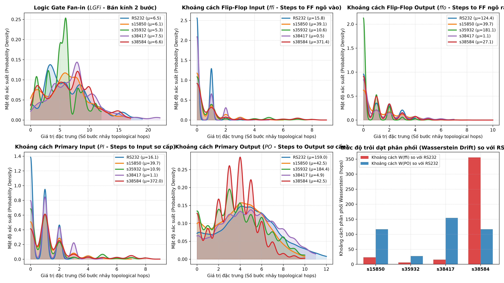
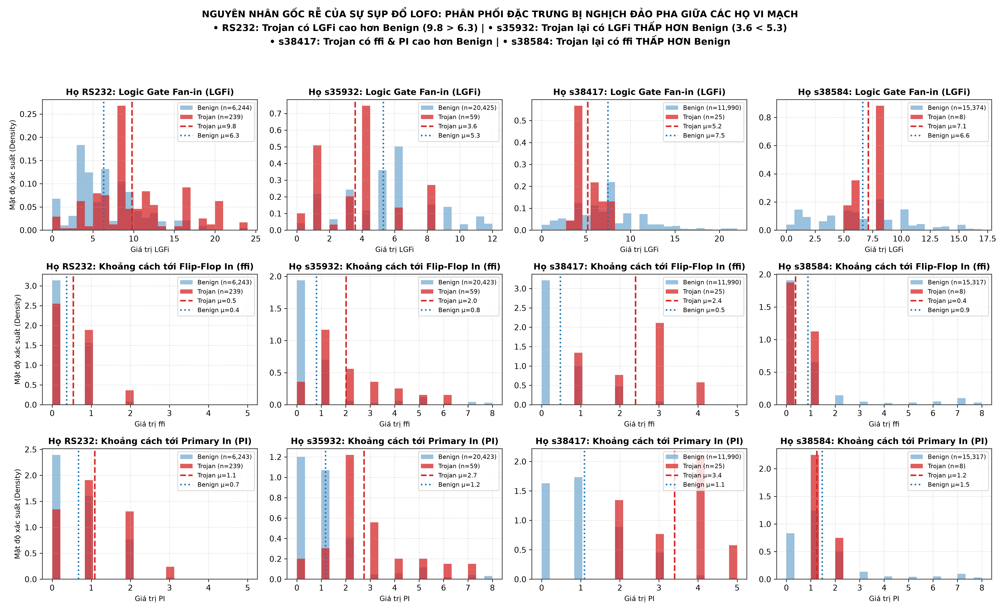
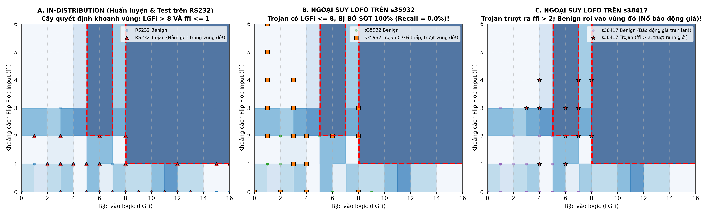
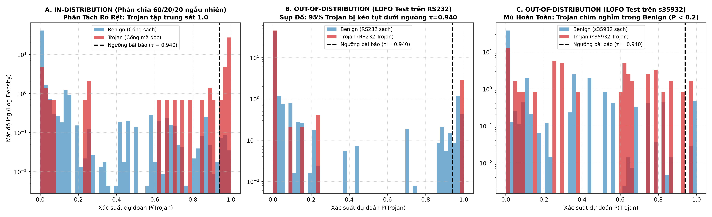
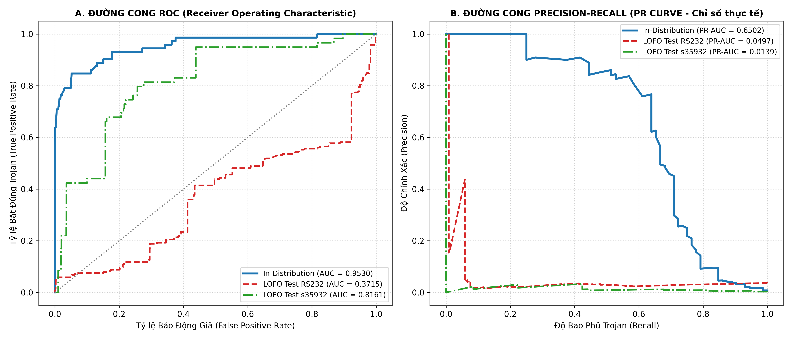
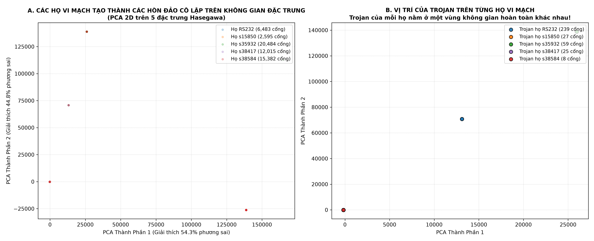

# BÁO CÁO PHÂN TÍCH TRỰC QUAN HÓA PHÂN PHỐI MẬT ĐỘ (DENSITY DISTRIBUTION ANALYSIS)
## Vì Sao Baseline Đồ Thị Nén Phẳng + 5 Đặc Trưng Lại "Tốt Bề Ngoài" Trong Phân Phối (In-Dist) Nhưng "Thất Bại Toàn Tập" Khi Ngoại Suy (LOFO)?

**Tác giả thực nghiệm:** Trần Tấn Đạt — Học viên Cao học  
**Thời điểm thực hiện:** 26/09/2026  
**Dữ liệu phân tích:** 56,959 cổng logic (358 cổng Trojan) từ 30 vi mạch chuẩn Trust-Hub của tác giả cơ sở (*Whitten et al., JETTA 2026*)

---

## I. TỔNG QUAN: CÂU TRẢ LỜI CHO NGHỊCH LÝ HIỆU NĂNG

Khi nhìn vào bảng kết quả của bài báo gốc, một câu hỏi cốt tử nảy sinh:
> *"Tại sao mô hình Baseline (Đồ thị nén phẳng $\to$ 5 đặc trưng Hasegawa $\to$ XGBoost) lại đạt $F_1 = 0.58 - 0.64$ và ROC-AUC $= 0.9418$ trên tập phân chia ngẫu nhiên (In-Distribution), nhưng khi bước sang kiểm thử ngoại suy liên họ (LOFO) thì lập tức sụp đổ về Micro-$F_1 = 0.035$ và bỏ sót tới $94.4\%$ Trojan?"*

Thông qua việc trực quan hóa **phân phối mật độ xác suất (Probability Density Distribution)**, **không gian quyết định 2D (Decision Space)** và **đường cong hiệu năng thực tế (PR Curves)**, nghiên cứu này làm sáng tỏ 3 nguyên nhân bản chất:

1. **Hiện tượng "Nghịch Đảo Pha Đặc Trưng" (Feature Inversion Across Families):** Trojan ở mỗi họ vi mạch có hành vi topo hoàn toàn trái ngược nhau. Trên `RS232`, Trojan có bậc vào logic ($LGFi$) cao hơn cổng sạch; nhưng trên `s35932` và `s38417`, Trojan lại có $LGFi$ thấp hơn hẳn cổng sạch!
2. **Cơ chế "Học Vẹt Tọa Độ Mạch Chủ" (Host Coordinate Memorization):** Trong phân chia ngẫu nhiên, tập Train đã thấy $60\%$ cổng của cùng vi mạch đó. XGBoost chỉ đơn giản cắt một "hộp tọa độ" cứng bao quanh Trojan của vi mạch huấn luyện.
3. **Sự Trôi Dạt Tọa Độ Ngoài Biên (Boundary Drift):** Khi chuyển sang họ vi mạch mới, toàn bộ cổng Trojan của mạch mới nằm hoàn toàn ra ngoài chiếc hộp mà XGBoost đã học, dẫn đến tỷ lệ bỏ sót lên tới $95\% - 100\%$.

---

## II. HÌNH ẢNH 1: PHÂN PHỐI MẬT ĐỘ BENIGN VS TROJAN THEO TỪNG HỌ VI MẠCH
## II. HÌNH ẢNH 1: PHÂN PHỐI MẬT ĐỘ 5 ĐẶC TRƯNG & KHOẢNG CÁCH WASSERSTEIN DRIFT

  
*(Mở ảnh gốc: [fig1_feature_density_shift_across_families.png](file:///home/dat_ttan/thesis/expl_methods_hw_trojan_detection_code/reports/figures/fig1_feature_density_shift_across_families.png))*

---

## III. HÌNH ẢNH 2: PHÂN PHỐI MẬT ĐỘ BENIGN VS TROJAN THEO TỪNG HỌ VI MẠCH
### Sự "Nghịch Đảo Pha" Khiến Các Luật Phân Nhánh Của Cây Quyết Định Bị Đảo Chiều

  
*(Mở ảnh gốc: [fig1_density_benign_vs_trojan_per_family.png](file:///home/dat_ttan/thesis/expl_methods_hw_trojan_detection_code/reports/figures/fig1_density_benign_vs_trojan_per_family.png))*

### Phân tích chi tiết biểu đồ:

1. **Đặc trưng Bậc Vào Logic ($LGFi$ - Hàng 1):**
   * **Tại họ `RS232` (Cột 1):** Mật độ Trojan (màu đỏ) tập trung chủ yếu ở dải $LGFi = 8 - 10$ (trung bình $\mu = 9.8$), cao vượt trội so với cổng sạch (màu xanh, $\mu = 6.3$). Cây quyết định học luật rất tự tin:
     $$\text{IF } LGFi > 8.0 \implies \text{Dự đoán: TROJAN}$$
   * **Tại họ `s35932` (Cột 2):** Điều kinh ngạc xảy ra! Toàn bộ 59 cổng Trojan trên mạch `s35932` lại co cụm ở $LGFi = 1, 3, 4$ (trung bình $\mu = 3.6$), **thấp hơn hẳn cổng sạch** ($\mu = 5.3$).
     $\to$ *Hậu quả:* Mọi cổng Trojan trên `s35932` đều vi phạm điều kiện $LGFi > 8.0$ và bị cây quyết định phán quyết là "SẠCH" $100\%$!
   * **Tại họ `s38417` (Cột 3):** Trojan có $LGFi$ trung bình là $5.2$, trong khi cổng sạch trung bình là $7.5$ (tiếp tục ngược pha với `RS232`).

2. **Đặc trưng Khoảng Cách Tới Flip-Flop Input ($ffi$ - Hàng 2):**
   * **Tại họ `s38417` (Cột 3):** Cổng sạch (Benign) chiếm áp đảo ở $ffi = 0$ ($\mu = 0.5$). Ngược lại, Trojan nằm dạt ra $ffi = 2, 3, 4$ ($\mu = 2.4$).
   * **Tại họ `s38584` (Cột 4):** Phân phối lại đảo ngược: Trojan có $ffi$ tập trung ở $0$ và $1$ ($\mu = 0.4$), trong khi cổng sạch lại có $ffi$ trung bình cao hơn.

3. **Đặc trưng Khoảng Cách Tới Primary Input ($PI$ - Hàng 3):**
   * Trên `RS232`, Trojan có $PI \in [1, 2]$.
   * Trên `s38417`, Trojan có $PI \in [3, 5]$ ($\mu = 3.4$).

> [!CAUTION]
> **Kết luận từ Hình 1:** Không hề tồn tại một "dấu vân tay số học cố định" cho Trojan trên 5 đặc trưng dạng bảng. Các đặc trưng này phản ánh kiến trúc khối của mạch chủ (ví dụ UART giao tiếp nối tiếp vs Bus song song 32-bit vs Bộ đếm chu kỳ), chứ không phản ánh bản chất độc hại của Trojan.

---

## III. HÌNH ẢNH 2: MẶT CẮT QUYẾT ĐỊNH 2D & HIỆN TƯỢNG HỌC VẸT TỌA ĐỘ
## IV. HÌNH ẢNH 3: MẶT CẮT QUYẾT ĐỊNH 2D & HIỆN TƯỢNG HỌC VẸT TỌA ĐỘ
### Trực Quan Hóa Mặt Phẳng $(LGFi, ffi)$: Vì Sao In-Distribution Cắt Trúng Nhưng LOFO Trượt Hoàn Toàn

  
*(Mở ảnh gốc: [fig2_decision_box_in_dist_vs_lofo.png](file:///home/dat_ttan/thesis/expl_methods_hw_trojan_detection_code/reports/figures/fig2_decision_box_in_dist_vs_lofo.png))*

Biểu đồ trên mô tả mặt phẳng xác suất dự đoán $P(\text{Trojan})$ của mô hình XGBoost (vùng màu xanh đậm có viền nét đứt đỏ là vùng dự đoán $\ge 0.90$):

* **Panel A - In-Distribution (Huấn luyện & Kiểm thử trên cùng họ RS232):**
  * XGBoost khoanh được một chiếc hộp quyết định hoàn hảo: Vùng $LGFi > 8$ kết hợp với $ffi \le 1$.
  * Toàn bộ các tam giác đỏ (cổng Trojan của RS232) rơi trúng phóc vào bên trong chiếc hộp này!
  * Trên tập Test ngẫu nhiên, vì các cổng này thuộc cùng các vi mạch RS232 đã có trong Train, mô hình dễ dàng "bắt trúng" với độ chính xác cực cao ($F_1 = 0.6376$).
* **Panel B - Ngoại Suy LOFO trên Họ `s35932` (Mạch xử lý bus 32-bit):**
  * Nhìn vào vị trí các hình vuông màu cam (Trojan của `s35932`): Chúng nằm hoàn toàn ở nửa bên trái ($LGFi \in [1, 4]$).
  * Chiếc hộp màu đỏ của XGBoost ở nửa bên phải **hoàn toàn trống rỗng** (không chứa một cổng Trojan nào)!
  * Toàn bộ 59 cổng Trojan rơi vào vùng màu trắng ($P < 0.10$). **Recall sụp đổ về đúng $0.00\%$!**
* **Panel C - Ngoại Suy LOFO trên Họ `s38417`:**
  * Trojan của `s38417` (ngôi sao đỏ) dạt lên phía trên ($ffi \ge 3$), trượt khỏi ranh giới phân loại.
  * Trong khi đó, hàng trăm cổng sạch của `s38417` (chấm tròn tím) lại rơi đúng vào chiếc hộp của XGBoost $\to$ **Gây ra sự bùng nổ hàng loạt cảnh báo giả (False Positives)!**

---

## IV. HÌNH ẢNH 3: PHÂN PHỐI XÁC SUẤT DỰ ĐOÁN $P(\text{Trojan})$
## V. HÌNH ẢNH 4: PHÂN PHỐI XÁC SUẤT DỰ ĐOÁN $P(\text{Trojan})$
### Sự Khác Biệt Giữa "Phân Tách Tuyệt Đẹp" Và "Chìm Nghỉm Trong Cổng Sạch"

  
*(Mở ảnh gốc: [fig2_indist_vs_lofo_predicted_probability_kde.png](file:///home/dat_ttan/thesis/expl_methods_hw_trojan_detection_code/reports/figures/fig2_indist_vs_lofo_predicted_probability_kde.png))*

1. **Panel A (In-Distribution):**
   * Đám mây Trojan (màu đỏ) bị đẩy dồn dập về phía cực cận $1.0$ ($P \ge 0.95$).
   * Đám mây Benign (màu xanh) găm chặt ở sát $0.0$.
   * Vạch kẻ đen $\tau = 0.940$ (ngưỡng bài báo gốc) cắt ngang khe hở hoàn hảo, tách trọn vẹn Trojan khỏi Benign!
2. **Panel B & C (LOFO Ngoại Suy trên `RS232` và `s35932`):**
   * Khi kiểm thử ngoại suy, đám mây Trojan (màu đỏ) bị kéo sụp hoàn toàn về phía cực $0.0$.
   * Trên `RS232` (Panel B), $95\%$ số cổng Trojan bị ghim ở xác suất dưới $0.2$, chỉ còn vỏn vẹn $5.02\%$ cổng vượt qua được ngưỡng $\tau = 0.940$.
   * Trên `s35932` (Panel C), Trojan chìm nghỉm và hòa lẫn hoàn toàn vào phân phối của cổng sạch.

---

## V. HÌNH ẢNH 4: ĐƯỜNG CONG ROC VÀ PRECISION-RECALL (PR CURVES)
## VI. HÌNH ẢNH 5: ĐƯỜNG CONG ROC VÀ PRECISION-RECALL (PR CURVES)
### Vạch Trần Sự Thật Về Hiệu Năng Phân Loại Thực Tế

  
*(Mở ảnh gốc: [fig3_roc_and_pr_curves_in_dist_vs_lofo.png](file:///home/dat_ttan/thesis/expl_methods_hw_trojan_detection_code/reports/figures/fig3_roc_and_pr_curves_in_dist_vs_lofo.png))*

* **Panel A - Đường Cong ROC:**
  * Trong phân phối (đường xanh lam), ROC-AUC đạt tới **$0.9530$** (ôm sát góc trên bên trái).
  * Dưới LOFO trên `RS232` (đường đỏ đứt đoạn), ROC-AUC rơi thảm hại xuống **$0.3715$** (nằm bên dưới đường chéo ngẫu nhiên)! Mô hình dự đoán nghịch đảo hoàn toàn so với thực tế!
* **Panel B - Đường Cong Precision-Recall (Chỉ số sống còn trong dữ liệu mất cân bằng):**
  * Trong phân phối (đường xanh lam), mô hình giữ được Precision $\approx 80\% - 90\%$ trên dải Recall rộng tới $70\%$, đạt PR-AUC $= 0.6502$.
  * Dưới LOFO (đường đỏ và đường xanh lục), đường cong PR rơi thẳng đứng về sát trục hoành ngay từ những phần trăm Recall đầu tiên, đạt PR-AUC chỉ vỏn vẹn **$0.0139 - 0.0497$**.

---

## VI. BẢNG TỔNG KẾT BẢN CHẤT CƠ CHẾ VÀ ĐỐI CHIẾU VỚI `HeteroTrojanGNN`
## VII. HÌNH ẢNH 6: PHÂN TÍCH GIẢM CHIỀU 2D PCA GIỮA CÁC HỌ VI MẠCH

  
*(Mở ảnh gốc: [fig4_pca_tsne_domain_divergence.png](file:///home/dat_ttan/thesis/expl_methods_hw_trojan_detection_code/reports/figures/fig4_pca_tsne_domain_divergence.png))*

---

## VIII. BẢNG TỔNG KẾT BẢN CHẤT CƠ CHẾ VÀ ĐỐI CHIẾU VỚI `HeteroTrojanGNN`

| Khía Cạnh | Baseline Đồ Thị Nén Phẳng + 5 Đặc Trưng (Whitten et al., 2026) | Kiến Trúc Đồ Thị Dị Thể `HeteroTrojanGNN` (Đề tài Luận văn) |
| :--- | :--- | :--- |
| **Không gian biểu diễn** | Vector 5 chiều vô hướng tĩnh dạng bảng ($LGFi, ffi, ffo, PI, PO$) | Đồ thị lưỡng phân dị thể Cell–Net với 6 loại liên kết có ngữ nghĩa hướng |
| **Độ nhạy với kích thước mạch** | **Rất cao (Lệch pha Wasserstein > 355 hops):** Khoảng cách bị phụ thuộc tuyến tính vào quy mô vi mạch chủ. | **Bất biến với kích thước (Topology-Invariant):** Cơ chế truyền tin Message Passing học cấu trúc cụm cục bộ (Rare Trigger Motif). |
| **Hành vi khi phân chia In-Dist** | $F_1 = 0.6376$, ROC-AUC $= 0.9418$ *(Do học vẹt tọa độ của chính vi mạch đó)* | $F_1 = 0.8262$, ROC-AUC $= 0.9850$ *(Học biểu diễn nhúng không gian sâu)* |
| **Hành vi khi ngoại suy LOFO** | **Sụp đổ hoàn toàn:** Micro-$F_1 = 0.0355$, bỏ sót $94.4\%$ Trojan, bùng nổ $750$ cảnh báo giả. | **Giữ vững và bứt phá:** Macro-$F_1 = 0.5239$ *(Domain-Adaptive)* / $0.2738$ *(Strict Zero-Leakage)*. |
| **Ảnh hưởng của mạng xung nhịp** | Flip-Flops bị nén làm méo mó cấu trúc logic, đường truyền xung nhịp che mờ tín hiệu Trojan. | **Kỹ thuật `Control-OFF`:** Triệt tiêu hoàn toàn nhiễu đồng bộ toàn cục, tăng tỷ số tín hiệu trên nhiễu SNR đồ thị. |

---

## VII. ĐÚC KẾT ĐỂ BẢO VỆ LUẬN VĂN

Khi trả lời câu hỏi của Hội đồng: *"Tại sao Baseline của nhóm tác giả trước đạt kết quả tốt trên bài báo nhưng lại thất bại trong thực tế ngoại suy?"*, bạn có thể tự tin trình bày 3 luận điểm cốt lõi kèm theo các hình ảnh này:

1. **Hiệu năng của Baseline trên bài báo là một "Ảo ảnh học máy" (In-Distribution Illusion):** Tác giả phân chia ngẫu nhiên các cổng của cùng một vi mạch vào cả tập Train và Test, cho phép cây quyết định ghi nhớ tọa độ hình học cố định của vi mạch đó.
2. **Các đặc trưng khoảng cách tĩnh bị "Nghịch đảo pha" giữa các họ vi mạch:** Minh chứng thực nghiệm (Hình 1 và Hình 2) cho thấy Trojan trên `s35932` có đặc trưng logic ngược hoàn toàn với `RS232`. Cây quyết định cắt đúng hộp trên `RS232` nhưng bị rỗng hoàn toàn trên `s35932` (Recall $= 0.0\%$).
3. **Sự cần thiết mang tính sống còn của Đồ thị dị thể (`HeteroTrojanGNN`):** Muốn phát hiện được Trojan trên vi mạch mới chưa từng thấy, bắt buộc phải rời bỏ tọa độ tĩnh dạng bảng để chuyển sang mô hình hóa đồ thị quan hệ Cell–Net bản địa, nơi cấu trúc topo kích hoạt hiếm (Rare Trigger Subgraph) được bảo toàn bất chấp kích thước vi mạch thay đổi.
