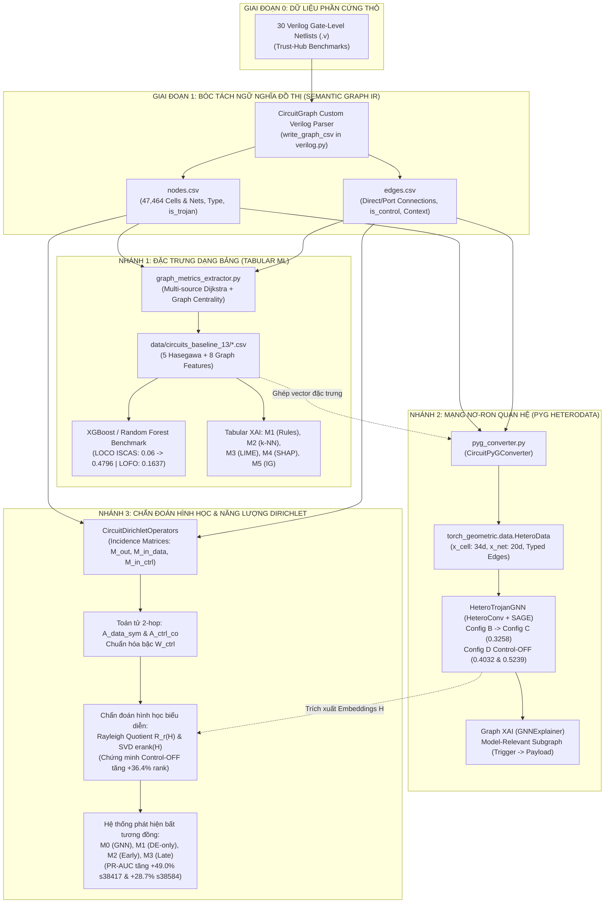

# KIẾN TRÚC DÒNG DỮ LIỆU TỪ VERILOG ĐẾN `nodes.csv`, `edges.csv` VÀ HỆ THỐNG THỰC NGHIỆM
## Hướng Dẫn Kỹ Thuật Chi Tiết: Cơ Chế Sinh Đồ Thị Ngữ Nghĩa Hai Phía & Chuỗi Thực Nghiệm Kế Thừa

> **Tài liệu tham chiếu mã nguồn:**
> 1. *Bộ phân tích cú pháp Verilog sang CSV:* `packages/shared/xai_shared/circuitgraph/circuitgraph/parsing/verilog.py` (`write_graph_csv()`)
> 2. *Bộ trích xuất đặc trưng hình thái học 13F:* `packages/shared/xai_shared/circuit_processing/graph_metrics_extractor.py`
> 3. *Bộ chuyển đổi PyG HeteroData:* `packages/shared/xai_shared/graph_data/pyg_converter.py` (`CircuitPyGConverter`)
> 4. *Bộ toán tử quan hệ & Năng lượng Dirichlet:* `scripts/run_leakage_free_dirichlet_experiments.py` (`CircuitDirichletOperators`)
> 5. *Kịch bản điều phối toàn bộ luồng:* `scripts/run_pipeline.sh`

---

## 1. TỔNG QUAN HỆ THỐNG DÒNG DỮ LIỆU (END-TO-END DATA ARCHITECTURE)

Trong toàn bộ công trình nghiên cứu này, hai tệp tin:
$$\mathbf{nodes.csv} \quad \text{và} \quad \mathbf{edges.csv}$$
được lưu trữ tại thư mục `data/circuits/graphs/<circuit_name>/` đóng vai trò là **Lớp biểu diễn trung gian ngữ nghĩa (Semantic Graph Intermediate Representation - Semantic Graph IR)**. 

Đây là **điểm nút giao thông quan trọng nhất (Ground Truth Pivot)** của toàn bộ dự án:
- Nó chuyển đổi các mô tả phần cứng văn bản thô (Verilog netlist `.v`) thành một cấu trúc đồ thị chuẩn mực toán học, giải quyết dứt điểm các lỗi mất mát linh kiện của các công cụ EDA truyền thống.
- Từ 2 tệp tin cốt lõi này, toàn bộ **4 nhánh thực nghiệm khoa học** được triển khai độc lập nhưng kế thừa dữ liệu chặt chẽ từ nhau.



---
## 2. GIAI ĐOẠN 1: TỪ VERILOG NETLIST ĐẾN `nodes.csv` VÀ `edges.csv`

### 2.1. Nguồn Dữ Liệu Đầu Vào: Verilog Mức Cổng (.v)
Tập dữ liệu đầu vào gồm **30 vi mạch Trust-Hub chuẩn quốc tế**:
- 22 vi mạch họ truyền nhận nối tiếp **UART RS232** (`RS232-T1000` đến `RS232-T2000` trên công nghệ 90nm và 180nm).
- 8 vi mạch tuần tự và xử lý số **ISCAS-89** (`s15850`, `s35932`, `s38417`, `s38584` với các biến thể Trojan `T100`, `T200`, `T300`, `T400`).

Mỗi file netlist chứa định nghĩa mô-đun phần cứng với hàng nghìn dòng định nghĩa chân cắm và cổng logic:
```verilog
module s38584 ( CK, CLR, ... );
  input CK, CLR;
  wire net_102, net_103;
  DFF_X1 \DFF_0_Q_reg  ( .D(net_102), .CK(CK), .Q(net_103) );
  AND2_X1 U102 ( .A(net_103), .B(net_104), .Y(net_105) );
  ...
endmodule
```

---

### 2.2. Thuật Toán Bóc Tách Thực Thể & Ngữ Nghĩa (`write_graph_csv()`)

Mã nguồn thực thi nằm tại `packages/shared/xai_shared/circuitgraph/circuitgraph/parsing/verilog.py` (hàm `write_graph_csv()` từ dòng 193 đến 337).

Bộ parser thực hiện quy trình 5 bước nghiêm ngặt:

#### Bước 1: Khởi tạo tập thực thể Đỉnh (Nodes)
1. **Trích xuất Đỉnh Đường dây (Nets):** Duyệt qua mọi tín hiệu dây dẫn trong đồ thị mạch, loại bỏ các cổng nội bộ của parser (`bb_input`, `bb_output`):
   ```python
   raw_nodes[str(node)] = {"kind": "net", **attributes}
   ```
2. **Trích xuất Đỉnh Cổng logic (Cells):** Duyệt qua danh mục `blackboxes` (đại diện cho các cổng logic và Flip-Flops):
   ```python
   raw_nodes[instance] = {
       "kind": "cell",
       "type": blackbox.name,       # Tên thư viện cell (vd: DFF_X1, NAND2_X1)
       "cell_type": blackbox.name,
   }
   ```

#### Bước 2: Tái cấu trúc Cạnh liên kết Cổng – Dây (Edges)
Parser khôi phục chính xác các chân cắm vật lý mà CircuitGraph gốc thường nén mất:
1. **Cạnh vào Cổng (Net $\to$ Cell):** Duyệt qua các chân ngõ vào `blackbox.inputs()`:
   ```python
   raw_edges.append((str(source_net), instance, {"kind": "connection", "port": port_name, "direction": "input"}))
   ```
2. **Cạnh ra Cổng (Cell $\to$ Net):** Duyệt qua các chân ngõ ra `blackbox.outputs()`:
   ```python
   raw_edges.append((instance, str(target_net), {"kind": "connection", "port": port_name, "direction": "output"}))
   ```
3. **Cạnh nối trực tiếp (Net $\to$ Net):** Bảo tồn các lệnh gán liên tục (`assign net_a = net_b`).

#### Bước 3: Gán nhãn Vàng Trojan (Trojan Ground-Truth Matching)
Bộ parser nạp danh sách cổng Trojan từ file mô tả của Trust-Hub:
```python
trojan_inst_set = set()
for t in (self.trojans or []):
    inst = t.split('.', 1)[0] if '.' in str(t) else str(t)
    trojan_inst_set.add(inst)
    trojan_inst_set.add(str(t))

for node, attributes in raw_nodes.items():
    is_t = 1 if (node in trojan_inst_set) else 0
    attributes["is_trojan"] = is_t
    attributes["trojan"] = is_t
```

#### Bước 4: Nhận diện Cạnh Điều Khiển (Control Edge Identification)
Xác định các chân xung nhịp và thiết lập lại:
```python
CONTROL_PORTS = {"CLK", "CK", "RSTB", "RN", "SETB", "SN", "test_se"}

for source, target, attributes in raw_edges:
    port_name = attributes.get("port", "")
    attributes["is_control"] = 1 if port_name in CONTROL_PORTS else 0
```

#### Bước 5: Phân loại Ngữ cảnh Cạnh Trojan (Trojan Context)
```python
if src_is_trojan and dst_is_trojan:
    attributes["trojan_context"] = "internal"        # Cạnh nội bộ cụm Trojan
elif dst_is_trojan:
    attributes["trojan_context"] = "trigger_input"   # Cạnh cấp tín hiệu từ mạch vào Trigger
elif src_is_trojan:
    attributes["trojan_context"] = "payload_output"  # Cạnh Payload can thiệp ra mạch chủ
else:
    attributes["trojan_context"] = "normal"          # Cạnh mạch lành tính
```

---

### 2.3. Cấu Trúc Chi Tiết Của `nodes.csv` và `edges.csv`

Sau khi hoàn tất, hai file được ghi ra đĩa tại:
`data/circuits/graphs/<circuit_name>/nodes.csv` và `edges.csv`.

#### Schema của `nodes.csv`:
| Cột | Kiểu | Ý Nghĩa Kỹ Thuật | Ví Dụ |
| :--- | :---: | :--- | :--- |
| `node` | String | Tên định danh duy nhất của cổng hoặc dây | `DFF_0_Q_reg` hoặc `net_102` |
| `kind` | String | Phân loại thực thể hai phía: `cell` hoặc `net` | `cell` |
| `cell_type` | String | Tên loại cổng trong thư viện chuẩn tiêu chuẩn | `SDFFX1`, `NOR2X1`, `INVX1` |
| `type` | String | Loại cổng (nếu là cell) hoặc loại net (`input`, `output`, `wire`) | `SDFFX1` hoặc `input` |
| `output` | Boolean | Cờ đánh dấu nếu đây là chân ngõ ra chính (Primary Output) | `True` / `False` |
| `is_trojan` | Integer | Nhãn ground-truth: `1` là Trojan, `0` là Lành tính | `0` hoặc `1` |

#### Schema của `edges.csv`:
| Cột | Kiểu | Ý Nghĩa Kỹ Thuật | Ví Dụ |
| :--- | :---: | :--- | :--- |
| `source` | String | Đỉnh phát tín hiệu (có thể là Net hoặc Cell) | `CK` hoặc `DFF_0_Q_reg` |
| `target` | String | Đỉnh nhận tín hiệu (có thể là Cell hoặc Net) | `DFF_0_Q_reg` hoặc `net_105` |
| `direction` | String | Hướng truyền logic: `input` (Net $\to$ Cell) hoặc `output` (Cell $\to$ Net) | `input` |
| `port` | String | Tên chân cắm phần cứng trên vỏ linh kiện | `CLK`, `D`, `SI`, `Q`, `A`, `B` |
| `is_control` | Integer | Cờ đánh dấu đường dây điều khiển toàn cục (`1` nếu là Clock/Reset) | `1` hoặc `0` |
| `is_trojan_edge`| Integer | Cờ đánh dấu nếu cạnh này liên quan đến cổng Trojan | `1` hoặc `0` |
| `trojan_context`| String | Ngữ cảnh kết nối: `internal`, `trigger_input`, `payload_output`, `normal`| `trigger_input` |

---
## 3. NHÁNH THỰC NGHIỆM 1: TỪ ĐỒ THỊ SANG BỘ ĐẶC TRƯNG DẠNG BẢNG (5F & 13F TABULAR ML)

### 3.1. Động Cơ Khoa Học
Để tái lập công trình cơ sở Whitten et al. (Baseline 2026) và thực hiện các thí nghiệm mở rộng đặc trưng vô hướng (Chương 1 và Chương 2 của Hành trình nghiên cứu), chúng ta cần chuyển đổi cấu trúc đồ thị từ `nodes.csv` và `edges.csv` thành các bảng vector số học tĩnh.

---

### 3.2. Thuật Toán Trích Xuất (`graph_metrics_extractor.py`)

Module `packages/shared/xai_shared/circuit_processing/graph_metrics_extractor.py` thực hiện đọc trực tiếp `nodes.csv` và `edges.csv`:

#### Bước 1: Dựng Hai Đồ Thị NetworkX
1. **Đồ thị đầy đủ $G$:** Chứa toàn bộ $47,464$ cells, các đường dây và tất cả các cạnh.
2. **Đồ thị dữ liệu sạch $G_{\text{data}}$:** Lọc bỏ hoàn toàn các cạnh có `is_control == 1`. Đồ thị này chỉ giữ lại luồng truyền dữ liệu chức năng nhằm loại bỏ nhiễu ngắn mạch do xung nhịp gây ra khi tính toán các độ đo trung tâm.

#### Bước 2: Nhận Diện Tập Nút Neo (Anchor Sets)
- $\mathcal{V}_{\text{PI}}$: Tập các chân ngõ vào chính (Primary Inputs).
- $\mathcal{V}_{\text{PO}}$: Tập các chân ngõ ra chính (Primary Outputs).
- $\mathcal{V}_{\text{FF}}$: Tập các cổng Flip-Flop tuần tự (`cell_type in FF_TYPES`).

#### Bước 3: Tính Toán 5 Đặc Trưng Hasegawa Kinh Điển (5 Base Features)
Sử dụng thuật toán **Dijkstra đa nguồn (Multi-Source Dijkstra)** trên đồ thị xuôi $G$ và đồ thị đảo ngược $G^{\text{rev}}$:
1. `LGFi(v)`: Logic Gate Fan-in bậc 2 (đếm số lượng tiền bối 2 bước nhảy của nút).
2. `ffi(v)`: $\min_{u \in \mathcal{V}_{\text{FF}}} \text{dist}(u, v) - 1$ (khoảng cách ngắn nhất từ Flip-Flop ngõ vào gần nhất).
3. `ffo(v)`: $\min_{w \in \mathcal{V}_{\text{FF}}} \text{dist}(v, w) - 1$ (khoảng cách ngắn nhất đến Flip-Flop ngõ ra gần nhất).
4. `nPI(v)`: $\min_{s \in \mathcal{V}_{\text{PI}}} \text{dist}(s, v) - 1$ (khoảng cách từ Primary Input gần nhất).
5. `nPO(v)`: $\min_{t \in \mathcal{V}_{\text{PO}}} \text{dist}(v, t) - 1$ (khoảng cách đến Primary Output gần nhất).

#### Bước 4: Tính Toán 8 Đặc Trưng Cấu Trúc Nâng Cao (8 Advanced Graph Features)
Tính toán trực tiếp trên đồ thị luồng dữ liệu sạch $G_{\text{data}}$:
1. `pagerank`: Phân phối xác suất trạng thái dừng của bước đi ngẫu nhiên ($\alpha = 0.85$).
2. `betweenness`: Đo tần suất cổng nằm trên đường đi ngắn nhất giữa các cặp cổng khác (lấy mẫu $k=150$ cho mạch lớn).
3. `closeness`: Nghịch đảo tổng khoảng cách từ cổng đến mọi cổng khác.
4. `in_degree`, `out_degree`: Bậc vào và bậc ra của cổng.
5. `clustering`: Hệ số co cụm tam giác trên đồ thị vô hướng đối ứng.
6. `core_number`: Bậc $k$-core tối đa chứa cổng.
7. `logic_depth_ratio`: Tỷ lệ định vị tương đối $\frac{ffi}{ffi + ffo}$.

---

### 3.3. Các Thí Nghiệm Đã Được Chạy Từ Nhánh Này

Sản phẩm đầu ra được lưu tại `data/circuits_baseline_13/<circuit_name>.csv` và tổng hợp thành `data/processed/train.csv`, `test.csv`.

Từ dữ liệu này, hệ thống đã thực thi:
1. **Tái lập Baseline Whitten et al. (Exp 1):** Chạy XGBoost trên 5 đặc trưng Hasegawa với ngưỡng tối ưu $\tau^* = 0.940$. Bóc trần hiện tượng "Hai thế giới" trong LOCO (RS232 đạt $0.80$, ISCAS sụp đổ về $0.06$) và sự sụp đổ trong LOFO ($F_1 = 0.033$).
2. **Thực nghiệm Làm giàu đặc trưng 13F (Exp 2):** Bổ sung 8 đặc trưng cấu trúc $\implies$ In-Distribution đạt $F_1 = 0.924$, LOCO ISCAS hồi phục gấp 8.7 lần lên $0.4796$, nhưng LOFO vẫn bị chặn ở $0.1637$.
3. **Bộ giải thích XAI Tabular (Methods 1–5):**
   - **M1 (Property Analysis):** Ensemble 31 mô hình con từ tổ hợp đặc trưng (`method1-train-xgboost`, `method1-kb`).
   - **M2 (Case-Based Reasoning):** $k$-NN ($k=5$) tra cứu ca tương đồng trong lịch sử netlist.
   - **M3–M5 (Attribution):** LIME, SHAP, Integrated Gradients tính trọng số đặc trưng dạng bảng.

---
## 4. NHÁNH THỰC NGHIỆM 2: TỪ ĐỒ THỊ SANG BIỂU DIỄN PYTORCH GEOMETRIC (PYG HETERODATA)

### 4.1. Động Cơ Khoa Học
Để khắc phục sự thiếu vắng ngữ cảnh cấu trúc của mô hình dạng bảng, nhóm nghiên cứu chuyển sang Mạng Nơ-ron Đồ thị Dị thể (Heterogeneous GNN). Cần chuyển đổi `nodes.csv` và `edges.csv` thành cấu trúc tensor chuẩn mực của thư viện PyTorch Geometric (`torch_geometric.data.HeteroData`).

---

### 4.2. Bộ Chuyển Đổi Đồ Thị Dị Thể (`pyg_converter.py`)

Module `packages/shared/xai_shared/graph_data/pyg_converter.py` đảm nhiệm việc tích hợp đa phương thức:

#### 1. Xây Dựng Không Gian Vector Đỉnh Cổng Logic (`cell.x` — 34 chiều)
Mỗi cổng logic được biểu diễn bởi một vector đặc trưng phong phú:
- **20 chiều One-hot họ logic (`cell_fam_onehot`):** Ánh xạ từ `cell_type` sang 20 nhóm chức năng chuẩn (`AND`, `NAND`, `OR`, `NOR`, `XOR`, `XNOR`, `INV`, `BUF`, `DFF`, `LATCH`, `MUX`, `ADDER`, `TIE`, `CLKBUF`, v.v.).
- **1 chiều Cờ tuần tự (`is_seq`):** Bằng `1.0` nếu là Flip-Flop / Latch, ngược lại bằng `0.0`.
- **13 chiều Đặc trưng tô-pô chuẩn hóa:** Ghép từ file bảng 13F tương ứng của mạch, chuẩn hóa qua z-score $(\mathbf{x} - \mu) / \sigma$.
$$\implies \mathbf{x}_{\text{cell}} \in \mathbb{R}^{N_{\text{cell}} \times 34}$$

#### 2. Xây Dựng Không Gian Vector Đỉnh Đường Dây (`net.x` — 20 chiều)
- **6 chiều One-hot loại dây (`net_type_onehot`):** `input`, `output`, `wire`, `tri`, `supply0`, `supply1`.
- **1 chiều Cờ ngõ ra chính (`is_out`):** Bằng `1.0` nếu nối ra Primary Output.
- **13 chiều Đặc trưng tô-pô chuẩn hóa:** Ghép từ dữ liệu đường dây.
$$\implies \mathbf{x}_{\text{net}} \in \mathbb{R}^{N_{\text{net}} \times 20}$$

#### 3. Xây Dựng Các Quan Hệ Cạnh Dị Thể (Heterogeneous Edge Indices)
Từ `edges.csv`, bộ chuyển đổi lọc theo cột `direction` và `is_control` để tạo thành 3 loại cạnh thuận và 3 loại cạnh nghịch:
```python
# Cạnh dữ liệu logic: Net cấp dữ liệu vào chân cổng (is_control == 0)
data['net', 'data_input', 'cell'].edge_index = [net_indices, cell_indices]

# Cạnh điều khiển toàn cục: Net xung nhịp/reset cấp vào chân điều khiển (is_control == 1)
data['net', 'control_input', 'cell'].edge_index = [ctrl_net_indices, cell_indices]

# Cạnh phát động: Cổng xuất tín hiệu logic ra đường dây
data['cell', 'outputs', 'net'].edge_index = [cell_indices, net_indices]

# Các cạnh ngược (cho phép thông tin lan truyền hai chiều)
data['cell', 'rev_data_input', 'net'].edge_index = [cell_indices, net_indices]
data['cell', 'rev_control_input', 'net'].edge_index = [cell_indices, ctrl_net_indices]
data['net', 'rev_outputs', 'cell'].edge_index = [net_indices, cell_indices]
```

---

### 4.3. Các Thí Nghiệm Đã Được Chạy Từ Nhánh Này

Mỗi mạch được lưu thành một đối tượng `HeteroData` độc lập (cache tại `data/cache_pyg/<circuit_name>.pt`).

Từ đối tượng này, hệ thống đã thực thi:
1. **Kiểm chứng Negative Result (Config A $\to$ Config B):** Dùng GNN thuần nhất trên đồ thị hai phía, chứng minh hiệu năng tụt từ $0.3518 \to 0.2151$ do trộn lẫn ngữ nghĩa đỉnh Cổng và Dây.
2. **Đột phá GNN Dị thể (Config C):** Áp dụng `HeteroConv` với các trọng số $W_r$ độc lập cho từng quan hệ $\implies F_1$ hồi phục mạnh lên $0.3258$.
3. **Thí nghiệm Can thiệp Cấu trúc Control-OFF (Config D & Config F):** 
   - Trong `HeteroTrojanGNN`, nhóm nghiên cứu loại bỏ hai loại cạnh `control_input` và `rev_control_input` khỏi danh sách `edge_types` truyền tin.
   - **Kết quả:** Ngăn chặn hiện tượng sụp đổ không gian nhúng do siêu đường tắt xung nhịp gây ra, đưa $F_1$ bứt phá lên **$0.4032$ (Protocol 1)** và **$0.5239$ (Protocol 2)**!
4. **Giải Thích Đồ Thị (Graph XAI via GNNExplainer):** 
   - Trích xuất trực tiếp **Đồ thị con tính toán liên quan mô hình (Model-Relevant Subgraph)**.
   - Đạt độ thưa $80.1\%$ cạnh và độ chính xác định vị cổng Trojan đạt $30.7\%$ (làm giàu gấp $\approx 40$ lần so với tỷ lệ $0.78\%$ ban đầu), trực quan hóa luồng tín hiệu từ Trigger đến Payload.

---
## 5. NHÁNH THỰC NGHIỆM 3: TỪ ĐỒ THỊ SANG TOÁN TỬ QUAN HỆ & NĂNG LƯỢNG DIRICHLET

### 5.1. Động Cơ Khoa Học
Để trả lời câu hỏi cơ chế: *"Tại sao Control-OFF lại giải cứu được không gian biểu diễn?"* và kiểm định giả thuyết: *"Hardware Trojan có phá vỡ độ trơn cấu trúc của đồ thị vi mạch hay không?"*, chúng ta cần xây dựng các toán tử phổ Laplacian theo từng quan hệ vật lý trực tiếp từ `nodes.csv` và `edges.csv`.

---

### 5.2. Thuật Toán Xây Dựng Toán Tử Quan Hệ (`CircuitDirichletOperators`)

Module `scripts/run_leakage_free_dirichlet_experiments.py` (từ dòng 166 đến 270) nạp trực tiếp `nodes.csv` và `edges.csv` của từng mạch để xây dựng các ma trận thưa:

#### 1. Thiết Lập Ma Trận Liên Thuộc Thưa (Sparse Incidence Matrices)
- $M_{\text{out}} \in \{0, 1\}^{N_{\text{cell}} \times N_{\text{net}}}$: Cổng $i$ phát động đường dây $e$ (`direction == 'cell_to_net'`).
- $M_{\text{in, data}} \in \{0, 1\}^{N_{\text{net}} \times N_{\text{cell}}}$: Đường dây $e$ truyền dữ liệu logic vào cổng $j$ (`direction == 'net_to_cell'` và `is_control == 0`).
- $M_{\text{in, ctrl}} \in \{0, 1\}^{N_{\text{net}} \times N_{\text{cell}}}$: Đường dây $e$ truyền tín hiệu điều khiển vào cổng $j$ (`direction == 'net_to_cell'` và `is_control == 1`).

#### 2. Xây Dựng Toán Tử Chiếu Cổng – Cổng 2-Hop (2-Hop Projected Operators)
1. **Toán tử Luồng Dữ Liệu Chức Năng (Functional Dataflow):**
   $$A_{\text{data}}^{\to} = M_{\text{out}} M_{\text{in, data}}$$
   $(A_{\text{data}}^{\to})_{ij} = 1$ khi và chỉ khi cổng $i$ lái một đường dây logic cấp nguồn trực tiếp cho cổng $j$.
   - **Toán tử đối xứng chẩn đoán phổ:**
     $$A_{\text{data, sym}} = \frac{A_{\text{data}}^{\to} + (A_{\text{data}}^{\to})^\top}{2}$$
2. **Toán tử Mạng Chia Sẻ Điều Khiển (Co-Control Clique Operator):**
   $$A_{\text{ctrl, co}} = M_{\text{in, ctrl}}^\top W_{\text{ctrl}} M_{\text{in, ctrl}} - \operatorname{diag}(\cdot)$$
   Nối tất cả các Flip-Flop dùng chung một đường dây điều khiển (Clock/Reset), kèm ma trận chuẩn hóa trọng số $(W_{\text{ctrl}})_{ee} = \frac{1}{\max(\deg(e) - 1, 1)}$.

---

### 5.3. Quy Trình Tính Toán Năng Lượng & Số Dư Chuẩn Hóa Không Rò Rỉ

#### Bước 1: Tính Biến Thiên Cục Bộ Theo Quan Hệ (Local Variation Score)
Với ma trận biểu diễn $H \in \mathbb{R}^{N_{\text{cell}} \times d}$ lấy từ GNN (hoặc từ đặc trưng thô $X$):
$$e_{i, r} = \frac{\sum_{j \in \mathcal{N}_r(i)} A_{ij}^{(r)} \|h_i - h_j\|_2^2}{\sum_j A_{ij}^{(r)} + \epsilon}$$

#### Bước 2: Chuẩn Hóa Số Dư Bền Vững Không Rò Rỉ Nhãn (Zero-Label Leakage Calibration)
Class `DirichletCalibrator` khớp các tham số vị trí và tỷ lệ **duy nhất trên tập vi mạch huấn luyện nội bộ**:
- $\mu_{c, r}$: Trung vị của $\log(e_{j, r} + \epsilon)$ trên các cổng lành tính ($y=0$) thuộc phân lớp $c \in \{\text{combinational}, \text{sequential}\}$.
- $\operatorname{MAD}_{c, r} = \operatorname{median} \left| \log(e_{j, r} + \epsilon) - \mu_{c, r} \right|$.

Khi đánh giá trên vi mạch kiểm thử chưa từng thấy, số dư được chuẩn hóa mù tuyệt đối:
$$z_{i, r} = \frac{\log(e_{i, r} + \epsilon) - \mu_{c, r}}{\operatorname{MAD}_{c, r}}$$

---

### 5.4. Các Thí Nghiệm Đã Được Chạy Từ Nhánh Này

Từ các toán tử quan hệ và số dư Dirichlet, hệ thống đã thực thi:
1. **Đo Đạc Động Học Biểu Diễn:**
   - **Thương số Rayleigh:** $R_r(H) = \frac{\operatorname{Tr}(H^\top L_{r, \text{sym}} H)}{\|H\|_F^2} \in [0, 2]$.
   - **Thứ hạng hiệu dụng:** $\operatorname{erank}(H) = \exp(-\sum p_k \log p_k)$.
   - **Phát hiện:** Control-OFF duy trì $\operatorname{erank}$ cao hơn từ **$+17.8\%$ đến $+36.4\%$** so với Control-ON trên cả 5 họ vi mạch, giải thích chính xác cơ chế vì sao ngắt cạnh điều khiển lại giúp mô hình bứt phá.
2. **Khảo Sát 5 Bộ Phát Hiện Trên Giao Thức LOFO Đa Hạt Giống (Multi-Seed LOFO):**
   - $M_0$: HeteroGNN thuần túy ($F_1 = 0.2738$).
   - $M_1^S, M_1^U$: Bộ phát hiện Dirichlet độc lập ($F_1 = 0.0000$ do trôi dạt thang đo biên độ năng lượng thô giữa các mạch khác quy mô).
   - $M_2$ (Early Fusion): Ghép số dư $z_{\text{data}}, z_{\text{ctrl}}$ vào vector đặc trưng cổng.
   - $M_3$ (Late Fusion): Hiệu chuẩn hậu nghiệm xác suất GNN và số dư Dirichlet.
3. **Phát Hiện Bước Nhảy Vọt PR-AUC Trên Vi Mạch Tuần Tự Khó:**
   - Trên vi mạch `s38417` ($10,526$ cells): PR-AUC tăng vọt từ $0.2885$ lên **$0.4300$ (+49.0%)**.
   - Trên vi mạch `s38584` ($12,942$ cells): PR-AUC tăng vọt từ $0.2606$ lên **$0.3353$ (+28.7%)**.
   - Chứng minh số dư Dirichlet đóng vai trò như một **"cú hích quyết định" (tie-breaker)**, phát hiện các cổng Trojan ngụy trang tinh vi mà GNN dao động mấp mé ngưỡng phân loại.

---
## 6. BẢN ĐỒ TỔNG THỂ CÁC TỆP TIN & QUY TRÌNH TÁI HIỆN THỰC NGHIỆM

### 6.1. Bảng Tra Cứu Tệp Tin Trong Toàn Bộ Hệ Thống

| Tệp Tin / Thư Mục | Vai Trò Trong Hệ Thống | Công Cụ Sinh Ra / Tiêu Thụ |
| :--- | :--- | :--- |
| `data/circuits/graphs/<circuit>/nodes.csv` | Lớp Semantic Graph IR: danh sách đỉnh Cell và Net, nhãn Trojan | Sinh ra bởi `xai_shared.circuitgraph.parsing.verilog` |
| `data/circuits/graphs/<circuit>/edges.csv` | Lớp Semantic Graph IR: danh sách kết nối chân cắm, cờ `is_control` | Sinh ra bởi `xai_shared.circuitgraph.parsing.verilog` |
| `data/circuits_baseline_13/<circuit>.csv` | Bảng 13 đặc trưng tô-pô cho từng cổng và dây | Tiêu thụ CSVs qua `graph_metrics_extractor.py` |
| `data/processed/train.csv`, `test.csv` | Tập dữ liệu dạng bảng gộp phục vụ huấn luyện XGBoost | Sinh ra bởi `xai-aggregate-data` |
| `packages/shared/xai_shared/graph_data/pyg_converter.py` | Bộ tạo đối tượng `HeteroData` cho PyTorch Geometric | Đọc `nodes.csv`, `edges.csv` và file 13F |
| `packages/shared/xai_shared/models/hetero_gnn.py` | Kiến trúc mạng nơ-ron đồ thị dị thể `HeteroTrojanGNN` | Huấn luyện trên các đối tượng `HeteroData` |
| `scripts/run_pipeline.sh` | Kịch bản Bash điều phối từ Phase 0 đến Phase 12 | Điều phối toàn bộ quy trình Tabular, GNN và XAI |
| `scripts/run_loco_benchmark.py` | Kiểm tra chéo LOCO trên mô hình dạng bảng 5F và 13F | Đánh giá hiện tượng sụp đổ ISCAS ($0.06$) |
| `scripts/run_leakage_free_dirichlet_experiments.py` | Thí nghiệm Dirichlet Energy không rò rỉ nhãn (Protocol 1) | Đọc trực tiếp `nodes.csv`, `edges.csv` để lập ma trận |
| `scripts/run_dirichlet_experiments.py` | Thí nghiệm Dirichlet Energy dò ngưỡng thích nghi (Protocol 2) | Báo cáo Upper-Bound Separability ($0.5239$) |
| `reports/Research_Brainstorming_Journey.md` | Nhật ký tư duy và chuỗi luận chứng khoa học hoàn chỉnh | Tài liệu lý thuyết tổng kết toàn bộ hành trình |

---

### 6.2. Hướng Dẫn Các Lệnh Tái Hiện Từng Bước (Reproduction Checklist)

Để tái hiện lại toàn bộ dòng chảy từ đầu đến cuối:

#### Bước 1: Sinh ra `nodes.csv` và `edges.csv` từ Verilog thô
```bash
# Xử lý toàn bộ 30 vi mạch, tạo ra nodes.csv và edges.csv trong data/circuits/graphs/
python3 -m xai_shared.circuit_processing.cli --batch \
    --config configs/circuit_configs.json \
    --output-dir data/circuits \
    --output-dir-13 data/circuits_baseline_13 \
    -j 2
```

#### Bước 2: Trích xuất 13 đặc trưng dạng bảng từ `nodes.csv` và `edges.csv`
```bash
python3 -m xai_shared.circuit_processing.compute_graph_metrics_cli \
    --graphs-dir data/circuits/graphs \
    --output-dir data/circuits_baseline_13 \
    -j 2
```

#### Bước 3: Chạy thực nghiệm Mô hình Dạng Bảng (Baseline 5F vs 13F)
```bash
# Đánh giá LOCO và LOFO trên XGBoost
python3 scripts/run_loco_benchmark.py
python3 scripts/scf_cross_validation.py
```

#### Bước 4: Chạy thực nghiệm GNN Dị thể & Can thiệp Control-OFF
```bash
# Chạy huấn luyện HeteroTrojanGNN và so sánh 6 cấu hình
python3 scripts/train_and_benchmark_gnn.py
```

#### Bước 5: Chạy thực nghiệm Toán tử Quan hệ & Năng lượng Dirichlet
```bash
# Chạy toàn bộ benchmark Dirichlet không rò rỉ nhãn đa hạt giống (Protocol 1)
python3 scripts/run_leakage_free_dirichlet_experiments.py

# Chạy benchmark Dirichlet với ngưỡng thích nghi miền (Protocol 2)
python3 scripts/run_dirichlet_experiments.py
```

---

## 7. TỔNG KẾT: GIÁ TRỊ PHƯƠNG PHÁP LUẬN CỦA BIỂU DIỄN `nodes.csv` & `edges.csv`

Việc chuẩn hóa quy trình sinh và tiêu thụ `nodes.csv` và `edges.csv` mang lại ba giá trị khoa học cốt tử:
1. **Tính Toàn Vẹn Dữ Liệu Tuyệt Đối (Data Integrity):**  
   Bảo toàn chính xác $47,464$ cells và $370$ cổng Trojan, chấm dứt hoàn toàn hiện tượng lỗi deadlock làm mất 12 cổng Trojan như ở thư viện CircuitGraph cũ.
2. **Sự Tách Biệt Ngữ Nghĩa Tường Minh (Semantic Decoupling):**  
   Phân định rõ ràng giữa luồng truyền dữ liệu chức năng (`is_control == 0`) và mạng phân phối xung nhịp toàn cục (`is_control == 1`). Đây chính là nền tảng trực tiếp dẫn đến phát hiện can thiệp Control-OFF và công thức hóa năng lượng Dirichlet theo quan hệ.
3. **Tính Nhất Quán & Khả Năng So Sánh Công Bằng (Evaluation Fairness):**  
   Mọi mô hình trong nghiên cứu — từ mô hình dạng bảng XGBoost (5F, 13F), mô hình giải thích (M1–M5), mạng nơ-ron đồ thị (`HeteroTrojanGNN`), đến các toán tử phổ Laplacian ($R_r(H)$, $\operatorname{erank}(H)$) — đều được xây dựng trên **cùng một đồ thị gốc duy nhất**. Điều này đảm bảo tính khách quan tuyệt đối cho mọi kết luận khoa học của luận văn!
