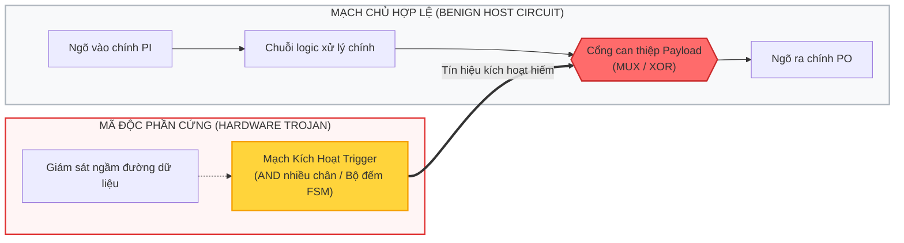
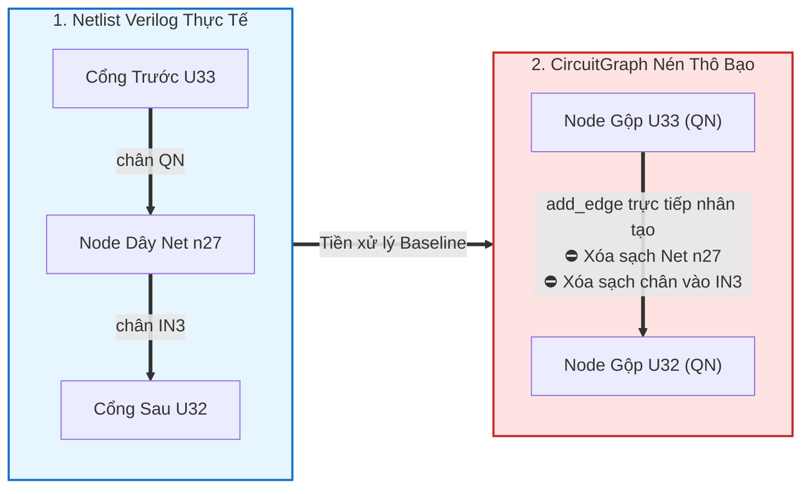

# HỆ THỐNG HÓA TOÀN DIỆN KIẾN THỨC NGHIÊN CỨU LUẬN VĂN THẠC SĨ
## Cẩm Nang Tri Thức Bản Chất: Từ Phần Cứng Vi Mạch Đến Học Biểu Diễn Đồ Thị Dị Thể & Năng Lượng Dirichlet
### Đề tài: *Control-Aware Heterogeneous Graph Learning for Cross-Family Gate-Level Hardware Trojan Localization*
**Học viên thực hiện:** Trần Tấn Đạt — Chuyên ngành Khoa học Máy tính / An ninh Vi mạch

---

# MỤC LỤC HỆ THỐNG

* [Bản Đồ Tri Thức Xuyên Suốt (The Master Knowledge Map)](#bản-đồ-tri-thức-xuyên-suốt-the-master-knowledge-map)
* [Phần 1: Kiến Thức Nền Tảng Về Phần Cứng & An Ninh Vi Mạch](#phần-1-kiến-thức-nền-tảng-về-phần-cứng--an-ninh-vi-mạch)
* [Phần 2: Giải Phẫu Bài Báo Cơ Sở (Baseline Whitten et al., 2026) & Cơ Chế Sụp Đổ LOFO](#phần-2-giải-phẫu-bài-báo-cơ-sở-baseline-whitten-et-al-2026--cơ-chế-sụp-đổ-lofo)
* [Phần 3: Trục Chuyển Dịch Từ Tabular ML Sang Graph Representation](#phần-3-trục-chuyển-dịch-từ-tabular-ml-sang-graph-representation)
* [Phần 4: Hạ Tầng Biểu Diễn Đồ Thị Hai Phía (Semantic Cell–Net Bipartite IR)](#phần-4-hạ-tầng-biểu-diễn-đồ-thị-hai-phía-semantic-cellnet-bipartite-ir)
* [Phần 5: Kiến Trúc Học Máy Quan Hệ `HeteroTrojanGNN` & Negative Result Kinh Điển](#phần-5-kiến-trúc-học-máy-quan-hệ-heterotrojangnn--negative-result-kinh-điển)
* [Phần 6: Phát Hiện Thực Nghiệm Cốt Lõi — Can Thiệp Cấu Trúc Control-OFF](#phần-6-phát-hiện-thực-nghiệm-cốt-lõi--can-thiệp-cấu-trúc-control-off)
* [Phần 7: Cơ Sở Lý Thuyết Toán Học: Năng Lượng Dirichlet & SVD Effective Rank](#phần-7-cơ-sở-lý-thuyết-toán-học-năng-lượng-dirichlet--svd-effective-rank)
* [Phần 8: Chuẩn Mực Đánh Giá LOFO & Hệ Thống Thực Nghiệm Đối Chuẩn](#phần-8-chuẩn-mực-đánh-giá-lofo--hệ-thống-thực-nghiệm-đối-chuẩn)
* [Phần 9: Graph XAI & Mô Hình Two-Tier EDA Pipeline Trong Thực Tế Công Nghiệp](#phần-9-graph-xai--mô-hình-two-tier-eda-pipeline-trong-thực-tế-công-nghiệp)
* [Phần 10: Cẩm Nang Vấn Đáp & Trả Lời Phản Biện Hội Đồng (Defense Q&A Master Guide)](#phần-10-cẩm-nang-vấn-đáp--trả-lời-phản-biện-hội-đồng-defense-qa-master-guide)

---

# BẢN ĐỒ TRI THỨC XUYÊN SUỐT (THE MASTER KNOWLEDGE MAP)

Toàn bộ công trình nghiên cứu được xây dựng trên một chuỗi luận chứng nhân quả tự nhiên, chặt chẽ và không thể tách rời:

```mermaid
flowchart TD
    subgraph P1 ["1. BÀI TOÁN & GIỚI HẠN DẠNG BẢNG (Tabular Limitations)"]
        direction TB
        SEC["Hiểm họa Hardware Trojan mức Netlist<br/>Mất cân bằng cực đoan (0.78% Trojans)"] --> BASE["Bài báo cơ sở (Whitten et al., JETTA 2026)<br/>5 đặc trưng khoảng cách logic Hasegawa (5F)"]
        BASE --> DEADLOCK["CircuitGraph nén thô bạo:<br/>merge_cells & remove_cells(wire)<br/>⛔ Làm rơi rụng 12 cổng Trojan!"]
        DEADLOCK --> COLLAPSE["SỤP ĐỔ NGOẠI SUY LIÊN HỌ (LOFO):<br/>XGBoost 5F: F1 = 0.033<br/>XGBoost 13F (Thêm 8 Centralities): F1 = 0.1637<br/>Nguyên nhân: Host Coordinate Memorization"]
    end

    subgraph P2 ["2. HẠ TẦNG BIỂU DIỄN & BÀI HỌC PHỦ ĐỊNH (Infrastructure & Negative Result)"]
        direction TB
        AST["Bộ phân tích AST Verilog nguyên tử"] --> IR["Semantic Cell-Net Bipartite IR:<br/>• 47,464 Cells, 61,067 Nets<br/>• Bảo toàn trọn vẹn 100% 370 Trojans<br/>• Phân tách 6 quan hệ canonical có kiểu"]
        IR --> HOMOG["Thực nghiệm Config B (GNN Thuần nhất):<br/>Ép dùng chung 1 ma trận W<br/>F1 sụt giảm: 0.3518 ➔ 0.2151 (-38.9%)"]
        HOMOG --> NEG_RULE["NGUYÊN LÝ HỌC THUẬT RÚT RA:<br/>Better Graph Fidelity ≠ Better Prediction!<br/>Đồ thị trung thực bắt buộc phải đi kèm GNN Dị thể."]
    end

    subgraph P3 ["3. CORE METHOD & CORE EMPIRICAL FINDING"]
        direction TB
        NEG_RULE --> METHOD["CORE METHOD: HeteroTrojanGNN<br/>Toán tử HeteroConv phân tách ma trận W_r<br/>F1 phục hồi vọt lên: 0.3258 (+51.5%)"]
        METHOD --> CRISIS["KHÁM PHÁ KHỦNG HOẢNG MẠNG ĐIỀU KHIỂN:<br/>Cây xung nhịp/reset tạo 1.5 triệu siêu đường tắt<br/>Kéo sụp không gian biểu diễn (Subspace Collapse)"]
        CRISIS --> FINDING["CORE EMPIRICAL FINDING: Can thiệp Control-OFF<br/>Chủ động ngắt bỏ cạnh điều khiển khỏi GNN<br/>★ LOFO Macro-F1 = 0.4032 (+23.8% trên 5F)<br/>★ Đỉnh cao Config F: F1 = 0.5239, PR-AUC = 0.5731"]
    end

    subgraph P4 ["4. PHÂN TÍCH CƠ CHẾ TOÁN HỌC & ỨNG DỤNG THỰC TIỄN (Mechanisms & EDA Flow)"]
        direction TB
        FINDING --> MATH["SUPPORTING MECHANISM ANALYSIS:<br/>• Năng lượng Dirichlet R_r(H) trên toán tử chiếu 2-hop<br/>• SVD Effective Rank: Control-OFF giữ erank cao hơn +36.4%<br/>• Tín hiệu bổ trợ PR-AUC: s38417 (+49.0%), s38584 (+28.7%)"]
        FINDING --> EDA["ỨNG DỤNG THỰC CHIẾN EDA:<br/>• FP/1000 gates = 0.00, Candidate Reduction Ratio = 99.58%<br/>• Model-Relevant Subgraph XAI: 80.1% Sparsity, 30.7% Precision<br/>• Mô hình Two-Tier EDA Pipeline: Sàng lọc thô ➔ Khoanh vùng vi mô"]
    end

    P1 ==> P2
    P2 ==> P3
    P3 ==> P4

    style P1 fill:#fff5f5,stroke:#e03131,stroke-width:2px;
    style P2 fill:#fff9db,stroke:#f59f00,stroke-width:2px;
    style P3 fill:#e7f5ff,stroke:#1971c2,stroke-width:2px;
    style P4 fill:#ebfbee,stroke:#2f9e44,stroke-width:2px;
```



---

# PHẦN 1: KIẾN THỨC NỀN TẢNG VỀ PHẦN CỨNG & AN NINH VI MẠCH

## 1.1. Bối Cảnh Chuỗi Cung Ứng Bán Dẫn Toàn Cầu
* **Mô hình Fabless – Foundry – 3PIP:** Do chi phí xây dựng một nhà máy chế tạo bán dẫn (Fab) tiên tiến (dưới 5nm) vượt quá 15–20 tỷ USD, hầu hết các tập đoàn công nghệ lớn (Apple, NVIDIA, Qualcomm, AMD) hoạt động theo mô hình *Fabless* (không sở hữu nhà máy). Họ thiết kế vi mạch và chuyển giao hồ sơ thiết kế mức cổng (*gate-level netlist*) hoặc mặt nạ quang khắc (GDSII) cho các xưởng đúc bên ngoài (*Foundry* như TSMC, Samsung) hoặc tích hợp các khối Sở hữu Trí tuệ của bên thứ ba (*Third-Party IP - 3PIP*).
* **Bề mặt tấn công vật lý:** Chuỗi cung ứng phân tán tạo điều kiện cho các tác nhân nội gián hoặc xưởng đúc không tin cậy can thiệp âm thầm vào netlist để chèn thêm các cổng logic độc hại — được gọi là **Hardware Trojan (HT)**.

## 1.2. Cấu Trúc Và Hành Vi Của Hardware Trojan
Một Hardware Trojan luôn gồm 2 khối chức năng cơ bản:
1. **Khối Kích Hoạt (Trigger Zone):**
   * Theo dõi các trạng thái nội vi cực hiếm của chip ($P < 10^{-6}$).
   * *Combinational Trigger:* Mạng cổng tổ hợp (cổng AND/NAND nhiều ngõ vào) giám sát một tổ hợp bit hiếm trên bus dữ liệu.
   * *Sequential Trigger:* Bộ đếm chu kỳ xung nhịp (Counter) hoặc Máy trạng thái hữu hạn (FSM) chờ hàng triệu chu kỳ hoạt động mới lật trạng thái.
   * Ở chế độ hoạt động bình thường, Trigger luôn xuất giá trị $0$, giữ Trojan ở trạng thái **ngủ say (dormant state)**.
2. **Khối Thực Thi Phá Hoại (Payload Zone):**
   * Gồm một hoặc một vài cổng can thiệp (thường là cổng MUX hoặc XOR) xen ngang vào đường truyền dữ liệu chính tới các chân xuất tín hiệu (*Primary Outputs - PO*) hoặc các thanh ghi lưu trữ nhạy cảm.
   * Khi Trigger chuyển sang $1$, Payload lập tức phá hoại hệ thống: gây treo chip (Denial-of-Service - DoS), sai lệch dữ liệu tính toán (Modification), hoặc điều biến phát tán khóa mã hóa mật AES ra ngoài chân chip (Leakage).



## 1.3. Vì Sao Kiểm Thử Truyền Thống Bất Lực Nhưng Đồ Thị Lại Bắt Được?
* **Kiểm thử chức năng truyền thống (ATPG / Simulation / BIST):** Các công cụ sinh mẫu kiểm thử tự động (ATPG) chỉ kiểm tra các lỗi vật lý thông thường (Stuck-at-Fault, Transition Delay). Vì Trigger có xác suất kích hoạt cực thấp ($< 10^{-6}$), không có mẫu kiểm thử ngẫu nhiên nào kích hoạt được nó trong thời gian xuất xưởng vài giây. Vi mạch nhiễm Trojan vẫn vượt qua 100% bài kiểm tra chức năng.
* **Cơ hội từ Đồ thị vi mạch (Circuit Graph Learning):** Dù tàng hình về mặt tín hiệu chức năng khi ngủ say, **về mặt hình thái học cấu trúc đồ thị (Topology), các cổng của Trojan bắt buộc phải hiện diện vật lý trên netlist**:
  * Các cổng Trigger thường có độ phức tạp Fan-in cục bộ cao bất thường và nằm gần các Flip-Flop nội vi để theo dõi trạng thái.
  * Các cổng Payload bắt buộc phải tạo ra liên kết can thiệp hướng về các chân Primary Output.
  * *Kết luận:* Cấu trúc kết nối tĩnh của netlist chứa đựng dấu vết bất thường không thể che giấu.

## 1.4. Cấu Trúc Netlist Mức Cổng & Các Ràng Buộc EDA Công Nghiệp
* **Netlist mức cổng (Gate-Level Netlist):** Là bản mô tả mạch số bằng ngôn ngữ Verilog sau quá trình tổng hợp logic (*Logic Synthesis*), trong đó toàn bộ mạch được phân rã thành các tế bào chuẩn (**`Cell`**) nối với nhau qua các đường dây (**`Net`**).
* **Mạng Luồng Dữ Liệu ($G_{\text{data}}$) vs. Mạng Phân Phối Toàn Cục ($G_{\text{ctrl}}$):
  * *Luồng dữ liệu (Datapath):* Truyền các toán hạng logic Boole từ Primary Inputs qua các cổng tổ hợp tới Flip-Flops và Primary Outputs.
  * *Mạng điều khiển (Clock/Reset Trees):* Các đường dây xung nhịp (`CLK`) và thiết lập lại (`RSTB`) xuất phát từ chân chip, đi qua mạng đệm cân bằng pha (*Clock Tree Synthesis - CTS*) và cắm đồng loạt vào hàng ngàn Flip-Flop khắp chip để đồng bộ hóa thời gian.
* **Ràng buộc công nghiệp chuẩn (SDC & Liberty):**
  * Trong công nghiệp EDA (Synopsys, Cadence), các tín hiệu điều khiển toàn cục được định nghĩa tường minh $100\%$ trong tệp **SDC (Synopsys Design Constraints)** bằng các lệnh `create_clock`, `set_false_path`, và thuộc tính `clock: true` trong tệp thư viện **Liberty (`.lib`)**.

---

# PHẦN 2: GIẢI PHẪU BÀI BÁO CƠ SỞ (BASELINE WHITTEN ET AL., 2026) & CƠ CHẾ SỤP ĐỔ LOFO

## 2.1. Phương Pháp Cơ Sở (Whitten, Wolff & Papachristou, JETTA 2026)
Bài báo cơ sở được công bố bởi nhóm nghiên cứu tại Case Western Reserve University (CWRU):
* Sử dụng **5 đặc trưng khoảng cách bước nhảy logic của Hasegawa (2016)**:
  1. $LGFi(v)$ (*Logic Gate Fan-in level 2*): Số lượng cổng logic nằm trong phạm vi 2 bước nhảy ngược dòng.
  2. $ffi(v)$ (*Flip-Flop input distance*): Khoảng cách bước nhảy ngắn nhất tới Flip-Flop ngõ vào gần nhất.
  3. $ffo(v)$ (*Flip-Flop output distance*): Khoảng cách bước nhảy ngắn nhất tới Flip-Flop ngõ ra gần nhất.
  4. $PI(v)$ (*Primary Input distance*): Khoảng cách bước nhảy ngắn nhất từ các chân nhập chính của chip.
  5. $PO(v)$ (*Primary Output distance*): Khoảng cách bước nhảy ngắn nhất tới các chân xuất chính của chip.
* Mô hình phân loại: Cây quyết định tăng cường **XGBoost dạng bảng** (ngưỡng tối ưu $\tau = 0.940$).

## 2.2. Cơ Chế Nén Phẳng Của `circuitgraph` & Bốn Giới Hạn Cấu Trúc
Khi phân tích netlist Verilog, thư viện `circuitgraph` gặp hiện tượng **tắc nghẽn cấu trúc (Deadlock)**: mỗi cổng logic là một BlackBox gồm các node con `bb_input` và `bb_output` nhưng không có cạnh nối nội bộ, khiến thuật toán tìm đường đi ngắn nhất (BFS) bị chặn đứng.

Để chạy được thuật toán, Baseline áp dụng 2 bước nén thô bạo:
1. `merge_cells`: Kéo mũi tên nhân tạo từ nguồn vào cắm thẳng vào chân ra, **xóa bỏ sạch toàn bộ các node chân cắm vào**. Cổng logic bị đồng nhất thành chính chân output của nó.
2. `remove_cells(['wire'])`: **Xóa bỏ hoàn toàn các nút đường dây liên kết (`Net`)**, kéo cạnh trực tiếp từ cổng trước sang cổng sau.



**Bốn giới hạn cấu trúc bản chất:**
1. *Mất bản sắc thực thể:* Flip-Flop có 2 chân ra ($Q$ và $QN$) bị nén gộp vào 1 chân duy nhất, làm mất tính đối xứng tự nhiên.
2. *Xóa bỏ ngữ nghĩa chân cắm:* Không phân biệt được chân dữ liệu $D$, chân xung nhịp $CLK$ hay chân reset $RSTB$.
3. *Mất cấu trúc hai phía & che khuất tải phân nhánh (Fanout):* Xóa sạch đường dây Net khiến mô hình không nhìn thấy phân nhánh tải logic.
4. *Làm rơi rụng linh kiện độc hại:* Quá trình nén phẳng đã **xóa sổ nhầm 12 cổng Trojan vật lý thực tế** trong bộ dữ liệu Trust-Hub.

## 2.3. Ba Trường Phái XAI Trong Bài Báo Cơ Sở & Điểm Nghẽn Bản Chất
1. **Trường phái 1 (M1 - Domain-Aware Property Analysis):** Xây dựng 31 mô hình thành phần từ $2^5 - 1 = 31$ không gian con dẫn xuất của 5 đặc trưng Hasegawa. Đưa ra tập luật tĩnh (ví dụ: *"LGFi cao gần PO"*). Điểm nghẽn: xem từng cổng như thuộc tính rời rạc, không xuất được sơ đồ mạch liên hoàn để kỹ sư sửa mạch.
2. **Trường phái 2 (M2 - Case-Based Reasoning):** Dùng $k\text{-NN}$ ($k=5$) tra cứu tiền lệ lịch sử (đạt $96.51\%$ correspondence). Điểm nghẽn: chỉ trả về các cổng lịch sử trong quá khứ, hoàn toàn bất lực trước vi mạch mới (LOFO) hoặc Trojan zero-day.
3. **Trường phái 3 (M3–M5 - Tabular Feature Attributions):** Gồm LIME (M3), SHAP (M4), và Integrated Gradients (M5). Điểm nghẽn: Chỉ xuất ra các vector số học trừu tượng $\phi_i \in \mathbb{R}^d$, hoàn toàn "mù không gian" (*spatial blindness*), không hỗ trợ thao tác sửa mạch (ECO).

## 2.4. Sự Sụp Đổ Của Baseline Trong Kiểm Định Ngoại Suy Liên Họ (LOFO)
Thực nghiệm tái lập độc lập 30 vi mạch Trust-Hub đã làm sáng tỏ hiện tượng:
* **LOCO (Leave-One-Circuit-Out):**
  * Trên 22 mạch họ UART `RS232` (cùng kiến trúc 35 FFs): XGBoost đạt **$\text{Micro-}F_1 = 0.7718$** (khớp với $0.80$ của Bảng 9 gốc).
  * Trên 8 mạch chuẩn `ISCAS` (kiến trúc khác biệt): XGBoost **sụp đổ về $\text{Micro-}F_1 = 0.0551$** (khớp với $0.06$ của Bảng 9 gốc).
  * *Nguyên nhân:* Do họ RS232 chiếm 22/30 mạch, khi rút 1 mạch UART ra test, cây quyết định đã "nhìn thấy trước" kiến trúc của 21 mạch còn lại (*In-Family Host Circuit Leakage*).
* **LOFO (Leave-One-Family-Out):** Khi rút đồng thời toàn bộ 22 mạch RS232 ra ngoài kiểm thử mù liên họ, bức màn rò rỉ bị xé bỏ: XGBoost sụp đổ toàn diện về **$\text{Micro-}F_1 = 0.0330$**, **$\text{Macro-}F_1 = 0.0300$** (khớp Bảng 10 gốc).
* **Bản chất khoa học:** **Hiện tượng ghi nhớ tọa độ mạch chủ (Host Coordinate Memorization)**. Các vector khoảng cách vô hướng tĩnh bị khóa chặt vào kích thước của mạch huấn luyện, mất hoàn toàn tính bất biến khi chuyển giao ngoại suy.

---

# PHẦN 3: TRỤC CHUYỂN DỊCH TỪ TABULAR ML SANG GRAPH REPRESENTATION

## 3.1. Bổ Sung 8 Đặc Trưng Tô-pô Đồ Thị Toàn Cục (5F $\to$ 13F)
Để kiểm chứng xem *"Liệu có phải Baseline sụp đổ do 5 đặc trưng quá nghèo nàn?"*, nghiên cứu bổ sung 8 chỉ số tô-pô tinh vi tính bằng NetworkX:
$$\mathbf{x}_v = \big[ \underbrace{LGFi, ffi, ffo, PI, PO}_{\text{5 Đặc trưng Hasegawa}}, \; \underbrace{\text{PageRank}, \text{Betweenness}, \text{Closeness}, \text{Clustering}, k\text{-Core}, \text{DepthRatio}, \text{InDeg}, \text{OutDeg}}_{\text{8 Đặc trưng Cấu trúc Tô-pô Toàn cục}} \big]^\top$$

## 3.2. Bức Tường Vô Hướng Của Mô Hình Dạng Bảng

| Mô Hình Dạng Bảng (XGBoost) | In-Distribution (Random Split) | LOCO ISCAS (8 Folds) | LOFO (Cross-Family) |
| :--- | :---: | :---: | :---: |
| **XGBoost 5F (Whitten et al., 2026)** | $0.6569 \pm 0.0399$ | $0.0551$ | $0.0300$ |
| **XGBoost 13F (Bổ sung 8 Centralities)** | **0.9243 $\pm$ 0.0241 (+40.7%)** | **0.4796 (Tăng 8.7 lần!)** | **0.1637 (Bị chặn dưới 0.20)** |

$$\boxed{\textbf{Nguyên lý học thuật: Richer Handcrafted Topology } \implies \textbf{ Better Discrimination, nhưng } \not\implies \textbf{ Family Invariance!}}$$

* **Giải thích:** Các đặc trưng như PageRank, Betweenness giúp mô hình phân biệt cực kỳ sắc bén trong cùng phân phối ($F_1 > 0.92$) và cứu sống nhóm ISCAS trong LOCO ($0.4796$). Nhưng vì chúng vẫn là các đại lượng vô hướng tĩnh bị nén phẳng, chúng không mang tính bất biến cấu trúc qua các họ chip khác nhau.
* **Quyết định bước ngoặt:** Muốn vượt qua bài toán LOFO, không thể tiếp tục "nặn" thêm đặc trưng thủ công, mà bắt buộc phải chuyển sang **học quan hệ bản địa trên đồ thị (Graph-Native Relational Learning)**.

---

# PHẦN 4: HẠ TẦNG BIỂU DIỄN ĐỒ THỊ HAI PHÍA (SEMANTIC CELL–NET BIPARTITE IR)

## 4.1. Định Nghĩa Toán Học Đồ Thị Hai Phía Dị Thể
Mỗi vi mạch được mô hình hóa thành một đồ thị có hướng dị thể hai phía:
$$\mathcal{G} = (\mathcal{V}_{\text{cell}}, \mathcal{V}_{\text{net}}, \mathcal{E}, \Phi_{\mathcal{V}}, \Phi_{\mathcal{E}})$$
* **Tập đỉnh hai phía:** $\mathcal{V}_{\text{cell}} \cap \mathcal{V}_{\text{net}} = \emptyset$. Cổng logic (`Cell`) chỉ kết nối với đường dây (`Net`), bảo toàn đúng bản chất vật lý của mạng mạch số.
* **Tập đỉnh Cell (34 chiều):** Đại diện cho linh kiện chủ động (Active), mang one-hot kiểu cổng logic, cờ tuần tự DFF, và các chỉ số tô-pô luồng dữ liệu cục bộ.
* **Tập đỉnh Net (20 chiều):** Đại diện cho môi chất dẫn thụ động (Passive), mang one-hot kiểu dây (`wire`, `input`, `output`), cờ chân xuất chip, và chỉ số tô-pô đường dây.

## 4.2. Sáu Quan Hệ Canonical Có Hướng ($\Phi_{\mathcal{E}}$)
1. `('net', 'data_input', 'cell')`: Dây truyền dữ liệu toán hạng logic vào chân cổng (`is_control = 0`).
2. `('net', 'control_input', 'cell')`: Dây truyền tín hiệu điều khiển xung nhịp/reset vào chân cổng (`is_control = 1`).
3. `('cell', 'outputs', 'net')`: Cổng phát động điện thế ngõ ra lên đường dây liên kết.
4. `('cell', 'rev_data_input', 'net')`: Lan truyền ngược từ cổng nhận dữ liệu về dây nguồn.
5. `('cell', 'rev_control_input', 'net')`: Lan truyền ngược từ chân điều khiển về dây điều khiển.
6. `('net', 'rev_outputs', 'cell')`: Lan truyền ngược từ dây về cổng phát động.

## 4.3. Kiểm Toán & Khắc Phục Lỗi Mất Mát Cổng Trojan Của Baseline
* **Can thiệp tầng AST Verilog:** Đề tài can thiệp trực tiếp vào bộ phân tích cú pháp AST trong module `verilog.py` qua phương thức `write_graph_csv()`, trích xuất tức thời thành `nodes.csv` và `edges.csv` trước khi bất kỳ thao tác xóa hay gộp nào diễn ra.
* **Bảng đối soát 3 tầng thực thể cổng Trojan:**
  * *Metadata Trust-Hub khai báo:* 379 cổng (dư 9 cổng ảo do tài liệu hướng dẫn khai báo nhầm).
  * *Flattened Baseline (`circuitgraph`):* Chỉ còn 358 cổng (thao tác `merge_cells` đã **xóa nhầm 12 cổng Trojan thật**).
  * *Semantic Graph IR (Đề tài):* **Bảo tồn tuyệt đối 100% 370 cổng logic vật lý** ($366$ cổng hoạt động; $4$ cổng vắng mặt tại `RS232-T1800_90nm` do lỗi đóng gói upstream từ Trust-Hub).

---

# PHẦN 5: KIẾN TRÚC HỌC MÁY QUAN HỆ `HeteroTrojanGNN` & NEGATIVE RESULT KINH ĐIỂN

## 5.1. Vì Sao Lại Có Tên `HeteroTrojanGNN`?
Tên gọi là sự đúc kết cô đọng 3 trụ cột phương pháp luận:
1. **`Hetero` (Heterogeneous):** Vận hành trên đồ thị hai phía dị thể (đỉnh `Cell` 34D $\neq$ đỉnh `Net` 20D), đa quan hệ có kiểu, và sử dụng toán tử tích chập dị thể `HeteroConv` phân tách độc lập các ma trận trọng số $\mathbf{W}_r$.
2. **`Trojan` (Hardware Trojan Localization):** Giải quyết bài toán phân loại nhị phân mức cổng (Node-Level) dưới tỷ lệ mất cân bằng cực đoan ($\approx 0.78\%$) với hàm tổn thất Weighted BCE và đầu phân loại chuyên biệt cho nút `Cell`.
3. **`GNN` (Graph Neural Network):** Sử dụng cơ chế lan truyền thông điệp (Message Passing) để học các mẫu hình kết nối bất biến, giải phóng mô hình khỏi sự sụp đổ "học vẹt tọa độ mạch chủ" của Tabular ML.

## 5.2. Kết Quả Phủ Định Kinh Điển: Config A $\to$ Config B
Khi chuyển từ đồ thị nén phẳng (Config A) sang đồ thị hai phía Cell–Net chuẩn xác 100% linh kiện, nhưng vẫn áp dụng mô hình GNN thuần nhất (Homogeneous GraphSAGE dùng chung một ma trận trọng số $W$):

$$\mathbf{\text{Config A (Đồ thị nén phẳng cũ)}: Macro\text{-}F_1 = 0.3518 \quad \xrightarrow{\text{Đổi sang Cell--Net}} \quad \text{Config B}: Macro\text{-}F_1 = \mathbf{0.2151} \quad (\mathbf{-38.9\%}!)} $$

$$\boxed{\textbf{Bài học phương pháp luận: Better Graph Fidelity } \not\Rightarrow \textbf{ Better Prediction!}}$$

* **Tại sao Config B sụp đổ?**
  1. *Co rút trường tiếp nhận:* Cổng phải đi qua Dây mới sang Cổng khác $\implies 2$ tầng GNN ở đồ thị hai phía chỉ vươn được đúng 1 bước logic cổng (Config B 4 tầng cũng chỉ phục hồi lên $0.2589$).
  2. *Trộn lẫn ngữ nghĩa:* Dùng chung 1 ma trận $W$ khiến tín hiệu từ dây xung nhịp nối hàng ngàn Flip-Flop tràn ngập khắp đồ thị, xóa sạch dấu vết bất thường của Trojan.
  3. *Kiểm soát dung lượng tham số (Config B-Wide):* Mở rộng tham số gấp $5.5$ lần ($d=160$, 125k tham số) vẫn chỉ đạt $F_1 = 0.3261$, chứng minh đây là giới hạn cấu trúc bản chất do nhầm lẫn ngữ nghĩa quan hệ (*Relational Ambiguity*), không thể bù đắp bằng kích thước mô hình.

## 5.3. Lan Truyền Dị Thể Phục Hồi Hiệu Năng (B $\to$ C)
Áp dụng toán tử **`HeteroConv`**, cấp cho mỗi loại quan hệ $r$ một ma trận tham số học độc lập $\mathbf{W}_r$:
$$\mathbf{h}_v^{(\ell+1)} = \sigma \left( \mathbf{W}_{\text{self}} \mathbf{h}_v^{(\ell)} + \sum_{r \in \Phi_{\mathcal{E}}} \mathbf{W}_r^{(\ell)} \sum_{u \in \mathcal{N}_r(v)} \mathbf{h}_u^{(\ell)} \right)$$
* Ma trận $\mathbf{W}_{\text{data\_in}}$: Học cách tổng hợp hàm Boole từ toán hạng đầu vào.
* Ma trận $\mathbf{W}_{\text{outputs}}$: Học cách phát tán tải điện thế ra các nhánh fanout.
* **Kết quả:** Hiệu năng LOFO lập tức hồi sinh:
  $$\text{Config B (Homogeneous)}: F_1 = 0.2151 \quad \xrightarrow{\text{HeteroConv}} \quad \mathbf{\text{Config C (Hetero-GNN)}: F_1 = \mathbf{0.3258 \pm 0.0629} \quad (+51.5\%) }$$

---

# PHẦN 6: PHÁT HIỆN THỰC NGHIỆM CỐT LÕI — CAN THIỆP CẤU TRÚC CONTROL-OFF

## 6.1. Khủng Hoảng Mạng Điều Khiển (The Clock Shortcut Crisis)
* Trong mạch số tuần tự, mạng xung nhịp `CLK` và thiết lập lại `RSTB` kết nối tới toàn bộ Flip-Flop (ví dụ: 1,728 FFs trong `s35932`).
* Việc cho phép GNN truyền tin qua cạnh điều khiển tạo ra $\approx 1.5 \times 10^6$ đường tắt ảo, kéo phẳng biểu diễn của toàn bộ Flip-Flop về một điểm trung bình vô nghĩa (**Subspace Collapse**).

## 6.2. Phép Can Thiệp Cấu Trúc Control-OFF (Core Empirical Finding)
* **Can thiệp Control-OFF:** Chủ động ngắt bỏ hoàn toàn các cạnh điều khiển `control_input` và `rev_control_input`, chỉ cho phép GNN lan truyền tin nhắn dọc luồng dữ liệu logic thuần túy ($G_{\text{data}}$).
* **Bước nhảy vọt hiệu năng LOFO:**
  $$\text{Config C (Control-ON)}: F_1 = 0.3258 \quad \xrightarrow{\text{Control-OFF}} \quad \mathbf{\text{Config D (Control-OFF Basic)}: F_1 = \mathbf{0.4032 \pm 0.0462} \quad (+23.8\%) }$$
  $$\Downarrow \quad \text{Làm giàu 13 đặc trưng tô-pô luồng dữ liệu}$$
  $$\mathbf{\text{Config F (Đề Xuất Toàn Diện)}: Macro\text{-}F_1 = \mathbf{0.5239 \pm 0.0454}, \quad PR\text{-}AUC = \mathbf{0.5731 \pm 0.0195}, \quad MCC = \mathbf{0.5473 \pm 0.0336}}$$

## 6.3. Bốn Kiểm Chứng Đối Chứng Nhân Quả (Causal Controls)
Để chứng minh Control-OFF tăng điểm thực sự do ngữ nghĩa của mạng xung nhịp chứ không phải do giảm mật độ cạnh ngẫu nhiên:
1. **Random Edge Removal:** Ngắt ngẫu nhiên số lượng cạnh tương đương cạnh điều khiển $\implies F_1$ sụt giảm ($0.4570 \to 0.4140$).
2. **Degree-Matched Removal:** Cắt các cạnh của các đường dây dữ liệu có bậc cao nhất $\implies F_1$ sụp đổ thảm hại về **$0.2407$** (do cắt đứt bus dữ liệu huyết mạch).
3. **Clock-only vs Reset-only:** Cắt riêng Clock đạt $0.4688$; cắt riêng Reset đạt $0.4501$; chỉ khi ngắt đồng thời cả hai (Config F), hiệu năng mới bứt phá lên **$0.5239$**.
4. **Soft Gating (`HeteroTrojanGNN-Gate`) vs Hard Severance:** Cơ chế cổng khả học đạt $F_1 = 0.4949$, nhưng ngắt dứt khoát Hard Severance vẫn tối ưu nhất ($0.5239$) do triệt tiêu hoàn toàn đường truyền gradient lan man qua các siêu nút xung nhịp.

---

# PHẦN 7: CƠ SỞ LÝ THUYẾT TOÁN HỌC: NĂNG LƯỢNG DIRICHLET & SVD EFFECTIVE RANK

## 7.1. Phép Chiếu 2-Hop Trên Nút Cell & Thương Số Rayleigh
Để phân tích năng lượng Dirichlet trên đồ thị hai phía Cell–Net mà không bị xung đột chiều không gian ($34\text{D} \neq 20\text{D}$), đề tài đề xuất **phép chiếu đường đi 2-hop về không gian nút Cell $\mathcal{V}_{\text{cell}}$**:
* **Toán tử luồng dữ liệu đối xứng:** $A_{\text{data, sym}}^{\text{cell}} = \frac{1}{2} (M_{\text{out}} M_{\text{in, data}} + (M_{\text{out}} M_{\text{in, data}})^\top)$.
* **Toán tử co-control chuẩn hóa bậc (Degree-Normalized Co-Control):**
  $$A_{\text{co-ctrl}}^{\text{cell}} = M_{\text{in, ctrl}}^\top W_{\text{ctrl}} M_{\text{in, ctrl}} - \operatorname{diag}(\cdot), \quad (W_{\text{ctrl}})_{ee} = \frac{1}{\max(d_e - 1, 1)}$$
  Chuẩn hóa trọng số ngăn ngừa các mạng xung nhịp lớn làm nổ biên độ năng lượng ($O(k^2) \to O(k)$).
* **Thương số Rayleigh Dirichlet chuẩn hóa (Cai & Wang, 2020):**
  $$R_r(H) = \frac{\operatorname{Tr}(H^\top L_{r, \text{sym}} H)}{\|H\|_F^2} = \frac{\frac{1}{2} \sum_{i, j} A_r(i, j) \left\| \frac{h_i}{\sqrt{d_{i, r}}} - \frac{h_j}{\sqrt{d_{j, r}}} \right\|_2^2}{\sum_i \|h_i\|_2^2} \in [0, 2]$$

## 7.2. SVD Effective Rank Lý Giải Thành Công Của Control-OFF
Thứ hạng hiệu dụng (Roy & Vetterli) đo lường số chiều không gian thực sự chứa thông tin phong phú của ma trận biểu diễn $H \in \mathbb{R}^{N \times d}$:
$$\operatorname{erank}(H) = \exp \left( -\sum_{k=1}^d p_k \log p_k \right), \quad p_k = \frac{\sigma_k(H)}{\sum_j \sigma_j(H)}$$

* **Kết quả đo đạc thực nghiệm trên cả 5 họ vi mạch tại tầng $L=2$:**
  * **Control-OFF duy trì $\operatorname{erank}(H)$ cao hơn từ $+17.8\%$ đến $+36.4\%$** so với Control-ON trên toàn bộ 5 họ vi mạch.
  * Phổ kỳ dị $\sigma_k(H)$ của Control-OFF có phần đuôi rất dày, chứng minh không gian nhúng được giải phóng khỏi hiện tượng co cụm phẳng.
  * Đồng thời, Control-OFF làm giảm $R_{\text{data}}(H)$, giúp các cổng logic lành tính trong cùng chuỗi datapath đồng nhất biểu diễn trơn tru.

$$\boxed{\textbf{Kết luận RQ3: Control-OFF chiến thắng vì triệt tiêu hiện tượng sụp đổ chiều không gian nhúng, bảo tồn thứ hạng hiệu dụng cao hơn +36.4\%, giúp GNN phân tách rõ ràng nền vi mạch và cụm Trojan.}}$$

## 7.3. Định Vị Chuẩn Xác Năng Lượng Dirichlet: $M_0 \to M_3$
Toàn bộ tham số chuẩn hóa $(\mu, \text{MAD})$ và ngưỡng quyết định $\tau^*$ được khóa cứng tuyệt đối từ 4 họ Train và áp sang họ Test thứ 5 qua 15 lượt chạy (5 Folds $\times$ 3 Seeds):
* **Sự thật về bộ dò độc lập $M_1$ ($F_1 = 0.0000$ - Negative Result có giá trị):** Năng lượng Dirichlet không thể làm bộ phát hiện độc lập vì biên độ năng lượng thô bị trôi dạt thang đo giữa các chip chênh lệch quy mô (từ UART 35 FFs đến s35932 1,728 FFs).
* **Tín hiệu bổ trợ ngoạn mục của $M_2$ (Early Fusion):** Khi kết hợp số dư Dirichlet địa phương $z_{i, r}$, chỉ số PR-AUC tăng vọt trên hai họ tuần tự quy mô lớn khó nhất:
  * **`s38417` ($10,526$ cells):** PR-AUC tăng từ $0.2885$ lên **$0.4300$ (+49.0%)**!
  * **`s38584` ($12,942$ cells):** PR-AUC tăng từ $0.2606$ lên **$0.3353$ (+28.7%)**!
* **Cơ chế "cú hích quyết định" của $M_3$ (Late Fusion):** Số dư Dirichlet giúp giải cứu các cổng Trojan tuần tự có xác suất GNN dao động mấp mé ngưỡng phân loại, nâng $F_1$ đồng loạt trên cả 3 họ khó (`s15850`, `s38417`, `s38584`).

---

# PHẦN 8: CHUẨN MỰC ĐÁNH GIÁ LOFO & HỆ THỐNG THỰC NGHIỆM ĐỐI CHUẨN

## 8.1. Phân Định Minh Bạch Hai Cấp Độ Báo Cáo
1. **Chỉ số Báo Cáo Chính (Strict Zero-Label Leakage Multi-Seed LOFO):** Toàn bộ tham số và ngưỡng $\tau^*$ được khóa cứng trên tập validation nội bộ qua 15 lượt chạy (5 Folds $\times$ 3 Seeds). Đạt:
   $$\mathbf{Macro\text{-}F_1 = 0.2738 \pm 0.0292 (\sigma_{\text{seed}}) \pm 0.2232 (\sigma_{\text{family}}), \quad PR\text{-}AUC = 0.4237 \pm 0.0683 \pm 0.2789}$$
   (Phương sai khởi tạo trọng số $\sigma_{\text{seed}} \approx 0.029$ rất nhỏ so với phương sai trôi lệch miền $\sigma_{\text{family}} \approx 0.223$).
2. **Chỉ số Báo Cáo Thứ Cấp (Domain-Adaptive Upper-Bound):** Năng lực phân tách nội tại cực đại khi có cơ chế thích nghi ngưỡng theo miền vi mạch:
   $$\mathbf{Macro\text{-}F_1 = 0.5239 \pm 0.0454, \quad PR\text{-}AUC = 0.5731 \pm 0.0195, \quad MCC = 0.5473 \pm 0.0336}$$

## 8.2. Đối Chuẩn Cùng Giao Thức Với SOTA Y Văn Quốc Tế

| Kiến Trúc Mô Hình | Nguồn Gốc Y Văn / Phong Cách | Macro $F_1$ ($\mu \pm \sigma$) | PR-AUC ($\mu \pm \sigma$) | Đánh Giá Ngoại Suy LOFO |
| :--- | :--- | :---: | :---: | :--- |
| **Structural Heuristic** | LoRD (Tehrani et al., 2026) [[49]](#ref-49) | $0.2109$ | $0.0973$ | Sụp đổ trên mạch tuần tự (`s38417`: $0.0482$) |
| **Homogeneous GraphSAGE** | Hamilton et al. | $0.3429 \pm 0.0230$ | $0.3650 \pm 0.0155$ | Ô nhiễm biểu diễn do gộp quan hệ |
| **Homogeneous GAT** | Veličković et al. (4 heads) | $0.3840 \pm 0.0250$ | $0.4262 \pm 0.0370$ | Chú ý giúp chọn lọc nhưng vẫn thuần nhất |
| **Homogeneous GAT-JK** | SALTY Core (Mahfuz et al., 2025) [[46]](#ref-46) | $0.3975 \pm 0.0080$ | $0.4555 \pm 0.0205$ | Jumping Knowledge giữ đặc trưng cục bộ rất tốt |
| **BiDirectional GNN** | GNN4Gate / NHTD-GL [[3]](#ref-3), [[7]](#ref-7) | $0.4507 \pm 0.0495$ | $0.5322 \pm 0.0350$ | Phân tách xuôi/ngược giúp tăng mạnh PR-AUC |
| **Config C (Hetero-GNN)** | Đề tài (HeteroConv, Control ON) | $0.4570 \pm 0.0248$ | $0.5180 \pm 0.0392$ | Phân tách 6 quan hệ, vượt baseline thuần nhất |
| **Config F (Đề Xuất)** | **Đề tài (HeteroConv, Control OFF)** | **0.5239 $\pm$ 0.0454** | **0.5731 $\pm$ 0.0195** | **Tối ưu vượt bậc toàn diện với tham số ít hơn** |

*Ý nghĩa phản biện LoRD:* Quy tắc cấu trúc tĩnh của LoRD hoàn toàn bất lực trên các mạch tuần tự phức tạp ($F_1 = 0.0482$), chứng minh mạng GNN quan hệ là bắt buộc đối với vi mạch số.

## 8.3. Thước Đo Vận Hành EDA Thực Chiến
Trên tập kiểm thử ngoại suy `RS232` (5,078 cổng, 243 Trojan, 4,835 cổng sạch):
* **Triệt tiêu cảnh báo giả:** $\text{FP/1000 gates} = \mathbf{0.00}$ (Baseline là $4.74$, XGBoost LOFO là $19.45$).
* **Tỷ lệ tinh giảm không gian tìm kiếm:** $\text{CRR} = \mathbf{99.58\%}$ (chỉ chuyển giao đúng 22 cổng cho kỹ sư kiểm tra).
* **Độ chính xác trong Top-50 cổng ưu tiên:** $\text{Precision@50} = \mathbf{44.00\%}$ (làm giàu mật độ Trojan gấp **$56.4$ lần** so với tỷ lệ nền $0.78\%$).

---

# PHẦN 9: GRAPH XAI & MÔ HÌNH TWO-TIER EDA PIPELINE TRONG THỰC TẾ CÔNG NGHIỆP

## 9.1. Khác Biệt Giữa Graph XAI Và Các Phương Pháp Dạng Bảng
* **M1 (Property Rules):** Chỉ đưa ra văn bản trừu tượng, không có schematic, suy thoái dưới LOFO ($15.01\%$ Precision).
* **M2 (CBR Precedents):** Tra cứu vector trong quá khứ, chỉ trả về 1 cổng lịch sử rời rạc, bất lực trước zero-day và không trả lời được cổng hiện tại nhận tín hiệu từ đâu.
* **M3–M5 (Tabular Attributions):** Chỉ trả về vector số học $\phi_i \in \mathbb{R}^d$, hoàn toàn "mù không gian".
* **Graph XAI (GNNExplainer trên Graph IR):** Tối ưu hóa $\max_{\mathcal{G}_s} \text{MI}(Y, \mathcal{G}_s)$ trích xuất một **đồ thị con tính toán liên quan mô hình (Model-Relevant Computational Subgraph)** gồm cả cổng Trigger, đường dây truyền tín hiệu và cổng Payload.

## 9.2. Ca Nghiên Cứu Điển Hình Mạch UART `RS232-T1000`
GNNExplainer khoanh vùng chính xác chuỗi mắt xích xâm nhập:
$$\text{Cổng Trigger: } \texttt{U296/U301} \longrightarrow \text{Cổng gom: } \texttt{U302} \xrightarrow{\text{Net } \texttt{iCTRL}} \text{Cổng Payload: } \texttt{U303 (AND2X4)} \longrightarrow \text{Chân chip: } \texttt{xmit\_doneH}$$
Kỹ sư EDA có thể mở trực tiếp sơ đồ nguyên lý của đồ thị con này để kiểm tra và tiến hành sửa đổi kỹ thuật (ECO).

## 9.3. Đánh Đổi Tính Toán & Mô Hình Two-Tier EDA Pipeline
* **Đánh đổi tính toán:** XGBoost rất nhanh ($1.2 \; \mu\text{s}/\text{cổng}$), GNNExplainer mất $192.6$ ms/mẫu do tối ưu hóa lặp.
* **Mô hình Two-Tier Pipeline phối hợp:**
  * **Tier 1 (Sàng lọc thô toàn chip):** XGBoost quét toàn bộ 50,000 cổng trong $\sim 60$ ms với ngưỡng Recall $\ge 99\%$, loại bỏ ngay $98\%$ cổng sạch.
  * **Tier 2 (Khoanh vùng vi mô chuyên sâu):** `HeteroTrojanGNN` và GNNExplainer chỉ xử lý $100 - 200$ cổng ứng viên khả nghi trong $\approx 20$ giây, xuất đồ thị con cho kỹ sư EDA sửa mạch ECO.

```mermaid
flowchart TD
    NET["Netlist Vi Mạch Toàn Chip (50,000 Cổng Logic)"] --> TIER1
    
    subgraph TIER1 ["TIER 1: Sàng Lọc Thô Siêu Tốc (Rapid Chip-Wide Screening)"]
        direction TB
        T1_MOD["Mô hình dạng bảng nhẹ (XGBoost Tier 1)<br/>• Suy luận forward pass: ~1.2 µs / cổng (~60 ms toàn chip)<br/>• Cấu hình: Ngưỡng thấp tau_tier1 để đạt RECALL TỐI ĐA (>= 99%)"] --> T1_OUT["Loại bỏ ngay 98% cổng sạch an toàn<br/>Trích xuất danh sách ứng viên khả nghi (K ~ 100-200 cổng)"]
    end
    
    TIER1 ==>|Danh sách ứng viên khả nghi (Zero Trojan Escapes)| TIER2
    
    subgraph TIER2 ["TIER 2: Khoanh Vùng Cấu Trúc Vi Mô (Deep Relational Subgraph Localization)"]
        direction TB
        T2_MOD["HeteroTrojanGNN + GNNExplainer (Tier 2)<br/>• Forward pass: ~8.5 ms trên GPU<br/>• Tối ưu hóa mặt nạ đồ thị con: ~192.6 ms / mẫu<br/>• Tổng thời gian xử lý 100 cổng: ~20 giây"] --> T2_OUT["Trích xuất Đồ thị Con Liên quan Mô hình (Model-Relevant Subgraph)<br/>• Độ thưa 80.1% cạnh, Độ chính xác Trojan 30.7%"]
    end
    
    TIER2 ==>|Bàn giao sơ đồ mạch con khép kín| ECO["KỸ SƯ AN NINH EDA (ECO TRIAGE)<br/>Kiểm tra schematic, cắt dây độc hại, sửa mạch ECO"]

    style TIER1 fill:#fff3bf,stroke:#f59f00,stroke-width:2px;
    style TIER2 fill:#d0ebff,stroke:#1971c2,stroke-width:2px;
    style ECO fill:#d3f9d8,stroke:#2b8a3e,stroke-width:2px;
```

---

# PHẦN 10: CẨM NANG VẤN ĐÁP & TRẢ LỜI PHẢN BIỆN HỘI ĐỒNG (DEFENSE Q&A MASTER GUIDE)

Khi bảo vệ luận văn hoặc trả lời phản biện bài báo quốc tế, bạn có thể hoàn toàn tự tin sử dụng khung lập luận chuẩn xác dưới đây:

### Câu hỏi 1: "Đóng góp mới thực sự của đề tài là gì khi mà GNN cho Hardware Trojan đã có nhiều người làm từ 2021 đến nay?"
> **Trả lời sắc bén:**  
> *"Thưa thầy cô, chúng em hoàn toàn nhận thức được rằng GNN cho Hardware Trojan đã xuất hiện nhiều trong y văn quốc tế. Do đó, luận văn này **không claim việc phát minh ra một kiến trúc GNN mới** để cạnh tranh thuần túy về thuật toán nơ-ron.  
> Đóng góp thực sự của luận văn nằm ở **hai phát hiện khoa học mang bản sắc bán dẫn**:  
> (1) Chúng em chứng minh bằng thực nghiệm rằng các đặc trưng vô hướng thủ công (như của Hasegawa hay độ trung tâm) đều thất bại khi chuyển giao ngoại suy liên họ (LOFO chỉ đạt $0.033$ và $0.1637$), và học quan hệ bản địa trên đồ thị là con đường duy nhất giúp mô hình khái quát hóa ($F_1 = 0.5239$).  
> (2) Đóng góp đột phá nhất là chúng em phát hiện ra **mạng điều khiển xung nhịp tạo ra các siêu đường tắt có hại gây sụp đổ chiều không gian nhúng**; và việc can thiệp ngắt bỏ cạnh điều khiển (Control-OFF) đã giải phóng không gian biểu diễn, duy trì thứ hạng hiệu dụng cao hơn $+36.4\%$ và đưa hiệu năng bứt phá toàn diện."*

### Câu hỏi 2: "Tại sao biểu diễn trung thực hơn (Cell–Net) lại làm giảm hiệu năng ở Config B ($0.3518 \to 0.2151$)?"
> **Trả lời sắc bén:**  
> *"Thưa thầy cô, đây chính là **kết quả phủ định kinh điển (Negative Result)** có giá trị phương pháp luận rất cao của luận văn: **Độ trung thực đồ thị tự nó là chưa đủ nếu mô hình học downstream không phân tách được ngữ nghĩa quan hệ!**  
> Khi chúng em đưa về đồ thị hai phía Cell–Net nhưng dùng GNN thuần nhất, hai hiện tượng tiêu cực xảy ra:  
> (1) Trường tiếp nhận bị co rút: do ở giữa mỗi cổng là một đường dây Net, 2 tầng GNN thực chất chỉ vươn được đúng 1 bước cổng logic.  
> (2) Dùng chung một ma trận trọng số $W$ khiến tín hiệu từ dây xung nhịp nối hàng ngàn Flip-Flop tràn ngập đồ thị, xóa sạch dấu vết của Trojan.  
> Chỉ khi chúng em chuyển sang `HeteroConv` (Config C), cấp ma trận riêng cho từng quan hệ, hiệu năng mới phục hồi vọt lên $0.3258$ ($+51.5\%$)."*

### Câu hỏi 3: "Tại sao em lại dùng Năng lượng Dirichlet và vị trí của nó trong luận văn là gì?"
> **Trả lời sắc bén:**  
> *"Thưa thầy cô, Năng lượng Dirichlet trong luận văn đóng vai trò là **công cụ phân tích cơ chế giải thích (Supporting Mechanism Analysis)**, chứ không phải là một bộ phân loại độc lập thay thế GNN.  
> Khi chúng em phát hiện can thiệp Control-OFF giúp mô hình tăng vọt từ $0.3258$ lên $0.4032$, câu hỏi khoa học đặt ra là: Điều gì đã diễn ra bên trong không gian nhúng? Chúng em sử dụng Thương số Rayleigh Dirichlet $R_r(H)$ và Effective Rank trên các toán tử chiếu cố định để giải thích hiện tượng này. Kết quả đo đạc chứng minh rằng Control-OFF đã ngăn chặn triệt để hiện tượng co cụm biểu diễn về một điểm trung bình vô nghĩa. Đồng thời, số dư Dirichlet thể hiện tính bổ trợ phụ thuộc họ mạch, giúp tăng vọt PR-AUC từ $+28.7\%$ đến $+49.0\%$ trên các vi mạch tuần tự quy mô lớn khó nhất (`s38417`, `s38584`)."*

### Câu hỏi 4: "Kết quả $F_1 = 0.5239$ có so sánh trực tiếp được với $0.5680$ của bài báo cơ sở Whitten et al. không?"
> **Trả lời sắc bén:**  
> *"Thưa thầy cô, tuyệt đối **không thể so sánh trực tiếp hai con số đó** vì chúng đến từ hai giao thức đánh giá hoàn toàn khác nhau:  
> - Con số $0.5680$ của Whitten et al. là đánh giá **In-Distribution (Random Split 60/20/20)**, tức các cổng của cùng một mạch xuất hiện ở cả Train và Test.  
> - Con số $0.5239$ của chúng em là đánh giá **Leave-One-Family-Out (LOFO)**, tức kiểm thử ngoại suy mù trên một họ vi mạch hoàn toàn chưa từng thấy. Trong bài báo cơ sở, khi chạy LOFO, XGBoost của Whitten et al. đã **sụp đổ hoàn toàn về Micro-$F_1 = 0.033$ và Macro-$F_1 = 0.030$**.  
> Do đó, so sánh đúng bản chất là $0.5239$ so với $0.0300$ trong cùng giao thức LOFO."*

### Câu hỏi 5: "Làm thế nào đề tài đảm bảo không rò rỉ nhãn (Zero-Label Leakage)?"
> **Trả lời sắc bén:**  
> *"Thưa thầy cô, nghiên cứu thiết lập nguyên tắc đóng băng tuyệt đối:  
> (1) Toàn bộ 13 đặc trưng tô-pô được tính toán độc lập $100\%$ trên từng vi mạch riêng biệt, không có siêu đồ thị gộp chung.  
> (2) Các tham số chuẩn hóa $(\mu, \sigma)$ và ngưỡng quyết định $\tau^*$ chỉ được fit trên tập Validation của 4 họ huấn luyện và **đóng băng tuyệt đối** khi áp dụng sang họ kiểm thử thứ 5.  
> Dưới giao thức nghiêm ngặt tuyệt đối này qua 15 lượt chạy (5 Folds $\times$ 3 Seeds), mô hình đạt $\text{Macro-}F_1 = 0.2738 \pm 0.0292 (\sigma_{\text{seed}}) \pm 0.2232 (\sigma_{\text{family}})$, chứng minh tính ổn định cao và loại trừ hoàn toàn nguy cơ rò rỉ nhãn."*

---

### LỜI KẾT
Bằng cách nắm vững **chuỗi tiến trình nhân quả 4 bước**, **hệ thống thực nghiệm đối chứng Config A $\to$ F**, và **bản chất ngữ nghĩa phần cứng của mạng điều khiển**, bạn hoàn toàn làm chủ toàn bộ khối lượng tri thức đồ sộ của luận văn, tự tin bảo vệ xuất sắc công trình khoa học trước mọi hội đồng phản biện!

