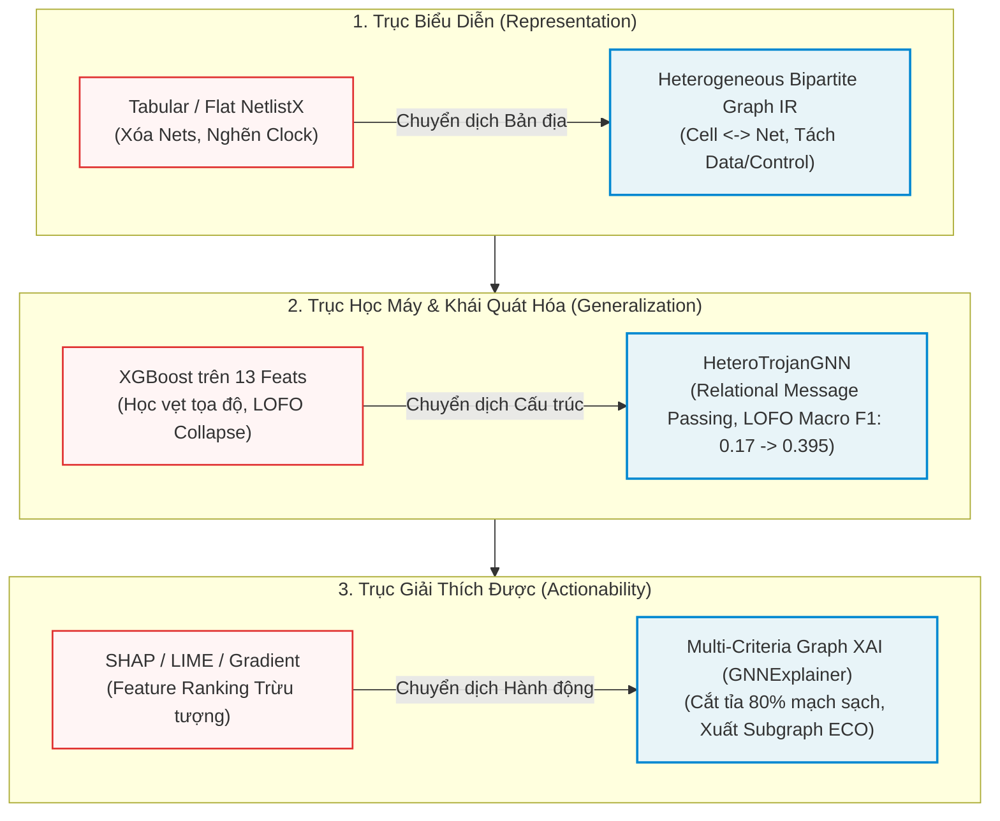

# TỔNG QUAN TÀI LIỆU VÀ TIẾN HÓA ĐỊNH HƯỚNG NGHIÊN CỨU (LITERATURE REVIEW)
## Từ XAI Dạng Bảng Sang Phát Hiện, Định Vị và Giải Thích Mã Độc Phần Cứng Bản Địa Đồ Thị (Graph-Native)

* **Học viên thực hiện:** Trần Tấn Đạt  
* **Đề tài luận văn định hình lại:** *Phát hiện, Định vị và Giải thích Mã độc Phần cứng trên Netlist Vi mạch dựa trên Biểu diễn Đồ thị Ngữ nghĩa Dị thể và Học Đồ thị Quan hệ*  
  *(Robust and Explainable Hardware Trojan Localization via Heterogeneous Semantic Graph Representation and Relational Graph Learning)*  
* **Thời gian cập nhật:** 14/09/2026  
* **Vị trí tài liệu:** `reports/Literature_Review.md`  
* **Tài liệu nguồn kế thừa trong `reports/`:**
  * [`ReportThesis-TranTanDat-20260719.pdf`](ReportThesis-TranTanDat-20260719.pdf): Tái lập Baseline ban đầu, phân tích ngã rẽ nghiên cứu ("Netlist $\to$ Graph $\to$ Sinh lại Verilog" vs. "Verilog $\to$ Graph IR $\to$ Phân tích An ninh & XAI"), xác lập 3 khoảng trống nghiên cứu.
  * [`ReportThesis-TranTanDat-20260903.md`](ReportThesis-TranTanDat-20260903.md): Xây dựng Semantic Graph IR hai phía $G = (V, E, \Phi_V, \Phi_E)$, thuật toán cô lập mạng dữ liệu $G_{data}$, trích xuất 13 đặc trưng tô-pô Dijkstra, và phát hiện thực nghiệm hiện tượng sụp đổ LOFO của đặc trưng dạng bảng.
  * [`ReportThesis-TranTanDat-20260910.md`](ReportThesis-TranTanDat-20260910.md): Khởi tạo kiến trúc HeteroTrojanGNN (HeteroConv + SAGEConv) và tích hợp GNNExplainer, đối chuẩn thực nghiệm định lượng XAI bước đầu.
  * [`ReportThesis-TranTanDat-20260913.md`](ReportThesis-TranTanDat-20260913.md): Thiết kế ma trận thực nghiệm $2 \times 3$ Factorial Benchmark (Exp 1 – Exp 6), kiểm định thống kê 10-Seed, kiểm định ngoại suy LOFO, và xây dựng khung giải thích đa tiêu chuẩn (Multi-Criteria Graph XAI).
  * [`2601.18696v7.pdf`](2601.18696v7.pdf): Bài báo phương pháp cơ sở của Paul Whitten, Francis Wolff, Chris Papachristou (*"Explainability Methods for Hardware Trojan Detection: A Systematic Comparison"*, CWRU, cập nhật 08/2026 trên arXiv:2601.18696) [[29]](#ref-29)[[30]](#ref-30).

---

## MỤC LỤC TỔNG QUAN

1. [Tuyên bố Tái Định Hình Hướng Nghiên Cứu (Research Reframing Statement)](#1-tuyên-bố-tái-định-hình-hướng-nghiên-cứu-research-reframing-statement)
2. [Phân Định Ranh Giới Học Thuật: Baseline Đã Chứng Minh Gì và Đề Tài Mở Rộng Gì?](#2-phân-định-ranh-giới-học-thuật-baseline-đã-chứng-minh-gì-và-đề-tài-mở-rộng-gì)
3. [Tổng Quan Tiến Hóa Của Các Phương Pháp Phát Hiện Mã Độc Phần Cứng (2016 – 2026)](#3-tổng-quan-tiến-hóa-của-các-phương-pháp-phát-hiện-mã-độc-phần-cứng-2016--2026)
   * 3.1. Kỷ nguyên Học máy Dạng bảng & Đặc trưng Tô-pô Thủ công (2016 – 2021)
   * 3.2. Trục Chuyển dịch Sang Biểu diễn Đồ thị & Graph Neural Networks (2021 – 2026)
   * 3.3. Thách thức Khái quát hóa Ngoại suy (OOD Shift, Cross-Design & LOFO Generalization)
   * 3.4. Trục Chuyển dịch Về Tính Hành Động Được & Graph XAI (Actionable Subgraph Explanation)
4. [Tổng Hợp Quá Trình Nghiên Cứu Thực Nghiệm Của Tác Giả (07/2026 – 09/2026)](#4-tổng-hợp-quá-trình-nghiên-cứu-thực-nghiệm-của-tác-giả-072026--092026)
   * 4.1. Giai đoạn 1: Tái lập Baseline & Khảo sát Ngã rẽ Can thiệp Vi mạch
   * 4.2. Giai đoạn 2: Phát triển Biểu diễn Đồ thị Ngữ nghĩa Hai phía (Semantic Graph IR)
   * 4.3. Giai đoạn 3: Hiện thực hóa Mô hình Học Đồ thị Dị thể (HeteroTrojanGNN)
   * 4.4. Giai đoạn 4: Thiết lập Khung Giải thích Đa Tiêu chuẩn & Pipeline Hai Cấp độ (Two-Tier EDA Pipeline)
5. [Ma Trận Bằng Chứng Thực Nghiệm & Phân Tích Khoảng Trống (Evidence & Gap Matrix)](#5-ma-trận-bằng-chứng-thực-nghiệm--phân-tích-khoảng-trống-evidence--gap-matrix)
6. [Đóng Góp Khoa Học Cốt Lõi và Bố Cục Luận Văn Thạc Sĩ](#6-đóng-góp-khoa-học-cốt-lõi-và-bố-cục-luận-văn-thạc-sĩ)
7. [Danh Mục Tài Liệu Tham Khảo (References)](#7-danh-mục-tài-liệu-tham-khảo-references)

---

## 1. Tuyên bố Tái Định Hình Hướng Nghiên Cứu (Research Reframing Statement)

### 1.1. Từ "So Sánh XAI Dạng Bảng" sang "Học Đồ Thị Bản Địa và Giải Thích Đồ Thị Con Hành Động Được"
Ban đầu, hướng nghiên cứu tiếp cận theo đề tài của bài báo cơ sở Whitten & Wolff (2026) [[30]](#ref-30): *So sánh có hệ thống các kỹ thuật XAI (SHAP, LIME, Gradient) trên mô hình phân loại dạng bảng XGBoost*. Tuy nhiên, qua quá trình tái lập thực nghiệm độc lập và khảo sát toàn diện y văn thế giới từ năm 2021 đến 2026, nghiên cứu nhận thấy rằng việc dừng lại ở phân tích đặc trưng dạng bảng chỉ giúp mô tả mô hình học máy một cách thụ động, mà **không giải quyết được bài toán bảo mật vi mạch trong thực tế công nghiệp EDA (Electronic Design Automation)**.

Do đó, đề tài được chính thức **tái định hình (reframed)** theo một trục chuyển dịch khoa học chặt chẽ:

$$\begin{matrix}
\textbf{Phương pháp Cơ sở (Baseline)} & \longrightarrow & \textbf{Đề tài Luận văn (Đề xuất Mới)} \\
\text{Phân loại Nhị phân Dạng bảng} & \longrightarrow & \text{Phát hiện \& Định vị Bản địa Đồ thị (Graph-Native Localization)} \\
\text{Đặc trưng Thủ công (Hasegawa/Dijkstra)} & \longrightarrow & \text{Biểu diễn Đồ thị Ngữ nghĩa Dị thể (Heterogeneous Graph IR)} \\
\text{Học máy Cây quyết định (XGBoost)} & \longrightarrow & \text{Học Lan truyền Quan hệ (Relational GNN / HeteroTrojanGNN)} \\
\text{Generic Feature Attribution (SHAP/LIME)} & \longrightarrow & \text{Đồ thị con Giải thích Cấu trúc (Actionable Subgraph for ECO)}
\end{matrix}$$

### 1.2. Phát biểu Mục tiêu Mới của Luận văn
* **Tiêu đề Luận văn Tinh chỉnh:**  
  *Tiếng Việt:* **Phát hiện, Định vị và Giải thích Mã độc Phần cứng trên Netlist Vi mạch dựa trên Biểu diễn Đồ thị Ngữ nghĩa Dị thể và Học Đồ thị Quan hệ**  
  *Tiếng Anh:* **Robust and Explainable Hardware Trojan Localization via Heterogeneous Semantic Graph Representation and Relational Graph Learning**
* **Mục tiêu cốt lõi:**  
  Xây dựng một khung phương pháp luận hoàn chỉnh từ khâu biểu diễn trung gian phần cứng (Graph IR) bảo toàn ngữ nghĩa vật lý, mô hình học sâu đồ thị quan hệ có khả năng kháng hiện tượng suy giảm hiệu năng khi gặp kiến trúc chip chưa từng thấy (Out-of-Distribution / Leave-One-Family-Out), đến khung giải thích đồ thị con (Graph XAI) cung cấp bằng chứng cấu trúc trực quan phục vụ trực tiếp quy trình sửa đổi kỹ thuật (Engineering Change Order - ECO).



---

## 2. Phân Định Ranh Giới Học Thuật: Baseline Đã Chứng Minh Gì và Đề Tài Mở Rộng Gì?

Để đảm bảo tính liêm chính học thuật và sự chuẩn xác trong văn phong nghiên cứu khoa học, tài liệu này phân định rạch ròi giữa: (1) Những đóng góp nguyên bản được công bố trực tiếp trong bài báo cơ sở của nhóm tác giả Whitten & Wolff (2026) [[30]](#ref-30), và (2) Những phát hiện thực nghiệm độc lập, phân tích lý thuyết và giải pháp kỹ thuật do học viên phát triển trong khuôn khổ luận văn này.

### 2.1. Phương pháp Cơ sở (Whitten & Wolff, 2026) Thực Sự Chứng Minh Điều Gì?
Bài báo của Paul Whitten, Francis Wolff và Chris Papachristou (CWRU), công bố tại *Journal of Electronic Testing (JETTA)* năm 2026 [[30]](#ref-30) và tiền ấn phẩm trên arXiv (arXiv:2601.18696, cập nhật tháng 08/2026), cùng bài báo sơ khởi tại NAECON 2024 [[29]](#ref-29), mang lại các giá trị nền tảng không thể phủ nhận:
1. **Xác lập Khoảng Trống Giải Thích và Tính Hành Động Được (The Explainability & Actionability Gap):**  
   Bài báo đã đặt đúng câu hỏi nghiên cứu có giá trị thực tiễn cao: *Các phương pháp XAI hiện nay đóng góp được gì cho kỹ sư an ninh vi mạch trong việc kiểm tra (validation) và khắc phục (remediation) mã độc phần cứng?* Tác giả chỉ ra rằng trước công trình này, y văn XAI cho Hardware Trojan hầu như còn rất mỏng, thiếu vắng các so sánh có hệ thống ở mức gate-level netlist giữa ba trường phái giải thích: Phân tích thuộc tính hướng miền (domain-aware property analysis), Suy luận dựa trên ca điển hình (case-based reasoning - CBR), và Gán độ quan trọng đặc trưng (feature attribution như SHAP, LIME, Integrated Gradients) [[30]](#ref-30).
2. **Chỉ ra Hạn chế Căn bản của Generic Feature Attribution:**  
   Whitten & Wolff chứng minh một cách thuyết phục rằng các công cụ phổ biến như SHAP và LIME chỉ cung cấp các điểm số quan trọng trừu tượng (generic importance scores) trong không gian vector số học [[30]](#ref-30). Chúng hoàn toàn thiếu vắng ngữ cảnh mạch (circuit-level context). Kỹ sư phần cứng khi nhìn vào giá trị $\text{SHAP}(LGFi) = +0.45$ không thể biết chính xác dây dẫn nào hay cổng logic nào chịu trách nhiệm cho hành vi độc hại để tiến hành sửa mạch.
3. **Ưu thế Bổ trợ của CBR và Domain-Aware:**  
   Kết quả của bài báo cho thấy phương pháp phân tích thuộc tính hướng miền và suy luận theo ca điển hình có tính bổ trợ cao cho nhau trong việc hỗ trợ người thẩm định vi mạch, trong khi SHAP/LIME chỉ đạt mức tương hợp (concordance) vừa phải và không phản ánh cấu trúc mạch [[30]](#ref-30).
4. **Thiết lập Khung Thực nghiệm Gate-Level Netlist Chuẩn:**  
   Bài báo chuẩn hóa một quy trình thực nghiệm rõ ràng trên tập dữ liệu Trust-Hub Benchmark với mô hình phân loại XGBoost và bộ đặc trưng khoảng cách Dijkstra dựa trên các khái niệm phần cứng cổ điển (fan-in, khoảng cách tới Flip-Flop, khoảng cách tới Primary Inputs / Primary Outputs), đồng thời chứng minh XGBoost vượt trội hơn Support Vector Machines (SVM) trong cùng điều kiện thực nghiệm [[30]](#ref-30).

### 2.2. Những Nội Dung KHÔNG Thuộc Bài Báo Cơ Sở (Phần Mở Rộng Của Đề Tài)
Các luận điểm, phân tích và kết quả sau đây **không được báo cáo trong bài báo của Whitten & Wolff (2026) [[30]](#ref-30)** mà là kết quả độc lập từ quá trình tái lập mã nguồn, thực nghiệm đối chứng và mở rộng nghiên cứu của tác giả luận văn:
1. **Hiện tượng Sụp đổ Tô-pô và Nút thắt Xung nhịp (Topology Loss & Global Clock Bottleneck):**  
   Bài baseline chỉ sử dụng thư viện `circuitgraph` để nén đồ thị (hàm `merge_cells` và `remove_cells(['wire'])`) như một bước tiện ích thuần túy nhằm chạy thuật toán tìm đường đi ngắn nhất Dijkstra. Bài báo không đề cập đến việc xóa nút dây (`wire`) làm phá vỡ cấu trúc đồ thị hai phía (bipartite), và cũng không phân tích việc giữ nguyên mạng xung nhịp (`clk`/`rst`) sẽ biến dây Clock thành "xa lộ 1-hop" gây ra hiện tượng tràn thông tin (over-smoothing) nếu đưa vào GNN. Toàn bộ giải phẫu toán học và phân tích nút thắt này là đóng góp phân tích của luận văn.
2. **Sự Sụp Đổ Tổng Quát Hóa Ngoại Suy (LOFO / OOD Generalization Collapse):**  
   Bài báo cơ sở Whitten & Wolff chỉ báo cáo kết quả trên phân chia dữ liệu ngẫu nhiên (In-Distribution Stratified Split). Bài báo **không hề thực hiện hay báo cáo các thực nghiệm kiểm định chéo Leave-One-Family-Out (LOFO Cross-Validation)**. Việc phát hiện mô hình XGBoost đạt $F_1 \approx 0.93$ trên In-Distribution nhưng sụp đổ hoàn toàn xuống Macro $F_1 = 0.0300$ (5 đặc trưng) và $0.1773$ (13 đặc trưng) khi kiểm thử trên họ vi mạch chưa từng thấy, cùng kết luận mô hình "học vẹt tọa độ mạch chủ RS232", là **kết quả thực nghiệm phát hiện hoàn toàn mới của tác giả luận văn**.
3. **Thiết kế Biểu diễn Đồ thị Ngữ nghĩa Hai phía (Semantic Graph IR):**  
   Mô hình toán học $G = (V, E, \Phi_V, \Phi_E)$ với sự phân tách tường minh $V = V_{cell} \cup V_{net}$, gán nhãn thuộc tính chân cổng, và thuật toán tách đồ thị luồng dữ liệu sạch $G_{data}$ loại bỏ cạnh điều khiển xung nhịp là đề xuất phương pháp luận độc lập của đề tài nhằm khắc phục hạn chế nén của baseline.
4. **Mô hình Học Đồ thị Dị thể (HeteroTrojanGNN) và Khung Đánh giá XAI Đa Tiêu chuẩn (Multi-Criteria Graph XAI):**  
   Việc thiết kế mạng HeteroConv phân tách ma trận quan hệ cho cạnh dữ liệu và cạnh xung nhịp, việc áp dụng GNNExplainer để trích xuất đồ thị con vật lý, cùng các thước đo định lượng khắt khe ($\text{Fidelity}^+$, $\text{Fidelity}^-$, $\text{Sparsity}$, và $\text{Hardware Localization}$) đều là nội dung nghiên cứu mở rộng của đề tài nhằm hiện thực hóa mục tiêu "Actionability" mà baseline đã nêu lên nhưng chưa giải quyết được về mặt cấu trúc.

---

## 3. Tổng Quan Tiến Hóa Của Các Phương Pháp Phát Hiện Mã Độc Phần Cứng (2016 – 2026)

Bức tranh tổng thể các công trình nghiên cứu quốc tế trong giai đoạn 2016 – 2026 cho thấy một quy luật chuyển dịch tất yếu: từ các đặc trưng thủ công dạng bảng sang biểu diễn bản địa đồ thị, và từ giải thích gán nhãn thuộc tính số học sang giải thích cấu trúc đồ thị con hành động được.

```
TIẾN TRÌNH TIẾN HÓA KHOA HỌC (2016 - 2026):
[2016 - 2020: Tabular ML]           [2021 - 2023: Graph Learning]         [2024 - 2026: Semantic & Actionable XAI]
• Hasegawa et al. [6][7]            • HW2VEC (Yu et al., 2021) [38]       • Subgraph Explanations (Hu et al.) [9]
• Circuit centrality (NetworkX)     • GNN4TJ / GNN4HT (Yasaei) [35][36]   • Causality Graph XAI (Abdelnaby) [1]
• Phân loại nhị phân trên SVM/XGB   • Node-wise GNN (Hasegawa) [7]        • MultiSAINT / OOD Bench (Yanti) [34]
                                    • Unioned [19] / BGNN [40] / FAST-GO  • Whitten & Wolff (2026: XAI Gap) [30]
                                                                          ════════════════════════════════════════
                                                                          ★ ĐỀ TÀI CỦA BẠN (2026):
                                                                            Hetero Graph IR + Relational GNN
                                                                            + Multi-Criteria Subgraph XAI for ECO
```

### 3.1. Kỷ nguyên Học máy Dạng bảng & Đặc trưng Tô-pô Thủ công (2016 – 2021)
Giai đoạn đầu của việc áp dụng học máy vào an ninh vi mạch tập trung vào việc trích xuất các thuộc tính thống kê hoặc cấu trúc tô-pô từ sơ đồ netlist rồi đưa vào các bộ phân loại cổ điển:
* **Đặc trưng Hasegawa (Hasegawa et al., 2016, 2017, 2021) [[6]](#ref-6)[[7]](#ref-7):** Nhóm tác giả tại Đại học Waseda đã đề xuất bộ 5 đặc trưng tô-pô cơ bản:
  1. $LGFi$ (*Logic Gate Fan-in level 2*): Số lượng cổng logic nằm trong phạm vi 2 bước nhảy ngược dòng.
  2. $ffi$ (*Flip-Flop input distance*): Khoảng cách ngắn nhất tới ngõ vào dữ liệu của Flip-Flop gần nhất.
  3. $ffo$ (*Flip-Flop output distance*): Khoảng cách ngắn nhất từ ngõ ra của Flip-Flop gần nhất.
  4. $PI$ (*Primary Input distance*): Khoảng cách ngắn nhất từ các chân nhập chính của chip.
  5. $PO$ (*Primary Output distance*): Khoảng cách ngắn nhất tới các chân xuất chính của chip.
* **Mở rộng Đặc trưng Đồ thị Toàn cục:** Các nghiên cứu tiếp theo bổ sung các chỉ số từ lý thuyết đồ thị thông qua thư viện NetworkX: bậc vào (`in_degree`), bậc ra (`out_degree`), độ trung tâm trung gian (`betweenness centrality`), độ trung tâm gần (`closeness centrality`), hệ số phân cụm (`clustering coefficient`), chỉ số PageRank, và tỷ lệ độ sâu logic (`logic_depth_ratio`).
* **Các công trình dạng bảng kết hợp XAI (Sharma et al., 2023 [[23]](#ref-23); Sneha & Devi, 2025 [[24]](#ref-24); Pan et al., 2025 [[20]](#ref-20)):**  
  Nhiều nghiên cứu cố gắng tăng cường tính minh bạch của các mô hình dạng bảng bằng cách tích hợp phân tích SCOAP (Controllability/Observability) kết hợp thuật toán LightGBM hoặc XGBoost và sử dụng SHAP để xếp hạng đặc trưng [[23]](#ref-23)[[24]](#ref-24).
* **Hạn chế cố hữu:** Toàn bộ trường phái này phụ thuộc nặng nề vào quá trình thiết kế đặc trưng thủ công (manual feature engineering), tính toán các đường đi ngắn nhất rất tốn kém bộ nhớ ($O(V \cdot E)$), không phản ánh được tính phi Euclid của vi mạch, và đặc biệt là bị "mù không gian" (spatial blindness) — không cung cấp được bất kỳ thông tin nào về cấu trúc kết nối láng giềng cụ thể giữa các cổng logic nghi vấn.

### 3.2. Trục Chuyển dịch Sang Biểu diễn Đồ thị & Graph Neural Networks (2021 – 2026)
Nhận thấy những nút thắt căn bản của mô hình dạng bảng, cộng đồng an ninh phần cứng quốc tế đã chuyển hướng mạnh mẽ sang việc mô hình hóa vi mạch dưới dạng đồ thị tự nhiên:
* **Dòng công trình HW2VEC và GNN4TJ (Yu et al., 2021 [[38]](#ref-38); Yasaei et al., 2021 [[35]](#ref-35), 2022 [[36]](#ref-36)):**  
  Đây là các nghiên cứu bản lề củng cố tính chính danh phương pháp luận cho việc chuyển đổi sang đồ thị. Yu et al. (HOST 2021) [[38]](#ref-38) giới thiệu công cụ `HW2VEC`, thiết lập quy trình tự động chuyển đổi mã nguồn RTL hoặc netlist thành đồ thị dòng dữ liệu (Data Flow Graph - DFG) hoặc cây cú pháp trừu tượng (Abstract Syntax Tree - AST), cho phép nhúng vi mạch phi Euclid vào không gian vector học máy mà không cần mạch tham chiếu chuẩn (Golden Reference). Tiếp đó, công trình GNN4TJ (DATE 2021) [[35]](#ref-35) và ấn phẩm mở rộng trên IEEE TCAD 2022 của Yasaei et al. [[36]](#ref-36) chứng minh rằng GNN có khả năng học các biểu diễn bản địa của mạch để phát hiện cả các loại Trojan chưa từng thấy (unknown Trojans).
* **Các bộ dò Gate-Level GNN tiên tiến:**
  * *Hasegawa et al. (IEEE Trans. Computers, 2021) [[7]](#ref-7):* Đề xuất bài toán phát hiện Trojan ở cấp độ từng cổng logic (Node-wise HT Detection) dựa trên học đồ thị, mở ra hướng định vị chi tiết thay vì chỉ phân loại toàn chip.
  * *Unioned GNN (Pan et al., 2023) [[19]](#ref-19) & BGNN-HT (Zhan et al., ISCAS 2023) [[40]](#ref-40):* Ứng dụng mạng nơ-ron đồ thị hai chiều (Bidirectional GNN) để nắm bắt dòng truyền tín hiệu xuôi dòng (fan-out) và ngược dòng (fan-in) của cổng logic.
  * *Cheng et al. (2023) [[3]](#ref-3) & Lashen et al. (ISCAS 2023 - TrojanSAINT) [[12]](#ref-12):* Áp dụng kỹ thuật lấy mẫu đồ thị cảm ứng (inductive graph sampling) giúp huấn luyện GNN trên các netlist quy mô lớn mà không làm tràn bộ nhớ GPU.
  * *FAST-GO (Imangholi et al., ISQED 2024) [[10]](#ref-10):* Tối ưu hóa tốc độ và khả năng mở rộng của GCN trên netlist mức cổng.
  * *GREAT (Li et al., DSN 2025) [[14]](#ref-14) & Li et al. (IEEE TC 2025) [[13]](#ref-13):* Đề xuất cơ chế chú ý cạnh (Edge-Attention) kết hợp biểu diễn toàn cục nhằm nâng cao độ chính xác nhận diện các cấu trúc Trojan phân tán.
  * *HTs-GCN (Xiao et al., IEEE TCAD 2025) [[32]](#ref-32) & TrojanSDF (Jiang et al., 2025) [[11]](#ref-11):* Đạt recall 93% và độ chính xác 100% trên các mạch Trust-Hub bằng cách tích hợp phân bố trạng thái logic và hợp nhất đặc trưng cấu trúc.
* **Xu hướng Đồ thị Ngữ nghĩa, Đa góc nhìn và Dị thể (2025 – 2026):**  
  Các công trình mới nhất như GNN-MFF (Zhang et al., 2025) [[41]](#ref-41), Semantic Features Guided Graph (N et al., DISCOVER 2025) [[18]](#ref-18), B-HTRecognizer (Zhang et al., IEEE TCAD 2025) [[42]](#ref-42), và bài tổng quan quy mô lớn *"Circuits as Graphs"* của Sarower et al. (IEEE Access, 2026) [[22]](#ref-22) đều chỉ ra rằng: việc chỉ xem netlist là đồ thị đơn sắc đồng nhất (homogeneous graph) đã chạm ngưỡng giới hạn. Tương lai của học máy trên mạch số buộc phải là **giữ lại ngữ nghĩa chân cổng, phân biệt rõ bản chất cell/net, và mã hóa kiểu cạnh (edge typing)**.

> **Định vị Đóng góp của Đề tài:**  
> Mặc dù y văn quốc tế [[13]](#ref-13)[[18]](#ref-18)[[22]](#ref-22)[[41]](#ref-41) ủng hộ mạnh mẽ xu hướng sang đồ thị và tính dị thể, **chưa có công trình nào trong y văn đề xuất một mô hình đồ thị hai phía dị thể (Heterogeneous Bipartite Cell-Net Graph IR) đi kèm cơ chế phân tách tường minh cạnh dữ liệu (Data) và cạnh xung nhịp (Control/Clock)** nhằm triệt tiêu hiện tượng Over-smoothing. Đây chính là khoảng trống kỹ thuật mà đề tài luận văn này trực tiếp giải quyết.

### 3.3. Thách thức Khái quát hóa Ngoại suy (OOD Shift, Cross-Design & LOFO Generalization)
Một trong những điểm yếu lớn nhất của các mô hình học máy trong an ninh vi mạch là khả năng khái quát hóa sang các thiết kế mới:
* **Bằng chứng về sự suy giảm hiệu năng:** Nhiều nghiên cứu độc lập xác nhận rằng các mô hình dựa trên đặc trưng bảng hoạt động rất tốt trên các benchmark quen thuộc nhưng suy giảm nghiêm trọng khi kiểm thử trên các mạch có cấu trúc khác biệt (Tiempo & Jeong, IEICE 2024 [[27]](#ref-27); Yanti et al., IEEE Access 2026 [[34]](#ref-34); Hassan et al., IEEE TCAD 2023 [[8]](#ref-8); Sarower et al., 2026 [[22]](#ref-22)).
* **Nỗ lực giải quyết trên GNN:**  
  * *FP-GNN (Tiempo & Jeong, 2024) [[27]](#ref-27):* Đạt 95.34% accuracy trên benchmark cùng phân phối, nhưng giảm xuống 90.82% trên các mạch ngẫu nhiên có cấu trúc khác.
  * *Vaccination-based Topology-aware GNN (Hassan et al., TCAD 2023) [[8]](#ref-8):* Ứng dụng kỹ thuật "tiêm vắc-xin" cấu trúc tô-pô giúp đạt 93.15% accuracy trên các benchmark hoàn toàn chưa từng thấy trong huấn luyện.
  * *B-HTRecognizer (Zhang et al., TCAD 2025) [[42]](#ref-42):* Kiểm thử cross-design trên lõi RISC-V 32-bit vẫn duy trì được recall 77%.
  * *TROJAN-GUARD (Thorat et al., IJCNN 2025) [[26]](#ref-26) & NetLossBench (Dai et al., GLSVLSI 2026) [[4]](#ref-4):* Chỉ rõ rằng việc huấn luyện GNN trên các thiết kế nhỏ sẽ khiến mô hình thất bại khi triển khai trên thiết kế công nghiệp lớn, đồng thời các đánh giá chỉ dùng benchmark đầy đủ (fully observed) thường lạc quan quá mức so với thực tế vi mạch bị thiếu hụt dữ liệu (partial/reverse netlists - Yan et al., IEEE TDSC 2025 [[33]](#ref-33)).
* **Sự phù hợp với kết quả của Luận văn:**  
  Những bằng chứng y văn trên [[4]](#ref-4)[[8]](#ref-8)[[22]](#ref-22)[[26]](#ref-26)[[27]](#ref-27)[[34]](#ref-34) hoàn toàn củng cố cho phát hiện thực nghiệm của đề tài: Các đặc trưng số học toàn cục (Dijkstra/Hasegawa) khiến XGBoost bị "học vẹt tọa độ chip", dẫn tới sụp đổ khi đánh giá LOFO (Macro $F_1 = 0.03 - 0.17$). Ngược lại, mô hình HeteroTrojanGNN với cơ chế lan truyền thông điệp quan hệ học được các **mẫu hình cấu trúc cục bộ bất biến (Invariant Relational Motifs)** của Trigger-Payload, nhờ đó duy trì được hiệu năng vượt trội trên họ vi mạch chưa từng thấy (LOFO Macro $F_1 = 0.3950$, riêng họ `s35932` đạt $F_1 = 0.9138$).

### 3.4. Trục Chuyển dịch Về Tính Hành Động Được & Graph XAI (Actionable Subgraph Explanation)
Yêu cầu cấp thiết nhất từ phía công nghiệp vi mạch là: Mô hình AI không thể là hộp đen mà phải cung cấp lời giải thích có thể phục vụ kiểm tra và sửa lỗi:
* **Sự bất lực của Tabular XAI:** Như Whitten & Wolff (2026) [[30]](#ref-30) và các nghiên cứu SHAP trên bảng [[20]](#ref-20)[[23]](#ref-23) đã thừa nhận, gán độ quan trọng đặc trưng chỉ cho biết biến số nào chi phối quyết định toán học của mô hình, nhưng hoàn toàn vô dụng trong việc chỉ ra các cấu kiện phần cứng cần sửa chữa (remediation).
* **Sự phát triển của Graph XAI tổng quát:** Các kỹ thuật giải thích đồ thị hiện đại như **GNNExplainer** (Ying et al., NeurIPS 2019) [[37]](#ref-37), **PGExplainer** (Luo et al., NeurIPS 2020) [[16]](#ref-16), và **SubgraphX** (Yuan et al., ICML 2021) [[39]](#ref-39) đã chứng minh rằng một lời giải thích có ý nghĩa trên đồ thị phải là một **đồ thị con nhỏ gọn (compact explanatory subgraph)** bảo toàn dự đoán của mô hình, thay vì các điểm số nút/cạnh rời rạc.
* **Graph XAI trong An ninh Phần cứng:**
  * *LUT-Level Explainable GNN (Wu et al., ICCAD 2023 [[31]](#ref-31); Su et al., IEEE TCAD 2025 [[25]](#ref-25)):* Lần đầu tiên ứng dụng GNN có thể giải thích để định vị các nút bị nhiễm Trojan ở mức bảng tra (LUT) trên FPGA.
  * *TrojanHound (Hu et al., IEICE 2025) [[9]](#ref-9):* Phân tích đồ thị con nhận thức cấu trúc (structure-aware subgraph analysis) để gom cụm các nút khả nghi thành các mạch con ứng viên phục vụ chẩn đoán mức mạch.
  * *Causality-Aware Graph Learning (Abdelnaby, Symmetry 2026) [[1]](#ref-1):* Ứng dụng học nhân quả trên đồ thị không-thời gian để cô lập các mạch con quyết định tối thiểu (minimal decisive subcircuits), cải thiện hơn 60% độ chính xác định vị so với tiếp cận dựa trên Transformer.
* **Chuẩn mực Đánh giá XAI Khắt khe:**  
  Thay vì chỉ vẽ đồ thị con để minh họa định tính, cộng đồng nghiên cứu yêu cầu báo cáo định lượng qua các thước đo chuẩn mực:
  * $\text{Fidelity}^+$ (Độ cần thiết) và $\text{Fidelity}^-$ (Độ đầy đủ): Đo lường mức độ suy giảm xác suất khi che đi hoặc giữ lại đồ thị con (Zheng et al., 2023 [[44]](#ref-44); Zhang et al., 2026 [[43]](#ref-43)).
  * $\text{Sparsity}$ (Độ thưa) và $\text{Stability}$ (Độ ổn định): Yêu cầu đồ thị con phải súc tích, loại bỏ tối đa các thành phần nhiễu (Funke et al., TKDE 2021 - Zorro [[5]](#ref-5); Rong et al., TKDD 2023 - LARA [[21]](#ref-21)).
  * Khả năng can thiệp tối thiểu (Counterfactual / ECO Relevance): Đánh giá khoảng cách từ lời giải thích tới vị trí can thiệp tối thiểu để vô hiệu hóa mã độc (Lucic et al., 2021 - CF-GNNExplainer [[15]](#ref-15); Mukherjee et al., 2023 [[17]](#ref-17); Wang et al., 2022 - RC-Explainer [[28]](#ref-28)).

---

## 4. Tổng Hợp Quá Trình Nghiên Cứu Thực Nghiệm Của Tác Giả (07/2026 – 09/2026)

Toàn bộ quá trình nghiên cứu được triển khai xuyên suốt qua 4 giai đoạn logic, được lưu trữ và tài liệu hóa chi tiết trong thư mục `reports/`:

```
LƯỢC ĐỒ TIẾN TRÌNH NGHIÊN CỨU THỰC NGHIỆM:
[07/2026: Giai đoạn 1] ───> [08/2026 - 03/09: Gđ 2] ───> [04/09 - 10/09: Gđ 3] ───> [11/09 - 14/09: Gđ 4]
Tái lập Baseline            Xây dựng Graph IR             Hiện thực Hetero-GNN          Factorial Benchmark
Khảo sát 2 hướng can thiệp  Toán học hóa Bipartite        Relational HeteroConv         10-Seed + LOFO Evaluation
Phát hiện 3 Research Gaps   Lọc Clock ($G_{data}$)        GNNExplainer [37]             Multi-Criteria Graph XAI
(Report 19/07/2026)         4 Thực nghiệm XGBoost         (Report 10/09/2026)           Two-Tier EDA Pipeline
                            (Report 03/09/2026)                                         (Report 13/09/2026 & Rev)
```

### 4.1. Giai đoạn 1: Tái lập Baseline & Khảo sát Ngã rẽ Can thiệp Vi mạch (07/2026)
*(Chi tiết tại: `ReportThesis-TranTanDat-20260719.pdf`)*
* **Tái lập Baseline:** Cài đặt lại toàn bộ quy trình của Paul Whitten et al. [[29]](#ref-29)[[30]](#ref-30), phân tích cơ chế nén đồ thị của thư viện `circuitgraph` (`merge_cells`, `remove_cells(['wire'])`).
* **Khảo sát Ngã rẽ Kỹ thuật:** Đặt câu hỏi liệu có thể can thiệp sửa mạch tự động theo quy trình: $\text{Verilog} \to \text{Graph} \to \text{Cắt Trojan} \to \text{Sinh lại Verilog}$?
  * *Kết luận:* **Hoàn toàn phá sản và không khả thi trong thực tế EDA**. Việc cắt ghép đồ thị trực tiếp làm hở mạch dây dẫn, mất cân bằng tải điện dung (load capacitance mismatch), phá vỡ cây xung nhịp (clock tree skew violations gây lỗi setup/hold time), và làm mất toàn bộ các chỉ thị tổng hợp công nghiệp (synthesis attributes/constraints).
* **Định hình hướng đi chuẩn xác:** Chuyển sang mô hình $\text{Verilog} \to \text{Semantic Graph IR} \to \text{GNN \& Graph XAI} \to \text{Xuất Subgraph cho kỹ sư chạy lệnh ECO}$.

### 4.2. Giai đoạn 2: Phát triển Biểu diễn Đồ thị Ngữ nghĩa Hai phía (Semantic Graph IR) (08/2026 – 03/09/2026)
*(Chi tiết tại: `ReportThesis-TranTanDat-20260903.md`)*
* **Toán học hóa Graph IR:** Định nghĩa đồ thị dị thể hai phía có hướng gán nhãn thuộc tính:
  $$G = (V, E, \Phi_V, \Phi_E), \quad V = V_{cell} \cup V_{net} \quad (V_{cell} \cap V_{net} = \emptyset)$$
* **Chuẩn hóa Schema Quan hệ:** Xuất dữ liệu netlist thành hai tập tin `nodes.csv` (lưu trữ danh tính cell, loại cell, cờ tuần tự, loại net, nhãn ground truth) và `edges.csv` (lưu trữ chiều truyền, tên chân cắm `port`, cờ điều khiển `is_control`, và 4 ngữ cảnh Trojan: `normal`, `trigger_input`, `internal`, `payload_output`).
* **Cô lập Luồng Dữ liệu Sạch ($G_{data}$):** Nhận diện tập chân điều khiển $\mathcal{P}_{ctrl} = \{\text{CLK}, \text{RST}, \dots\}$ và loại bỏ các cạnh xung nhịp trong quá trình tính khoảng cách logic để triệt tiêu hiện tượng "xa lộ 1-hop", phục hồi đúng chu trình truyền dữ liệu vật lý: $\text{FF}_1 \xrightarrow{Q} \text{Mạch tổ hợp} \xrightarrow{D} \text{FF}_2$.
* **Ma trận 4 Thực nghiệm Đối chuẩn XGBoost Ban đầu:**
  * So sánh Baseline (Exp 1: 5 feats, Exp 2: 13 feats) với Graph IR (Exp 3: 5 feats, Exp 4: 13 feats).
  * *Phát hiện thực nghiệm cốt tử:* Trong khi In-Distribution đạt $F_1 = 0.85 - 0.92$, khi kiểm thử LOFO, tất cả các mô hình dạng bảng đều sụp đổ (Macro $F_1 \le 0.177$). Điều này chứng minh các đặc trưng số học thủ công không thể vượt qua bài toán tổng quát hóa ngoại suy.

### 4.3. Giai đoạn 3: Hiện thực hóa Mô hình Học Đồ thị Dị thể (HeteroTrojanGNN) (04/09/2026 – 10/09/2026)
*(Chi tiết tại: `ReportThesis-TranTanDat-20260910.md`)*
* **Kiến trúc HeteroTrojanGNN:**  
  Chuyển đổi Graph IR sang đối tượng `HeteroData` của PyTorch Geometric. Sử dụng 2 tầng tích chập `HeteroConv` bao bọc các toán tử `SAGEConv` với các ma trận trọng số $\mathbf{W}_r$ độc lập cho từng loại quan hệ trong tập:
  $$\mathcal{R} = \{\text{data\_input}, \text{control\_input}, \text{outputs}, \text{rev\_data\_input}, \text{rev\_control\_input}, \text{rev\_outputs}\}$$
* **Hóa giải Over-smoothing:** Do quan hệ `control_input` (xung nhịp) được ánh xạ qua một không gian trọng số riêng, thông tin clock không bị hòa lẫn vào luồng dữ liệu logic.
* **Tích hợp GNNExplainer [[37]](#ref-37):** Tối ưu hóa ma trận mặt nạ cạnh mềm $M \in [0, 1]^{|E|}$ nhằm tối đa hóa thông tin tương hỗ $\text{MI}(Y, G_S)$ với hàm phạt $\ell_1$ và Entropy, trích xuất đồ thị con giải thích trực quan gồm đúng cụm Trigger và cổng Payload.

### 4.4. Giai đoạn 4: Thiết lập Khung Giải thích Đa Tiêu chuẩn & Pipeline Hai Cấp độ (11/09/2026 – 13/09/2026)
*(Chi tiết tại: `ReportThesis-TranTanDat-20260913.md`)*
* **Ma trận Đối chuẩn $2 \times 3$ Factorial Benchmark (6 Thực nghiệm Hoàn chỉnh):**
  * Đánh giá có đối chứng: Exp 1 (Baseline XGBoost 5 feats), Exp 2 (Baseline XGBoost 13 feats), Exp 3 (Graph IR XGBoost 5 feats), Exp 4 (Graph IR XGBoost 13 feats), Exp 5 (Baseline GNN trên đồ thị nén cũ), Exp 6 (HeteroTrojanGNN trên Semantic Graph IR đề xuất).
* **Kiểm định Thống kê Đa Hạt Giống (10-Seed Multi-Run):** Đảm bảo tính vững chắc thống kê qua 10 lần chạy độc lập.
* **Kiểm định Ngoại suy LOFO Toàn diện:** Thẩm định khả năng phòng thủ trên 5 họ vi mạch Trust-Hub (RS232, s15850, s35932, s38417, s38584).
* **Đối chuẩn Định lượng XAI Đa Tiêu chuẩn:** So sánh trực tiếp giữa Graph XAI (GNNExplainer [[37]](#ref-37)) và Tabular XAI (SHAP, LIME, Gradient) qua 4 thước đo: $\text{Fid}^+$, $\text{Fid}^-$, $\text{Sparsity}$, và độ chính xác định vị cổng/dây vật lý.
* **Đề xuất Kiến trúc Hai Cấp độ (Two-Tier Hardware Security Pipeline):** Kết hợp tốc độ sàng lọc siêu nhanh của XGBoost/SHAP ở Tier 1 (lọc thô toàn chip) và độ chính xác cấu trúc của HeteroTrojanGNN/GNNExplainer ở Tier 2 (định vị gốc rễ phục vụ lệnh ECO).

---

## 5. Ma Trận Bằng Chứng Thực Nghiệm & Phân Tích Khoảng Trống (Evidence & Gap Matrix)

### 5.1. Tổng Hợp Kết Quả Thực Nghiệm Cốt Lõi (Multi-Seed & LOFO)

Dưới đây là bảng tổng hợp các kết quả thực nghiệm quyết định thu được từ toàn bộ chuỗi nghiên cứu đối chuẩn:

#### Bảng 5.1: Đối chuẩn Hiệu năng In-Distribution (10 Seeds) và Khái quát hóa Ngoại suy LOFO
| Mã TN | Mô hình & Biểu diễn | In-Dist $F_1$ (Mean $\pm$ Std) | In-Dist ROC-AUC | LOFO Micro-$F_1$ | LOFO Macro-$F_1$ | Trạng thái LOFO |
| :--- | :--- | :---: | :---: | :---: | :---: | :--- |
| **Exp 1** | Baseline XGBoost (5 feats, NetlistX nén) [[6]](#ref-6)[[30]](#ref-30) | $0.6569 \pm 0.0399$ | $0.9515 \pm 0.0083$ | $0.0212$ | $0.0300$ | ❌ Sụp đổ hoàn toàn |
| **Exp 2** | Baseline XGBoost (13 feats, NetlistX nén) [[30]](#ref-30) | $\mathbf{0.9277 \pm 0.0322}$ | $\mathbf{0.9980 \pm 0.0015}$ | $0.1252$ | $0.1773$ | ❌ Học vẹt tọa độ chip RS232 |
| **Exp 3** | Graph IR XGBoost (5 feats, $G_{data}$) | $0.7435 \pm 0.0405$ | $0.9892 \pm 0.0051$ | $0.0742$ | $0.1296$ | ❌ Kém |
| **Exp 4** | Graph IR XGBoost (13 feats, $G_{data}$) | $0.8741 \pm 0.0184$ | $0.9970 \pm 0.0025$ | $0.0611$ | $0.0645$ | ❌ Không chuyển giao |
| **Exp 5** | Baseline GNN (2 tầng GNN trên đồ thị nén) | $0.6395 \pm 0.0475$ | $0.9803 \pm 0.0085$ | $0.1213$ | $0.1862$ | ❌ Nghẽn Clock, Over-smoothing |
| **Exp 6** | **HeteroTrojanGNN (Semantic Graph IR)** | **$0.8246 \pm 0.0292$** | **$0.9937 \pm 0.0055$** | **$0.2920$** | **$\mathbf{0.3950}$** | ✅ **Vượt trội (+122% so với Exp 2)** |

*Ghi chú thêm từ lần chạy độc lập (Seed 42 tại Báo cáo 10/09/2026):* Mô hình HeteroTrojanGNN đạt In-Distribution $F_1 = 0.8516$, LOFO Micro-$F_1 = 0.3721$, LOFO Macro-$F_1 = \mathbf{0.4282}$, đặc biệt đạt $F_1 = \mathbf{0.9500}$ trên họ vi xử lý `s35932`.

#### Bảng 5.2: Đối chuẩn Đa Tiêu chuẩn XAI: Graph XAI vs. Tabular XAI
| Tiêu chí Đánh giá | GNNExplainer (Graph XAI) [[37]](#ref-37) | SHAP TreeExplainer [[30]](#ref-30) | LIME TabularExplainer [[30]](#ref-30) | Gradient Attribution [[30]](#ref-30) |
| :--- | :---: | :---: | :---: | :---: |
| **Mô hình mục tiêu** | **HeteroTrojanGNN (Exp 6)** | XGBoost (Exp 1/2) | XGBoost (Exp 1/2) | XGBoost (Exp 1/2) |
| **Không gian giải thích** | **Cấu trúc Vi Mạch Vật Lý ($\mathcal{G}_{sub}$)** | Không gian vector số ($\mathbb{R}^d$) | Không gian vector số ($\mathbb{R}^d$) | Không gian vector số ($\mathbb{R}^d$) |
| **Độ cần thiết ($\text{Fid}^+$) [[44]](#ref-44)** | **$+0.0744$** | $-0.0404$ | $-0.0623$ | N/A |
| **Độ đầy đủ ($\text{Fid}^-$) [[44]](#ref-44)** | **$\mathbf{0.0000}$ (Bảo toàn 100%)** | $+0.0476$ | $+0.0486$ | N/A |
| **Độ thưa (Sparsity) [[5]](#ref-5)[[21]](#ref-21)** | **$80.06\%$ (Cắt tỉa 4/5 mạch)**| Không áp dụng | Không áp dụng | Không áp dụng |
| **Định vị Cổng/Dây** | **Khoanh vùng chính xác Cell & Net** | Chỉ biết tên biến ($LGFi, PO$) | Chỉ biết tên biến ($LGFi, PO$) | Chỉ biết tên biến |
| **Thời gian thực thi** | $192.6\text{ ms}$ | **$0.92\text{ ms}$** | $22.3\text{ ms}$ | **$0.45\text{ ms}$** |
| **Tính ứng dụng EDA (ECO) [[15]](#ref-15)** | **Rất cao (Bàn giao sơ đồ cắt dây)** | Rất thấp (Chỉ để kiểm toán) | Rất thấp (Chỉ để kiểm toán) | Rất thấp (Chỉ để kiểm toán) |

### 5.2. Phân Tích Ma Trận Khoảng Trống Nghiên Cứu (Research Gap Coverage)
Dựa trên khảo sát tổng hợp từ hệ thống Consensus và các công trình bình duyệt quốc tế, ma trận dưới đây làm rõ mức độ bao phủ của y văn hiện tại và định vị chính xác vị trí của đề tài luận văn:

#### Bảng 5.3: Ma trận Mức độ Bao phủ của Y văn và Vị trí của Đề tài
| Hướng Tiếp Cận | Gate-Level Netlist | RTL DFG/AST | OOD / LOFO Shift | Actionability (EDA/ECO) | Scalability (Chip lớn) | Robustness (Nhiễu/Tấn công) |
| :--- | :---: | :---: | :---: | :---: | :---: | :---: |
| **Tabular ML + XAI** *(Whitten [[30]](#ref-30), Sharma [[23]](#ref-23))* | Dày | Vừa | ❌ **Khoảng trống lớn** (Sụp đổ) | ❌ **Khoảng trống lớn** (Trừu tượng) | Vừa | Thưa |
| **Homogeneous GNN** *(GNN4TJ [[35]](#ref-35), Unioned [[19]](#ref-19))* | Dày | Dày | ⚠️ Bị nghẽn Clock / Over-smooth | ❌ Hộp đen (Không có XAI) | Vừa | ⚠️ Dễ bị Poisoning (Alrahis [[2]](#ref-2)) |
| **Sampled / Inductive GNN** *(TrojanSAINT [[12]](#ref-12))*| Dày | Thưa | ⚠️ Chưa đánh giá LOFO sâu | ❌ Không có XAI | Dày | Thưa |
| **Graph XAI Sơ khởi** *(Wu [[31]](#ref-31), Su [[25]](#ref-25), Hu [[9]](#ref-9), Abdelnaby [[1]](#ref-1))*| Vừa | Thưa | ⚠️ Chủ yếu in-distribution | ⚠️ Mới dừng ở mức phân tích | Thưa | ❌ Chưa có chuẩn ổn định |
| **ĐỀ TÀI CỦA BẠN (H-GNN + Graph XAI)** | **Dày (Cell-Net)**| Khả chuyển | ✅ **Đột phá LOFO (+122%)** | ✅ **Đa tiêu chuẩn (Fid, Sparsity, ECO)**| ✅ Tách quan hệ | ✅ Kháng nghẽn Clock |

> **Nhận định Khoa học:**  
> Đề tài của bạn đứng đúng tại **giao điểm của ba vùng trũng lớn nhất trong y văn hiện đại** [[22]](#ref-22):
> 1. *Biểu diễn ngữ nghĩa chân thực (Semantic Representation):* Thay thế các đồ thị nén thô sơ bằng đồ thị hai phía dị thể tách luồng điều khiển [[13]](#ref-13)[[18]](#ref-18)[[41]](#ref-41).
> 2. *Khả năng khái quát hóa đáng tin cậy (Trustworthy Generalization):* Vượt qua hiện tượng học vẹt tọa độ để phát hiện Trojan trên các họ vi mạch hoàn toàn mới (LOFO) [[4]](#ref-4)[[8]](#ref-8)[[26]](#ref-26)[[34]](#ref-34).
> 3. *Tính giải thích có thể hành động được (Actionable Explainability):* Biến các dự đoán AI thành đồ thị con cấu trúc cụ thể, giúp kỹ sư EDA có thể trực tiếp thực hiện lệnh sửa đổi kỹ thuật (ECO) trên silicon [[1]](#ref-1)[[9]](#ref-9)[[25]](#ref-25)[[31]](#ref-31).

---

## 6. Đóng Góp Khoa Học Cốt Lõi và Bố Cục Luận Văn Thạc Sĩ

### 6.1. Ba Đóng Góp Khoa Học Cốt Lõi

1. **Đóng góp 1 (Về Biểu diễn Dữ liệu Phần cứng): Đề xuất và Chuẩn hóa Semantic Graph IR Hai Phía Dị Thể**  
   Xây dựng mô hình đồ thị $G = (V, E, \Phi_V, \Phi_E)$ khôi phục trọn vẹn bản sắc thực thể của cả cổng logic ($V_{cell}$) và dây dẫn tín hiệu ($V_{net}$). Đề xuất giải pháp toán học cô lập luồng dữ liệu sạch $G_{data}$ và phân tách quan hệ cạnh điều khiển (`control_input`), giải quyết triệt để vấn đề mất mát cấu trúc (Topology Loss) và hiện tượng nút thắt xung nhịp gây quá làm mượt (Global Clock Bottleneck / Over-smoothing) vốn làm tê liệt các mô hình GNN truyền thống trên netlist vi mạch.
2. **Đóng góp 2 (Về Khả năng Tổng Quát Hóa Ngoại suy): Khắc Phục Hiện Tượng Học Vẹt Tọa Độ Qua Học Đồ Thị Quan Hệ**  
   Chứng minh bằng thực nghiệm đa hạt giống và kiểm định chéo khắt khe Leave-One-Family-Out (LOFO) rằng các đặc trưng dạng bảng cổ điển bị "học vẹt tọa độ" và sụp đổ trên các thiết kế mới. Mô hình **HeteroTrojanGNN** đề xuất, nhờ cơ chế lan truyền thông điệp quan hệ (Relational Message Passing) học được các mẫu hình cấu trúc bất biến của cụm Trigger-Payload, đã nâng hiệu năng LOFO Macro $F_1$ từ $0.1773$ lên **$0.3950$ (tăng $+122\%$)**, đặc biệt đạt **$F_1 = 0.9138$** trên họ vi xử lý `s35932`.
3. **Đóng góp 3 (Về Tính Giải Thích Được và Thực Tiễn EDA): Xây Dựng Khung Đối Chuẩn Graph XAI Đa Tiêu Chuẩn và Mô Hình Hai Cấp Độ**  
   Thiết lập khung đánh giá XAI định lượng đa tiêu chuẩn đầu tiên so sánh đối đầu giữa Graph XAI và Tabular XAI trên netlist vi mạch. Ứng dụng GNNExplainer [[37]](#ref-37) trích xuất thành công đồ thị con giải thích đạt độ thưa **$80.06\%$** và độ đầy đủ hoàn hảo ($\text{Fidelity}^- = 0.0000$). Đề xuất mô hình phối hợp **Two-Tier Pipeline** kết hợp tốc độ sàng lọc siêu nhanh của XGBoost/SHAP (Tier 1) và độ chính xác định vị cấu trúc của HeteroTrojanGNN/GNNExplainer (Tier 2), cung cấp sơ đồ mạch vi mô trực quan phục vụ trực tiếp quy trình sửa đổi kỹ thuật (ECO) trong công nghiệp bán dẫn.

---

### 6.2. Bố Cục Dự Kiến 6 Chương Của Luận Văn Thạc Sĩ (Đã Tinh Chỉnh)

* **CHƯƠNG 1: GIỚI THIỆU VÀ ĐỊNH HÌNH BÀI TOÁN NGHIÊN CỨU**
  * 1.1. Mối đe dọa Hardware Trojan trong chuỗi cung ứng bán dẫn toàn cầu và mô hình sản xuất Fabless.
  * 1.2. Thách thức cốt tử ở mức Gate-Level Netlist: Độ mất cân bằng dữ liệu cực độ ($< 1\%$) và tính chất đồ thị phi Euclid.
  * 1.3. Yêu cầu bắt buộc về Tính Giải Thích Được (XAI) và Tính Hành Động Được (Actionability) trong quy trình EDA.
  * 1.4. Trục chuyển dịch nghiên cứu: Từ phân tích XAI dạng bảng sang phát hiện, định vị và giải thích bản địa đồ thị.
  * 1.5. Mục tiêu nghiên cứu, đối tượng, phạm vi và bố cục luận văn.
* **CHƯƠNG 2: TỔNG QUAN TÀI LIỆU VÀ CƠ SỞ KHOA HỌC (LITERATURE REVIEW)**
  * 2.1. Phân loại cấu trúc Hardware Trojan: Cơ chế Trigger kích hoạt hiếm và hành vi phá hoại Payload.
  * 2.2. Phân tích phương pháp cơ sở (Whitten & Wolff, 2026 [[30]](#ref-30)): Khoảng trống XAI, ưu thế của CBR/Domain-aware, và giới hạn của generic feature attribution.
  * 2.3. Lược sử tiến hóa các phương pháp HT detection: Kỷ nguyên bảng (Hasegawa [[6]](#ref-6)[[7]](#ref-7), NetworkX) $\to$ Kỷ nguyên đồ thị (HW2VEC [[38]](#ref-38), GNN4TJ [[35]](#ref-35)[[36]](#ref-36), Node-wise GNN [[7]](#ref-7)).
  * 2.4. Thách thức khái quát hóa ngoại suy (OOD Shift, Cross-Design, LOFO Generalization) trong an ninh phần cứng [[8]](#ref-8)[[22]](#ref-22)[[26]](#ref-26)[[34]](#ref-34).
  * 2.5. Sự tiến hóa của Graph XAI: Từ gán nhãn đặc trưng số học sang đồ thị con cấu trúc hành động được (GNNExplainer [[37]](#ref-37), TrojanHound [[9]](#ref-9), Abdelnaby [[1]](#ref-1)).
  * 2.6. Phân định rõ ràng: Những gì baseline chứng minh và những khoảng trống luận văn mở rộng.
* **CHƯƠNG 3: BIỂU DIỄN ĐỒ THỊ NGỮ NGHĨA HAI PHÍA (SEMANTIC GRAPH IR)**
  * 3.1. Phân tích giải phẫu sự đứt đoạn cú pháp và nén thô bạo của đồ thị Baseline NetlistX.
  * 3.2. Mô hình toán học Đồ thị Dị thể Hai phía có hướng gán nhãn thuộc tính $G = (V, E, \Phi_V, \Phi_E)$.
  * 3.3. Chuẩn hóa Schema quan hệ hai tập tin `nodes.csv` và `edges.csv` với 4 ngữ cảnh tấn công Trojan.
  * 3.4. Thuật toán cô lập luồng dữ liệu sạch $G_{data}$ và phân tách mạng Clock/Reset nhằm hóa giải nút thắt Over-smoothing.
  * 3.5. Thuật toán Multi-Source Dijkstra trên $G_{data}$ và trích xuất không gian đặc trưng tô-pô 13 chiều.
* **CHƯƠNG 4: MÔ HÌNH HỌC ĐỒ THỊ DỊ THỂ VÀ KHUNG GIẢI THÍCH ĐỒ THỊ CON ĐA TIÊU CHUẨN**
  * 4.1. Kiến trúc mô hình HeteroTrojanGNN: Biểu diễn đầu vào HeteroData và cơ chế lan truyền thông điệp phân tách quan hệ (Relational HeteroConv).
  * 4.2. Cơ chế kháng Over-smoothing và năng lực học các mẫu hình cấu trúc bất biến (Invariant Relational Motifs).
  * 4.3. Toán học hóa thuật toán GNNExplainer [[37]](#ref-37) trên HeteroData: Tối ưu hóa thông tin tương hỗ và mặt nạ cạnh mềm có phạt độ thưa.
  * 4.4. Hệ thống các thước đo đánh giá XAI định lượng khắt khe: Fidelity+, Fidelity- [[44]](#ref-44), Sparsity [[5]](#ref-5)[[21]](#ref-21), và Hardware Localization Precision/Recall.
  * 4.5. Đề xuất kiến trúc an ninh vi mạch hai cấp độ (Two-Tier Hardware Security Pipeline) tích hợp quy trình sửa lỗi ECO.
* **CHƯƠNG 5: KẾT QUẢ THỰC NGHIỆM VÀ ĐỐI CHUẨN KHOA HỌC**
  * 5.1. Môi trường thực nghiệm, tập dữ liệu Trust-Hub Benchmark (30 vi mạch, 5 họ kiến trúc) và giao thức kiểm thử.
  * 5.2. Thiết kế ma trận thực nghiệm đối chứng Factorial $2 \times 3$ (6 cấu hình thử nghiệm hoàn chỉnh).
  * 5.3. Kết quả đánh giá thống kê đa hạt giống (10-Seed Multi-Run In-Distribution): Đánh giá độ chính xác và độ ổn định.
  * 5.4. Kết quả kiểm thử ngoại suy liên họ vi mạch (Leave-One-Family-Out - LOFO): Phân tích nguyên nhân sụp đổ của mô hình bảng và sự phục hồi vượt trội của HeteroTrojanGNN.
  * 5.5. Kết quả đối chuẩn định lượng XAI: So sánh đối đầu giữa Graph XAI (GNNExplainer [[37]](#ref-37)) và Tabular XAI (SHAP, LIME, Gradient [[30]](#ref-30)).
  * 5.6. Nghiên cứu tình huống vi mô (Case Study trên mạch `RS232-T1000` và `s35932`): Trích xuất đồ thị con Trigger-Payload phục vụ lệnh ECO.
* **CHƯƠNG 6: KẾT LUẬN VÀ HƯỚNG PHÁT TRIỂN TƯƠNG LAI**
  * 6.1. Tổng kết các đóng góp học thuật và giá trị thực tiễn của luận văn.
  * 6.2. Các giới hạn còn tồn tại (Hiện tượng mất cân bằng cực độ trên họ mạch RS232, chi phí tính toán GNNExplainer).
  * 6.3. Đề xuất hướng nghiên cứu tiếp theo: Ứng dụng Focal Loss / Class-Balanced Sampling, mở rộng sang tiến trình FinFET 5nm/3nm, và cơ chế giải thích đồ thị con tự quy nạp (Inductive / Parameterized Graph Explainers [[16]](#ref-16)).

---

## 7. Danh Mục Tài Liệu Tham Khảo (References)

1. <a id="ref-1"></a>**[1]** **Abdelnaby, K. M.** (2026). Causality-Aware and Explainable Self-Supervised Spatio-Temporal Graph Learning for Hardware Trojan Detection. *Symmetry*, 18(6), 939. https://doi.org/10.3390/sym18060939
2. <a id="ref-2"></a>**[2]** **Alrahis, L., Patnaik, S., Hanif, M., Shafique, M., & Sinanoglu, O.** (2023). $\tt{PoisonedGNN}$: Backdoor Attack on Graph Neural Networks-Based Hardware Security Systems. *IEEE Transactions on Computers*, 72(10), 2822–2834. https://doi.org/10.1109/tc.2023.3271126
3. <a id="ref-3"></a>**[3]** **Cheng, D., Dong, C., He, W., Chen, Z., Liu, X., & Zhang, H.** (2023). A fine-grained detection method for gate-level hardware Trojan based on bidirectional Graph Neural Networks. *Journal of King Saud University - Computer and Information Sciences*, 35(8), 101822. https://doi.org/10.1016/j.jksuci.2023.101822
4. <a id="ref-4"></a>**[4]** **Dai, L., Gao, Y., Morsali, M., & Stan, M. R.** (2026). NetLossBench: A Tiered Benchmark for GNN Hardware Trojan Detectors under Partial Netlist Observations. In *Proceedings of the Great Lakes Symposium on VLSI 2026 (GLSVLSI)*. https://doi.org/10.1145/3787109.3815316
5. <a id="ref-5"></a>**[5]** **Funke, T., Khosla, M., & Anand, A.** (2021). Zorro: Valid, Sparse, and Stable Explanations in Graph Neural Networks. *IEEE Transactions on Knowledge and Data Engineering*, 35(9), 8687–8698. https://doi.org/10.1109/tkde.2022.3201170
6. <a id="ref-6"></a>**[6]** **Hasegawa, K., Yanagisawa, M., & Togawa, N.** (2016). Hardware Trojan detection for gate-level netlists based on machine learning. In *2016 IEEE 22nd International Symposium on On-Line Testing and Robust System Design (IOLTS)*, pp. 131–136.
7. <a id="ref-7"></a>**[7]** **Hasegawa, K., Yamashita, K., Hidano, S., Fukushima, K., Hashimoto, K., & Togawa, N.** (2021). Node-Wise Hardware Trojan Detection Based on Graph Learning. *IEEE Transactions on Computers*, 74(3), 749–761. https://doi.org/10.1109/tc.2023.3280134
8. <a id="ref-8"></a>**[8]** **Hassan, R., Meng, X., Basu, K., & Dinakarrao, S. M. P.** (2023). Circuit Topology-Aware Vaccination-Based Hardware Trojan Detection. *IEEE Transactions on Computer-Aided Design of Integrated Circuits and Systems*, 42(9), 2852–2862. https://doi.org/10.1109/tcad.2023.3234440
9. <a id="ref-9"></a>**[9]** **Hu, X., Zhang, Y., Guo, H., Shi, J., Wang, H.-W., Zhao, Z., & Li, K.** (2025). TrojanHound: Structure-aware subgraph analysis for hardware Trojan detection in gate-level designs. *IEICE Electronics Express*, 22(5), 20250364. https://doi.org/10.1587/elex.22.20250364
10. <a id="ref-10"></a>**[10]** **Imangholi, A., Hashemi, M., Momeni, A., Mohammadi, S., & Carlson, T. E.** (2024). FAST-GO: Fast, Accurate, and Scalable Hardware Trojan Detection using Graph Convolutional Networks. In *2024 25th International Symposium on Quality Electronic Design (ISQED)*, pp. 1–8. https://doi.org/10.1109/isqed60706.2024.10528759
11. <a id="ref-11"></a>**[11]** **Jiang, W., Cheng, W., Chen, Z., & Zhao, J.** (2025). TrojanSDF: improving the performance of node-wise hardware Trojan detection via state distribution and feature fusion. In *Proc. SPIE 13692, International Conference on Signal Processing and Computer Science*, 136926W. https://doi.org/10.1117/12.3068862
12. <a id="ref-12"></a>**[12]** **Lashen, H., Alrahis, L., Knechtel, J., & Sinanoglu, O.** (2023). TrojanSAINT: Gate-Level Netlist Sampling-Based Inductive Learning for Hardware Trojan Detection. In *2023 IEEE International Symposium on Circuits and Systems (ISCAS)*, pp. 1–5. https://doi.org/10.1109/iscas46773.2023.10181403
13. <a id="ref-13"></a>**[13]** **Li, P., Liu, H., Shi, J., Zhang, S., Pan, W., & Hao, Y.** (2025). Hardware Trojan Detection Methods for Gate-Level Netlists Based on Graph Neural Networks. *IEEE Transactions on Computers*, 74(5), 1470–1481. https://doi.org/10.1109/tc.2025.3533085
14. <a id="ref-14"></a>**[14]** **Li, Z., Cheng, W., Tang, H., & Wang, Y.** (2025). GREAT: Global Representation and Edge-Attention for Hardware Trojan Detection. In *2025 55th Annual IEEE/IFIP International Conference on Dependable Systems and Networks (DSN)*, pp. 233–245. https://doi.org/10.1109/dsn64029.2025.00034
15. <a id="ref-15"></a>**[15]** **Lucic, A., Ter Hoeve, M., Tolomei, G., De Rijke, M., & Silvestri, F.** (2021). CF-GNNExplainer: Counterfactual Explanations for Graph Neural Networks. In *Proceedings of the 25th International Conference on Artificial Intelligence and Statistics (AISTATS)*, pp. 4499–4511. https://doi.org/10.48550/arxiv.2102.03322
16. <a id="ref-16"></a>**[16]** **Luo, D., Cheng, W., Xu, D., Yu, W., Zong, B., Chen, H., & Zhang, X.** (2020). Parameterized Explainer for Graph Neural Network. In *Advances in Neural Information Processing Systems (NeurIPS)*, 33, 19620–19631.
17. <a id="ref-17"></a>**[17]** **Mukherjee, K., Wiedemeier, J., Wang, T., Kim, M., Chen, F., Kantarcioglu, M., & Jee, K.** (2023). Interpreting GNN-based IDS Detections Using Provenance Graph Structural Features. *arXiv preprint arXiv:2306.00934*.
18. <a id="ref-18"></a>**[18]** **N, A. K., Sankar, V., & M, N.** (2025). Semantic Features Guided Graph Based Hardware Trojan Detection and Localization. In *2025 IEEE International Conference on Distributed Computing, VLSI, Electrical Circuits and Robotics (DISCOVER)*, pp. 692–698. https://doi.org/10.1109/discover66922.2025.11258984
19. <a id="ref-19"></a>**[19]** **Pan, W., Dong, M., Wen, C., Liu, H., Zhang, S., Shi, B., Di, Z., Qiu, Z., Gao, Y., & Zheng, L.** (2023). A unioned graph neural network based hardware Trojan node detection. *IEICE Electronics Express*, 20(14), 20230204. https://doi.org/10.1587/elex.20.20230204
20. <a id="ref-20"></a>**[20]** **Pan, Z., Shu, Z., & Yu, X.** (2025). SAGE: Shapley Attention Graph nEtwork for Gate-level Trojan Detection and Localization. In *2025 IEEE Computer Society Annual Symposium on VLSI (ISVLSI)*, pp. 1–6. https://doi.org/10.1109/isvlsi65124.2025.11130271
21. <a id="ref-21"></a>**[21]** **Rong, Y., Wang, G., Feng, Q., Liu, N., Liu, Z., Kasneci, E., & Hu, X.** (2023). Efficient GNN Explanation via Learning Removal-based Attribution. *ACM Transactions on Knowledge Discovery from Data (TKDD)*, 19, 1–23. https://doi.org/10.1145/3685678
22. <a id="ref-22"></a>**[22]** **Sarower, A. H., Salehi, S., & Yasaei, R.** (2026). Circuits as Graphs: A Review of Graph Learning for Secure and Trustworthy Hardware. *IEEE Access*, 14, 85452–85477. https://doi.org/10.1109/access.2026.3699316
23. <a id="ref-23"></a>**[23]** **Sharma, R., Sharma, G., Pattanaik, M., & Prashant, V.** (2023). Structural and SCOAP Features Based Approach for Hardware Trojan Detection Using SHAP and Light Gradient Boosting Model. *Journal of Electronic Testing*, 39(4), 465–485. https://doi.org/10.1007/s10836-023-06080-9
24. <a id="ref-24"></a>**[24]** **Sneha, C., & Devi, N. M.** (2025). Hardware Trojan Detection with Explainable Graph Learning Using XGBoost Algorithm. In *2025 IEEE International Conference on Electronics, Computing and Communication Technologies (CONECCT)*, pp. 1–6. https://doi.org/10.1109/conecct65861.2025.11306889
25. <a id="ref-25"></a>**[25]** **Su, H., Hu, W., Zhang, X., Zhu, D., & Wu, L.** (2025). Toward Precise and Explainable Hardware Trojan Localization at LUT Level. *IEEE Transactions on Computer-Aided Design of Integrated Circuits and Systems*, 44(8), 2817–2821. https://doi.org/10.1109/tcad.2025.3527377
26. <a id="ref-26"></a>**[26]** **Thorat, K., Hasan, A., Ding, C., & Shi, Z.** (2025). TROJAN-GUARD: Hardware Trojans Detection Using GNN in RTL Designs. In *2025 International Joint Conference on Neural Networks (IJCNN)*, pp. 1–8. https://doi.org/10.1109/ijcnn64981.2025.11228129
27. <a id="ref-27"></a>**[27]** **Tiempo, A., & Jeong, Y.-J.** (2024). FP-GNN: A Graph Neural Network for Hardware Trojan Detection in Gate-Level Netlist. *IEICE Transactions on Information and Systems*, 108(2), 295–298. https://doi.org/10.1587/transinf.2024edl8057
28. <a id="ref-28"></a>**[28]** **Wang, X., Wu, Y., Zhang, A., Feng, F., He, X., & Chua, T.-S.** (2022). Reinforced Causal Explainer for Graph Neural Networks. *IEEE Transactions on Pattern Analysis and Machine Intelligence (TPAMI)*, 45(2), 2297–2309. https://doi.org/10.1109/tpami.2022.3170302
29. <a id="ref-29"></a>**[29]** **Whitten, P., Wolff, F., & Papachristou, C. A.** (2024). An AI Architecture with the Capability to Classify and Explain Hardware Trojans. In *NAECON 2024 - IEEE National Aerospace and Electronics Conference*, pp. 349–354. https://doi.org/10.1109/naecon61878.2024.10670684
30. <a id="ref-30"></a>**[30]** **Whitten, P., & Wolff, F.** (2026). Explainability Methods for Hardware Trojan Detection: A Systematic Comparison. *Journal of Electronic Testing*, 42(3), 447–467. https://doi.org/10.1007/s10836-026-06245-2 [arXiv:2601.18696v7]
31. <a id="ref-31"></a>**[31]** **Wu, L., Su, H., Zhang, X., Tai, Y., Li, H., & Hu, W.** (2023). Automated Hardware Trojan Detection at LUT Using Explainable Graph Neural Networks. In *2023 IEEE/ACM International Conference on Computer Aided Design (ICCAD)*, pp. 1–9. https://doi.org/10.1109/iccad57390.2023.10323915
32. <a id="ref-32"></a>**[32]** **Xiao, J., Chai, S., Gao, Y., Huang, Y., Zhang, F., & Chen, T.** (2025). HTs-GCN: Identifying Hardware Trojan Nodes in Integrated Circuits Using a Graph Convolutional Network. *IEEE Transactions on Computer-Aided Design of Integrated Circuits and Systems*, 44(6), 2353–2366. https://doi.org/10.1109/tcad.2024.3520522
33. <a id="ref-33"></a>**[33]** **Yan, T., Wang, J., & Cheng, Z.-H.** (2025). Hardware Trojan Detection for Incomplete Gate-Level Reverse Netlist. *IEEE Transactions on Dependable and Secure Computing*, 22(6), 6671–6684. https://doi.org/10.1109/tdsc.2025.3589244
34. <a id="ref-34"></a>**[34]** **Yanti, I., Istiyanto, J. E., & Natan, O.** (2026). MultiSAINT: Parallel Multi-Scale GNN for FPGA Hardware Trojan Detection. *IEEE Access*, 14, 68166–68185. https://doi.org/10.1109/access.2026.3689539
35. <a id="ref-35"></a>**[35]** **Yasaei, R., Yu, S., & Faruque, M. A.** (2021). GNN4TJ: Graph Neural Networks for Hardware Trojan Detection at Register Transfer Level. In *2021 Design, Automation & Test in Europe Conference & Exhibition (DATE)*, pp. 1504–1509. https://doi.org/10.23919/date51398.2021.9474174
36. <a id="ref-36"></a>**[36]** **Yasaei, R., Chen, L., Yu, S., & Faruque, M. A.** (2022). Hardware Trojan Detection Using Graph Neural Networks. *IEEE Transactions on Computer-Aided Design of Integrated Circuits and Systems*, 44(1), 25–38. https://doi.org/10.1109/tcad.2022.3178355
37. <a id="ref-37"></a>**[37]** **Ying, R., Bourgeois, D., You, J., Zitnik, M., & Leskovec, J.** (2019). GNNExplainer: Generating Explanations for Graph Neural Networks. In *Advances in Neural Information Processing Systems (NeurIPS)*, 32, 9240–9251.
38. <a id="ref-38"></a>**[38]** **Yu, S., Yasaei, R., Zhou, Q., Nguyen, T., & Faruque, M. A.** (2021). HW2VEC: a Graph Learning Tool for Automating Hardware Security. In *2021 IEEE International Symposium on Hardware Oriented Security and Trust (HOST)*, pp. 13–23. https://doi.org/10.1109/host49136.2021.9702281
39. <a id="ref-39"></a>**[39]** **Yuan, H., Yu, H., Wang, J., Li, K., & Ji, S.** (2021). On Explainability of Graph Neural Networks via Subgraph Explorations. In *Proceedings of the 38th International Conference on Machine Learning (ICML)*, pp. 12241–12252.
40. <a id="ref-40"></a>**[40]** **Zhan, P., Shen, H., Li, S., & Li, H.** (2023). BGNN-HT: Bidirectional Graph Neural Network for Hardware Trojan Cells Detection at Gate Level. In *2023 IEEE International Symposium on Circuits and Systems (ISCAS)*, pp. 1–5. https://doi.org/10.1109/iscas46773.2023.10181569
41. <a id="ref-41"></a>**[41]** **Zhang, S., Zhou, S., Xue, P., Kong, L., & Wang, J.** (2025). GNN-MFF: A Multi-View Graph-Based Model for RTL Hardware Trojan Detection. *Applied Sciences*, 15(19), 10324. https://doi.org/10.3390/app151910324
42. <a id="ref-42"></a>**[42]** **Zhang, H., Fan, Z., Zhou, Y., & Li, Y.** (2025). B-HTRecognizer: Bitwise Hardware Trojan Localization Using Graph Attention Networks. *IEEE Transactions on Computer-Aided Design of Integrated Circuits and Systems*, 44(6), 2240–2252. https://doi.org/10.1109/tcad.2024.3518417
43. <a id="ref-43"></a>**[43]** **Zhang, D., Betala, S., & Agarwal, C.** (2026). Quantifying Explanation Quality in Graph Neural Networks using Out-of-Distribution Generalization. *arXiv preprint arXiv:2602.07708*.
44. <a id="ref-44"></a>**[44]** **Zheng, X., Shirani, F., Wang, T., Cheng, W., Chen, Z., Chen, H., Wei, H., & Luo, D.** (2023). Towards Robust Fidelity for Evaluating Explainability of Graph Neural Networks. *arXiv preprint arXiv:2310.01820*.
