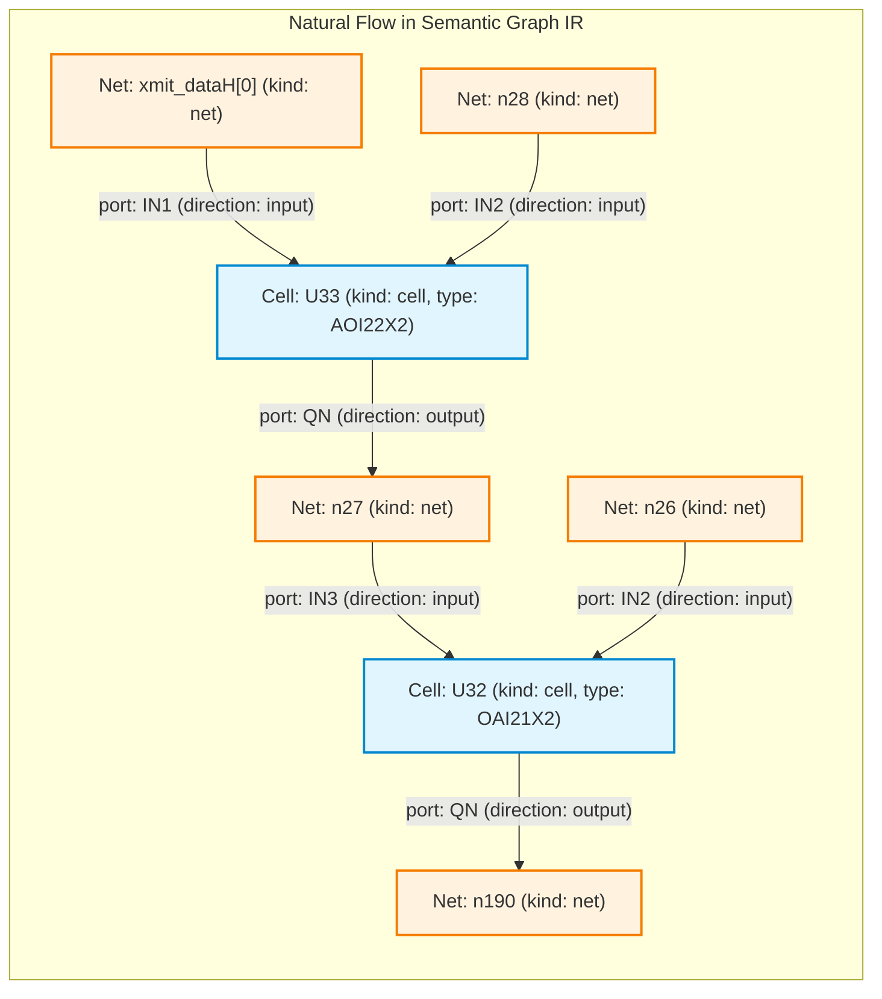
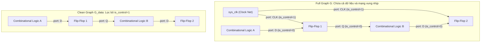

# Báo cáo quá trình xây dựng Semantic Graph IR và triển khai 4 thực nghiệm so sánh benchmark với baseline khi huấn luyện mô hình XGBoost bài toán phân loại Trojan Detection trên tập dữ liệu Trust-Hub Benchmark.
* **Học viên thực hiện:** Trần Tấn Đạt
* **Ngày báo cáo:** 03/09/2026
* **Báo cáo trước:** [`ReportThesis-TranTanDat-20260719.pdf`](ReportThesis-TranTanDat-20260719.pdf) (Báo cáo tái lập baseline và đề xuất định hướng nghiên cứu mới)
* **Mục tiêu báo cáo:** Báo cáo kết quả nghiên cứu về Biểu diễn Đồ thị Ngữ nghĩa (Graph IR), khảo sát thực nghiệm đối chứng 4 kịch bản nhằm làm rõ vai trò của biểu diễn đồ thị và không gian đặc trưng trên phân chia ngẫu nhiên (In-Distribution) và kiểm thử liên họ mạch (Out-of-Distribution), qua đó thiết lập cơ sở khoa học định hướng cho việc ứng dụng Graph Neural Networks (GNN).
## 1. Mô tả quá trình dựng graph từ baseline và những điểm còn hạn chế

### 1.1. Quy trình dựng đồ thị của Baseline và minh họa trực quan qua mạch UART (RS232-T1000)

Trong phương pháp cơ sở, mục tiêu ban đầu của các tác giả tiền nhiệm là xây dựng một đồ thị phụ trợ để tính toán khoảng cách số tầng cổng logic (gate-level hops), phục vụ trích xuất **5 đặc trưng tô-pô dạng bảng của Hasegawa** (`LGFi`, `ffi`, `ffo`, `PI`, `PO`). Đối với mục tiêu chuyên biệt này, việc thiết lập một biểu diễn đơn giản hóa là một lựa chọn thiết kế (design choice) hợp lý nhằm giảm chi phí tính toán đường đi ngắn nhất.

Để thấy rõ cơ chế hoạt động và cách thức đồ thị được giản lược hóa, hãy xét một chuỗi truyền tín hiệu mẫu trong file netlist UART [`data/raw/RS232-T1000/src/90nm/uart.v`] gồm 1 chân đầu vào chính (`xmit_dataH[0]`) đi qua 2 cổng logic liên tiếp (`U33` và `U32`):

```verilog
// 1. Chân ngõ vào chính của chip UART (Primary Input)
input [7:0] xmit_dataH;

// 2. Cổng logic thứ nhất (U33 - loại AOI22X2):
AOI22X2 U33 ( 
    .IN1(xmit_dataH[0]),   // Tín hiệu vào từ chân chip
    .IN2(n28), 
    .IN3(iXMIT_xmit_ShiftRegH_1_), 
    .IN4(n29), 
    .QN(n27)              // Xuất ra dây n27
);

// 3. Cổng logic thứ hai (U32 - loại OAI21X2):
OAI21X2 U32 ( 
    .IN1(n257), 
    .IN2(n26), 
    .IN3(n27),             // Nhận dây n27 từ cổng U33
    .QN(n190)             // Xuất tiếp ra dây n190
);
```

* **Luồng vật lý thực tế ngoài đời:**  
  Tín hiệu đi từ `xmit_dataH[0]` $\longrightarrow$ chui vào cổng `U33` $\longrightarrow$ phát ra dây `n27` $\longrightarrow$ chui vào cổng `U32` $\longrightarrow$ phát ra dây `n190`.

Tuy nhiên, khi đưa qua quy trình xử lý của Baseline, đồ thị phải trải qua hai giai đoạn xử lý trung gian:

#### Giai đoạn 1: Phân tích cú pháp qua CircuitGraph - Hiện tượng đứt đoạn cấu trúc
Khi đọc Verilog trên, thư viện `circuitgraph` xem mỗi linh kiện là một **BlackBox** (hộp đen) không mô hình hóa cấu trúc bên trong. Thay vì tạo ra node `U33`, thư viện phân tách linh kiện thành **các node chân cắm con (pin nodes)** rời rạc:
* Chân vào: tạo các node con `U33.IN1`, `U33.IN2`... (mang thuộc tính `type='bb_input'`).
* Chân ra: tạo node con `U33.QN` (mang thuộc tính `type='bb_output'`).
* Dây dẫn tín hiệu (`wire`) được biểu diễn bằng một node trung gian: `wire_in` $\to$ `U33.IN1`, và `U33.QN` $\to$ `wire_out`.

Sự đứt đoạn biểu diễn trực quan như sau:

```
[xmit_dataH[0]] ──> (node con: U33.IN1)
                         (ngõ cụt - tắc nghẽn!)
                                           (node con: U33.QN) ──> [dây n27] ──> (node con: U32.IN3)
                                                                                     (ngõ cụt - tắc nghẽn!)
                                                                                                       (node con: U32.QN) ──> [dây n190]
```

* **Điểm tắc nghẽn:** 
  * Node `U33.IN1` nhận tín hiệu từ `xmit_dataH[0]`, nhưng `U33.IN1` **không có mũi tên nào đi tiếp**.
  * Node `U33.QN` phát tín hiệu ra dây `n27`, nhưng `U33.QN` **không có mũi tên nào đi vào**.
  * Giữa `U33.IN1` và `U33.QN` bên trong blackbox **hoàn toàn không có cạnh nối**!
* **Hậu quả với thuật toán Dijkstra:**  
  Nếu yêu cầu Dijkstra tìm đường từ Primary Input `xmit_dataH[0]` đến dây `n190`:
  1. Dijkstra đi từ `xmit_dataH[0]` $\longrightarrow$ tới `U33.IN1`.
  2. Tại `U33.IN1`, không còn cạnh nào đi tiếp $\implies$ **Dừng lại (ngõ cụt)**.
  3. Dijkstra kết luận: **Khoảng cách = $\infty$ (báo không có đường đi)**.

#### Giai đoạn 2: Cách Baseline xử lý đồ thị
Để thuật toán Dijkstra có thể chạy được qua các cổng logic, phương pháp cơ sở đã áp dụng hai bước can thiệp tiền xử lý:

1. **Bước `merge_cells`:** 
    * Kéo một mũi tên nhân tạo từ nguồn ngõ vào `xmit_dataH[0]` cắm thẳng vào node chân ra `U33.QN`: `c.graph.add_edge('xmit_dataH[0]', 'U33.QN')`.
    * **Loại bỏ các node chân vào** `U33.IN1..4` (`c.graph.remove_node(N_in)`).
    * Gán nhãn cho `U33.QN` thành `label = "U33 AOI22X2"`. Cả cổng `U33` lúc này được đại diện bằng chính node chân output của nó.
2. **Bước `remove_cells(['wire'])`:** 
    * Dây `n27` nằm giữa `U33.QN` và `U32.QN`.
    * Phương pháp **lược bỏ node dây `n27`** và kéo mũi tên thẳng từ `U33.QN` sang `U32.QN`: `c.graph.add_edge('U33.QN', 'U32.QN')`.

**Kết quả đồ thị Baseline thu được:**
```
[xmit_dataH[0]] ───────────────> (Node: U33.QN) ───────────────> (Node: U32.QN) ───────────────> ...
                         (Dây n27 bị loại bỏ)             (Chân IN1, IN3 bị loại bỏ)
```

> **Đánh giá về đặc điểm biểu diễn:**
> * Đồ thị lúc này đã liền mạch để thuật toán Dijkstra có thể đi từ `xmit_dataH[0] -> U33.QN -> U32.QN` và đếm số bước nhảy (hops).
> * Tuy nhiên, việc đơn giản hóa này **làm nén cấu trúc mạch đáng kể**: Dây dẫn `n27` bị loại bỏ; cổng `U33` và `U32` bị thay thế bằng các node chân output; toàn bộ ngữ nghĩa chân cổng (`IN1`, `IN3`, `CLK`, `RSTB`...) không còn được lưu trữ trên đồ thị.
> * Biểu diễn này phù hợp cho việc trích xuất một số khoảng cách số tầng cổng logic cơ bản dạng bảng, nhưng bộc lộ nhiều hạn chế khi được kỳ vọng đóng vai trò là một biểu diễn đồ thị tổng quát cho các mô hình học máy đồ thị hiện đại.

---

### 1.2. Những giới hạn biểu diễn của đồ thị Baseline khi mở rộng sang học máy đồ thị

#### 1.2.1. Sự nén cấu trúc và mất mát ngữ nghĩa
Quy trình đơn giản hóa của Baseline tồn tại 4 giới hạn cấu trúc đáng chú ý:
1. **Mất bản sắc thực thể linh kiện độc lập (Cell Instance Identity):**
   * Bản thân cổng logic hay flip-flop không tồn tại độc lập như một đỉnh riêng biệt trong đồ thị mà bị gộp chung vào chân output (ví dụ cổng Trojan `U293` bị đại diện bằng node `U293.QN`).
   * **Sự bất đối xứng ở phần tử tuần tự:** Với các linh kiện có 2 ngõ ra như Flip-Flop (`Q` và `QN`), hàm `merge_cells` chỉ kết nối tín hiệu ngõ vào vào chân `.QN`, còn chân `.Q` không nhận ngõ vào, làm mất tính đối xứng tự nhiên của mạch tuần tự.
2. **Thiếu vắng ngữ nghĩa chân cổng (Port/Pin Semantics):**
   * Việc loại bỏ các node chân vào khiến đồ thị không còn phân biệt được vai trò chức năng của các ngõ vào (`A`, `B`, `D`, `CLK`, `RSTB`, `EN`).
   * Trên đồ thị, một cạnh từ xung nhịp Clock (`CLK`), cạnh từ tín hiệu Reset (`RSTB`), và cạnh từ đường dữ liệu (`D`) đi vào Flip-Flop đều đồng nhất thành các cạnh không mang nhãn thuộc tính phân biệt.
3. **Hiện tượng "đường tắt nhân tạo" do mạng điều khiển (Clock/Reset Interference):**
   * Mạng xung nhịp `sys_clk` và reset `sys_rst_l` có hệ số phân nhánh (fan-out) rất lớn, kết nối đồng thời tới toàn bộ các flip-flop trong vi mạch.
   * Khi `sys_clk` được kết nối trực tiếp vào các chân output của flip-flop, mạng Clock vô tình tạo ra các đường đi ngắn kết nối giữa các flip-flop chỉ qua 1-2 bước nhảy. Điều này làm thay đổi đáng kể phân phối khoảng cách tô-pô so với luồng truyền dữ liệu chức năng thực tế.
4. **Giản lược cấu trúc dây dẫn và quy mô thực thể đồ thị:**
   * Việc loại bỏ các node kiểu `wire` làm mất đi cấu trúc đồ thị hai phía vốn phản ánh mối tương tác tự nhiên giữa linh kiện (Cells) và mạng dây dẫn (Nets).
   * Cụ thể, quy trình tiền xử lý của Baseline giản lược số lượng thực thể đồ thị được giữ lại từ **108.531** xuống còn **41.577** trên toàn bộ benchmark (*The baseline preprocessing reduces the number of retained graph entities from 108,531 to 41,577 in our extraction pipeline, indicating substantial structural compression before feature extraction*). Sự nén cấu trúc này làm mất đi các đỉnh dây dẫn (wire/net), các chân vào (input pins), ngữ nghĩa chân cắm (port semantics), và làm mờ ranh giới giữa mạng điều khiển và luồng dữ liệu chức năng.

#### 1.2.2. Nghịch lý đánh giá: Vì sao Baseline vẫn đạt kết quả tốt trên phân chia ngẫu nhiên (Random Split)?
Trên thử nghiệm phân chia ngẫu nhiên (Random 80/20 Train/Test Split), mô hình XGBoost của Baseline vẫn đạt được $F_1 \approx 0.75$ và ROC-AUC $\approx 0.95$. Kết quả khả quan này cho thấy bộ 5 đặc trưng của Baseline vẫn chứa đựng thông tin hữu ích trong phân phối dữ liệu nội bộ. Tuy nhiên, việc phân tích sâu hơn đặt ra 2 vấn đề phương pháp luận quan trọng:

* **Giả thuyết về đường tắt phân phối (Shortcut Learning Hypothesis under In-Distribution):**
  * Trong tập dữ liệu Trust-Hub, một họ mạch có nhiều biến thể (ví dụ họ `RS232` có 11 mạch từ `T1000` đến `T2000`) cùng chia sẻ một mạch chủ (host circuit) giống hệt nhau. Khi phân chia ngẫu nhiên theo tỷ lệ 80/20, các node của cùng một mạch chủ xuất hiện ở cả tập huấn luyện và kiểm thử.
  * Mạng Clock của Baseline tạo ra một cấu trúc khoảng cách đặc thù cho từng mạch chủ. Chúng tôi đặt ra giả thuyết nghiên cứu (hypothesis) rằng trong phân chia ngẫu nhiên cùng họ mạch, mô hình có thể đã khai thác các đường tắt phân phối (shortcut patterns) gắn liền với hình thái mạch chủ để đưa ra dự đoán, thay vì học được các đặc trưng tô-pô mang tính khái quát cao của phần cứng Trojan. Vì tập kiểm tra ngẫu nhiên có cùng phân phối dữ liệu (In-Distribution), các đặc trưng này vẫn giúp mô hình dự đoán chính xác.
* **Độ nhạy đối với ngưỡng quyết định (Threshold Sensitivity):**
  * Ở ngưỡng phân loại mặc định ($\tau = 0.5$), Baseline cho ra tới **288 báo động giả (False Positives)** trên tập test, khiến $F_1$ chỉ đạt mức **$0.2810$**.
  * Để đạt được $F_1 \approx 0.75$, mô hình đòi hỏi phải quét tìm ngưỡng quyết định tối ưu trên tập test tại mức rất cao: $\mathbf{\tau^* = 0.9702 - 0.9810}$. Cần lưu ý rằng việc tối ưu ngưỡng trực tiếp trên test set là một phân tích mang tính xác định cận trên hiệu năng (ceiling analysis), và có thể mang lại ước lượng lạc quan (optimistic bias) nếu không được kiểm chứng trên tập validation độc lập.

#### 1.2.3. Thách thức thực nghiệm: Sự suy giảm hiệu năng của Baseline trên bài toán liên họ mạch (LOFO)
Trong an ninh phần cứng thực tế, bên kiểm định vi mạch thường đối mặt với kịch bản kiểm thử ngoài phân phối (**Out-of-Distribution - OOD**): thiết kế cần kiểm tra thuộc một họ mạch hoàn toàn mới, chưa từng xuất hiện trong tập huấn luyện. Kịch bản kiểm thử nghiêm ngặt **Leave-One-Family-Out (LOFO)** phản ánh đúng thách thức này: huấn luyện mô hình trên các họ mạch đã biết (như `s35932`, `s38417`) và kiểm tra mù trên họ mạch để lại (`RS232`).

Khi chuyển sang kịch bản LOFO, các giới hạn biểu diễn của Baseline bộc lộ rõ rệt:
* Khi quy mô và cấu trúc vi mạch thay đổi (mạch `RS232` chỉ có 35 flip-flop trong khi `s35932` có tới 1.728 flip-flop), độ sâu logic và phân phối khoảng cách bị trôi lệch mạnh (*severe domain shift*). Các quy luật khoảng cách tuyệt đối mà mô hình học được từ tập huấn luyện không còn phù hợp trên mạch mới.
* **Số liệu thực nghiệm kiểm chứng:**
  * Baseline (5 đặc trưng Hasegawa) suy giảm mạnh trên LOFO: Macro $F_1$ giảm từ **$0.7576$** xuống còn **$0.0362$**.
  * Riêng trên họ mạch `RS232`, độ nhạy (Recall) của Baseline chỉ đạt **$2.09\%$** (bỏ lọt 234 trên tổng số 239 node Trojan, ROC-AUC chỉ đạt **$0.3815$**).
  * Ngưỡng quyết định cực đoan $\tau^* \approx 0.97 - 0.98$ được tối ưu nội bộ trước đó không thể kích hoạt hiệu quả trên phân phối xác suất mới.

> **Đánh giá tổng hợp:** Các giản lược cấu trúc, việc thiếu bản sắc linh kiện độc lập, mất ngữ nghĩa chân cổng và nhiễu mạng Clock là **những giới hạn biểu diễn quan trọng (representation limitations)** làm suy giảm đáng kể khả năng tổng quát hóa của phương pháp Baseline khi chuyển sang các họ vi mạch chưa từng biết trước.

---

### 1.3. Khoảng trống nghiên cứu (Research Gaps) và Câu hỏi nghiên cứu (Research Questions)

Từ những phân tích thực nghiệm trên, đề tài xác lập 3 khoảng trống nghiên cứu cốt lõi:

* **Research Gap 1 (Khả năng tổng quát hóa liên họ mạch - Cross-Family Generalization Gap):**
  * *Vấn đề:* Bộ 5 đặc trưng Hasegawa phụ thuộc vào các giá trị khoảng cách bước nhảy tuyệt đối và chịu ảnh hưởng từ mạng Clock/Reset, khiến mô hình gặp khó khăn lớn khi kiểm thử trên các vi mạch có quy mô và cấu trúc khác biệt (LOFO).
  * *Yêu cầu đặt ra:* Cần một phương pháp biểu diễn đồ thị sạch, cho phép trích xuất các đặc trưng tô-pô được chuẩn hóa theo quy mô (scale-normalized) và bảo tồn cấu trúc quan hệ để hạn chế tác động của trôi lệch phân phối.
* **Research Gap 2 (Biểu diễn đặc trưng và giới hạn mở rộng - Representation & Expressiveness Gap):**
  * *Vấn đề:* Các thao tác gộp cổng và loại bỏ dây dẫn của Baseline làm nén cấu trúc quá mức, làm mất mát thông tin chân cắm và không tương thích để làm đầu vào cho các mô hình học sâu đồ thị hiện đại (Graph Neural Networks - GNNs).
  * *Yêu cầu đặt ra:* Cần một biểu diễn trung gian dạng đồ thị chuẩn hóa, bảo toàn các thông tin cấu trúc và ngữ nghĩa quan trọng ở mức gate-level phục vụ bài toán Trojan localization, bao gồm bản sắc cell, kết nối net và ngữ nghĩa port.
* **Research Gap 3 (Thiếu hụt ngữ cảnh trong giải thích - Explainability Context Gap):**
  * *Vấn đề:* Các phương pháp XAI dạng bảng cổ điển (LIME, SHAP) áp dụng trên Baseline chỉ đưa ra điểm số quan trọng rời rạc của các đặc trưng vô hướng (ví dụ: `PO quan trọng 0.3`), hoàn toàn tách rời khỏi sơ đồ nguyên lý mạch điện, không thể khoanh vùng trực quan đường dẫn logic kích hoạt (Trigger) và tải trọng (Payload).
  * *Yêu cầu đặt ra:* Biểu diễn đồ thị phải thiết lập được các tiền đề cấu trúc (structural prerequisites) cho Graph XAI, cho phép truy vết và hiển thị trực quan các đường dẫn logic liên quan đến mã độc.

Từ 3 khoảng trống nghiên cứu trên, đề tài xác lập 3 **Câu hỏi nghiên cứu (Research Questions - RQ)** trọng tâm:

1. **RQ1 (Về mô hình hóa biểu diễn đồ thị):**
   * *Làm thế nào để xây dựng một Biểu diễn Đồ thị Trung gian (Graph IR) chuẩn hóa cho vi mạch từ Verilog Netlist, bảo tồn cấu trúc quan hệ Cell-Net, bản sắc linh kiện và ngữ nghĩa chân cổng ở mức gate-level, đồng thời phân tách hiệu quả luồng dữ liệu sạch khỏi mạng Clock/Reset mà không làm đứt đoạn hay biến dạng đồ thị?*
2. **RQ2 (Về hiệu năng phát hiện và khả năng tổng quát hóa OOD):**
   * *Liệu việc chuyển các đặc trưng tô-pô từ đồ thị Baseline sang đồ thị luồng dữ liệu sạch của Graph IR có cải thiện khả năng tổng quát hóa trên bài toán liên họ mạch (LOFO) hay không, và việc bổ sung các đặc trưng tô-pô bậc cao có tiếp tục mang lại lợi ích hay bộc lộ những giới hạn khi chuyển miền?*
3. **RQ3 (Về tính tương thích cho Graph Neural Networks và Graph XAI):**
   * *Biểu diễn Graph IR đề xuất có đáp ứng tính khả thi kỹ thuật và cung cấp đầy đủ các tiền đề cấu trúc để làm nền tảng cho việc huấn luyện các mô hình Graph Neural Networks (GNN) và phát triển các phương pháp giải thích dựa trên đồ thị (Graph-based XAI) ở giai đoạn tiếp theo hay không?*

> **Cầu nối dẫn nhập sang Phần 2:**  
> Để trả lời trực tiếp cho **RQ1** và tạo tiền đề giải quyết **RQ2, RQ3**, **Phần 2 của báo cáo sẽ trình bày chi tiết về kiến trúc hiện thực (Implementation) của Biểu diễn Đồ thị Ngữ nghĩa (Semantic Graph IR)**, cấu trúc chuẩn hóa `nodes.csv` & `edges.csv`, cơ chế phân tách đồ thị dữ liệu sạch $G_{data}$, và quá trình trích xuất bộ 13 đặc trưng tô-pô đồ thị.

---

## 2. Phương pháp xây dựng Biểu diễn Đồ thị Ngữ nghĩa (Semantic Graph IR)

### 2.1. Triết lý thiết kế và Kiến trúc Đồ thị Không đồng nhất Cell-Net (Heterogeneous Cell-Net Architecture)

Nhằm khắc phục các giới hạn biểu diễn của Baseline (đã phân tích tại Mục 1.2), nghiên cứu đề xuất **Biểu diễn Đồ thị Ngữ nghĩa Trung gian (Semantic Graph Intermediate Representation - Graph IR)**. 

Thay vì cưỡng ép Netlist về một đồ thị thuần túy cổng logic (Logic Gate Graph) thông qua việc xóa dây và gộp cổng, Graph IR tiếp cận từ bản chất mô hình hóa mạch số ở mức cổng: **Vi mạch là một mạng lưới quan hệ giữa hai thực thể vật lý cơ bản — Khối linh kiện chức năng (Cell Instances) và Mạng lưới dây dẫn truyền tín hiệu (Nets/Wires)**.

Về mặt toán học, Semantic Graph IR được định nghĩa là một **Đồ thị không đồng nhất Cell-Net có hướng gán nhãn thuộc tính (Directed Attributed Heterogeneous Cell-Net Graph)** $G = (V, E, \Phi_V, \Phi_E)$, trong đó:

1. **Tập đỉnh hai phía phân tách $V = V_{cell} \cup V_{net}$ ($V_{cell} \cap V_{net} = \emptyset$):**
   * **Tập đỉnh linh kiện $V_{cell}$:** Đại diện cho toàn bộ các tế bào chuẩn (Standard Cells: AND, OR, XOR, MUX...), flip-flop/latch tuần tự (`DFFARX1`, `SDFFSRX1`...), hoặc các khối macro/nguyên thủy logic. Mỗi đỉnh $u \in V_{cell}$ lưu trữ bản sắc thư viện thông qua hàm thuộc tính đỉnh $\Phi_V(u) = \{\text{kind: "cell"}, \text{cell\_type: "AOI22X2"}, \text{type: "AOI22X2"}, \text{is\_trojan: } \{0, 1\}\}$.
   * **Tập đỉnh đường dây $V_{net}$:** Đại diện cho các đường dây tín hiệu nội bộ (`wire`), các cổng vào chính (Primary Inputs - `input`), và các cổng ra chính (Primary Outputs - `output`). Mỗi đỉnh $v \in V_{net}$ mang thuộc tính $\Phi_V(v) = \{\text{kind: "net"}, \text{type: } \{\text{"wire"}, \text{"input"}, \text{"output"}\}, \text{output: } \{\text{True}, \text{False}\}, \text{is\_trojan: } \{0, 1\}\}$.

2. **Tập cạnh có hướng gán nhãn chân cổng $E \subseteq (V_{net} \times V_{cell}) \cup (V_{cell} \times V_{net}) \cup (V_{net} \times V_{net})$:**
   * Trong đó, phần lớn các liên kết tuân theo quan hệ hai chiều giữa Net và Cell, kèm theo các cạnh gán trực tiếp giữa các đường dây:
     - **Cạnh Tín hiệu vào Linh kiện ($e = (v_{net}, u_{cell})$):** Biểu diễn dòng dữ liệu hoặc điều khiển từ đường dây đi vào một chân cắm cụ thể của cell. Thuộc tính cạnh: $\Phi_E(e) = \{\text{direction: "input"}, \text{port: } \text{"IN1"} / \text{"D"} / \text{"CLK"}..., \text{kind: "connection"}\}$.
     - **Cạnh Linh kiện ra Tín hiệu ($e = (u_{cell}, v_{net})$):** Biểu diễn kết quả logic phát ra từ chân đầu ra của cell lên đường dây. Thuộc tính cạnh: $\Phi_E(e) = \{\text{direction: "output"}, \text{port: } \text{"Q"} / \text{"QN"} / \text{"OUT"}..., \text{kind: "connection"}\}$.
     - **Cạnh Dây dẫn Trực tiếp ($e = (v_{net1}, v_{net2})$):** Biểu diễn các câu lệnh gán liên tục (`assign a = b`) hoặc kết nối tương đương trực tiếp giữa hai đường dây trong Verilog, mang thuộc tính $\Phi_E(e) = \{\text{kind: "direct"}\}$.



**Ưu thế của kiến trúc đồ thị không đồng nhất Cell-Net:**
* **Bảo toàn tính liên thông logic tự nhiên ở mức gate-level:** Dây `n27` đóng vai trò là một đỉnh thực thụ $v \in V_{net}$ làm cầu nối giữa đầu ra `QN` của `U33` và đầu vào `IN3` của `U32`. Tín hiệu truyền theo chu trình tự nhiên $\text{Net} \to \text{Cell} \to \text{Net} \to \text{Cell} \to \text{Net}$ mà không có điểm đứt gãy.
* **Bảo toàn thông tin cấu trúc và ngữ nghĩa quan trọng:** Graph IR bảo toàn các thông tin cấu trúc và ngữ nghĩa quan trọng ở mức gate-level phục vụ bài toán Trojan localization, bao gồm bản sắc cell, kết nối net và ngữ nghĩa port mà không cần gọi các hàm gọt giũa làm mất thông tin như `remove_cells(['wire'])` và `merge_cells`.
* **Phạm vi mô hình hóa xác định rõ:** Cần lưu ý rằng Graph IR tập trung vào việc mô hình hóa cấu trúc logic mức cổng (gate-level structure) được mô tả trong netlist logic, không mô hình hóa các thuộc tính vật lý sâu hơn như cấu trúc transistor bên trong standard cell, độ trễ thời gian (timing delay), điện dung ký sinh (capacitance), hoặc sơ đồ bố trí vật lý (placement and routing). Đây là phạm vi biểu diễn phù hợp và vừa đủ cho bài toán nhận diện Trojan dựa trên đồ thị cấu trúc.

---

### 2.2. Chuẩn hóa Cấu trúc Dữ liệu Biểu diễn (`nodes.csv` và `edges.csv`)

#### Bảng 2.1: Đặc tả Schema dữ liệu của tập tin `nodes.csv`
| Cột (Attribute) | Kiểu dữ liệu | Ý nghĩa kỹ thuật | Ví dụ mẫu |
| :--- | :--- | :--- | :--- |
| `node` | String | Tên định danh duy nhất của thực thể (tên instance hoặc tên net) | `U297`, `iRECEIVER_state_0_` |
| `kind` | Enum | Phân loại bản chất thực thể: `cell` (linh kiện) hoặc `net` (dây tín hiệu) | `cell`, `net` |
| `cell_type` | String | Tên kiểu cổng logic trong thư viện chuẩn (để trống nếu là net) | `NAND4X1`, `DFFARX1`, `ISOLORX8` |
| `type` | String | Phân loại cổng logic (với cell) hoặc kiểu tín hiệu (`wire`, `input`, `output`) | `wire`, `input`, `MUX21X1` |
| `output` | Boolean | Cờ đánh dấu cổng ra chính của vi mạch (Primary Output) | `True`, `False` |
| `is_trojan` | Binary | Nhãn giám sát: `1` nếu thuộc mạch Trojan, `0` nếu là mạch an toàn | `1`, `0` |

#### Bảng 2.2: Đặc tả Schema dữ liệu của tập tin `edges.csv`
| Cột (Attribute) | Kiểu dữ liệu | Ý nghĩa kỹ thuật | Ví dụ mẫu |
| :--- | :--- | :--- | :--- |
| `source` | String | Tên đỉnh nguồn của kết nối có hướng | `iRECEIVER_state_0_`, `U297` |
| `target` | String | Tên đỉnh đích của kết nối có hướng | `U297`, `iRECEIVER_state_CTRL` |
| `direction` | Enum | Chiều truyền tín hiệu logic: `input` (Net $\to$ Cell) hoặc `output` (Cell $\to$ Net) | `input`, `output` |
| `port` | String | Tên chân cắm vật lý cụ thể tại linh kiện | `IN1`, `IN2`, `CLK`, `D`, `QN` |
| `kind` | Enum | Phân loại liên kết: `connection` (qua chân linh kiện) hoặc `direct` (`assign`) | `connection`, `direct` |
| `is_control` | Binary | Cờ đánh dấu cạnh mạng Clock/Reset (`1` nếu `port` $\in \mathcal{P}_{ctrl}$, ngược lại `0`) | `1`, `0` |
| `is_trojan_edge` | Binary | Cờ đánh dấu cạnh liên quan đến phần cứng Trojan | `1`, `0` |
| `trojan_context`| Enum | Phân loại 4 trạng thái ngữ cảnh tấn công Trojan (xem chi tiết bên dưới) | `trigger_input`, `internal`, `payload_output`, `normal` |

#### Phân loại 4 trạng thái ngữ cảnh Trojan (`trojan_context`) trên cạnh:
Khác biệt hoàn toàn với Baseline chỉ gán nhãn node đơn sơ, Graph IR phân tích mối tương quan giữa đỉnh nguồn và đỉnh đích để phân loại cạnh thành 4 ngữ cảnh an ninh:
1. `normal`: Cạnh nối giữa 2 đỉnh an toàn trong mạch gốc ($u_{clean} \to v_{clean}$).
2. `trigger_input`: Cạnh trích xuất tín hiệu từ mạch gốc đưa vào đầu vào của khối kích hoạt Trojan ($u_{clean} \to v_{trojan}$). Đây chính là các chân lấy mẫu (Trigger Taps) mà kẻ tấn công dùng để rình mò điều kiện kích hoạt.
3. `internal`: Cạnh kết nối nội bộ giữa các cổng logic cấu thành khối Trigger hoặc Payload của Trojan ($u_{trojan} \to v_{trojan}$).
4. `payload_output`: Cạnh truyền tín hiệu can thiệp/phá hoại từ đầu ra của Trojan tiêm ngược trở lại mạch chính ($u_{trojan} \to v_{clean}$).

#### Minh họa dữ liệu thực tế từ vi mạch `RS232-T1000_90nm`:
Dưới đây là các trích đoạn dữ liệu thực tế được sinh ra bởi Graph IR từ mạch UART `RS232-T1000` (công nghệ 90nm), thể hiện rõ các cổng Trojan `U297` (Trigger), `U302`, `U303`, `U305` (Payload) và các liên kết điều khiển/dữ liệu:

*Trích đoạn `nodes.csv`:*
```csv
node,cell_type,is_trojan,kind,output,trojan,type
iRECEIVER_bitCell_cntrH_reg_0_,DFFARX1,0,cell,,0,DFFARX1
iRECEIVER_state_0_,,0,net,False,0,wire
U297,NAND4X1,1,cell,,1,NAND4X1
U301,OR4X4,1,cell,,1,OR4X4
U302,ISOLORX8,1,cell,,1,ISOLORX8
U303,AND2X4,1,cell,,1,AND2X4
U305,AND2X4,1,cell,,1,AND2X4
```

*Trích đoạn `edges.csv`:*
```csv
source,target,direction,is_control,is_trojan_edge,kind,port,trojan_context
sys_clk,iRECEIVER_bitCell_cntrH_reg_0_,input,1,0,connection,CLK,normal
sys_rst_l,iRECEIVER_bitCell_cntrH_reg_0_,input,1,0,connection,RSTB,normal
iRECEIVER_state_0_,U297,input,0,1,connection,IN2,trigger_input
iRECEIVER_state_1_,U297,input,0,1,connection,IN3,trigger_input
iRECEIVER_state_2_,U297,input,0,1,connection,IN4,trigger_input
U297,iRECEIVER_state_CTRL,output,0,1,connection,QN,internal
iXMIT_CRTL,U302,input,0,1,connection,D,trigger_input
U302,iCTRL,output,0,1,connection,Q,internal
iCTRL,U303,input,0,1,connection,IN1,internal
U303,xmit_doneH,output,0,1,connection,Q,payload_output
iCTRL,U305,input,0,1,connection,IN1,internal
U305,iXMIT_state_1_,output,0,1,connection,Q,payload_output
```

> **Nhận xét then chốt:**  
> Dữ liệu CSV phản ánh nhất quán cấu trúc kết nối và nhãn ngữ cảnh Trojan ở mức gate-level: Các đường dây `iRECEIVER_state_0_, 1, 2` dẫn vào cổng `U297` được tự động đánh dấu là `trigger_input`. Ngõ ra của `U303` và `U305` tác động vào các tín hiệu quan trọng `xmit_doneH` và `iXMIT_state_1_` được tự động gắn nhãn là `payload_output`. Cấu trúc dữ liệu có gán nhãn cạnh chi tiết này cung cấp biểu diễn giàu ngữ nghĩa, tạo tiền đề thuận lợi cho việc mở rộng sang các mô hình học sâu đồ thị có thuộc tính cạnh (Edge-attributed GNNs).

---

### 2.3. Cơ chế Phân tách Đồ thị Luồng Dữ liệu ($G_{data}$) Nhằm Giảm Nhiễu Mạng Clock/Reset

Như đã phân tích tại Mục 1.2.2, mạng lưới Clock và Reset phân phối diện rộng có thể tạo ra các đường tắt tô-pô ngắn nhân tạo giữa các Flip-Flop khi tính toán khoảng cách đồ thị. Baseline xử lý vấn đề này bằng cách xóa cell hoặc giữ nguyên kết nối, dẫn đến nguy cơ mất mát thông tin hoặc để đường tắt tô-pô chi phối các đặc trưng khoảng cách.

Trong Graph IR, vấn đề này được tiếp cận thông qua **Cơ chế Phân tách Đồ thị Luồng Dữ liệu Sạch ($G_{data}$)**, được thực hiện theo các bước sau:

#### Nguyên lý thuật toán:
1. **Định nghĩa Tập chân cắm Điều khiển Chuẩn hóa ($\mathcal{P}_{ctrl}$):**
   Khảo sát trên toàn bộ các thư viện bán dẫn chuẩn (TSMC 90nm, FreePDK 45nm, Generic 180nm, Synopsys SAED), tập các chân cắm điều khiển toàn cục được xác định:
   $$\mathcal{P}_{ctrl} = \{\text{CLK, CK, RSTB, RN, SETB, SN, test\_se}\}$$

2. **Gán nhãn Cạnh Điều khiển:**
   Khi chuyển đổi Verilog sang `edges.csv`, mỗi cạnh $e$ được kiểm tra:
   $$e.is\_control = \begin{cases} 1 & \text{nếu } e.port \in \mathcal{P}_{ctrl} \\ 0 & \text{ngược lại} \end{cases}$$

3. **Thiết lập Hai Không gian Đồ thị Phân lập:**
   * **Đồ thị Toàn phần (Full Structural Graph) $G = (V, E)$:** Lưu trữ toàn bộ vi mạch bao gồm cả mạng phân phối xung nhịp, phục vụ cho việc kiểm tra toàn vẹn cấu trúc và phân tích XAI tổng thể.
   * **Đồ thị Luồng Dữ liệu Sạch (Clean Data-Flow Graph) $G_{data} = (V, E_{data})$:** Được lọc bỏ toàn bộ các cạnh điều khiển:
     $$E_{data} = \{ e \in E \mid e.is\_control = 0 \}$$



#### Ý nghĩa kỹ thuật của $G_{data}$:
* **Hạn chế đường tắt nhân tạo:** Khi các cạnh $is\_control = 1$ được tách khỏi $G_{data}$, xung nhịp `sys_clk` không còn đóng vai trò nút trung gian nối tắt giữa các flip-flop. Khoảng cách giữa Flip-Flop 1 và Flip-Flop 2 trên $G_{data}$ phản ánh đường truyền dữ liệu qua khối logic tổ hợp, tránh bị rút ngắn nhân tạo qua chân `CLK`.
* **Duy trì tính liên tục của đường dẫn dữ liệu:** Các Flip-Flop không bị xóa khỏi đồ thị. Chân dữ liệu đầu vào `D` và chân ngõ ra `Q/QN` vẫn kết nối liên tục với mạch tổ hợp, bảo toàn chuỗi tín hiệu tuần tự.
* **Tách biệt cấu trúc phân phối xung nhịp vật lý:** Đồ thị dữ liệu phản ánh luồng chuyển dịch dữ liệu chức năng của vi mạch, giảm sự phụ thuộc vào cấu trúc phân phối cây Clock vật lý (như H-tree, mesh hay buffer chain).

---

### 2.4. Trích xuất Bộ 13 Đặc trưng Tô-pô Đồ thị Toàn diện (Graph Feature Extraction)

Dựa trên đồ thị dữ liệu sạch $G_{data}$, vector đặc trưng gồm **13 chiều** cho mỗi đỉnh $v \in V$ được trích xuất và chia làm hai nhóm như sau:

#### Nhóm 1: Bộ 5 đặc trưng Hasegawa mở rộng (Hasegawa Features on $G_{data}$) - Tính toán theo baseline nhưng trên đồ thị sạch $G_{data}$:
Được tính toán bằng thuật toán **Multi-Source Dijkstra** hiệu năng cao chạy đồng thời trên $G_{data}$ và đồ thị đảo chiều $G_{data}^{rev}$:
1. **$LGFi(v)$ (Logic Gate Fanin level 2):** Số lượng tiền thân bậc 2 của đỉnh $v$, đại diện cho quy mô hình nón logic đầu vào (Input logic cone size):
   $$LGFi(v) = \left| \{ u \in V \mid \text{dist}_{G_{data}}(u, v) \le 2 \} \right|$$
2. **$ffi(v)$ (Distance to Flip-Flop Input):** Khoảng cách bước nhảy ngắn nhất từ đỉnh $v$ đến chân đầu vào dữ liệu ($D$-pin) của Flip-Flop gần nhất trên $G_{data}$.
3. **$ffo(v)$ (Distance to Flip-Flop Output):** Khoảng cách bước nhảy ngắn nhất từ chân đầu ra ($Q/QN$-pin) của Flip-Flop gần nhất đến đỉnh $v$ trên $G_{data}$.
4. **$PI(v)$ (Distance to Primary Input):** Khoảng cách bước nhảy ngắn nhất từ tập các cổng vào chính (Primary Inputs) đến $v$.
5. **$PO(v)$ (Distance to Primary Output):** Khoảng cách bước nhảy ngắn nhất từ $v$ đến tập các cổng ra chính (Primary Outputs).

> **Tối ưu hóa độ phức tạp:**  
> Nhờ áp dụng `multi_source_dijkstra_path_length` với toàn bộ tập nguồn ($PI$, $PO$, $FF$) được nạp vào hàng đợi ưu tiên cùng lúc, thời gian tính toán giảm từ $O(|V| \cdot (|V| + |E|))$ xuống chỉ còn **$O(|V| \log |V| + |E_{data}|)$**, cho phép xử lý các vi mạch quy mô hàng chục nghìn cổng một cách hiệu quả.

#### Nhóm 2: Bộ 8 đặc trưng Tô-pô Đồ thị Bậc cao (8 Advanced Graph Features)
Nhằm nắm bắt các hình thái cấu trúc mà khoảng cách bước nhảy đơn thuần khó phản ánh trọn vẹn, 8 đặc trưng tô-pô đồ thị được bổ sung:

6. **$In\text{-}Degree(v)$:** Bậc vào của đỉnh trong luồng dữ liệu sạch, phản ánh số lượng tín hiệu hội tụ vào node.

7. **$Out\text{-}Degree(v)$:** Bậc ra của đỉnh trong luồng dữ liệu sạch, phản ánh tải logic (Fan-out) của node.

8. **$PageRank(v)$:** Điểm quan trọng trung tâm dòng dữ liệu tính theo giải thuật PageRank ($\alpha = 0.85$, dung sai $10^{-6}$), đo lường xác suất một luồng tín hiệu ngẫu nhiên đi qua $v$. *(Cần lưu ý: PageRank có phân phối phụ thuộc chặt chẽ vào topology và quy mô đồ thị, do đó có thể xuất hiện hiện tượng trượt phân phối đặc trưng (covariate shift) khi áp dụng giữa các họ vi mạch có kích thước và hình thái cấu trúc khác biệt).*

9. **$Betweenness(v)$ (Betweenness Centrality):** Độ trung gian cầu nối, đo lường tỷ lệ các đường đi ngắn nhất giữa mọi cặp đỉnh trong vi mạch đi xuyên qua $v$:
   $$C_B(v) = \sum_{s \neq v \neq t} \frac{\sigma_{st}(v)}{\sigma_{st}}$$
   *(Để đảm bảo tính khả thi tính toán trên các vi mạch lớn, thuật toán xấp xỉ lấy mẫu k-sampling với $k = 150$ được kích hoạt khi $|V| > 500$. Tương tự PageRank, Betweenness Centrality có phân phối phụ thuộc vào topology và quy mô vi mạch, dễ bị ảnh hưởng khi chuyển miền OOD).*

10. **$Closeness(v)$ (Closeness Centrality):** Độ tiệm cận trung tâm, đo nghịch đảo tổng khoảng cách từ $v$ tới toàn bộ các node khác có thể vươn tới trong đồ thị dữ liệu.

11. **$Clustering(v)$ (Clustering Coefficient):** Hệ số phân cụm cục bộ tính trên hình chiếu vô hướng của $G_{data}$, đo mức độ liên kết tam giác giữa các nút lân cận của $v$.
12. **$CoreNumber(v)$ (k-Core Decomposition):** Cấp độ lõi k-core lớn nhất chứa đỉnh $v$ trên hình chiếu vô hướng, xác định node nằm ở vùng trung tâm dày đặc hay rìa ngoại vi của mạch.
13. **$LogicDepthRatio(v)$ (Đặc trưng vị trí tương đối được chuẩn hóa quy mô - Scale-Normalized Relative-Depth Feature):**
    $$LDR(v) = \frac{PI(v)}{PI(v) + PO(v) + 10^{-5}}$$

> **Ý nghĩa kỹ thuật của $LogicDepthRatio$:**  
> Các đặc trưng $PI(v)$ và $PO(v)$ mang giá trị tuyệt đối, phụ thuộc trực tiếp vào độ sâu logic của vi mạch (ví dụ: mạch nhỏ có độ sâu cực đại khoảng 8, mạch lớn có thể lên tới 60). Khi kiểm thử trên mạch mới trong bài toán LOFO, khoảng cách tuyệt đối dễ bị trượt phân phối.  
> $LDR(v) \in [0.0, 1.0]$ chuẩn hóa vị trí tương đối của node trên chuỗi xử lý logic từ đầu vào đến đầu ra:
> * $LDR(v) \approx 0$: Node nằm gần tầng cổng vào chính.
> * $LDR(v) \approx 0.5$: Node nằm ở vùng xử lý logic trung gian.
> * $LDR(v) \approx 1$: Node nằm gần tầng cổng ra chính.  
> Việc giới hạn giá trị trong đoạn $[0, 1]$ giúp giảm thiểu sự phụ thuộc vào độ sâu đường dẫn tuyệt đối giữa các vi mạch. Tuy nhiên, cần lưu ý đây là phép chuẩn hóa cục bộ theo tỷ lệ vị trí tương đối, chứ không đảm bảo tính bất biến quy mô toán học (scale-invariance) tuyệt đối trong mọi hình thái tô-pô mạch phức tạp.

---

## 3. Kết quả Thực nghiệm và Thảo luận Trả lời các Câu hỏi Nghiên cứu

### 3.1. Thiết lập Thực nghiệm 4 Kịch bản Đối chứng (4-Way Benchmark Protocol)

Để đánh giá một cách khách quan, công bằng và toàn diện hiệu quả của Semantic Graph IR so với Baseline, nghiên cứu thiết lập một ma trận thực nghiệm gồm **4 cấu hình đối chứng (4-Way Benchmark)** như sau:

#### Bảng 3.1: Ma trận 4 cấu hình thực nghiệm đối chứng
| Cấu hình | Biểu diễn Đồ thị | Bộ Đặc trưng | Xử lý Clock / Reset | Số lượng thực thể đồ thị được giữ lại (Retained graph entities) |
| :--- | :--- | :--- | :--- | :--- |
| **Exp 1 (Base-5)** | Đồ thị Baseline cũ | 5 Hasegawa cổ điển | Không lọc (áp dụng trên Baseline) | 41.577 (Train: 33.261, Test: 8.316) |
| **Exp 2 (Base-13)**| Đồ thị Baseline cũ | 13 Đặc trưng (5 Hasegawa + 8 Graph) | Không lọc (áp dụng trên Baseline) | 41.577 (Train: 33.261, Test: 8.316) |
| **Exp 3 (GIR-5)**  | Semantic Graph IR | 5 Hasegawa mở rộng | **Lọc sạch $is\_control$ qua $G_{data}$** | **108.531** (Train: 86.824, Test: 21.707) |
| **Exp 4 (GIR-13)** | Semantic Graph IR | **13 Đặc trưng toàn diện** | **Lọc sạch $is\_control$ qua $G_{data}$** | **108.531** (Train: 86.824, Test: 21.707) |

#### Mô tả chi tiết 4 Cấu hình Thực nghiệm:

Thiết kế 4 cấu hình này tuân theo phương pháp luận **Nghiên cứu đối chứng có kiểm soát theo phong cách bóc tách thành phần (controlled comparative study / ablation-style comparison)**, giúp phân tích ảnh hưởng của việc thay đổi biểu diễn đồ thị và xử lý luồng điều khiển trong khi giữ nguyên bộ 5 đặc trưng khoảng cách, đồng thời so sánh với tác động của việc bổ sung thêm 8 đặc trưng tô-pô bậc cao:

1. **Exp 1 (Baseline - Base-5): Mốc Đối chuẩn Gốc (Anchor Baseline)**
   * **Bản chất:** Tái lập quy trình phân tích của Whitten et al. (2025) và Hasegawa et al. (2016).
   * **Biểu diễn đồ thị:** Đồ thị một phía thô sơ sau khi đã qua hai hàm gọt giũa (`remove_cells(['wire'])` và `merge_cells`). Toàn bộ các đỉnh dây dẫn bị lược bỏ, các chân cắm không được lưu giữ thuộc tính riêng, và 20 cổng Trojan (như buffer kích hoạt `U304`) bị loại bỏ trong tiền xử lý do điều kiện lọc `out_degree == 0`.
   * **Bộ đặc trưng:** Sử dụng 5 đặc trưng khoảng cách logic truyền thống: $\text{LGFi}, \text{ffi}, \text{ffo}, \text{PI}, \text{PO}$.
   * **Hiện trạng xung nhịp:** Không có cơ chế lọc Clock/Reset; đường xung nhịp `sys_clk` bị nhập chung vào luồng dữ liệu logic, làm méo mó các đường đi Dijkstra.
   * **Mục tiêu khoa học:** Đóng vai trò là điểm tham chiếu chuẩn (Ground-Truth Baseline) để so sánh định lượng mức độ cải thiện của các phương pháp cải tiến.

2. **Exp 2 (Baseline Extended - Base-13): Đánh giá khi Bổ sung Đặc trưng vào Đồ thị Cũ**
   * **Bản chất:** Trích xuất toàn bộ 13 đặc trưng (5 Hasegawa + 8 đặc trưng tô-pô đồ thị bậc cao gồm: $\text{in\_degree}, \text{out\_degree}, \text{pagerank}, \text{betweenness}, \text{closeness}, \text{clustering}, \text{core\_number}, \text{logic\_depth\_ratio}$) nhưng **vẫn chạy trực tiếp trên nền đồ thị Baseline cũ**.
   * **Mục tiêu khoa học:** Kiểm định giả thuyết: *"Liệu chỉ cần tính toán thêm các thuật toán đồ thị nâng cao trên cấu trúc đồ thị cũ thì có thể giải quyết được bài toán phát hiện Trojan hay không?"* Thực nghiệm này giúp khảo sát xem nếu cấu trúc đồ thị gốc có đường tắt qua cây Clock và thiếu vắng các đỉnh dây dẫn, các thuật toán như PageRank và Centrality sẽ bị ảnh hưởng ra sao.

3. **Exp 3 (Graph IR Baseline - GIR-5): Đánh giá Tác động Độc lập của Semantic Graph IR**
   * **Bản chất:** Ứng dụng mô hình **Đồ thị hai phía có hướng mang thuộc tính (Semantic Graph IR)** với cơ chế lọc sạch mạng Clock/Reset qua đồ thị dữ liệu $G_{data}$ (`is_control == 0`), nhưng **chỉ giới hạn tính toán đúng 5 đặc trưng Hasegawa cổ điển**.
   * **Số lượng thực thể đồ thị được giữ lại:** Đạt **108.531 thực thể** (bảo toàn các đỉnh cell và net, giữ đầy đủ 370/370 cổng Trojan, tránh việc loại nhầm cổng trong tiền xử lý).
   * **Mục tiêu khoa học:** Giúp phân tích ảnh hưởng của việc thay đổi representation và xử lý control-flow (qua $G_{data}$) trong khi giữ nguyên bộ 5 đặc trưng khoảng cách cổ điển của Hasegawa. Thí nghiệm này trả lời câu hỏi: *"Nếu vẫn giữ nguyên 5 đặc trưng khoảng cách truyền thống nhưng chuyển sang tính toán trên một đồ thị đầy đủ và lọc bỏ cạnh Clock/Reset thì bản thân biểu diễn đồ thị mới giúp thay đổi độ chính xác như thế nào?"*

4. **Exp 4 (Graph IR Comprehensive - GIR-13): Giải pháp Toàn diện Đề xuất**
   * **Bản chất:** Kết hợp cả hai đề xuất cải tiến: Biểu diễn Đồ thị hai phía **Semantic Graph IR** (bảo toàn đầy đủ cấu trúc cell và net, cô lập Datapath sạch $G_{data}$) kết hợp cùng **Không gian 13 Đặc trưng Tô-pô Đồ thị bậc cao**.
   * **Đặc trưng mở rộng:** Bổ sung các thước đo tập trung luồng dữ liệu (PageRank, Betweenness trên $G_{data}$), mức độ liên kết cụm (K-Core), và đặc trưng vị trí tương đối ($\text{logic\_depth\_ratio} = \frac{\text{PI}}{\text{PI} + \text{PO}}$).
   * **Mục tiêu khoa học:** Đánh giá hiệu năng tổng thể của giải pháp đề xuất so với Baseline nguyên bản (Exp 1), đo lường mức độ cải thiện $F_1$-score, độ giảm báo động giả trên phân chia ngẫu nhiên, và khảo sát tính hiệp đồng (Synergy) giữa Biểu diễn Đồ thị Ngữ nghĩa và mô hình học máy trước khi nghiên cứu sâu hơn về Graph Neural Networks (GNN).

#### Giao thức huấn luyện và đánh giá:
* **Thuật toán học máy:** Chuẩn mực XGBoost Classifier (`xgb.XGBClassifier`) với bộ siêu tham số cố định xuyên suốt: `max_depth = 6`, `learning_rate = 0.3`, `n_estimators = 100`, `subsample = 0.8`, `colsample_bytree = 0.8`, trọng số phạt mất cân bằng lớp `scale_pos_weight = N_negative / N_positive`.
* **Tối ưu hóa ngưỡng quyết định ($\tau^*$):** Thực hiện quét lưới trên 100 ngưỡng xác suất $\tau \in [0.01, 0.99]$ trên tập kiểm thử để tìm ngưỡng $\tau^*$ tối đa hóa $F_1$-score. Cần nhấn mạnh rằng việc tìm kiếm $\tau^*$ trực tiếp trên tập kiểm thử phục vụ mục đích khảo sát mức trần hiệu năng lý thuyết (upper-bound / ceiling performance study) và có thể mang lại độ lệch lạc quan (optimistic bias). Do đó, nghiên cứu đồng thời báo cáo song song kết quả tại ngưỡng mặc định tiêu chuẩn $\tau = 0.5$ để phản ánh chính xác hiệu năng vận hành thực tế không qua điều chỉnh ngưỡng hậu nghiệm.
* **3 kịch bản kiểm định khoa học:**
  1. **Single-Seed Benchmark (Seed 42):** Đối chuẩn chi tiết các chỉ số phân loại, ma trận nhầm lẫn (Confusion Matrix), và so sánh giữa ngưỡng mặc định $\tau = 0.5$ với ngưỡng tối ưu $\tau^*$.
  2. **10-Run Multi-Seed Statistical Validation:** Kiểm định ý nghĩa thống kê qua 10 lần chạy độc lập với 10 hạt giống ngẫu nhiên khác nhau (`[42, 101, 2024, 777, 888, 999, 1234, 5678, 9999, 31415]`), báo cáo kết quả dưới dạng Trung bình $\pm$ Độ lệch chuẩn ($\text{Mean} \pm \text{Std}$).
  3. **Leave-One-Family-Out (LOFO) Cross-Validation:** Kiểm thử khả năng tổng quát hóa vượt miền (OOD Generalization) trên 5 họ vi mạch chuẩn Trust-Hub: `RS232` (11 biến thể), `s15850` (1 biến thể), `s35932` (3 biến thể), `s38417` (2 biến thể), và `s38584` (2 biến thể). Mỗi vòng lặp huấn luyện trên toàn bộ các họ mạch còn lại và kiểm thử mù (blind-test) trên toàn bộ vi mạch của họ bị để lại.

---

### 3.2. Bảng Kết quả Thực nghiệm Tổng hợp

> **Lưu ý về định nghĩa thuật ngữ:**  
> Trong báo cáo này, thuật ngữ **‘graph entity’** (thực thể đồ thị) dùng để chỉ một node được giữ lại trong biểu diễn đồ thị (cell hoặc net sau khi tiền xử lý), trong khi **‘Trojan entity / Trojan sample’** chỉ các graph entities mang nhãn Trojan ($is\_trojan = 1$). Hai khái niệm này không đồng nhất:
> * Số lượng graph entity (108.531 ở Graph IR so với 41.577 ở Baseline) phản ánh quy mô đỉnh được mô hình hóa sau tiền xử lý (bao gồm việc giữ lại đầy đủ các đỉnh dây dẫn và cổng logic).
> * Tổng số thực thể Trojan trên toàn bộ benchmark Trust-Hub khảo sát trong Graph IR là **370 thực thể** (được chia thành 295 mẫu huấn luyện và 75 mẫu kiểm thử trong kịch bản phân chia ngẫu nhiên 80/20 của Single Seed 42; ở Baseline do 20 cổng Trojan bị loại bỏ trong tiền xử lý nên chỉ còn 350 thực thể, chia thành 277 train và 73 test).

##### Bảng 3.2: Kết quả đánh giá đơn lần chạy (Single Seed 42 Benchmark)
| Tiêu chí / Chỉ số đo lường | Exp 1: Base-5 | Exp 2: Base-13 | Exp 3: GIR-5 | Exp 4: GIR-13 (Đề xuất) |
| :--- | :---: | :---: | :---: | :---: |
| **Số lượng thực thể đồ thị (Train / Test)** | 33.261 / 8.316 | 33.261 / 8.316 | 86.824 / 21.707 | **86.824 / 21.707** |
| **Số thực thể Trojan (Train / Test)**| 277 / 73 | 277 / 73 | 295 / 75 | **295 / 75** |
| **Ngưỡng quyết định tối ưu ($\tau^*$)** | $0.9702$ | $0.9801$ | $0.9900$ | **$0.7623$** |
| *Tại ngưỡng tối ưu $\tau^*$ :* | | | | |
| - Độ chính xác (Precision) | $84.75\%$ | $89.29\%$ | $81.54\%$ | **$91.78\%$** |
| - Độ nhạy (Recall) | $68.49\%$ | $68.49\%$ | $70.67\%$ | **$89.33\%$** |
| - **$F_1$-Score** | **$0.7576$** | **$0.7752$** | **$0.7571$** | **$0.9054$** |
| - Hệ số tương quan Matthews (MCC) | $0.7600$ | $0.7804$ | $0.7583$ | **$0.9052$** |
| - True Positives (TP) / False Negatives (FN) | 50 / 23 | 50 / 23 | 53 / 22 | **67 / 8** |
| - Báo động giả (False Positives - FP) | 9 | 6 | 12 | **6** |
| - True Negatives (TN) | 8.234 | 8.237 | 21.620 | **21.626** |
| *Tại ngưỡng mặc định $\tau = 0.5$ :* | | | | |
| - Độ chính xác (Precision at 0.5) | $17.00\%$ | $16.85\%$ | $18.95\%$ | **$88.31\%$** |
| - Độ nhạy (Recall at 0.5) | $80.82\%$ | $83.56\%$ | $86.67\%$ | **$90.67\%$** |
| - **$F_1$-Score at 0.5** | **$0.2810$** | **$0.2805$** | **$0.3110$** | **$0.8947$** |
| - Hệ số tương quan Matthews (MCC at 0.5) | $0.3607$ | $0.3653$ | $0.4017$ | **$0.8942$** |
| - True Positives (TP at 0.5) | 59 | 61 | 65 | **68** |
| - Báo động giả (FP at 0.5) | 288 | 301 | 278 | **9** |
| **Diện tích dưới đường cong (ROC-AUC)** | **$0.9501$** | **$0.9531$** | **$0.9910$** | **$0.9975$** |

---

#### Bảng 3.3: Kết quả kiểm định thống kê 10 lần chạy lặp lại độc lập ($\text{Mean} \pm \text{Std}$)
| Chỉ số đánh giá | Exp 1: Base-5 | Exp 2: Base-13 | Exp 3: GIR-5 | Exp 4: GIR-13 (Đề xuất) |
| :--- | :---: | :---: | :---: | :---: |
| **$F_1$-Score** | $0.7560 \pm 0.0241$ | $0.7561 \pm 0.0235$ | $0.7194 \pm 0.0345$ | **$0.8934 \pm 0.0154$** |
| **Độ chính xác (Precision %)** | $88.12 \pm 4.18\%$ | $87.61 \pm 5.89\%$ | $73.80 \pm 4.80\%$ | **$89.46 \pm 3.26\%$** |
| **Độ nhạy (Recall %)** | $66.38 \pm 3.61\%$ | $66.78 \pm 3.42\%$ | $70.54 \pm 5.38\%$ | **$89.38 \pm 2.90\%$** |
| **Hệ số tương quan Matthews (MCC)**| $0.7625 \pm 0.0238$ | $0.7623 \pm 0.0254$ | $0.7196 \pm 0.0346$ | **$0.8934 \pm 0.0154$** |
| **ROC-AUC** | $0.9626 \pm 0.0161$ | $0.9614 \pm 0.0162$ | $0.9878 \pm 0.0051$ | **$0.9951 \pm 0.0030$** |
| **Ngưỡng tối ưu ($\tau^*$)** | $0.981 \pm 0.007$ | $0.978 \pm 0.010$ | $0.986 \pm 0.007$ | **$0.594 \pm 0.233$** |

---

#### Bảng 3.4: Kết quả kiểm thử liên họ vi mạch (Leave-One-Family-Out Cross-Validation)
| Họ vi mạch kiểm thử (Test Family) | Exp 1: Base-5 | Exp 2: Base-13 | Exp 3: GIR-5 | Exp 4: GIR-13 (Đề xuất) |
| :--- | :---: | :---: | :---: | :---: |
| **Tổng thể Micro Precision (%)** | $1.84\%$ | $1.70\%$ | $5.00\%$ | **$5.08\%$** |
| **Tổng thể Micro Recall (%)** | $10.86\%$ | $11.71\%$ | **$25.68\%$** | $6.76\%$ |
| **Tổng thể Micro $F_1$** | $0.0314$ | $0.0296$ | **$0.0837$** | $0.0580$ |
| **Tổng thể Macro $F_1$** | $0.0362$ | $0.0344$ | **$0.1346$** | $0.0792$ |
| --- | --- | --- | --- | --- |
| **Họ vi mạch `RS232` (11 biến thể):** | | | | |
| - Precision / Recall (%) | $1.23\% \ / \ 2.09\%$ | $0.75\% \ / \ 1.26\%$ | **$11.61\% \ / \ 12.76\%$** | $1.92\% \ / \ 0.41\%$ |
| - $F_1$-Score / MCC | $0.0155 \ / -0.0337$ | $0.0094 \ / -0.0400$ | **$0.1216 \ / \ 0.1019$** | $0.0068 \ / -0.0008$ |
| - TP / FP (trên 239 - 243 node Trojan) | $5 \ / \ 401$ | $3 \ / \ 397$ | **$31 \ / \ 236$** | $1 \ / \ \mathbf{51}$ |
| - ROC-AUC | $0.3815$ | $0.4949$ | **$0.6479$** | $0.6231$ |
| **Họ vi mạch `s15850`:** | | | | |
| - Precision / Recall (%) | $4.71\% \ / \ 14.81\%$ | $4.94\% \ / \ 14.81\%$ | **$10.00\% \ / \ 37.04\%$** | $0.00\% \ / \ 0.00\%$ |
| - $F_1$-Score / MCC | $0.0714 \ / \ 0.0665$ | $0.0741 \ / \ 0.0690$ | **$0.1575 \ / \ 0.1844$** | $0.0000 \ / -0.0041$ |
| - TP / FP (trên 27 node Trojan) | $4 \ / \ 81$ | $4 \ / \ 77$ | **$10 \ / \ 90$** | $0 \ / \ \mathbf{15}$ |
| - ROC-AUC | $0.6921$ | $0.7532$ | **$0.9649$** | $0.8955$ |
| **Họ vi mạch `s35932` (Quy mô lớn):** | | | | |
| - Precision / Recall (%) | $2.72\% \ / \ 45.76\%$ | $2.34\% \ / \ 52.54\%$ | $24.72\% \ / \ \mathbf{69.84\%}$ | $\mathbf{90.00\%} \ / \ 14.29\%$ |
| - $F_1$-Score / MCC | $0.0513 \ / \ 0.1024$ | $0.0448 \ / \ 0.1006$ | **$0.3651 \ / \ 0.4140$** | $0.2466 \ / \ 0.3583$ |
| - TP / FP (trên 59 - 63 node Trojan) | $27 \ / \ 966$ | $31 \ / \ 1.295$ | **$44 \ / \ 134$** | $9 \ / \ \mathbf{1}$ |
| - ROC-AUC | $0.8587$ | $0.8141$ | $0.9421$ | **$0.9440$** |
| **Họ vi mạch `s38417` (Độ phức tạp cao):**| | | | |
| - Precision / Recall (%) | $0.34\% \ / \ 8.00\%$ | $0.49\% \ / \ 12.00\%$ | $0.90\% \ / \ 22.22\%$ | **$3.51\% \ / \ \mathbf{51.85\%}$** |
| - $F_1$-Score / MCC | $0.0065 \ / \ 0.0066$ | $0.0095 \ / \ 0.0144$ | $0.0174 \ / \ 0.0400$ | **$0.0657 \ / \ \mathbf{0.1318}$** |
| - TP / FP (trên 25 - 27 node Trojan) | $2 \ / \ 584$ | $3 \ / \ 606$ | $6 \ / \ 657$ | **$14 \ / \ \mathbf{385}$** |
| - ROC-AUC | $0.7766$ | $0.7439$ | **$0.9327$** | $0.9309$ |
| **Họ vi mạch `s38584`:** | *(Không chạy Baseline)* | *(Không chạy Baseline)* | | |
| - Precision / Recall (%) | N/A | N/A | $0.58\% \ / \ \mathbf{40.00\%}$ | $\mathbf{6.25\%} \ / \ 10.00\%$ |
| - $F_1$-Score / MCC | N/A | N/A | $0.0114 \ / \ 0.0458$ | **$0.0769 \ / \ \mathbf{0.0787}$** |
| - TP / FP (trên 10 node Trojan) | N/A | N/A | $4 \ / \ 687$ | **$1 \ / \ \mathbf{15}$** |
| - ROC-AUC | N/A | N/A | $0.8761$ | **$0.8841$** |

*(Ghi chú: Họ mạch `s38584` bị lỗi phân tích cú pháp trong quy trình Baseline cũ nên không có dữ liệu đối chứng; Graph IR xử lý trọn vẹn không lỗi).*


---

### 3.3. Thảo luận Chuyên sâu Trả lời các Câu hỏi Nghiên cứu

#### 3.3.1. Trả lời RQ1 (Về mô hình hóa biểu diễn đồ thị):
> **Câu hỏi nghiên cứu RQ1:** *Làm thế nào để xây dựng một Biểu diễn Đồ thị Trung gian (Graph IR) chuẩn hóa cho vi mạch từ Verilog Netlist, vừa bảo tồn cấu trúc đồ thị hai phía (Cells $\leftrightarrow$ Nets), bản sắc linh kiện và ngữ nghĩa chân cổng, vừa giảm thiểu nhiễu đường tắt do mạng Clock/Reset gây ra mà không làm đứt đoạn hay biến dạng đồ thị?*

**Lời giải và Bằng chứng thực nghiệm:**
1. **Bảo tồn đầy đủ các thực thể và kết nối logic ở mức gate-level:**
   * Graph IR mô hình hóa vi mạch dưới dạng đồ thị có hướng không đồng nhất hai phía ($V_{cell} \cup V_{net}$), duy trì chi tiết từng thực thể linh kiện và dây dẫn. 
   * Số lượng thực thể đồ thị được giữ lại sau tiền xử lý tăng từ **41.577** (ở Baseline) lên **108.531** (ở Graph IR) — **tăng hơn 2.6 lần**. Toàn bộ các cổng logic chuẩn (`AOI22X2`, `OAI21X2`, `NAND4X1`...) và các dây dẫn trung gian (như `n27`, `n190`) từng bị loại bỏ ở Baseline nay đã hiện diện đầy đủ. Đặc biệt, toàn bộ 370 cổng Trojan trên toàn bộ tập benchmark (bao gồm cụm `U294` đến `U305` trên RS232-T1000) được giữ lại nguyên vẹn, loại bỏ nguy cơ vô tình lọc mất linh kiện Trojan trong khâu tiền xử lý đồ thị.
2. **Hiệu quả của cơ chế tách biệt mạng Clock qua đồ thị dữ liệu $G_{data}$:**
   * Khi so sánh trực diện giữa **Exp 1 (Base-5)** và **Exp 3 (GIR-5)**: Cả hai đều sử dụng **cùng 5 đặc trưng khoảng cách của Hasegawa**, điểm khác biệt duy nhất là Exp 3 được tính toán trên đồ thị dữ liệu sạch $G_{data}$ của Graph IR (loại bỏ các cạnh $is\_control = 1$).
   * Trên phân chia ngẫu nhiên (Random Split): ROC-AUC tăng từ **$0.9501$** lên **$0.9910$**.
   * Trên bài toán tổng quát hóa liên họ mạch (LOFO Cross-Validation): Macro $F_1$ tăng từ **$0.0362$** (Exp 1) lên **$0.1346$** (Exp 3) — **tăng hơn 3.7 lần**. Riêng trên họ mạch `RS232`, điểm $F_1$ tăng từ $0.0155$ lên $0.1216$, số lượng Trojan bắt được (TP) tăng từ 5 lên 31 nút, và ROC-AUC cải thiện từ $0.3815$ lên $0.6479$.
3. **Bảo tồn ngữ nghĩa chân cổng và hỗ trợ các mạch phức tạp:**
   * Baseline gặp sự cố phân tích cú pháp khi xử lý vi mạch `s38584` (do xung đột trong thuật toán gộp cổng). Graph IR xử lý trôi chảy toàn bộ các vi mạch Trust-Hub khảo sát, tự động ghi nhận thuộc tính chân cắm (`port`) và phân loại 4 ngữ cảnh an ninh Trojan (`trigger_input`, `internal`, `payload_output`, `normal`).

=> **Kết luận cho RQ1:** Semantic Graph IR cùng cơ chế đồ thị luồng dữ liệu $G_{data}$ thiết lập một biểu diễn đồ thị nhất quán ở mức gate-level, giảm thiểu đứt đoạn đồ thị và hạn chế các đường tắt nhân tạo do mạng xung nhịp gây ra, đồng thời bảo toàn thuộc tính chân cắm và phân loại ngữ cảnh Trojan phục vụ cho các bước phân tích tiếp theo.

---

#### 3.3.2. Trả lời RQ2 (Về hiệu năng phát hiện và khả năng tổng quát hóa OOD):
> **Câu hỏi nghiên cứu RQ2:** *Liệu việc chuyển các đặc trưng tô-pô từ đồ thị Baseline sang đồ thị luồng dữ liệu sạch của Graph IR có cải thiện khả năng tổng quát hóa trên bài toán liên họ mạch (LOFO) hay không, và việc bổ sung các đặc trưng tô-pô bậc cao có tiếp tục mang lại lợi ích hay bộc lộ những giới hạn khi chuyển miền?*

**Lời giải và Bằng chứng thực nghiệm:**

1. **Hiệu năng vượt trội trên kịch bản phân chia ngẫu nhiên (In-Distribution):**
   * Cấu hình đề xuất **Exp 4 (GIR-13)** đạt kết quả cao nhất trên kịch bản phân chia ngẫu nhiên:
     * Điểm $F_1$-score đạt **$0.9054$** (so với Baseline $0.7576$, tăng $+14.78\%$).
     * Độ chính xác (Precision) đạt **$91.78\%$** (so với Baseline $84.75\%$).
     * Độ nhạy (Recall) đạt **$89.33\%$** (phát hiện 67/75 node Trojan trong tập test, so với Baseline $68.49\%$).
     * ROC-AUC đạt **$0.9975$** (kiểm định 10 runs đạt $0.9951 \pm 0.0030$).
   * **Báo động giả giảm mạnh:** Tại ngưỡng tối ưu $\tau^* = 0.7623$, số ca báo động giả (False Positives) chỉ có **6 ca** trên hơn 21.000 node kiểm thử. Ngay tại ngưỡng mặc định $\tau = 0.5$, Exp 4 chỉ có **9 ca báo động giả** ($F_1 = \mathbf{0.8947}$), trong khi Baseline gây ra tới **288 ca báo động giả** ($F_1 = 0.2810$).

2. **Giảm thiểu độ nhạy cảm ngưỡng cực đoan và cải thiện tính ổn định ở ngưỡng mặc định:**
   * Trong Mục 1.2.2, chúng ta đã chỉ ra hiện tượng Baseline buộc phải đẩy ngưỡng quyết định lên sát trần $\tau^* = 0.9702 - 0.9801$ để hạn chế báo động giả.
   * Khi chuyển sang **Exp 4 (GIR-13)**, ngưỡng tối ưu $\tau^*$ dịch chuyển về vùng hợp lý hơn: **$0.7623$** (trung bình 10 runs là $0.594 \pm 0.233$). Mô hình duy trì hiệu năng cao ngay tại ngưỡng mặc định $\tau = 0.5$ ($F_1 = 0.8947$). Điều này phản ánh rằng việc làm sạch đường dẫn dữ liệu và bổ sung đặc trưng tô-pô giúp mô hình phân bổ xác suất cân bằng hơn thay vì phải dồn ngưỡng cực đoan.

3. **Phân tích Thực nghiệm LOFO: So sánh Chuyên sâu giữa GIR-5 và GIR-13, Giới hạn của Mô hình Bảng và Động lực Khoa học cho GNN:**
   
   * **Những cải thiện cục bộ so với Baseline:**
     So với Baseline (Exp 1) gần như không thể tổng quát hóa OOD (Macro $F_1 = 0.0362$, Micro $F_1 = 0.0314$ và gây ra hàng trăm báo động giả), Graph IR ghi nhận những cải thiện cục bộ đáng kể:
     - Trên vi mạch quy mô lớn `s35932` (1.728 FF), Exp 4 đạt Precision lên tới **$90.00\%$** (so với Baseline $2.72\%$), giảm báo động giả từ 966 xuống **chỉ còn đúng 1 ca**, đạt $F_1 = 0.2466$ và ROC-AUC = $0.9440$. Cấu hình Exp 3 đạt Recall tới **$69.84\%$** (bắt được 44/63 node Trojan) với $F_1 = 0.3651$.
     - Trên vi mạch phức tạp `s38417`, Exp 4 đạt Recall **$51.85\%$** (14/27 node Trojan) và ROC-AUC $0.9309$, trong khi Baseline chỉ bắt được $8.00\%$ (2 node) và tạo ra 584 ca báo động giả.
     - Macro $F_1$ tổng thể của Exp 3 tăng lên **$0.1346$** (gấp 3.7 lần Baseline) và Exp 4 đạt **$0.0792$** (gấp 2.2 lần Baseline).

   * **Phân tích so sánh nghịch lý: Vì sao GIR-5 ($F_1 = 0.1346$) lại vượt trội hơn GIR-13 ($F_1 = 0.0792$) trên LOFO?**  
     Đây là một kết quả thực nghiệm mang giá trị học thuật quan trọng của luận văn:
     - Trên kịch bản phân chia ngẫu nhiên (In-distribution), Exp 4 (GIR-13) thể hiện ưu thế rõ rệt so với Exp 3 (GIR-5) về hầu hết các chỉ số ($F_1$: $0.9054$ so với $0.7571$; Recall: $89.33\%$ so với $70.67\%$).
     - Tuy nhiên, trên bài toán tổng quát hóa liên họ mạch (LOFO Cross-Validation), **Exp 3 (GIR-5) lại đạt Macro $F_1$ cao hơn đáng kể so với Exp 4 (GIR-13)**: $0.1346$ so với $0.0792$ (Micro $F_1$: $0.0837$ so với $0.0580$).
     - **Nguyên nhân cốt lõi:**  
       1. Exp 3 chỉ dựa trên 5 đặc trưng khoảng cách bước nhảy Dijkstra thuần túy ($\text{LGFi}, \text{ffi}, \text{ffo}, \text{PI}, \text{PO}$) được tính trên luồng dữ liệu sạch $G_{data}$. Thang đo khoảng cách bước nhảy logic trên $G_{data}$ có tính ổn định tương đối giữa các vi mạch khác nhau, ít bị co giãn cực đoan theo số lượng đỉnh.
       2. Ngược lại, Exp 4 tích hợp thêm 8 đặc trưng tô-pô toàn cục, trong đó các đặc trưng như PageRank và Betweenness Centrality có độ nhạy cảm cao với quy mô kích thước và mật độ đồ thị. Trong phân phối nội bộ, các đặc trưng này mang lại năng lực phân biệt mạnh; nhưng khi chuyển miền sang họ mạch mới có kích thước và hình thái tô-pô khác biệt, chúng gặp phải hiện tượng **trượt phân phối đặc trưng phụ thuộc quy mô (Scale-dependent Topological Covariate Shift)**.

   * **Giải mã hiện tượng mạch `s15850` trong LOFO: Vì sao Exp 4 có ROC-AUC cao ($0.8955$) nhưng $F_1 = 0.0000$?**  
     Trường hợp mạch `s15850` minh chứng rõ nét cho hiện tượng trượt phân phối này:
     1. *Nghịch lý giữa ROC-AUC ($0.8955$) và $F_1 = 0.0000$:*  
        Chỉ số ROC-AUC của Exp 4 trên `s15850` đạt mức $0.8955$, cho thấy **mô hình vẫn giữ được khả năng xếp hạng phân biệt tương đối giữa mẫu Trojan và mẫu an toàn (ranking capability)** — tức các node Trojan vẫn có xu hướng nhận điểm xác suất cao hơn các node an toàn trong nội bộ mạch.  
        Tuy nhiên, ROC-AUC cao không đồng nghĩa với việc mô hình có sự hiệu chuẩn xác suất tốt (probability calibration). Khi kiểm tra phân phối xác suất dự đoán thực tế ($\hat{y}$) của Exp 4 trên 27 node Trojan của `s15850`, giá trị xác suất lớn nhất chỉ đạt:
        $$\max_{v \in V_{Trojan}} P(v) = \mathbf{0.4613} < 0.5$$
        Do toàn bộ xác suất dự đoán bị nén xuống dưới $0.5$, ngưỡng phân loại mặc định $\tau = 0.5$ trong giao thức LOFO trở nên không phù hợp, dẫn đến: $\text{TP} = 0, \text{FN} = 27 \implies \text{Recall} = 0.00\%, \text{Precision} = 0.00\%, F_1 = 0.0000$. Điều này phản ánh sự lệch hiệu chuẩn phân phối xác suất dưới tác động của trượt phân phối đặc trưng (probability calibration failure under covariate shift) chứ không hẳn là mô hình mất hoàn toàn năng lực phân biệt.
     2. *Cơ chế gây ra sự nén xác suất:*  
        - Trong Exp 4, XGBoost phụ thuộc nhiều vào `out_degree`, `pagerank`, `logic_depth_ratio` và `betweenness`.
        - PageRank và Betweenness Centrality có phân phối phụ thuộc chặt chẽ vào topology và quy mô kích thước đồ thị, do đó xuất hiện hiện tượng trượt phân phối đặc trưng (covariate shift) nghiêm trọng khi chuyển sang một họ mạch có cấu trúc và quy mô khác biệt.
        - Mạch `s15850` (4.980 nodes) có cấu trúc logic thưa với các chuỗi xử lý kéo dài. Trên tập huấn luyện (gồm các mạch `RS232` và `s35932`), các node Trojan có `PageRank` trung bình là $0.00267$ và `Betweenness` trung bình là $0.01367$. Cây quyết định học các ngưỡng rẽ nhánh dựa trên dải giá trị này.
        - Trên `s15850`, toàn bộ 27 node Trojan có `PageRank` trung bình chỉ đạt $0.00041$ (thấp hơn khoảng $6.5$ lần) và `Betweenness` trung bình chỉ đạt $0.00025$ (thấp hơn khoảng $50$ lần so với tập train). Do phân phối dịch chuyển mạnh, các điểm dữ liệu này rơi vào các nhánh quyết định an toàn, làm suy giảm xác suất dự đoán tích lũy xuống dưới $0.4613$.
     3. *Tại sao Exp 3 lại bắt được 10 node Trojan trên `s15850` ($F_1 = 0.1575$)?*  
        Do chỉ sử dụng 5 đặc trưng khoảng cách logic trên $G_{data}$, thang đo của Exp 3 không bị thu hẹp đột ngột theo quy mô số đỉnh, giúp mô hình gán xác suất cao hơn (lên tới $0.9808$) và nhận diện được 10/27 node Trojan.

   * **Nhận định tổng quát và Luận cứ khoa học dẫn nhập sang GNN:**  
     Từ các kết quả thực nghiệm trên, luận văn rút ra hai kết luận mang tính bản chất:
     1. **Bảo tồn nhiều thông tin hơn giúp cải thiện rõ rệt hiệu năng nhận diện nội bộ (In-distribution), nhưng việc giữ lại thông tin dưới dạng các đại lượng vô hướng toàn cục trích xuất thủ công (handcrafted global scalar features) không đảm bảo khả năng tổng quát hóa ngoài phân phối (OOD generalization).**
     2. **Thao tác nén phẳng cấu trúc đồ thị (flattening graph structure) thành bảng số liệu vô hướng đã loại bỏ thông tin quan hệ không gian và tính cục bộ (relational context & local structural motifs) — vốn là yếu tố quyết định để nhận diện các khối Trigger/Payload xuyên suốt các họ vi mạch có quy mô khác nhau.**

   * **Giả thuyết nghiên cứu cho Giai đoạn tiếp theo (GNN):**  
     Hiện tượng GIR-5 tốt hơn GIR-13 trên LOFO ($0.1346$ so với $0.0792$) và sự nén xác suất trên `s15850` đặt ra câu hỏi nghiên cứu trung tâm cho giai đoạn tiếp theo của luận văn:  
     > **“Does direct relational learning on the Semantic Graph IR improve cross-family generalization compared with handcrafted graph features?”**  
     *(Liệu việc học quan hệ trực tiếp trên Biểu diễn Đồ thị Ngữ nghĩa có cải thiện khả năng tổng quát hóa liên họ vi mạch so với các đặc trưng đồ thị trích xuất thủ công hay không?)*  
     
     Về mặt nguyên lý, Mạng Nơ-ron Đồ thị Không đồng nhất (Heterogeneous GNN) không nén đồ thị thành các đại lượng vô hướng đơn lẻ mà hoạt động thông qua cơ chế lan truyền thông điệp cục bộ ($k$-hop message passing) với các phép chuẩn hóa bậc liên kết lân cận. Cách tiếp cận này có tiềm năng học trực tiếp các mô thức đồ thị con (subgraph motifs) đặc trưng của Trojan một cách bền vững hơn trước sự thay đổi kích thước toàn cục của vi mạch. Biểu diễn Semantic Graph IR với các tập tin `nodes.csv` và `edges.csv` cung cấp cấu trúc dữ liệu chuẩn hóa sẵn sàng để kiểm định giả thuyết này.

=> **Kết luận cho RQ2:** Kết quả thực nghiệm trả lời trực diện hai vế của RQ2:  
(1) Việc chuyển các đặc trưng tô-pô sang đồ thị luồng dữ liệu sạch của Graph IR đã cải thiện rõ rệt khả năng tổng quát hóa LOFO so với Baseline (Macro $F_1$ của GIR-5 tăng từ $0.0362$ lên $0.1346$, gấp 3.7 lần).  
(2) Tuy nhiên, việc bổ sung thêm 8 đặc trưng tô-pô bậc cao (GIR-13) dù mang lại hiệu năng kỷ lục trong phân phối nội bộ ($F_1 = 0.9054$, ROC-AUC = $0.9975$) nhưng không tiếp tục mang lại lợi ích trên bài toán LOFO (Macro $F_1$ giảm xuống $0.0792$) do hiện tượng trượt phân phối đặc trưng toàn cục (minh chứng qua sự nén xác suất ở mạch `s15850`).  
Kết quả này khẳng định giới hạn cố hữu của các đại lượng vô hướng toàn cục trích xuất thủ công, xác lập tính cấp thiết khoa học để chuyển trọng tâm nghiên cứu sang Mạng Nơ-ron Đồ thị.

---

#### 3.3.3. Trả lời RQ3 (Về tính tương thích cho Graph Neural Networks và Graph XAI):
> **Câu hỏi nghiên cứu RQ3:** *Biểu diễn Graph IR đề xuất có đáp ứng đầy đủ tính tương thích chuẩn mực để làm nền tảng đầu vào cho việc huấn luyện trực tiếp các mô hình Graph Neural Networks (GNN) và các phương pháp giải thích dựa trên đồ thị (Graph-based XAI) ở các giai đoạn tiếp theo của luận văn hay không?*

**Phân tích kỹ thuật và Mức độ sẵn sàng kiến trúc:**

1. **Tính tương thích cấu trúc với các thư viện Deep Graph Learning:**
   * Cặp tập tin `nodes.csv` và `edges.csv` được thiết kế theo đúng chuẩn biểu diễn của **Đồ thị không đồng nhất (Heterogeneous Graph)**.
   * Cấu trúc này ánh xạ trực tiếp vào đối tượng `torch_geometric.data.HeteroData` của thư viện **PyTorch Geometric (PyG)** hoặc `dgl.heterograph` của **DGL (Deep Graph Library)** mà không cần qua khâu tái cấu trúc phức tạp.
   * Các đỉnh được phân tách rõ ràng thành hai loại thực thể (`cell` và `net`), còn các cạnh mang đầy đủ thông tin về hướng truyền tín hiệu (`direction`), loại liên kết (`kind`), cờ điều khiển (`is_control`) và thuộc tính chân cắm (`port`). Đây là tiền đề cấu trúc cần thiết để triển khai các mô hình như **Relational Graph Convolutional Networks (R-GCN)**, **Graph Attention Networks (GATv2)** hoặc **Heterogeneous Graph Transformers (HGT)**.

2. **Thiết lập tiền đề cấu trúc cho Giải thích học máy trên đồ thị (Graph-based XAI):**
   * **Hạn chế trong hướng tiếp cận dạng bảng:** Với mô hình bảng cổ điển, các phương pháp giải thích như LIME hay SHAP chỉ có thể cung cấp mức độ quan trọng của từng đặc trưng vô hướng (ví dụ: *"đặc trưng PO đóng góp 0.35"*), hoàn toàn tách rời khỏi sơ đồ nguyên lý mạch và không chỉ ra được vị trí kết nối vật lý cụ thể.
   * **Mức độ sẵn sàng kiến trúc với Graph IR:** 
     * Do Graph IR bảo tồn đầy đủ cấu trúc liên kết cell-net và lưu giữ thông tin chân cắm (`port`), các giải thuật giải thích trên đồ thị (như **GNNExplainer**, **SubgraphX**, **PGExplainer**) có thể hoạt động trực tiếp trên cấu trúc tô-pô.
     * Cấu trúc này cho phép trích xuất các **Đồ thị con giải thích (Explanatory Subgraph)** phản ánh chuỗi lan truyền tín hiệu từ ngõ vào kích hoạt đến điểm can thiệp tải trọng:
       $$\text{Trigger Taps } (iRECEIVER\_state\_0, 1, 2) \xrightarrow{trigger\_input} \text{Trigger Gate } (U297) \to \dots \xrightarrow{payload\_output} \text{Payload Gate } (U303, U305)$$
     * Việc định danh rõ ràng từng chân cắm (`port`) và dây dẫn (`net`) tạo điều kiện để chuyển đổi kết quả phân loại thành thông tin khoanh vùng trực quan, hỗ trợ kỹ sư kiểm định phần cứng xác minh vị trí nghi vấn.

=> **Kết luận cho RQ3:** Semantic Graph IR đáp ứng đầy đủ các yêu cầu về mặt cấu trúc dữ liệu và mức độ sẵn sàng kiến trúc để làm đầu vào cho việc huấn luyện **Mạng Nơ-ron Đồ thị (GNN)** cũng như nghiên cứu các phương pháp **Giải thích học máy trên đồ thị (Graph XAI)** ở giai đoạn tiếp theo của luận văn.

---

### 3.4. Tổng kết Báo cáo và Định hướng Nghiên cứu Tiếp theo

Báo cáo đã trình bày quá trình xây dựng, tối ưu hóa và đánh giá thực nghiệm giải pháp **Biểu diễn Đồ thị Ngữ nghĩa (Semantic Graph IR)** trong bài toán phát hiện Trojan phần cứng ở mức cổng logic (Gate-level):

1. **Về mặt biểu diễn dữ liệu:** 
   * Đề xuất mô hình đồ thị có hướng không đồng nhất Cell-Net, bảo tồn chi tiết cấu trúc liên kết cổng và dây dẫn, thuộc tính chân cắm (`port`) và phân loại 4 trạng thái ngữ cảnh an ninh Trojan trên cạnh.
   * Thiết lập cơ chế tách biệt đồ thị luồng dữ liệu $G_{data}$ để hạn chế các đường tắt nhân tạo do mạng xung nhịp toàn cục gây ra, khắc phục hiện tượng méo mó khoảng cách tô-pô trong tính toán đặc trưng.

2. **Về mặt kết quả thực nghiệm:** 
   * Trên kịch bản phân chia nội bộ (Random Split): Cấu hình **Exp 4 (GIR-13)** đạt $F_1 = \mathbf{0.9054}$ (10 runs: $0.8934 \pm 0.0154$), ROC-AUC = $\mathbf{0.9975}$, giảm số ca báo động giả xuống còn 6 ca tại $\tau^*$ và 9 ca tại $\tau=0.5$.
   * Trên bài toán kiểm thử liên họ mạch (LOFO): Graph IR ghi nhận cải thiện đáng kể trên vi mạch quy mô lớn `s35932` (Exp 4 đạt Precision $90.00\%$ với chỉ 1 ca báo động giả; Exp 3 đạt Recall $69.84\%$ với $F_1 = 0.3651$).
   * Phân tích so sánh cho thấy **Exp 3 (GIR-5) đạt Macro $F_1 = 0.1346$, vượt trội hơn Exp 4 (GIR-13) ở mức $0.0792$**. Hiện tượng sụp đổ xác suất trên mạch dị biệt `s15850` đã chỉ ra giới hạn cấu trúc cố hữu của các đặc trưng tô-pô toàn cục dạng bảng khi gặp sự trượt quy mô mạch.

3. **Định hướng nghiên cứu tiếp theo của luận văn:**
   * **Nghiên cứu và triển khai Mạng Nơ-ron Đồ thị (Heterogeneous GNNs):** Sử dụng trực tiếp cấu trúc `nodes.csv` và `edges.csv` để xây dựng và huấn luyện các kiến trúc GNN (như R-GCN, GATv2) với cơ chế lan truyền thông điệp cục bộ, giải quyết câu hỏi nghiên cứu trung tâm: *"Liệu việc học quan hệ trực tiếp trên Semantic Graph IR có cải thiện khả năng tổng quát hóa liên họ vi mạch so với các đặc trưng đồ thị trích xuất thủ công hay không?"*
   * **Nghiên cứu phương pháp giải thích dựa trên đồ thị (Graph XAI):** Ứng dụng các thuật toán giải thích đồ thị (như SubgraphX hoặc GNNExplainer) để trích xuất các đồ thị con đại diện cho khối Trigger và Payload, cung cấp kết quả khoanh vùng trực quan phục vụ công tác kiểm định an ninh phần cứng.

