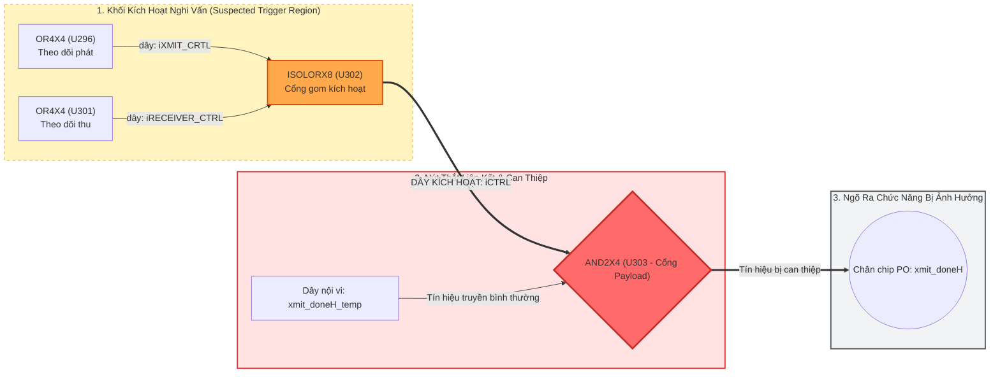

# BÁO CÁO QUÁ TRÌNH DỰNG MÔ HÌNH GNN VÀ THIẾT KẾ THỰC NGHIỆM SO SÁNH VỚI BASELINE, ĐỒNG THỜI SO SÁNH VỚI CÁC PHƯƠNG THỨC XAI BASELINE SO VỚI GRAPHXAI

**Đề tài (English):** *Graph-based Representation and Learning for Hardware Trojan Detection and Structural Localization in Netlists*  
**Đề tài (Tiếng Việt):** *Nghiên cứu Biểu diễn Đồ thị và Học sâu Đồ thị cho Phát hiện và Khoanh vùng Cấu trúc Mã độc Phần cứng trên Netlist*  
**Học viên thực hiện:** Trần Tấn Đạt  
**Ngày cập nhật:** 14/09/2026  

---

## 1. Bối cảnh, Câu hỏi Nghiên cứu & Các Hạn chế của Baseline Representation

### 1.1. Bối cảnh và Động lực Nghiên cứu
Phát hiện Mã độc Phần cứng (Hardware Trojan - HT) ở mức danh sách nối mạng cổng logic (Gate-Level Netlist) đối mặt với hai thách thức cốt lõi:
1. **Độ mất cân bằng lớp cực đoan:** Số lượng cổng logic thuộc Trojan thường chỉ chiếm từ $0.01\% - 1.5\%$ tổng số cổng trên chip.
2. **Khả năng tổng quát hóa ngoại suy (Out-of-Distribution / Cross-Family Generalization):** Các mô hình học máy truyền thống thường được đánh giá trên phân chia ngẫu nhiên (In-Distribution / Random Split), dẫn đến việc mô hình có thể ghi nhớ các đặc trưng riêng của mạch chủ (host circuit) thay vì học được cơ chế tổng quát của Trojan.

### 1.2. Câu hỏi Nghiên cứu (Research Questions)
Để định hình rõ ràng phạm vi khoa học, luận văn thiết lập 4 câu hỏi nghiên cứu:
* **RQ1 (Representation & In-Distribution Detection):** *Liệu biểu diễn đồ thị dị thể Cell-Net tường minh có cung cấp thông tin cấu trúc tốt hơn cho việc phát hiện Hardware Trojan so với biểu diễn đồ thị nén khi được đánh giá có kiểm soát hay không?*
* **RQ2 (Cross-Family Generalization):** *Liệu mô hình học sâu đồ thị (GNN) trên biểu diễn đề xuất có cải thiện khả năng tổng quát hóa liên họ vi mạch dưới giao thức Leave-One-Family-Out (LOFO) so với mô hình dạng bảng truyền thống (XGBoost) hay không?*
* **RQ3 (Component Contribution & Ablation):** *Những thành phần nào trong biểu diễn đồ thị—thực thể Net, phân loại quan hệ data/control, và đặc trưng node—thực sự đóng góp vào hiệu năng quan sát được?*
* **RQ4 (Structural Explanation & Localization):** *Liệu phương pháp giải thích dựa trên đồ thị có cung cấp được bằng chứng cấu trúc có liên kết ở mức cổng/dây dẫn vượt ra ngoài sự gán trọng số đặc trưng dạng bảng hay không?*

```text
MA TRẬN ÁNH XẠ GIỮA CÂU HỎI NGHIÊN CỨU VÀ CÁC THỰC NGHIỆM
──────────────────────────────────────────────────────────────────
RQ1 (Biểu diễn & In-Dist) ────> Exp 1 đến Exp 6 (Factorial 2x3)
RQ2 (Tổng quát hóa LOFO)  ────> Đánh giá LOFO Cross-Validation
RQ3 (Bóc tách thành phần) ────> Ma trận Ablation Study (5 cấu hình)
RQ4 (Giải thích cấu trúc) ────> GNNExplainer & Hardware Localization
```

---

### 1.3. Các Hạn chế của Representation Baseline đối với Mục tiêu Graph-based Learning
Phương pháp cơ sở (Paul Whitten et al., 2026) phân tích Netlist thông qua thư viện `circuitgraph`, nén đồ thị và trích xuất vector đặc trưng số học để huấn luyện mô hình dạng bảng (XGBoost) kết hợp Tabular XAI (SHAP/LIME). Đối với mục tiêu nghiên cứu và phát triển các mô hình học sâu đồ thị (GNN) cũng như trích xuất giải thích cấu trúc vi mạch, biểu diễn đồ thị của phương pháp cơ sở bộc lộ 3 hạn chế chính:

1. **Nén thông tin cấu trúc (Information Compression):**  
   Baseline sử dụng biểu diễn đã được nén ở mức cell/feature thông qua việc loại bỏ các nút dây dẫn (`wire`) và gộp các chân pin vào cổng logic. Do đó, một phần thông tin tường minh (explicit) về thực thể Net, mạng lưới phân nhánh (Fanout), và tính chất hai phía (Bipartite) tự nhiên của vi mạch không còn được phản ánh trực tiếp trong cấu trúc đồ thị.
2. **Ảnh hưởng từ kết nối điều khiển toàn cục (Global Control Connections):**  
   Các tín hiệu xung nhịp (`sys_clk`) và tín hiệu reset (`sys_rst_l`) có độ phân nhánh (Fanout) rất lớn, kết nối tới hàng nghìn Flip-Flop trên khắp bề mặt chip. Trong một đồ thị đồng nhất không phân biệt ngữ nghĩa cạnh, các liên kết này có thể tạo ra các đường kết nối ngắn (shortcut edges) giữa nhiều cell, dẫn đến hiện tượng mở rộng trường tiếp nhận (receptive-field contamination / global-connectivity effect) theo những quan hệ không phản ánh trực tiếp luồng dữ liệu (data-flow), từ đó có khả năng ảnh hưởng đến việc học biểu diễn cục bộ của vi mạch.
3. **Giới hạn không gian giải thích của Tabular XAI:**  
   Tabular XAI (SHAP, LIME) cung cấp attribution trong không gian đặc trưng số học ($\mathbb{R}^d$) và có thể gắn attribution với từng mẫu/cell nếu dữ liệu được tổ chức theo cell; tuy nhiên, nó không trực tiếp biểu diễn quan hệ giữa các cell/net dưới dạng một cấu trúc đồ thị con có liên kết (`cell/net-level structural evidence`).

> **Định nghĩa thuật ngữ "Semantic Graph" trong phạm vi nghiên cứu:**  
> Trong phạm vi luận văn, thuật ngữ *Semantic Graph* đề cập đến việc biểu diễn tường minh các loại thực thể phần cứng (phân tách giữa nút Cell và nút Net) cùng ngữ nghĩa chức năng của các quan hệ kết nối (chân xuất `outputs`, chân dữ liệu `data_input`, và chân điều khiển `control_input`), thay vì xem toàn bộ vi mạch như một đồ thị đồng nhất chỉ gồm các đỉnh cổng logic và các cạnh liên kết không phân biệt.

---

## 2. Phương pháp Đề xuất: Biểu diễn Đồ thị Ngữ nghĩa Hai phía (Semantic Graph IR)

Để giải quyết các hạn chế trên, đề tài đề xuất biểu diễn **Semantic Graph IR** với hai nguyên tắc mô hình hóa:

### 2.1. Đồ thị Hai phía Dị thể (Heterogeneous Bipartite Graph)
Mạng mạch được mô hình hóa thành đồ thị có hướng dị thể $G = (V_{\text{cell}}, V_{\text{net}}, E, \Phi_V, \Phi_E)$:
* **Tập đỉnh:** Phân tách rõ ràng giữa tập cổng logic $V_{\text{cell}}$ và tập nút Net $V_{\text{net}}$ đại diện cho các logical net / interconnect trong netlist ($V_{\text{cell}} \cap V_{\text{net}} = \emptyset$).
* **Tập cạnh phân tách ngữ nghĩa $\Phi_E$:**
  - $\text{Cell} \to \text{Net}$: Cạnh `outputs` (chân ra của cổng điều khiển logical net).
  - $\text{Net} \to \text{Cell}$: Cạnh `data_input` (luồng dữ liệu chức năng) và cạnh `control_input` (tín hiệu điều khiển xung nhịp/reset).
  - Các cạnh ngược tương ứng (`rev_outputs`, `rev_data_input`, `rev_control_input`) hỗ trợ lan truyền thông điệp hai chiều trong mô hình GNN.

### 2.2. Phân tách Luồng Dữ liệu $G_{\text{data}}$ và Xử lý Tín hiệu Điều khiển
* **Đồ thị luồng dữ liệu sạch $G_{\text{data}}$:** Được tách riêng bằng cách loại bỏ các cạnh thuộc tập `control_input` ($\mathcal{P}_{\text{ctrl}} = \{\text{CLK, RST, SET, SE...}\}$), sử dụng chuyên biệt cho các phép tính toán khoảng cách đường đi ngắn nhất (shortest-path distance) và phân tích cấu trúc luồng dữ liệu logic.
* **Đồ thị dị thể toàn vẹn (Full Heterogeneous Graph):** Trong kiến trúc GNN, các cạnh `control_input` vẫn được giữ lại nhưng **được phân tách ngữ nghĩa tường minh (relational typing)** độc lập với `data_input`, cho phép mô hình học các tham số riêng biệt giữa luồng chuyển dịch dữ liệu và tín hiệu điều khiển.  
  *Lưu ý khoa học:* Việc phân tách quan hệ cho phép mô hình học trọng số độc lập, nhưng chưa tự động chứng minh rằng các liên kết điều khiển không còn gây contamination lên receptive field. Đây là một câu hỏi mở cần được kiểm chứng thông qua nghiên cứu bóc tách thành phần (Ablation study tại Mục 6.2).

---

## 3. Thiết kế Mô hình GNN (`HeteroTrojanGNN`) & Cơ chế Huấn luyện

### 3.1. Sơ đồ Kiến trúc Toàn diện & Luồng Dữ liệu Tensor

```mermaid
flowchart TD
    subgraph S1 ["1. KHÔNG GIAN ĐẶC TRƯNG ĐẦU VÀO (INPUT TENSORS)"]
        X_cell["x_cell in R^(N_cell x 34)<br/>• 20d One-hot loại cổng logic<br/>• 1d Cờ tuần tự is_sequential<br/>• 13d Đặc trưng cấu trúc Graph IR"]
        X_net["x_net in R^(N_net x 20)<br/>• 6d One-hot loại net<br/>• 1d Cờ chân xuất Primary Output<br/>• 13d Đặc trưng cấu trúc Graph IR"]
    end

    subgraph S2 ["2. TẦNG CHIẾU TUYẾN TÍNH (INITIAL PROJECTION)"]
        P_cell["Linear(34 -> 64) + ReLU"]
        P_net["Linear(20 -> 64) + ReLU"]
        H0_cell["h_cell^(0) in R^(N_cell x 64)"]
        H0_net["h_net^(0) in R^(N_net x 64)"]
        X_cell --> P_cell --> H0_cell
        X_net --> P_net --> H0_net
    end

    subgraph S3 ["3. TẦNG TÍCH CHẬP DỊ THỂ 1 (HETEROCONV LAYER 1 - HOP 1)"]
        direction TB
        E1["6 Loại Quan Hệ Cạnh Định Hướng:<br/>Xuôi: (net, data_input, cell), (net, control_input, cell), (cell, outputs, net)<br/>Ngược: (cell, rev_data_input, net), (cell, rev_control_input, net), (net, rev_outputs, cell)"]
        H0_cell -.-> E1
        H0_net -.-> E1
        Conv1["HeteroConv(SAGEConv per relation with mean aggr, sum across relations)"]
        E1 --> Conv1
        Res1["Residual Connection: (+) h^(0)"]
        Norm1["LayerNorm(64) + Dropout(0.2)"]
        Conv1 --> Res1 --> Norm1
        H1_cell["h_cell^(1) in R^(N_cell x 64)"]
        H1_net["h_net^(1) in R^(N_net x 64)"]
        Norm1 --> H1_cell
        Norm1 --> H1_net
    end

    subgraph S4 ["4. TẦNG TÍCH CHẬP DỊ THỂ 2 (HETEROCONV LAYER 2 - HOP 2)"]
        direction TB
        E2["Lan truyền Receptive Field Cell-level (Cell -> Net -> Cell)"]
        H1_cell -.-> E2
        H1_net -.-> E2
        Conv2["HeteroConv(SAGEConv per relation with mean aggr, sum across relations)"]
        E2 --> Conv2
        Res2["Residual Connection: (+) h^(1)"]
        Norm2["LayerNorm(64) + Dropout(0.2)"]
        Conv2 --> Res2 --> Norm2
        H2_cell["h_cell^(2) in R^(N_cell x 64)"]
        Norm2 --> H2_cell
    end

    subgraph S5 ["5. ĐẦU PHÂN LOẠI CỔNG LOGIC (CELL CLASSIFIER HEAD)"]
        direction TB
        MLP1["Linear(64 -> 32) + ReLU + Dropout(0.2)"]
        MLP2["Linear(32 -> 1)"]
        Logit["Raw Logit z_v in R^(N_cell x 1)"]
        H2_cell --> MLP1 --> MLP2 --> Logit
    end

    subgraph S6 ["6. SUY LUẬN & TỐI ƯU HÓA NGƯỠNG (INFERENCE & DECISION)"]
        direction TB
        Sigmoid["Sigmoid: p_v = 1 / (1 + e^(-z_v))"]
        Thresh{"So sánh Ngưỡng Quyết Định:<br/>p_v >= tau* (tau* tối ưu trên Val set)"}
        Pred_Trojan["y_hat = 1: CỔNG TROJAN<br/>(Khoanh vùng & phân tích cấu trúc)"]
        Pred_Clean["y_hat = 0: CỔNG SẠCH<br/>(Hoạt động an toàn bình thường)"]

        Logit --> Sigmoid --> Thresh
        Thresh -->|Đạt ngưỡng| Pred_Trojan
        Thresh -->|Dưới ngưỡng| Pred_Clean
    end

    style S1 fill:#f8f9fa,stroke:#adb5bd,stroke-width:2px;
    style S2 fill:#e7f5ff,stroke:#339af0,stroke-width:2px;
    style S3 fill:#e6fcf5,stroke:#20c997,stroke-width:2px;
    style S4 fill:#e6fcf5,stroke:#20c997,stroke-width:2px;
    style S5 fill:#fff3bf,stroke:#fcc419,stroke-width:2px;
    style S6 fill:#fff0f6,stroke:#f06595,stroke-width:2px;
    style Pred_Trojan fill:#ffe3e3,stroke:#e03131,stroke-width:2px;
    style Pred_Clean fill:#d3f9d8,stroke:#40c057,stroke-width:2px;
```



#### Bảng 3.1: Đặc tả Cấu trúc Đặc trưng Đầu vào (Input Feature Schema & Audit)
Toàn bộ các đặc trưng đầu vào được trích xuất hoàn toàn từ cú pháp Netlist và cấu trúc liên kết đồ thị, hoàn toàn không phụ thuộc vào nhãn giám sát (`Label-dependent? = No`), đảm bảo không có rò rỉ dữ liệu:

| Nhóm Thực thể | Thành phần Đặc trưng | Chiều (Dim) | Nguồn Trích xuất | Label-dependent? |
| :--- | :--- | :---: | :---: | :---: |
| **Cell Node** ($x_{\text{cell}} \in \mathbb{R}^{34}$) | One-hot họ cổng logic (`CELL_FAMILIES`: AND, OR, DFF, MUX...) | 20 | Thư viện chuẩn Netlist | **No** |
| | Cờ tuần tự (`is_sequential`: DFF/SDFF) | 1 | Netlist instance type | **No** |
| | 5 đặc trưng Hasegawa mở rộng (`LGFi`, `ffi`, `ffo`, `PI`, `PO`) | 5 | Shortest-path trên $G_{\text{data}}$ | **No** |
| | 8 đặc trưng cấu trúc đồ thị (`degree`, `pagerank`, `centrality`...) | 8 | Cấu trúc $G_{\text{data}}$ | **No** |
| **Net Node** ($x_{\text{net}} \in \mathbb{R}^{20}$) | One-hot loại dây (`wire`, `input`, `buf`, `0`, `1`, `other`) | 6 | Khai báo Verilog netlist | **No** |
| | Cờ ngõ ra chính (`is_output` / Primary Output) | 1 | Port list của module | **No** |
| | 13 đặc trưng tô-pô luồng dữ liệu | 13 | Cấu trúc $G_{\text{data}}$ | **No** |

---

### 3.2. Toán học hóa Cơ chế Lan truyền Thông điệp (Relational Message Passing)
Cơ chế cập nhật trạng thái của nút loại $k \in \{\text{cell}, \text{net}\}$ tại tầng tích chập $(l+1)$ được mô hình hóa chính xác theo mã nguồn hiện thực:

$$\mathbf{h}_{\text{conv}, v}^{(l+1)} = \sum_{r \in \mathcal{R}_{\text{in}}(k)} \text{SAGEConv}_r \left( \{\mathbf{h}_u^{(l)} \mid u \in \mathcal{N}_r(v)\}, \mathbf{h}_v^{(l)} \right)$$

$$\mathbf{h}_v^{(l+1)} = \text{LayerNorm}\left( \text{ReLU}(\mathbf{h}_{\text{conv}, v}^{(l+1)}) + \mathbf{h}_v^{(l)} \right)$$

Trong đó:
* **Thuật toán tích chập từng quan hệ:** Mỗi quan hệ $r \in \mathcal{R}$ sử dụng một khối `SAGEConv` độc lập với cơ chế tổng hợp nội bộ `aggr='mean'`, chuẩn hóa quy mô tín hiệu từ các dây có độ phân nhánh lớn.
* **Tổng hợp liên quan hệ:** Sử dụng `HeteroConv` với `aggr='sum'` để tích lũy đầy đủ các thành phần thông điệp độc lập từ các quan hệ khác nhau.
* **Phân tách tham số:** Quan hệ `data_input` và `control_input` có ma trận trọng số riêng biệt.
* **Cơ chế Residual & Normalization:** Vector tích chập sau kích hoạt phi tuyến $\text{ReLU}(\mathbf{h}_{\text{conv}}^{(l+1)})$ được cộng tắt với vector trạng thái tiền nhiệm $\mathbf{h}_v^{(l)}$ trước khi đưa qua lớp chuẩn hóa `LayerNorm`.
* **Phạm vi trường tiếp nhận (Receptive Field):** Hai lớp HeteroConv cho phép thông tin từ một Cell lan truyền tới các Net lân cận và tiếp tục tới các Cell kết nối với các Net đó, tương ứng với receptive field tối đa hai bước chuyển cạnh đối với biểu diễn Cell-level (`Cell -> Net -> Cell`).

---

### 3.3. Thiết lập Siêu tham số & Hàm Mất mát

* **Bảng Siêu tham số Huấn luyện:**
  - Hidden Dimension: $64$ | Số tầng tích chập ($L$): $2$
  - Optimizer: `Adam(lr=0.005, weight_decay=1e-4)` | Scheduler: `CosineAnnealingLR` ($T_{\max}=60$)
  - Gradient Clipping: $\text{max\_norm} = 2.0$
* **Hàm Mất mát:** Hiện thực hóa thông qua `torch.nn.BCEWithLogitsLoss(pos_weight=w_pos)`:
  $$\mathcal{L} = -\frac{1}{|V_{\text{train}}|} \sum_{v \in V_{\text{train}}} \left[ w_{\text{pos}} y_v \log \sigma(z_v) + (1 - y_v) \log (1 - \sigma(z_v)) \right]$$
  Hệ số phạt $w_{\text{pos}} = \frac{\sum_{v \in V_{\text{train}}} (1 - y_v)}{\max(1, \sum_{v \in V_{\text{train}}} y_v)} \in [100.0, 250.0]$.

---

### 3.4. Giao thức Đánh giá & Tối ưu Hóa Ngưỡng Quyết định ($\tau^*$)
1. **Phân chia In-Distribution Stratified 60% Train / 20% Val / 20% Test:** Đây là đánh giá mức nút trong cùng phân phối (in-distribution node-level evaluation) trên 30 vi mạch.
2. **Lựa chọn Ngưỡng $\tau^*$ trên Validation Set:**  
   Do việc sử dụng `pos_weight` thay đổi trade-off tối ưu giữa lớp dương và lớp âm, xác suất đầu ra của mô hình có thể không được calibrated theo ngưỡng mặc định $0.5$. Vì vậy, ngưỡng quyết định $\tau^*$ được lựa chọn trên tập Validation bằng cách tối ưu $F_1$ qua quét lưới 100 bước $\tau \in [0.01, 0.99]$. Trong các thử nghiệm in-distribution hiện tại, $\tau^*$ tối ưu thực nghiệm thường rơi vào khoảng $[0.960, 0.990]$.

---

## 4. Kết quả Thực nghiệm 1: Đối chuẩn Biểu diễn Graph IR qua Ma trận 6 Cấu hình

Để khảo sát RQ1 và RQ2, đề tài thiết lập ma trận thực nghiệm Factorial $2 \times 3$ trên 30 vi mạch thuộc bộ dữ liệu Trust-Hub Benchmark.

*Lưu ý về cấu hình:* Nghiên cứu công bố gốc của Paul Whitten et al. (2026) sử dụng 5 đặc trưng Hasegawa trên mô hình XGBoost (tương ứng với **Exp 1**). Cấu hình 13 đặc trưng (**Exp 2**) là cấu hình mở rộng (Extended Baseline) nhằm đối chuẩn tác động của việc bổ sung các đặc trưng tô-pô đồ thị thủ công trên cùng nền đồ thị nén cũ. Các cấu hình **Exp 3** và **Exp 4** sử dụng các đặc trưng được trích xuất từ biểu diễn Semantic Graph IR đề xuất.

### Bảng 4.1: Kết quả Thống kê 10 lần chạy (In-Distribution Node-level 60/20/20, Mean $\pm$ Std)
*Đánh giá qua 10 hạt giống ngẫu nhiên độc lập: Seeds 42, 101, 2024, 777, 888, 999, 1234, 5678, 9999, 31415.*

| Mã Thực nghiệm | Mô hình & Biểu diễn Dữ liệu | $F_1$-score | ROC-AUC | Precision | Recall |
| :--- | :--- | :---: | :---: | :---: | :---: |
| **Exp 1** | Baseline XGBoost (5 Hasegawa features) | $0.657 \pm 0.040$ | $0.952 \pm 0.008$ | $79.5 \pm 9.4\%$ | $56.8 \pm 6.0\%$ |
| **Exp 2** | Extended Baseline XGBoost (13 handcrafted features) | $0.924 \pm 0.024$ | $0.998 \pm 0.002$ | $92.9 \pm 3.7\%$ | $92.3 \pm 5.3\%$ |
| **Exp 3** | Graph IR XGBoost (5 Graph IR-derived features) | $0.744 \pm 0.041$ | $0.989 \pm 0.005$ | $77.9 \pm 6.5\%$ | $71.4 \pm 3.3\%$ |
| **Exp 4** | Graph IR XGBoost (13 Graph IR-derived features) | $0.873 \pm 0.027$ | $0.997 \pm 0.003$ | $89.2 \pm 4.7\%$ | $86.1 \pm 6.8\%$ |
| **Exp 5** | BaselineTrojanGNN (Đồ thị nén của Whitten et al.) | $0.655 \pm 0.068$ | $0.981 \pm 0.006$ | $62.2 \pm 6.8\%$ | $70.1 \pm 10.5\%$ |
| **Exp 6 (Đề xuất)** | **HeteroTrojanGNN (Semantic Graph IR đề xuất)** | **$0.806 \pm 0.044$** | **$0.993 \pm 0.006$** | **$79.1 \pm 7.1\%$** | **$82.6 \pm 3.7\%$** |

* **Quan sát 1 (So sánh Exp 5 vs Exp 6):** Khi áp dụng mô hình GNN trên đồ thị nén của baseline (Exp 5), hiệu năng $F_1$ đạt $0.655 \pm 0.068$, thấp hơn so với khi áp dụng HeteroTrojanGNN trên Semantic Graph IR (Exp 6, $F_1 = 0.806 \pm 0.044$). Kết quả này cho thấy Semantic Graph IR có tiềm năng cung cấp thông tin cấu trúc phù hợp hơn cho mô hình GNN so với biểu diễn đồ thị nén của baseline. Tuy nhiên, do đồng thời có sự khác biệt về kiến trúc GNN (BaselineTrojanGNN vs. HeteroTrojanGNN) và tập đặc trưng đầu vào, chưa thể khẳng định biểu diễn là nguyên nhân duy nhất; cần bổ sung thêm các ablation study có kiểm soát (xem Mục 6.2) để tách riêng ảnh hưởng độc lập của representation và model architecture.
* **Quan sát 2 (Đặc trưng bảng trên phân chia ngẫu nhiên - Exp 2 vs Exp 6):** Trên phân chia ngẫu nhiên (In-Distribution), Extended Baseline XGBoost (Exp 2) đạt điểm số $F_1 = 0.924$, cao hơn HeteroTrojanGNN (Exp 6, $F_1 = 0.806$). Điều này phản ánh rằng khi dữ liệu kiểm thử cùng phân phối với dữ liệu huấn luyện, mô hình cây quyết định kết hợp với 13 đặc trưng thủ công có khả năng phân tách rất tốt. Do đó, mục tiêu nghiên cứu không phải là xây dựng nhận định "GNN tốt hơn XGBoost trên phân chia ngẫu nhiên", mà là kiểm chứng hành vi của hai hướng tiếp cận khi gặp bài toán ngoại suy liên họ vi mạch (LOFO).

---

### Bảng 4.2: Khả năng Ngoại suy Liên họ Vi mạch (Leave-One-Family-Out - LOFO Cross-Validation)

> **Giao thức kiểm thử Leave-One-Family-Out (LOFO Protocol):**  
> Đánh giá khả năng tổng quát hóa liên họ vi mạch trên 5 họ mạch Trust-Hub (RS232, s15850, s35932, s38417, s38584). Tại mỗi fold, toàn bộ một họ mạch được giữ lại độc lập làm tập kiểm thử ngoại suy (unseen test family). Việc huấn luyện mô hình và tối ưu hóa ngưỡng quyết định $\tau^*$ được thực hiện hoàn toàn trên các họ mạch còn lại (trong đó một phần của các họ mạch huấn luyện được dùng làm validation set để chọn $\tau^*$; họ mạch held-out tuyệt đối không tham gia vào quá trình chọn mô hình hay chỉnh ngưỡng).  
> *Lưu ý về phạm vi thực nghiệm:* Kết quả ghi nhận dưới đây là **kết quả sơ bộ từ đánh giá đơn lượt tất định (preliminary single-run deterministic evaluation với seed 42)**. Macro-$F_1$ được tính bằng trung bình cộng $F_1$ trên 5 họ vi mạch held-out, trong khi Micro-$F_1$ tổng hợp trên toàn bộ các nút kiểm thử.

| Mã Thực nghiệm | Cấu hình Thử nghiệm | LOFO Macro-$F_1$ | LOFO Micro-$F_1$ | Nhận xét về Khả năng Tổng quát hóa |
| :--- | :--- | :---: | :---: | :--- |
| **Exp 1** | Baseline XGBoost (5 feats) | $0.0297$ | $0.0158$ | Khả năng tổng quát hóa liên họ rất thấp |
| **Exp 2** | Extended Baseline XGBoost (13 feats) | $0.1637$ | $0.1140$ | Khả năng tổng quát hóa liên họ hạn chế |
| **Exp 3** | Graph IR XGBoost (5 feats) | $0.1346$ | $0.0837$ | Khả năng tổng quát hóa liên họ hạn chế |
| **Exp 4** | Graph IR XGBoost (13 feats) | $0.1369$ | $0.0815$ | Khả năng tổng quát hóa liên họ hạn chế |
| **Exp 5** | Baseline GNN (Đồ thị nén) | $0.1487$ | $0.1187$ | Khả năng tổng quát hóa liên họ hạn chế |
| **Exp 6 (Đề xuất)** | **HeteroTrojanGNN (Semantic Graph IR)** | **$\mathbf{0.3950}$** | **$0.2920$** | **Cải thiện đáng kể so với baseline trong giao thức LOFO hiện tại** |

#### Bảng 4.3: Chi tiết Hiệu năng LOFO của HeteroTrojanGNN (Exp 6) và Thống kê Dữ liệu Từng Họ Vi mạch
Để giải thích sự khác biệt giữa Macro-$F_1$ ($0.3950$) và Micro-$F_1$ ($0.2920$), bảng dưới đây tổng hợp chi tiết số lượng linh kiện và kết quả nhận diện của từng họ vi mạch:

| Họ vi mạch Kiểm thử (Holdout Family) | Số Mạch (#Circuits) | Số Cổng Trojan (#Trojan cells) | Số Cổng Sạch (#Clean cells) | Tỷ lệ Trojan (%) | Precision | Recall | $F_1$-score |
| :--- | :---: | :---: | :---: | :---: | :---: | :---: | :---: |
| **Họ vi xử lý `s35932`** | 3 | 59 | 20,425 | $0.29\%$ | $100.0\%$ | $84.13\%$ | **$0.9138$** |
| **Họ vi mạch `s15850`** | 1 | 27 | 2,568 | $1.04\%$ | $58.06\%$ | $66.67\%$ | **$0.6207$** |
| **Họ vi mạch `s38584`** | 2 | 8 | 15,374 | $0.05\%$ | $11.11\%$ | $40.00\%$ | **$0.1739$** |
| **Họ mạch tuần tự `s38417`** | 2 | 25 | 11,990 | $0.21\%$ | $9.86\%$ | $51.85\%$ | **$0.1657$** |
| **Họ truyền thông `RS232`**| 22 | 239 | 6,244 | $3.69\%$ | $18.09\%$ | $7.00\%$ | **$0.1009$** |
| **Tổng cộng / Trung bình** | **30** | **358** | **56,601** | **$0.63\%$** | — | — | **Macro: $0.3950$**<br/>**Micro: $0.2920$** |

#### Thảo luận Kết quả Thực nghiệm LOFO:
So sánh giữa Bảng 4.1 và Bảng 4.2–4.3 thể hiện câu chuyện nghiên cứu trọng tâm của luận văn:
1. **Phát hiện về Khoảng cách Đánh giá (Evaluation Gap):** Mô hình dạng bảng với đặc trưng thủ công (Exp 2) đạt $F_1 = 0.924$ trên phân chia ngẫu nhiên nhưng suy giảm mạnh xuống $0.1637$ khi chuyển sang đánh giá trên các họ vi mạch chưa từng gặp (LOFO). Điều này cho thấy việc chỉ dựa vào random split có thể đánh giá quá lạc quan khả năng tổng quát hóa thực tế của mô hình phát hiện Hardware Trojan.
2. **Khả năng Tổng quát hóa Sơ bộ của Mô hình Đồ thị:** HeteroTrojanGNN trên Semantic Graph IR (Exp 6) đạt LOFO Macro-$F_1 = 0.3950$, cao hơn rõ rệt so với Extended Baseline ($0.1637$) và Baseline GNN ($0.1487$) dưới giao thức thực nghiệm hiện tại.
3. **Độ biến thiên giữa các Họ Vi mạch:** Kết quả cho thấy hiệu năng giữa các họ vi mạch không đồng đều; Micro-$F_1$ ($0.2920$) thấp hơn Macro-$F_1$ ($0.3950$) do họ RS232 (chiếm 239/358 cổng Trojan) có Recall thấp làm kéo tụt điểm tổng hợp micro. Ba trong số năm họ mạch (`s38584`, `s38417`, `RS232`) có $F_1 < 0.20$. Điều này nhấn mạnh rằng kết quả LOFO hiện tại mang tính sơ bộ và cần được kiểm chứng chặt chẽ hơn qua giao thức đa hạt giống (multi-seed LOFO).

---

## 5. Kết quả Thực nghiệm 2: Đối chuẩn Phương thức Giải thích (Graph XAI vs. Tabular XAI)

Để khảo sát RQ4 về dạng bằng chứng giải thích mà hai mô thức cung cấp, đề tài áp dụng **GNNExplainer trên HeteroTrojanGNN** và đối chuẩn với các phương pháp Tabular XAI trên mô hình cơ sở (SHAP, LIME, Gradient Attribution).

### 5.1. Cơ chế Hoạt động của Graph XAI (GNNExplainer trên HeteroData)
* **Động lực khái niệm (Conceptual Motivation):** GNNExplainer được xây dựng dựa trên góc nhìn tối đa hóa thông tin tương hỗ giữa đồ thị con giải thích $G_S = (V_S, E_S)$ và nhãn dự đoán Trojan $\hat{y}=1$:
  $$\max_{G_S} \text{MI}(Y, G_S) = H(Y) - H(Y \mid G = G_S)$$
* **Hiện thực hóa trong mã nguồn (Implementation Objective):** Trong mã nguồn thực tế, mục tiêu không trực tiếp tính toán hàm entropy $H(Y)$, mà được tối ưu thông qua hàm mất mát dự đoán (Prediction Loss) kết hợp với các số hạng điều chuẩn (regularization) trên ma trận mặt nạ mềm liên tục $\sigma(M_r)$ của từng loại cạnh $r \in \mathcal{R}$:
  $$\mathcal{L}_{\text{expl}} = -\sum_{c} Y_c \log P(Y = c \mid G \odot \sigma(M)) + \lambda_1 \|\sigma(M)\|_1 + \lambda_2 \mathcal{H}(\sigma(M))$$
  với $\lambda_1 = 0.005$ (phạt độ thưa $L_1$), $\lambda_2 = 1.0$ (entropy) tối ưu trong 30 epoch `Adam(lr=0.01)`.
* **Trích xuất Đồ thị con:** Thuật toán giữ lại các cạnh xuôi có trọng số mặt nạ thuộc top 20% ($\text{Sparsity} = 80.06\%$) để tạo thành đồ thị con được mô hình quy gán độ quan trọng cao (Model-Attributed Subgraph).

---

### 5.2. Bảng Đối chuẩn Đa Tiêu chuẩn Định lượng: Graph XAI vs. Tabular XAI

> **Lưu ý về phương pháp luận:** Bảng đối chuẩn dưới đây so sánh giữa hai mô thức khác biệt: Tabular XAI giải thích mô hình XGBoost trong không gian đặc trưng số học ($\mathbb{R}^5$), trong khi Graph XAI giải thích mô hình HeteroTrojanGNN trong không gian cấu trúc tô-pô netlist. Do có sự thay đổi đồng thời về cả mô hình, biểu diễn dữ liệu và thuật toán giải thích, bảng đối chuẩn nhằm làm rõ **sự khác biệt về dạng bằng chứng cung cấp cho quy trình vi mạch**, thay vì đưa ra kết luận tuyệt đối về thuật toán giải thích đơn lẻ.

| Tiêu chí Đánh giá | GNNExplainer (Graph XAI) | SHAP TreeExplainer | LIME TabularExplainer | Gradient Attribution* |
| :--- | :---: | :---: | :---: | :---: |
| **Mô hình mục tiêu** | **HeteroTrojanGNN (Exp 6)** | XGBoost (Exp 1) | XGBoost (Exp 1) | XGBoost (Exp 1) |
| **Không gian giải thích** | **Không gian Cấu trúc Netlist** | Không gian đặc trưng ($\mathbb{R}^5$) | Không gian đặc trưng ($\mathbb{R}^5$) | Không gian đặc trưng ($\mathbb{R}^5$) |
| **Dạng bằng chứng cung cấp** | **Đồ thị con Cổng & Dây dẫn** | Trọng số đóng góp đặc trưng | Luật logic giá trị đặc trưng | Gradient độ nhạy biên |
| **Độ cần thiết ($\text{Fid}^+$)** | **$-0.0273$** (dao động $+0.0925$) | $+0.5556$ | $-0.0710$ | N/A |
| **Độ đầy đủ ($\text{Fid}^-$)** | **$0.0000$** | $+0.7959$ | $+0.0046$ | N/A |
| **Độ thưa (Sparsity)** | **$80.06\%$** (chọn top 20% cạnh) | Không áp dụng | Không áp dụng | Không áp dụng |
| **Định vị Cổng/Dây tường minh** | **Hỗ trợ mức Cổng & Dây** | Không hỗ trợ trực tiếp | Không hỗ trợ trực tiếp | Không hỗ trợ trực tiếp |
| **Độ chính xác định vị sơ bộ** | **Prec: $30.67\%$, Rec: $30.67\%$** | Không áp dụng | Không áp dụng | Không áp dụng |
| **Thời gian thực thi / mẫu** | $192.6\text{ ms}$ | **$0.92\text{ ms}$** | $22.3\text{ ms}$ | **$0.45\text{ ms}$** |
| **Khả năng hỗ trợ phân tích vi mạch** | **Hỗ trợ trực quan hóa sơ đồ mạch** | Hỗ trợ kiểm toán biến số | Hỗ trợ kiểm toán biến số | Hỗ trợ kiểm tra độ nhạy |

*\*Ghi chú về Gradient Attribution:* Trên mô hình cây quyết định XGBoost, Gradient Attribution được tính toán thông qua xấp xỉ độ nhạy gradient bậc một trên hàm biên dự đoán (margin score); đóng vai trò như một kiểm tra độ nhạy phụ trợ.

#### Định nghĩa và Quy ước các Độ đo XAI:
1. **Độ cần thiết ($\text{Fidelity}^+$ - Necessity):** Đo mức suy giảm xác suất dự đoán khi loại bỏ đồ thị con giải thích ($G \setminus G_S$):
   $$\text{Fid}^+ = P(Y=1 \mid G) - P(Y=1 \mid G \setminus G_S) \quad (\text{Giá trị dương phản ánh vai trò của tập cạnh được chọn})$$
   *Diễn giải về giá trị âm:* Do $\text{Fidelity}^+$ được định nghĩa là chênh lệch signed probability, giá trị âm ($-0.0273$) có thể xuất hiện khi việc loại bỏ các cạnh được chọn không làm giảm mà làm dịch chuyển nhẹ logits của mạng do hiệu ứng chuẩn hóa (LayerNorm) hoặc do các đường truyền tín hiệu thay thế trong cấu trúc vi mạch.
2. **Độ đầy đủ ($\text{Fidelity}^-$ - Sufficiency):** Đo mức suy giảm xác suất dự đoán khi chỉ giữ lại duy nhất đồ thị con giải thích ($G_S$):
   $$\text{Fid}^- = P(Y=1 \mid G) - P(Y=1 \mid G_S) \quad (\text{Giá trị tiệm cận 0 thể hiện tính đầy đủ về mặt dự đoán})$$
   *Diễn giải về $\text{Fid}^- = 0.0000$:* Thể hiện tính đầy đủ về mặt dự đoán (Prediction Sufficiency): đồ thị con $G_S$ bảo toàn mức dự đoán của mô hình khi loại bỏ phần đồ thị nền còn lại ($f(G_S) \approx f(G)$). Điều này cho thấy đồ thị con giữ lại đủ các đặc trưng cấu trúc cần thiết cho quyết định của HeteroTrojanGNN, nhưng không đồng nghĩa với việc đồ thị con tự động chứa trọn vẹn 100% cấu trúc Trojan thực tế.
3. **Độ thưa (Sparsity):** Đạt $80.06\%$ tương ứng với việc giữ lại top 20% cạnh có trọng số cao nhất. Trong các bước tiếp theo, cần xây dựng đường cong đánh đổi Sparsity $\leftrightarrow$ Fidelity $\leftrightarrow$ Localization qua các ngưỡng $k \in \{10\%, 20\%, 30\%, 40\%\}$.
4. **Giao thức và Định nghĩa Độ đo Định vị Phần cứng (Hardware Localization Protocol):**  
   Mức độ tương ứng giữa đồ thị con giải thích và cấu trúc Trojan thực tế được đánh giá qua độ đo định vị cạnh:
   * Thuật toán lấy top-$k$ cạnh ($k=20$) có trọng số mặt nạ giải thích cao nhất.
   * Tập cạnh Trojan thực tế ($\mathcal{E}_{\text{trojan}}$) được định nghĩa là các cạnh có cả hai đầu mút thuộc tập cổng Trojan (ground-truth cells) hoặc được chú thích tường minh trong metadata netlist của Trust-Hub.
   * Một cạnh được tính là "hit" nếu nối giữa hai nút thuộc $\mathcal{E}_{\text{trojan}}$:
   $$\text{Localization Precision} = \frac{\text{hits}}{k}, \quad \text{Localization Recall} = \frac{\text{hits}}{\min(|\mathcal{E}_{\text{trojan}}|, k)}$$
   *Kết quả sơ bộ:* Cả Precision và Recall đạt mức trung bình **$30.67\%$** trên các mạch benchmark được khảo sát, phản ánh mức độ tương quan bước đầu giữa vùng giải thích của mô hình và linh kiện Trojan thực tế.

---

### 5.3. Minh họa Trực quan Cấu trúc trên Mạch UART (Case Study: RS232-T1000)

Xét trường hợp vi mạch giao tiếp nối tiếp UART (`RS232-T1000-90nm` từ Trust-Hub Benchmark):

#### 1. Cấu trúc Mã độc Thực tế trong Netlist (Ground Truth):
* **Nguồn chú thích Ground Truth:** Dữ liệu trích xuất từ tài liệu đặc tả Trust-Hub (`RS232-T1000.pdf`) và nhãn trong file netlist Verilog (`data/raw/RS232-T1000/src/90nm/uart.v`).
* **Khối Kích hoạt (Trigger):** Gồm 10 cổng logic (`U293` – `U301`) theo dõi trạng thái bộ phát (`iXMIT`) và bộ thu (`iRECEIVER`). Khi xuất hiện tổ hợp bit hiếm gặp, cổng `U302` (`ISOLORX8`) chuyển trạng thái đường dây **`iCTRL`** về mức logic `0`.
* **Khối Can thiệp (Payload):** Cổng `U303` (`AND2X4`) nhận đường dây **`iCTRL`** và đường dây nội vi sạch **`xmit_doneH_temp`**, điều khiển trực tiếp chân ngõ ra chính **`xmit_doneH`**. Khi kích hoạt, ngõ ra bị ép về `0`, làm tê liệt quá trình báo hoàn thành truyền dữ liệu.

#### 2. So sánh Đầu ra Giải thích:
* **Kết quả từ Tabular XAI (SHAP / LIME):**  
  Phân tích SHAP trên mẫu cổng Payload cho thấy các đặc trưng khoảng cách tô-pô như `LGFi`, `ffo`, và `PO` có mức đóng góp attribution nổi bật so với các đặc trưng còn lại. Tuy nhiên, Tabular XAI chỉ cung cấp attribution trong feature space, không trực tiếp tạo ra biểu diễn liên kết giữa các cell/net dưới dạng một cấu trúc đồ thị con có liên kết.
* **Kết quả từ Graph XAI (GNNExplainer trên HeteroTrojanGNN):**  
  Trích xuất đồ thị con được mô hình xác định là vùng có đóng góp cao cho dự đoán Trojan (Model-Attributed Subgraph):


*(Ghi chú: Sơ đồ trên là trực quan hóa đơn giản hóa - simplified visualization - của đồ thị con trích xuất từ GNNExplainer, đối chiếu với chú thích ground-truth Trojan).*

* **Khả năng Hỗ trợ Phân tích Vi mạch:**  
  Đồ thị con trích xuất mang lại trực quan hóa cấu trúc ở mức mạch (circuit-level visualization) về mối quan hệ giữa cụm logic kích hoạt nghi vấn và cổng can thiệp ngõ ra. Thông tin này có tiềm năng hỗ trợ (can potentially support) các kỹ sư trong việc phân tích nguyên nhân gốc rễ và định hướng các bước sửa đổi kỹ thuật (ECO analysis) ở hạ nguồn quy trình EDA.

---

### 5.4. Tiềm năng Ứng dụng và Giả thuyết Triển khai Hai Giai đoạn (Potential Deployment Concept)
Từ kết quả đối chuẩn về độ trễ và dạng bằng chứng giải thích, một hướng triển khai thực tế có thể được xem xét:
* **Giai đoạn 1 (Sàng lọc nhanh toàn chip):** Tận dụng tốc độ tính toán nhanh của mô hình dạng bảng kết hợp Tabular XAI (~$0.92\text{ ms}$/mẫu giải thích) để quét nhanh hàng trăm nghìn cổng, xác định các vùng logic có độ nghi vấn cao.
* **Giai đoạn 2 (Phân tích cấu trúc sâu):** Áp dụng HeteroTrojanGNN và Graph XAI trên các phân vùng khả nghi để trích xuất đồ thị con chi tiết ở mức cổng và dây dẫn, hỗ trợ trực quan hóa cấu trúc cho chuyên viên an ninh.  
*Lưu ý:* Concept này mang tính định hướng ứng dụng và chưa được đánh giá end-to-end trong phạm vi thực nghiệm hiện tại.

---

## 6. Tổng kết và Kế hoạch Nghiên cứu Tiếp theo

### 6.1. Các Đóng Góp và Phát Hiện Sơ Bộ (Preliminary Contributions & Findings)

#### A. Đóng góp Sơ bộ Cốt lõi (Core Preliminary Contributions & Findings):
1. **Biểu diễn Cấu trúc Đồ thị (Structural Representation - C1):**  
   Xây dựng biểu diễn **Semantic Graph IR** dưới dạng đồ thị dị thể Cell-Net nhằm bảo toàn tường minh các thực thể cổng/dây và phân biệt quan hệ luồng dữ liệu (`data_input`) với quan hệ điều khiển (`control_input`), làm cơ sở cho các thuật toán học sâu đồ thị.
2. **Phương pháp luận Đánh giá Ngoại suy (Evaluation Methodology - C2):**  
   Thiết lập giao thức LOFO để đánh giá có hệ thống khả năng tổng quát hóa liên họ vi mạch giữa các mô hình và biểu diễn khác nhau, chỉ ra khoảng cách hiệu năng lớn giữa đánh giá ngẫu nhiên (random split) và đánh giá ngoại suy liên họ.
3. **Phát hiện Sơ bộ về Mô hình (Preliminary Model Finding - C3):**  
   Kết quả bước đầu cho thấy HeteroTrojanGNN trên Semantic Graph IR đạt kết quả LOFO Macro-$F_1 = 0.3950$, cao hơn so với Extended Baseline ($0.1637$) và Baseline GNN ($0.1487$) trong giao thức thực nghiệm hiện tại; tuy nhiên hiệu năng vẫn chưa đồng đều giữa các họ mạch và cần được kiểm chứng thêm bằng giao thức đa hạt giống và các nghiên cứu bóc tách thành phần.

#### B. Phát hiện Phụ trợ (Secondary Finding):
4. **Giải thích Cấu trúc Đồ thị (Graph-Based Explanation - C4):**  
   Phương pháp giải thích dựa trên đồ thị cung cấp bằng chứng cấu trúc có liên kết ở mức cổng và dây dẫn, hỗ trợ trực quan hóa mối quan hệ trigger-payload mà các phương pháp giải thích dạng bảng chưa thể hiện trực tiếp.

---

### 6.2. Kế hoạch Nghiên cứu Tiếp theo và Ma trận Ablation Study

Để chuyển đổi các phát hiện sơ bộ thành luận điểm khoa học vững chắc, kế hoạch nghiên cứu được phân bổ theo 3 cấp độ ưu tiên:

1. **Kiểm tra Toàn diện Hiện thực (Implementation Verification):** Rà soát hướng cạnh, quan hệ hai chiều, nhãn nút, và kiểm tra chống rò rỉ dữ liệu trong quy trình chia fold LOFO.
2. **Triển khai Ma trận Thực nghiệm Bóc tách Thành phần (Controlled Ablation Matrix):**  
   Để phân tách rạch ròi ảnh hưởng của biểu diễn đồ thị, cơ chế phân loại quan hệ cạnh, và đặc trưng đầu vào, đề tài thiết kế 5 cấu hình bóc tách:

| Mã Cấu hình | Biểu diễn Đồ thị | Kiến trúc Mô hình | Xử lý Quan hệ Điều khiển | Tập Đặc trưng Đầu vào | Mục đích So sánh Khoa học |
| :---: | :--- | :--- | :--- | :--- | :--- |
| **Ablation A** | Compressed Graph (NetlistX) | Homogeneous GNN (SAGEConv) | Không phân loại quan hệ | Đặc trưng cơ bản | Mốc đối chuẩn đồ thị nén |
| **Ablation B** | Semantic Cell-Net Graph | Homogeneous GNN (SAGEConv) | Không phân loại quan hệ | Đặc trưng cơ bản | **B vs A:** Cô lập ảnh hưởng của Biểu diễn Đồ thị (Cell-Net) |
| **Ablation C** | Semantic Cell-Net Graph | HeteroTrojanGNN (`HeteroConv`) | Có phân loại (`data`, `control`) | Đặc trưng cơ bản | **C vs B:** Cô lập ảnh hưởng của Phân loại Quan hệ (Relation Typing) |
| **Ablation D** | Semantic Cell-Net Graph | HeteroTrojanGNN (`HeteroConv`) | **Chỉ dùng `data_input` (bỏ control)** | Đặc trưng cơ bản | **D vs C:** Kiểm chứng quan hệ điều khiển có lợi hay gây ô nhiễm |
| **Ablation E** | Semantic Cell-Net Graph | HeteroTrojanGNN (`HeteroConv`) | Có phân loại (`data`, `control`) | **Đầy đủ 13 đặc trưng tô-pô** | **E vs C:** Đo lường đóng góp của Handcrafted Features vs Cấu trúc Đồ thị |


3. **Kiểm chứng LOFO Đa Hạt Giống (Multi-Seed LOFO):** Chạy lặp lại giao thức LOFO qua 5 hạt giống ngẫu nhiên (Seeds 42, 101, 2024, 777, 888) để báo cáo giá trị trung bình và độ lệch chuẩn ($\text{Mean} \pm \text{Std}$), đảm bảo độ tin cậy thống kê cho kết quả ngoại suy liên họ.
4. **Phân tích Bóc tách Đặc trưng Cổng (Gate-type vs Topology Ablation):** Kiểm tra xem mô hình có bị phụ thuộc vào phân phối chủng loại cổng (gate-type shortcut) của từng họ mạch hay không bằng cách so sánh: `Gate-type only`, `Topology only`, và `Gate-type + Topology`.

5. **Xây dựng Đường cong Đánh đổi XAI (Sparsity-Fidelity Sensitivity):** Khảo sát biến thiên của Fidelity+, Fidelity-, Localization Precision/Recall qua các ngưỡng cắt tỉa cạnh $k \in \{10\%, 20\%, 30\%, 40\%\}$.
6. **Khảo sát Tổng quan Tài liệu Chuyên sâu (Literature Review 2024–2026):** Rà soát chi tiết các công trình nghiên cứu mới nhất giai đoạn 2024–2026 về ứng dụng GNN trong Hardware Trojan Detection (như các mô hình GAT, Graph Transformers, Graph Contrastive Learning, và các kiến trúc đồ thị dị thể khác) nhằm đối chiếu và xác lập chính xác tính mới (novelty) cũng như vị thế học thuật của đề tài.

