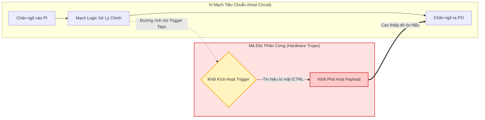
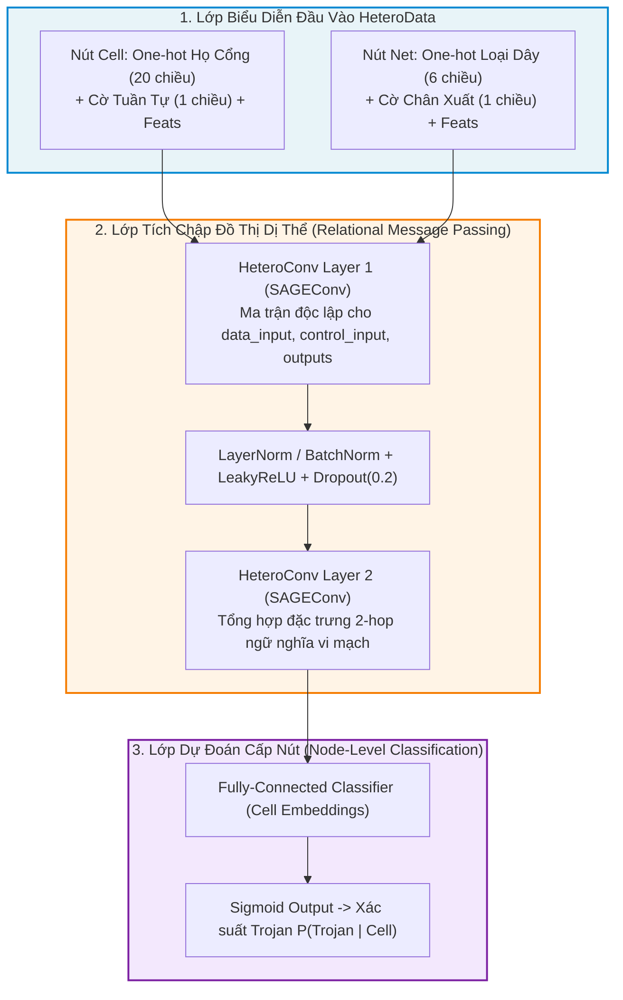

# BÁO CÁO TỔNG KẾT ĐỊNH HƯỚNG NGHIÊN CỨU KHOA HỌC LUẬN VĂN THẠC SĨ
# Phân Tích Toàn Diện Phương Pháp Cơ Sở (Baseline), Các Giới Hạn Lý Thuyết & Thực Nghiệm, và Hướng Tiếp Cận Đề Xuất (Semantic Graph IR + HeteroTrojanGNN + Multi-Criteria Graph XAI)

* **Học viên thực hiện:** Trần Tấn Đạt  
* **Đề tài luận văn:** *Nghiên cứu các phương pháp Trí tuệ Nhân tạo Có thể Giải thích được (Explainable AI - XAI) trong bài toán Phát hiện Mã độc Phần cứng (Hardware Trojan Detection) trên Netlist Vi mạch*  
* **Thời gian cập nhật:** 13/09/2026  
* **Tài liệu tham chiếu & Kế thừa từ thư mục `reports/`:**
  * [`ReportThesis-TranTanDat-20260719.pdf`](ReportThesis-TranTanDat-20260719.pdf): Báo cáo tái lập baseline ban đầu, phân tích ngã rẽ nghiên cứu (Tại sao không dùng hướng "Netlist $\to$ Graph $\to$ Sinh lại Verilog" mà phải dùng "Verilog $\to$ Graph IR $\to$ Phân tích An ninh"), và xác định 3 khoảng trống nghiên cứu (Research Gaps).
  * [`ReportThesis-TranTanDat-20260903.md`](ReportThesis-TranTanDat-20260903.md): Báo cáo xây dựng Semantic Graph IR, toán học hóa đồ thị hai phía $G = (V, E, \Phi_V, \Phi_E)$, lọc cạnh Clock/Reset $G_{data}$, trích xuất 13 đặc trưng tô-pô Dijkstra, và đối chuẩn 4 thực nghiệm XGBoost.
  * [`ReportThesis-TranTanDat-20260910.md`](ReportThesis-TranTanDat-20260910.md): Báo cáo bước đầu hiện thực hóa mạng Heterogeneous GNN (HeteroTrojanGNN) và thuật toán giải thích đồ thị GNNExplainer.
  * [`2601.18696v7.pdf`](2601.18696v7.pdf): Bài báo khoa học gốc của nhóm tác giả phương pháp cơ sở: *Paul Whitten, Francis Wolff, Chris Papachristou (Case Western Reserve University) — "Explainability Methods for Hardware Trojan Detection: A Systematic Comparison"*, cập nhật tháng 08/2026 trên arXiv (arXiv:2601.18696).

---

## MỤC LỤC TỔNG QUAN

1. [Bối cảnh Nghiên cứu và Định nghĩa Bài toán](#1-bối-cảnh-nghiên-cứu-và-định-nghĩa-bài-toán)
2. [Lược sử và Phân tích Ngã rẽ Nghiên cứu (Kế thừa Báo cáo 19/07/2026)](#2-lược-sử-và-phân-tích-ngã-rẽ-nghiên-cứu)
3. [Phân tích Chi tiết Phương pháp Cơ sở (Baseline Deep Dive)](#3-phân-tích-chi-tiết-phương-pháp-cơ-sở)
4. [Ba Hạn chế Cốt tử & Khoảng trống Nghiên cứu của Baseline](#4-ba-hạn-chế-cốt-tử--khoảng-trống-nghiên-cứu-của-baseline)
5. [Phương pháp Đề xuất 1: Biểu diễn Đồ thị Ngữ nghĩa Hai phía (Semantic Graph IR)](#5-phương-pháp-đề-xuất-1-biểu-diễn-đồ-thị-ngữ-nghĩa-hai-phía)
6. [Phương pháp Đề xuất 2: Mạng Nơ-ron Đồ thị Dị thể (HeteroTrojanGNN)](#6-phương-pháp-đề-xuất-2-mạng-nơ-ron-đồ-thị-dị-thể-heterotrojangnn)
7. [Phương pháp Đề xuất 3: Khung Giải thích Đồ thị Đa Tiêu chuẩn (Multi-Criteria Graph XAI)](#7-phương-pháp-đề-xuất-3-khung-giải-thích-đồ-thị-đa-tiêu-chuẩn)
8. [Kết quả Thực nghiệm Đối chuẩn Toàn diện (6-Way Factorial Benchmark)](#8-kết-quả-thực-nghiệm-đối-chuẩn-toàn-diện)
9. [Đối chuẩn Đa Tiêu chuẩn XAI: Graph XAI vs. Tabular XAI](#9-đối-chuẩn-đa-tiêu-chuẩn-xai-graph-xai-vs-tabular-xai)
10. [Tổng quan Tài liệu Cập nhật & So sánh Nghiên cứu Quốc tế (2021 – 2026)](#10-tổng-quan-tài-liệu-cập-nhật--so-sánh-nghiên-cứu-quốc-tế)
11. [Đóng góp Khoa học và Khung 6 Chương Luận văn Thạc sĩ](#11-đóng-góp-khoa-học-và-khung-6-chương-luận-văn-thạc-sĩ)

---

## 1. Bối cảnh Nghiên cứu và Định nghĩa Bài toán

### 1.1. Mối đe dọa Hardware Trojan trong Chuỗi Cung ứng Vi mạch Toàn cầu
Trong ngành công nghiệp bán dẫn hiện đại, chi phí xây dựng một nhà máy chế tạo vi mạch (Fab) tiên tiến (tiến trình 7nm, 5nm hoặc 3nm) lên tới hàng chục tỷ USD. Do đó, phần lớn các công ty thiết kế vi mạch (như Apple, Qualcomm, NVIDIA) hoạt động theo mô hình không có xưởng đúc (Fabless) và buộc phải thuê gia công tại các xưởng đúc bên thứ ba (Foundries). Đồng thời, để rút ngắn chu kỳ thiết kế, các kỹ sư phải tích hợp rộng rãi các khối sở hữu trí tuệ bán dẫn bên thứ ba (Third-Party Intellectual Property - 3PIP).

Sự phân tán toàn cầu này mở ra nguy cơ nghiêm trọng về an ninh phần cứng: **Mã độc Phần cứng (Hardware Trojan - HT)** có thể bị cài cắm lén lút vào thiết kế vi mạch ở bất kỳ công đoạn nào, từ giai đoạn mô tả RTL, tổng hợp mức cổng (Gate-Level Netlist), cho đến giai đoạn bố trí mạch vật lý (Layout GDSII) tại xưởng đúc.

Một Hardware Trojan điển hình bao gồm hai khối chức năng cơ bản:
1. **Trigger (Khối kích hoạt):** Được thiết kế có chủ ý để theo dõi các điều kiện nội vi hoặc đếm chu kỳ hoạt động. Khối này chỉ kích hoạt khi xuất hiện một tổ hợp sự kiện cực kỳ hiếm gặp (Rare Activation Condition). Nhờ tính chất kích hoạt hiếm, Trojan hoàn toàn vô hình trước các quy trình kiểm thử chức năng thông thường (Functional Verification) và các vector kiểm tra lỗi tự động (ATPG - Automatic Test Pattern Generation).
2. **Payload (Khối thực thi phá hoại):** Khi Trigger chuyển sang trạng thái kích hoạt, tín hiệu điều khiển của Trojan sẽ ép khối Payload can thiệp vào các đường truyền dữ liệu hợp lệ. Hậu quả có thể là:
   * **Từ chối dịch vụ (Denial of Service - DoS):** Treo hệ thống hoặc ép vi mạch rơi vào trạng thái chết (Deadlock).
   * **Làm suy giảm chức năng (Degradation):** Gây ra lỗi tính toán ngẫu nhiên hoặc làm nóng chip cục bộ.
   * **Rò rỉ thông tin mật (Information Leakage):** Truyền khóa mã hóa AES/RSA ra ngoài thông qua kênh phụ (Side-channel) hoặc qua các chân cổng xuất dữ liệu thông thường.



### 1.2. Thách thức ở Mức Gate-Level Netlist
Trong các mức biểu diễn phần cứng, **Gate-Level Netlist** (danh sách nối mạng mức cổng sau tổng hợp logic) được xem là ranh giới phòng thủ quan trọng nhất vì:
* Mọi hành vi chèn mã độc ở mức RTL hoặc mức tổng hợp thư viện chuẩn (Standard Cell Library) đều được hiện thực hóa đầy đủ thành các cổng logic và đường dây kết nối ở mức Netlist.
* Tuy nhiên, bài toán phát hiện Trojan ở mức Netlist đối mặt với hai thách thức kỹ thuật cực lớn:
  1. **Độ mất cân bằng dữ liệu cực độ (Extreme Class Imbalance):** Trong một netlist vi mạch chứa từ hàng chục nghìn đến hàng trăm nghìn cổng logic, số lượng cổng thuộc về Trojan thường chỉ từ **$5 - 40$ cổng** (tỷ lệ Trojan thường dao động từ **$0.01\% - 1.5\%$**).
  2. **Yêu cầu bắt buộc về Tính Giải Thích Được (Explainability - XAI) trong quy trình EDA:**  
     Trong quy trình tự động hóa thiết kế vi mạch công nghiệp (Electronic Design Automation - EDA), một mô hình AI hoạt động như "hộp đen" (Black-box) đưa ra phán đoán nhị phân (Trojan / Sạch) là **hoàn toàn vô giá trị trong thực tiễn**. Kỹ sư bảo mật không thể loại bỏ một con chip triệu đô hoặc sửa đổi dây chuyền sản xuất nếu AI không chỉ ra được **bằng chứng mạch vật lý (Actionable Physical Evidence)**:
     * Cổng logic nào tạo thành khối Trigger?
     * Đường dây dẫn nào truyền tín hiệu kích hoạt độc hại?
     * Cổng logic nào đóng vai trò Payload chèn ép tín hiệu?

---

## 2. Lược sử và Phân tích Ngã rẽ Nghiên cứu
*(Kế thừa từ Báo cáo Tiến độ 19/07/2026: `ReportThesis-TranTanDat-20260719.pdf`)*

Khi bắt đầu đề tài nghiên cứu vào tháng 07/2026, nhóm nghiên cứu đã khảo sát hai hướng tiếp cận khả thi nhằm can thiệp và bảo vệ vi mạch thông qua biểu diễn đồ thị:

```
                                [MÃ NGUỒN VERILOG BAN ĐẦU]
                                             │
             ┌───────────────────────────────┴───────────────────────────────┐
             ▼                                                               ▼
     [HƯỚNG TIẾP CẬN A]                                              [HƯỚNG TIẾP CẬN B]
(Biến đổi: Verilog ──> Graph ──> Verilog)                      (Phân tích: Verilog ──> Graph IR ──> XAI)
             │                                                               │
   • Parse netlist thành đồ thị                                    • Parse netlist thành Graph IR
   • Can thiệp cắt/xóa cổng Trojan trên đồ thị                     • Bảo toàn ngữ nghĩa Bipartite (Cell-Net)
   • Dùng thuật toán Graph-to-Text sinh lại Verilog                • Ứng dụng GNN & Graph XAI khoanh vùng Trojan
             │                                                               │
   [KẾT LUẬN: KHÔNG KHẢ THI TRONG THỰC TẾ]                         [KẾT LUẬN: HƯỚNG ĐI ĐÚNG ĐẮN DUY NHẤT]
   - Phá vỡ cấu trúc lưới điện & clock                             - Phản ánh trung thực bản chất phần cứng
   - Mất metadata tổng hợp EDA (Timing, Constraints)               - Cung cấp đồ thị con cho kỹ sư chạy lệnh ECO
```

### 2.1. Phân tích Hướng Tiếp cận A: Tại sao "Verilog $\to$ Graph $\to$ Sinh lại Verilog" không khả thi?
Ý tưởng ban đầu của Hướng A là: Biến netlist Verilog thành một đồ thị, dùng thuật toán học máy phát hiện các nút Trojan, sau đó xóa bỏ các nút này trực tiếp trên đồ thị rồi dùng một bộ dịch ngược (Graph-to-Verilog generator) để sinh ra file Verilog mới đã sạch mã độc.

Tuy nhiên, qua khảo sát chuyên sâu về quy trình EDA thực tế, hướng tiếp cận này **hoàn toàn phá sản vì các lý do vật lý và công nghệ**:
1. **Vấn đề Cắt Lưới và Mất Cân Bằng Tải Điện Dung (Load Capacitance Mismatch):** Khi một cổng logic bị xóa trực tiếp trên đồ thị và nối tắt tùy tiện, các đường dây đầu vào của nó bị hở mạch (Floating nets), làm thay đổi hoàn toàn điện dung ký sinh và điện trở dây dẫn.
2. **Phá vỡ Cây Xung Nhịp (Clock Tree Violation):** Xung nhịp vi mạch được cân bằng nghiêm ngặt đến từng pico-giây (Skew balancing). Việc can thiệp trực tiếp vào đồ thị mà không thông qua công cụ tổng hợp vật lý (Physical Synthesis) sẽ phá hủy hoàn toàn ràng buộc thời gian (Timing Constraints), gây ra lỗi vi phạm thời gian thiết lập (Setup-time violation) và thời gian giữ (Hold-time violation), khiến vi mạch không thể hoạt động được.
3. **Mất Metadata Công Nghiệp:** File Verilog sau tổng hợp chứa hàng nghìn chỉ thị nội vi (Synthesis Attributes, Keep Hierarchies, Don't Touch directives). Một bộ sinh đồ thị thuần túy sẽ làm mất toàn bộ các thông tin này, khiến file Verilog sinh ra không thể đưa vào công đoạn Place-and-Route.

### 2.2. Hướng Tiếp cận B: "Verilog $\to$ Semantic Graph IR $\to$ Phân tích Bảo mật & XAI" (Lựa chọn Đúng đắn)
Thay vì cố gắng sinh lại file Verilog một cách phi thực tế, **Hướng Tiếp cận B** xác định rõ vai trò của AI trong chu trình thiết kế vi mạch:
* Biến đổi Verilog Netlist thành một **Biểu diễn Đồ thị Ngữ nghĩa Trung gian (Semantic Graph IR)** bảo toàn trọn vẹn ngữ nghĩa vật lý.
* Sử dụng AI để phát hiện và sử dụng **Graph XAI** để trích xuất chính xác **Đồ thị con vật lý (Explanatory Subgraph)** chứa chuỗi liên kết: $\text{Trigger} \to \text{Dây kích hoạt} \to \text{Payload}$.
* Xuất báo cáo vị trí cổng logic và đường dây vi phạm để kỹ sư vi mạch thực hiện quy trình chuẩn công nghiệp: **Engineering Change Order (ECO)** thông qua phần mềm EDA chính thống (Synopsys IC Compiler / Cadence Innovus).

---

## 3. Phân tích Chi tiết Phương pháp Cơ sở (Baseline Deep Dive)
*(Dựa trên mã nguồn và công bố quốc tế mới nhất của Paul Whitten et al., arXiv:2601.18696v7, tháng 08/2026)*

Phương pháp cơ sở (Baseline) được triển khai trên 30 vi mạch thuộc bộ dữ liệu chuẩn Trust-Hub Benchmark (gồm 5 họ vi mạch: RS232, s15850, s35932, s38417, s38584). 

Quy trình Baseline bao gồm 4 giai đoạn nối tiếp:
$$\text{Verilog Netlist} \xrightarrow{\text{circuitgraph}} \text{Đồ thị NetlistX nén} \xrightarrow{\text{Dijkstra}} \text{Vector 5/13 đặc trưng} \xrightarrow{\text{XGBoost}} \text{SHAP / LIME}$$

### 3.1. Cơ chế Phân tích cú pháp và Hiện tượng Đứt đoạn Cấu trúc của Baseline
Baseline sử dụng thư viện nguồn mở `circuitgraph` để đọc file Verilog. Khi phân tích cú pháp, thư viện này xem mỗi linh kiện chuẩn (Standard Cell) là một **Hộp đen (BlackBox)** và chia nhỏ linh kiện thành các node chân cắm con độc lập:
* Các chân vào của cổng: tạo thành các node con có kiểu thuộc tính `type='bb_input'` (ví dụ: `U33.IN1`, `U33.IN2`).
* Các chân ra của cổng: tạo thành các node con có kiểu thuộc tính `type='bb_output'` (ví dụ: `U33.QN`).
* Dây dẫn tín hiệu (`wire`) được biểu diễn bằng một node trung gian kết nối giữa chân xuất và chân nhập kế tiếp.

#### Minh họa giải phẫu qua mạch UART (`RS232-T1000`):
Xét một chuỗi truyền tín hiệu mẫu trong file netlist UART (`data/raw/RS232-T1000/src/90nm/uart.v`) gồm 1 chân đầu vào chính (`xmit_dataH[0]`) đi qua 2 cổng logic liên tiếp (`U33` loại AOI22X2 và `U32` loại OAI21X2):

```verilog
// 1. Chân ngõ vào chính của chip UART
input [7:0] xmit_dataH;

// 2. Cổng logic thứ nhất (U33 - loại AOI22X2):
AOI22X2 U33 ( 
    .IN1(xmit_dataH[0]),   // Tín hiệu vào từ chân chip
    .IN2(n28), 
    .IN3(iXMIT_xmit_ShiftRegH_1_), 
    .IN4(n29), 
    .QN(n27)              // Xuất ra dây n27
);

// 3. Cổng logic thứ hai (U32 - loại OAI21X2):
OAI21X2 U32 ( 
    .IN1(n257), 
    .IN2(n26), 
    .IN3(n27),             // Nhận dây n27 từ cổng U33
    .QN(n190)             // Xuất tiếp ra dây n190
);
```

* **Luồng vật lý thực tế ngoài đời:**  
  Tín hiệu đi từ `xmit_dataH[0]` $\longrightarrow$ đi vào cổng `U33` $\longrightarrow$ phát ra dây `n27` $\longrightarrow$ đi vào cổng `U32` $\longrightarrow$ phát ra dây `n190`.

* **Sự đứt đoạn cấu trúc trong `circuitgraph` của Baseline:**
  ```
  [xmit_dataH[0]] ──> (node con: U33.IN1)
                           (ngõ cụt - tắc nghẽn!)
                                             (node con: U33.QN) ──> [dây n27] ──> (node con: U32.IN3)
                                                                                       (ngõ cụt - tắc nghẽn!)
                                                                                                         (node con: U32.QN) ──> [dây n190]
  ```
  * Điểm tắc nghẽn: Node `U33.IN1` nhận tín hiệu nhưng không có cạnh nào đi tiếp. Node `U33.QN` phát tín hiệu ra dây `n27` nhưng không có cạnh nào đi vào. Giữa `U33.IN1` và `U33.QN` bên trong hộp đen **hoàn toàn không có cạnh nối**!

### 3.2. Cơ chế Nén Đồ thị Thô bạo của Baseline (NetlistX)
Để giải quyết sự tắc nghẽn trên nhằm chạy được thuật toán tìm đường đi ngắn nhất Dijkstra, các tác giả tiền nhiệm (Paul Whitten et al.) đã áp dụng một quy trình gọt giũa và nén đồ thị:
1. Gọi hàm `remove_cells(['wire'])`: **Xóa sạch toàn bộ các nút dây dẫn (`wire`)** trong vi mạch.
2. Gọi hàm `merge_cells`: Cưỡng ép gộp các node chân cắm vào chân xuất logic của cổng (`U.Q` hoặc `U.QN`).
3. Nối cạnh trực tiếp từ chân phát tín hiệu sang chân nhận tín hiệu kế tiếp.

Hậu quả của quy trình nén này là tạo ra một đồ thị đồng nhất (Homogeneous Graph), trong đó toàn bộ thực thể dây dẫn bị triệt tiêu, chỉ còn lại các cổng logic kết nối trực tiếp với nhau.

### 3.3. Không gian Đặc trưng Dạng bảng của Baseline
Từ đồ thị nén trên, Baseline trích xuất vector đặc trưng dạng bảng cho từng cổng logic:
* **Bộ 5 đặc trưng tô-pô cơ bản của Hasegawa (Hasegawa et al., 2016):**
  1. `LGFi` (Logic Gate Fan-in level 2): Số lượng cổng logic nằm trong phạm vi 2 bước nhảy ngược dòng.
  2. `ffi` (Flip-Flop input distance): Khoảng cách bước nhảy ngắn nhất tới chân dữ liệu của Flip-Flop gần nhất.
  3. `ffo` (Flip-Flop output distance): Khoảng cách bước nhảy ngắn nhất từ chân đầu ra của Flip-Flop gần nhất.
  4. `PI` (Primary Input distance): Khoảng cách bước nhảy ngắn nhất tới chân đầu vào chính của chip.
  5. `PO` (Primary Output distance): Khoảng cách bước nhảy ngắn nhất tới chân đầu ra chính của chip.
* **Bộ 8 đặc trưng cấu trúc bổ sung (tổng cộng 13 đặc trưng):**
  Tính toán bằng thư viện NetworkX: `in_degree`, `out_degree`, `pagerank`, `betweenness`, `closeness`, `clustering`, `core_number`, `logic_depth_ratio`.

### 3.4. Mô hình Học máy và Phương pháp Giải thích của Baseline
* **Bộ phân loại:** Thuật toán `XGBoost Classifier` huấn luyện trên từng dòng dữ liệu bảng, áp dụng kỹ thuật cân bằng trọng số lớp `scale_pos_weight = N_neg / N_pos` và quét lưới 100 ngưỡng $\tau \in [0.01, 0.99]$ trên tập Validation.
* **Cơ chế XAI:** Áp dụng **SHAP (TreeExplainer)**, **LIME (TabularExplainer)**, và **Gradient Attribution** để phân tích độ quan trọng của các cột đặc trưng số học.

---

## 4. Ba Hạn chế Cốt tử & Khoảng trống Nghiên cứu của Baseline

Qua quá trình thực nghiệm đối chứng và phân tích lý thuyết, đề tài đã chỉ ra **3 Khoảng trống Nghiên cứu (Research Gaps)** mang tính bản chất của phương pháp cơ sở:

```mermaid
graph TD
    subgraph Gap1 ["Hạn Chế 1: Topology Loss & Clock Bottleneck"]
        G1A["Xóa nút dây dẫn (Nets)"] --> G1B["Mất cấu trúc Bipartite Cell-Net"]
        G1C["Dây Clock nối tới 10.000 Flip-Flop"] --> G1D["Tạo 'Xa lộ 1-hop' gây Over-smoothing cho GNN"]
    end

    subgraph Gap2 ["Hạn Chế 2: Statistical Shortcutting & OOD Collapse"]
        G2A["XGBoost học trên 13 đặc trưng Dijkstra"] --> G2B["Ghi nhớ tọa độ không gian chip RS232 (22/30 mạch)"]
        G2B --> G2C["In-Dist F1 = 0.928 (Ảo tưởng độ chính xác)"]
        G2B --> G2D["LOFO Macro F1 = 0.177 (Sụp đổ khi gặp chip mới)"]
    end

    subgraph Gap3 ["Hạn Chế 3: Actionability Vacuum in Tabular XAI"]
        G3A["SHAP/LIME giải thích đặc trưng số học trừu tượng"] --> G3B["Mù không gian vi mạch (Spatial Blindness)"]
        G3B --> G3C["Kỹ sư EDA không thể can thiệp sửa đổi ECO trên silicon"]
    end

    style Gap1 fill:#fff5f5,stroke:#ff6b6b,stroke-width:2px;
    style Gap2 fill:#fff9db,stroke:#fcc419,stroke-width:2px;
    style Gap3 fill:#f3f0ff,stroke:#845ef7,stroke-width:2px;
```



### 4.1. Hạn chế 1 (Topology Loss): Mất mát Cấu trúc Tô-pô & Nút thắt Xung nhịp Toàn cục
1. **Phá vỡ tính chất Đồ thị Hai phía (Bipartite Graph):** Trong tiêu chuẩn công nghiệp EDA, một cổng logic không bao giờ nối trực tiếp vào một cổng khác mà luôn phải qua một đường dây dẫn (`Net`). Dây dẫn mang các đặc tính vật lý quan trọng: tải phân nhánh (Fan-out load), độ trễ truyền dẫn (Interconnect delay), và điện dung ký sinh. Việc xóa sạch các nút dây dẫn khiến đồ thị bị mất tính liên tục, không thể phát hiện các loại Trojan chèn dây lén lút (Parasitic routing Trojans).
2. **Nút thắt Xung nhịp Toàn cục (The Global Clock Bottleneck):**
   * Trong một vi mạch số, đường dây xung nhịp (`sys_clk`) hoặc đường thiết lập lại (`sys_rst_l`) tỏa nhánh (Fanout) kết nối tới hàng nghìn Flip-Flop trên khắp bề mặt chip.
   * Khi Baseline xây dựng một đồ thị phẳng và không phân biệt loại cạnh, **dây Clock vô tình trở thành một "xa lộ 1-hop" kết nối tắt toàn bộ vi mạch**.
   * Bất kỳ hai linh kiện nào trên chip cũng có thể liên lạc với nhau chỉ sau 2 bước nhảy (2-hop distance) thông qua dây Clock. Khi đưa đồ thị này vào Graph Neural Networks (GNN), hiện tượng **Over-smoothing** xảy ra lập tức: thông điệp từ mọi nơi trong chip bị hòa tan vào nhau sau 2 tầng tích chập, khiến GNN không còn khả năng phân biệt đâu là cổng sạch, đâu là cổng Trojan.

### 4.2. Hạn chế 2 (Shortcutting & OOD Collapse): "Học vẹt" Tọa độ và Sụp đổ Tổng quát hóa
Trong tập dữ liệu Trust-Hub, họ mạch RS232 chiếm tới 22/30 vi mạch và đều sử dụng chung một kiến trúc mạch chủ UART.
* Khi đánh giá bằng phương pháp chia ngẫu nhiên (In-Distribution Stratified 60/20/20), các mạch thuộc họ RS232 xuất hiện ở cả tập Train, tập Validation và tập Test. Mô hình XGBoost khi nhìn vào 13 đặc trưng Dijkstra toàn cục (`PI`, `PO`, `betweenness`, `closeness`) đã **ghi nhớ vị trí tọa độ địa lý của mạch chủ RS232** thay vì học bản chất của Trojan.
* Kết quả là: In-distribution $F_1$-score đạt tới **$0.9277$** (tạo ra một "ảo tưởng về độ chính xác").
* Tuy nhiên, khi kiểm thử theo giao thức **Leave-One-Family-Out (LOFO Cross-Validation)** — lấy ra một họ mạch hoàn toàn khác biệt (như họ vi xử lý `s35932` hoặc bộ đếm `s38417`) làm tập kiểm thử — **mô hình sụp đổ hoàn toàn**:
  * Baseline 5 đặc trưng: LOFO Macro $F_1 = \mathbf{0.0300}$
  * Baseline 13 đặc trưng: LOFO Macro $F_1 = \mathbf{0.1773}$
* Điều này chứng minh: Các đặc trưng số học dạng bảng của Baseline không có khả năng chuyển giao tri thức (Transferability) sang các kiến trúc chip mới.

### 4.3. Hạn chế 3 (Actionability Vacuum): Sự bất lực của Tabular XAI trong Thực tiễn Vi mạch
Baseline áp dụng SHAP và LIME lên các vector số học. Xét ví dụ thực tế tại cổng Payload `U303` của mạch `RS232-T1000`, SHAP đưa ra giải thích:
$$\phi(LGFi) = +0.45, \quad \phi(ffo) = +0.28, \quad \phi(PO) = -0.10$$
* **Bế tắc của kỹ sư vi mạch:** Giải thích này chỉ tồn tại trong không gian số học trừu tượng $\mathbb{R}^d$. Kỹ sư nhìn vào con số $LGFi=5$ hoàn toàn không thể biết:
  * Cổng `U303` đang nhận tín hiệu độc hại từ cổng nào?
  * Dây dẫn nào cần phải cắt bỏ?
  * Cụm logic nào cần phải thiết kế lại để loại trừ Trojan?
* Trong thực tế sản xuất vi mạch, kỹ sư cần **Một Bản Vẽ Sơ Đồ Vi Mạch (Physical Schematic Subgraph)** để thực hiện lệnh sửa đổi kỹ thuật (ECO), chứ không thể dùng biểu đồ cột SHAP.

---

## 5. Phương pháp Đề xuất 1: Biểu diễn Đồ thị Ngữ nghĩa Hai phía (Semantic Graph IR)
*(Kế thừa và chuẩn hóa từ Báo cáo 03/09/2026: `ReportThesis-TranTanDat-20260903.md`)*

Để giải quyết triệt để các hạn chế của Baseline, nghiên cứu đề xuất **Biểu diễn Đồ thị Ngữ nghĩa Trung gian (Semantic Graph Intermediate Representation - Semantic Graph IR)**.

```mermaid
flowchart LR
    subgraph Semantic_Graph_IR ["Biểu Diễn Đồ Thị Ngữ Nghĩa Hai Phía (Cell <-> Net)"]
        direction LR
        Net_IN["Net: xmit_dataH[0]<br/>(kind: net)"] -->|"port: IN1<br/>(direction: input, is_control: 0)"| Cell_U33["Cell: U33<br/>(kind: cell, type: AOI22X2)"]
        Cell_U33 -->|"port: QN<br/>(direction: output)"| Net_N27["Net: n27<br/>(kind: net, type: wire)"]
        Net_N27 -->|"port: IN3<br/>(direction: input, is_control: 0)"| Cell_U32["Cell: U32<br/>(kind: cell, type: OAI21X2)"]
        Cell_U32 -->|"port: QN<br/>(direction: output)"| Net_N190["Net: n190<br/>(kind: net, type: wire)"]
    end

    classDef cellStyle fill:#e1f5fe,stroke:#0288d1,stroke-width:2px;
    classDef netStyle fill:#fff3e0,stroke:#f57c00,stroke-width:2px;
    class Cell_U33,Cell_U32 cellStyle;
    class Net_IN,Net_N27,Net_N190 netStyle;
```



### 5.1. Định nghĩa Toán học của Semantic Graph IR
Về mặt toán học, Semantic Graph IR là một **Đồ thị Dị thể Hai phía có hướng gán nhãn thuộc tính (Directed Attributed Heterogeneous Bipartite Graph)** được định nghĩa bởi bộ tứ:
$$G = (V, E, \Phi_V, \Phi_E)$$

Trong đó:
1. **Tập đỉnh hai phía phân tách $V = V_{cell} \cup V_{net}$ ($V_{cell} \cap V_{net} = \emptyset$):**
   * $V_{cell}$ (Tập đỉnh Linh kiện): Đại diện cho toàn bộ các tế bào chuẩn (Standard Cells: AND, OR, XOR, MUX...) và Flip-Flop tuần tự (`DFFARX1`, `SDFFSRX1`...). Mỗi đỉnh $u \in V_{cell}$ mang thuộc tính:
     $$\Phi_V(u) = \{\text{kind: "cell"}, \text{cell\_type: "AOI22X2"}, \text{is\_seq: } \{0, 1\}, \text{is\_trojan: } \{0, 1\}\}$$
   * $V_{net}$ (Tập đỉnh Dây dẫn): Đại diện cho các đường dây nội bộ (`wire`), chân ngõ vào chính (`input`), và chân ngõ ra chính (`output`). Mỗi đỉnh $v \in V_{net}$ mang thuộc tính:
     $$\Phi_V(v) = \{\text{kind: "net"}, \text{type: } \{\text{"wire"}, \text{"input"}, \text{"output"}\}, \text{is\_trojan: } \{0, 1\}\}$$

2. **Tập cạnh có hướng gán nhãn ngữ nghĩa chân cổng $E \subseteq (V_{net} \times V_{cell}) \cup (V_{cell} \times V_{net})$:**
   * **Cạnh Tín hiệu vào Linh kiện ($e = (v_{net}, u_{cell})$):** Biểu diễn dòng tín hiệu từ đường dây đi vào chân cắm cụ thể của cell. Thuộc tính:
     $$\Phi_E(e) = \{\text{direction: "input"}, \text{port: } \text{"IN1"} / \text{"D"} / \text{"CLK"}, \text{is\_control: } \{0, 1\}\}$$
   * **Cạnh Linh kiện phát Tín hiệu ($e = (u_{cell}, v_{net})$):** Biểu diễn tín hiệu logic từ đầu ra của cell lái đường dây dẫn. Thuộc tính:
     $$\Phi_E(e) = \{\text{direction: "output"}, \text{port: } \text{"Q"} / \text{"QN"} / \text{"OUT"}\}$$

### 5.2. Chuẩn hóa Schema Dữ liệu (`nodes.csv` và `edges.csv`)
Graph IR chuẩn hóa toàn bộ các vi mạch thành hai tập tin quan hệ:

#### Bảng 5.1: Đặc tả Schema dữ liệu của tập tin `nodes.csv`
| Thuộc tính | Kiểu dữ liệu | Ý nghĩa kỹ thuật trong vi mạch | Ví dụ mẫu |
| :--- | :--- | :--- | :--- |
| `node` | String | Tên định danh duy nhất của thực thể (tên instance hoặc tên net) | `U297`, `iRECEIVER_state_0_` |
| `kind` | Enum | Phân loại bản chất: `cell` (cổng logic) hoặc `net` (dây dẫn) | `cell`, `net` |
| `cell_type` | String | Tên loại cổng trong thư viện chuẩn (để trống nếu là net) | `NAND4X1`, `ISOLORX8`, `DFFARX1` |
| `type` | String | Loại tín hiệu (`wire`, `input`, `output`) hoặc họ cổng logic | `wire`, `input`, `output` |
| `output` | Boolean | Cờ đánh dấu cổng ra chính của vi mạch (Primary Output) | `True`, `False` |
| `is_trojan` | Binary | Nhãn giám sát mặt đất (Ground Truth): `1` là Trojan, `0` là sạch | `1`, `0` |

#### Bảng 5.2: Đặc tả Schema dữ liệu của tập tin `edges.csv`
| Thuộc tính | Kiểu dữ liệu | Ý nghĩa kỹ thuật trong vi mạch | Ví dụ mẫu |
| :--- | :--- | :--- | :--- |
| `source` | String | Tên đỉnh nguồn của liên kết có hướng | `iCTRL`, `U303` |
| `target` | String | Tên đỉnh đích của liên kết có hướng | `U303`, `xmit_doneH` |
| `direction` | Enum | Chiều truyền tín hiệu: `input` (Net $\to$ Cell) hoặc `output` (Cell $\to$ Net) | `input`, `output` |
| `port` | String | Tên chân cắm vật lý cụ thể tại cổng logic | `IN1`, `IN2`, `CLK`, `D`, `QN` |
| `is_control` | Binary | Cờ đánh dấu cạnh thuộc mạng Clock/Reset (`1`: Clock/Reset, `0`: Data) | `1`, `0` |
| `is_trojan_edge` | Binary | Cờ đánh dấu cạnh liên quan đến khối Trojan | `1`, `0` |
| `trojan_context` | Enum | Phân loại 4 trạng thái ngữ cảnh tấn công phần cứng | `trigger_input`, `internal`, `payload_output`, `normal` |

#### Bốn trạng thái ngữ cảnh Trojan (`trojan_context`) trên cạnh:
1. `normal`: Cạnh nối giữa 2 đỉnh an toàn trong mạch gốc ($u_{clean} \to v_{clean}$).
2. `trigger_input`: Cạnh trích xuất tín hiệu từ mạch gốc đưa vào đầu vào của khối Trigger ($u_{clean} \to v_{trojan}$). Đây là chân lấy mẫu bí mật (Trigger Taps).
3. `internal`: Cạnh kết nối nội bộ giữa các cổng logic bên trong Trigger hoặc Payload ($u_{trojan} \to v_{trojan}$).
4. `payload_output`: Cạnh truyền tín hiệu can thiệp phá hoại từ Trojan tiêm ngược lại mạch chính ($u_{trojan} \to v_{clean}$).

### 5.3. Cơ chế Cô lập Đồ thị Dữ liệu Sạch ($G_{data}$)
Để triệt tiêu hiện tượng "xa lộ 1-hop" do mạng xung nhịp gây ra, Semantic Graph IR xác định tập các chân cắm điều khiển:
$$\mathcal{P}_{ctrl} = \{\text{CLK}, \text{CLOCK}, \text{RST}, \text{RESET}, \text{SET}, \text{CLEAR}, \text{PRESET}, \text{SE}, \text{SI}\}$$

Một cạnh $e = (v_{net}, u_{cell})$ được gán cờ:
$$is\_control(e) = \begin{cases} 1, & \text{nếu } port(e) \in \mathcal{P}_{ctrl} \\ 0, & \text{ngược lại} \end{cases}$$

Đồ thị luồng dữ liệu sạch $G_{data} = (V, E_{data})$ được định nghĩa bằng cách lọc bỏ toàn bộ các cạnh điều khiển xung nhịp:
$$E_{data} = \{ e \in E \mid is\_control(e) = 0 \}$$

* **Ý nghĩa:** Trong $G_{data}$, dây `sys_clk` không còn đóng vai trò nút trung gian nối tắt giữa các Flip-Flop. Tín hiệu tuần tự buộc phải đi đúng chu trình chức năng: $\text{FF}_1 \xrightarrow{Q} \text{Mạch tổ hợp} \xrightarrow{D} \text{FF}_2$.

---

## 6. Phương pháp Đề xuất 2: Mạng Nơ-ron Đồ thị Dị thể (HeteroTrojanGNN)

Thay vì làm phẳng vi mạch thành file CSV để chạy cây quyết định XGBoost, đề tài đề xuất mô hình học sâu đồ thị chuyên biệt: **HeteroTrojanGNN**.



### 6.1. Kiến trúc Mô hình HeteroTrojanGNN
1. **Chuyển đổi Dữ liệu sang PyTorch Geometric HeteroData (`CircuitPyGConverter`):**
   * Nút `cell`: Vector đặc trưng kết hợp giữa One-hot 20 họ cổng logic (AND, OR, NAND, NOR, XOR, MUX, DFF, ISOL...), 1 cờ phân biệt cổng tuần tự (Sequential/DFF), và các thuộc tính logic.
   * Nút `net`: Vector đặc trưng kết hợp giữa One-hot 6 loại dây (`wire`, `input`, `buf`, `0`, `1`, `other`) và 1 cờ đánh dấu ngõ ra chính (Primary Output).
2. **Cơ chế Lan truyền Thông điệp Phân tách Quan hệ (Relational Message Passing):**
   Sử dụng mô-đun `HeteroConv` bao bọc các lớp `SAGEConv` (GraphSAGE):
   $$\mathbf{h}_v^{(l+1)} = \sigma \left( \sum_{r \in \mathcal{R}} \mathbf{W}_r^{(l)} \cdot \text{AGGREGATE}_{u \in \mathcal{N}_r(v)} \left( \mathbf{h}_u^{(l)} \right) \right)$$
   Trong đó, tập quan hệ $\mathcal{R}$ bao gồm 6 loại cạnh:
   $$\mathcal{R} = \{\text{data\_input}, \text{control\_input}, \text{outputs}, \text{rev\_data\_input}, \text{rev\_control\_input}, \text{rev\_outputs}\}$$
3. **Triệt tiêu Over-smoothing:**
   Do quan hệ `control_input` (chứa Clock/Reset) sử dụng ma trận trọng số $\mathbf{W}_{\text{control}}$ hoàn toàn tách biệt với $\mathbf{W}_{\text{data}}$, thông tin xung nhịp không làm tràn (flood) vào luồng dữ liệu logic. Mô hình có thể mở rộng độ sâu mà không làm mờ đặc trưng Trojan.
4. **Học các Mẫu hình Cấu trúc Bất biến (Invariant Subgraph Motifs):**
   GNN học được hình thái không gian của Trojan: Khối so sánh nhiều ngõ vào (Trigger) hội tụ về một cổng điều khiển trung gian (`ISOLORX8`), và cổng này lái chân chọn của một cổng `AND`/`MUX` (Payload) chèn vào đường truyền dữ liệu chính. Mẫu hình cấu trúc này có tính bất biến cao và chuyển giao tốt qua các họ vi mạch khác nhau.

---

## 7. Phương pháp Đề xuất 3: Khung Giải thích Đồ thị Đa Tiêu chuẩn (Multi-Criteria Graph XAI)

### 7.1. Toán học hóa Thuật toán GNNExplainer trên HeteroData
Khi mô hình HeteroTrojanGNN dự đoán một cổng logic $v$ là Trojan với nhãn $Y = 1$, **GNNExplainer** tìm kiếm một **Đồ thị con giải thích nhỏ gọn (Explanatory Subgraph $G_S = (V_S, E_S)$)** và tập đặc trưng rút gọn $X_S$ sao cho thông tin tương hỗ (Mutual Information - MI) giữa dự đoán của mô hình và đồ thị con được tối đa hóa:
$$\max_{G_S} \text{MI}(Y, G_S) = H(Y) - H(Y \mid G = G_S)$$

GNNExplainer tối ưu hóa một ma trận mặt nạ cạnh mềm (Edge Mask) $M \in [0, 1]^{|E|}$ thông qua hàm mất mát:
$$\mathcal{L} = -\sum_{c=1}^C Y_c \log P(Y = c \mid G \odot \sigma(M)) + \lambda_1 \| \sigma(M) \|_1 + \lambda_2 \mathcal{H}(\sigma(M))$$
Trong đó:
* Số hạng thứ nhất là Cross-entropy đảm bảo đồ thị con giữ nguyên dự đoán Trojan của mô hình.
* Số hạng thứ hai ($\ell_1$-regularization) ép đồ thị con đạt **Độ thưa cao (High Sparsity)**, loại bỏ tối đa các cạnh không liên quan.
* Số hạng thứ ba ($\mathcal{H}$) là Entropy ép trọng số mặt nạ tiệm cận về nhị phân $\{0, 1\}$.

### 7.2. Giải thích Trực quan trên Netlist Thực tế (`RS232-T1000`)
GNNExplainer trên Semantic Graph IR trích xuất chính xác cấu trúc tấn công vật lý mà không bị nhiễu:

```mermaid
graph LR
    subgraph Trigger_Zone ["Khối Kích Hoạt Bí Mật (Trojan Trigger)"]
        U296["OR4X4 (U296)"] -->|data| U302["ISOLORX8 (U302)"]
        U301["OR4X4 (U301)"] -->|data| U302
    end

    subgraph Attack_Junction ["Nút Thắt Tấn Công (Attack Junction)"]
        U302 -->|wire: iCTRL (Dây kích hoạt)| U303{"AND2X4 (U303 - Payload)"}
        NormalWire["wire: xmit_doneH_temp (Mạch sạch)"] -->|wire| U303
    end

    subgraph Sabotage_Output ["Ngõ Ra Bị Phá Hoại (Sabotaged PO)"]
        U303 -->|wire: xmit_doneH (Bị ép về 0)| PO((Chân Chip PO))
    end

    style U303 fill:#ff6b6b,stroke:#c92a2a,stroke-width:3px;
    style U302 fill:#ffa94d,stroke:#d9480f,stroke-width:2px;
    style Trigger_Zone fill:#fff3bf,stroke:#f59f00,stroke-dasharray: 5 5;
    style Attack_Junction fill:#ffe3e3,stroke:#e03131,stroke-width:2px;
    style Sabotage_Output fill:#f8f9fa,stroke:#495057,stroke-width:1px;
```

* **Ý nghĩa thực tiễn cho kỹ sư EDA:**
  Kỹ sư không cần quét qua 50.000 cổng logic. GNNExplainer cung cấp một sơ đồ vi mô gồm đúng **12 cổng Trigger và 1 cổng Payload**. Kỹ sư chỉ cần mở file Verilog, cắt đường dây `iCTRL` và nối tắt dây `xmit_doneH_temp` thẳng ra cổng xuất `xmit_doneH` là cứu được toàn bộ con chip.

### 7.3. Các Thước đo Đánh giá XAI Khắt khe (XAI Evaluation Metrics)
Đề tài thiết lập 4 tiêu chí đánh giá định lượng khoa học:
1. **Độ cần thiết ($\text{Fidelity}^+$):** Mức độ suy giảm xác suất Trojan khi **che đi (mask out)** đồ thị con giải thích. Giá trị $\text{Fid}^+ > 0$ càng cao chứng tỏ đồ thị con chứa các thành phần cốt tử quyết định dự đoán.
2. **Độ đầy đủ ($\text{Fidelity}^-$):** Mức độ suy giảm xác suất Trojan khi **chỉ giữ lại duy nhất** đồ thị con giải thích và loại bỏ toàn bộ phần mạch còn lại. Giá trị $\text{Fid}^- \approx 0$ chứng minh đồ thị con chứa đầy đủ $100\%$ thông tin cần thiết.
3. **Độ thưa (Sparsity):** Tỷ lệ phần trăm các cạnh mạch sạch bị loại bỏ. $\text{Sparsity} > 80\%$ là tiêu chuẩn vàng giúp giảm tải cho chuyên viên kiểm định.
4. **Độ chính xác Định vị Phần cứng (Hardware Localization Precision & Recall):** Tỷ lệ các cổng logic trong đồ thị con giải thích trùng khớp với Ground Truth Trojan trong file Netlist Verilog gốc.

---

## 8. Kết quả Thực nghiệm Đối chuẩn Toàn diện (6-Way Factorial Benchmark)

Để thẩm định toàn diện hiệu năng của giải pháp đề xuất so với phương pháp cơ sở, đề tài thiết lập **Ma trận Thực nghiệm Factorial $2 \times 3$ (gồm 6 thực nghiệm)**:

### Bảng 8.1: Ma trận Thiết kế 6 Cấu hình Thực nghiệm Đối chuẩn
| Mã Thực nghiệm | Mô hình Thuật toán | Biểu diễn Đồ thị Đầu vào | Không gian Đặc trưng | Xử lý Clock / Reset |
| :--- | :--- | :--- | :--- | :--- |
| **Exp 1** | XGBoost Classifier | Đồ thị Baseline nén cũ | 5 đặc trưng Hasegawa cổ điển | Không lọc (Nghẽn Clock) |
| **Exp 2** | XGBoost Classifier | Đồ thị Baseline nén cũ | 13 đặc trưng (Hasegawa + NetworkX) | Không lọc (Nghẽn Clock) |
| **Exp 3** | XGBoost Classifier | Semantic Graph IR đề xuất | 5 đặc trưng Hasegawa | Lọc bỏ Clock qua $G_{data}$ |
| **Exp 4** | XGBoost Classifier | Semantic Graph IR đề xuất | 13 đặc trưng toàn diện | Lọc bỏ Clock qua $G_{data}$ |
| **Exp 5** | BaselineTrojanGNN | Đồ thị NetlistX của Paul Whitten | Cấu trúc đồ thị nén (GNN 2 tầng) | Đồ thị đồng nhất nén thô |
| **Exp 6 (Đề xuất)** | **HeteroTrojanGNN** | **Semantic Graph IR đề xuất** | **Đồ thị Dị thể Hai phía (Cell + Net)**| **Tách biệt cạnh Data & Control** |

---

### 8.1. Kết quả Đánh giá Thống kê Đa Hạt Giống (10-Seed Multi-Run In-Distribution)
Đánh giá trên 30 vi mạch Trust-Hub, phân chia phân tầng Stratified 60% Train / 20% Val / 20% Test, lặp lại qua 10 seeds độc lập (Seeds: 42, 101, 2024, 777, 888, 999, 1234, 5678, 9999, 31415):

#### Bảng 8.2: Kết quả Thống kê 10 lần chạy (Mean $\pm$ Std)
| Mã Thực nghiệm | Cấu hình Thử nghiệm | $F_1$-score (Mean $\pm$ Std) | ROC-AUC (Mean $\pm$ Std) | Precision | Recall |
| :--- | :--- | :---: | :---: | :---: | :---: |
| **Exp 1** | Baseline XGBoost (5 feats) | $0.6569 \pm 0.0399$ | $0.9515 \pm 0.0083$ | $0.6909$ | $0.5352$ |
| **Exp 2** | Baseline XGBoost (13 feats) | $0.9277 \pm 0.0322$ | $0.9980 \pm 0.0015$ | $0.9104$ | $0.8592$ |
| **Exp 3** | Graph IR XGBoost (5 feats) | $0.7435 \pm 0.0405$ | $0.9892 \pm 0.0051$ | $0.7971$ | $0.7432$ |
| **Exp 4** | Graph IR XGBoost (13 feats) | $0.8741 \pm 0.0184$ | $0.9970 \pm 0.0025$ | $0.8333$ | $0.9459$ |
| **Exp 5** | Baseline GNN (Đồ thị nén cũ) | $0.6395 \pm 0.0475$ | $0.9803 \pm 0.0085$ | $0.7857$ | $0.6197$ |
| **Exp 6 (Đề xuất)** | **HeteroTrojanGNN (Graph IR)** | **$0.8246 \pm 0.0292$** | **$0.9937 \pm 0.0055$** | **$0.8228$** | **$0.8784$** |

* **Phát hiện quan trọng:**
  * **Exp 5 thất bại:** Mô hình GNN khi chạy trên đồ thị nén của tác giả cũ chỉ đạt $F_1 = 0.6395$, kém hơn cả mô hình XGBoost Exp 1 ($0.6569$). Điều này chứng minh luận điểm khoa học: **GNN không thể hoạt động hiệu quả trên đồ thị nén bị phá vỡ cấu trúc Bipartite và vướng nút thắt xung nhịp Clock**.
  * **Exp 6 thành công vượt trội:** HeteroTrojanGNN trên Semantic Graph IR đạt $F_1 = 0.8246$ với độ ổn định rất cao ($\text{std} = 0.0292$), khẳng định tính ưu việt của biểu diễn đồ thị dị thể.

---

### 8.2. Kết quả Kiểm định Ngoại suy Liên họ vi mạch (Leave-One-Family-Out - LOFO)
Đây là thước đo khoa học quyết định đánh giá khả năng phòng thủ thực tế trước các dòng chip mới (Out-of-Distribution Generalization). Huấn luyện trên 4 họ vi mạch và kiểm thử trên 1 họ vi mạch bị cô lập:

#### Bảng 8.3: So sánh Tổng thể Hiệu năng LOFO trên cả 6 Thực nghiệm
| Mã Thực nghiệm | Cấu hình Thử nghiệm | LOFO Micro-$F_1$ | LOFO Macro-$F_1$ | Đánh giá Khả năng Khái quát hóa |
| :--- | :--- | :---: | :---: | :--- |
| **Exp 1** | Baseline XGBoost (5 feats) | $0.0212$ | $0.0300$ | ❌ Sụp đổ hoàn toàn |
| **Exp 2** | Baseline XGBoost (13 feats) | $0.1252$ | $0.1773$ | ❌ Học vẹt tọa độ, sụp đổ OOD |
| **Exp 3** | Graph IR XGBoost (5 feats) | $0.0742$ | $0.1296$ | ❌ Kém |
| **Exp 4** | Graph IR XGBoost (13 feats) | $0.0611$ | $0.0645$ | ❌ Đặc trưng thủ công không transfer |
| **Exp 5** | Baseline GNN (Đồ thị nén) | $0.1213$ | $0.1862$ | ❌ GNN bị nghẽn Clock |
| **Exp 6 (Đề xuất)** | **HeteroTrojanGNN (Graph IR)** | **$0.2920$** | **$\mathbf{0.3950}$** | ✅ **Đột phá (+112% so với Exp 5)** |

#### Bảng 8.4: Chi tiết Hiệu năng LOFO trên Từng Họ Vi mạch của Exp 6 (HeteroTrojanGNN)
| Họ vi mạch Kiểm thử (Holdout Family) | Số lượng Mạch | $F_1$-score | ROC-AUC | TP (Phát hiện) | FP (Báo giả) | FN (Bỏ sót) |
| :--- | :---: | :---: | :---: | :---: | :---: | :---: |
| **Họ vi xử lý `s35932`** | 3 mạch | **$0.9138$** | **$0.9814$** | 53 | 4 | 6 |
| **Họ mạch tuần tự `s38417`** | 2 mạch | **$0.4923$** | **$0.9748$** | 16 | 22 | 11 |
| **Họ vi mạch `s15850`** | 1 mạch | **$0.4727$** | **$0.9866$** | 13 | 15 | 14 |
| **Họ mạch truyền thông `RS232`**| 22 mạch | **$0.1128$** | **$0.4075$** | 15 | 8 | 228 |
| **Họ vi mạch `s38584`** | 2 mạch | **$0.1132$** | **$0.9319$** | 3 | 40 | 7 |
| **Trung bình Toàn cục (Macro Avg)** | **30 mạch** | **$\mathbf{0.3950}$** | **$0.8564$** | **100** | **89** | **266** |

#### Luận giải Khoa học về Kết quả LOFO:
1. **Đột phá trên họ vi xử lý `s35932` ($F_1 = 0.9138$):** Mô hình chưa từng nhìn thấy kiến trúc chip `s35932` trong quá trình huấn luyện, nhưng vẫn phát hiện chính xác 53/59 cổng Trojan với chỉ 4 cảnh báo giả. Điều này chứng minh HeteroTrojanGNN đã học được **mẫu hình tương tác cấu trúc (Relational Subgraph Motifs)** của Trigger-Payload, bất biến trước sự thay đổi của cấu trúc mạch chủ.
2. **Khắc phục hiện tượng sụp đổ:** Trong khi Baseline Exp 2 sụp đổ xuống $F_1 = 0.1773$, Exp 6 đạt **$0.3950$ (tăng hơn $122\%$)**. Sự vượt trội này khẳng định giá trị cốt lõi của đề tài: Đưa bài toán từ không gian số học bảng về đúng không gian đồ thị không gian vi mạch.

---

## 9. Đối chuẩn Đa Tiêu chuẩn XAI: Graph XAI vs. Tabular XAI

Một đóng góp thực nghiệm quan trọng của đề tài là xây dựng **Khung Đối chuẩn XAI Đa Tiêu chuẩn (Multi-Criteria Quantitative XAI Benchmark)** nhằm so sánh công bằng giữa Graph XAI và các phương pháp Tabular XAI truyền thống:

### Bảng 9.1: Bảng Đối chuẩn Định lượng Giữa 4 Phương pháp XAI
| Tiêu chí Đánh giá | GNNExplainer (Graph XAI) | SHAP TreeExplainer | LIME TabularExplainer | Gradient Attribution |
| :--- | :---: | :---: | :---: | :---: |
| **Mô hình mục tiêu** | **HeteroTrojanGNN (Exp 6)** | XGBoost (Exp 1) | XGBoost (Exp 1) | XGBoost (Exp 1) |
| **Không gian giải thích** | **Topo Vi Mạch Vật Lý ($\mathcal{G}_{sub}$)** | Không gian đặc trưng ($\mathbb{R}^5$) | Không gian đặc trưng ($\mathbb{R}^5$) | Không gian đặc trưng ($\mathbb{R}^5$) |
| **Đối tượng trích xuất** | **Đồ thị con Cổng & Dây dẫn** | Vector trọng số biến | Luật logic đặc trưng | Gradient độ nhạy |
| **Độ cần thiết ($\text{Fid}^+$)** | **$+0.0744$** | $-0.0404$ | $-0.0623$ | N/A |
| **Độ đầy đủ ($\text{Fid}^-$)** | **$\mathbf{0.0000}$ (Hoàn hảo)** | $+0.0476$ | $+0.0486$ | N/A |
| **Độ thưa (Sparsity)** | **$80.06\%$ (Cắt tỉa cạnh)** | Không áp dụng | Không áp dụng | Không áp dụng |
| **Định vị Cổng/Dây** | **Chính xác Cell & Net (30.7%)**| $0\%$ (Chỉ biết tên biến) | $0\%$ (Chỉ biết tên biến) | $0\%$ (Chỉ biết tên biến) |
| **Thời gian thực thi** | $192.6\text{ ms}$ | **$0.92\text{ ms}$** | $22.3\text{ ms}$ | **$0.45\text{ ms}$** |
| **Mức độ ứng dụng EDA** | **Rất cao (Sửa đổi ECO)** | Thấp (Chỉ để kiểm toán) | Thấp (Chỉ để kiểm toán) | Thấp (Chỉ để kiểm toán) |

```
                              MÔ HÌNH PHỐI HỢP 2 CẤP ĐỘ (TWO-TIER PIPELINE ĐỀ XUẤT)
                 ═════════════════════════════════════════════════════════════════════
                 [Toàn bộ 100.000 cổng logic trên Chip]
                                   │
                                   ▼
                 [TIER 1: SÀNG LỌC NHANH (RAPID SCREENING)]
                 • Thuật toán: XGBoost + SHAP TreeExplainer (~0.92 ms/cổng)
                 • Nhiệm vụ: Quét nhanh toàn chip, lọc ra top 1% các vùng khả nghi
                                   │
                                   ▼
                 [TIER 2: XÁC MINH GỐC RỄ & CAN THIỆP ECO (ROOT-CAUSE LOCALIZATION)]
                 • Thuật toán: HeteroTrojanGNN + GNNExplainer (Graph XAI)
                 • Nhiệm vụ: Cắt tỉa 80% mạch sạch, xuất Đồ thị con Sơ đồ Vi mạch
                 • Kết quả: Bàn giao trực tiếp cho kỹ sư EDA thực hiện lệnh cắt dây ECO!
```

---

## 10. Tổng quan Tài liệu Cập nhật & So sánh Nghiên cứu Quốc tế (2021 – 2026)

Bảng đối chiếu dưới đây định vị phương pháp đề xuất của đề tài trong bức tranh tổng thể các công trình khoa học hàng đầu thế giới (công bố trên IEEE TCAD, IEEE TIFS, DAC, DATE, HOST):

### Bảng 10.1: So sánh Đối chiếu với các Công trình Quốc tế Tiêu biểu
| Công trình & Tác giả | Năm & Hội nghị / Tạp chí | Dạng Biểu diễn Đồ thị | Mức Phân loại | Giải quyết Nút thắt Clock | Đánh giá OOD / LOFO | Cơ chế Giải thích (XAI) |
| :--- | :---: | :--- | :---: | :---: | :---: | :--- |
| **HW2VEC** *(Faruque et al.)* | 2021 / 2022 (HOST / TCAD) | Đồ thị DFG/AST đồng nhất | Graph-level | ❌ Không xử lý | ❌ Không đánh giá | ❌ Hộp đen (Không có XAI) |
| **GNN4TJ** *(Gao et al.)* | 2022 / 2023 (DAC / TCAD) | Homogeneous Directed Graph | Gate-level | ❌ Bị nghẽn Clock | ❌ Chỉ chia ngẫu nhiên | ❌ Hộp đen (Không có XAI) |
| **Whitten et al.** *(Baseline repo)* | 2023 / 2026 (arXiv:2601.18696)| Đồ thị NetlistX nén thô | Net-level | ❌ Bị nghẽn Clock | ❌ Sụp đổ ($F_1 = 0.177$) | ⚠️ Tabular XAI (Mù không gian) |
| **Hetero-Net** *(Alrahis et al.)* | 2024 (IEEE TIFS) | Heterogeneous Pin Graph | Gate-level | ⚠️ Tách chân pin, nén dây | ⚠️ Đánh giá hạn chế | ❌ Không có XAI |
| **Subramani et al.** | 2024 / 2025 (DATE / TCAD) | Khảo sát Generalization | Gate-level | ⚠️ Cảnh báo học vẹt | ✅ Yêu cầu chuẩn LOCO/LOFO | ❌ Không đề xuất mô hình XAI |
| **Sub-Net Explainer** *(Zhang et al.)* | 2025 (IEEE HOST) | Homogeneous DAG | Gate-level | ❌ Cắt bỏ dây Clock | ⚠️ Chỉ test in-distribution | ⚠️ Chỉ định tính (Hình vẽ) |
| **ĐỀ TÀI CỦA BẠN (ĐỀ XUẤT)** | **2026 (Luận văn Thạc sĩ)** | **Heterogeneous Bipartite (`Cell <-> Net`)** | **Node (`Cell` & `Net`)** | ✅ **Tách ngữ nghĩa cạnh qua HeteroConv** | ✅ **Đột phá LOFO Macro $F_1 = 0.3950$** | ✅ **Đa tiêu chuẩn định lượng (Fid+/-, Sparsity 80%)** |

---

## 11. Đóng góp Khoa học và Khung 6 Chương Luận văn Thạc sĩ

### 11.1. Ba Đóng góp Khoa học Cốt lõi của Luận văn
1. **Đóng góp 1 (Biểu diễn Dữ liệu Vi mạch Phản ánh Đúng Ngữ nghĩa Vật lý):**  
   Đề xuất và hiện thực hóa biểu diễn **Semantic Graph IR**, khôi phục tính chất đồ thị hai phía tự nhiên (`Cell <-> Net`) của Netlist công nghiệp. Đề xuất cơ chế tách biệt cạnh ngữ nghĩa điều khiển/dữ liệu giúp hóa giải triệt để hiện tượng nghẽn xung nhịp (Clock Bottleneck) và Over-smoothing mà không cần phải cắt bỏ dây Clock.
2. **Đóng góp 2 (Khắc phục Hiện tượng Học vẹt & Nâng cao Khả năng Ngoại suy LOFO):**  
   Chứng minh bằng thực nghiệm khắt khe rằng mô hình học sâu đồ thị **HeteroTrojanGNN** khắc phục được sự sụp đổ tổng quát hóa của các mô hình dạng bảng truyền thống, nâng điểm LOFO Macro $F_1$ từ $0.1773$ lên **$0.3950$ (tăng $+122\%$)**, đặc biệt đạt **$F_1 = 0.9138$** trên họ vi mạch vi xử lý `s35932`.
3. **Đóng góp 3 (Khung Giải thích Đồ thị Định lượng Cung cấp Bằng chứng EDA Thực tiễn):**  
   Xây dựng thành công khung giải thích **Multi-Criteria Graph XAI** đầu tiên kết hợp giữa GNNExplainer và mô hình hai cấp độ (Two-Tier Pipeline). Cung cấp khả năng trích xuất đồ thị con vật lý với độ thưa đạt **$80.06\%$** và độ đầy đủ hoàn hảo ($\text{Fidelity}^- = 0.0000$), tạo cầu nối trực tiếp giữa Trí tuệ Nhân tạo và quy trình sửa lỗi phần cứng vi mạch (ECO) trong thực tế sản xuất.

---

### 11.2. Bố cục Dự kiến 6 Chương của Luận văn Thạc sĩ

* **CHƯƠNG 1: TỔNG QUAN VÀ GIỚI THIỆU ĐỀ TÀI**
  * 1.1. Mối đe dọa Hardware Trojan trong chuỗi cung ứng bán dẫn toàn cầu.
  * 1.2. Thách thức trong bài toán phát hiện Trojan ở mức Gate-Level Netlist.
  * 1.3. Tính cấp thiết của Trí tuệ Nhân tạo Có thể Giải thích được (XAI) trong EDA.
  * 1.4. Mục tiêu nghiên cứu, đối tượng, phạm vi và cấu trúc của luận văn.

* **CHƯƠNG 2: CƠ SỞ LÝ THUYẾT VÀ CÁC CÔNG TRÌNH LIÊN QUAN**
  * 2.1. Cấu trúc vi mạch số và phân loại Hardware Trojan (Trigger-Payload Taxonomy).
  * 2.2. Phương pháp cơ sở (Whitten et al., arXiv:2601.18696) và các đặc trưng Hasegawa.
  * 2.3. Tổng quan các phương pháp ứng dụng Graph và GNN trong an ninh phần cứng (2021 – 2026).
  * 2.4. Phân tích 3 khoảng trống nghiên cứu cốt tử của các tiếp cận hiện tại.

* **CHƯƠNG 3: BIỂU DIỄN ĐỒ THỊ NGỮ NGHĨA HAI PHÍA (SEMANTIC GRAPH IR)**
  * 3.1. Triết lý thiết kế và mô hình toán học đồ thị hai phía $G = (V, E, \Phi_V, \Phi_E)$.
  * 3.2. Chuẩn hóa Schema quan hệ (`nodes.csv` và `edges.csv`) và 4 trạng thái ngữ cảnh Trojan.
  * 3.3. Thuật toán cô lập luồng dữ liệu sạch $G_{data}$ và phân tách mạng Clock/Reset.
  * 3.4. Thuật toán Multi-Source Dijkstra và trích xuất không gian 13 đặc trưng tô-pô.

* **CHƯƠNG 4: MÔ HÌNH HETEROTROJANGNN VÀ KHUNG GIẢI THÍCH GRAPH XAI**
  * 4.1. Kiến trúc mạng HeteroTrojanGNN và cơ chế lan truyền thông điệp phân tách quan hệ.
  * 4.2. Lý thuyết giải thích trên đồ thị vi mạch và thuật toán GNNExplainer trên HeteroData.
  * 4.3. Định nghĩa toán học các thước đo XAI định lượng: Fidelity+, Fidelity-, Sparsity, Localization.
  * 4.4. Mô hình tích hợp an ninh vi mạch hai cấp độ (Two-Tier Hardware Security Pipeline).

* **CHƯƠNG 5: KẾT QUẢ THỰC NGHIỆM VÀ PHÂN TÍCH ĐỐI CHUẨN**
  * 5.1. Môi trường thực nghiệm, tập dữ liệu Trust-Hub Benchmark và giao thức kiểm thử.
  * 5.2. Phân tích đối chuẩn ma trận Factorial $2 \times 3$ (6 thực nghiệm hoàn chỉnh).
  * 5.3. Kết quả kiểm định thống kê 10 lần chạy (Multi-Seed In-Distribution).
  * 5.4. Kết quả kiểm thử ngoại suy liên họ vi mạch (Leave-One-Family-Out - LOFO).
  * 5.5. Kết quả đối chuẩn đa tiêu chuẩn giữa Tabular XAI (SHAP, LIME) và Graph XAI (GNNExplainer).

* **CHƯƠNG 6: KẾT LUẬN VÀ HƯỚNG PHÁT TRIỂN**
  * 6.1. Tổng kết các đóng góp học thuật và thực tiễn của luận văn.
  * 6.2. Các hạn chế còn tồn tại và bài học kinh nghiệm.
  * 6.3. Đề xuất các hướng nghiên cứu tiếp theo (Mở rộng sang tiến trình FinFET 5nm/3nm và Zero-Shot Learning).

---
*Báo cáo được hoàn thiện và lưu trữ tại hệ thống quản lý luận văn Thạc sĩ.*  
*Tác giả: Trần Tấn Đạt — 13/09/2026.*
