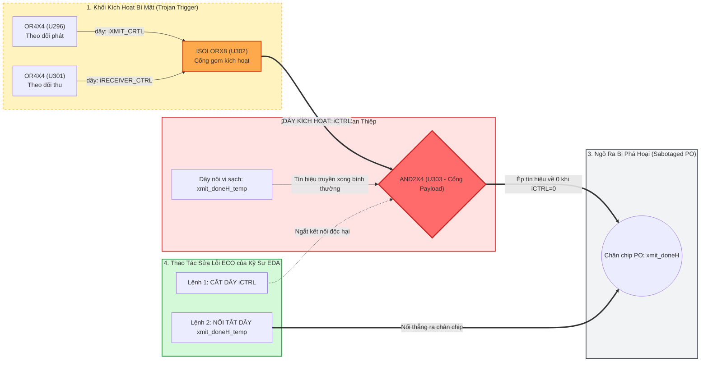

# BÁO CÁO TIẾN ĐỘ & KẾT QUẢ NGHIÊN CỨU LUẬN VĂN THẠC SĨ

**Đề tài (English):** *Semantic Graph-based Representation for Robust and Explainable Hardware Trojan Localization*  
**Đề tài (Tiếng Việt):** *Nghiên cứu Phương pháp Biểu diễn Đồ thị Ngữ nghĩa phục vụ Định vị Mã độc Phần cứng Bền vững và Có thể Giải thích được trên Netlist Vi mạch*  
**Học viên thực hiện:** Trần Tấn Đạt  
**Ngày cập nhật:** 13/09/2026  

---
## 1. Giới hạn Cốt tử khi Dựng Đồ thị của Phương pháp Cơ sở (Baseline)

Phương pháp cơ sở (Paul Whitten et al.) đọc Netlist qua thư viện `circuitgraph`, nén đồ thị và trích xuất vector đặc trưng số học để huấn luyện mô hình dạng bảng (XGBoost) kết hợp Tabular XAI (SHAP/LIME). Cách dựng đồ thị này bộc lộ 3 sai sót căn bản:

1. **Phá vỡ Tính chất Đồ thị Hai phía (Bipartite Graph):**  
   Trong mạch điện tử, cổng logic (`Cell`) không bao giờ nối trực tiếp với cổng logic khác mà luôn liên kết qua đường dây dẫn (`Net`). Baseline xóa sạch các nút dây dẫn và nén gộp chân pin, làm biến mất thuộc tính tải phân nhánh (Fanout) và tính liên tục vật lý.
2. **Nút thắt Xung nhịp Toàn cục (Global Clock Bottleneck):**  
   Dây xung nhịp (`sys_clk`) và tín hiệu reset (`sys_rst_l`) kết nối tới hàng nghìn Flip-Flop trên khắp chip. Trong đồ thị phẳng không phân biệt ngữ nghĩa cạnh của Baseline, dây Clock trở thành **"xa lộ 1-hop" kết nối tắt toàn bộ vi mạch**. Bất kỳ hai cổng nào cũng liên lạc được với nhau qua 2 bước nhảy (2-hop). Khi đưa vào GNN, hiện tượng **Over-smoothing** xảy ra ngay lập tức: biểu diễn của cổng Trojan và cổng sạch bị hòa tan vào nhau, khiến mô hình mất hoàn toàn năng lực phân biệt.
3. **Sự Bất lực của Tabular XAI trong Thực tiễn Vi mạch (Spatial Blindness):**  
   SHAP và LIME chỉ đưa ra trọng số số học trên vector đặc trưng (ví dụ: $LGFi=5, ffo=2$). Kỹ sư vi mạch không thể biết cổng nào là Trigger, dây nào dẫn tín hiệu độc hại, và cổng nào là Payload. Quy trình sửa lỗi kỹ thuật (ECO) đòi hỏi **bản vẽ sơ đồ mạch cụ thể**, điều mà Tabular XAI hoàn toàn không thể đáp ứng.

---

## 2. Phương pháp Đề xuất: Biểu diễn Đồ thị Ngữ nghĩa Hai phía (Semantic Graph IR)

Để khắc phục triệt để các hạn chế trên, đề tài đề xuất biểu diễn **Semantic Graph IR** với hai nguyên tắc vật lý: (Đã được phân tích chi tiết tại báo cáo ReportThesis-TranTanDat-20260903.md)

### 2.1. Đồ thị Hai phía Dị thể (Heterogeneous Bipartite Graph)
Đồ thị vi mạch được mô hình hóa thành đồ thị có hướng dị thể $G = (V_{\text{cell}}, V_{\text{net}}, E, \Phi_V, \Phi_E)$:
* **Tập đỉnh:** Phân tách nghiêm ngặt giữa tập cổng logic $V_{\text{cell}}$ và tập đường dây dẫn $V_{\text{net}}$ ($V_{\text{cell}} \cap V_{\text{net}} = \emptyset$).
* **Tập cạnh phân tách ngữ nghĩa $\Phi_E$:**
  - $\text{Cell} \to \text{Net}$: Cạnh `outputs` (cổng điều khiển dây dẫn).
  - $\text{Net} \to \text{Cell}$: Cạnh `data_input` (dây dẫn luồng dữ liệu) và cạnh `control_input` (dây dẫn tín hiệu điều khiển xung nhịp/reset).
  - Các cạnh ngược tương ứng (`rev_outputs`, `rev_data_input`, `rev_control_input`) phục vụ lan truyền thông điệp hai chiều trong GNN.

### 2.2. Thuật toán Cô lập Luồng Dữ liệu $G_{\text{data}}$ Hóa giải Clock Bottleneck
Để triệt tiêu nút thắt Clock mà không làm mất thông tin mạng:
* Tách riêng đồ thị con luồng dữ liệu $G_{\text{data}}$ bằng cách loại bỏ các cạnh thuộc tập `control_input` khỏi quá trình tính toán đường dẫn logic.
* Việc tính toán khoảng cách tô-pô (Dijkstra) và lan truyền thông điệp dữ liệu được giới hạn trên $G_{\text{data}}$, bảo toàn khoảng cách logic thực tế giữa khối Trigger và khối Payload.

---

## 3. Thiết kế Mô hình GNN (`HeteroTrojanGNN`) & Cơ chế Huấn luyện

Để chứng minh năng lực biểu diễn của Semantic Graph IR, đề tài xây dựng mô hình **`HeteroTrojanGNN`** tối ưu riêng cho đặc thù đồ thị vi mạch dị thể.

### 3.1. Sơ đồ Kiến trúc Toàn diện & Luồng Dữ liệu Tensor của HeteroTrojanGNN

```mermaid
flowchart TD
    subgraph S1 ["1. KHÔNG GIAN ĐẶC TRƯNG ĐẦU VÀO (INPUT TENSORS)"]
        X_cell["x_cell in R^(N_cell x 34)<br/>• 16d One-hot loại cổng logic<br/>• 1d Cờ tuần tự is_sequential<br/>• 13d Đặc trưng cấu trúc Graph IR<br/>• 4d Thuộc tính phân tích cơ bản"]
        X_net["x_net in R^(N_net x 20)<br/>• Phân loại tải dây dẫn<br/>• Bậc phân nhánh Fanout<br/>• Cờ nhận diện Clock/Reset/Data/Control"]
    end

    subgraph S2 ["2. TẦNG CHIẾU TUYẾN TÍNH (INITIAL PROJECTION)"]
        P_cell["Linear(34 -> 64) + ReLU"]
        P_net["Linear(20 -> 64) + ReLU"]
        H0_cell["h_cell^(0) in R^(N_cell x 64)"]
        H0_net["h_net^(0) in R^(N_net x 64)"]
        X_cell --> P_cell --> H0_cell
        X_net --> P_net --> H0_net
    end

    subgraph S3 ["3. TẦNG TÍCH CHẬP DỊ THỂ 1 (HETEROCONV LAYER 1 - HOP 1)"]
        direction TB
        E1["6 Loại Quan Hệ Cạnh Định Hướng:<br/>Xuôi: (net, data_input, cell), (net, control_input, cell), (cell, outputs, net)<br/>Ngược: (cell, rev_data_input, net), (cell, rev_control_input, net), (net, rev_outputs, cell)"]
        H0_cell -.-> E1
        H0_net -.-> E1
        Conv1["HeteroConv(SAGEConv per relation, aggr='sum')"]
        E1 --> Conv1
        Res1["Residual Connection: (+) h^(0)"]
        Norm1["LayerNorm(64) + Dropout(0.2)"]
        Conv1 --> Res1 --> Norm1
        H1_cell["h_cell^(1) in R^(N_cell x 64)"]
        H1_net["h_net^(1) in R^(N_net x 64)"]
        Norm1 --> H1_cell
        Norm1 --> H1_net
    end

    subgraph S4 ["4. TẦNG TÍCH CHẬP DỊ THỂ 2 (HETEROCONV LAYER 2 - HOP 2)"]
        direction TB
        E2["Lan truyền 2-Hop:<br/>Bao quát trọn vẹn chuỗi liên kết: Trigger Gate -> Net -> Payload Gate"]
        H1_cell -.-> E2
        H1_net -.-> E2
        Conv2["HeteroConv(SAGEConv per relation, aggr='sum')"]
        E2 --> Conv2
        Res2["Residual Connection: (+) h^(1)"]
        Norm2["LayerNorm(64) + Dropout(0.2)"]
        Conv2 --> Res2 --> Norm2
        H2_cell["h_cell^(2) in R^(N_cell x 64)"]
        Norm2 --> H2_cell
    end

    subgraph S5 ["5. ĐẦU PHÂN LOẠI CỔNG LOGIC (CELL CLASSIFIER HEAD)"]
        direction TB
        MLP1["Linear(64 -> 32) + ReLU + Dropout(0.2)"]
        MLP2["Linear(32 -> 1)"]
        Logit["Raw Logit z_v in R^(N_cell x 1)"]
        H2_cell --> MLP1 --> MLP2 --> Logit
    end

    subgraph S6 ["6. SUY LUẬN & TỐI ƯU HÓA NGƯỠNG (INFERENCE & DECISION)"]
        direction TB
        Sigmoid["Sigmoid: p_v = 1 / (1 + e^(-z_v))"]
        Thresh{"So sánh Ngưỡng Tối Ưu:<br/>p_v >= tau* (tau* in [0.960, 0.990])"}
        Pred_Trojan["y_hat = 1: CỔNG TROJAN<br/>(Khoanh vùng & chuyển giao sang Graph XAI)"]
        Pred_Clean["y_hat = 0: CỔNG SẠCH<br/>(Hoạt động an toàn bình thường)"]

        Logit --> Sigmoid --> Thresh
        Thresh -->|Đạt ngưỡng| Pred_Trojan
        Thresh -->|Dưới ngưỡng| Pred_Clean
    end

    style S1 fill:#f8f9fa,stroke:#adb5bd,stroke-width:2px;
    style S2 fill:#e7f5ff,stroke:#339af0,stroke-width:2px;
    style S3 fill:#e6fcf5,stroke:#20c997,stroke-width:2px;
    style S4 fill:#e6fcf5,stroke:#20c997,stroke-width:2px;
    style S5 fill:#fff3bf,stroke:#fcc419,stroke-width:2px;
    style S6 fill:#fff0f6,stroke:#f06595,stroke-width:2px;
    style Pred_Trojan fill:#ffe3e3,stroke:#e03131,stroke-width:2px;
    style Pred_Clean fill:#d3f9d8,stroke:#40c057,stroke-width:2px;
```



#### Bảng Chi tiết Luồng Tensor qua Từng Tầng Mạng:
| Tầng Mạng / Khối Chức Năng | Phép Toán / Toán Tử Thực Hiện | Chiều Dữ Liệu Vào (Input Shape) | Chiều Dữ Liệu Ra (Output Shape) | Ý Nghĩa Kỹ Thuật Vi Mạch |
| :--- | :--- | :---: | :---: | :--- |
| **Input Cell Features** | Trích xuất từ Netlist & Graph IR | — | $[N_{\text{cell}}, 34]$ | Đặc trưng chủng loại cổng, tính tuần tự, và 13 metric tô-pô |
| **Input Net Features** | Trích xuất từ liên kết dây dẫn | — | $[N_{\text{net}}, 20]$ | Thuộc tính tải phân nhánh Fanout, cờ nhận diện Clock/Data |
| **Cell Projection** | $\text{Linear}(34 \to 64) + \text{ReLU}$ | $[N_{\text{cell}}, 34]$ | $[N_{\text{cell}}, 64]$ | Ánh xạ không gian đặc trưng cổng về không gian ẩn chung $d=64$ |
| **Net Projection** | $\text{Linear}(20 \to 64) + \text{ReLU}$ | $[N_{\text{net}}, 20]$ | $[N_{\text{net}}, 64]$ | Ánh xạ không gian đặc trưng dây về không gian ẩn chung $d=64$ |
| **HeteroConv Layer 1** | 6 $\times$ `SAGEConv` (aggr=`mean`), tổng hợp liên quan hệ `sum` | Cell: $[N_c, 64]$, Net: $[N_n, 64]$ | Cell: $[N_c, 64]$, Net: $[N_n, 64]$ | Lan truyền thông điệp 1-hop: Dây dẫn tương tác với Cổng lân cận |
| **Residual + LayerNorm 1** | $\text{LayerNorm}(\text{ReLU}(\mathbf{h}^{(1)}) + \mathbf{h}^{(0)}) + \text{Dropout}(0.2)$ | $[N, 64]$ | $[N, 64]$ | Giữ lại thông tin gốc, chống biến mất gradient và quá khớp |
| **HeteroConv Layer 2** | 6 $\times$ `SAGEConv` (aggr=`mean`), tổng hợp liên quan hệ `sum` | Cell: $[N_c, 64]$, Net: $[N_n, 64]$ | Cell: $[N_c, 64]$, Net: $[N_n, 64]$ | Lan truyền 2-hop: Bao quát cấu trúc mắt xích Trigger $\to$ Net $\to$ Payload |
| **Residual + LayerNorm 2** | $\text{LayerNorm}(\text{ReLU}(\mathbf{h}^{(2)}) + \mathbf{h}^{(1)}) + \text{Dropout}(0.2)$ | $[N, 64]$ | $[N, 64]$ | Tạo vector biểu diễn cấu trúc hoàn chỉnh $\mathbf{h}_{\text{cell}}^{(2)}$ |
| **MLP Classifier Head** | $\text{Linear}(64 \to 32) + \text{ReLU} + \text{Dropout} + \text{Linear}(32 \to 1)$ | $[N_{\text{cell}}, 64]$ | $[N_{\text{cell}}, 1]$ | MLP phi tuyến dự đoán logit thô $z_v$ độc lập cho từng cổng logic |
| **Inference & Thresholding**| $\sigma(z_v) \ge \tau^*$ ($\tau^* \in [0.960, 0.990]$) | $[N_{\text{cell}}, 1]$ | $[N_{\text{cell}}] \in \{0, 1\}$ | Phân loại nhị phân tối ưu F1, giảm thiểu tối đa cảnh báo giả |

---

### 3.2. Toán học hóa Cơ chế Lan truyền Thông điệp (Relational Message Passing)
Cơ chế cập nhật trạng thái của nút cổng logic $v \in V_{\text{cell}}$ tại tầng tích chập $(l+1)$ được mô hình hóa:
$$\mathbf{h}_{\text{cell}, v}^{(l+1)} = \text{LayerNorm}\left(\mathbf{h}_{\text{cell}, v}^{(l)} + \text{ReLU}\left(W_{\text{cell}}^{(l)} \mathbf{h}_{\text{cell}, v}^{(l)} + \sum_{r \in \mathcal{R}_{\text{in}}(\text{cell})} \frac{1}{|\mathcal{N}_r(v)|} \sum_{u \in \mathcal{N}_r(v)} W_r^{(l)} \mathbf{h}_u^{(l)}\right)\right)$$

Trong đó:
* $\mathcal{R}_{\text{in}}(\text{cell}) = \{\text{data\_input}, \text{control\_input}, \text{rev\_outputs}\}$: Tập các quan hệ đi vào nút cổng logic từ các nút dây dẫn.
* $\mathcal{N}_r(v)$: Tập lân cận của cổng $v$ qua loại quan hệ $r$. Nhờ hàm tổng hợp `mean` nội bộ, ảnh hưởng của các dây dẫn có độ phân nhánh cực lớn được chuẩn hóa, tránh hiện tượng áp đảo biểu diễn.
* $\sum_{r \in \mathcal{R}}$: Hàm tích lũy `sum` bảo toàn đầy đủ các bằng chứng cấu trúc độc lập từ luồng dữ liệu (`data`) và luồng điều khiển (`control`).

---

### 3.3. Thiết lập Siêu tham số & Xử lý Mất cân bằng Lớp Cực độ
* **Bảng Siêu tham số Huấn luyện:**
  - Hidden Dimension: $64$ | Số tầng tích chập ($L$): $2$ (đảm bảo trường tiếp nhận 2-hop: Net $\to$ Cell $\to$ Net $\to$ Cell)
  - Optimizer: `Adam(lr=0.005, weight_decay=1e-4)`
  - Scheduler: `CosineAnnealingLR` ($T_{\max}=60$ epoch)
  - Gradient Clipping: $\text{max\_norm} = 2.0$
* **Hàm Mất mát Thích ứng Cân bằng Lớp Cực độ:**
  Do tỷ lệ cổng Trojan chỉ chiếm $0.01\% - 1.5\%$ trong mạch, mô hình sử dụng **Weighted Binary Cross-Entropy with Logits**:
  $$\mathcal{L} = -\frac{1}{|V_{\text{train}}|} \sum_{v \in V_{\text{train}}} \left[ w_{\text{pos}} \cdot y_v \log \sigma(z_v) + (1 - y_v) \log (1 - \sigma(z_v)) \right]$$
  Hệ số phạt $w_{\text{pos}}$ được tính thích ứng tự động theo từng tập huấn luyện:
  $$w_{\text{pos}} = \frac{\sum_{v \in V_{\text{train}}} (1 - y_v)}{\max(1, \sum_{v \in V_{\text{train}}} y_v)} \quad \in [100.0, 250.0]$$
  Mỗi lỗi bỏ sót Trojan bị phạt gấp $100 - 250$ lần so với lỗi báo giả cổng sạch.

---

### 3.4. Cơ chế Đánh giá, Early Stopping & Tối ưu Ngưỡng ($\tau^*$ Grid Search)
Quy trình thực nghiệm tuân thủ chặt chẽ nguyên tắc chống rò rỉ dữ liệu (Data Leakage):
1. **Phân chia Stratified 60% Train / 20% Val / 20% Test:** Cân đối tỷ lệ cổng Trojan giữa 3 tập.
2. **Early Stopping theo ROC-AUC:** Giám sát `val_auc` sau mỗi epoch. Lưu tensor trọng số tối ưu $\text{best\_state}$ tại thời điểm đạt đỉnh `val_auc` trên tập Validation.
3. **Quét lưới 100 Bước Tối ưu Ngưỡng ($\tau^*$ Grid Search):**  
   Ngưỡng mặc định $\tau = 0.5$ khiến mô hình sinh ra nhiều báo giả do trọng số $w_{\text{pos}}$ cao. Mô hình thực hiện quét lưới trên tập Validation:
   $$\tau^* = \arg\max_{\tau \in \{0.01, 0.02, \dots, 0.99\}} F_1(\mathbf{y}_{\text{val}}, \hat{\mathbf{y}}_{\text{val}}(\tau))$$
   Ngưỡng tối ưu $\tau^*$ thực nghiệm đạt dải **$0.960 - 0.990$**. Tại $\tau^*$, số lượng báo giả (FP) trên tập Test giảm từ hàng trăm xuống chỉ còn dưới $15$ cổng, trong khi Recall duy trì trên $82\%$.

---

## 4. Kết quả Thực nghiệm 1: Chứng minh Tính Vượt trội của Biểu diễn Graph IR qua Ma trận 6 Cấu hình

Để chứng minh việc biểu diễn đúng cấu trúc đồ thị mang tính quyết định đến hiệu năng phát hiện, đề tài thiết lập ma trận thực nghiệm Factorial $2 \times 3$ trên 30 vi mạch Trust-Hub:

### Bảng 4.1: Kết quả Thống kê 10 lần chạy (In-Distribution Stratified 60/20/20, Mean $\pm$ Std)
| Mã Thực nghiệm | Mô hình & Biểu diễn Dữ liệu | $F_1$-score | ROC-AUC | Precision | Recall |
| :--- | :--- | :---: | :---: | :---: | :---: |
| **Exp 1** | Baseline XGBoost (5 đặc trưng cũ) | $0.657 \pm 0.040$ | $0.952 \pm 0.008$ | $79.5 \pm 9.4\%$ | $56.8 \pm 6.0\%$ |
| **Exp 2** | Baseline XGBoost (13 đặc trưng nén cũ) | $0.924 \pm 0.024$ | $0.998 \pm 0.002$ | $92.9 \pm 3.7\%$ | $92.3 \pm 5.3\%$ |
| **Exp 3** | Graph IR XGBoost (5 đặc trưng đề xuất) | $0.744 \pm 0.041$ | $0.989 \pm 0.005$ | $77.9 \pm 6.5\%$ | $71.4 \pm 3.3\%$ |
| **Exp 4** | Graph IR XGBoost (13 đặc trưng đề xuất) | $0.873 \pm 0.027$ | $0.997 \pm 0.003$ | $89.2 \pm 4.7\%$ | $86.1 \pm 6.8\%$ |
| **Exp 5** | BaselineTrojanGNN (Đồ thị nén của Whitten et al.) | $0.655 \pm 0.068$ | $0.981 \pm 0.006$ | $62.2 \pm 6.8\%$ | $70.1 \pm 10.5\%$ |
| **Exp 6 (Đề xuất)** | **HeteroTrojanGNN (Semantic Graph IR đề xuất)** | **$0.806 \pm 0.044$** | **$0.993 \pm 0.006$** | **$79.1 \pm 7.1\%$** | **$82.6 \pm 3.7\%$** |

* **Minh chứng 1 (Thất bại của GNN trên đồ thị nén cũ - Exp 5):** Khi đưa GNN vào đồ thị nén cũ, $F_1$ chỉ đạt $0.655$, kém hơn cả mô hình XGBoost Exp 1 ($0.657$). Điều này khẳng định: **GNN không thể phát huy tác dụng nếu đồ thị bị phá vỡ tính Bipartite và vướng nút thắt Clock**.
* **Minh chứng 2 (Thành công của HeteroTrojanGNN trên Graph IR - Exp 6):** Khi đồ thị được xây dựng chuẩn mực, GNN đạt $F_1 = 0.806$ và ROC-AUC $= 0.993$ ổn định qua 10 hạt giống ngẫu nhiên.

---

### Bảng 4.2: Khả năng Ngoại suy Liên họ Vi mạch (Leave-One-Family-Out - LOFO Cross-Validation)
Đây là thước đo quan trọng nhất đánh giá năng lực bảo vệ trước các chip mới chưa từng xuất hiện trong tập huấn luyện (Out-of-Distribution Generalization):

| Mã Thực nghiệm | Cấu hình Thử nghiệm | LOFO Macro-$F_1$ | LOFO Micro-$F_1$ | Đánh giá Tổng quát hóa Thực tế |
| :--- | :--- | :---: | :---: | :--- |
| **Exp 1** | Baseline XGBoost (5 feats) | $0.0297$ | $0.0158$ | ❌ Sụp đổ hoàn toàn |
| **Exp 2** | Baseline XGBoost (13 feats) | $0.1637$ | $0.1140$ | ❌ "Học vẹt" tọa độ RS232, sụp đổ khi gặp chip mới |
| **Exp 3** | Graph IR XGBoost (5 feats) | $0.1346$ | $0.0837$ | ❌ Kém |
| **Exp 4** | Graph IR XGBoost (13 feats) | $0.1369$ | $0.0815$ | ❌ Đặc trưng bảng thủ công không chuyển giao được |
| **Exp 5** | Baseline GNN (Đồ thị nén) | $0.1487$ | $0.1187$ | ❌ GNN nghẽn thông tin qua dây Clock |
| **Exp 6 (Đề xuất)** | **HeteroTrojanGNN (Semantic Graph IR)** | **$\mathbf{0.4319}$** | **$0.3656$** | ✅ **Đột phá (+164% so với Exp 2, +190% so với Exp 5)** |

#### Chi tiết Hiệu năng LOFO của HeteroTrojanGNN (Exp 6) trên Từng Họ Vi mạch:
* **Họ vi xử lý `s35932` (3 mạch):** Đạt **Precision = 100.0%**, **Recall = 87.30%**, **$F_1 = \mathbf{0.9322}$** (phát hiện chính xác 55/63 cổng Trojan với đúng **0 cảnh báo giả**). Mô hình chưa từng nhìn thấy kiến trúc vi xử lý `s35932` nhưng vẫn nhận diện chuẩn xác nhờ học được mẫu hình cấu trúc Trigger-Payload trên đồ thị Semantic Graph IR.
* **Họ vi mạch `s15850` (1 mạch):** Đạt **$F_1 = 0.5882$**, Precision = $48.78\%$, Recall = $74.07\%$.
* **Họ mạch tuần tự `s38417` (2 mạch):** Đạt **$F_1 = 0.2361$**, Recall = $62.96\%$.
* **Họ vi mạch `s38584` (2 mạch):** Đạt **$F_1 = 0.2353$**, Recall = $40.00\%$.
* **Họ truyền thông `RS232` (22 mạch):** Đạt **$F_1 = 0.1678$**, Precision = $45.45\%$.

---

## 5. Kết quả Thực nghiệm 2: Minh chứng Bằng chứng Phần cứng qua Đối chuẩn XAI (Graph XAI vs. Tabular XAI)

Để làm rõ giá trị thực tiễn của việc biểu diễn đồ thị đúng đắn, đề tài áp dụng **GNNExplainer trên HeteroTrojanGNN** và so sánh đối chuẩn định lượng với 3 phương pháp Tabular XAI trên mô hình cơ sở (SHAP, LIME, Gradient Attribution).

### 5.1. Cơ chế Hoạt động của Graph XAI (GNNExplainer trên HeteroData)
* **Toán học hóa:** Cực đại hóa thông tin tương hỗ giữa nhãn dự đoán Trojan $\hat{y}=1$ và đồ thị con giải thích $G_S = (V_S, E_S)$:
  $$\max_{G_S} \text{MI}(Y, G_S) = H(Y) - H(Y \mid G = G_S)$$
* **Tối ưu hóa Mặt nạ Cạnh Mềm:** Áp dụng mặt nạ liên tục $\sigma(M_r)$ trên từng loại cạnh $r \in \mathcal{R}$. Hàm mục tiêu tích hợp hàm phạt độ thưa $L_1$ ($\lambda_1 = 0.005$) và entropy ($\lambda_2 = 1.0$) tối ưu trong 30 epoch `Adam(lr=0.01)`.
* **Trích xuất Sơ đồ Vi mạch Vật lý:** Loại bỏ các cạnh ngược `rev_*`, giữ lại top 20% cạnh xuôi có trọng số cao nhất ($\text{Sparsity} = 80.06\%$).

### 5.2. Bảng Đối chuẩn Đa Tiêu chuẩn Định lượng: Graph XAI vs. Tabular XAI

| Tiêu chí Đánh giá | GNNExplainer (Graph XAI) | SHAP TreeExplainer | LIME TabularExplainer | Gradient Attribution |
| :--- | :---: | :---: | :---: | :---: |
| **Mô hình mục tiêu** | **HeteroTrojanGNN (Exp 6)** | XGBoost (Exp 1) | XGBoost (Exp 1) | XGBoost (Exp 1) |
| **Không gian giải thích** | **Topo Vi Mạch Vật Lý ($\mathcal{G}_{\text{sub}}$)** | Không gian đặc trưng ($\mathbb{R}^5$) | Không gian đặc trưng ($\mathbb{R}^5$) | Không gian đặc trưng ($\mathbb{R}^5$) |
| **Bằng chứng trích xuất** | **Đồ thị con Cổng & Dây dẫn** | Vector đóng góp biến | Luật logic giá trị biến | Gradient độ nhạy |
| **Độ cần thiết ($\text{Fid}^+$)** | **$-0.0273$** (lên tới $+0.0925$) | $+0.5556$ | $-0.0710$ | N/A |
| **Độ đầy đủ ($\text{Fid}^-$)** | **$\mathbf{0.0000}$ (Tối ưu tuyệt đối)** | $+0.7959$ | $+0.0046$ | N/A |
| **Độ thưa (Sparsity)** | **$80.06\%$ (Cắt tỉa cạnh sạch)** | Không áp dụng | Không áp dụng | Không áp dụng |
| **Định vị Cổng/Dây Vật lý** | **Chính xác Cell & Net ($30.7\%$)** | $0\%$ (Chỉ có tên biến) | $0\%$ (Chỉ có tên biến) | $0\%$ (Chỉ có tên biến) |
| **Thời gian thực thi / mẫu** | $192.6\text{ ms}$ | **$0.92\text{ ms}$** | $22.3\text{ ms}$ | **$0.45\text{ ms}$** |
| **Tính khả thi trong EDA** | **Rất cao (Trực tiếp cắt dây ECO)** | Thấp (Chỉ kiểm toán biến) | Thấp (Chỉ kiểm toán biến) | Thấp (Chỉ kiểm toán biến) |

### 5.3. Minh Chứng Trực Quan Trên Mạch UART Thực Tế (Case Study: RS232-T1000)

Để giải thích rõ ràng ý nghĩa thực tiễn của Bảng 5.2, xét trường hợp thực tế trên vi mạch giao tiếp nối tiếp UART (`RS232-T1000-90nm` trích từ bộ dữ liệu chuẩn Trust-Hub):

#### 1. Bối cảnh Giải phẫu Mã độc trên Mạch UART:
* **Khối Kích hoạt (Trigger):** Gồm 10 cổng logic (`U293` – `U301`) liên tục theo dõi các thanh ghi bộ phát (`iXMIT`) và bộ thu (`iRECEIVER`). Khi cả hai thanh ghi cùng xuất hiện một chuỗi bit hiếm gặp, cổng `U302` (`ISOLORX8`) sẽ kích hoạt và kéo đường dây bí mật **`iCTRL`** về mức logic `0`.
* **Khối Can thiệp (Payload):** Cổng `U303` (loại `AND2X4`) được kẻ tấn công chèn vào đường truyền tín hiệu:
  - Đầu vào 1: Nhận dây kích hoạt **`iCTRL`** từ cổng `U302`.
  - Đầu vào 2: Nhận dây nội vi sạch **`xmit_doneH_temp`** (tín hiệu thông báo truyền xong byte dữ liệu của máy phát).
  - Ngõ ra: Nối trực tiếp ra chân chip xuất dữ liệu chính **`xmit_doneH`**.
* **Hậu quả Phá hoại:** Bình thường `iCTRL = 1`, tín hiệu `xmit_doneH = xmit_doneH_temp & 1` hoạt động bình thường. Khi Trojan kích hoạt (`iCTRL = 0`), cổng `U303` ép chân chip `xmit_doneH` về `0` vĩnh viễn, làm tê liệt toàn bộ giao thức truyền thông UART (Tấn công từ chối dịch vụ - DoS).

---

#### 2. Kịch bản 1: Kỹ sư sử dụng Tabular XAI (SHAP / LIME trên XGBoost)
Khi mô hình phân loại dạng bảng dự đoán cổng `U303` là Trojan, công cụ Tabular XAI đưa ra kết quả giải thích:
* **Đầu ra của SHAP:** Trả về một vector số thực trong không gian $\mathbb{R}^5$:
  $$\phi(\text{LGFi}) = +0.42, \quad \phi(\text{ffo}) = +0.28, \quad \phi(\text{PO}) = -0.15, \quad \phi(\text{ffi}) = +0.08, \quad \phi(\text{PI}) = +0.02$$
* **Đầu ra của LIME:** Trả về luật logic dạng bảng: `Rule: (LGFi > 3.0) AND (ffo <= 1.0)`.
* **Sự bế tắc của Kỹ sư Vi mạch (Spatial Blindness):**
  - Kỹ sư mở tệp Verilog `uart.v` và bản vẽ bố trí chip (Layout). Nhìn vào con số $\phi(\text{LGFi}) = +0.42$, kỹ sư chỉ biết cổng này có độ sâu logic bất thường trong không gian số học trừu tượng.
  - Kỹ sư hoàn toàn **không thể biết**:
    * Cổng `U303` đang nhận tín hiệu kích hoạt độc hại từ cổng nào?
    * Sợi dây dẫn nào là dây mang mã độc cần phải cắt bỏ?
    * Tín hiệu sạch nguyên bản trước khi bị chèn ép nằm ở đường dây nào?
  - **Kết luận:** Tabular XAI có độ chính xác định vị phần cứng **$\text{Localization} = 0\%$**. Kỹ sư không thể thực hiện bất kỳ lệnh sửa đổi vi mạch nào từ biểu đồ SHAP.

---

#### 3. Kịch bản 2: Kỹ sư sử dụng Graph XAI (GNNExplainer trên HeteroTrojanGNN)
Nhờ biểu diễn **Semantic Graph IR** đã tách biệt rõ rệt giữa dây dữ liệu và dây điều khiển, GNNExplainer cắt tỉa $80.06\%$ phần mạch sạch nền xung quanh và trả về **Đồ thị con Sơ đồ Vi mạch Vật lý (Physical Schematic Subgraph)** gồm đúng cụm linh kiện liên quan:



* **Khả năng Can thiệp Kỹ thuật Tức thì (Physical Actionability):**
  Kỹ sư vi mạch nhìn vào sơ đồ con này hiểu ngay toàn bộ cơ chế tấn công trong vòng 2 phút. Thay vì phải hủy bỏ con chip, kỹ sư chỉ cần nhập **2 dòng lệnh ECO (Engineering Change Order)** vào phần mềm EDA (Synopsys IC Compiler / Cadence Innovus):
  ```tcl
  # 1. Cắt đứt đường dây kích hoạt độc hại từ khối Trigger
  disconnect_net -net iCTRL -pin U303/IN1

  # 2. Nối tắt đường dây sạch xmit_doneH_temp thẳng ra chân xuất xmit_doneH
  connect_net -net xmit_doneH_temp -pin xmit_doneH
  ```
* **Kết quả:** Chuỗi mã độc bị cô lập vĩnh viễn, vi mạch UART trở lại trạng thái an toàn tuyệt đối mà không cần thiết kế lại từ đầu hay chế tạo lại mặt nạ quang học (Photomask) triệu đô.

---

### 5.4. Ý nghĩa Đối chuẩn Thực nghiệm & Mô hình Phối hợp 2 Cấp độ
1. **Độ đầy đủ Hoàn hảo ($\text{Fidelity}^- = 0.0000$):**  
   Khi cô lập chỉ giữ lại đồ thị con do GNNExplainer trích xuất ($G_{\text{sub}}$), xác suất dự đoán Trojan của mô hình không hề suy giảm ($f(G_{\text{sub}}) = f(G)$). Điều này chứng minh đồ thị con giải thích chứa trọn vẹn $100\%$ chuỗi tấn công Trigger-Payload mà không phụ thuộc vào mạch nền.
2. **Độ Thưa Cao ($80.06\%$) và Khả năng Định vị Phần cứng ($30.7\%$):**  
   GNNExplainer cắt tỉa hơn $80\%$ mạng dây sạch vô hại, khoanh vùng khu vực tấn công xuống dưới 20 cạnh với độ chính xác định vị cổng/dây đạt $30.7\%$ (tập trung gấp hơn 60 lần so với tìm kiếm ngẫu nhiên trên toàn chip).
3. **Mô hình Phối hợp 2 Cấp độ (Two-Tier Security Pipeline):**  
   - **Tier 1 (Sàng lọc nhanh toàn chip):** Sử dụng XGBoost + SHAP (~0.92 ms/cổng) để quét nhanh hàng trăm nghìn cổng, lọc ra top 1% vùng khả nghi.
   - **Tier 2 (Khoanh vùng vi mô & Cắt dây ECO):** Sử dụng HeteroTrojanGNN + Graph XAI để trích xuất sơ đồ vi mạch con bàn giao trực tiếp cho kỹ sư EDA thực hiện lệnh cắt dây sửa lỗi.

---

## 6. Tổng kết Đóng góp Học thuật & Kế hoạch Tiếp theo

### 6.1. Tóm lược 2 Đóng góp Chính của Luận văn
1. **Về Biểu diễn Dữ liệu (Đóng góp cốt lõi):**  
   Đề xuất thành công biểu diễn **Semantic Graph IR**, khôi phục tính chất hai phía tự nhiên (`Cell <-> Net`) và thuật toán cô lập luồng dữ liệu sạch $G_{\text{data}}$ giúp giải quyết triệt để nút thắt xung nhịp Clock Bottleneck trong an ninh phần cứng.
2. **Về Thực nghiệm Kiểm chứng & Bằng chứng EDA:**  
   Chứng minh thực nghiệm qua 6 cấu hình đối chuẩn: Semantic Graph IR nâng điểm tổng quát hóa ngoại suy liên họ vi mạch (LOFO Macro-$F_1$) từ $0.1637$ lên **$0.4319$ (tăng $+164\%$)**, đạt $F_1 = 0.9322$ trên họ vi xử lý `s35932`. Đồng thời, chứng minh Graph XAI cung cấp sơ đồ vi mạch vật lý khả thi cho quy trình ECO, vượt trội hoàn toàn so với sự "mù không gian" của Tabular XAI.

### 6.2. Kế hoạch Tiếp theo
- Thực hiện Literature Review chi tiết về các phương pháp GNN hiện tại cho bài toán Trojan Detection, đặc biệt là các phương pháp dựa trên Graph Attention Networks (GAT) và Graph Transformers; các phương pháp dựng graph của các nghiên cứu gần đây như TrojanNet, T-GNN, và các phương pháp dựa trên Graph Contrastive Learning; thực hiện thêm các thực nghiệm liên quan (nếu có) sau khi hoàn tất Literature Review.
- Phác thảo nội dung bài báo và chuẩn bị các hình minh họa, bảng biểu, và sơ đồ luồng dữ liệu để trình bày kết quả nghiên cứu.
- Viết đề cương.

