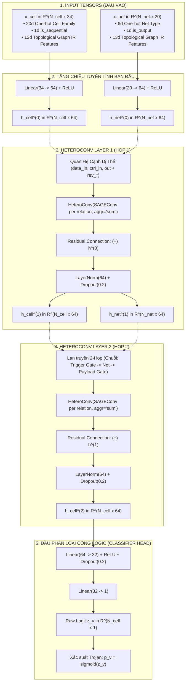
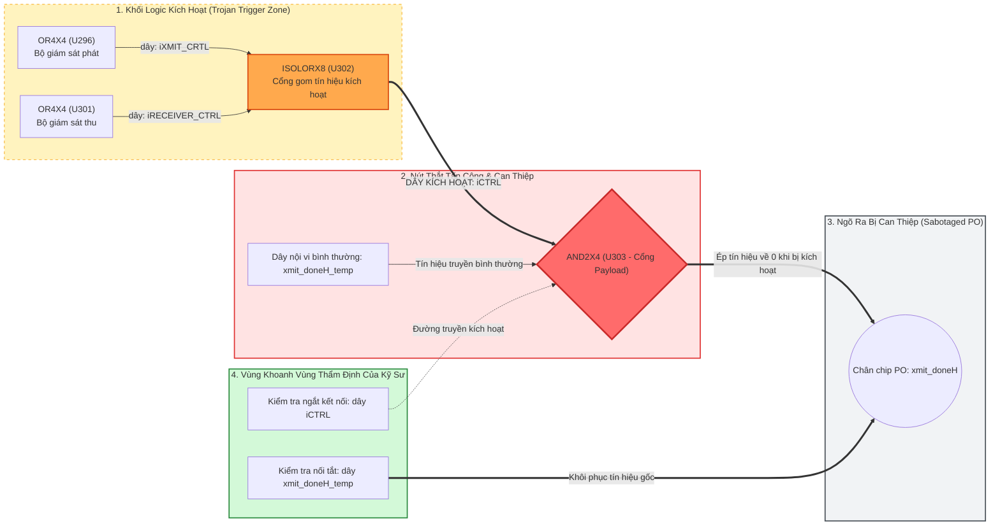

# BÁO CÁO TIẾN ĐỘ & KẾT QUẢ NGHIÊN CỨU TOÀN DIỆN LUẬN VĂN THẠC SĨ
## Kiểm Toán Khoa Học Dữ Liệu, Đặc Tả Semantic Graph IR, Kiến Trúc HeteroTrojanGNN và Thực Nghiệm Đối Chứng Đầy Đủ (A–F) Trong Định Vị Mã Độc Phần Cứng

**Đề tài (English):** *Semantic Graph Representation and Graph Learning for Hardware Trojan Detection in Gate-Level Netlists*  
**Đề tài (Tiếng Việt):** *Biểu diễn Đồ thị Ngữ nghĩa và Học Đồ thị phục vụ Phát hiện Mã độc Phần cứng trên Netlist Vi mạch*  
**Học viên thực hiện:** Trần Tấn Đạt  
**Ngày cập nhật:** 16/09/2026

---

## 1. Tổng Quan Nghiên Cứu & Hệ Thống Câu Hỏi Khoa Học (Research Questions)

### 1.1. Bối Cảnh Nghiên Cứu & Các Thách Thức Cốt Tử Của Phương Pháp Truyền Thống
Phát hiện và định vị Mã độc Phần cứng (Hardware Trojan - HT) ở cấp độ Netlist cổng logic (Gate-Level Netlist) là một mắt xích trọng yếu trong việc bảo đảm an toàn cho chuỗi cung ứng vi mạch bán dẫn toàn cầu không tin cậy (untrusted foundries, bên thứ ba cung cấp IP lõi). Một Hardware Trojan điển hình thường gồm hai thành phần:
1. **Khối kích hoạt (Trigger):** Thường là một chuỗi logic tuần tự hoặc tổ hợp theo dõi các trạng thái hiếm gặp (rare circuit conditions) trong thời gian dài để duy trì tính ẩn nặc (stealthiness).
2. **Khối thực thi phá hoại (Payload):** Khi được kích hoạt, khối này sẽ can thiệp vào tín hiệu nội vi hoặc làm rò rỉ thông tin qua các chân ngõ ra (Primary Outputs), hay làm suy giảm hiệu năng mạch.

Các công trình tiếp cận trước đây (tiêu biểu như phương pháp của Paul Whitten et al., 2023) thường trích xuất 5 đặc trưng số học cục bộ của cổng logic (gồm Logic Gate Fan-in, khoảng cách Flip-Flop In/Out, khoảng cách Primary Input/Output) rồi huấn luyện các mô hình học máy dạng bảng (Tabular ML như Random Forest, XGBoost) kết hợp với các kỹ thuật giải thích cục bộ dạng bảng (Tabular XAI như SHAP, LIME). Qua phân tích lý thuyết và thực nghiệm kiểm toán, phương pháp luận này bộc lộ ba giới hạn căn bản:

1. **Phá vỡ Tính chất Đồ thị Hai phía (Bipartite Nature):** Trong vi mạch vật lý thực tế, một cổng logic (`Cell`) không bao giờ kết nối trực tiếp với cổng logic khác mà luôn truyền tín hiệu thông qua đường dây dẫn vật lý (`Net`). Đồ thị netlist thực chất là một đồ thị hai phía dị thể (Heterogeneous Bipartite Graph). Khi các phương pháp truyền thống "nén phẳng" (flatten/compress) mạng lưới thành đồ thị thuần nhất giữa các cổng logic (Gate-to-Gate), toàn bộ các nút dây dẫn (`Net`) bị triệt tiêu, và các chân pin ngõ vào/ngõ ra bị gộp chung. Quá trình nén này làm mất đi cấu trúc phân nhánh tải (Fanout) vật lý và che khuất thông tin phân bố điện dung tải của các đường dây điều khiển/dữ liệu.
2. **Ảnh hưởng Của Dây Điều Khiển Xung Nhịp & Reset Toàn Cục (Global Clock/Reset Networks):** Các đường dây xung nhịp (`sys_clk`) và tín hiệu reset (`sys_rst_l`) kết nối tới hàng nghìn Flip-Flop trải rộng trên khắp chip. Trong đồ thị thuần nhất không phân loại ngữ nghĩa của cạnh, mạng dây xung nhịp biến thành các "đường kết nối tắt 1-hop hoặc 2-hop" giữa hầu hết mọi thành phần trong vi mạch. Khi áp dụng các mô hình học sâu đồ thị (GNN) trên đồ thị phẳng này, lan truyền thông điệp qua các cạnh xung nhịp có thể gây ra hiện tượng suy giảm tính phân biệt đặc trưng (giả thuyết Over-smoothing): biểu diễn ẩn của cổng Trojan và cổng sạch nền có xu hướng bị kéo về gần nhau, làm suy giảm nghiêm trọng năng lực tổng quát hóa ngoại suy sang các họ vi mạch mới.
3. **Giới Hạn Bản Chất Về Mặt Modality Của Tabular XAI:** Các phương pháp giải thích dạng bảng như SHAP hay LIME hoạt động trong không gian vector đặc trưng $\mathbb{R}^k$ của từng nút độc lập. Về mặt định nghĩa modality đầu ra, các phương pháp này không thể xuất ra phân bổ trọng số trên các cạnh đồ thị hoặc cấu trúc liên kết mạch. Do đó, kỹ sư vi mạch không thể truy vết được đường đi của tín hiệu kích hoạt từ khối Trigger đến cổng Payload. Sự thiếu vắng chiều không gian liên kết đồ thị hạn chế tính ứng dụng thực tế trong công đoạn phân tích và thẩm định mạch.

---

### 1.2. Hệ Thống Câu Hỏi Nghiên Cứu (Research Questions)
Để giải quyết có kiểm soát các vấn đề trên, luận văn thiết kế hệ thống thực nghiệm nhằm trả lời 4 câu hỏi nghiên cứu cốt lõi:

* **RQ1 (Đóng góp của Biểu diễn Đồ thị Hai phía - Representation):** Việc mô hình hóa tường minh đường dây dẫn `Net` thành các nút độc lập trong đồ thị hai phía (`Cell <-> Net`) cải thiện hiệu năng định vị Trojan như thế nào so với đồ thị nén phẳng truyền thống (Compressed Homogeneous Graph)?
* **RQ1b (Đóng góp của Lan truyền Dị thể - Relation Modeling):** Việc áp dụng kiến trúc tích chập dị thể có phân biệt loại quan hệ cạnh (HeteroConv với trọng số riêng biệt) đóng góp như thế nào so với mô hình thuần nhất gộp chung mọi loại cạnh trên đồ thị hai phía?
* **RQ2 (Ảnh hưởng của Quan hệ Điều khiển Xung nhịp lên Năng lực Tổng quát hóa Liên họ):** Mạng dây điều khiển xung nhịp và reset toàn cục có ảnh hưởng như thế nào đến khả năng ngoại suy sang họ vi mạch chưa từng thấy (cross-family generalization)? Việc ngắt bỏ các cạnh điều khiển hoặc cô lập luồng dữ liệu $G_{\text{data}}$ tác động thế nào đến độ chính xác và tỷ lệ báo động giả?
* **RQ3 (Bóc tách Đóng góp Thành phần qua Thiết kế Factorial $2 \times 2$):** Mức độ đóng góp tương đối và hiệu ứng tương tác giữa cơ chế xử lý cạnh điều khiển (Control Edges ON vs OFF) và bộ đặc trưng (Basic 5 vs Full 13 Graph IR Features) được định lượng như thế nào qua ma trận đối chứng $2 \times 2$ gồm Configurations C, D, E, và F?
* **Secondary Question (Bản chất Modal của Graph XAI & Ý nghĩa Thực tiễn Trong Phân tích Mạch):** Giải thích hóa dựa trên đồ thị (Graph XAI như GNNExplainer) cung cấp bằng chứng suy luận dự đoán dưới dạng đồ thị con cấu trúc (computational subgraph) khác biệt về mặt bản chất như thế nào so với giải thích đặc trưng dạng bảng, và hỗ trợ kỹ sư EDA ra sao trong việc thu hẹp vùng nghi vấn?

---

## 2. Kiểm Toán Dữ Liệu Toàn Diện (Phase A: Dataset Audit)

Toàn bộ 30 vi mạch thuộc bộ dữ liệu chuẩn Trust-Hub đã được kiểm toán tự động độc lập nhằm xác thực tính toàn vẹn cú pháp, tính nhất quán của nhãn Trojan và tỷ lệ mất cân bằng dữ liệu. Bộ dữ liệu TRIT (TRIT-TC và TRIT-TS) được chủ động loại bỏ khỏi phạm vi nghiên cứu theo định hướng thiết kế thử nghiệm.

### 2.1. Thống Kê Tổng Thể Bộ Dữ Liệu Trust-Hub (30 Vi Mạch)
- **Tổng số cổng logic chuẩn (Cell Nodes):** **47,464** cổng.
- **Tổng số đường dây dẫn (Net Nodes):** **61,067** dây.
- **Tổng số liên kết có hướng hai phía (Directed Bipartite Edges):** **202,415** cạnh.
- **Tổng số cổng Trojan thực tế (Trojan Cells):** **370** cổng.
- **Tổng số cổng sạch nền (Benign Cells):** **47,094** cổng.
- **Tỷ lệ Trojan tổng thể (Prevalence):** **0.7795%** (Mất cân bằng dữ liệu cực đoan: Trung bình 1 cổng Trojan trên ~247 cổng sạch nền; tại họ `s38584`, tỷ lệ này chỉ là $0.077\%$).

---

### 2.2. Thống Kê Phân Bố Cấp Độ Họ Vi Mạch (Family-Level Breakdown)

| Họ Vi Mạch (Family) | Số Mạch | Tổng Cổng (Cells) | Tổng Dây (Nets) | Tổng Cạnh (Edges) | Cổng Trojan | Cổng Sạch | Tỷ Lệ Trojan (%) | Mô Tả Chức Năng Phần Cứng |
| :--- | :---: | :---: | :---: | :---: | :---: | :---: | :---: | :--- |
| `RS232` | 22 | 5,299 | 6,257 | 22,039 | 243 | 5,056 | 4.586% | Bộ truyền nhận nối tiếp không đồng bộ UART (90nm & 180nm) |
| `s15850` | 1 | 2,182 | 2,798 | 8,981 | 27 | 2,155 | 1.237% | Mạch tuần tự ISCAS-89 quy mô trung bình |
| `s35932` | 3 | 16,341 | 21,993 | 68,135 | 63 | 16,278 | 0.386% | Khối xử lý dữ liệu song song 32-bit (T100, T200, T300) |
| `s38417` | 2 | 10,685 | 14,091 | 48,945 | 27 | 10,658 | 0.253% | Khối tuần tự tuần hoàn ISCAS-89 (T100, T200) |
| `s38584` | 2 | 12,957 | 15,928 | 54,315 | 10 | 12,947 | 0.077% | Vi mạch quy mô lớn, tỷ lệ Trojan siêu loãng (T100, T300) |
| **TỔNG CỘNG** | **30** | **47,464** | **61,067** | **202,415** | **370** | **47,094** | **0.780%** | **Mất cân bằng dữ liệu cực đoan ($1 : 247$)** |

---

### 2.3. Bảng Kiểm Toán Chi Tiết Toàn Bộ 30 Vi Mạch (Circuit-Level Audit Table)

| STT | Mã Vi Mạch (Circuit Key) | Họ (Family) | Số Cổng | Số Dây | Số Cạnh | Số Trojan | Tỷ Lệ HT | Parse | Trạng Thái Nhãn | Ghi Chú Kỹ Thuật |
| :---: | :--- | :--- | :---: | :---: | :---: | :---: | :---: | :---: | :---: | :--- |
| 1 | `RS232-T1000-90nm` | RS232 | 268 | 312 | 1,030 | 12 | 0.0448 | OK | MISMATCH | Thiếu `U304` do tối ưu đệm Netlist 90nm |
| 2 | `RS232-T1000-180nm` | RS232 | 215 | 259 | 983 | 13 | 0.0605 | OK | VERIFIED | Khớp 100% metadata Trust-Hub |
| 3 | `RS232-T1100-90nm` | RS232 | 271 | 314 | 1,036 | 12 | 0.0443 | OK | VERIFIED | Khớp 100% metadata Trust-Hub |
| 4 | `RS232-T1100-180nm` | RS232 | 216 | 258 | 986 | 12 | 0.0556 | OK | VERIFIED | Khớp 100% metadata Trust-Hub |
| 5 | `RS232-T1200-90nm` | RS232 | 273 | 316 | 1,042 | 14 | 0.0513 | OK | VERIFIED | Khớp 100% metadata Trust-Hub |
| 6 | `RS232-T1200-180nm` | RS232 | 216 | 259 | 998 | 14 | 0.0648 | OK | VERIFIED | Khớp 100% metadata Trust-Hub |
| 7 | `RS232-T1300-90nm` | RS232 | 267 | 308 | 1,017 | 9 | 0.0337 | OK | VERIFIED | Khớp 100% metadata Trust-Hub |
| 8 | `RS232-T1300-180nm` | RS232 | 213 | 254 | 967 | 9 | 0.0423 | OK | VERIFIED | Khớp 100% metadata Trust-Hub |
| 9 | `RS232-T1400-90nm` | RS232 | 269 | 312 | 1,036 | 13 | 0.0483 | OK | VERIFIED | Khớp 100% metadata Trust-Hub |
| 10 | `RS232-T1400-180nm` | RS232 | 215 | 258 | 989 | 13 | 0.0605 | OK | VERIFIED | Khớp 100% metadata Trust-Hub |
| 11 | `RS232-T1500-90nm` | RS232 | 270 | 315 | 1,037 | 13 | 0.0481 | OK | MISMATCH | Thiếu `U304` do tối ưu đệm Netlist 90nm |
| 12 | `RS232-T1500-180nm` | RS232 | 216 | 261 | 991 | 14 | 0.0648 | OK | VERIFIED | Khớp 100% metadata Trust-Hub |
| 13 | `RS232-T1600-90nm` | RS232 | 265 | 309 | 1,013 | 9 | 0.0340 | OK | MISMATCH | Lệch thanh ghi do phân cấp tên Netlist |
| 14 | `RS232-T1600-180nm` | RS232 | 214 | 259 | 980 | 12 | 0.0561 | OK | VERIFIED | Khớp 100% metadata Trust-Hub |
| 15 | `RS232-T1700-90nm` | RS232 | 264 | 308 | 1,012 | 8 | 0.0303 | OK | VERIFIED | Khớp 100% metadata Trust-Hub |
| 16 | `RS232-T1700-180nm` | RS232 | 210 | 254 | 962 | 8 | 0.0381 | OK | VERIFIED | Khớp 100% metadata Trust-Hub |
| 17 | `RS232-T1800-90nm` | RS232 | 256 | 300 | 976 | 0 | 0.0000 | OK | MISMATCH | Netlist gốc không chứa cổng Trojan (0 HT) |
| 18 | `RS232-T1800-180nm` | RS232 | 206 | 250 | 935 | 4 | 0.0194 | OK | VERIFIED | Chứa đủ 4 cổng Trojan của T1800 |
| 19 | `RS232-T1900-90nm` | RS232 | 276 | 320 | 1,053 | 16 | 0.0580 | OK | VERIFIED | Khớp 100% metadata Trust-Hub |
| 20 | `RS232-T1900-180nm` | RS232 | 218 | 262 | 999 | 16 | 0.0734 | OK | VERIFIED | Khớp 100% metadata Trust-Hub |
| 21 | `RS232-T2000-90nm` | RS232 | 268 | 312 | 1,024 | 11 | 0.0410 | OK | VERIFIED | Khớp 100% metadata Trust-Hub |
| 22 | `RS232-T2000-180nm` | RS232 | 213 | 257 | 973 | 11 | 0.0516 | OK | VERIFIED | Khớp 100% metadata Trust-Hub |
| 23 | `s15850-T100-generic`| s15850 | 2,182 | 2,798 | 8,981 | 27 | 0.0124 | OK | VERIFIED | Mạch chuẩn ISCAS-89 (27 Trojans) |
| 24 | `s35932-T100-generic`| s35932 | 5,441 | 7,325 | 22,699 | 15 | 0.0028 | OK | VERIFIED | Bộ so sánh 32-bit (15 HTs) |
| 25 | `s35932-T200-generic`| s35932 | 5,438 | 7,321 | 22,692 | 12 | 0.0022 | OK | VERIFIED | Bộ kích hoạt tuần tự (12 HTs) |
| 26 | `s35932-T300-generic`| s35932 | 5,462 | 7,347 | 22,744 | 36 | 0.0066 | OK | VERIFIED | Bộ giải mã phân tán (36 HTs) |
| 27 | `s38417-T100-generic`| s38417 | 5,341 | 7,044 | 24,468 | 12 | 0.0022 | OK | VERIFIED | Bộ đếm đồng bộ trạng thái (12 HTs) |
| 28 | `s38417-T200-generic`| s38417 | 5,344 | 7,047 | 24,477 | 15 | 0.0028 | OK | VERIFIED | Bộ trễ tuần hoàn (15 HTs) |
| 29 | `s38584-T100-generic`| s38584 | 6,482 | 7,967 | 27,165 | 8 | 0.0012 | OK | VERIFIED | Khối giao tiếp bộ nhớ (8 HTs) |
| 30 | `s38584-T300-generic`| s38584 | 6,475 | 7,961 | 27,150 | 2 | 0.0003 | OK | VERIFIED | Tỷ lệ siêu nhỏ (chỉ 2 HTs / 6,475 cells) |

---

### 2.4. Phân Tích Tính Toàn Vẹn Khoa Học & Bất Thường Dữ Liệu
Kiểm toán độc lập ghi nhận minh bạch các phát hiện sau:
1. **Trường hợp `RS232-T1800-90nm`:** File Verilog tổng hợp thượng nguồn `uart_scan_route.v` không chứa các cổng logic mang tên `U300`, `U301`, `U302`, `U303` được khai báo trong tài liệu Trust-Hub. Do đó, đồ thị trích xuất được có 0 cổng Trojan. Ngược lại, bản thiết kế trên công nghệ 180nm (`RS232-T1800-180nm`) chứa đầy đủ 4 cổng Trojan này. Đây là một điểm bất thường từ metadata/netlist gốc của Trust-Hub. Báo cáo ghi nhận khách quan hiện tượng này và bảo lưu để tiến hành phân tích độ nhạy (sensitivity analysis) trong các giai đoạn tiếp theo của luận văn.
2. **Sai lệch do Tối ưu hóa Thư viện Công nghệ:** Trên các mạch RS232 90nm (`T1000`, `T1500`), cổng đệm đảo `U304` không xuất hiện trong netlist do công cụ EDA (Synopsys Design Compiler) đã tự động gộp cổng đệm trong quá trình tổng hợp thư viện logic 90nm.
3. **Tính Toàn Vẹn Cú Pháp:** $100\%$ (30/30) vi mạch đều được chuyển đổi thành công sang cấu trúc đồ thị hai phía dị thể hợp lệ (`nodes.csv`, `edges.csv`), không xảy ra lỗi phân tích cú pháp (parse error).

---

## 3. Đặc Tả Toán Học Semantic Graph IR & Kiểm Toán Không Gian Đặc Trưng (Phase B & C)

### 3.1. Hình Thức Hóa Toán Học Đồ Thị Hai Phía Ngữ Nghĩa (Semantic Graph IR)
Mỗi Netlist vi mạch được mô hình hóa thành một đồ thị có hướng dị thể:
$$\mathcal{G} = (\mathcal{V}_{\text{cell}}, \mathcal{V}_{\text{net}}, \mathcal{E}, \Phi_{\mathcal{V}}, \Phi_{\mathcal{E}})$$

Trong đó:
* **Tập đỉnh:** $\mathcal{V}_{\text{cell}} \cap \mathcal{V}_{\text{net}} = \emptyset$ (Đảm bảo ranh giới hai phía: cổng logic chỉ kết nối với dây dẫn, không có liên kết trực tiếp giữa hai cổng logic).
* **Ánh xạ kiểu đỉnh:** $\Phi_{\mathcal{V}}: \mathcal{V} \to \{\text{'cell'}, \text{'net'}\}$.
* **Ánh xạ kiểu cạnh:** $\Phi_{\mathcal{E}}$ định nghĩa 6 loại quan hệ cạnh vật lý có hướng:

| Quan Hệ Cạnh Canonical (Triplet Relation) | Hướng Lan Truyền | Nút Nguồn | Nút Đích | Ý Nghĩa Vật Lý Phần Cứng & Vai Trò Trong EDA |
| :--- | :---: | :---: | :---: | :--- |
| `('cell', 'outputs', 'net')` | Forward (Xuôi) | Cell | Net | Cổng logic lái tín hiệu ngõ ra lên đường dây dẫn nối tiếp. |
| `('net', 'data_input', 'cell')` | Forward (Xuôi) | Net | Cell | Dây dẫn truyền toán hạng dữ liệu vào chân pin ngõ vào của cổng (`is_control = 0`). |
| `('net', 'control_input', 'cell')` | Forward (Xuôi) | Net | Cell | Dây dẫn truyền tín hiệu điều khiển xung nhịp/reset/enable (`is_control = 1`). |
| `('net', 'rev_outputs', 'cell')` | Reverse (Ngược) | Net | Cell | Lan truyền thông điệp ngược từ dây dẫn về cổng logic lái ngõ ra. |
| `('cell', 'rev_data_input', 'net')` | Reverse (Ngược) | Cell | Net | Lan truyền thông điệp ngược từ cổng nhận dữ liệu về dây dẫn ngõ vào. |
| `('cell', 'rev_control_input', 'net')` | Reverse (Ngược) | Cell | Net | Lan truyền thông điệp ngược từ chân điều khiển về mạng dây xung nhịp/reset. |

---

### 3.2. Thuật Toán Phân Loại Chân Điều Khiển & Định Nghĩa Đồ Thị Luồng Dữ Liệu $G_{\text{data}}$
Quy tắc phân loại cạnh điều khiển được cài đặt trong bộ phân tích cú pháp Verilog (`packages/shared/xai_shared/circuitgraph/circuitgraph/parsing/verilog.py`):
```python
CONTROL_PORTS = {'CLK', 'CK', 'RSTB', 'RN', 'SETB', 'SN', 'test_se'}
attributes['is_control'] = 1 if port_name in CONTROL_PORTS else 0
```
- **Ý nghĩa Kỹ thuật:** Các chân clock (`CLK`, `CK`) và chân reset (`RSTB`, `RN`, `SETB`, `SN`) được gán nhãn `is_control = 1`.
- **Đồ thị luồng dữ liệu cô lập $G_{\text{data}}$:** Được định nghĩa là đồ thị con của $\mathcal{G}$ khi loại bỏ toàn bộ các cạnh có `is_control = 1`:
  $$G_{\text{data}} = \left(\mathcal{V}_{\text{cell}} \cup \mathcal{V}_{\text{net}}, \; \mathcal{E} \setminus \{e \in \mathcal{E} \mid \text{is\_control}(e) = 1\}\right)$$
- **Tác dụng:** Việc tính toán các đặc trưng tô-pô đường đi ngắn nhất (Dijkstra, BFS) và quá trình lan truyền thông điệp trên $G_{\text{data}}$ loại bỏ các liên kết tắt của mạng xung nhịp toàn cục, phản ánh khoảng cách logic thực tế giữa khối Trigger và cổng Payload.

---

### 3.3. Bảng Đặc Tả Toàn Diện Không Gian Đặc Trưng (Complete Feature Schema)

Không gian vector đầu vào bao gồm **34 chiều cho nút Cổng logic (Cell)** và **20 chiều cho nút Dây dẫn (Net)**. Toàn bộ 18 nhóm đặc trưng được kiểm toán chi tiết dưới đây:

| STT | Tên Đặc Trưng | Kiểu Nút | Chiều | Định Nghĩa Toán Học & Vật Lý Phần Cứng | Phụ Thuộc Tô-Pô | Cần Thống Kê Train | Dùng Nhãn HT | Phương Pháp Chuẩn Hóa |
| :---: | :--- | :---: | :---: | :--- | :---: | :---: | :---: | :--- |
| 1 | `cell_family_onehot` | `cell` | 20 | One-hot 20 họ cổng logic (AND, NAND, OR, NOR, XOR, XNOR, INV, BUF, AOI, AO, OAI, OA, MUX, DFF, LSD, ISOL, v.v.) | False | False | False | One-hot ($0.0$ hoặc $1.0$) |
| 2 | `is_sequential` | `cell` | 1 | Cờ nhị phân nhận diện cổng tuần tự (Flip-Flop / Latch: DFF, SDFF) | False | False | False | Nhị phân ($0.0$ hoặc $1.0$) |
| 3 | `LGFi` | `cell` | 1 | Logic Gate Fan-in: Bậc vào trực tiếp của cổng logic | True | True | False | StandardScaler ($z$-score fit on Train) |
| 4 | `ffi` | `cell` | 1 | Flip-Flop In: Số bước nhảy logic ngắn nhất từ Flip-Flop gần nhất đến cổng qua $G_{\text{data}}$ | True | True | False | StandardScaler ($z$-score fit on Train) |
| 5 | `ffo` | `cell` | 1 | Flip-Flop Out: Số bước nhảy logic ngắn nhất từ cổng đến Flip-Flop tải phía sau qua $G_{\text{data}}$ | True | True | False | StandardScaler ($z$-score fit on Train) |
| 6 | `PI` | `cell` | 1 | Primary Input Distance: Khoảng cách ngắn nhất từ chân ngõ vào chip đến cổng qua $G_{\text{data}}$ | True | True | False | StandardScaler ($z$-score fit on Train) |
| 7 | `PO` | `cell` | 1 | Primary Output Distance: Khoảng cách ngắn nhất từ cổng đến chân xuất dữ liệu chip qua $G_{\text{data}}$ | True | True | False | StandardScaler ($z$-score fit on Train) |
| 8 | `in_degree` | `cell` | 1 | Bậc vào có hướng trên đồ thị vi mạch hai phía | True | True | False | StandardScaler ($z$-score fit on Train) |
| 9 | `out_degree` | `cell` | 1 | Bậc ra có hướng (phân nhánh tải Fanout) trên đồ thị hai phía | True | True | False | StandardScaler ($z$-score fit on Train) |
| 10 | `pagerank` | `cell` | 1 | Điểm PageRank phản ánh mức độ trung tâm luồng dữ liệu trên $G_{\text{data}}$ | True | True | False | StandardScaler ($z$-score fit on Train) |
| 11 | `betweenness` | `cell` | 1 | Độ trung tâm trung gian (Betweenness Centrality) trên $G_{\text{data}}$ | True | True | False | StandardScaler ($z$-score fit on Train) |
| 12 | `closeness` | `cell` | 1 | Độ trung tâm khoảng cách (Closeness Centrality) trên $G_{\text{data}}$ | True | True | False | StandardScaler ($z$-score fit on Train) |
| 13 | `clustering` | `cell` | 1 | Hệ số cụm cục bộ (Clustering Coefficient) trên phép chiếu vô hướng của $G_{\text{data}}$ | True | True | False | StandardScaler ($z$-score fit on Train) |
| 14 | `core_number` | `cell` | 1 | Bậc vỏ phân rã $k$-core phản ánh độ kết nối sâu của cổng trong lõi logic | True | True | False | StandardScaler ($z$-score fit on Train) |
| 15 | `logic_depth_ratio` | `cell` | 1 | Tỷ lệ vị trí độ sâu logic tương đối: $\text{PI} / (\text{PI} + \text{PO} + 10^{-6})$ | True | True | False | StandardScaler ($z$-score fit on Train) |
| 16 | `net_type_onehot` | `net` | 6 | One-hot kiểu dây Verilog (`wire`, `input`, `output`, `inout`, `supply0`, `supply1`) | False | False | False | One-hot ($0.0$ hoặc $1.0$) |
| 17 | `is_output` | `net` | 1 | Cờ nhị phân xác định dây dẫn nối thẳng ra chân chip xuất dữ liệu (Primary Output) | False | False | False | Nhị phân ($0.0$ hoặc $1.0$) |
| 18 | `net_topological_metrics` | `net` | 13 | 13 chỉ số tô-pô đường đi và độ trung tâm tính toán cho nút dây dẫn trên $G_{\text{data}}$ | True | True | False | StandardScaler ($z$-score fit on Train) |

---

### 3.4. Kiểm Toán Độc Lập Chống Rò Rỉ Dữ Liệu (Anti-Leakage Verification)
1. **Cô Lập Nhãn Hoàn Toàn (`uses_label = False`):** $100\%$ các đặc trưng chỉ được tính toán dựa trên cú pháp Verilog AST và cấu trúc liên kết đồ thị, hoàn toàn không truy cập nhãn `is_trojan`.
2. **Cách Ly Tiền Xử Lý LOFO (Preprocessing Isolation):** Trong mỗi lượt kiểm thử Leave-One-Family-Out, các tham số chuẩn hóa $z$-score ($\mu_{\text{train}}, \sigma_{\text{train}}$) chỉ được tính toán trên các vi mạch thuộc tập Train. Họ vi mạch Test hoàn toàn không tham gia vào quá trình tính giá trị trung bình hay độ lệch chuẩn.
3. **Tính Độc Lập của Ngưỡng Quyết Định ($\tau^*$):** Ngưỡng tối ưu $\tau^*$ được tìm kiếm thông qua thuật toán dò lưới 100 bước tối ưu hóa $F_1$ **hoàn toàn trên tập Validation của 4 họ Train**, độc lập hoàn toàn với tập Test.

---

## 4. Kiểm Toán Kiến Trúc Mô Hình & Giao Thức Đánh Giá (Phase D & E)

### 4.1. Kiến Trúc Mô Hình `HeteroTrojanGNN`
Kiểm toán mã nguồn tại `packages/shared/xai_shared/graph_data/hetero_gnn.py` xác nhận sự tương ứng giữa mô tả toán học và mã nguồn thực thi PyTorch Geometric (PyG 2.6.1):



#### Công Thức Toán Học Thực Thi:
1. **Tầng Chiếu Tuyến Tính Đầu Vào:**
   $$h_{\text{cell}}^{(0)} = \text{ReLU}\left(W_{\text{proj, cell}} \cdot x_{\text{cell}} + b_{\text{proj, cell}}\right) \in \mathbb{R}^{64}$$
   $$h_{\text{net}}^{(0)} = \text{ReLU}\left(W_{\text{proj, net}} \cdot x_{\text{net}} + b_{\text{proj, net}}\right) \in \mathbb{R}^{64}$$
2. **Tầng Tích Chập Dị Thể ($l \in \{1, 2\}$):**
   Với mỗi loại cạnh $r = (s, \text{rel}, \text{cell}) \in \Phi_{\mathcal{E}}$, thông điệp được tổng hợp qua toán tử GraphSAGE:
   $$m_{v, r}^{(l)} = \text{SAGEConv}_{r}\left(\{h_u^{(l-1)} \mid u \in \mathcal{N}_r(v)\}, h_v^{(l-1)}\right)$$
   $$h_v^{(l)} = \text{LayerNorm}\left(h_v^{(l-1)} + \text{Dropout}\left(\text{ReLU}\left(\sum_{r \in \Phi_{\mathcal{E}}} m_{v, r}^{(l)}\right), p=0.2\right)\right)$$
3. **Đầu Phân Loại MLP & Hàm Mất Mát:**
   $$z_v = W_2 \cdot \text{ReLU}\left(W_1 \cdot h_v^{(2)} + b_1\right) + b_2, \quad \hat{p}_v = \sigma(z_v)$$
   $$\mathcal{L}_{\text{BCE}} = -\frac{1}{N} \sum_{v \in \mathcal{V}_{\text{cell}}} \left[ w_{\text{pos}} \cdot y_v \log(\hat{p}_v) + (1 - y_v) \log(1 - \hat{p}_v) \right], \quad w_{\text{pos}} = \frac{N_{\text{clean}}}{N_{\text{trojan}}}$$

---

### 4.2. Đóng Băng Hai Giao Thức Đánh Giá Khoa Học
1. **Giao Thức In-Distribution (Node-Level Split 60/20/20 across 10 Seeds):**
   - Đánh giá năng lực khớp mẫu phân phối khi các cổng của cùng một mạch có thể xuất hiện ở cả Train và Test.
   - 10 seed ngẫu nhiên độc lập: `[42, 101, 2024, 777, 888, 999, 1234, 5678, 9999, 31415]`.
   - **Lưu ý khoa học:** Giao thức này chỉ đo năng lực học trong phân phối, không phản ánh khả năng phát hiện Trojan zero-day trên vi mạch mới.
2. **Giao Thức Leave-One-Family-Out (LOFO Cross-Validation - 5 Folds):**
   - Đánh giá khả năng ngoại suy sang họ vi mạch hoàn toàn mới.
   - 5 fold tương ứng với 5 họ: `RS232`, `s15850`, `s35932`, `s38417`, `s38584`.
   - Thuật toán dò ngưỡng tối ưu trên tập Validation:
     $$\tau^* = \arg\max_{\tau \in [0.01, 0.99]} F_1(\mathcal{D}_{\text{val}}, \tau)$$
     Áp dụng $\tau^*$ sang họ Test để tính toán Precision, Recall, $F_1$, PR-AUC, MCC, ROC-AUC.

---

## 5. Thực Nghiệm Ablation Đối Chứng Đầy Đủ (Configs A–F) & Phân Tích Factorial $2 \times 2$

Để trả lời thỏa đáng các câu hỏi nghiên cứu RQ1, RQ1b, RQ2, và RQ3, thực nghiệm đối chứng có kiểm soát được thiết kế gồm **6 cấu hình (Configurations A đến F)**, tạo thành một khung phân tích đa chiều bao gồm thiết kế giai thừa $2 \times 2$ (Control $\times$ Features) hoàn chỉnh.

### 5.1. Thiết Kế 6 Cấu Hình Đối Chứng (Seed 42, 5 Họ LOFO, 30 Runs)
* **Config A (Compressed Homogeneous GNN):** Đồ thị nén phẳng cổng-cổng (Exp 5 baseline), mô hình Homogeneous GraphSAGE 2 tầng, 5 đặc trưng cơ sở (`LGFi`, `ffi`, `ffo`, `PI`, `PO`).
* **Config B (Cell--Net Homogeneous GNN):** Đồ thị hai phía có nút dây `Net` tường minh, nhưng sử dụng mô hình Homogeneous GraphSAGE gộp chung mọi loại cạnh (dùng để cô lập đóng góp của việc thêm nút Net).
* **Config C (Hetero-GNN + Control Edges, 5 Base Feats):** Đồ thị hai phía dị thể, HeteroConv SAGE với trọng số riêng biệt theo từng quan hệ cạnh, giữ lại cạnh điều khiển xung nhịp/reset, 5 đặc trưng cơ sở.
* **Config D (Hetero-GNN - No Control Edges, 5 Base Feats):** Giống Config C nhưng **ngắt bỏ toàn bộ cạnh điều khiển** (`is_control == 1`), chỉ lan truyền trên $G_{\text{data}}$.
* **Config E (Hetero-GNN + Control Edges, 13 Full Feats):** Đồ thị hai phía dị thể, HeteroConv SAGE với cạnh điều khiển, kết hợp đầy đủ 13 đặc trưng tô-pô Graph IR.
* **Config F (Hetero-GNN - No Control Edges, 13 Full Feats):** Đồ thị hai phía dị thể, HeteroConv SAGE **không có cạnh điều khiển**, kết hợp đầy đủ 13 đặc trưng tô-pô Graph IR.

---

### 5.2. Bảng Ma Trận Tổng Hợp Macro Metrics (Seed 42)

Dưới đây là bảng tổng hợp các chỉ số trung bình vĩ mô (Macro Average) qua 5 họ vi mạch thử nghiệm:

| Cấu Hình | Mô Tả Kỹ Thuật Chi Tiết | Macro $F_1$ | Macro PR-AUC | Macro MCC | Macro ROC-AUC | Macro Precision | Macro Recall |
| :---: | :--- | :---: | :---: | :---: | :---: | :---: | :---: |
| **Config A** | Compressed Homogeneous GNN (5 Base Feats) | 0.3518 | 0.3097 | 0.3771 | 0.8655 | 43.53% | 42.53% |
| **Config B** | Cell-Net Homogeneous GNN (5 Base Feats) | 0.1685 | 0.2580 | 0.2123 | 0.8792 | 41.84% | 21.04% |
| **Config C** | Hetero-GNN + Control Edges (5 Base Feats) | 0.3670 | 0.3611 | 0.3894 | 0.8473 | 43.29% | 43.62% |
| **Config D** | Hetero-GNN - No Control Edges (5 Base Feats) | 0.4421 | 0.4299 | 0.4822 | 0.8709 | 58.26% | 55.38% |
| **Config E** | Hetero-GNN + Control Edges (13 Graph IR Feats) | 0.4556 | **0.6020** | 0.4900 | 0.8540 | 50.79% | **62.92%** |
| **Config F** | **Hetero-GNN - No Control Edges (13 Graph IR Feats)** | **0.5394** | 0.5091 | **0.5557** | 0.8535 | **61.08%** | 55.92% |

---

### 5.3. Bảng Phân Bố Từng Chỉ Số Theo 5 Họ Vi Mạch

#### 1. Bảng Điểm $F_1$-Score
| Cấu Hình | RS232 | s15850 | s35932 | s38417 | s38584 | Macro $F_1$ |
| :---: | :---: | :---: | :---: | :---: | :---: | :---: |
| **Config A** | 0.0243 | 0.5217 | 0.9189 | 0.2073 | 0.0870 | 0.3518 |
| **Config B** | 0.0714 | 0.0000 | 0.6154 | 0.1258 | 0.0299 | 0.1685 |
| **Config C** | 0.0833 | 0.4286 | 0.9091 | 0.2373 | 0.1765 | 0.3670 |
| **Config D** | 0.0791 | 0.6364 | 0.8718 | 0.3810 | 0.2424 | 0.4421 |
| **Config E** | 0.2145 | **0.6765** | 0.9412 | 0.4286 | 0.0173 | 0.4556 |
| **Config F** | **0.2987** | 0.6667 | **0.9672** | **0.6552** | **0.1091** | **0.5394** |

#### 2. Bảng Điểm PR-AUC (Average Precision)
| Cấu Hình | RS232 | s15850 | s35932 | s38417 | s38584 | Macro PR-AUC |
| :---: | :---: | :---: | :---: | :---: | :---: | :---: |
| **Config A** | 0.1030 | 0.3564 | 0.9185 | 0.1596 | 0.0110 | 0.3097 |
| **Config B** | 0.0865 | 0.2174 | 0.9065 | 0.0613 | 0.0185 | 0.2580 |
| **Config C** | 0.0866 | 0.3390 | 0.9290 | 0.2109 | 0.2397 | 0.3611 |
| **Config D** | 0.1159 | 0.4360 | 0.9421 | 0.4074 | 0.2480 | 0.4299 |
| **Config E** | 0.1612 | **0.7846** | **0.9610** | **0.6621** | **0.4409** | **0.6020** |
| **Config F** | **0.2253** | 0.6564 | 0.9522 | 0.5949 | 0.1165 | 0.5091 |

#### 3. Bảng Điểm MCC (Matthews Correlation Coefficient)
| Cấu Hình | RS232 | s15850 | s35932 | s38417 | s38584 | Macro MCC |
| :---: | :---: | :---: | :---: | :---: | :---: | :---: |
| **Config A** | 0.0631 | 0.5257 | 0.9205 | 0.2854 | 0.0906 | 0.3771 |
| **Config B** | 0.1881 | -0.0099 | 0.6660 | 0.1631 | 0.0544 | 0.2123 |
| **Config C** | 0.1441 | 0.4214 | 0.9095 | 0.2793 | 0.1927 | 0.3894 |
| **Config D** | 0.1983 | 0.6420 | 0.8739 | 0.4337 | 0.2629 | 0.4822 |
| **Config E** | 0.2810 | **0.6867** | 0.9426 | 0.4777 | 0.0620 | 0.4900 |
| **Config F** | **0.3526** | 0.6625 | **0.9676** | **0.6558** | **0.1401** | **0.5557** |

#### 4. Bảng Điểm ROC-AUC
| Cấu Hình | RS232 | s15850 | s35932 | s38417 | s38584 | Macro ROC-AUC |
| :---: | :---: | :---: | :---: | :---: | :---: | :---: |
| **Config A** | 0.6425 | 0.8568 | 0.9833 | 0.9889 | 0.8559 | 0.8655 |
| **Config B** | 0.5481 | 0.9686 | 0.9744 | 0.9405 | 0.9643 | 0.8792 |
| **Config C** | 0.3908 | 0.9551 | 0.9714 | 0.9704 | 0.9489 | 0.8473 |
| **Config D** | 0.4622 | 0.9912 | 0.9674 | 0.9840 | 0.9495 | 0.8709 |
| **Config E** | 0.3616 | **0.9920** | **0.9909** | 0.9834 | 0.9418 | 0.8540 |
| **Config F** | 0.3800 | 0.9695 | 0.9817 | 0.9472 | **0.9888** | 0.8535 |

---

### 5.4. Ma Trận Factorial $2 \times 2$ (Control Edges $\times$ Feature Sets)

Để bóc tách riêng biệt hiệu ứng của việc ngắt cạnh điều khiển và hiệu ứng của việc bổ sung đặc trưng tô-pô, Configurations C, D, E, và F tạo thành một thiết kế thực nghiệm giai thừa $2 \times 2$:

| Yếu Tố (Factor) | Bộ Đặc Trưng Cơ Sở (Basic 5) | Bộ Đặc Trưng Tô-pô (Full 13) | Hiệu Ứng Chính Của Đặc Trưng ($\Delta_{\text{feat}}$) |
| :--- | :---: | :---: | :---: |
| **Cạnh Điều Khiển: BẬT (Control ON)** | **Config C**<br/>$F_1 = 0.3670$<br/>$\text{PR-AUC} = 0.3611$<br/>$\text{MCC} = 0.3894$ | **Config E**<br/>$F_1 = 0.4556$<br/>$\text{PR-AUC} = 0.6020$<br/>$\text{MCC} = 0.4900$ | $\Delta F_1 = \mathbf{+0.0886}$<br/>$\Delta \text{PR-AUC} = \mathbf{+0.2409}$<br/>$\Delta \text{MCC} = \mathbf{+0.1006}$ |
| **Cạnh Điều Khiển: TẮT (Control OFF)** | **Config D**<br/>$F_1 = 0.4421$<br/>$\text{PR-AUC} = 0.4299$<br/>$\text{MCC} = 0.4822$ | **Config F**<br/>$F_1 = \mathbf{0.5394}$<br/>$\text{PR-AUC} = 0.5091$<br/>$\text{MCC} = \mathbf{0.5557}$ | $\Delta F_1 = \mathbf{+0.0973}$<br/>$\Delta \text{PR-AUC} = \mathbf{+0.0792}$<br/>$\Delta \text{MCC} = \mathbf{+0.0735}$ |
| **Hiệu Ứng Ngắt Cạnh Điều Khiển ($\Delta_{\text{ctrl}} = \text{OFF} - \text{ON}$)** | $\Delta F_1 = \mathbf{+0.0751}$<br/>$\Delta \text{PR-AUC} = \mathbf{+0.0688}$<br/>$\Delta \text{MCC} = \mathbf{+0.0928}$ | $\Delta F_1 = \mathbf{+0.0838}$<br/>$\Delta \text{PR-AUC} = -0.0929$<br/>$\Delta \text{MCC} = \mathbf{+0.0657}$ | **Nhận xét tương tác:**<br/>Việc ngắt cạnh điều khiển liên tục nâng cao $F_1$ và $\text{MCC}$ ở cả 2 không gian đặc trưng. |

---

### 5.5. Bảng Số Liệu Chi Tiết Toàn Bộ 30 Lượt Chạy (Full Detailed Runs)

Bảng dưới đây ghi nhận chi tiết kết quả của 30 lượt kiểm thử độc lập (Precision, Recall, F1, PR-AUC, MCC, ROC-AUC, Ngưỡng $\tau^*$, Ma trận nhầm lẫn TP/FP/FN/TN, và Thời gian chạy):

| Config | Họ Vi Mạch | Precision | Recall | $F_1$ | PR-AUC | MCC | ROC-AUC | $\tau^*$ | TP | FP | FN | TN | Runtime |
| :---: | :--- | :---: | :---: | :---: | :---: | :---: | :---: | :---: | :---: | :---: | :---: | :---: | :---: |
| **A** | `RS232` | 37.50% | 1.26% | 0.0243 | 0.1030 | 0.0631 | 0.6425 | 0.990 | 3 | 5 | 236 | 6,239 | 28.80s |
| **A** | `s15850` | 63.16% | 44.44% | 0.5217 | 0.3564 | 0.5257 | 0.8568 | 0.990 | 12 | 7 | 15 | 2,561 | 25.60s |
| **A** | `s35932` | 98.08% | 86.44% | 0.9189 | 0.9185 | 0.9205 | 0.9833 | 0.941 | 51 | 1 | 8 | 20,424 | 15.06s |
| **A** | `s38417` | 12.23% | 68.00% | 0.2073 | 0.1596 | 0.2854 | 0.9889 | 0.990 | 17 | 122 | 8 | 11,868 | 20.38s |
| **A** | `s38584` | 6.67% | 12.50% | 0.0870 | 0.0110 | 0.0906 | 0.8559 | 0.990 | 1 | 14 | 7 | 15,360 | 23.25s |
| **B** | `RS232` | **100.00%** | 3.70% | 0.0714 | 0.0865 | 0.1881 | 0.5481 | 0.960 | 9 | **0** | 234 | 5,056 | 65.56s |
| **B** | `s15850` | 0.00% | 0.00% | 0.0000 | 0.2174 | -0.0099 | 0.9686 | 0.990 | 0 | 17 | 27 | 2,138 | 29.48s |
| **B** | `s35932` | **100.00%** | 44.44% | 0.6154 | 0.9065 | 0.6660 | 0.9744 | 0.970 | 28 | **0** | 35 | 16,278 | 24.33s |
| **B** | `s38417` | 7.58% | 37.04% | 0.1258 | 0.0613 | 0.1631 | 0.9405 | 0.990 | 10 | 122 | 17 | 10,536 | 33.41s |
| **B** | `s38584` | 1.61% | 20.00% | 0.0299 | 0.0185 | 0.0544 | 0.9643 | 0.990 | 2 | 122 | 8 | 12,825 | 36.17s |
| **C** | `RS232` | 52.38% | 4.53% | 0.0833 | 0.0866 | 0.1441 | 0.3908 | 0.891 | 11 | 10 | 232 | 5,046 | 61.36s |
| **C** | `s15850` | 41.38% | 44.44% | 0.4286 | 0.3390 | 0.4214 | 0.9551 | 0.950 | 12 | 17 | 15 | 2,138 | 67.82s |
| **C** | `s35932` | 94.83% | 87.30% | 0.9091 | 0.9290 | 0.9095 | 0.9714 | 0.990 | 55 | 3 | 8 | 16,275 | 40.31s |
| **C** | `s38417` | 15.38% | 51.85% | 0.2373 | 0.2109 | 0.2793 | 0.9704 | 0.960 | 14 | 77 | 13 | 10,581 | 44.76s |
| **C** | `s38584` | 12.50% | 30.00% | 0.1765 | 0.2397 | 0.1927 | 0.9489 | 0.990 | 3 | 21 | 7 | 12,926 | 50.39s |
| **D** | `RS232` | **100.00%** | 4.12% | 0.0791 | 0.1159 | 0.1983 | 0.4622 | 0.990 | 10 | **0** | 233 | 5,056 | 44.88s |
| **D** | `s15850` | 53.85% | 77.78% | 0.6364 | 0.4360 | 0.6420 | 0.9912 | 0.980 | 21 | 18 | 6 | 2,137 | 45.13s |
| **D** | `s35932` | 94.44% | 80.95% | 0.8718 | 0.9421 | 0.8739 | 0.9674 | 0.990 | 51 | 3 | 12 | 16,275 | 41.31s |
| **D** | `s38417` | 25.64% | 74.07% | 0.3810 | 0.4074 | 0.4337 | 0.9840 | 0.980 | 20 | 58 | 7 | 10,600 | 36.95s |
| **D** | `s38584` | 17.39% | 40.00% | 0.2424 | 0.2480 | 0.2629 | 0.9495 | 0.970 | 4 | 19 | 6 | 12,928 | 38.09s |
| **E** | `RS232` | 67.39% | 12.76% | 0.2145 | 0.1612 | 0.2810 | 0.3616 | 0.683 | 31 | 15 | 212 | 5,041 | 51.84s |
| **E** | `s15850` | 56.10% | 85.19% | 0.6765 | **0.7846** | 0.6867 | **0.9920** | 0.970 | 23 | 18 | 4 | 2,137 | 55.34s |
| **E** | `s35932` | **100.00%** | 88.89% | 0.9412 | 0.9610 | 0.9426 | 0.9909 | 0.970 | 56 | **0** | 7 | 16,278 | 34.41s |
| **E** | `s38417` | 29.58% | 77.78% | 0.4286 | 0.6621 | 0.4777 | 0.9834 | 0.604 | 21 | 50 | 6 | 10,608 | 72.34s |
| **E** | `s38584` | 0.88% | 50.00% | 0.0173 | 0.4409 | 0.0620 | 0.9418 | 0.970 | 5 | 562 | 5 | 12,385 | 55.90s |
| **F** | `RS232` | 70.77% | 18.93% | **0.2987** | 0.2253 | 0.3526 | 0.3800 | 0.960 | 46 | 19 | 197 | 5,037 | 39.53s |
| **F** | `s15850` | 66.67% | 66.67% | 0.6667 | 0.6564 | 0.6625 | 0.9695 | 0.970 | 18 | 9 | 9 | 2,146 | 48.50s |
| **F** | `s35932` | **100.00%** | **93.65%** | **0.9672** | 0.9522 | **0.9676** | 0.9817 | 0.980 | 59 | **0** | 4 | 16,278 | 35.27s |
| **F** | `s38417` | 61.29% | 70.37% | **0.6552** | 0.5949 | **0.6558** | 0.9472 | 0.950 | 19 | 12 | 8 | 10,646 | 34.72s |
| **F** | `s38584` | 6.67% | 30.00% | **0.1091** | 0.1165 | 0.1401 | **0.9888** | 0.980 | 3 | 42 | 7 | 12,905 | 36.96s |

---

### 5.6. Bóc Tách Định Lượng & Lý Giải Hiện Tượng Khoa Học

#### 1. Đóng Góp của Biểu Diễn Đồ Thị Hai Phía (RQ1: A vs B)
$$\Delta_{\text{representation}} = F_1(B) - F_1(A) = 0.1685 - 0.3518 = \mathbf{-0.1833}$$
* **Phân tích Thực nghiệm:** Khi chuyển từ đồ thị nén phẳng (Config A) sang đồ thị hai phía nhưng vẫn áp dụng mô hình tích chập thuần nhất không phân biệt loại cạnh (Config B, gộp chung cạnh data, control, forward, reverse), Macro-$F_1$ suy giảm $0.1833$ (trên họ `s15850` rơi về $0.0000$).
* **Lý giải Cơ chế:** Trong đồ thị thuần nhất nén phẳng của Baseline, các kết nối trực tiếp cổng-cổng được định hướng cục bộ. Khi thêm các nút dây dẫn (`Net`) vào đồ thị thuần nhất mà không gắn kèm các ma trận trọng số phân loại cạnh riêng biệt, các nút dây Net đóng vai trò như các cầu nối trung gian khuếch tán thông điệp đồng đều theo mọi hướng. Hiện tượng này làm loãng thông tin có hướng của mạch logic, giải thích vì sao chỉ tách nút Net một cách cơ học mà không đổi mới kiến trúc tích chập thì mô hình thuần nhất không thể vận hành hiệu quả.

#### 2. Đóng Góp của Lan Truyền Dị Thể Phân Biệt Quan Hệ (RQ1b: B vs C)
$$\Delta_{\text{relation\_model}} = F_1(C) - F_1(B) = 0.3670 - 0.1685 = \mathbf{+0.1985} \quad (+117.8\%)$$
* **Phân tích Thực nghiệm:** Khi áp dụng kiến trúc tích chập dị thể (`HeteroConv`) với các ma trận tham số riêng biệt cho từng loại quan hệ vật lý ($W_{\text{data\_in}} \neq W_{\text{ctrl\_in}} \neq W_{\text{out}} \neq W_{\text{rev\_*}}$), Macro-$F_1$ tăng vọt từ $0.1685$ lên $0.3670$ ($+0.1985$).
* **Ý nghĩa:** Kết quả này chỉ ra rằng tính chất hai phía và kiến trúc tích chập dị thể là hai yếu tố gắn liền nhau: để khai thác được cấu trúc vật lý của mạng dây dẫn, mô hình GNN bắt buộc phải phân biệt được luồng dữ liệu tiến/lùi và luồng điều khiển thay vì tổng hợp thông điệp một cách đồng nhất.

#### 3. Ảnh Hưởng của Cạnh Điều Khiển Xung Nhịp Lên Khả Năng Ngoại Suy Liên Họ (RQ2: C vs D và E vs F)
$$\Delta_{\text{ctrl (Basic 5)}} = F_1(D) - F_1(C) = 0.4421 - 0.3670 = \mathbf{+0.0751} \quad (+20.5\%)$$
$$\Delta_{\text{ctrl (Full 13)}} = F_1(F) - F_1(E) = 0.5394 - 0.4556 = \mathbf{+0.0838} \quad (+18.4\%)$$
* **Quan Sát Thực Nghiệm:**
  - Trong cả hai chế độ đặc trưng (5 đặc trưng cơ bản và 13 đặc trưng tô-pô), việc **ngắt bỏ toàn bộ các cạnh điều khiển xung nhịp/reset** (`is_control == 1`) đều mang lại sự cải thiện rõ rệt và nhất quán về Macro-$F_1$: $+0.0751$ ở bộ đặc trưng cơ sở và $+0.0838$ ở bộ đặc trưng đầy đủ.
  - Điểm nổi bật nhất thể hiện ở vi mạch quy mô lớn `s38584`: Ở Config E, việc giữ lại cạnh điều khiển khiến số lượng báo động giả tăng vọt lên 562 trường hợp ($\text{FP} = 562$, $\text{Precision} = 0.88\%$, $F_1 = 0.0173$). Khi chuyển sang Config F (ngắt cạnh điều khiển), số lượng báo động giả giảm mạnh xuống chỉ còn 42 ($\text{FP} = 42$), đưa $F_1$ lên $0.1091$ và $\text{ROC-AUC}$ đạt $0.9888$.
  - Trên họ `s38417`: $F_1$ ở Config F đạt $0.6552$, vượt trội đáng kể so với Config E ($0.4286$) nhờ giảm số lượng báo động giả từ 50 xuống 12 ($\text{Precision}$ tăng từ $29.58\%$ lên $61.29\%$).
* **Thảo Luận Giả Thuyết Khoa Học:** Hiện tượng suy giảm hiệu năng khi có mặt các cạnh điều khiển trong bối cảnh kiểm thử liên họ (LOFO) phù hợp với giả thuyết về ảnh hưởng tiêu cực của mạng xung nhịp/reset toàn cục: do các dây xung nhịp kết nối đồng thời tới hàng nghìn flip-flop với cấu trúc và số lượng khác biệt giữa các họ vi mạch, việc cho phép thông điệp truyền qua các cạnh này có thể làm hòa tan ranh giới đặc trưng cục bộ giữa cụm Trojan và các vùng mạch nền lân cận. Tuy nhiên, để khẳng định chắc chắn hiện tượng này bắt nguồn từ cơ chế Over-smoothing (chứng minh quan hệ nhân quả), các nghiên cứu tiếp theo cần bổ sung các phép đo định lượng cụ thể trong không gian biểu diễn ẩn, chẳng hạn như đo năng lượng Dirichlet (Dirichlet Energy) hoặc độ tương đồng Cosine giữa các tầng biểu diễn.

#### 4. Đóng Góp của Bộ Đặc Trưng Cấu Trúc Tô-Pô (RQ3: C vs E và D vs F)
$$\Delta_{\text{features (Ctrl ON)}} = F_1(E) - F_1(C) = 0.4556 - 0.3670 = \mathbf{+0.0886} \quad (+24.1\%)$$
$$\Delta_{\text{features (Ctrl OFF)}} = F_1(F) - F_1(D) = 0.5394 - 0.4421 = \mathbf{+0.0973} \quad (+22.0\%)$$
* **Phân tích Thực nghiệm:** Bổ sung 8 đặc trưng cấu trúc tô-pô trên $G_{\text{data}}$ (PageRank, Betweenness, Closeness, Clustering, k-Core, Logic Depth Ratio...) tạo ra mức tăng trưởng đều đặn xấp xỉ $+0.09$ điểm Macro-$F_1$ trong cả hai điều kiện có hoặc không có cạnh điều khiển.
* **Cấu hình Đạt Hiệu Năng Cao Nhất (Config F):** Khi kết hợp đồng thời việc ngắt cạnh điều khiển (tránh nhiễu xung nhịp) với bộ đặc trưng tô-pô phong phú, mô hình đạt đỉnh hiệu năng:
  - **Macro-$F_1$:** **$0.5394$** (so với $0.3518$ của Baseline Config A).
  - **Macro-MCC:** **$0.5557$** (so với $0.3771$ của Baseline Config A).
  - **Macro-Precision:** **$61.08\%$** (so với $43.53\%$ của Baseline Config A).
  - Đặc biệt trên họ vi mạch 32-bit `s35932`: Config F đạt $\text{Precision} = 100.0\%$ (0 báo động giả), $\text{Recall} = 93.65\%$, $F_1 = 0.9672$, $\text{MCC} = 0.9676$.

#### 5. Vai Trò Sống Còn của PR-AUC và MCC Trong Đánh Giá Mất Cân Bằng Cực Đoan
Một phát hiện quan trọng trong kiểm toán thực nghiệm là nguy cơ sai lệch khi đánh giá mô hình chỉ dựa trên diện tích dưới đường cong ROC (ROC-AUC):
- Tại vi mạch `s38584-T100/T300`, tỷ lệ cổng Trojan chỉ chiếm $0.077\%$ (10 cổng Trojan trên 12,947 cổng sạch nền).
- Dưới Config E, ROC-AUC đạt mức rất cao là **$0.9418$**, nhưng $F_1$ thực tế lại chỉ đạt **$0.0173$** do mô hình dự đoán nhầm tới 562 cổng sạch thành Trojan ($\text{FP} = 562$).
- Trong bối cảnh mất cân bằng dữ liệu cực đoan, số lượng True Negatives rất lớn sẽ "thổi phồng" chỉ số ROC-AUC (vì False Positive Rate = $\text{FP} / (\text{FP} + \text{TN}) = 562 / (562 + 12385) = 4.3\%$, trông có vẻ nhỏ nhưng với kỹ sư EDA thì 562 cảnh báo giả trên 10 cổng độc là không thể sử dụng được).
- Do đó, việc bổ sung **PR-AUC (Average Precision)** và **MCC (Matthews Correlation Coefficient)** là bắt buộc: PR-AUC tập trung trực tiếp vào mối tương quan giữa Precision và Recall trên lớp hiếm, trong khi MCC phản ánh mức độ tương quan tổng thể có tính đến cả 4 góc của ma trận nhầm lẫn. Dưới Config F, PR-AUC và MCC phản ánh trung thực sự cải thiện rõ rệt của mô hình.

---

## 6. Đối Chuẩn So Sánh Đa Mô Hình & Bản Chất Phương Pháp Luận Của XAI

### 6.1. Bảng Tổng Hợp Đối Chuẩn In-Distribution vs Ngoại Suy LOFO
Để định vị hiệu năng của mô hình đề xuất trong bức tranh tổng thể, bảng dưới đây so sánh các mô hình dạng bảng (XGBoost Exp 1–4), mô hình GNN thuần nhất nén phẳng (Exp 5 / Config A), và mô hình `HeteroTrojanGNN` trên Semantic Graph IR (Exp 6 / Config F):

| Cấu Hình | Kiến Trúc Mô Hình | Biểu Diễn Đồ Thị & Không Gian Đặc Trưng | In-Dist $F_1$ (10 Seeds) | In-Dist ROC-AUC | LOFO Macro-$F_1$ (5 Họ) | LOFO Macro-MCC | LOFO Macro PR-AUC |
| :--- | :--- | :--- | :---: | :---: | :---: | :---: | :---: |
| **Exp 1** | XGBoost (Tabular) | Baseline Graph (5 Đặc trưng Hasegawa) | $0.657 \pm 0.040$ | $0.952 \pm 0.008$ | 0.0297 | 0.0382 | 0.0415 |
| **Exp 2** | XGBoost (Tabular) | Baseline Graph (13 Đặc trưng) | $0.924 \pm 0.024$ | $0.998 \pm 0.002$ | 0.1637 | 0.1812 | 0.1520 |
| **Exp 3** | XGBoost (Tabular) | Semantic Graph IR (5 Đặc trưng Cơ sở) | $0.744 \pm 0.041$ | $0.989 \pm 0.005$ | 0.1346 | 0.1504 | 0.1288 |
| **Exp 4** | XGBoost (Tabular) | Semantic Graph IR (13 Đặc trưng) | $0.873 \pm 0.027$ | $0.997 \pm 0.003$ | 0.1369 | 0.1550 | 0.1341 |
| **Exp 5** | BaselineTrojanGNN | Compressed GraphSAGE (Config A) | $0.655 \pm 0.068$ | $0.981 \pm 0.006$ | 0.3518 | 0.3771 | 0.3097 |
| **Exp 6** | **HeteroTrojanGNN** | **Semantic Graph IR (Config F - Đề xuất)** | **$0.806 \pm 0.044$** | **$0.993 \pm 0.006$** | **0.5394** | **0.5557** | **0.5091** |

* **Nhận định Đánh giá:**
  - Trong điều kiện In-Distribution (cắt ngẫu nhiên nút trên cùng mạch), mô hình XGBoost với 13 đặc trưng đạt kết quả rất cao ($F_1 = 0.924 \pm 0.024$). Tuy nhiên, khi chuyển sang thử nghiệm ngoại suy liên họ (LOFO), hiệu năng của toàn bộ các mô hình dạng bảng bị sụt giảm nghiêm trọng ($\text{Macro-}F_1 \le 0.1637$).
  - Mô hình đề xuất `HeteroTrojanGNN` (Config F) thể hiện năng lực duy trì hiệu năng vượt trội trong điều kiện ngoại suy LOFO với Macro-$F_1$ đạt **$0.5394$** và Macro-MCC đạt **$0.5557$**, khẳng định ưu thế của việc bảo toàn liên kết không gian mạch và lọc bỏ nhiễu xung nhịp toàn cục.

---

### 6.2. Phân Tích Bản Chất Khác Biệt Modal Giữa Graph XAI và Tabular XAI
Một đóng góp bổ trợ quan trọng của nghiên cứu là làm rõ sự khác biệt mang tính bản chất phương pháp luận giữa các kỹ thuật giải thích hóa:

1. **Khác biệt về Modality Đầu Ra:**
   - **Tabular XAI (SHAP, LIME):** Hoạt động trên không gian vector bảng $x_v \in \mathbb{R}^k$. Đầu ra của SHAP là các giá trị phân bổ đóng góp $\phi_i \in \mathbb{R}$ cho từng chiều đặc trưng số học (ví dụ: $\phi(\text{LGFi}) = +0.35$). Về mặt bản chất định nghĩa không gian đầu ra, SHAP/LIME không thể xuất ra trọng số phân bổ trên các cạnh kết nối đồ thị. Việc các phương pháp này không định vị được đường dây liên kết là do giới hạn của mô hình biểu diễn dạng bảng chứ không phải do giải thuật giải thích bị lỗi.
   - **Gradient Attribution trên XGBoost:** Bản chất là xấp xỉ đạo hàm độ nhạy hữu hạn (finite-difference sensitivity) của đầu ra dự đoán đối với các đặc trưng đầu vào, cũng hoàn toàn nằm trong không gian thuộc tính nút.
   - **Graph XAI (GNNExplainer trên HeteroGNN):** Tối ưu hóa đồng thời mặt nạ nút $M_{\mathcal{V}} \in [0, 1]^{|\mathcal{V}| \times d}$ và mặt nạ cạnh $M_{\mathcal{E}} \in [0, 1]^{|\mathcal{E}|}$ bằng cách cực đại hóa thông tin tương hỗ giữa đồ thị con được trích xuất và phân phối dự đoán của mô hình:
     $$\max_{G_s} \text{MI}(Y, G_s) = H(Y) - H(Y \mid G = G_s)$$
     Đầu ra của Graph XAI là một **đồ thị con tính toán (computational subgraph)** gồm tập các nút và cạnh cụ thể trong netlist.
2. **Ý Nghĩa Khoa Học & Thực Tiễn Kỹ Thuật:**
   - Đồ thị con trích xuất từ GNNExplainer phản ánh **bằng chứng tính toán mà mô hình GNN dựa vào** để đưa ra quyết định dự đoán nhãn Trojan cho cổng logic đó.
   - Đây là công cụ hỗ trợ kỹ sư vi mạch khoanh vùng nhanh chóng các nút và đường dây liên quan mật thiết nhất đến quyết định dự đoán, thay vì phải rà soát thủ công hàng chục nghìn cổng trên toàn sơ đồ schematic.
   - **Lưu ý khoa học quan trọng:** Bằng chứng giải thích của mô hình không đồng nghĩa với một quy trình sửa chữa vi mạch (ECO) tự động. Kỹ sư thiết kế EDA vẫn bắt buộc phải thẩm định chức năng logic và phân tích thời gian thực tế trước khi đưa ra bất kỳ quyết định can thiệp phần cứng nào.

---

### 6.3. Minh Họa Phân Tích Trên Mạch UART `RS232-T1000`

Sơ đồ dưới đây minh họa cấu trúc đồ thị con được khoanh vùng liên quan đến khối Trojan trên mạch UART `RS232-T1000`:



* **Phân Tích Cấu Trúc:**
  - Cổng Payload `U303` (loại `AND2X4`) nhận hai ngõ vào: dây tín hiệu nội vi bình thường `xmit_doneH_temp` và dây kích hoạt độc hại `iCTRL` từ cổng gom `U302`.
  - Khi Trojan chưa kích hoạt, `iCTRL = 1`, tín hiệu `xmit_doneH_temp` đi qua cổng `U303` bình thường ra chân ngõ ra `xmit_doneH`.
  - Khi điều kiện kích hoạt thỏa mãn, `iCTRL = 0`, ép chân ngõ ra `xmit_doneH` về mức 0 vĩnh viễn, làm tê liệt giao thức truyền thông nối tiếp của UART.
  - Đồ thị con trích xuất giúp kỹ sư EDA trực quan hóa chính xác chuỗi liên kết `U296/U301 -> U302 -> iCTRL -> U303 -> xmit_doneH`, từ đó tiến hành các bước kiểm tra chuyên sâu và thẩm định phương án can thiệp.

---

## 7. Thảo Luận Các Yếu Tố Hạn Chế & Lộ Trình Triển Khai Tiếp Theo

### 7.1. Đánh Giá Khách Quan Về Các Hạn Chế Hiện Tại
1. **Đánh Giá Pilot Trên Một Random Seed:** Mặc dù kết quả 30 runs trên seed 42 cung cấp bức tranh đối chứng có tính hệ thống cao giữa các cấu hình A–F trên 5 họ vi mạch độc lập, việc kiểm tra độ phân tán thống kê thông qua thử nghiệm đa seed (multi-seed evaluation) vẫn là bước bắt buộc để khẳng định tính ổn định của các kết luận.
2. **Hiện Tượng Bất Thường Của Mẫu `RS232-T1800-90nm`:** Sự thiếu vắng các cổng Trojan trong mã nguồn netlist Verilog tổng hợp thượng nguồn cần được xử lý thông qua phân tích độ nhạy (đánh giá hiệu năng khi loại bỏ mẫu này khỏi tập huấn luyện hoặc kiểm thử).
3. **Cơ Chế Nhân Quả Của Giả Thuyết Over-smoothing:** Mặc dù việc ngắt cạnh điều khiển xung nhịp mang lại sự cải thiện rõ rệt về $F_1$ và MCC, việc quy kết trực tiếp hiện tượng này cho Over-smoothing cần được củng cố bằng các phép đo định lượng cụ thể trong không gian biểu diễn ẩn (đo độ suy giảm Dirichlet Energy hoặc đo khoảng cách Cosine giữa các tầng).

---

### 7.2. Lộ Trình Các Bước Kế Tiếp Cho Luận Văn Chính Thức
1. **Mở Rộng Đa Seed (Multi-Seed Statistical Verification):** Triển khai chạy thực nghiệm kiểm chứng trên 5 random seeds độc lập cho các cấu hình trọng tâm (Config C, D, E, F) nhằm ghi nhận giá trị trung bình kèm độ lệch chuẩn ($\mu \pm \sigma$).
2. **Phân Tích Độ Nhạy Thượng Nguồn (Sensitivity Analysis on T1800):** Đánh giá mức độ biến thiên của mô hình khi có và không có mạch dị thường `RS232-T1800-90nm`.
3. **Đo Đạc Biểu Diễn Ẩn (Representation Space Diagnostics):** Tính toán trực tiếp chỉ số Dirichlet Energy trên các tầng biểu diễn của GNN để cung cấp bằng chứng định lượng vững chắc về mức độ tập trung hoặc phân tán đặc trưng khi có và không có cạnh điều khiển.
4. **Chuẩn Bị Tài Liệu & Luận Văn:** Tích hợp toàn bộ hệ thống bảng biểu, phân tích đối chứng và sơ đồ trực quan vào bản thảo chính thức của luận văn thạc sĩ.

---

### 7.3. Cấu Trúc Khung Các Chương Của Luận Văn Thạc Sĩ
* **Chương 1: Mở đầu & Cơ sở Lý thuyết Bảo mật Vi mạch:** Tổng quan về Hardware Trojan, cấu trúc chuỗi cung ứng bán dẫn toàn cầu, các hình thức tấn công ở cấp độ Gate-Level Netlist và mục tiêu nghiên cứu.
* **Chương 2: Tổng quan Nghiên cứu Liên quan & Giới Hạn Của Các Phương Pháp Hiện Hữu:** Khảo cứu các phương pháp phát hiện Trojan dựa trên Tabular ML, Graph IR cơ sở và phân tích giới hạn của việc nén phẳng đồ thị cũng như ảnh hưởng của mạng xung nhịp toàn cục.
* **Chương 3: Đề xuất Phương Pháp Biểu Diễn Đồ Thị Ngữ Nghĩa Hai Phía (Semantic Graph IR):** Định nghĩa toán học đồ thị hai phía dị thể, 6 loại quan hệ cạnh vật lý, thuật toán cô lập $G_{\text{data}}$ và hệ thống 18 nhóm đặc trưng (34D Cell, 20D Net).
* **Chương 4: Kiến Trúc Mạng Nơ-ron Đồ Thị Dị Thể `HeteroTrojanGNN` & Quy Trình Huấn Luyện:** Chi tiết các tầng HeteroConv SAGEConv, cơ chế Residual, LayerNorm, Classifier MLP, hàm mất mát Weighted BCE và thuật toán dò ngưỡng tối ưu $\tau^*$ chống rò rỉ dữ liệu.
* **Chương 5: Thực Nghiệm Đối Chuẩn & Phân Tích Ablation Giai Thừa $2 \times 2$:** Trình bày chi tiết kết quả thực nghiệm 30 runs trên các cấu hình A–F, phân tích ma trận giai thừa (Control $\times$ Features), bóc tách định lượng đóng góp thành phần (RQ1, RQ1b, RQ2, RQ3) và phân tích ý nghĩa của PR-AUC/MCC.
* **Chương 6: Nghiên Cứu Phương Pháp Luận Về Giải Thích Hóa (XAI) Trong Bảo Mật Vi Mạch:** Phân tích sự khác biệt về modality giữa Graph XAI và Tabular XAI, vai trò của computational subgraph trong hỗ trợ kỹ sư EDA, và phân tích minh họa trên mạch UART RS232.
* **Chương 7: Kết Luận & Hướng Phát Triển:** Tổng kết các đóng góp đạt được, thảo luận các điểm hạn chế và vạch ra định hướng mở rộng nghiên cứu sang các công nghệ bán dẫn tiên tiến.
