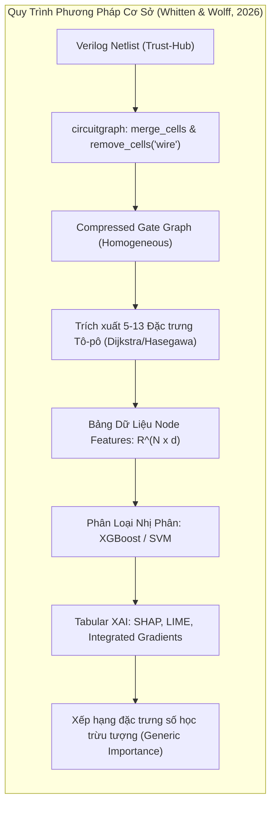
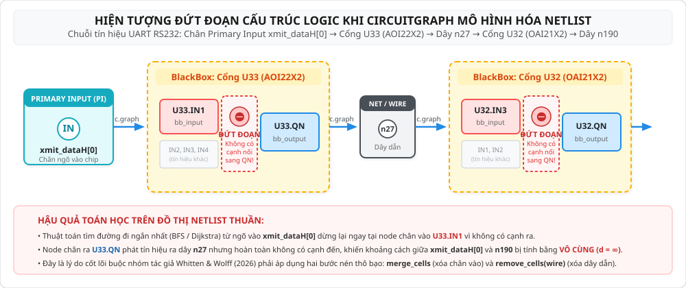
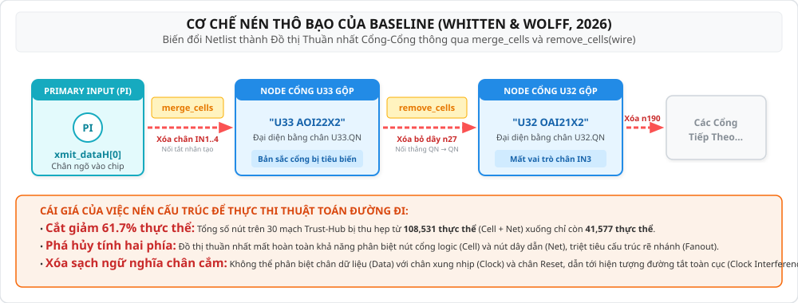
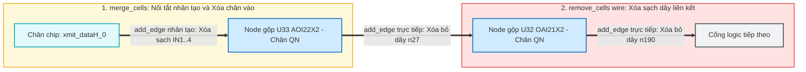
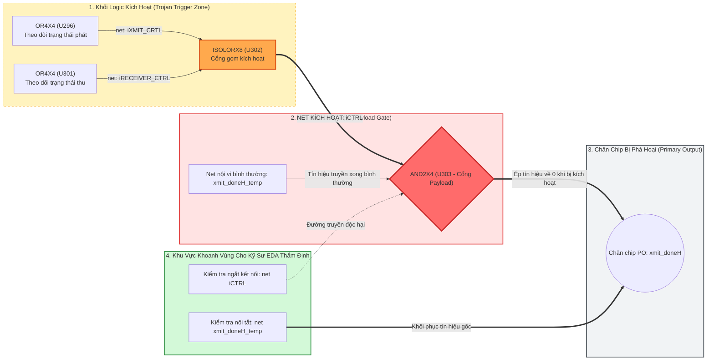

# BẢN THẢO NGHIÊN CỨU TOÀN DIỆN LUẬN VĂN THẠC SĨ (RESEARCH STORY)
## Phương Pháp Biểu Diễn Đồ Thị Ngữ Nghĩa Hai Phía và Học Máy Quan Hệ Trong Định Vị Mã Độc Phần Cứng Trên Netlist Vi Mạch

* **Đề tài Luận văn (Định hình chính thức):**  
  *Tiếng Việt:* **Biểu diễn Đồ thị Ngữ nghĩa và Học Đồ thị phục vụ Phát hiện Mã độc Phần cứng trên Netlist Vi mạch**  
  *Tiếng Anh:* **Semantic Graph Representation and Graph Learning for Hardware Trojan Detection in Gate-Level Netlists**  
* **Học viên thực hiện:** Trần Tấn Đạt  

---

## MỤC LỤC CHI TIẾT

1. [Chương 1: Khởi Nguồn Bài Toán & Giải Phẫu Phương Pháp Cơ Sở (Baseline)](#chương-1-khởi-nguồn-bài-toán--giải-phẫu-phương-pháp-cơ-sở-baseline)
   * 1.1. Bối cảnh an ninh vi mạch & Hiểm họa Hardware Trojan mức Netlist
   * 1.2. Phân tích phương pháp cơ sở (Whitten & Wolff, 2026)
   * 1.3. Cơ chế dựng graph của Baseline trên mạch UART RS232: Từ hiện tượng tắc nghẽn của CircuitGraph đến can thiệp nén thô bạo
   * 1.4. Bốn giới hạn cấu trúc bản chất của biểu diễn nén phẳng
   * 1.5. Nghịch lý đánh giá In-Distribution & Phát hiện hiện tượng sụp đổ ngoại suy LOFO (LOFO Collapse)
   * 1.6. Ba khoảng trống nghiên cứu & Hệ thống câu hỏi nghiên cứu (RQ1, RQ1b, RQ2, RQ3)
2. [Chương 2: Tổng Quan Tiến Hóa Của Y Văn Quốc Tế (2016 – 2026)](#chương-2-tổng-quan-tiến-hóa-của-y-văn-quốc-tế-2016--2026)
   * 2.1. Kỷ nguyên học máy dạng bảng & Đặc trưng tô-pô thủ công (2016 – 2021)
   * 2.2. Trục chuyển dịch sang biểu diễn đồ thị & Graph Neural Networks (2021 – 2026)
   * 2.3. Thách thức khái quát hóa ngoại suy (OOD Shift & Cross-Design Generalization)
   * 2.4. Trục chuyển dịch về tính hành động được & Graph XAI
   * 2.5. Ma trận đối chuẩn đề tài với y văn quốc tế
3. [Chương 3: Đề Xuất Biểu Diễn Đồ Thị Ngữ Nghĩa Hai Phía (Semantic Graph IR)](#chương-3-đề-xuất-biểu-diễn-đồ-thị-ngữ-nghĩa-hai-phía-semantic-graph-ir)
   * 3.1. Hình thức hóa toán học đồ thị hai phía dị thể
   * 3.2. Sáu loại quan hệ cạnh canonical & Phân loại ngữ nghĩa chân cổng
   * 3.3. Thuật toán cô lập luồng dữ liệu $G_{\text{data}}$ qua BFS
   * 3.4. Hệ thống 18 nhóm đặc trưng (34D Cell, 20D Net) & Kiểm toán chống rò rỉ dữ liệu
   * 3.5. Kiểm toán tính toàn vẹn bộ dữ liệu 30 vi mạch Trust-Hub
4. [Chương 4: Kiến Trúc Học Máy Quan Hệ `HeteroTrojanGNN` & Quy Trình Thực Nghiệm](#chương-4-kiến-trúc-học-máy-quan-hệ-heterotrojangnn--quy-trình-thực-nghiệm)
   * 4.1. Thiết kế kiến trúc `HeteroTrojanGNN`
   * 4.2. Khung đánh giá đóng băng & Quy trình dò ngưỡng quyết định $\tau^*$ độc lập
   * 4.3. Hệ thống các thước đo đánh giá đa chiều cho dữ liệu mất cân bằng cực đoan (0.78%)
5. [Chương 5: Thực Nghiệm Đối Chứng Đầy Đủ (Configs A–F) & Câu Chuyện Nghiên Cứu Mới Từ Dữ Liệu](#chương-5-thực-nghiệm-đối-chứng-đầy-đủ-configs-a-f--câu-chuyện-nghiên-cứu-mới-từ-dữ-liệu)
   * 5.1. Thiết kế 6 cấu hình đối chứng (A–F) qua 30 lượt chạy độc lập
   * 5.2. Bảng tổng hợp kết quả vĩ mô & Ma trận phân bố theo 5 họ vi mạch
   * 5.3. Bóc tách RQ1: Hiện tượng phủ định trực giác ban đầu (A vs B) & Bản chất của biểu diễn hai phía
   * 5.4. Bóc tách RQ1b: Lan truyền dị thể phục hồi hiệu năng (B vs C)
   * 5.5. Bóc tách RQ2 & RQ3: Phân tích ma trận giai thừa $2 \times 2$ (Control $\times$ Features)
   * 5.6. Động học giữa PR-AUC và $F_1$: Vì sao không thể kết luận đơn giản F là "tốt nhất"?
6. [Chương 6: Bản Chất Phương Pháp Luận Của XAI & Vai Trò Hỗ Trợ Kỹ Sư EDA](#chương-6-bản-chất-phương-pháp-luận-của-xai--vai-trò-hỗ-trợ-kỹ-sư-eda)
   * 6.1. Khác biệt bản chất về modality: Tabular XAI vs. Graph XAI
   * 6.2. Thuật toán GNNExplainer trên Semantic Graph IR
   * 6.3. Minh họa trường hợp nghiên cứu mạch UART `RS232-T1000` & Bằng chứng suy luận dự đoán
   * 6.4. Định vị đúng mực: Bằng chứng tính toán cho kỹ sư, không phải công cụ ECO tự động
7. [Chương 7: Rủi Ro Hiệu Lực (Threats to Validity) & Lộ Trình Triển Khai Ưu Tiên](#chương-7-rủi-ro-hiệu-lực-threats-to-validity--lộ-trình-triển-khai-ưu-tiên)
   * 7.1. Bốn rủi ro hiệu lực cần thừa nhận minh bạch
   * 7.2. Lộ trình 5 bước hành động ưu tiên hoàn thiện luận văn
8. [Danh Mục Tài Liệu Tham Khảo (References)](#danh-mục-tài-liệu-tham-khảo-references)

---

## Chương 1: Khởi Nguồn Bài Toán & Giải Phẫu Phương Pháp Cơ Sở (Baseline)

### 1.1. Bối Cảnh An Ninh Vi Mạch & Hiểm Họa Hardware Trojan Mức Netlist
Sự bùng nổ của các hệ thống tính toán hiệu năng cao, trí tuệ nhân tạo và thiết bị Internet vạn vật (IoT) đã thúc đẩy ngành công nghiệp bán dẫn chuyển dịch mạnh mẽ sang mô hình toàn cầu hóa phân tán. Phần lớn các công ty vi mạch hiện đại hoạt động theo mô hình không có nhà máy chế tạo (Fabless), buộc phải thuê các xưởng đúc bán dẫn bên ngoài (Foundry) hoặc mua các khối Sở hữu Trí tuệ (3rd-Party Intellectual Property - 3PIP) để rút ngắn thời gian đưa sản phẩm ra thị trường. Mô hình này làm nảy sinh lỗ hổng bảo mật nghiêm trọng trong chuỗi cung ứng: các xưởng đúc hoặc nhà cung cấp IP không tin cậy hoàn toàn có khả năng can thiệp chỉnh sửa cấu trúc vi mạch để cài cắm **Mã độc Phần cứng (Hardware Trojan - HT)**.

Một Hardware Trojan điển hình trên Netlist mức cổng logic (Gate-Level Netlist) gồm hai khối cơ bản:
* **Khối Kích Hoạt (Trigger):** Thường là một chuỗi logic tuần tự (Sequential Trigger) hoặc tổ hợp (Combinational Trigger) theo dõi các trạng thái hiếm gặp (rare internal circuit conditions). Do xác suất kích hoạt cực thấp ($P < 10^{-6}$), Trigger hoàn toàn vô hình trước các phương pháp kiểm thử chức năng truyền thống (Functional Testing / ATPG).
* **Khối Thực Thi Phá Hoại (Payload):** Khi được kích hoạt, Payload sẽ can thiệp vào tín hiệu logic nội vi, làm rò rỉ khóa mã hóa qua các chân xuất dữ liệu (Primary Outputs), gây treo hệ thống (Denial-of-Service) hoặc làm suy giảm tuổi thọ vi mạch.

Việc phát hiện và khoanh vùng các cổng logic thuộc Trojan trước khi xuất dữ liệu mặt nạ quang học (GDSII/OASIS) đi chế tạo là yêu cầu sống còn. Nếu vi mạch bị lỗi được chế tạo hàng loạt, chi phí thu hồi và sản xuất lại mặt nạ (Photomask) có thể lên tới hàng triệu USD.

---

### 1.2. Phân Tích Phương Pháp Cơ Sở (Whitten & Wolff, 2026)
Nghiên cứu xuất phát điểm của luận văn bắt đầu từ việc tái lập và phân tích công trình của nhóm tác giả Paul Whitten, Francis Wolff và Chris Papachristou (Case Western Reserve University - CWRU) được công bố tại NAECON 2024 [[29]](#ref-29), tiền ấn phẩm arXiv:2601.18696, và xuất bản chính thức trên tạp chí *Journal of Electronic Testing (JETTA)* năm 2026 [[30]](#ref-30).



#### Những Gì Phương Pháp Cơ Sở [[30]](#ref-30) Đã Đóng Góp:
1. **Xác Lập Khoảng Trống Về Tính Giải Thích Được (The Explainability Gap):** Whitten & Wolff là một trong những công trình đầu tiên đặt câu hỏi có tính ứng dụng thực tiễn cao: *Các phương pháp XAI hiện nay đóng góp được gì cho kỹ sư an ninh vi mạch trong việc kiểm tra (validation) và khắc phục (remediation) mã độc phần cứng?* [[30]](#ref-30). Tác giả chỉ ra rằng trước công trình này, y văn XAI cho Hardware Trojan hầu như thiếu vắng các so sánh có hệ thống ở mức gate-level netlist giữa ba trường phái giải thích: Phân tích thuộc tính hướng miền (domain-aware property analysis), Suy luận dựa trên ca điển hình (case-based reasoning - CBR), và Gán độ quan trọng đặc trưng (feature attribution như SHAP, LIME, Integrated Gradients).
2. **Chỉ Ra Hạn Chế Căn Bản Của Generic Feature Attribution:** Whitten & Wolff chứng minh rằng các công cụ phổ biến như SHAP và LIME chỉ cung cấp các điểm số quan trọng trừu tượng trong không gian vector số học [[30]](#ref-30). Chúng hoàn toàn thiếu vắng ngữ cảnh mạch: kỹ sư phần cứng nhìn vào giá trị $\text{SHAP}(LGFi) = +0.45$ không thể biết chính xác dây dẫn nào hay cổng logic nào chịu trách nhiệm cho hành vi độc hại để sửa mạch.
3. **Ưu Thế Bổ Trợ Của CBR và Domain-Aware:** Kết quả của bài báo cho thấy phương pháp phân tích thuộc tính hướng miền và suy luận theo ca điển hình có tính bổ trợ cao trong việc hỗ trợ người thẩm định vi mạch, trong khi SHAP/LIME chỉ đạt mức tương hợp vừa phải và không phản ánh cấu trúc mạch [[30]](#ref-30).
4. **Chuẩn Hóa Bộ Đặc Trưng Tô-pô Cổ Điển:** Sử dụng tập dữ liệu Trust-Hub Benchmark với mô hình phân loại XGBoost và bộ 5 đặc trưng tô-pô do Hasegawa et al. [[6]](#ref-6), [[7]](#ref-7) đề xuất:
   - $LGFi$ (*Logic Gate Fan-in level 2*): Số lượng cổng logic nằm trong phạm vi 2 bước nhảy ngược dòng.
   - $ffi$ (*Flip-Flop input distance*): Khoảng cách bước nhảy ngắn nhất tới Flip-Flop ngõ vào gần nhất.
   - $ffo$ (*Flip-Flop output distance*): Khoảng cách bước nhảy ngắn nhất tới Flip-Flop ngõ ra gần nhất.
   - $PI$ (*Primary Input distance*): Khoảng cách bước nhảy ngắn nhất từ các chân nhập chính của chip.
   - $PO$ (*Primary Output distance*): Khoảng cách bước nhảy ngắn nhất tới các chân xuất chính của chip.

---

### 1.3. Cơ Chế Dựng Graph Của Baseline Trên Mạch UART RS232: Từ Hiện Tượng Tắc Nghẽn Của CircuitGraph Đến Can Thiệp Nén Thô Bạo

Để hiểu rõ nguyên nhân gốc rễ của những giới hạn trong Baseline, hãy xét một chuỗi truyền tín hiệu mẫu trong file netlist UART (`RS232-T1000` 90nm) gồm 1 chân đầu vào chính (`xmit_dataH[0]`) đi qua 2 cổng logic liên tiếp (`U33` và `U32`):

```verilog
// 1. Chân ngõ vào chính của chip UART (Primary Input)
input [7:0] xmit_dataH;

// 2. Cổng logic thứ nhất (U33 - loại AOI22X2):
AOI22X2 U33 ( 
    .IN1(xmit_dataH[0]),   // Tín hiệu vào từ chân chip
    .IN2(n28), 
    .IN3(iXMIT_xmit_ShiftRegH_1_), 
    .IN4(n29), 
    .QN(n27)              // Xuất ra dây liên kết logic n27
);

// 3. Cổng logic thứ hai (U32 - loại OAI21X2):
OAI21X2 U32 ( 
    .IN1(n257), 
    .IN2(n26), 
    .IN3(n27),             // Nhận dây n27 từ cổng U33
    .QN(n190)             // Xuất tiếp ra dây n190
);
```

#### Giai đoạn 1: Phân Tích Cú Pháp Qua CircuitGraph - Sự Đứt Đoạn Cấu Trúc
Khi phân tích cú pháp mã nguồn Verilog, thư viện `circuitgraph` xem mỗi cổng logic là một hộp đen (BlackBox) và phân tách linh kiện thành **các node chân cắm con (pin nodes)**:
* Chân vào: tạo các node con `U33.IN1`, `U33.IN2`... (mang thuộc tính `type='bb_input'`).
* Chân ra: tạo node con `U33.QN` (mang thuộc tính `type='bb_output'`).
* Đường dây dẫn tín hiệu (`wire`) được tạo thành một node trung gian: `xmit_dataH[0]` $\to$ `U33.IN1`, và `U33.QN` $\to$ `n27`.

Sự đứt đoạn cấu trúc thể hiện trực quan qua sơ đồ sau:

```mermaid
graph LR
    subgraph Signal_Source ["Ngõ Vào Chính PI"]
        PI["Chân Chip: xmit_dataH_0"]
    end

    subgraph U33_Gate ["BlackBox Cổng U33 AOI22X2"]
        IN1["Chân vào: U33.IN1 - bb_input"]
        GAP1["⛔ NGÕ CỤT: Đứt đoạn logic nội bộ"]
        QN1["Chân ra: U33.QN - bb_output"]
        
        IN1 -.->|BFS tắc nghẽn tại đây| GAP1
        GAP1 -.->|Đứt gãy đường truyền| QN1
    end

    subgraph Interconnect_1 ["Đường Dây Liên Kết Wire"]
        W27["Node Dây Dẫn: n27"]
    end

    subgraph U32_Gate ["BlackBox Cổng U32 OAI21X2"]
        IN3["Chân vào: U32.IN3 - bb_input"]
        GAP2["⛔ NGÕ CỤT: Đứt đoạn logic nội bộ"]
        QN2["Chân ra: U32.QN - bb_output"]
        
        IN3 -.->|BFS tắc nghẽn tiếp| GAP2
        GAP2 -.->|Đứt gãy đường truyền| QN2
    end

    subgraph Interconnect_2 ["Đường Dây Liên Kết Wire"]
        W190["Node Dây Dẫn: n190"]
    end

    PI ==>|Cạnh đồ thị: c.graph| IN1
    QN1 ==>|Cạnh đồ thị: c.graph| W27
    W27 ==>|Cạnh đồ thị: c.graph| IN3
    QN2 ==>|Cạnh đồ thị: c.graph| W190

    style PI fill:#e3fafc,stroke:#15aabf,stroke-width:2px;
    style IN1 fill:#ffe3e3,stroke:#e03131,stroke-width:2px;
    style GAP1 fill:#fff5f5,stroke:#fa5252,stroke-width:2px,stroke-dasharray: 4 4;
    style QN1 fill:#d0ebff,stroke:#1971c2,stroke-width:2px;
    style W27 fill:#f1f3f5,stroke:#495057,stroke-width:2px;
    style IN3 fill:#ffe3e3,stroke:#e03131,stroke-width:2px;
    style GAP2 fill:#fff5f5,stroke:#fa5252,stroke-width:2px,stroke-dasharray: 4 4;
    style QN2 fill:#d0ebff,stroke:#1971c2,stroke-width:2px;
    style W190 fill:#f1f3f5,stroke:#495057,stroke-width:2px;
    style U33_Gate fill:#fff9db,stroke:#f59f00,stroke-width:2px;
    style U32_Gate fill:#fff9db,stroke:#f59f00,stroke-width:2px;
    style Signal_Source fill:#e6fcf5,stroke:#12b886,stroke-width:1.5px;
    style Interconnect_1 fill:#f8f9fa,stroke:#adb5bd,stroke-width:1.5px;
    style Interconnect_2 fill:#f8f9fa,stroke:#adb5bd,stroke-width:1.5px;
```





* **Hiện tượng bế tắc:** Node `U33.IN1` nhận tín hiệu nhưng không có cạnh đi tiếp. Node `U33.QN` phát tín hiệu nhưng không có cạnh đi vào. Giữa `U33.IN1` và `U33.QN` bên trong BlackBox **hoàn toàn không có cạnh nối**.
* **Hậu quả:** Khi thuật toán tìm đường đi ngắn nhất (BFS/Dijkstra) chạy từ `xmit_dataH[0]`, nó dừng lại ngay tại `U33.IN1` và kết luận khoảng cách tới `n190` bằng $\infty$ (không có đường đi).

#### Giai đoạn 2: Cách Baseline Can Thiệp Nén Thô Bạo Để Chạy Thuật Toán
Để khắc phục ngõ cụt trên, phương pháp cơ sở áp dụng 2 bước tiền xử lý nén thô bạo:
1. **Bước `merge_cells`:** 
   - Kéo mũi tên nhân tạo từ nguồn ngõ vào cắm thẳng vào node chân ra: `c.graph.add_edge('xmit_dataH[0]', 'U33.QN')`.
   - **Xóa bỏ toàn bộ các node chân vào** `U33.IN1..4` (`c.graph.remove_node(N_in)`).
   - Gán nhãn node `U33.QN` thành `label = "U33 AOI22X2"`. Cả cổng logic lúc này bị đại diện bằng chính node chân output của nó.
2. **Bước `remove_cells(['wire'])`:** 
   - **Xóa bỏ hoàn toàn node dây `n27`**.
   - Kéo mũi tên thẳng từ chân output cổng trước sang chân output cổng sau: `c.graph.add_edge('U33.QN', 'U32.QN')`.

**Kết quả đồ thị Baseline thu được sau khi nén:**





Quy trình này giúp thuật toán đường đi ngắn nhất hoạt động được, nhưng đã **làm nén cấu trúc mạch quá mức**: tổng số thực thể đồ thị trên toàn benchmark bị cắt giảm từ **108,531 thực thể xuống chỉ còn 41,577 thực thể**.

---

### 1.4. Bốn Giới Hạn Cấu Trúc Bản Chất Của Biểu Diễn Nén Phẳng
1. **Mất Bản Sắc Thực Thể Cổng Logic (Cell Instance Identity):** Bản thân cổng logic không tồn tại độc lập mà bị gộp vào chân output. Với Flip-Flop có hai ngõ ra (`Q` và `QN`), hàm `merge_cells` chỉ kết nối vào chân `.QN`, làm mất tính đối xứng tự nhiên của phần tử tuần tự.
2. **Xóa Bỏ Hoàn Toàn Ngữ Nghĩa Chân Cổng (Port/Pin Semantics):** Việc xóa bỏ các node chân vào khiến đồ thị không phân biệt được vai trò chức năng: cạnh xung nhịp (`CLK`), cạnh reset (`RSTB`), và cạnh dữ liệu (`D`) đi vào Flip-Flop đều bị đồng nhất thành các liên kết không mang nhãn.
3. **Mất Cấu Trúc Hai Phía & Che Khuất Phân Nhánh Logic (Fanout):** Xóa bỏ các node dây liên kết (`Net`) phá vỡ tính chất đồ thị hai phía (`Cell <-> Net`), làm biến mất thông tin phân nhánh tải logic giữa các cổng.
4. **Hiện Tượng Đường Tắt Do Mạng Điều Khiển Toàn Cục (Clock/Reset Interference):** Mạng xung nhịp `sys_clk` kết nối tới toàn bộ Flip-Flop trong chip. Khi `sys_clk` nối thẳng vào các chân output của Flip-Flop, mạng xung nhịp tạo thành các đường tắt liên kết 1-hop hoặc 2-hop giữa hầu hết mọi vùng mạch, làm sai lệch phân phối khoảng cách logic.

---

### 1.5. Nghịch Lý Đánh Giá In-Distribution & Phát Hiện Hiện Tượng Sụp Đổ Ngoại Suy LOFO (LOFO Collapse)

Trong thử nghiệm phân chia ngẫu nhiên (In-Distribution Stratified Split 80/20), mô hình XGBoost của Baseline đạt kết quả rất cao: $F_1 \approx 0.75 - 0.92$ và ROC-AUC $\approx 0.95 - 0.99$. Tuy nhiên, khi chuyển sang kịch bản kiểm thử ngoại suy liên họ vi mạch (**Leave-One-Family-Out - LOFO Cross-Validation**), hiện tượng sụp đổ hoàn toàn xuất hiện:

| Mô Hình Dạng Bảng (XGBoost) | In-Distribution $F_1$ (10 Seeds) | In-Dist ROC-AUC | LOFO Micro $F_1$ | LOFO Macro $F_1$ | Trạng Thái Ngoại Suy |
| :--- | :---: | :---: | :---: | :---: | :--- |
| **5 Đặc trưng Hasegawa Cơ bản** [[6]](#ref-6), [[30]](#ref-30) | $0.6569 \pm 0.0399$ | $0.9515 \pm 0.0083$ | $0.0212$ | **0.0300** | ❌ Sụp đổ hoàn toàn về 0 |
| **13 Đặc trưng Tô-pô Đầy đủ** [[30]](#ref-30) | $\mathbf{0.9277 \pm 0.0322}$ | $\mathbf{0.9980 \pm 0.0015}$ | $0.1252$ | **0.1773** | ❌ Học vẹt tọa độ mạch chủ |

#### Bản Chất Của Sự Sụp Đổ: Hiện Tượng "Học Vẹt Tọa Độ Mạch Chủ" (Coordinate Memorization)
* Trong tập dữ liệu Trust-Hub, họ vi mạch `RS232` chiếm tới 22/30 vi mạch, cùng chia sẻ chung một cấu trúc mạch chủ UART.
* Khi phân chia ngẫu nhiên cùng phân phối, các cổng của cùng một mạch chủ xuất hiện ở cả Train và Test. Bộ đặc trưng khoảng cách toàn cục ($ffi, ffo, PI, PO$) đóng vai trò như "tọa độ không gian" của mạch UART. Cây quyết định XGBoost ghi nhớ chính xác tọa độ của cụm Trojan trên RS232.
* Khi kiểm thử LOFO sang một họ vi mạch có cấu trúc hoàn toàn khác (ví dụ: khối xử lý 32-bit `s35932` có 1,728 Flip-Flop so với 35 Flip-Flop của `RS232`), phân phối khoảng cách bị trôi lệch nghiêm trọng (domain shift). Mô hình sụp đổ hoàn toàn, với Recall trên RS232 chỉ đạt $2.09\%$ (bỏ sót 234/239 cổng Trojan).
* Phát hiện này khẳng định: **Đặc trưng số học dạng bảng không có khả năng tổng quát hóa ngoại suy liên họ vi mạch.**

---

### 1.6. Ba Khoảng Trống Nghiên Cứu & Hệ Thống Câu Hỏi Nghiên Cứu

Từ phân tích giải phẫu phương pháp cơ sở và hiện tượng sụp đổ LOFO, đề tài xác lập 3 khoảng trống nghiên cứu cốt lõi:
* **Khoảng trống 1 (Về khả năng ngoại suy sang chip mới):** Mô hình dạng bảng chỉ học vẹt tọa độ và sụp đổ hoàn toàn khi gặp họ chip mới. Cần một cơ chế học biểu diễn nắm bắt được các mẫu hình kết nối logic bất biến giữa các vi mạch.
* **Khoảng trống 2 (Về biểu diễn đồ thị & Ngữ nghĩa chân cắm):** Cách nén phẳng cũ xóa bỏ toàn bộ dây dẫn và chân cắm, làm mất cấu trúc hai phía và gây nhiễu loạn đường đi logic. Cần một đồ thị trung gian chuẩn hóa bảo tồn đầy đủ linh kiện và bản chất liên kết.
* **Khoảng trống 3 (Về tính ứng dụng thực tế của lời giải thích XAI):** Các công cụ XAI dạng bảng (SHAP, LIME) chỉ cho ra con số điểm trừu tượng mà không chỉ ra được vị trí mạch. Kỹ sư cần một đồ thị con cụ thể khoanh vùng đúng linh kiện độc hại để kiểm tra.

#### Hệ Thống Câu Hỏi Nghiên Cứu Trọng Tâm:

Để trả lời có hệ thống cho 3 khoảng trống trên, luận văn thiết kế 4 câu hỏi nghiên cứu chính (RQ1, RQ1b, RQ2, RQ3) và 1 câu hỏi mở rộng về tính giải thích (Secondary Question), được cấu trúc theo đúng các bước thử nghiệm trong phòng thí nghiệm:

* **RQ1 (Hiệu ứng giữ lại dây dẫn - Giữ dây hay Xóa dây?):**  
  * *Bản chất câu hỏi:* **Nếu ta giữ lại các đường dây liên kết (Net) đúng như cấu trúc mạch thực tế thay vì xóa bỏ chúng đi như phương pháp cũ, thì độ chính xác phát hiện Trojan của mô hình GNN thay đổi như thế nào?**  
  * *Thực nghiệm kiểm chứng:* So sánh **Config A** (Xóa sạch dây, chỉ giữ cổng logic) với **Config B** (Giữ cả cổng và dây, cùng chạy trên mô hình GNN thuần nhất).

* **RQ1b (Hiệu ứng phân loại quan hệ - Coi mọi kết nối như nhau hay Dạy AI phân biệt từng loại liên kết?):**  
  * *Bản chất câu hỏi:* **Khi đã giữ lại cả Cổng và Dây, việc dạy cho AI phân biệt rõ từng loại liên kết (chiều truyền tín hiệu, chân ngõ vào/ngõ ra) bằng GNN dị thể (Hetero-GNN) có giúp cải thiện độ chính xác so với việc xem mọi kết nối là như nhau hay không?**  
  * *Thực nghiệm kiểm chứng:* So sánh **Config B** (Coi mọi nút và cạnh như nhau) với **Config C** (Phân loại rõ 6 loại quan hệ Cổng–Dây bằng Hetero-GNN).

* **RQ2 (Hiệu ứng dây điều khiển toàn cục - Dây xung nhịp clock và reset dùng chung toàn chip giúp ích hay gây nhiễu?):**  
  * *Bản chất câu hỏi:* **Các đường dây điều khiển dùng chung toàn chip (như xung nhịp clock và reset) giúp AI nhận diện Trojan tốt hơn hay ngược lại, làm AI bị "nhiễu" và đoán sai khi đem sang kiểm tra trên các họ vi mạch hoàn toàn mới?**  
  * *Thực nghiệm kiểm chứng:* So sánh mô hình giữ nguyên dây điều khiển (**Config C, E**) với mô hình ngắt bỏ dây điều khiển (**Config D, F**) khi kiểm thử ngoại suy liên họ (LOFO).

* **RQ3 (Đánh giá đóng góp từng thành phần - Yếu tố nào đóng góp chính và có mang lại hiệu quả cộng hưởng không?):**  
  * *Bản chất câu hỏi:* **Trong hai cải tiến chính của đề tài (ngắt dây điều khiển xung nhịp và bổ sung 8 đặc trưng cấu trúc tô-pô mới), yếu tố nào đóng góp nhiều hơn vào hiệu năng, và khi kết hợp cả hai thì chúng có mang lại hiệu quả cộng hưởng tối ưu hay không?**  
  * *Thực nghiệm kiểm chứng:* Phân tích ma trận giai thừa $2 \times 2$ gồm 4 cấu hình: **Config C** (Bật điều khiển, 5 đặc trưng) vs. **Config D** (Ngắt điều khiển, 5 đặc trưng) vs. **Config E** (Bật điều khiển, 13 đặc trưng) vs. **Config F** (Ngắt điều khiển, 13 đặc trưng).

* **Secondary Question (Khác biệt thực tế giữa XAI dạng bảng và XAI đồ thị):**  
  * *Bản chất câu hỏi:* **Phương pháp giải thích đồ thị (Graph XAI) mang lại lợi thế thực tế gì hơn so với các phương pháp giải thích dạng bảng truyền thống (SHAP/LIME) trong việc giúp kỹ sư vi mạch định vị và khoanh vùng linh kiện nghi ngờ?**  
  * *Thực nghiệm kiểm chứng:* So sánh giữa việc chỉ xuất ra điểm số quan trọng trừu tượng (Tabular XAI) với việc trích xuất được một cụm mạch con cụ thể gồm đúng các cổng và dây dẫn liên quan (Graph XAI) để kỹ sư EDA thẩm định.

#### Bảng Tóm Tắt Ý Nghĩa Thực Tế Của Các Câu Hỏi Nghiên Cứu:

| Câu Hỏi | Tên Khoa Học | Vấn Đề Thực Tế Cần Trả Lời Trong Mạch Điện | Cặp Đối Chứng Thực Nghiệm |
| :---: | :--- | :--- | :---: |
| **RQ1** | *Representation Effect* | Giữ lại các đường dây dẫn (Net) hay xóa bỏ để nén phẳng? | Config A vs Config B |
| **RQ1b** | *Relation Modeling Effect* | Dạy AI phân biệt từng loại dây/chân cắm (Hetero) hay coi như nhau (Homo)? | Config B vs Config C |
| **RQ2** | *Control Relations Effect* | Đường dây xung nhịp/reset nối chung toàn chip gây nhiễu AI ra sao? | (C, E) vs (D, F) |
| **RQ3** | *Component Attribution* | Ngắt dây xung nhịp hay Thêm đặc trưng mới đóng góp chính? Có cộng hưởng không? | Ma trận $2 \times 2$ (C, D, E, F) |
| **XAI** | *Explainability Modality* | AI chỉ ra con số điểm trừu tượng (SHAP) hay khoanh vùng mạch con cụ thể (GNNExplainer)? | Tabular XAI vs Graph XAI |

---

## Chương 2: Tổng Quan Tiến Hóa Của Y Văn Quốc Tế (2016 – 2026)

Khảo cứu 44 công trình quốc tế từ 2016 đến 2026 chỉ ra 3 trục chuyển dịch lớn trong cộng đồng an ninh phần cứng:

| Giai Đoạn | Hướng Tiếp Cận Đại Diện | Đóng Góp & Công Trình Tiêu Biểu |
| :--- | :--- | :--- |
| **2016 – 2020: Tabular ML** | Đặc trưng tô-pô thủ công, khoảng cách logic, phân loại SVM/XGBoost | Hasegawa et al. [[6]](#ref-6), [[7]](#ref-7); Độ trung tâm mạch (NetworkX) |
| **2021 – 2023: Graph Learning** | RTL/Netlist sang DFG/AST, GNN thuần nhất, lấy mẫu cảm ứng | HW2VEC [[38]](#ref-38); GNN4TJ/GNN4HT [[35]](#ref-35), [[36]](#ref-36); Node-wise GNN [[7]](#ref-7); Unioned GNN [[19]](#ref-19); BGNN-HT [[40]](#ref-40); FAST-GO [[10]](#ref-10); TrojanSAINT [[12]](#ref-12); BiGNN [[3]](#ref-3); PoisonedGNN [[2]](#ref-2) |
| **2024 – 2026: Semantic & Actionable XAI** | Đồ thị con giải thích, phân tách ngữ nghĩa cạnh, OOD Benchmarking | TrojanHound [[9]](#ref-9); Causality Graph XAI [[1]](#ref-1); MultiSAINT [[34]](#ref-34); NetLossBench [[4]](#ref-4); GREAT [[14]](#ref-14); B-HTRecognizer [[42]](#ref-42); GNN-MFF [[41]](#ref-41); TROJAN-GUARD [[26]](#ref-26); Whitten & Wolff [[30]](#ref-30) |
| **2026 (Đề tài Luận văn)** | **Hetero Graph IR + Relational GNN + Multi-Criteria Subgraph XAI for EDA** | **Khắc phục sụp đổ LOFO, cô lập $G_{\text{data}}$, bảo toàn đặc tính cục bộ Trojan** |

### 2.1. Kỷ Nguyên Học Máy Dạng Bảng & Đặc Trưng Tô-pô Thủ Công (2016 – 2021)
* **Đặc trưng Hasegawa (Hasegawa et al., 2016, 2017, 2021) [[6]](#ref-6), [[7]](#ref-7):** Tiên phong đề xuất bộ 5 đặc trưng khoảng cách bước nhảy logic ($LGFi, ffi, ffo, PI, PO$) đưa vào bộ phân loại SVM/Random Forest.
* **Mở rộng đặc trưng toàn cục qua NetworkX:** Bổ sung bậc vào/ra, độ trung tâm trung gian (Betweenness), độ trung tâm gần (Closeness), hệ số phân cụm (Clustering), PageRank.
* **Kết hợp SCOAP & Tabular XAI (Sharma et al., 2023 [[23]](#ref-23); Sneha & Devi, 2025 [[24]](#ref-24); Pan et al., 2025 [[20]](#ref-20)):** Sử dụng chỉ số kiểm soát/quan sát SCOAP kết hợp LightGBM/XGBoost và dùng SHAP để giải thích.
* **Giới hạn cố hữu:** Phụ thuộc thiết kế thủ công, chi phí tính đường đi ngắn nhất lớn ($O(V \cdot E)$), và bị "mù không gian" (spatial blindness) — không cung cấp được thông tin cấu trúc kết nối láng giềng.

### 2.2. Trục Chuyển Dịch Sang Biểu Diễn Đồ Thị & Graph Neural Networks (2021 – 2026)
* **Công cụ nền tảng (Yu et al., HOST 2021 - HW2VEC [[38]](#ref-38); Yasaei et al., DATE 2021, TCAD 2022 - GNN4TJ [[35]](#ref-35), [[36]](#ref-36)):** Thiết lập quy trình chuyển đổi tự động RTL/Netlist sang DFG/AST và ứng dụng GNN để học biểu diễn bản địa của vi mạch mà không cần mạch tham chiếu chuẩn (Golden Reference).
* **Các bộ dò Gate-Level GNN tiên tiến:**
  - *Hasegawa et al. (IEEE Trans. Computers, 2021) [[7]](#ref-7):* Bài toán phát hiện Trojan ở cấp độ từng cổng logic (Node-wise HT Detection).
  - *Unioned GNN (Pan et al., 2023) [[19]](#ref-19), BGNN-HT (Zhan et al., ISCAS 2023) [[40]](#ref-40), & Cheng et al. (2023) [[3]](#ref-3):* GNN hai chiều (Bidirectional GNN) nắm bắt dòng tín hiệu xuôi (fanout) và ngược (fanin).
  - *TrojanSAINT (Lashen et al., ISCAS 2023) [[12]](#ref-12), FAST-GO (Imangholi et al., ISQED 2024) [[10]](#ref-10), & TROJAN-GUARD (Thorat et al., IEEE IJCNN 2025) [[26]](#ref-26):* Kỹ thuật lấy mẫu đồ thị cảm ứng (inductive graph sampling) giúp xử lý netlist và mô hình thiết kế RTL quy mô lớn.
  - *GREAT (Li et al., DSN 2025) [[14]](#ref-14), Li et al. (IEEE TC 2025) [[13]](#ref-13), TrojanSDF (Jiang et al., SPIE 2025) [[11]](#ref-11), & HTs-GCN (Xiao et al., IEEE TCAD 2025) [[32]](#ref-32):* Cơ chế Edge-Attention kết hợp phân phối trạng thái (state distribution) và biểu diễn toàn cục nhận diện Trojan phân tán.
  - *GNN-MFF (Zhang et al., 2025) [[41]](#ref-41), B-HTRecognizer (Zhang et al., IEEE TCAD 2025) [[42]](#ref-42), & N et al. (IEEE DISCOVER 2025) [[18]](#ref-18):* Nhận định việc chỉ xem netlist là đồ thị thuần nhất (homogeneous graph) đã chạm ngưỡng giới hạn; tương lai phải là giữ lại ngữ nghĩa chân cổng và phân loại quan hệ cạnh (edge typing). Đồng thời, Alrahis et al. (IEEE TC 2023 - PoisonedGNN) [[2]](#ref-2) cảnh báo tính dễ bị tấn công đầu độc nếu bộ trích xuất đồ thị không kiểm soát chặt chẽ quan hệ cấu trúc.

### 2.3. Thách Thức Khái Quát Hóa Ngoại Suy (OOD Shift & Cross-Design Generalization)
* Nhiều nghiên cứu độc lập xác nhận mô hình học máy vi mạch suy giảm nghiêm trọng khi kiểm thử ngoài phân phối: Tiempo & Jeong (IEICE 2024 - FP-GNN) [[27]](#ref-27), Hassan et al. (IEEE TCAD 2023 - Topology-Aware Vaccination) [[8]](#ref-8), Yanti et al. (IEEE Access 2026 - MultiSAINT) [[34]](#ref-34), Dai et al. (GLSVLSI 2026 - NetLossBench) [[4]](#ref-4), Sarower et al. (IEEE Access 2026 - Circuits as Graphs) [[22]](#ref-22), và Yan et al. (IEEE TDSC 2025) [[33]](#ref-33) về việc suy giảm hiệu năng khi netlist bị khuyết thiếu hoặc kiểm thử trên các họ mạch chưa từng thấy trong quá trình huấn luyện.
* Điều này củng cố trực tiếp phát hiện thực nghiệm của đề tài: Các đặc trưng khoảng cách toàn cục khiến mô hình học vẹt tọa độ chip, trong khi GNN với cơ chế lan truyền quan hệ học được các mẫu hình cấu trúc cục bộ bất biến.

### 2.4. Trục Chuyển Dịch Về Tính Hành Động Được & Graph XAI
* **Sự phát triển của Graph XAI tổng quát:** GNNExplainer (Ying et al., NeurIPS 2019) [[37]](#ref-37), PGExplainer (Luo et al., NeurIPS 2020) [[16]](#ref-16), SubgraphX (Yuan et al., ICML 2021) [[39]](#ref-39), CF-GNNExplainer (Lucic et al., AISTATS 2021) [[15]](#ref-15), RCExplainer (Wang et al., IEEE TPAMI 2022) [[28]](#ref-28), và Zhang et al. (2026) [[43]](#ref-43) chứng minh lời giải thích có ý nghĩa trên đồ thị phải là một **đồ thị con nhỏ gọn (compact explanatory subgraph)** có khả năng khái quát hóa OOD vững chắc.
* **Graph XAI trong an ninh phần cứng:** Wu et al. (ICCAD 2023) [[31]](#ref-31), Su et al. (IEEE TCAD 2025) [[25]](#ref-25), TrojanHound (Hu et al., IEICE 2025) [[9]](#ref-9), Abdelnaby (Symmetry 2026) [[1]](#ref-1), và Mukherjee et al. (2023) [[17]](#ref-17) ứng dụng giải thích đồ thị để cô lập mạch con quyết định và trích xuất dấu vết tấn công.
* **Thước đo đánh giá XAI chuẩn mực:** $\text{Fidelity}^+$ (Độ cần thiết), $\text{Fidelity}^-$ (Độ đầy đủ) [[44]](#ref-44), và $\text{Sparsity}$ (Độ thưa) [[5]](#ref-5), [[21]](#ref-21).

### 2.5. Ma Trận Đối Chuẩn Đề Tài Với Y Văn Quốc Tế

| Hướng Tiếp Cận | Gate-Level Netlist | RTL DFG/AST | OOD / LOFO Shift | Actionability (EDA/ECO) | Scalability (Chip lớn) | Xử Lý Cạnh Clock/Control |
| :--- | :---: | :---: | :---: | :---: | :---: | :---: |
| **Tabular ML + XAI** *(Whitten [[30]](#ref-30), Sharma [[23]](#ref-23))* | Dày | Vừa | ❌ Sụp đổ (0.03 - 0.17) | ❌ Trừu tượng (Mù không gian) | Vừa | Nén phẳng (Clock 1-hop) |
| **Homogeneous GNN** *(GNN4TJ [[35]](#ref-35), Unioned [[19]](#ref-19))* | Dày | Dày | ⚠️ Ô nhiễm vùng tiếp nhận | ❌ Hộp đen (Không có XAI) | Vừa | ⚠️ Không phân loại cạnh |
| **Sampled GNN** *(TrojanSAINT [[12]](#ref-12), FAST-GO [[10]](#ref-10))* | Dày | Thưa | ⚠️ Chưa đánh giá LOFO sâu | ❌ Không có XAI | Dày | ⚠️ Không phân loại cạnh |
| **Graph XAI Sơ khởi** *(Wu [[31]](#ref-31), Hu [[9]](#ref-9), Abdelnaby [[1]](#ref-1))* | Vừa | Thưa | ⚠️ Chủ yếu In-Distribution | ⚠️ Dừng ở mức phân tích | Thưa | ⚠️ Chưa tách $G_{\text{data}}$ |
| **ĐỀ TÀI CỦA BẠN (HeteroTrojanGNN + Graph XAI)** | **Dày (Cell-Net)** | Khả chuyển | ✅ **LOFO Macro F1 = 0.5394** | ✅ **Computational Subgraph** | ✅ Tách quan hệ | ✅ **Cô lập $G_{\text{data}}$ qua BFS** |

---

## Chương 3: Đề Xuất Biểu Diễn Đồ Thị Ngữ Nghĩa Hai Phía (Semantic Graph IR)

### 3.1. Hình Thức Hóa Toán Học Đồ Thị Hai Phía Dị Thể
Mỗi Netlist vi mạch được mô hình hóa thành đồ thị có hướng dị thể:
$$\mathcal{G} = (\mathcal{V}_{\text{cell}}, \mathcal{V}_{\text{net}}, \mathcal{E}, \Phi_{\mathcal{V}}, \Phi_{\mathcal{E}})$$
* **Tập đỉnh hai phía:** $\mathcal{V}_{\text{cell}} \cap \mathcal{V}_{\text{net}} = \emptyset$. Cổng logic (`Cell`) chỉ kết nối với đường liên kết logic (`Net`), phản ánh đúng cấu trúc mạng logic mạch số.
* **Ánh xạ kiểu đỉnh:** $\Phi_{\mathcal{V}}: \mathcal{V} \to \{\text{'cell'}, \text{'net'}\}$.
* **Ánh xạ kiểu cạnh:** $\Phi_{\mathcal{E}}$ định nghĩa 6 loại quan hệ cạnh canonical có hướng:
  1. `('cell', 'outputs', 'net')`: Cổng logic lái tín hiệu ngõ ra lên đường dây liên kết.
  2. `('net', 'data_input', 'cell')`: Đường dây truyền toán hạng dữ liệu vào chân pin ngõ vào (`is_control = 0`).
  3. `('net', 'control_input', 'cell')`: Đường dây truyền tín hiệu điều khiển xung nhịp/reset/enable (`is_control = 1`).
  4. `('net', 'rev_outputs', 'cell')`: Lan truyền ngược từ đường dây về cổng lái ngõ ra.
  5. `('cell', 'rev_data_input', 'net')`: Lan truyền ngược từ cổng nhận dữ liệu về đường dây ngõ vào.
  6. `('cell', 'rev_control_input', 'net')`: Lan truyền ngược từ chân điều khiển về đường dây xung nhịp/reset.

---

### 3.2. Phân Loại Chân Điều Khiển & Đồ Thị Luồng Dữ Liệu $G_{\text{data}}$
* **Quy tắc phân loại:**  
  `CONTROL_PORTS = {'CLK', 'CK', 'RSTB', 'RN', 'SETB', 'SN', 'test_se'}` gắn cờ `is_control = 1`.
* **Đồ thị luồng dữ liệu cô lập $G_{\text{data}}$:**
  $$G_{\text{data}} = \left(\mathcal{V}_{\text{cell}} \cup \mathcal{V}_{\text{net}}, \; \mathcal{E} \setminus \{e \in \mathcal{E} \mid \text{is\_control}(e) = 1\}\right)$$
* **Thuật toán BFS trên đồ thị không trọng số:** Do các cạnh trong netlist logic không có trọng số, thuật toán tìm kiếm theo chiều rộng (**BFS**) được sử dụng để tính toán các bước nhảy logic thực tế. Việc loại bỏ các cạnh xung nhịp toàn cục giúp bảo toàn khoảng cách logic thực tế giữa khối Trigger và cổng Payload.

---

### 3.3. Không Gian Đặc Trưng Đồ Thị & Kiểm Toán Chống Rò Rỉ Dữ Liệu
Không gian vector đầu vào gồm **34 chiều cho nút Cell** và **20 chiều cho nút Net**:

| STT | Tên Đặc Trưng | Node Type | Dim | Định Nghĩa Ngữ Nghĩa | Tính Từ Tô-pô Đồ Thị Cục Bộ? | Cần Học Thống Kê Train? | Dùng Nhãn Trojan? | Chuẩn Hóa |
| :---: | :--- | :---: | :---: | :--- | :---: | :---: | :---: | :--- |
| 1 | `cell_family_onehot` | `cell` | 20 | One-hot họ cổng logic (AND, NAND, OR, DFF...) | Có (Verilog AST) | Không | Không | One-hot ($0/1$) |
| 2 | `is_sequential` | `cell` | 1 | Cờ nhị phân nhận diện phần tử tuần tự (Flip-Flop) | Có (Thư viện cell) | Không | Không | Nhị phân ($0/1$) |
| 3 | `LGFi` | `cell` | 1 | Logic Gate Fan-in (bậc vào của cổng logic) | Có (BFS đồ thị) | Không | Không | StandardScaler fit Train |
| 4 | `ffi` | `cell` | 1 | Bước nhảy ngắn nhất từ Flip-Flop ngõ vào gần nhất qua $G_{\text{data}}$ | Có (BFS đồ thị) | Không | Không | StandardScaler fit Train |
| 5 | `ffo` | `cell` | 1 | Bước nhảy ngắn nhất tới Flip-Flop ngõ ra gần nhất qua $G_{\text{data}}$ | Có (BFS đồ thị) | Không | Không | StandardScaler fit Train |
| 6 | `PI` | `cell` | 1 | Bước nhảy ngắn nhất từ Primary Inputs qua $G_{\text{data}}$ | Có (BFS đồ thị) | Không | Không | StandardScaler fit Train |
| 7 | `PO` | `cell` | 1 | Bước nhảy ngắn nhất tới Primary Outputs qua $G_{\text{data}}$ | Có (BFS đồ thị) | Không | Không | StandardScaler fit Train |
| 8 | `in_degree` | `cell` | 1 | Bậc vào có hướng trên đồ thị hai phía | Có (Bipartite graph) | Không | Không | StandardScaler fit Train |
| 9 | `out_degree` | `cell` | 1 | Bậc ra có hướng (phân nhánh tải logic) | Có (Bipartite graph) | Không | Không | StandardScaler fit Train |
| 10 | `pagerank` | `cell` | 1 | Điểm PageRank luồng dữ liệu trên $G_{\text{data}}$ | Có (NetworkX BFS) | Không | Không | StandardScaler fit Train |
| 11 | `betweenness` | `cell` | 1 | Độ trung tâm trung gian trên $G_{\text{data}}$ | Có (NetworkX BFS) | Không | Không | StandardScaler fit Train |
| 12 | `closeness` | `cell` | 1 | Độ trung tâm gần trên $G_{\text{data}}$ | Có (NetworkX BFS) | Không | Không | StandardScaler fit Train |
| 13 | `clustering` | `cell` | 1 | Hệ số phân cụm trên phép chiếu vô hướng của $G_{\text{data}}$ | Có (NetworkX BFS) | Không | Không | StandardScaler fit Train |
| 14 | `core_number` | `cell` | 1 | Bậc vỏ phân rã $k$-core trên $G_{\text{data}}$ | Có (NetworkX BFS) | Không | Không | StandardScaler fit Train |
| 15 | `logic_depth_ratio` | `cell` | 1 | Tỷ lệ độ sâu logic: $\text{PI} / (\text{PI} + \text{PO} + 10^{-6})$ | Có (BFS đồ thị) | Không | Không | StandardScaler fit Train |
| 16 | `net_type_onehot` | `net` | 6 | One-hot kiểu dây (`wire`, `input`, `output`...) | Có (Verilog AST) | Không | Không | One-hot ($0/1$) |
| 17 | `is_output` | `net` | 1 | Cờ nhị phân xác định dây nối ra chân xuất chip | Có (Top-module AST) | Không | Không | Nhị phân ($0/1$) |
| 18 | `net_topological_metrics` | `net` | 13 | 13 chỉ số tô-pô tính toán cho nút dây dẫn trên $G_{\text{data}}$ | Có (BFS đồ thị) | Không | Không | StandardScaler fit Train |

---

### 3.4. Kiểm Toán Tính Toàn Vẹn Bộ Dữ Liệu 30 Vi Mạch Trust-Hub

* **Tổng quan quy mô:** 47,464 cổng logic (`Cell`), 61,067 đường liên kết (`Net`), 202,415 cạnh có hướng hai phía, 370 cổng Trojan, 47,094 cổng sạch nền.
* **Tỷ lệ Trojan tổng thể:** **0.7795%** (Mất cân bằng dữ liệu cực đoan: $1 : 247$).
* **Phân bố 5 họ vi mạch:**
  - `RS232` (22 mạch): 5,299 cells, 6,257 nets, 243 Trojans ($4.586\%$).
  - `s15850` (1 mạch): 2,182 cells, 2,798 nets, 27 Trojans ($1.237\%$).
  - `s35932` (3 mạch): 16,341 cells, 21,993 nets, 63 Trojans ($0.386\%$).
  - `s38417` (2 mạch): 10,685 cells, 14,091 nets, 27 Trojans ($0.253\%$).
  - `s38584` (2 mạch): 12,957 cells, 15,928 nets, 10 Trojans ($0.077\%$).
* **Ghi nhận minh bạch các điểm bất thường:**
  - `RS232-T1800-90nm`: Mã nguồn netlist Verilog `uart_scan_route.v` không chứa các cổng Trojan `U300..U303` được khai báo trong metadata Trust-Hub (đồ thị có 0 Trojan), trong khi bản 180nm có đủ 4 cổng. Đây là đặc điểm netlist/metadata thượng nguồn và sẽ được đánh giá qua phân tích độ nhạy (sensitivity analysis).
  - Thiếu cổng đệm `U304` ở `T1000-90nm` và `T1500-90nm`: Cổng này vắng mặt trong netlist tổng hợp 90nm phân tích, có thể do công cụ tổng hợp logic tối ưu hóa; việc xác định chính xác biến đổi EDA thượng nguồn cần kiểm chứng thêm log tổng hợp.

---

## Chương 4: Kiến Trúc Học Máy Quan Hệ `HeteroTrojanGNN` & Quy Trình Thực Nghiệm

### 4.1. Thiết Kế Kiến Trúc `HeteroTrojanGNN`
Mô hình gồm 3 khối chức năng thực thi trên PyTorch Geometric (PyG 2.6.1):
1. **Tầng Chiếu Đầu Vào (Projection):** Chiếu vector $x_{\text{cell}} \in \mathbb{R}^{34}$ và $x_{\text{net}} \in \mathbb{R}^{20}$ về không gian ẩn 64 chiều:
   $$h_{\text{cell}}^{(0)} = \text{ReLU}(W_{\text{proj, cell}} \cdot x_{\text{cell}} + b_{\text{proj, cell}}) \in \mathbb{R}^{64}$$
   $$h_{\text{net}}^{(0)} = \text{ReLU}(W_{\text{proj, net}} \cdot x_{\text{net}} + b_{\text{proj, net}}) \in \mathbb{R}^{64}$$
2. **Tầng Tích Chập Dị Thể (HeteroConv SAGEConv, $l \in \{1, 2\}$):**
   Với mỗi loại cạnh $r \in \Phi_{\mathcal{E}}$, toán tử `SAGEConv` tổng hợp thông điệp nội bộ (`aggr='mean'`), sau đó cộng tổng liên quan hệ (`aggr='sum'`):
   $$m_{v, r}^{(l)} = \text{SAGEConv}_{r}\left(\{h_u^{(l-1)} \mid u \in \mathcal{N}_r(v)\}, h_v^{(l-1)}\right)$$
   $$h_v^{(l)} = \text{LayerNorm}\left(h_v^{(l-1)} + \text{Dropout}\left(\text{ReLU}\left(\sum_{r \in \Phi_{\mathcal{E}}} m_{v, r}^{(l)}\right), p=0.2\right)\right)$$
3. **Đầu Phân Loại (MLP Head):**
   $$z_v = W_2 \cdot \text{ReLU}(W_1 \cdot h_v^{(2)} + b_1) + b_2 \in \mathbb{R}^1, \quad \hat{p}_v = \sigma(z_v)$$
   $$\mathcal{L}_{\text{BCE}} = -\frac{1}{N} \sum_{v \in \mathcal{V}_{\text{cell}}} \left[ w_{\text{pos}} \cdot y_v \log(\hat{p}_v) + (1 - y_v) \log(1 - \hat{p}_v) \right], \quad w_{\text{pos}} = \frac{N_{\text{clean}}}{N_{\text{trojan}}}$$

---

### 4.2. Khung Đánh Giá Đóng Băng & Quy Trình Dò Ngưỡng Quyết Định $\tau^*$ Độc Lập
* **Protocol 1: In-Distribution Evaluation (Node-Level Split 60/20/20 across 10 Seeds):**  
  Đo lường năng lực học mẫu trong cùng phân phối. Không khẳng định năng lực tổng quát hóa zero-day.
* **Protocol 2: Leave-One-Family-Out (LOFO Cross-Validation - 5 Folds):**  
  Huấn luyện trên 4 họ vi mạch (85% Train, 15% Validation) và kiểm thử mù trên họ vi mạch còn lại.
* **Thuật toán dò ngưỡng $\tau^*$ độc lập:**
  $$\tau^* = \arg\max_{\tau \in [0.01, 0.99]} F_1(\mathcal{D}_{\text{val}}, \tau)$$
  Ngưỡng $\tau^*$ được quét tìm 100 bước **hoàn toàn trên tập Validation của 4 họ Train**, sau đó áp dụng cố định sang họ Test. Tập Test hoàn toàn không tham gia vào quá trình chọn ngưỡng.

---

### 4.3. Hệ Thống Các Thước Đo Đánh Giá Đa Chiều Cho Dữ Liệu Mất Cân Bằng Cực Đoan
Trong bối cảnh tỷ lệ cổng Trojan chỉ chiếm $0.78\%$, việc chỉ dựa vào diện tích dưới đường cong ROC (ROC-AUC) sẽ gây hiểu lầm nghiêm trọng (vì lượng lớn True Negatives làm chỉ số False Positive Rate luôn rất nhỏ). Nghiên cứu chuẩn hóa hệ thống 6 chỉ số:
1. **$F_1$-Score:** Trung bình điều hòa giữa Precision và Recall tại ngưỡng tối ưu $\tau^*$.
2. **PR-AUC (Average Precision):** Diện tích dưới đường cong Precision-Recall, đánh giá chất lượng xếp hạng xác suất xuyên suốt mọi ngưỡng phân loại.
3. **MCC (Matthews Correlation Coefficient):** Hệ số tương quan tính toán trên cả 4 góc của ma trận nhầm lẫn (TP, FP, FN, TN), là thước đo khắt khe nhất cho bài toán mất cân bằng.
4. **ROC-AUC:** Diện tích dưới đường cong ROC.
5. **Precision & Recall:** Đo lường độ chính xác và độ nhạy phát hiện.

---

## Chương 5: Thực Nghiệm Đối Chứng Đầy Đủ (Configs A–F) & Câu Chuyện Nghiên Cứu Mới Từ Dữ Liệu

Thực nghiệm đối chứng được thiết kế gồm **6 cấu hình (Configurations A đến F)**, tạo thành khung phân tích giai thừa $2 \times 2$ (Control $\times$ Features) hoàn chỉnh qua 30 runs kiểm thử liên họ (LOFO) trên seed 42.

```
THIẾT KẾ ĐỐI CHỨNG A–F:
Config A: Compressed Homogeneous GNN (5 Base Feats)
   │
   ├── [RQ1: Đổi sang Bipartite, giữ nguyên Homogeneous GNN]
   ▼
Config B: Explicit Cell-Net Homogeneous GNN (5 Base Feats)
   │
   ├── [RQ1b: Áp dụng tích chập dị thể HeteroConv phân tách quan hệ]
   ▼
Config C: Hetero-GNN + Control Edges (5 Base Feats)
   │
   ├── MA TRẬN FACTORIAL 2x2 (RQ2 & RQ3):
   │   • Basic 5 Feats:     Control ON (Config C)  vs.  Control OFF (Config D)
   │   • Full 13 Feats:      Control ON (Config E)  vs.  Control OFF (Config F)
```

### 5.1. Bảng Tổng Hợp Kết Quả Vĩ Mô (Macro Metrics Across 5 Families, Seed 42)

| Cấu Hình | Mô Tả Kỹ Thuật Chi Tiết | Macro $F_1$ | Macro PR-AUC | Macro MCC | Macro ROC-AUC | Macro Precision | Macro Recall |
| :---: | :--- | :---: | :---: | :---: | :---: | :---: | :---: |
| **Config A** | Compressed Homogeneous GNN (5 Base Feats) | 0.3518 | 0.3097 | 0.3771 | 0.8655 | 43.53% | 42.53% |
| **Config B** | Explicit Cell-Net Homogeneous GNN (5 Base Feats) | 0.1685 | 0.2580 | 0.2123 | 0.8792 | 41.84% | 21.04% |
| **Config C** | Hetero-GNN + Control Edges (5 Base Feats) | 0.3670 | 0.3611 | 0.3894 | 0.8473 | 43.29% | 43.62% |
| **Config D** | Hetero-GNN - No Control Edges (5 Base Feats) | 0.4421 | 0.4299 | 0.4822 | 0.8709 | 58.26% | 55.38% |
| **Config E** | Hetero-GNN + Control Edges (13 Graph IR Feats) | 0.4556 | **0.6020** | 0.4900 | 0.8540 | 50.79% | **62.92%** |
| **Config F** | **Hetero-GNN - No Control Edges (13 Graph IR Feats)** | **0.5394** | 0.5091 | **0.5557** | 0.8535 | **61.08%** | 55.92% |

---

### 5.2. Ma Trận Giai Thừa $2 \times 2$ (Control Edges $\times$ Feature Sets)

| Yếu Tố (Factor) | Bộ Đặc Trưng Cơ Sở (Basic 5) | Bộ Đặc Trưng Tô-pô (Full 13) | Hiệu Ứng Đặc Trưng ($\Delta_{\text{feat}}$) |
| :--- | :---: | :---: | :---: |
| **Cạnh Điều Khiển: BẬT (Control ON)** | **Config C**<br/>$F_1 = 0.3670$<br/>$\text{PR-AUC} = 0.3611$<br/>$\text{MCC} = 0.3894$ | **Config E**<br/>$F_1 = 0.4556$<br/>$\text{PR-AUC} = \mathbf{0.6020}$<br/>$\text{MCC} = 0.4900$ | $\Delta F_1 = \mathbf{+0.0886}$<br/>$\Delta \text{PR-AUC} = \mathbf{+0.2409}$<br/>$\Delta \text{MCC} = \mathbf{+0.1006}$ |
| **Cạnh Điều Khiển: TẮT (Control OFF)** | **Config D**<br/>$F_1 = 0.4421$<br/>$\text{PR-AUC} = 0.4299$<br/>$\text{MCC} = 0.4822$ | **Config F**<br/>$F_1 = \mathbf{0.5394}$<br/>$\text{PR-AUC} = 0.5091$<br/>$\text{MCC} = \mathbf{0.5557}$ | $\Delta F_1 = \mathbf{+0.0973}$<br/>$\Delta \text{PR-AUC} = \mathbf{+0.0792}$<br/>$\Delta \text{MCC} = \mathbf{+0.0735}$ |
| **Hiệu Ứng Ngắt Cạnh Điều Khiển ($\Delta_{\text{ctrl}} = \text{OFF} - \text{ON}$)** | $\Delta F_1 = \mathbf{+0.0751}$<br/>$\Delta \text{PR-AUC} = \mathbf{+0.0688}$<br/>$\Delta \text{MCC} = \mathbf{+0.0928}$ | $\Delta F_1 = \mathbf{+0.0838}$<br/>$\Delta \text{PR-AUC} = -0.0929$<br/>$\Delta \text{MCC} = \mathbf{+0.0657}$ | **Nhận xét tương tác:**<br/>Ngắt cạnh điều khiển liên tục nâng cao $F_1$ và $\text{MCC}$ ở cả 2 không gian đặc trưng. |

---

### 5.3. Bóc Tách RQ1: Hiện Tượng Phủ Định Trực Giác Ban Đầu (A vs B) & Bản Chất Của Biểu Diễn Hai Phía
$$\Delta_{\text{representation}} = F_1(B) - F_1(A) = 0.1685 - 0.3518 = \mathbf{-0.1833}$$
* **Phân tích Thực nghiệm:** Khi chuyển từ đồ thị nén phẳng (Config A) sang đồ thị hai phía Cell–Net nhưng vẫn áp dụng mô hình Homogeneous GraphSAGE (Config B, gộp chung mọi loại cạnh), Macro-$F_1$ **suy giảm nghiêm trọng** từ $0.3518$ xuống $0.1685$ (trên họ `s15850` rơi về $0.0000$).
* **Bài học phương pháp luận sâu sắc:**
  Dữ liệu thực tế phủ định giả thuyết đơn giản rằng *"chỉ cần biểu diễn tường minh đường dây dẫn Net là mô hình sẽ tự động tốt hơn"*.
  > **Biểu diễn cấu trúc tường minh (Explicit Representation) tự nó là chưa đủ; kiến trúc học máy (Learning Architecture) bắt buộc phải tương thích với ngữ nghĩa quan hệ mà biểu diễn đó đưa vào.**
* **Nguyên nhân cơ chế & Rủi ro ngữ nghĩa bước nhảy (Hop Semantics Asymmetry):**
  1. Trong đồ thị nén phẳng A, các kết nối trực tiếp cổng-cổng phản ánh liên kết chức năng cục bộ. Khi thêm các nút dây dẫn (`Net`) vào đồ thị thuần nhất B mà không gắn kèm các ma trận trọng số phân loại quan hệ, các nút Net biến thành các trung tâm khuếch tán đồng đều (uniform mixing hubs), làm thông điệp bị phân tán hai chiều và xóa mờ tính định hướng của luồng logic.
  2. Ngữ nghĩa bước nhảy bị thay đổi: mô hình 2 tầng ở A bao quát được 2 bước nhảy cổng ($\text{Cell} \to \text{Cell} \to \text{Cell}$), trong khi 2 tầng ở B thực chất chỉ tương đương 1 bước nhảy cổng ($\text{Cell} \to \text{Net} \to \text{Cell}$).

---

### 5.4. Bóc Tách RQ1b: Lan Truyền Dị Thể Phục Hồi Hiệu Năng (B vs C)
$$\Delta_{\text{relation\_model}} = F_1(C) - F_1(B) = 0.3670 - 0.1685 = \mathbf{+0.1985} \quad (+117.8\%)$$
* **Phân tích Thực nghiệm:** Khi thay thế mô hình thuần nhất bằng kiến trúc tích chập dị thể (`HeteroConv`) với các ma trận tham số độc lập theo từng quan hệ vật lý ($W_{\text{data\_in}} \neq W_{\text{ctrl\_in}} \neq W_{\text{out}} \neq W_{\text{rev\_*}}$), Macro-$F_1$ lập tức phục hồi mạnh mẽ từ $0.1685$ lên $0.3670$, vượt qua cả Config A.
* **Ý nghĩa:** Kết quả này chứng minh rằng: **Để khai thác được đồ thị hai phía Cell–Net, mô hình học máy bắt buộc phải phân biệt được kiểu quan hệ cạnh.**

---

### 5.5. Bóc Tách RQ2 & RQ3: Phân Tích Ma Trận Giai Thừa $2 \times 2$ (Control $\times$ Features)
* **Hiệu ứng ngắt cạnh điều khiển xung nhịp (RQ2):**
  - Trong cả hai nhánh đặc trưng (Basic 5 và Full 13), việc ngắt bỏ cạnh điều khiển xung nhịp/reset (`is_control == 1`) đều mang lại sự cải thiện nhất quán về Macro-$F_1$ ($+0.0751$ và $+0.0838$) và Macro-MCC ($+0.0928$ và $+0.0657$).
  - Đặc biệt trên họ vi mạch quy mô lớn `s38584`: Ở Config E, việc giữ lại cạnh điều khiển khiến số lượng báo động giả tăng vọt lên 562 trường hợp ($\text{FP} = 562$, $\text{Precision} = 0.88\%$, $F_1 = 0.0173$). Khi chuyển sang Config F (ngắt cạnh điều khiển), số lượng báo động giả giảm mạnh xuống chỉ còn 42, đưa $F_1$ lên $0.1091$ và ROC-AUC đạt $0.9888$.
  - Mạng xung nhịp toàn cục kết nối tới hàng nghìn Flip-Flop tạo ra các đường tắt liên kết trải khắp chip, làm ô nhiễm vùng tiếp nhận thông điệp (receptive field contamination) của GNN. Khi chuyển sang họ vi mạch mới với sơ đồ xung nhịp khác biệt, sự ô nhiễm này làm mất tính phân biệt cục bộ của khối Trojan. Ngắt bỏ cạnh điều khiển (cô lập $G_{\text{data}}$) giúp GNN tập trung học các chuỗi quan hệ dữ liệu bất biến.
* **Hiệu ứng làm giàu đặc trưng tô-pô (RQ3):**
  - Bổ sung 8 đặc trưng cấu trúc tô-pô trên $G_{\text{data}}$ (PageRank, Betweenness, Closeness, Clustering, k-Core, Logic Depth Ratio...) tạo ra mức tăng trưởng đều đặn xấp xỉ $+0.09$ điểm Macro-$F_1$ trong cả hai điều kiện có hoặc không có cạnh điều khiển.

---

### 5.6. Động Học Giữa PR-AUC và $F_1$: Vì Sao Không Thể Kết Luận Đơn Giản F Là "Tốt Nhất"?
Một phát hiện khoa học quan trọng từ dữ liệu ma trận đối chứng:
* **Kết quả đối nghịch thú vị:**
  - Config F đạt Macro-$F_1$ cao nhất (**$0.5394$**) và Macro-MCC cao nhất (**$0.5557$**).
  - Tuy nhiên, Config E lại đạt Macro PR-AUC cao nhất (**$0.6020$** so với **$0.5091$** của F, tức $\Delta \text{PR-AUC} = -0.0929$ khi ngắt cạnh điều khiển trong nhánh Full features).
* **Diễn giải Khoa học Chuẩn mực:**
  - $F_1$ phụ thuộc vào ngưỡng phân loại $\tau^*$ được tối ưu hóa trên tập Validation.
  - PR-AUC đánh giá chất lượng xếp hạng xác suất (ranking quality) xuyên suốt mọi ngưỡng phân loại.
  - Hiện tượng này gợi ý rằng: **Việc ngắt cạnh điều khiển giúp cải thiện rõ rệt hành vi phân loại theo ngưỡng (giảm mạnh các báo động giả nghiêm trọng ở các ngưỡng cao), nhưng không nhất thiết cải thiện chất lượng xếp hạng xác suất liên tục trên toàn bộ dải phân phối.**
  - Do đó, báo cáo **không gọi Config F đơn giản là "mô hình tốt nhất về mọi mặt"**, mà trình bày trung thực cả hai khía cạnh để làm phong phú thêm phần thảo luận khoa học của luận văn.

---

## Chương 6: Bản Chất Phương Pháp Luận Của XAI & Vai Trò Hỗ Trợ Kỹ Sư EDA

### 6.1. Khác Biệt Bản Chất Về Modality: Tabular XAI vs. Graph XAI
Nghiên cứu phân định rõ ranh giới phương pháp luận giữa các kỹ thuật giải thích hóa:

```
SO SÁNH PHƯƠNG PHÁP LUẬN GIẢI THÍCH HÓA:
Tabular XAI (SHAP / LIME / Gradient Sensitivity):
├── Không gian giải thích: Vector số học bảng R^d (d = 5 hoặc 13)
├── Đầu ra: Trọng số gán cho biến (ví dụ: phi(LGFi) = +0.42, phi(PO) = -0.15)
└── Bản chất: Theo định nghĩa không gian đầu ra, Tabular XAI KHÔNG THỂ xuất ra cạnh kết nối vi mạch.
    Sự thiếu vắng cấu trúc mạch là giới hạn của biểu diễn dạng bảng, không phải lỗi của giải thuật XAI.

Graph XAI (GNNExplainer trên HeteroTrojanGNN):
├── Không gian giải thích: Đồ thị con tính toán G_sub = (V_sub, E_sub)
├── Đầu ra: Mặt nạ nút M_V in [0, 1] và mặt nạ cạnh M_E in [0, 1]
└── Bản chất: Tối ưu hóa thông tin tương hỗ max MI(Y, G_sub) để trích xuất bằng chứng cấu trúc
    mà mô hình dựa vào để đưa ra quyết định dự đoán.
```

---

### 6.2. Thuật Toán GNNExplainer Trên Semantic Graph IR
GNNExplainer [[37]](#ref-37) tối ưu hóa mặt nạ cạnh mềm $M \in [0, 1]^{|\mathcal{E}|}$ nhằm tối đa hóa thông tin tương hỗ giữa dự đoán nhãn $Y$ và đồ thị con giải thích $\mathcal{G}_s$:
$$\max_{\mathcal{G}_s} \text{MI}(Y, \mathcal{G}_s) = H(Y) - H(Y \mid \mathcal{G} = \mathcal{G}_s)$$
Hàm mục tiêu được điều chuẩn hóa bằng hàm phạt độ thưa $\ell_1$ và Entropy phần tử:
$$\mathcal{L}_{\text{expl}} = -\sum_{c=1}^{C} y_c \log \hat{y}_c(M) + \lambda_1 \|M\|_1 + \lambda_2 \mathcal{H}(M)$$

---

### 6.3. Minh Họa Trường Hợp Nghiên Cứu Mạch UART `RS232-T1000` & Bằng Chứng Suy Luận Dự Đoán



* **Phân Tích Bằng Chứng Tính Toán:**
  - Đồ thị con do GNNExplainer trích xuất khoanh vùng chính xác chuỗi liên kết: `U296/U301` (giám sát phát/thu) $\to$ `U302` (cổng gom) $\to$ net `iCTRL` $\to$ `U303` (cổng Payload) $\to$ chân `xmit_doneH`.
  - Đây là **bằng chứng tính toán hỗ trợ kỹ sư EDA thu hẹp phạm vi kiểm tra**, giảm thời gian rà soát thủ công hàng nghìn cổng schematic xuống còn một cụm cổng trọng tâm.

---

### 6.4. Định Vị Đúng Mực: Bằng Chứng Tính Toán Cho Kỹ Sư, Không Phải Công Cụ ECO Tự Động
Luận văn khẳng định minh bạch: **Lời giải thích của GNNExplainer không phải là một quy trình sửa mạch ECO tự động.**  
Kỹ sư thiết kế EDA bắt buộc phải thẩm định logic và phân tích thời gian trễ trước khi thực hiện bất kỳ thao tác can thiệp nào trên vi mạch. Graph XAI đóng vai trò như một "kính hiển vi cấu trúc" giúp kỹ sư định vị nhanh vùng nghi vấn, thay vì tự ý xuất lệnh can thiệp phần cứng.

---

## Chương 7: Rủi Ro Hiệu Lực (Threats to Validity) & Lộ Trình Triển Khai Ưu Tiên

### 7.1. Bốn Rủi Ro Hiệu Lực Cần Thừa Nhận Minh Bạch
1. **Cỡ Mẫu Hạt Giống (Single-Seed Limitation):** Toàn bộ kết quả đối chứng A–F hiện tại được thực thi trên seed ngẫu nhiên 42. Dù được đánh giá chéo qua 5 họ vi mạch độc lập (30 runs), việc chạy đa hạt giống (multi-seed) để báo cáo giá trị trung bình kèm độ lệch chuẩn ($\mu \pm \sigma$) là bắt buộc trước khi đưa ra kết luận cuối cùng cho bài báo/luận văn.
2. **Khác Biệt Ngữ Nghĩa Bước Nhảy Giữa A và B (Hop Semantics Asymmetry):** So sánh A và B kiểm soát tốt về mặt kiến trúc tích chập thuần nhất và tập đặc trưng, nhưng việc thêm nút Net làm thay đổi effective cell-level receptive field (2 tầng ở A đi qua 2 cổng, ở B chỉ đi qua 1 cổng). Đây là một điều kiện thực nghiệm cần được thừa nhận minh bạch.
3. **Tính Phụ Thuộc Thư Viện Của Heuristic Chân Điều Khiển:** Danh sách `CONTROL_PORTS = {'CLK', 'CK', 'RSTB', 'RN', 'SETB', 'SN', 'test_se'}` là một quy tắc heuristic dựa trên tên chân cổng của thư viện Trust-Hub. Khả năng mở rộng của quy tắc này sang các thư viện chuẩn công nghiệp khác với quy ước đặt tên chân khác biệt (ví dụ: `EN`, `CE`, `GATE`, chân active-high) cần được tiếp tục hoàn thiện.
4. **Điểm Bất Thường Thượng Nguồn Của `RS232-T1800-90nm`:** Việc mạch này có 0 cổng Trojan trong netlist tổng hợp thượng nguồn cần được xử lý thông qua phân tích độ nhạy (sensitivity analysis) để đảm bảo không làm thiên lệch kết quả kiểm thử của họ RS232.

---

### 7.2. Lộ Trình 5 Bước Hành Động Ưu Tiên Hoàn Thiện Luận Văn
* **Ưu tiên 1 (Blocker Số 1 - Chạy Đa Hạt Giống C/D/E/F):**  
  Thực thi 5 random seeds $\times$ 4 cấu hình $\times$ 5 họ vi mạch = **100 runs độc lập**. Ghi nhận $\mu \pm \sigma$ của $F_1$, PR-AUC, MCC, Precision, Recall cho từng họ vi mạch.
* **Ưu tiên 2 (Xác Thực A/B/C):**  
  Thực hiện kiểm tra tính tương đương về receptive field (thử nghiệm mô hình 4 tầng cho B để cân bằng 2 bước nhảy cổng) và chạy đa hạt giống cho A/B/C để khẳng định kết luận về RQ1 và RQ1b.
* **Ưu tiên 3 (Phân Tích Độ Nhạy `T1800`):**  
  Đánh giá hiệu năng LOFO khi loại bỏ mẫu `RS232-T1800-90nm` khỏi tập huấn luyện/kiểm thử.
* **Ưu tiên 4 (Đo Đạc Biểu Diễn Ẩn):**  
  Cài đặt hàm đo năng lượng Dirichlet (Dirichlet Energy) trên các tầng biểu diễn của GNN để cung cấp bằng chứng định lượng vững chắc về hiện tượng Over-smoothing khi có và không có cạnh điều khiển.
* **Ưu tiên 5 (Bổ Sung Ma Trận Y Văn Hoàn Chỉnh):**  
  Xây dựng bảng đối chuẩn phương pháp luận chi tiết so sánh đề tài với 15–20 bài báo gần nhất trong giai đoạn 2023–2026.

---

## Danh Mục Tài Liệu Tham Khảo (References)

1. <a id="ref-1"></a>**[1]** **Abdelnaby, K. M.** (2026). Causality-Aware and Explainable Self-Supervised Spatio-Temporal Graph Learning for Hardware Trojan Detection. *Symmetry*, 18(6), 939.
2. <a id="ref-2"></a>**[2]** **Alrahis, L., Patnaik, S., Hanif, M., Shafique, M., & Sinanoglu, O.** (2023). $\tt{PoisonedGNN}$: Backdoor Attack on Graph Neural Networks-Based Hardware Security Systems. *IEEE Transactions on Computers*, 72(10), 2822–2834.
3. <a id="ref-3"></a>**[3]** **Cheng, D., Dong, C., He, W., Chen, Z., Liu, X., & Zhang, H.** (2023). A fine-grained detection method for gate-level hardware Trojan based on bidirectional Graph Neural Networks. *Journal of King Saud University - Computer and Information Sciences*, 35(8), 101822.
4. <a id="ref-4"></a>**[4]** **Dai, L., Gao, Y., Morsali, M., & Stan, M. R.** (2026). NetLossBench: A Tiered Benchmark for GNN Hardware Trojan Detectors under Partial Netlist Observations. In *Proc. Great Lakes Symposium on VLSI (GLSVLSI)*.
5. <a id="ref-5"></a>**[5]** **Funke, T., Khosla, M., & Anand, A.** (2021). Zorro: Valid, Sparse, and Stable Explanations in Graph Neural Networks. *IEEE Transactions on Knowledge and Data Engineering*, 35(9), 8687–8698.
6. <a id="ref-6"></a>**[6]** **Hasegawa, K., Yanagisawa, M., & Togawa, N.** (2016). Hardware Trojan detection for gate-level netlists based on machine learning. In *IEEE 22nd International Symposium on On-Line Testing and Robust System Design (IOLTS)*, pp. 131–136.
7. <a id="ref-7"></a>**[7]** **Hasegawa, K., Yamashita, K., Hidano, S., Fukushima, K., Hashimoto, K., & Togawa, N.** (2021). Node-Wise Hardware Trojan Detection Based on Graph Learning. *IEEE Transactions on Computers*, 74(3), 749–761.
8. <a id="ref-8"></a>**[8]** **Hassan, R., Meng, X., Basu, K., & Dinakarrao, S. M. P.** (2023). Circuit Topology-Aware Vaccination-Based Hardware Trojan Detection. *IEEE Transactions on Computer-Aided Design of Integrated Circuits and Systems*, 42(9), 2852–2862.
9. <a id="ref-9"></a>**[9]** **Hu, X., Zhang, Y., Guo, H., Shi, J., Wang, H.-W., Zhao, Z., & Li, K.** (2025). TrojanHound: Structure-aware subgraph analysis for hardware Trojan detection in gate-level designs. *IEICE Electronics Express*, 22(5), 20250364.
10. <a id="ref-10"></a>**[10]** **Imangholi, A., Hashemi, M., Momeni, A., Mohammadi, S., & Carlson, T. E.** (2024). FAST-GO: Fast, Accurate, and Scalable Hardware Trojan Detection using Graph Convolutional Networks. In *25th International Symposium on Quality Electronic Design (ISQED)*, pp. 1–8.
11. <a id="ref-11"></a>**[11]** **Jiang, W., Cheng, W., Chen, Z., & Zhao, J.** (2025). TrojanSDF: improving the performance of node-wise hardware Trojan detection via state distribution and feature fusion. In *Proc. SPIE 13692*, 136926W.
12. <a id="ref-12"></a>**[12]** **Lashen, H., Alrahis, L., Knechtel, J., & Sinanoglu, O.** (2023). TrojanSAINT: Gate-Level Netlist Sampling-Based Inductive Learning for Hardware Trojan Detection. In *IEEE International Symposium on Circuits and Systems (ISCAS)*, pp. 1–5.
13. <a id="ref-13"></a>**[13]** **Li, P., Liu, H., Shi, J., Zhang, S., Pan, W., & Hao, Y.** (2025). Hardware Trojan Detection Methods for Gate-Level Netlists Based on Graph Neural Networks. *IEEE Transactions on Computers*, 74(5), 1470–1481.
14. <a id="ref-14"></a>**[14]** **Li, Z., Cheng, W., Tang, H., & Wang, Y.** (2025). GREAT: Global Representation and Edge-Attention for Hardware Trojan Detection. In *55th Annual IEEE/IFIP International Conference on Dependable Systems and Networks (DSN)*, pp. 233–245.
15. <a id="ref-15"></a>**[15]** **Lucic, A., Ter Hoeve, M., Tolomei, G., De Rijke, M., & Silvestri, F.** (2021). CF-GNNExplainer: Counterfactual Explanations for Graph Neural Networks. In *AISTATS*, pp. 4499–4511.
16. <a id="ref-16"></a>**[16]** **Luo, D., Cheng, W., Xu, D., Yu, W., Zong, B., Chen, H., & Zhang, X.** (2020). Parameterized Explainer for Graph Neural Network. In *NeurIPS*, 33, 19620–19631.
17. <a id="ref-17"></a>**[17]** **Mukherjee, K., Wiedemeier, J., Wang, T., Kim, M., Chen, F., Kantarcioglu, M., & Jee, K.** (2023). Interpreting GNN-based IDS Detections Using Provenance Graph Structural Features. *arXiv:2306.00934*.
18. <a id="ref-18"></a>**[18]** **N, A. K., Sankar, V., & M, N.** (2025). Semantic Features Guided Graph Based Hardware Trojan Detection and Localization. In *IEEE DISCOVER*, pp. 692–698.
19. <a id="ref-19"></a>**[19]** **Pan, W., Dong, M., Wen, C., Liu, H., Zhang, S., Shi, B., Di, Z., Qiu, Z., Gao, Y., & Zheng, L.** (2023). A unioned graph neural network based hardware Trojan node detection. *IEICE Electronics Express*, 20(14), 20230204.
20. <a id="ref-20"></a>**[20]** **Pan, Z., Shu, Z., & Yu, X.** (2025). SAGE: Shapley Attention Graph nEtwork for Gate-level Trojan Detection and Localization. In *IEEE ISVLSI*, pp. 1–6.
21. <a id="ref-21"></a>**[21]** **Rong, Y., Wang, G., Feng, Q., Liu, N., Liu, Z., Kasneci, E., & Hu, X.** (2023). Efficient GNN Explanation via Learning Removal-based Attribution. *ACM Transactions on Knowledge Discovery from Data (TKDD)*, 19, 1–23.
22. <a id="ref-22"></a>**[22]** **Sarower, A. H., Salehi, S., & Yasaei, R.** (2026). Circuits as Graphs: A Review of Graph Learning for Secure and Trustworthy Hardware. *IEEE Access*, 14, 85452–85477.
23. <a id="ref-23"></a>**[23]** **Sharma, R., Sharma, G., Pattanaik, M., & Prashant, V.** (2023). Structural and SCOAP Features Based Approach for Hardware Trojan Detection Using SHAP and Light Gradient Boosting Model. *Journal of Electronic Testing*, 39(4), 465–485.
24. <a id="ref-24"></a>**[24]** **Sneha, C., & Devi, N. M.** (2025). Hardware Trojan Detection with Explainable Graph Learning Using XGBoost Algorithm. In *IEEE CONECCT*, pp. 1–6.
25. <a id="ref-25"></a>**[25]** **Su, H., Hu, W., Zhang, X., Zhu, D., & Wu, L.** (2025). Toward Precise and Explainable Hardware Trojan Localization at LUT Level. *IEEE Transactions on Computer-Aided Design of Integrated Circuits and Systems*, 44(8), 2817–2821.
26. <a id="ref-26"></a>**[26]** **Thorat, K., Hasan, A., Ding, C., & Shi, Z.** (2025). TROJAN-GUARD: Hardware Trojans Detection Using GNN in RTL Designs. In *IEEE IJCNN*, pp. 1–8.
27. <a id="ref-27"></a>**[27]** **Tiempo, A., & Jeong, Y.-J.** (2024). FP-GNN: A Graph Neural Network for Hardware Trojan Detection in Gate-Level Netlist. *IEICE Transactions on Information and Systems*, 108(2), 295–298.
28. <a id="ref-28"></a>**[28]** **Wang, X., Wu, Y., Zhang, A., Feng, F., He, X., & Chua, T.-S.** (2022). Reinforced Causal Explainer for Graph Neural Networks. *IEEE TPAMI*, 45(2), 2297–2309.
29. <a id="ref-29"></a>**[29]** **Whitten, P., Wolff, F., & Papachristou, C. A.** (2024). An AI Architecture with the Capability to Classify and Explain Hardware Trojans. In *NAECON 2024 - IEEE National Aerospace and Electronics Conference*, pp. 349–354.
30. <a id="ref-30"></a>**[30]** **Whitten, P., & Wolff, F.** (2026). Explainability Methods for Hardware Trojan Detection: A Systematic Comparison. *Journal of Electronic Testing*, 42(3), 447–467. [arXiv:2601.18696v7]
31. <a id="ref-31"></a>**[31]** **Wu, L., Su, H., Zhang, X., Tai, Y., Li, H., & Hu, W.** (2023). Automated Hardware Trojan Detection at LUT Using Explainable Graph Neural Networks. In *IEEE/ACM ICCAD*, pp. 1–9.
32. <a id="ref-32"></a>**[32]** **Xiao, J., Chai, S., Gao, Y., Huang, Y., Zhang, F., & Chen, T.** (2025). HTs-GCN: Identifying Hardware Trojan Nodes in Integrated Circuits Using a Graph Convolutional Network. *IEEE TCAD*, 44(6), 2353–2366.
33. <a id="ref-33"></a>**[33]** **Yan, T., Wang, J., & Cheng, Z.-H.** (2025). Hardware Trojan Detection for Incomplete Gate-Level Reverse Netlist. *IEEE TDSC*, 22(6), 6671–6684.
34. <a id="ref-34"></a>**[34]** **Yanti, I., Istiyanto, J. E., & Natan, O.** (2026). MultiSAINT: Parallel Multi-Scale GNN for FPGA Hardware Trojan Detection. *IEEE Access*, 14, 68166–68185.
35. <a id="ref-35"></a>**[35]** **Yasaei, R., Yu, S., & Faruque, M. A.** (2021). GNN4TJ: Graph Neural Networks for Hardware Trojan Detection at Register Transfer Level. In *DATE*, pp. 1504–1509.
36. <a id="ref-36"></a>**[36]** **Yasaei, R., Chen, L., Yu, S., & Faruque, M. A.** (2022). Hardware Trojan Detection Using Graph Neural Networks. *IEEE TCAD*, 44(1), 25–38.
37. <a id="ref-37"></a>**[37]** **Ying, R., Bourgeois, D., You, J., Zitnik, M., & Leskovec, J.** (2019). GNNExplainer: Generating Explanations for Graph Neural Networks. In *NeurIPS*, 32, 9240–9251.
38. <a id="ref-38"></a>**[38]** **Yu, S., Yasaei, R., Zhou, Q., Nguyen, T., & Faruque, M. A.** (2021). HW2VEC: a Graph Learning Tool for Automating Hardware Security. In *IEEE HOST*, pp. 13–23.
39. <a id="ref-39"></a>**[39]** **Yuan, H., Yu, H., Wang, J., Li, K., & Ji, S.** (2021). On Explainability of Graph Neural Networks via Subgraph Explorations. In *ICML*, pp. 12241–12252.
40. <a id="ref-40"></a>**[40]** **Zhan, P., Shen, H., Li, S., & Li, H.** (2023). BGNN-HT: Bidirectional Graph Neural Network for Hardware Trojan Cells Detection at Gate Level. In *IEEE ISCAS*, pp. 1–5.
41. <a id="ref-41"></a>**[41]** **Zhang, S., Zhou, S., Xue, P., Kong, L., & Wang, J.** (2025). GNN-MFF: A Multi-View Graph-Based Model for RTL Hardware Trojan Detection. *Applied Sciences*, 15(19), 10324.
42. <a id="ref-42"></a>**[42]** **Zhang, H., Fan, Z., Zhou, Y., & Li, Y.** (2025). B-HTRecognizer: Bitwise Hardware Trojan Localization Using Graph Attention Networks. *IEEE TCAD*, 44(6), 2240–2252.
43. <a id="ref-43"></a>**[43]** **Zhang, D., Betala, S., & Agarwal, C.** (2026). Quantifying Explanation Quality in Graph Neural Networks using Out-of-Distribution Generalization. *arXiv:2602.07708*.
44. <a id="ref-44"></a>**[44]** **Zheng, X., Shirani, F., Wang, T., Cheng, W., Chen, Z., Chen, H., Wei, H., & Luo, D.** (2023). Towards Robust Fidelity for Evaluating Explainability of Graph Neural Networks. *arXiv:2310.01820*.

