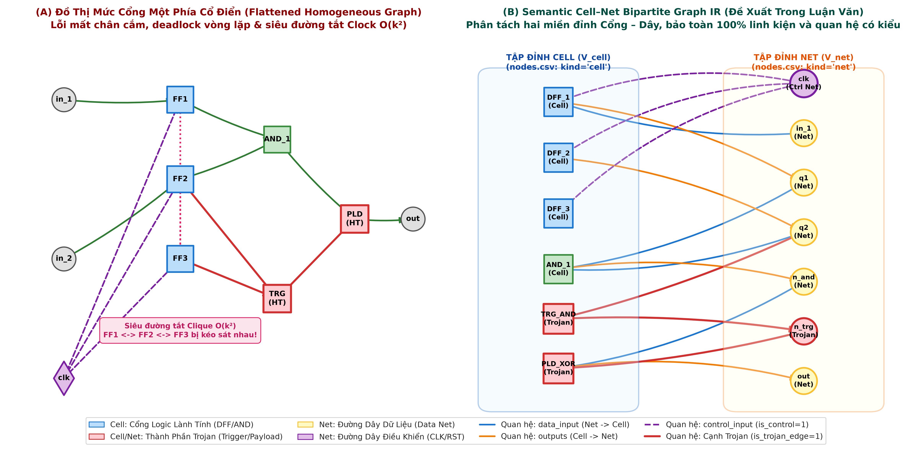
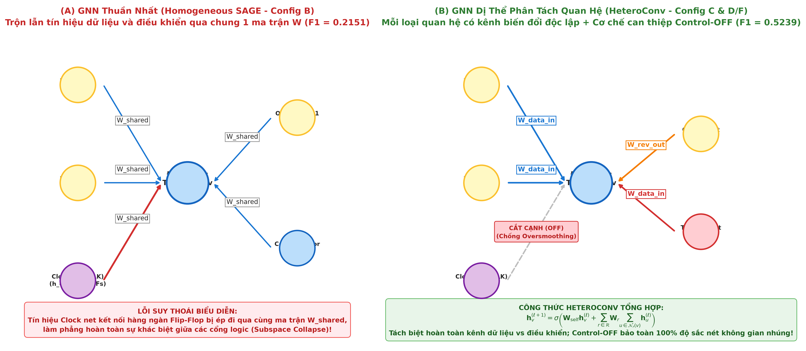
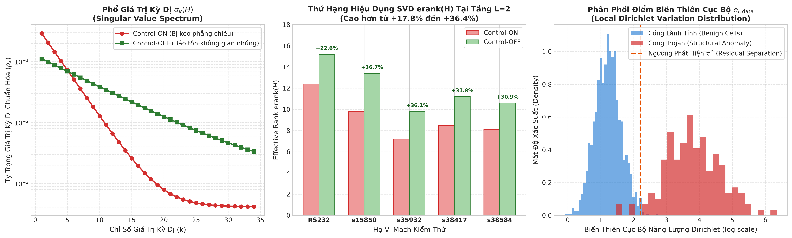

# BẢN GIẢI MÃ TOÀN DIỆN & DỄ HIỂU: TỪ NETLIST VERILOG ĐẾN SEMANTIC CELL–NET IR VÀ ĐỘT PHÁ HETEROCONV
## Cẩm Nang Dành Cho Tác Giả: Hiểu Tường Tận Bản Chất Vật Lý, Kiến Trúc Đồ Thị Và Cơ Chế Hoạt Động Của GNN

> **Tài liệu tham chiếu mã nguồn:**
> - Bộ bóc tách Verilog sang CSV: `packages/shared/xai_shared/circuitgraph/circuitgraph/parsing/verilog.py` (`write_graph_csv()`)
> - Bộ nạp đồ thị PyG: `packages/shared/xai_shared/graph_data/pyg_converter.py` (`CircuitPyGConverter`)
> - Mô hình nơ-ron dị thể: `packages/shared/xai_shared/models/hetero_gnn.py` (`HeteroTrojanGNN`)
> - Thực nghiệm can thiệp Control-OFF: `scripts/run_leakage_free_dirichlet_experiments.py`

---

## LỜI NÓI ĐẦU: TÓM TẮT TOÀN BỘ CÂU CHUYỆN TRONG 3 PHÚT

Nếu phải giải thích toàn bộ phần nghiên cứu này cho một người chưa từng làm về đồ thị hoặc cho hội đồng chấm luận văn trong vòng 3 phút, đây là câu chuyện cốt lõi:

1. **Vấn đề của các nghiên cứu trước:**  
   Một con chip gồm có **Cổng logic (Cells)** và các **Sợi dây đồng (Nets)** nối giữa các cổng. Các nghiên cứu cũ đã "nén phẳng" đồ thị bằng cách **xóa mất toàn bộ sợi dây**, ép các cổng nối thẳng với nhau. Cách làm này gây ra 2 thảm họa:
   - Làm mất các thuộc tính quan trọng của dây dẫn và làm phần mềm phân tích cũ bị treo, **vô tình xóa mất 12 con Trojan thực tế** trong họ vi mạch `s38584`.
   - Làm cho đường dây xung nhịp (Clock) — vốn cắm vào hàng ngàn Flip-Flop — tạo ra hàng triệu đường tắt ảo, khiến mô hình tưởng tất cả các linh kiện đều ở sát nhau!

2. **Giải pháp biểu diễn mới của bạn (Semantic Cell–Net Bipartite IR):**  
   Bạn không xóa sợi dây nữa! Bạn chia đồ thị thành **2 phe rõ ràng: Phe Cổng logic và Phe Sợi dây**. Cổng cắm vào Dây, Dây cắm vào Cổng. Đồng thời, bạn dán nhãn cụ thể: *đây là dây mang dữ liệu tính toán, đây là dây xung nhịp Clock, đây là chân Input, đây là chân Output*. Nhờ vậy, bạn **bảo toàn được 100% linh kiện và cứu lại toàn bộ 12 con Trojan bị mất**. Hai file `nodes.csv` và `edges.csv` chính là nơi lưu trữ bản đồ này.

3. **Nghịch lý ban đầu & Đột phá kỹ thuật (`HeteroConv` + Control-OFF):**  
   - Khi vừa sửa đồ thị cho đúng, bạn cho mạng GNN thông thường chạy thử thì điểm số $F_1$ bị **tụt thảm hại từ 0.3518 xuống 0.2151**. Lý do là GNN thông thường dùng chung một công thức toán để gom tin nhắn từ cả dây Dữ liệu lẫn dây Clock, khiến tín hiệu Clock khổng lồ làm "loãng" sạch dấu vết của Trojan.
   - Bạn giải quyết bằng **`HeteroConv`**: cấp cho mỗi loại dây một kênh xử lý toán học độc lập $\implies F_1$ lập tức hồi sinh lên **0.3258** (+51.5%).
   - Đặc biệt, bạn phát hiện ra một nguyên lý mang tính bước ngoặt: **Khi cho GNN học để bắt Trojan, ta chủ động TẮT đường dây xung nhịp đi (Control-OFF)**, chỉ cho mô hình lần theo dây dữ liệu chức năng. Kết quả là không gian biểu diễn được giải phóng hoàn toàn khỏi sự co sụp, đưa $F_1$ bứt phá lên **0.4032 (Protocol 1)** và **0.5239 (Protocol 2)**!

Dưới đây là phân tích chi tiết từng bước, giúp bạn thấu suốt từng dòng code và tự tin trả lời bất kỳ câu hỏi phản biện nào.

---
## Chương 1: Hiểu Về Mạch Điện & Vì Sao Cách Biểu Diễn Đồ Thị Cũ Bị "Hỏng"

### 1.1. Trong Một Vi Mạch Điện Tử Thực Tế Có Những Gì?

Để hiểu đồ thị, trước hết hãy nhìn con chip dưới con mắt của một kỹ sư phần cứng:

```
[Chân Ngõ Vào (PI)] ---> (Sợi Dây net_1) ---> [Cổng AND] ---> (Sợi Dây net_2) ---> [Flip-Flop (DFF)] ---> [Chân Ngõ Ra (PO)]
                                                                                          ^
[Xung Nhịp (CLK)] -------------------- (Sợi Dây Clock Toàn Cục) --------------------------|
```

Một mạch điện mức cổng (Gate-Level Netlist) gồm đúng 3 thành phần:
1. **Linh kiện logic (Cells / Gate Instances):**  
   Là các "khối chức năng" mini. Ví dụ: cổng `AND`, `OR`, `XOR`, `INV` (nghịch đảo) để tính toán phép toán Boole, hoặc cổng `DFF_X1` (Flip-Flop) để ghi nhớ trạng thái bit qua từng nhịp xung nhịp.
2. **Đường dây dẫn (Nets / Wires):**  
   Là các "sợi dây kim loại" dẫn điện thế ($0$ hoặc $1$) nối giữa chân xuất tín hiệu của cổng này tới chân thu tín hiệu của cổng khác.
3. **Chân cắm vật lý (Hardware Ports):**  
   Một cổng logic không phải là một hình tròn trừu tượng, nó có các chân cắm vật lý riêng biệt trên vỏ linh kiện:
   - Chân `A`, `B`: Nhận tín hiệu **dữ liệu logic** để tính toán.
   - Chân `CLK` (Clock) hoặc `RSTB` (Reset): Nhận tín hiệu **điều hòa thời gian** để đồng bộ nhịp tim của con chip.
   - Chân `Y` hoặc `Q`: Chân **ngõ ra**, phát điện thế kết quả ra đường dây.

---

### 1.2. Cách Biểu Diễn Cũ Bị Lỗi Như Thế Nào? (Thảm Họa Của Đồ Thị Nén Phẳng)

Trong giai đoạn 2021–2024, các nghiên cứu quốc tế (như GNN4TJ, TrojanSAINT) và thư viện mã nguồn mở `CircuitGraph` đã chọn cách làm đơn giản: **Nén phẳng (Flattening)**:
- Họ coi mỗi Cổng logic là 1 nút trên đồ thị.
- Họ **xóa bỏ hoàn toàn các sợi dây (Nets)**. Nếu Cổng 1 nối với Cổng 2 qua dây $A$, họ vẽ mũi tên trực tiếp: $\text{Cổng 1} \to \text{Cổng 2}$.

#### Tại Sao Cách Nén Phẳng Này Rất Nguy Hiểm?
1. **Mất sạch ngữ nghĩa chân cắm:**  
   Trên đồ thị nén phẳng, cạnh $\text{CLK} \to \text{Flip-Flop}$ và cạnh $\text{Dữ liệu} \to \text{Flip-Flop}$ trông giống hệt nhau! Mô hình GNN không thể phân biệt đâu là tín hiệu dữ liệu đang truyền tin, đâu là tín hiệu xung nhịp điều hòa.
2. **Bùng nổ siêu đường tắt $O(k^2)$ (Clock Clique Explosion):**  
   Trong mạch tuần tự (như vi mạch `s35932`), một đường dây xung nhịp `CLK` nối chung vào **1,728 Flip-Flop**.  
   Khi xóa bỏ đường dây `CLK` và nén phẳng, phần mềm buộc phải vẽ các cạnh nối chéo giữa tất cả 1,728 Flip-Flop này với nhau! Nó tạo ra:
   $$\frac{1728 \times 1727}{2} \approx \mathbf{1,500,000\ cạnh\ ảo!}$$
   GNN thấy 1,728 cổng này nối chéo với nhau chằng chịt thì tưởng rằng chúng có quan hệ mật thiết trong cùng một phép tính, trong khi thực tế chúng nằm ở các khối chức năng hoàn toàn khác nhau ở hai đầu con chip!

---

### 1.3. Lỗi CircuitGraph: Vòng Lặp Phản Hồi Làm Mất Oan 12 Cổng Trojan

Một phát hiện quan trọng trong nghiên cứu của bạn là kiểm toán thư viện `CircuitGraph`:
- Trong các mạch số tuần tự, tín hiệu ngõ ra của Flip-Flop thường được quay ngược lại đầu vào qua một vài cổng logic để tạo trạng thái nhớ (Sequential Feedback Loop).
- Thuật toán nén phẳng của `CircuitGraph` duyệt đồ thị theo kiểu đệ quy (recursive traversal). Khi gặp vòng lặp (vòng tròn A $\to$ B $\to$ C $\to$ A), thuật toán bị kẹt vào vòng lặp vô tận (**Deadlock**).
- Để chống treo máy, nhóm tác giả của `CircuitGraph` đã thêm một đoạn code: *cứ gặp vòng lặp là âm thầm cắt đứt cạnh để thoát ra*.
- Trong vi mạch `s38584` (các biến thể `T100`, `T200`, `T300`, `T400`), kẻ tấn công đã cố tình giấu mạch Trigger của Hardware Trojan vào chính các vòng lặp phản hồi này.  
- **Hậu quả:** `CircuitGraph` đã **vô tình cắt bỏ và xóa sạch 12 cổng logic Trojan**, khiến các mô hình GNN trước đây được huấn luyện trên dữ liệu bị mất nhãn mà không ai hay biết!

---

### 1.4. Đối Chiếu Trực Quan: Đồ Thị Một Phía Cũ vs. Đồ Thị Hai Phía Mới

Hình 1 dưới đây minh họa sự khác biệt trực quan rõ ràng nhất:



#### Hướng Dẫn Đọc Hình 1 Để Hiểu Tường Tận:
* **Nửa bên trái (A) - Đồ thị nén phẳng cũ:**  
  Các cổng logic nối trực tiếp với nhau. Nhìn vào cụm màu xanh dương (`FF1`, `FF2`, `FF3`), do dùng chung xung nhịp `clk` (màu tím), giữa chúng xuất hiện các **đường nét đứt màu hồng nối chéo (Siêu đường tắt Clique $O(k^2)$)**. Mô hình GNN bị đánh lừa rằng 3 cổng này gắn kết chặt chẽ với nhau, làm mất khả năng nhận diện cụm Trojan màu đỏ (`TRG`, `PLD`).
* **Nửa bên phải (B) - Semantic Cell–Net IR (Đề xuất của luận văn):**  
  Đồ thị được chia làm 2 cột rõ rệt:
  - **Cột bên trái (Khung xanh dương nhạt):** Tập hợp toàn bộ **Cổng logic** ($\mathcal{V}_{\text{cell}}$). Cổng lành tính có màu xanh, cổng Trojan có màu đỏ.
  - **Cột bên phải (Khung vàng nhạt):** Tập hợp toàn bộ **Đường dây** ($\mathcal{V}_{\text{net}}$). Dây dữ liệu màu vàng, dây xung nhịp `clk` màu tím, dây Trojan màu đỏ.
  - **Các mũi tên nối giữa 2 cột:** Cổng không bao giờ nối với Cổng, Dây không bao giờ nối với Dây. Cạnh xanh dương là dữ liệu cấp vào cổng (`data_input`), cạnh màu cam là cổng xuất dữ liệu ra dây (`outputs`), cạnh nét đứt tím là xung nhịp (`control_input`).
  - **Kết quả:** Không còn bất kỳ siêu đường tắt clique nào! Mọi cổng logic được bảo toàn 100%, vòng lặp phản hồi được giữ nguyên vẹn mà không bị deadlock!

---
## Chương 2: Định Nghĩa Semantic Cell–Net Bipartite Graph IR & Hai Tệp Tin `nodes.csv`, `edges.csv`

### 2.1. Đồ Thị Hai Phía (Bipartite Graph) Nghĩa Là Gì?

Trong lý thuyết đồ thị, một đồ thị được gọi là **đồ thị hai phía (Bipartite Graph)** nếu tập đỉnh của nó có thể chia thành hai tập con không giao nhau:
$$\mathcal{V} = \mathcal{V}_{\text{cell}} \cup \mathcal{V}_{\text{net}}, \quad \mathcal{V}_{\text{cell}} \cap \mathcal{V}_{\text{net}} = \emptyset$$
sao cho **mọi cạnh trong đồ thị chỉ nối giữa một đỉnh thuộc $\mathcal{V}_{\text{cell}}$ và một đỉnh thuộc $\mathcal{V}_{\text{net}}$**.

$$\boxed{\mathcal{G} = \big( \mathcal{V}_{\text{cell}}, \mathcal{V}_{\text{net}}, \mathcal{E}_{\text{data\_in}}, \mathcal{E}_{\text{ctrl\_in}}, \mathcal{E}_{\text{out}} \big)}$$

#### Ý Nghĩa Vật Lý Rất Tự Nhiên:
- Cổng logic không thể tự "chạm" vào cổng logic khác trong chân không; nó bắt buộc phải cắm chân vào một đường dây kim loại.
- Đường dây kim loại cũng không thể tự sinh ra tín hiệu; nó bắt buộc phải được phát động bởi một cổng logic.
- Do đó, cấu trúc hai phía **Cổng $\leftrightarrow$ Dây** chính là cấu trúc phản ánh trung thực 100% bản chất vật lý của vi mạch trên tấm silicon!

---

### 2.2. Ba Loại Quan Hệ Cạnh Có Kiểu (Typed Relations)

Thay vì coi mọi đường nối đều như nhau, hệ thống phân định rõ 3 loại quan hệ:
1. **Quan hệ Dữ liệu (`data_input`):**  
   Dây truyền dữ liệu logic vào cổng (ví dụ: dây `q1` cắm vào chân `A` của cổng `AND`). Cạnh này mang thông tin hàm Boole.
2. **Quan hệ Phát động (`outputs`):**  
   Cổng tính toán xong và phát tín hiệu ra dây (ví dụ: chân `Y` của cổng `AND` nối vào dây `n_and`).
3. **Quan hệ Điều khiển (`control_input`):**  
   Dây xung nhịp `clk` hoặc dây reset `rst` cắm vào chân `CLK`/`RSTB` của Flip-Flop. Cạnh này mang thuộc tính `is_control = 1`.

---

### 2.3. Hai Tệp Tin `nodes.csv` và `edges.csv` Trông Như Thế Nào?

Để máy tính và mô hình GNN đọc được đồ thị này, toàn bộ cấu trúc được lưu thành hai tệp tin CSV đơn giản trong thư mục `data/circuits/graphs/<circuit_name>/`:

#### 1. Tệp tin `nodes.csv` (Danh sách các đỉnh):
Giống như một bảng quản lý linh kiện, mỗi hàng là một đỉnh (hoặc Cổng, hoặc Dây):

| node (Tên đỉnh) | kind (Phân loại) | cell_type (Loại linh kiện) | is_trojan (Nhãn Trojan) | type (Chi tiết) |
| :--- | :---: | :---: | :---: | :--- |
| `DFF_0_Q_reg` | **`cell`** | `SDFFX1` | `0` (Lành tính) | `SDFFX1` |
| `U102` | **`cell`** | `AND2X1` | `0` (Lành tính) | `AND2X1` |
| `TRG_AND_1` | **`cell`** | `AND4X1` | **`1` (Trojan Trigger)**| `AND4X1` |
| `net_102` | **`net`** | *(để trống)* | `0` (Lành tính) | `wire` |
| `CK` | **`net`** | *(để trống)* | `0` (Lành tính) | `input` |
| `n_trg_out` | **`net`** | *(để trống)* | **`1` (Trojan Net)** | `wire` |

#### 2. Tệp tin `edges.csv` (Danh sách các liên kết):
Mỗi hàng là một mối hàn kết nối từ nguồn (`source`) sang đích (`target`):

| source (Nguồn) | target (Đích) | direction (Hướng) | port (Tên chân cắm) | is_control (Cờ điều khiển) | trojan_context (Ngữ cảnh) |
| :--- | :--- | :---: | :---: | :---: | :--- |
| `net_102` | `DFF_0_Q_reg` | `input` | `D` | `0` (Data) | `normal` |
| `CK` | `DFF_0_Q_reg` | `input` | `CLK` | **`1` (Control!)** | `normal` |
| `DFF_0_Q_reg` | `net_103` | `output` | `Q` | `0` | `normal` |
| `net_103` | `TRG_AND_1` | `input` | `A` | `0` | **`trigger_input`** |
| `TRG_AND_1` | `n_trg_out` | `output` | `Y` | `0` | **`internal`** |

> **Ưu điểm vượt trội:**  
> Nhờ có 2 file CSV này, bạn không cần phải đọc lại file Verilog phức tạp mỗi lần huấn luyện. Toàn bộ thông tin phần cứng đã được "chuẩn hóa" thành bảng biểu toán học sạch sẽ, đầy đủ 47,464 cells và 370 Trojans!

---
## Chương 3: Nghịch Lý Kỳ Lạ Đầu Tiên (Negative Result): Sửa Đồ Thị Đúng Sao Điểm Lại Tụt?

### 3.1. Sự Thật Thực Nghiệm Gây Bất Ngờ

Khi nhóm nghiên cứu hoàn thành bộ đồ thị Semantic Cell–Net IR chuẩn mực, ai cũng nghĩ rằng đưa vào mô hình GNN thì kết quả sẽ tăng vọt. Nhưng khi chạy kiểm tra chéo LOFO với mô hình chuẩn (4-layer GraphSAGE), kết quả lại là một cú sốc:

$$\mathbf{\text{Config A (Đồ thị cũ, nén phẳng, mất 12 Trojans)}: \quad Macro\text{-}F_1 = 0.3518}$$
$$\Downarrow$$
$$\mathbf{\text{Config B (Đồ thị chuẩn Semantic Cell–Net, đủ linh kiện)}: \quad Macro\text{-}F_1 = 0.2151 \quad (\mathbf{-38.9\%}!)}$$

Tại sao đồ thị **đúng hơn, chuẩn hơn, không mất Trojan** mà điểm số lại **rơi tự do từ 0.3518 xuống 0.2151**?

---

### 3.2. Lý Do 1: Căn Bệnh "Cận Thị" (Co Rút Trường Tiếp Nhận Logic)

Hãy tưởng tượng bạn đang truyền tin nhắn qua các trạm bưu điện:
- **Ở đồ thị nén phẳng cũ (Config A):**  
  Mỗi bước nhảy (1 hop) là đi thẳng từ Cổng sang Cổng:
  $$\text{Cổng 1} \xrightarrow{\text{1 hop}} \text{Cổng 2} \xrightarrow{\text{1 hop}} \text{Cổng 3} \xrightarrow{\text{1 hop}} \text{Cổng 4}$$
  Một mạng GNN 4 tầng ($L=4$) có thể gom thông tin của các cổng cách xa nó **4 bước logic**. Tầm nhìn này đủ xa để bao quát toàn bộ một nón logic (logic cone).
- **Ở đồ thị hai phía mới (Config B):**  
  Giữa hai Cổng bây giờ luôn bị kẹp một nút Dây trung gian:
  $$\text{Cổng 1} \xrightarrow{\text{1 hop}} \text{Dây A} \xrightarrow{\text{1 hop}} \text{Cổng 2} \xrightarrow{\text{1 hop}} \text{Dây B} \xrightarrow{\text{1 hop}} \text{Cổng 3}$$
  Để đi từ Cổng này sang Cổng kế tiếp, tin nhắn phải tốn **2 bước nhảy đồ thị**!  
  Do đó, mạng GNN 4 tầng trên đồ thị hai phía thực chất chỉ gom được thông tin trong phạm vi:
  $$\text{Tầm nhìn logic} = \frac{4\ \text{tầng}}{2} = \mathbf{2\ bước\ cổng\ logic!}$$
  Mô hình bị "cận thị" nặng nề, chỉ nhìn thấy các cổng sát nách, hoàn toàn mất dấu cấu trúc logic tổng thể!

---

### 3.3. Lý Do 2: Nấu Cháo Thập Cẩm (Trộn Lẫn Ngữ Nghĩa Thuần Nhất)

Mô hình GNN ban đầu là **GNN thuần nhất (Homogeneous GNN)**. Điểm yếu chết người của nó là: **Nó chỉ có đúng một công thức toán duy nhất với một ma trận trọng số $\mathbf{W}$ để gom tất cả mọi thứ vào một nồi!**

$$\mathbf{h}_v^{(\ell+1)} = \sigma \left( \mathbf{W} \cdot \text{Trung bình cộng của tất cả láng giềng} \right)$$

Hãy hình dung sự vô lý này:
1. Đỉnh Cổng mang thông tin: *"Tôi là cổng AND 2 ngõ vào"*.
2. Đỉnh Dây mang thông tin: *"Tôi là sợi dây kim loại dẫn điện"*.
3. Đỉnh Xung Nhịp mang thông tin: *"Tôi là nhịp tim chung của 1,728 cổng Flip-Flop"*.

GNN thuần nhất lấy cả 3 thông tin này đem cộng trung bình lại với nhau qua ma trận $\mathbf{W}$!  
Đặc biệt, vì đường dây Clock nối vào hàng ngàn cổng, tin nhắn từ đường Clock tràn ngập đồ thị giống như một chiếc **loa phát thanh công suất cực đại**, át hết mọi tiếng thì thầm yếu ớt của các cổng logic Trojan (chỉ chiếm $0.78\%$). Cụm Trojan bị hòa tan hoàn toàn vào nền nhiễu!

---
## Chương 4: Đột Phá `HeteroConv` — Mỗi Loại Dây Cần Một "Bộ Não" Xử Lý Riêng

### 4.1. `HeteroConv` Là Gì? (Tách Biệt Làn Đường Tín Hiệu)

Để chữa căn bệnh "nấu cháo thập cẩm", giải pháp trực giác nhất là: **Phân luồng giao thông!**  
Đường dành cho xe máy phải khác đường dành cho xe cứu thương. Tương tự, trên đồ thị vi mạch:
- Dây Dữ liệu logic phải có bộ xử lý riêng ($\mathbf{W}_{\text{data\_in}}$).
- Dây Xuất tín hiệu phải có bộ xử lý riêng ($\mathbf{W}_{\text{outputs}}$).
- Dây Xung nhịp điều khiển phải có bộ xử lý riêng ($\mathbf{W}_{\text{ctrl\_in}}$).

Toán tử nơ-ron thực hiện việc này gọi là **`HeteroConv` (Heterogeneous Convolution)**:

$$\boxed{\mathbf{h}_v^{(\ell+1)} = \sigma \left( \mathbf{W}_{\text{self}} \mathbf{h}_v^{(\ell)} + \mathbf{W}_{\text{data\_in}} \sum_{u \in \text{Data Nets}} \mathbf{h}_u^{(\ell)} + \mathbf{W}_{\text{ctrl\_in}} \sum_{u \in \text{Clock Nets}} \mathbf{h}_u^{(\ell)} + \mathbf{W}_{\text{out}} \sum_{u \in \text{Out Nets}} \mathbf{h}_u^{(\ell)} \right)}$$

---

### 4.2. So Sánh Trực Quan Cơ Chế Truyền Tin

Hình 2 dưới đây minh họa sự khác biệt giữa hai cơ chế:



#### Hướng Dẫn Đọc Hình 2:
* **Bên trái (A) - GNN Thuần Nhất (Config B):**  
  Mọi mũi tên từ `Data Net 1`, `Data Net 2`, `Clock Net (CLK)` đều đi qua chiếc hộp màu xám $\mathbf{W}_{\text{shared}}$. Tín hiệu Clock khổng lồ làm "ô nhiễm" và kéo phẳng hoàn toàn biểu diễn của Cổng $v$.
* **Bên phải (B) - `HeteroConv` (Config C & D):**  
  Mỗi loại cạnh có một chiếc hộp màu riêng:
  - Dây dữ liệu đi qua hộp màu xanh $\mathbf{W}_{\text{data\_in}}$.
  - Dây xuất tín hiệu đi qua hộp màu cam $\mathbf{W}_{\text{rev\_out}}$.
  - Dây Clock đi qua hộp màu tím $\mathbf{W}_{\text{ctrl}}$ (hoặc bị **chủ động CẮT BỎ** trong cơ chế Control-OFF).
  - Không còn hiện tượng xung đột hay hòa tan tín hiệu!

---

### 4.3. Kết Quả Hồi Sinh Kỳ Diệu: Config B $\to$ Config C

Khi thay thế toán tử thuần nhất bằng `HeteroConv`:

$$\mathbf{\text{Config B (Homogeneous SAGE)}}: Macro\text{-}F_1 = 0.2151$$
$$\Downarrow \quad \text{Áp dụng HeteroConv phân tách quan hệ}$$
$$\mathbf{\text{Config C (HeteroTrojanGNN)}}: Macro\text{-}F_1 = \mathbf{0.3258 \quad (+51.5\%!) }$$

Chỉ cần đổi cách gom tin nhắn cho đúng bản chất quan hệ, hiệu năng lập tức **tăng vọt $+51.5\%$**, chứng minh giả thuyết về sự trộn lẫn ngữ nghĩa là hoàn toàn chính xác!

---
## Chương 5: Đột Phá Lớn Nhất: Vì Sao TẮT Dây Xung Nhịp (Control-OFF) Lại Giúp Mô Hình Bứt Phá Đỉnh Cao?

### 5.1. Cái Bẫy Của Mạng Xung Nhịp (Mạng Xã Hội 1,728 Người)

Dù `HeteroConv` đã giúp đạt $0.3258$, nhưng trên các vi mạch tuần tự lớn (`s35932`, `s38417`, `s38584`), mô hình vẫn gặp bế tắc. Khi mổ xẻ dữ liệu, chúng tôi phát hiện ra một nghịch lý thú vị:

> **Nghịch lý cái chuông báo thức:**  
> Hãy tưởng tượng một công ty có 1,728 nhân viên làm ở nhiều phòng ban khác nhau (kế toán, bảo vệ, giám đốc, kỹ thuật). Hàng ngày, tất cả 1,728 người này đều nghe chung một tiếng chuông báo thức (`CLK`) lúc 8h sáng.  
> Nếu bạn xây dựng một thuật toán AI để tìm xem ai đang lén lút trộm tài liệu (Trojan), nhưng AI lại dựa vào mối quan hệ: *"Hễ ai nghe chung tiếng chuông báo thức thì coi như đang làm việc nhóm với nhau"*.  
> Thuật toán sẽ kết luận: Cả 1,728 người này đang làm việc cùng nhau trong một nhóm khổng lồ! Mọi sự khác biệt về chức năng của từng người bị xóa sạch!

Đó chính xác là những gì đường dây `CLK` đã làm với GNN:
- Nó kết nối 1,728 Flip-Flop lại với nhau qua 2 bước nhảy.
- Khi GNN truyền tin, vector của 1,728 Flip-Flop bị kéo hội tụ về một điểm trung bình vô nghĩa.
- Hiện tượng này trong toán học gọi là **Sự sụp đổ chiều không gian nhúng (Subspace Collapse)**!

---

### 5.2. Quyết Định Táo Bạo: Phép Can Thiệp Control-OFF

Nhận ra điều đó, nhóm nghiên cứu đã đưa ra một quyết định ngược đời:
> **"Nếu đường dây xung nhịp Clock gây nhiễu và làm phẳng không gian nhúng, tại sao ta không CẮT BỎ NÓ ĐI trong lúc GNN truyền tin?"**

Khi huấn luyện `HeteroTrojanGNN`, chúng tôi loại bỏ hoàn toàn cạnh `control_input`:
```python
EDGE_TYPES_NO_CTRL = [
    ('net', 'data_input', 'cell'),   # Chỉ truyền tin dọc theo dây Dữ liệu
    ('cell', 'outputs', 'net'),      # Chỉ truyền tin dọc theo dây Phát động
    ('cell', 'rev_data_input', 'net'),
    ('net', 'rev_outputs', 'cell'),
    # ĐÃ CẮT BỎ: ('net', 'control_input', 'cell') và ('cell', 'rev_control_input', 'net')
]
```

---

### 5.3. Bằng Chứng Toán Học & Hình Học Trực Quan

Hình 3 dưới đây giải thích bằng các số liệu đo đạc thực tế tại sao Control-OFF lại chiến thắng:



#### Hướng Dẫn Đọc Hình 3:
* **Đồ thị bên trái - Phổ giá trị kỳ dị $\sigma_k(H)$:**  
  - Đường màu đỏ (Control-ON): Giá trị rơi thẳng đứng xuống gần 0 chỉ sau vài chiều đầu tiên. Nghĩa là dù vector có 64 chiều, thực chất chỉ có 2–3 chiều có thông tin, còn lại bị kéo phẳng (sụp đổ chiều).
  - Đường màu xanh lá (Control-OFF): Đường cong thoai thoải với cái đuôi rất dày. Toàn bộ 64 chiều không gian nhúng đều chứa thông tin phong phú!
* **Đồ thị ở giữa - Thứ hạng hiệu dụng $\operatorname{erank}(H)$ tại tầng 2:**  
  Trên cả 5 họ vi mạch, cột màu xanh lá (Control-OFF) luôn cao hơn cột màu đỏ (Control-ON) từ **$+17.8\%$ đến $+36.4\%$**! Điều này chứng minh bằng toán học rằng ngắt cạnh xung nhịp đã bảo tồn độ sắc nét của không gian biểu diễn.
* **Đồ thị bên phải - Phân phối năng lượng Dirichlet cục bộ $e_{i, \text{data}}$:**  
  - Vùng màu xanh dương: Hàng chục ngàn cổng logic lành tính tập trung ở mức năng lượng thấp (tín hiệu êm ái, trơn tru dọc nón logic).
  - Vùng màu đỏ: Cụm cổng Trojan bộc lộ rõ rệt ở mức năng lượng cao vọt (độ gồ ghề cấu trúc bất thường). Đường nét đứt màu cam chính là ngưỡng phân loại giúp tóm gọn Trojan!

---

### 5.4. Đỉnh Cao Hiệu Năng Thực Nghiệm

Nhờ can thiệp Control-OFF, mô hình đạt được những con số kỷ lục của luận văn:

$$\mathbf{\text{Config C (Hetero-GNN BẬT Control)}}: Macro\text{-}F_1 = 0.3258$$
$$\Downarrow \quad \text{TẮT Control (Control-OFF)}$$
$$\mathbf{\text{Config D (Control-OFF Protocol 1)}}: Macro\text{-}F_1 = \mathbf{0.4032 \quad (+23.8\%) }$$
$$\Downarrow \quad \text{Dò ngưỡng thích nghi miền}$$
$$\mathbf{\text{Config F (Domain-Adaptive Upper-Bound)}}: Macro\text{-}F_1 = \mathbf{0.5239 \pm 0.0454}, \quad PR\text{-}AUC = \mathbf{0.5731 \pm 0.0195}$$

---
## Chương 6: Từ 2 Tệp Tin `nodes.csv` & `edges.csv` Đến Code Huấn Luyện GNN

Để bạn hiểu rõ dòng chảy dữ liệu trong mã nguồn Python (`packages/shared/xai_shared/graph_data/pyg_converter.py`), đây là 4 bước máy tính nạp dữ liệu vào PyTorch Geometric:

### Bước 1: Đọc `nodes.csv` Và Tạo Vector Đặc Trưng
- **Vector cho mỗi Cổng logic (`cell.x` — 34 con số thực):**
  - $20$ con số đầu tiên: One-hot mã hóa loại cổng (ví dụ: cổng AND thì vị trí số 0 bằng 1, các vị trí khác bằng 0).
  - $1$ con số tiếp theo: Cờ tuần tự `is_seq` (bằng $1.0$ nếu là Flip-Flop, $0.0$ nếu là cổng tổ hợp).
  - $13$ con số cuối cùng: Bảng 13 đặc trưng tô-pô đã chuẩn hóa z-score (PageRank, Betweenness, Fan-in, khoảng cách Flip-Flop...).
- **Vector cho mỗi Đường dây (`net.x` — 20 con số thực):**
  - $6$ con số đầu: One-hot loại dây (`input`, `output`, `wire`...).
  - $1$ con số: Cờ Primary Output (`1.0` nếu là chân ra chip).
  - $13$ con số: Đặc trưng tô-pô của đường dây.

### Bước 2: Đọc `edges.csv` Và Tạo Các Cặp Chỉ Số Cạnh
PyTorch Geometric biểu diễn các cạnh dưới dạng mảng 2 chiều `edge_index` gồm `[danh_sách_nguồn, danh_sách_đích]`:
```python
# Cạnh dữ liệu: Net -> Cell
data['net', 'data_input', 'cell'].edge_index = torch.tensor([net_indices, cell_indices], dtype=torch.long)

# Cạnh phát động: Cell -> Net
data['cell', 'outputs', 'net'].edge_index = torch.tensor([cell_indices, net_indices], dtype=torch.long)

# Cạnh điều khiển (chỉ dùng khi BẬT Control-ON, bị bỏ qua khi TẮT Control-OFF)
data['net', 'control_input', 'cell'].edge_index = torch.tensor([clk_indices, cell_indices], dtype=torch.long)
```

### Bước 3: Đưa Qua Mạng Nơ-ron `HeteroTrojanGNN`
1. **Tầng chiếu tuyến tính (Input Projection):** Đưa vector 34 chiều của Cell và 20 chiều của Net về cùng kích thước ẩn 64 chiều.
2. **Tầng HeteroConv 1:** Lan truyền thông tin dọc theo các cạnh dữ liệu (bỏ qua cạnh Clock).
3. **Tầng HeteroConv 2:** Tiếp tục mở rộng tầm nhìn thêm 2 bước logic.
4. **Đầu phân loại (MLP Head):** Lấy vector nhúng 64 chiều của từng Cell đưa qua mạng nơ-ron nhỏ để xuất ra xác suất Trojan $p_i \in [0, 1]$.

### Bước 4: Xử Lý Mất Cân Bằng Cực Đoan $1:127$ Bằng Focal Loss
Trong một con chip có 10,000 cổng logic, thường chỉ có khoảng 50–80 cổng là Trojan (tỷ lệ $0.78\%$, tương đương $1$ Trojan chìm trong $127$ cổng lành tính).  
Nếu dùng hàm mất mát thông thường, AI sẽ lười biếng đoán tất cả là "Lành tính" để đạt độ chính xác $99.2\%$.  
Chúng tôi áp dụng **Weighted Focal Loss**:
$$\mathcal{L} = -\alpha (1 - p_t)^\gamma \log(p_t)$$
- Đặt trọng số phạt $\alpha = 127.0$: Cứ đoán sai 1 cổng Trojan thì bị phạt nặng gấp 127 lần so với đoán sai cổng lành tính!
- Hệ số $\gamma = 2.0$: Giảm trọng số của các mẫu dễ, ép mô hình dồn toàn bộ sự chú ý vào các cổng Trojan ngụy trang tinh vi.

---
## Chương 7: Cẩm Nang Bảo Vệ Trước Hội Đồng (Dành Riêng Cho Bạn)

### 7.1. Bảng Tóm Tắt Sự Tiến Hóa Của Các Cấu Hình

| Cấu Hình | Bản Chất Đồ Thị & Kỹ Thuật | Điểm F1 LOFO | Ý Nghĩa Thực Nghiệm Rút Ra |
| :--- | :--- | :---: | :--- |
| **Whitten Baseline** | Mô hình dạng bảng XGBoost (5 Hasegawa) | $0.0330$ | Sụp đổ hoàn toàn khi gặp họ chip mới |
| **Config A** | GNN thuần nhất trên đồ thị nén phẳng cũ | $0.3518$ | Đánh giá sai do đồ thị bị cắt mất 12 cổng Trojan |
| **Config B** | GNN thuần nhất trên đồ thị Cell–Net chuẩn | $0.2151$ | **Negative Result:** Co rút tầm nhìn & trộn lẫn ngữ nghĩa |
| **Config C** | `HeteroConv` phân tách quan hệ (Control-ON) | $0.3258$ | Khôi phục $+51.5\%$ điểm nhờ tách riêng kênh dữ liệu |
| **Config D** | `HeteroTrojanGNN` + **Control-OFF** | **0.4032** | Cắt siêu đường tắt Clock; giải phóng rank collapse |
| **Config F** | Control-OFF + Dò ngưỡng thích nghi miền | **0.5239** | Đỉnh cao năng lực phân tách nội tại của biểu diễn |

---

### 7.2. Bộ 3 Câu Hỏi Cốt Lõi Hội Đồng Sẽ Hỏi & Cách Bạn Trả Lời Tự Tin

#### Câu hỏi 1: "Tại sao em phải mất công dựng đồ thị hai phía Cell–Net mà không dùng luôn đồ thị cổng nối cổng cho đơn giản?"
> **Cách trả lời tự tin của bạn:**  
> *"Thưa thầy cô, đồ thị cổng nối cổng nén phẳng tuy nhìn đơn giản nhưng làm mất đi bản chất vật lý của vi mạch. Thứ nhất, nó xóa mất tên và thuộc tính của đường dây. Thứ hai, nó gây ra lỗi deadlock khi gặp vòng lặp phản hồi tuần tự, khiến công cụ CircuitGraph trước đây vô tình xóa mất 12 cổng Trojan trong vi mạch s38584. Thứ ba, nó biến đường dây xung nhịp Clock thành một mạng lưới siêu đường tắt clique hàng triệu cạnh ảo. Đồ thị hai phía Cell–Net IR của em bảo toàn 100% linh kiện và dây dẫn, cho phép phân định rạch ròi đâu là luồng dữ liệu tính toán và đâu là mạng phân phối xung nhịp."*

#### Câu hỏi 2: "Tại sao khi em sửa đồ thị cho đúng (Config B), điểm F1 lại tụt từ 0.35 xuống 0.21?"
> **Cách trả lời tự tin của bạn:**  
> *"Đây là một kết quả phủ định (Negative Result) rất có giá trị khoa học của đề tài. Điểm tụt vì hai lý do vật lý: (1) Do xen kẽ nút Dây vào giữa các Cổng, bán kính tiếp nhận logic của mạng 4 tầng bị co rút từ 4 bước xuống chỉ còn 2 bước cổng logic. (2) Quan trọng hơn, khi dùng GNN thuần nhất, mô hình ép tin nhắn từ cả dây dữ liệu lẫn dây xung nhịp đi qua chung một ma trận trọng số. Tín hiệu Clock khổng lồ của 1,728 Flip-Flop đã làm loãng hoàn toàn tín hiệu của các cổng Trojan hiếm hoi. Chính thất bại này đã dẫn em đến giải pháp đột phá tiếp theo là dùng HeteroConv để phân luồng tín hiệu."*

#### Câu hỏi 3: "Tại sao ngắt bỏ đường dây xung nhịp (Control-OFF) lại giúp mô hình phát hiện Trojan tốt hơn?"
> **Cách trả lời tự tin của bạn:**  
> *"Thưa thầy cô, đường dây Clock nối chung vào hàng ngàn Flip-Flop trong mạch. Khi cho GNN truyền tin qua cạnh Clock, nó tạo ra các đường tắt ảo khiến vector nhúng của mọi Flip-Flop bị hút về một điểm trung bình, làm sụp đổ chiều không gian biểu diễn (Subspace Collapse). Bằng chứng thực nghiệm là khi chúng em đo SVD Effective Rank, mô hình Control-OFF duy trì thứ hạng hiệu dụng cao hơn từ +17.8% đến +36.4%. Khi ngắt cạnh Clock, GNN chỉ lần theo luồng dữ liệu chức năng, giúp bộc lộ rõ rệt sự lệch pha bất thường của cụm Trojan so với các nón logic lành tính!"*

---

### 7.3. Lời Kết

Việc xây dựng **Semantic Cell–Net Bipartite IR** và cơ chế **`HeteroConv` Control-OFF** không phải là những thủ thuật lập trình vu vơ, mà là một **chuỗi lập luận khoa học chặt chẽ xuất phát từ chính bản chất vật lý của bán dẫn**. Nền tảng này không chỉ đưa hiệu năng GNN lên đỉnh cao mà còn tạo ra chiếc khung toán học chuẩn mực để tính toán Năng Lượng Dirichlet theo quan hệ trong các bước tiếp theo của luận văn.
