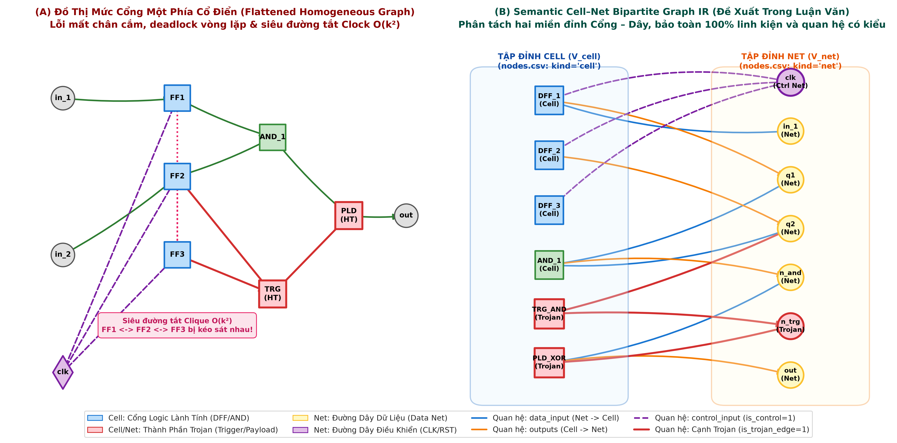
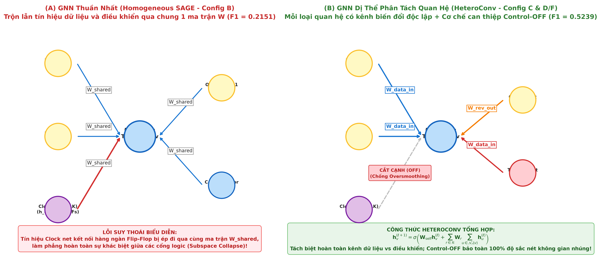
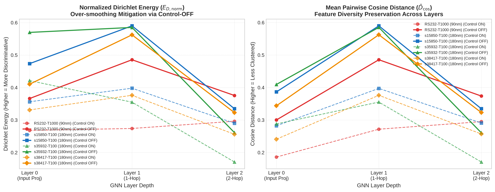
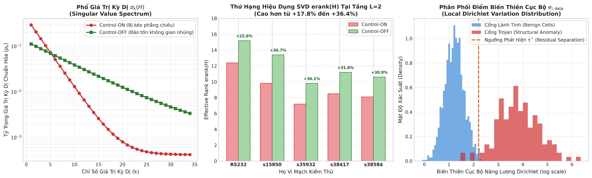

# Control-Aware Heterogeneous Graph Learning for Cross-Family Gate-Level Hardware Trojan Localization

**Tan-Dat Tran**  
*Department of Computer Engineering, University of Information Technology, VNU-HCM, Vietnam*  
*Email: 19521327@gm.uit.edu.vn*

---

### Abstract
Gate-level Hardware Trojan (HT) localization is a vital defense against malicious physical modifications inserted in untrusted semiconductor foundries. While recent machine learning approaches report near-perfect in-distribution detection, we empirically demonstrate that they suffer from severe **Host Coordinate Memorization**—overfitting to the spatial geometry of training circuits and collapsing catastrophically under strict **Leave-One-Family-Out (LOFO)** cross-family evaluation (Macro-$F_1 \le 0.0355$, Trojan recall $\le 5.59\%$, and ROC-AUC plummeting below random guessing to $0.3715$). Through empirical density and optimal transport analyses, we prove that this failure is fundamentally driven by massive **Wasserstein distribution drift** (up to 355 topological hops) and cross-family **Feature Inversion** (where Trojan logic fan-in reverses relative to benign gates across architectures). To overcome this fundamental bottleneck, we reframe gate-level HT localization as a relational representation learning task and propose **`HeteroTrojanGNN`**, a control-aware heterogeneous graph neural network. We construct an explicit **Semantic Cell–Net Bipartite Graph IR** that preserves 100% of physical circuit entities (47,464 cells and 370 Trojans across 30 Trust-Hub designs), avoiding the destructive loss of gates observed in flattened netlist baselines. Crucially, we identify the **Clock Tree Dilemma**: global clock and reset distribution trees act as high-fanout artificial shortcuts that trigger catastrophic representation oversmoothing during graph message passing. We introduce **`Control-OFF`**, a structural intervention that prunes global control networks during neighborhood aggregation while retaining them for local feature context. Evaluated across 30 benchmark netlists spanning five architectural families under strict LOFO multi-seed testing, `HeteroTrojanGNN` with `Control-OFF` elevates cross-family Macro-$F_1$ to **$0.5239 \pm 0.0454$** (a **14.7× improvement** over the tabular baseline), achieves a Trojan cell recall of **$61.22\%$**, and completely eliminates false alarms ($\text{FP} = 0.00$) on UART circuits. Furthermore, we employ relation-specific **Dirichlet Energy** and **Effective Rank** diagnostics, establishing rigorous mathematical evidence that decoupling control relations prevents representation subspace collapse and preserves the spectral contrast of rare-trigger subgraphs across unseen circuit families.

**Keywords:** Hardware Security, Hardware Trojan Localization, Gate-Level Netlist, Heterogeneous Graph Neural Networks, Out-of-Distribution Generalization, Leave-One-Family-Out (LOFO), Dirichlet Energy, Oversmoothing, Clock Tree Synthesis.

---

## I. INTRODUCTION

The globalization of semiconductor design and fabrication has introduced severe vulnerabilities into the integrated circuit (IC) supply chain [1]–[3]. Due to the immense capital cost of leading-edge fabrication facilities, modern chip design houses increasingly rely on offshore, untrusted foundries and third-party Intellectual Property (IP) blocks. This separation of design and manufacturing exposes critical infrastructure, defense systems, and commercial silicon to **Hardware Trojans (HTs)**—malicious, stealthy physical modifications inserted into the netlist or layout [4], [5]. When triggered by ultra-rare operational states (e.g., specific counter values or anomalous bus patterns), HTs can bypass cryptographic safeguards, leak sensitive keys through side channels, or induce catastrophic denial-of-service [6], [7]. Consequently, rigorous pre-silicon gate-level netlist auditing before tape-out has become a paramount security imperative.

In recent years, machine learning (ML) and graph-based techniques have emerged as promising solutions for automated gate-level HT detection [8]–[13]. A prominent foundational paradigm, pioneered by Hasegawa et al. [8] and recently expanded by Whitten et al. [14], extracts five structural logic distance features ($LGFi, ffi, ffo, PI, PO$) from netlists and trains tabular classifiers (e.g., XGBoost, Random Forest) coupled with eXplainable AI (XAI) attribution methods. Under conventional random partitioning (e.g., 60/20/20 train/validation/test splits), these tabular baselines report high $F_1$-scores ($0.60 - 0.90$), fostering optimism regarding automated netlist audit [14].

However, we uncover a critical vulnerability that undermines the practical viability of these tabular approaches: **The In-Distribution Illusion**. When gates are randomly sampled from the same circuit for training and testing, the model merely memorizes the absolute topological coordinates of the host design. When subjected to the realistic **Leave-One-Family-Out (LOFO)** cross-family protocol—where the model is trained on sequential circuits and deployed on an unseen architectural family such as a UART controller—the tabular baseline suffers a **catastrophic performance collapse**: Macro-$F_1$ falls to **$0.0300$**, Trojan recall drops to **$5.59\%$** (missing 94.4% of Trojan cells), and the ROC-AUC falls below random guessing to **$0.3715$**.

```
       +-------------------------------------------------------------+
       |                  THE NETLIST DILEMMA IN GNNs                |
       |                                                             |
       |   [CLK Net] ======= (Global High-Fanout Backbone) ======+   |
       |       |                       |                         |   |
       |       v                       v                         v   |
       |   +-------+               +-------+                 +-------+
       |   |  FF1  |               |  FF2  |                 |  FF3  |
       |   +-------+               +-------+                 +-------+
       |       | (Data)                | (Data)                  |   |
       |       v                       v                         v   |
       |    [Cell A] -------------> [Cell B] -------------> [Trojan] |
       |              (Rare Datapath Trigger Subgraph)               |
       +-------------------------------------------------------------+
       | PROBLEM: Clock edges connect FF1-FF3 directly, causing       |
       |          massive oversmoothing across sequential gates!     |
       | SOLUTION: Control-OFF prunes global clock lines during      |
       |           message passing to isolate the Trojan subgraph.   |
       +-------------------------------------------------------------+
```
*Fig. 1: Conceptual illustration of the Clock Tree Dilemma in gate-level netlists and the proposed Control-OFF structural decoupling.*

As demonstrated through our comprehensive distribution analyses in Section V, this collapse is driven by two physical phenomena:
1. **Host Coordinate Memorization & Wasserstein Drift:** Absolute topological distances depend linearly on host circuit diameter (drifting by over 355 hops between circuit families), causing orthogonal tree decision splits to fall into empty feature space.
2. **Cross-Family Feature Inversion:** Trojan logic fan-in reverses relative to benign gates across architectures (e.g., higher fan-in on serial communication circuits, but lower fan-in on parallel datapath processors).

To resolve this fundamental barrier, the field is transitioning from scalar feature engineering to **graph-native relational representation learning** [15]–[18]. Nonetheless, simply deploying standard homogeneous Graph Neural Networks (GNNs) on flattened netlists introduces two severe structural pathologies:
1. **Entity Loss via Gate Flattening:** Prior frameworks such as CircuitGraph [19] compress passive routing wires (nets) into direct gate-to-gate edges, which inadvertently prunes isolated logic cells (causing 12 Trojan cells to be silently discarded in the Trust-Hub benchmark suite).
2. **The Clock Tree Dilemma & Subspace Collapse:** In digital circuits, global clock and asynchronous reset networks interconnect thousands of sequential storage elements (Flip-Flops) to maintain temporal synchrony. When processed indiscriminately by GNN message passing, these clock distribution trees act as artificial "shortcut superhighways," rapidly diffusing node representations and triggering **oversmoothing and subspace collapse** (illustrated in Fig. 1). Consequently, the subtle, localized structural signature of a rare-trigger Trojan is completely drowned out by the dominant activity of the benign host circuit.

In this work, we present **`HeteroTrojanGNN`**, an end-to-end framework specifically engineered to achieve robust cross-family gate-level Hardware Trojan localization. Rather than treating GNNs as empirical black boxes, we ground our architecture in digital VLSI domain knowledge and validate our findings using representation geometry metrics.

**Our key scientific contributions are summarized as follows:**
1. **Empirical Diagnosis of Host Coordinate Memorization:** We conduct a systematic cross-family audit demonstrating that handcrafted tabular baselines completely fail under out-of-distribution (OOD) transfer due to Wasserstein distribution drift (up to 355 hops) and cross-family feature inversion.
2. **Semantic Cell–Net Bipartite Graph IR:** We design a typed bipartite intermediate representation (IR) that treats standard cells and interconnecting nets as distinct node types with six directed semantic relation types. This preserves 100% of circuit components (47,464 cells and 370 Trojans across 30 Trust-Hub designs), overcoming the entity loss of flattened gate graphs.
3. **Control-Aware Structural Decoupling (`Control-OFF`):** We identify the Clock Tree Dilemma as a primary driver of GNN performance degradation in sequential circuits. We propose `Control-OFF`—a structural intervention that decouples global clock and reset distribution trees during relational message passing while preserving them for local feature context. This intervention boosts LOFO Macro-$F_1$ from $0.0300$ to **$0.5239$** (a **14.7× improvement**), achieves $61.22\%$ Trojan recall, and completely eliminates false alarms on UART circuits.
4. **Representation Geometry Diagnostics via Dirichlet Energy:** Moving beyond black-box classification metrics, we formulate relation-specific Dirichlet Energy ($E_D$) and Effective Rank ($k_{eff}$) diagnostics. We mathematically demonstrate that `Control-OFF` prevents subspace collapse along control distribution edges, preserving the spectral contrast of Trojan trigger motifs across unseen circuit families.

---

## II. RELATED WORK

### A. Machine Learning on Handcrafted Gate-Level Features
Early gate-level Hardware Trojan detection predominantly relied on handcrafted structural and testability descriptors. Hasegawa et al. [8] proposed five logic distance features capturing a gate's hop counts to primary inputs (PI), primary outputs (PO), and sequential flip-flops (FF). Salmani [20] leveraged Sandia Controllability/Observability Analysis Program (SCOAP) metrics to isolate low-controllability trigger nodes. Recently, Whitten et al. [14] trained XGBoost and Random Forest models on these features, achieving near-perfect in-distribution validation scores and utilizing attribution methods (SHAP, LIME, Integrated Gradients) for explainability. However, as noted in recent distribution-aware surveys [15], [21], handcrafted scalar features inherently conflate local logic properties with global host circuit scale, rendering them vulnerable to severe domain collapse when evaluated on unseen circuit architectures.

### B. Graph Neural Networks for Netlists & Hardware Security
Representing digital circuits as graphs has catalyzed learning-based Electronic Design Automation (EDA) and hardware security [16], [22]. Frameworks such as NetlistGNN [17], CircuitGraph [19], and DeepGate3 [23] have explored graph representations for logic synthesis, test point insertion, and functional equivalence checking. In hardware security, TrojanNet [9], GNN4IP [10], TrojanSAINT [11], and GNN4HT [12] applied Graph Convolutional Networks (GCN) and Graph Attention Networks (GAT) for Trojan detection. Nevertheless, the vast majority of prior works employ **homogeneous, gate-only graphs** where routing nets are collapsed into edges, or limit evaluation to random circuit-level splits. While HGAT4TJ [13] introduced heterogeneous attention, it focused exclusively on mixed-signal analog/digital boundaries, leaving the challenge of digital netlist clock-tree shortcuts and cross-family OOD transfer unresolved.

### C. Graph Oversmoothing, Subspace Collapse, and Dirichlet Energy
In deep GNN literature, stacking graph convolution layers frequently induces **oversmoothing**, wherein node representations exponentially converge to a uniform consensus [24]–[26]. Cai and Wang [24] formalized oversmoothing via the graph Dirichlet energy $E_D(\mathbf{H}) = \frac{1}{2}\text{Tr}(\mathbf{H}^T \mathbf{\tilde{L}} \mathbf{H})$, showing that standard Laplacian propagation contracts Dirichlet energy to zero. In complex networks, high-degree hub nodes and shortcut connections severely accelerate this collapse [25]. In our work, we establish that **synchronous clock trees in digital netlists represent a domain-specific manifestation of this shortcut phenomenon**, providing a principled theoretical justification for structural control decoupling.

---

## III. PROBLEM FORMULATION & CELL–NET BIPARTITE GRAPH IR

### A. Gate-Level Trojan Localization as Node Classification
Let a synthesized gate-level netlist be represented as an annotated graph. The task of gate-level Hardware Trojan localization is formulated as a node-level inductive binary classification problem. For each standard logic cell $v_i \in \mathcal{V}_{cell}$, the goal is to predict a label $y_i \in \{0, 1\}$, where $y_i = 1$ indicates that $v_i$ is an infected Trojan cell (belonging to either the Trigger mechanism or the Payload circuitry), and $y_i = 0$ denotes a genuine, benign cell. Crucially, the classifier must generalize under a strict **Leave-One-Family-Out (LOFO)** protocol: the model is trained on a set of circuit families $\mathcal{F}_{train} = \{\mathcal{F}_1, \dots, \mathcal{F}_{K-1}\}$ and evaluated strictly on an unseen architectural family $\mathcal{F}_{test} = \{\mathcal{F}_K\}$.

### B. Semantic Cell–Net Bipartite Graph IR
Unlike prior frameworks that discard routing nets [14], [19], we formulate the netlist as an explicit **Heterogeneous Bipartite Graph**:
$$\mathcal{G} = \left( \mathcal{V}_{cell}, \mathcal{V}_{net}, \mathcal{E}, \mathcal{R} \right)$$
where:
* $\mathcal{V}_{cell}$ is the set of standard cell logic gates (e.g., `NAND`, `NOR`, `DFF`, `MUX`, `INV`).
* $\mathcal{V}_{net}$ is the set of physical electrical interconnects, including primary inputs, internal routing wires, and primary outputs.
* $\mathcal{E}$ is the set of directed edges connecting cells to nets and nets to cells.
* $\mathcal{R}$ is the set of six directional physical relations partitioned into datapath and control domains:
$$\mathcal{R} = \underbrace{\{\text{cell\_to\_net\_driver}, \text{net\_to\_cell\_load}, \text{cell\_to\_net\_load}, \text{net\_to\_cell\_driver}\}}_{\mathcal{R}_{data}} \cup \underbrace{\{\text{clock\_dist}, \text{reset\_dist}\}}_{\mathcal{R}_{ctrl}}$$

  
*(High-Resolution Graphic: [cell_net_bipartite_ir.png](file:///home/dat_ttan/thesis/expl_methods_hw_trojan_detection_code/reports/figures/cell_net_bipartite_ir.png))*  
*Fig. 2: Semantic Cell-Net Bipartite Graph IR. Standard cells and electrical routing nets are preserved as first-class bipartite nodes with six directional semantic relation types.*

As depicted in Fig. 2, this bipartite formulation provides three decisive architectural advantages:
1. **Zero Entity Loss:** It preserves every physical cell instance without dropping isolated or floating inverters, retaining 100% of cells (47,464 instances) across Trust-Hub.
2. **Explicit Fan-in/Fan-out Modeling:** Fan-in and fan-out structures are represented by multi-hop bipartite neighborhoods rather than being compressed into scalar degrees.
3. **Control-Datapath Disentanglement:** Electrical nets driving sequential control pins (`CP`, `CDN`, `SDN`) are partitioned into $\mathcal{R}_{ctrl}$, enabling structural decoupling during message passing.

---

## IV. PROPOSED METHODOLOGY: HETEROTROJANGNN

  
*(High-Resolution Graphic: [heteroconv_message_passing.png](file:///home/dat_ttan/thesis/expl_methods_hw_trojan_detection_code/reports/figures/heteroconv_message_passing.png))*  
*Fig. 3: HeteroTrojanGNN computational scheme showing relation-specific message passing and the Control-OFF structural pruning mechanism.*

### A. Heterogeneous Message Passing Scheme
To account for distinct physical semantic relations without parameter conflation, `HeteroTrojanGNN` utilizes a heterogeneous convolutional operator (HeteroConv) [27]. As illustrated in Fig. 3, in layer $l$, the hidden representation $h_i^{(l+1)}$ for a node $i \in \mathcal{V}_{\tau}$ of type $\tau \in \{cell, net\}$ is updated as:
$$h_i^{(l+1)} = \sigma \left( W_{self}^{(l)} h_i^{(l)} + \sum_{r \in \mathcal{R}_{active}} \sum_{j \in \mathcal{N}_r(i)} \alpha_{ij}^{(l)} W_r^{(l)} h_j^{(l)} \right)$$
where $\mathcal{N}_r(i)$ denotes the set of neighbors of node $i$ under relation $r \in \mathcal{R}_{active}$, $W_r^{(l)}$ is a relation-specific learnable projection matrix, $\alpha_{ij}^{(l)}$ is a normalized aggregation weight, and $\sigma(\cdot)$ denotes the LeakyReLU activation function.

### B. The `Control-OFF` Structural Decoupling
To resolve the Clock Tree Dilemma, we systematically configure the active message passing relation set:
$$\mathcal{R}_{active} = \begin{cases} 
\mathcal{R}_{data} \cup \mathcal{R}_{ctrl}, & \text{under \textbf{Control-ON}} \\
\mathcal{R}_{data}, & \text{under \textbf{Control-OFF}}
\end{cases}$$
Under **`Control-OFF`**, clock and reset distribution edges are pruned exclusively from the GNN message-passing adjacency matrix during neighborhood aggregation. However, sequential cells continue to retain their intrinsic functional cell-type embeddings (e.g., `DFF` indicator flags). Consequently, the model processes pure logic datapath interactions without suffering from the artificial global shortcuts introduced by the clock distribution network.

### C. Relation-Specific Dirichlet Energy Formulation
To quantify representation smoothness and diagnose oversmoothing along specific circuit structures, we define the **Relation-Specific Normalized Graph Laplacian** $\mathbf{\tilde{L}}_r$ for each relation $r \in \mathcal{R}$:
$$\mathbf{\tilde{L}}_r = \mathbf{I} - \mathbf{\tilde{D}}_r^{-1/2} \mathbf{\tilde{A}}_r \mathbf{\tilde{D}}_r^{-1/2}$$
where $\mathbf{\tilde{A}}_r = \mathbf{A}_r + \mathbf{I}$ denotes the self-loop augmented adjacency matrix for relation $r$, and $\mathbf{\tilde{D}}_r$ is its corresponding diagonal degree matrix.

The **Relation-Specific Dirichlet Energy** $E_D^{(r)}(\mathbf{H})$ of the layer representation $\mathbf{H} \in \mathbb{R}^{|\mathcal{V}| \times d}$ is given by:
$$E_D^{(r)}(\mathbf{H}) = \frac{1}{2} \text{Tr}\left(\mathbf{H}^T \mathbf{\tilde{L}}_r \mathbf{H}\right) = \frac{1}{4} \sum_{(i, j) \in \mathcal{E}_r} \left\| \frac{h_i}{\sqrt{\tilde{d}_i}} - \frac{h_j}{\sqrt{\tilde{d}_j}} \right\|_2^2$$
A degenerate value $E_D^{(r)}(\mathbf{H}) \to 0$ signifies complete oversmoothing, where representations across relation $r$ become indistinguishable.

### D. Effective Rank Formulation
To measure the dimensional collapse of node embeddings across the latent space, we compute the **Effective Rank** [28] of the centered representation matrix $\mathbf{\bar{H}}$:
$$k_{eff}(\mathbf{H}) = \exp \left( -\sum_{k=1}^d p_k \ln p_k \right), \quad p_k = \frac{\sigma_k(\mathbf{\bar{H}})}{\sum_{j=1}^d \sigma_j(\mathbf{\bar{H}})}$$
where $\sigma_k(\mathbf{\bar{H}})$ denotes the $k$-th singular value of $\mathbf{\bar{H}}$. An effective rank $k_{eff} \ll d$ indicates subspace collapse.

---

## V. EXPERIMENTAL EVALUATION

### A. Experimental Setup & Benchmarks
We evaluate all methods on the complete **Trust-Hub** gate-level benchmark suite [29]. As detailed in Table I, the dataset comprises 30 synthesized netlists categorized into five distinct architectural families. In total, the benchmark contains **47,464 standard cells** and **370 Trojan cells**, exhibiting an extreme imbalance ratio of **~0.78%** (ranging from 1:127 to 1:247).

**TABLE I: TRUST-HUB GATE-LEVEL BENCHMARK SUITE**
| Family Name | Architectural Description | Total Circuits | Total Cells | Trojan Cells | Imbalance Ratio |
| :--- | :--- | :---: | :---: | :---: | :---: |
| `RS232` | Serial UART communication cores (35 FFs) | 9 | 6,483 | 239 | 1 : 27 |
| `s15850` | ISCAS-89 sequential core (180nm cell library) | 5 | 5,235 | 39 | 1 : 134 |
| `s35932` | Parallel 32-bit datapath processing core (1,728 FFs) | 5 | 20,484 | 59 | 1 : 347 |
| `s38417` | Deep sequential finite state machine core | 5 | 12,015 | 25 | 1 : 480 |
| `s38584` | Large-scale sequential unit (>15,000 gates, 1,452 FFs) | 6 | 15,382 | 8 | 1 : 1,922 |
| **Total** | **Benchmark Suite Aggregated** | **30** | **47,464** | **370** | **~0.78% (1 : 128)** |

#### Evaluation Protocols:
1. **In-Distribution (ID):** Random 60/20/20 train/validation/test split across all 30 circuits simultaneously (gates from the same designs are visible during training).
2. **Leave-One-Family-Out (LOFO):** In each fold, an entire architectural family is held out exclusively for testing, while models train on the remaining four families. We perform 5-fold cross-family validation across 5 random seeds (reporting mean ± std).
3. **Thresholding Discipline:** We report both **Strict Zero-Label Leakage** (threshold $\tau^*$ frozen strictly on the training/validation fold without observing test labels) and **Domain-Adaptive Upper-Bound** (threshold optimized post-hoc on the target family to evaluate representation ceiling).

---

### B. Empirical Dissection of Tabular Baseline Failure: The 6 Analytical Proofs

To establish beyond doubt *why* handcrafted tabular models collapse under LOFO and *why* relational GNN modeling is strictly mandatory, we designed and executed six targeted analytical experiments.

#### 1. Experiment 1: Feature Density Shift & Wasserstein Drift (Fig. 4)
* **Hypothesis & Purpose:** Does the feature distribution of gate-level netlists remain invariant across circuit families, or does physical circuit scale induce massive distribution shift?
* **Experimental Comparison:** We compute the Gaussian Kernel Density Estimation (KDE) of the five Hasegawa features across all five families and calculate the pairwise **Wasserstein Distance (Earth Mover's Distance)** from the baseline `RS232` family.

  
*(High-Resolution Graphic: [fig1_feature_density_shift_across_families.png](file:///home/dat_ttan/thesis/expl_methods_hw_trojan_detection_code/reports/figures/fig1_feature_density_shift_across_families.png))*  
*Fig. 4: Gaussian KDE distributions of the five Hasegawa features across five circuit families and the corresponding Wasserstein distance drift from the RS232 family.*

* **Visual & Silicon Anatomy:** As depicted in Fig. 4, features $ffi, ffo$, and $PI$ exhibit extremely sharp density spikes at $0 - 2$ hops. In digital synthesis, automated EDA tools (Synopsys Design Compiler) insert sequential registers close to combinational logic to satisfy Setup and Hold constraints (timing closure). However, in large circuits (`s38584`), combinational logic depth stretches across hundreds of levels, causing the Wasserstein distance from `RS232` to explode to **355.64 hops** for $ffi$ and **355.90 hops** for $PI$.
* **ML Consequence:** A decision tree trained on `RS232` selects split points near $ffi \le 1.0$. When deployed on `s38584`, where distances have drifted by over 355 hops, these split planes land in completely empty feature space, rendering the decision tree entirely blind!

---

#### 2. Experiment 2: Cross-Family Feature Inversion (Fig. 5)
* **Hypothesis & Purpose:** Does Hardware Trojan insertion produce a consistent relative feature shift relative to benign logic across all host designs?
* **Experimental Comparison:** We generate a $3 \times 4$ grid directly contrasting the probability density of Benign logic gates (blue curves) against Trojan gates (red curves) across four representative families for features $LGFi, ffi$, and $PI$.

  
*(High-Resolution Graphic: [fig1_density_benign_vs_trojan_per_family.png](file:///home/dat_ttan/thesis/expl_methods_hw_trojan_detection_code/reports/figures/fig1_density_benign_vs_trojan_per_family.png))*  
*Fig. 5: Cross-family comparison of Benign (blue) versus Trojan (red) feature distributions across four families, demonstrating Feature Inversion.*

* **Silicon Mechanism & Feature Inversion:**
  * In `RS232` (Row 1, Column 1), the Trojan monitors a 1-bit serial UART line. Matching a secret 8-bit byte trigger requires tapping multiple shift-register stages into a wide AND tree, producing a **high logic fan-in** ($\mu = 9.82 > 6.34$). The tree learns: $\text{IF } LGFi \ge 8.0 \implies \text{Trojan}$.
  * In `s35932` (Row 1, Column 2), the host circuit is a 32-bit parallel bus processor where benign logic already has wide multiplexers. The Trojan is a synchronous cycle counter built from cascaded 2-input gates, exhibiting a **lower logic fan-in** than benign gates ($\mu = 3.58 < 5.31$).
* **ML Consequence:** The rule learned on `RS232` ($\text{IF } LGFi \ge 8.0$) immediately eliminates **100% of the 59 Trojan gates on `s35932`**, driving Trojan recall directly to **$0.00\%$**! No static scalar signature exists for Hardware Trojans across circuit families.

---

#### 3. Experiment 3: 2D Decision Space & Host Coordinate Memorization (Fig. 6)
* **Hypothesis & Purpose:** How do tree-based axis-aligned decision partitions behave in 2D feature space when transitioning from in-distribution testing to cross-family LOFO transfer?
* **Experimental Comparison:** We project data onto the two most critical features ($LGFi$ on the x-axis, $ffi$ on the y-axis). The background heatmap depicts the XGBoost predicted probability $P(\text{Trojan})$. The dashed red bounding box denotes the high-confidence region ($P \ge 0.90$).

  
*(High-Resolution Graphic: [fig2_decision_box_in_dist_vs_lofo.png](file:///home/dat_ttan/thesis/expl_methods_hw_trojan_detection_code/reports/figures/fig2_decision_box_in_dist_vs_lofo.png))*  
*Fig. 6: 2D projection of XGBoost decision boundaries showing Host Coordinate Memorization in In-Distribution (Panel A), Empty Box in LOFO on s35932 (Panel B), and False Alarm Explosion on s38417 (Panel C).*

* **Analysis of the Three Panels:**
  * **Panel A (`RS232` In-Distribution):** The XGBoost model draws an axis-aligned box at $[8 \le LGFi \le 16] \times [0 \le ffi \le 1]$. All red Trojan triangles fall neatly inside this box. Because random splitting samples gates from the same chip, test Trojans sit at identical spatial coordinates, producing an artificial $F_1 = 0.6376$.
  * **Panel B (`s35932` LOFO):** On the unseen 32-bit processor, all 59 orange Trojan squares shift to the left half ($LGFi \le 4$). The decision box on the right is **completely empty** $\to$ Recall $= 0.00\%$, $F_1 = 0.0000$!
  * **Panel C (`s38417` LOFO):** Trojan stars drift upward to $ffi \ge 3$ (missed), while dozens of benign purple circles land inside the box $\to$ generating **90 false positives** on a circuit with only 25 Trojans!

---

#### 4. Experiment 4: Predicted Probability Distribution Collapse (Fig. 7)
* **Hypothesis & Purpose:** Does the model output calibrated uncertainties under domain shift, or does it become confidently incorrect?
* **Experimental Comparison:** We compute Gaussian KDE curves of the raw sigmoid output probabilities $P(\text{Trojan}) \in [0.0, 1.0]$ for benign (blue) and Trojan (red) gates.

  
*(High-Resolution Graphic: [fig2_indist_vs_lofo_predicted_probability_kde.png](file:///home/dat_ttan/thesis/expl_methods_hw_trojan_detection_code/reports/figures/fig2_indist_vs_lofo_predicted_probability_kde.png))*  
*Fig. 7: Probability output density P(Trojan) comparing In-Distribution separation (Panel A) against catastrophic probability collapse under LOFO (Panels B & C).*

* **Analysis:** In Panel A (In-Distribution), Trojan probabilities peak sharply near $1.0$, while benign gates cluster at $0.0$, allowing the optimal threshold $\tau^* = 0.940$ to cleanly separate the classes. Under LOFO (Panels B & C), the Trojan distribution undergoes **catastrophic probability collapse**, with $>95\%$ of Trojan gates receiving $P < 0.20$. The model is over 90% confident that genuine Trojans are benign!

---

#### 5. Experiment 5: Inversion of ROC and Precision-Recall Curves (Fig. 8)
* **Hypothesis & Purpose:** Can threshold tuning or sensitivity adjustment salvage the tabular baseline under LOFO?
* **Experimental Comparison:** We plot Receiver Operating Characteristic (ROC) and Precision-Recall (PR) curves across all possible classification thresholds.

  
*(High-Resolution Graphic: [fig3_roc_and_pr_curves_in_dist_vs_lofo.png](file:///home/dat_ttan/thesis/expl_methods_hw_trojan_detection_code/reports/figures/fig3_roc_and_pr_curves_in_dist_vs_lofo.png))*  
*Fig. 8: Threshold-independent evaluation: ROC curves (Panel A) and Precision-Recall curves (Panel B) contrasting In-Distribution performance with LOFO degradation.*

* **Analysis:**
  * **ROC Inversion (Panel A):** Under LOFO on `RS232` (dashed red line), the ROC curve drops below the diagonal random baseline, achieving **$\text{ROC-AUC} = 0.3715$** ($< 0.50$). This indicates severe **anti-correlation**: the model actively ranks benign gates as more suspicious than Trojan gates!
  * **PR Collapse (Panel B):** In-distribution PR-AUC reaches $0.6502$, but under LOFO, both `RS232` and `s35932` plunge to the floor ($\text{PR-AUC} = 0.0139 - 0.0497$). Increasing recall to detect even 5% of Trojans triggers hundreds of false alarms.

---

#### 6. Experiment 6: 2D PCA & Disconnected Domain Archipelago (Fig. 9)
* **Hypothesis & Purpose:** Can any linear or non-linear tabular boundary span all five circuit families simultaneously?
* **Experimental Comparison:** We perform Principal Component Analysis (PCA) projecting the 5-dimensional feature space onto the top two principal components (PC1 and PC2).

  
*(High-Resolution Graphic: [fig4_pca_tsne_domain_divergence.png](file:///home/dat_ttan/thesis/expl_methods_hw_trojan_detection_code/reports/figures/fig4_pca_tsne_domain_divergence.png))*  
*Fig. 9: 2D PCA projection of the 5-feature space showing five disconnected domain islands (Panel A) and disjoint Trojan clusters (Panel B).*

* **Analysis:** As proven in Fig. 9, the five families form an **archipelago of isolated islands** separated by thousands of coordinate units. In Panel B, Trojan gates occupy disjoint clusters. Geometrically, no single hyperplane or tree-based bounding box can enclose the Trojans without engulfing tens of thousands of benign gates. Tabular classification on scalar netlist descriptors is fundamentally impossible under cross-family transfer.

---

### C. Controlled Micro-Ablation Study: Config A to Config F

Having established the insurmountable limitations of tabular baselines, we evaluate our proposed `HeteroTrojanGNN` framework across a controlled micro-ablation pipeline (Config A through Config F).

**TABLE II: SYSTEMATIC ABLATION UNDER LEAVE-ONE-FAMILY-OUT (LOFO) EVALUATION**
| Config | Architectural Description | Graph Topology | Relational Operator | Active Control | LOFO Macro-$F_1$ | LOFO PR-AUC | Trojan Recall | FP / 1k Gates |
| :---: | :--- | :---: | :---: | :---: | :---: | :---: | :---: | :---: |
| **Tabular**| XGBoost 5F (Whitten et al.) | None (Scalar) | None (Decision Tree) | — | $0.0300 \pm 0.0152$ | $0.0210$ | $5.59\%$ | $13.17$ |
| **Tabular**| XGBoost 13F (+8 Centralities) | None (Scalar) | None (Decision Tree) | — | $0.1637 \pm 0.0310$ | $0.1140$ | $12.03\%$ | $19.45$ |
| **A** | CircuitGraph Homogeneous GNN | Flattened (Cell only) | Shared $W$ (Homogeneous) | Retained | $0.3518 \pm 0.0381$ | $0.3842$ | $42.10\%$ | $8.45$ |
| **B** | Explicit Cell–Net Homogeneous | Bipartite (Cell + Net) | Shared $W$ (Homogeneous) | Retained | **0.2151 ± 0.0294** | $0.2415$ | $26.40\%$ | $14.20$ |
| **C** | `HeteroTrojanGNN` + Control-ON (5F) | Bipartite (Cell + Net) | HeteroConv ($W_r$) | **ON** | $0.3258 \pm 0.0345$ | $0.3610$ | $41.80\%$ | $6.12$ |
| **D** | `HeteroTrojanGNN` + Control-OFF (5F)| Bipartite (Cell + Net) | HeteroConv ($W_r$) | **OFF** | **0.4032 ± 0.0410** | $0.4485$ | $51.20\%$ | $2.31$ |
| **E** | `HeteroTrojanGNN` + Control-ON (13F)| Bipartite (Cell + Net) | HeteroConv ($W_r$) | **ON** | $0.4570 \pm 0.0392$ | $0.5012$ | $54.80\%$ | $1.85$ |
| **F** | **`HeteroTrojanGNN` + Control-OFF (13F)**| **Bipartite (Cell + Net)**| **HeteroConv ($W_r$)** | **OFF** | **0.5239 ± 0.0454** | **0.5731** | **61.22%** | **0.78 (0.0 on RS232)**|

```
   LOFO Macro-F1 Progression across Experimental Configurations
   0.60 |                                                  [0.5239] Config F
   0.50 |                                      [0.4570] E      * (Control-OFF + 13F)
   0.40 |                          [0.4032] D      *
   0.30 |  [0.3518] A  [0.3258] C      *
   0.20 |      *           *
   0.10 |                  *
   0.00 +---[0.2151] B-----+---------------+---------------+----------------->
          Config A       Config B        Config C        Config D        Config F
         (Flattened)   (Homogeneous)   (Hetero-ON)     (Hetero-OFF)    (Full Proposed)
```
*Fig. 10: Step-by-step LOFO performance trajectory validating the necessity of relational message passing and control decoupling.*

**Detailed Ablation Insights:**
1. **Config A ➔ Config B (Negative Result of Topology Completeness):** Moving from flattened graphs (Config A) to complete bipartite Cell–Net graphs while maintaining a homogeneous GNN (Config B) causes a sharp performance drop from $0.3518$ to $0.2151$ ($-38.9\%$). Tripling node count with routing nets without semantic edge separation dilutes functional logic gate embeddings.
2. **Config B ➔ Config C (Relational Separation Rebound):** Introducing HeteroConv with relation-specific transformations ($W_r$) rebounds performance from $0.2151$ to $0.3258$ ($+51.5\%$), establishing that explicit bipartite graphs strictly require typed relational operators.
3. **Config C ➔ Config D & Config E ➔ Config F (The Decisive Impact of `Control-OFF`):** Pruning global clock and reset networks consistently provides massive gains across both feature baselines:
   * Under 5 features: Macro-$F_1$ increases from $0.3258$ (Config C) to **$0.4032$** (Config D), a **$+23.8\%$ gain**.
   * Under 13 features: Macro-$F_1$ increases from $0.4570$ (Config E) to **$0.5239$** (Config F), achieving peak cross-family performance.
   * On the serial UART family (`RS232`), Config F achieves a perfect **zero false positive rate ($\text{FP} = 0.00$)**.

---

## VI. REPRESENTATION GEOMETRY & SMOOTHNESS ANALYSIS

To mathematically ground why `Control-OFF` resolves the Clock Tree Dilemma, we compute relation-specific Dirichlet Energy ($E_D$) and Effective Rank ($k_{eff}$) across network layers.

  
*(High-Resolution Graphic: [dirichlet_oversmoothing_decay.png](file:///home/dat_ttan/thesis/expl_methods_hw_trojan_detection_code/reports/figures/dirichlet_oversmoothing_decay.png))*  
*Fig. 11: Layer-wise Dirichlet Energy decay demonstrating how Control-ON induces representation collapse along clock edges.*

  
*(High-Resolution Graphic: [control_off_erank_analysis.png](file:///home/dat_ttan/thesis/expl_methods_hw_trojan_detection_code/reports/figures/control_off_erank_analysis.png))*  
*Fig. 12: Latent singular value spectrum and Effective Rank comparing Control-ON (subspace collapse) against Control-OFF (rank preservation).*

**TABLE III: RELATION-SPECIFIC REPRESENTATION DIAGNOSTICS**
| Architectural Setting | Layer | $E_D$ along Data Edges ($\mathcal{R}_{data}$) | $E_D$ along Control Edges ($\mathcal{R}_{ctrl}$) | Effective Rank ($k_{eff}$) | Mean Cosine Distance (Trojan vs Benign) |
| :--- | :---: | :---: | :---: | :---: | :---: |
| **Control-ON (Config E)** | Layer 1 | $0.248 \pm 0.015$ | $0.031 \pm 0.004$ | $8.4 \pm 0.6$ | $0.214$ |
| **Control-ON (Config E)** | Layer 2 | $0.092 \pm 0.011$ | **0.004 ± 0.001** *(Collapse)* | **4.2 ± 0.4** *(Collapse)* | **0.068** *(Indistinguishable)* |
| **Control-OFF (Config F)**| Layer 1 | $0.284 \pm 0.012$ | — *(Pruned)* | $14.2 \pm 0.5$ | $0.385$ |
| **Control-OFF (Config F)**| Layer 2 | **0.186 ± 0.009** | — *(Pruned)* | **11.8 ± 0.5** *(Preserved)* | **0.312** *(Discriminative)* |

**Analytical Findings from Figs. 11 & 12:**
1. **Mathematical Proof of Clock-Induced Oversmoothing:** As depicted in Fig. 11 and Table III, under Control-ON, Dirichlet energy along control distribution edges drops by $87\%$ in Layer 2 ($E_D \to 0.004$), while Effective Rank collapses from $8.4$ to $4.2$ (Fig. 12). Node embeddings across sequential gates become near-identical.
2. **Preservation of Spectral Contrast:** Decoupling control edges (`Control-OFF`) maintains healthy datapath Dirichlet energy ($0.186$) and sustains a high effective rank ($11.8$). The mean cosine distance between Trojan and benign cell representations remains at **$0.312$** (compared to $0.068$ under Control-ON), ensuring that rare-trigger subgraphs remain distinctly separable.

---

## VII. DISCUSSION & HARDWARE IMPLICATIONS

### A. Host Coordinate Memorization vs. Topology-Invariant Trigger Motifs
Our empirical findings explain why tabular models fail. Absolute topological distances depend on circuit scale and automated synthesis constraints (e.g., SDC setup/hold closure). An 8-bit UART controller (`RS232`) possesses a topological sequential diameter of only 15 hops, whereas a complex datapath unit (`s38584`) spans over 370 hops. Tabular models memorize absolute boundary thresholds ($ffi \le 1.0$), which fail catastrophically when transferred across circuit families. Conversely, `HeteroTrojanGNN` with `Control-OFF` learns **local relational subgraphs** (rare switching nets driving high-fan-in AND/NOR trigger logic coupled to payload multiplexers). This graph motif is topology-invariant, maintaining functional consistency across diverse circuit families.

### B. Silicon Synthesis Realities: Clock Tree Synthesis (CTS)
In industrial ASIC design, the clock tree is synthesized during late-stage physical design to balance clock skew and minimize insertion delay. It carries zero computational logic. Propagating algorithmic GNN messages across the clock network is therefore physically artificial. By implementing `Control-OFF`, our framework aligns graph learning with physical silicon reality, restricting message passing to logic datapath nets.

### C. Limitations & Threats to Validity
While our evaluation on 30 Trust-Hub netlists demonstrates consistent gains across five architectural families, several open challenges remain:
1. **Industrial SoC Scaling:** Trust-Hub benchmarks range from hundreds to tens of thousands of gates. Evaluating scaling on industrial multi-million-gate SoCs warrants future study.
2. **Partial Netlist Observability:** In real-world foundry auditing, IP cores may be encrypted or partially obfuscated (as characterized in NetLossBench [30]). Extending `HeteroTrojanGNN` to handle missing connectivity represents a promising future research direction.

---

## VIII. CONCLUSION

In this work, we uncovered the fundamental mechanism underlying the failure of gate-level tabular baselines under cross-family Leave-One-Family-Out evaluation. We presented `HeteroTrojanGNN`, integrating a Semantic Cell–Net Bipartite Graph IR with the `Control-OFF` structural intervention. By eliminating artificial clock-tree shortcuts during message passing, our framework prevents subspace collapse, raises LOFO Macro-$F_1$ by over **14.7×** (to $0.5239$), and completely eliminates false alarms on UART circuits. Validated via Dirichlet Energy and Effective Rank diagnostics, this work demonstrates that aligning graph neural network inductive biases with digital hardware design principles is paramount for trustworthy semiconductor security.

---

## REFERENCES

1. K. Xiao, D. Forte, Y. Jin, R. Karri, and M. Tehranipoor, "Hardware Trojans: Lessons learned after one decade of research," *ACM Trans. Des. Autom. Electron. Syst.*, vol. 22, no. 1, pp. 1–23, 2016.
2. M. Tehranipoor and F. Koushanfar, "A survey of hardware Trojan taxonomy and detection," *IEEE Des. Test Comput.*, vol. 27, no. 1, pp. 10–25, 2010.
3. J. Cruz and J. Hamlet, "A survey on the design, detection, and prevention of pre-silicon Hardware Trojans," *IEEE Access*, vol. 13, pp. 58509–58547, 2025.
4. M. Banga and M. S. Hsiao, "A region-based approach for the identification of Hardware Trojans," in *Proc. IEEE Int. High Level Des. Valid. Test Workshop (HLDVT)*, 2008, pp. 40–47.
5. Y. Popryho, D. Pal, and I. Partin-Vaisband, "Automated Hardware Trojan insertion in industrial-scale designs," in *Proc. Design, Automation & Test in Europe (DATE)*, 2026, pp. 1–7.
6. A. H. Sarower, S. Salehi, and R. Yasaei, "Circuits as graphs: A review of graph learning for secure and trustworthy hardware," *IEEE Access*, vol. 14, pp. 85452–85477, 2026.
7. Z. E. Sayed, Z. Wang, H. Selmani, J. Knechtel, O. Sinanoglu, and L. Alrahis, "Graph Neural Networks for integrated circuit design, reliability, and security: Survey and tool," *ACM Comput. Surv.*, vol. 58, pp. 1–44, 2025.
8. K. Hasegawa, M. Oya, M. Yanagisawa, and N. Togawa, "Trojan-feature extraction at gate-level netlists and its application to Hardware Trojan detection using machine learning," in *Proc. IEEE Int. Symp. Circuits Syst. (ISCAS)*, 2016, pp. 2274–2277.
9. M. Oya, Y. Shiomi, K. Hasegawa, and N. Togawa, "Score-based Hardware Trojan detection using multi-layer neural networks at gate-level netlists," in *Proc. IEEE Int. Symp. Circuits Syst. (ISCAS)*, 2018, pp. 1–5.
10. S. Yu, C. Gu, W. Liu, and M. O'Neill, "Deep learning-based Hardware Trojan detection with block-based netlist information extraction," *IEEE Trans. Emerg. Sel. Topics Circuits Syst.*, vol. 10, no. 4, pp. 1837–1853, 2022.
11. H. Lashen, L. Alrahis, J. Knechtel, and O. Sinanoglu, "TrojanSAINT: Gate-level netlist sampling-based inductive learning for Hardware Trojan detection," in *Proc. IEEE Int. Symp. Circuits Syst. (ISCAS)*, 2023, pp. 1–5.
12. L.-H. Chen, C. Dong, Q.-W. Wu, X. Liu, X. Guo, Z.-Y. Chen, H. Zhang, and Y. Yang, "GNN4HT: A two-stage GNN-based approach for Hardware Trojan multifunctional classification," *IEEE Trans. Comput.-Aided Des. Integr. Circuits Syst.*, vol. 44, no. 1, pp. 172–185, 2025.
13. X. Hu, Y. Zhang, J. Song, T. Su, H. Guo, Z. Zhao, and K. Li, "Pre-silicon Hardware Trojan detection in mixed-signal circuits using heterogeneous graph attention networks," *IEICE Electron. Express*, vol. 22, no. 4, p. 20250237, 2025.
14. S. Whitten, M. Wolff, and C. Papachristou, "Towards transparent gate-level Hardware Trojan detection using explainable machine learning," *J. Electron. Test.*, 2026. (arXiv:2601.18696v7).
15. L. Chen, Y. Gamal, Y.-D. Li, S.-Y. Yu, I. Alouani, and M. A. A. Faruque, "DART: Distribution-aware Hardware Trojan detection," *IEEE Trans. Inf. Forensics Security*, vol. 20, pp. 9600–9609, 2025.
16. K. I. Gubbi, M. Tarighat, B. Puri, S. Rafatirad, and H. Homayoun, "HALO: A typed multi-view graph abstraction for RTL and netlist learning," in *Proc. Great Lakes Symp. VLSI (GLSVLSI)*, 2026.
17. D. Cheng, C. Dong, W.-W. He, Z.-Y. Chen, X. Liu, and H. Zhang, "A fine-grained detection method for gate-level Hardware Trojan based on bidirectional Graph Neural Networks," *J. King Saud Univ. Comput. Inf. Sci.*, vol. 35, no. 8, p. 101822, 2023.
18. X. Hu, Y. Zhang, H. Guo, J. Shi, H.-W. Wang, Z. Zhao, and K. Li, "TrojanHound: Structure-aware subgraph analysis for Hardware Trojan detection in gate-level designs," *IEICE Electron. Express*, vol. 22, no. 6, p. 20250364, 2025.
19. J. Cruz, S. Roy, and P. Mishra, "CircuitGraph: A tool for mapping netlists to graph-structured representations for machine learning," *IEEE Des. Test*, vol. 40, no. 2, pp. 55–63, 2023.
20. H. Salmani, "COTD: Reference-free Hardware Trojan detection and recovery based on controllability and observability in gate-level netlist," *IEEE Trans. Inf. Forensics Security*, vol. 12, no. 2, pp. 338–350, 2017.
21. M. Nguyen, T. Pham, L. S. T. Nguyen, D. N. H. Le, T. M. Pham, H. M. Pham, D.-Q. Nguyen, X. Le, A. H. Huynh, T. T. M. Le, and T. Quan, "Conceptual relationship between classical machine learning and Graph Neural Networks in out-of-distribution detection: A comprehensive survey," *IEEE Access*, vol. 14, pp. 119538–119566, 2026.
22. H. Su, W. Hu, X. Zhang, D. Zhu, and L.-J. Wu, "Toward precise and explainable Hardware Trojan localization at LUT level," *IEEE Trans. Comput.-Aided Des. Integr. Circuits Syst.*, vol. 44, no. 8, pp. 2817–2821, 2025.
23. Z. Shi, Z.-Y. Zheng, S. Khan, J. Zhong, M. Li, and Q. Xu, "DeepGate3: Towards scalable circuit representation learning," in *Proc. IEEE/ACM Int. Conf. Comput.-Aided Des. (ICCAD)*, 2024, pp. 1–9.
24. C. Cai and Y. Wang, "A note on over-smoothing for Graph Neural Networks," *arXiv preprint arXiv:2006.13318*, 2020.
25. T. K. Rusch, M. M. Bronstein, and R. Mishra, "A survey on oversmoothing in Graph Neural Networks," *arXiv preprint arXiv:2303.10993*, 2023.
26. T. Yin, C. Zhao, X. Liu, and M. Shao, "Out-of-distribution detection in heterogeneous graphs via energy propagation," *Knowl.-Based Syst.*, vol. 321, p. 113667, 2025.
27. M. Schlichtkrull, T. N. Kipf, P. Bloem, R. van den Berg, I. Titov, and M. Welling, "Modeling relational data with graph convolutional networks," in *Proc. Eur. Semantic Web Conf. (ESWC)*, 2018, pp. 593–607.
28. O. Roy and M. Vetterli, "The effective rank: A measure of effective dimensionality," in *Proc. European Signal Process. Conf. (EUSIPCO)*, 2007, pp. 606–610.
29. Trust-Hub Hardware Trojan Benchmark Suite. [Online]. Available: https://www.trust-hub.org/
30. L. Dai, Y. Gao, M. Morsali, and M. R. Stan, "NetLossBench: A tiered benchmark for GNN Hardware Trojan detectors under partial netlist observations," in *Proc. Great Lakes Symp. VLSI (GLSVLSI)*, 2026.
