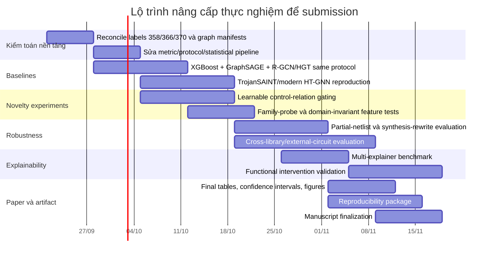

# Đánh giá chuyên sâu hướng nghiên cứu Semantic Graph + Heterogeneous GNN cho Hardware Trojan Detection

## Executive summary

Tôi đã đối chiếu bản thảo nghiên cứu bạn cung cấp với bản **arXiv:2601.18696v7** của Whitten, Wolff và Papachristou, đồng thời rà soát các công trình gần nhất về node-level Hardware Trojan detection, graph learning, heterogeneous graphs, subgraph localization, explainability, class imbalance và robustness. Bản thảo của bạn hiện mô tả khá đầy đủ hướng **Heterogeneous Bipartite Cell–Net Graph IR + relation-aware GNN + control-edge handling + strict LOFO + Graph XAI**, vì vậy tôi **không áp dụng giả định “hướng nghiên cứu không được mô tả”**. fileciteturn0file0

**Kết luận trực tiếp cho ba câu hỏi của bạn:**

| Câu hỏi | Đánh giá | Kết luận |
|---|---:|---|
| **Hướng nghiên cứu có ổn không?** | **Có, và khá đúng hướng** | Điểm mạnh nhất không phải “dùng GNN”, mà là chuyển câu hỏi từ *in-distribution detection* sang **cross-family/OOD generalization**, đúng vào điểm baseline v7 thừa nhận còn yếu: XGBoost rơi xuống Micro-F1 ≈ 0.033 trong strict LOFO. citeturn13view3turn13view4 |
| **Đóng góp có giá trị so với SOTA không?** | **Có, nhưng novelty hiện ở mức khá chứ chưa đủ để tuyên bố đột phá** | Tôi không tìm thấy công trình nào trong khảo sát mục tiêu có **đúng tổ hợp**: explicit typed `Cell–Net` bipartite IR + data/control relations + relation-specific message passing + control-edge ablation dưới strict family-held-out evaluation + connected physical subgraph localization. Tuy nhiên, từng thành phần riêng lẻ đã có tiền lệ: heterogeneous HT graph, edge-aware GNN, subgraph localization, GNN XAI đều đã xuất hiện. citeturn28search2turn28academia24 |
| **Bản hiện tại đủ publish chưa?** | **Luận văn: mạnh. Paper top-tier: chưa** | Có vài lỗ hổng reviewer rất dễ đánh trúng: baseline chưa đủ hiện đại, so sánh một số metric chưa apples-to-apples, kiểm định thống kê có nguy cơ pseudoreplication, “causal XAI” bị overclaim, cơ chế over-smoothing chưa được chứng minh đủ chặt, và chỉ có một benchmark ecosystem Trust-Hub. |
| **Điểm mạnh nhất để xây paper** | **OOD generalization + semantic representation** | Đây là “research story” tốt hơn nhiều so với câu chuyện “GNN tốt hơn XGBoost”. Baseline cũng xác nhận random split chỉ là controlled XAI condition chứ không phản ánh deployment trên thiết kế chưa thấy. citeturn13view2turn13view3 |
| **Điều cần sửa đầu tiên** | **Experimental rigor** | Trước khi thêm mô hình phức tạp hơn, cần sửa protocol, baseline fairness, statistical unit, dataset audit và XAI claims. Đây có khả năng tăng publishability nhiều hơn việc thêm một attention layer. |

Nhìn tổng thể, tôi chấm trạng thái hiện tại khoảng **3.6/5 về research readiness**: đủ tạo thành một luận văn thạc sĩ có chiều sâu và một paper conference có triển vọng, nhưng cần một vòng nâng cấp đáng kể để cạnh tranh chắc chắn ở HOST/DATE, và cần thêm external validation/scalability/robustness nếu nhắm DAC hoặc TCAD.

Điểm tôi đánh giá **thực sự có giá trị học thuật** là:

> **Không coi netlist chỉ là một graph đồng nhất của các gate; thay vào đó, biểu diễn nó dưới dạng typed Cell–Net relational graph và nghiên cứu có kiểm soát xem semantics của interconnect, đặc biệt global control relations, ảnh hưởng thế nào tới cross-family generalization.**

Đây là framing mạnh hơn rất nhiều so với “đề xuất HeteroGNN mới”.

Ngược lại, tôi **không khuyến nghị** đặt novelty chính vào “heterogeneous GNN”, “Graph XAI”, hay “subgraph localization” vì các trục đó đã có công trình gần đây cạnh tranh trực tiếp. TrojanHound năm 2025 đã kết hợp GNN với subgraph fusion/topology-aware diagnosis và báo cáo TPR 95.64%, F1 97.44% trên 14 Trust-Hub designs; TrojanSAINT đã làm inductive sampling và localization; SMOTrojan đã xử lý imbalance trực tiếp trên graph; các nghiên cứu mới năm 2026 tiếp tục tiến rất nhanh theo hướng subgraph và unified GNN pipelines. citeturn28search2turn28academia24turn28search0turn28search6

## Baseline Whitten–Wolff–Papachristou: đóng góp, phương pháp, kết quả và giới hạn

Baseline v7 là một paper về **explainability cho Hardware Trojan detection**, không phải một paper đề xuất GNN. Điều này quan trọng vì bản thảo của bạn đôi lúc đang đối xử với baseline như thể nó là “graph-learning baseline”. Tên paper là *Explainability Methods for Hardware Trojan Detection: A Systematic Comparison*, của Paul Whitten, Francis Wolff và Chris Papachristou. citeturn27academia25turn13view0

**Đóng góp trung tâm của baseline** là so sánh ba họ giải thích trên bài toán gate-level Trojan detection: property/domain-aware reasoning trên các tổ hợp đặc trưng circuit, case-based reasoning bằng nearest neighbours, và generic attribution như LIME/SHAP/gradient. Các detector nền là những mô hình tabular như XGBoost/Random Forest hoạt động trên năm structural features liên quan fan-in, flip-flop distance và I/O distance. citeturn13view0

Baseline sử dụng **30 Trust-Hub gate-level netlists**, tổng cộng khoảng **56,959 gates và 358 Trojan gates**, tức imbalance rất mạnh; paper xem xét cả random node split lẫn các protocol nhằm kiểm tra transfer giữa circuit/family. citeturn13view1

Trong primary random 60/20/20 split của v7, XGBoost báo cáo khoảng **Precision 48.08%, Recall 69.44%, F1 0.568, MCC 0.575 và AUPRC 0.637**, với decision threshold khoảng 0.940. Những số này có ý nghĩa chủ yếu trong controlled in-distribution/XAI setting. citeturn13view0

Điểm đáng chú ý nhất đối với đề tài của bạn là **strict LOFO**. Khi giữ threshold cố định nhất quán với detector ban đầu, XGBoost giảm xuống khoảng **Precision 0.025, Recall 0.048, Micro-F1 0.033, MCC 0.026**; Random Forest còn thấp hơn. Kết quả per-family cũng rất yếu: F1 xấp xỉ 0.052 trên RS232, 0.077 trên s15850, 0.015 trên s35932, 0.018 trên s38417 và 0.011 trên s38584. citeturn13view3turn13view4

Quan trọng hơn, chính baseline không cố “giấu” vấn đề này. Paper giải thích rằng circuit-size/connectivity distribution ảnh hưởng mạnh tới các feature khoảng cách và xem cross-family robustness cùng richer local graph representations là hướng mở. Paper cũng nói rõ random split hữu ích như một controlled experiment cho XAI nhưng **không nên được diễn giải như performance trên một thiết kế mới chưa thấy**. citeturn13view2turn13view3

Các limitation mà baseline tự thừa nhận cũng khá sát với động cơ nghiên cứu của bạn: benchmark chủ yếu là synthetic/digital gate-level Trust-Hub; feature space còn hẹp, không có functional/timing/power information; vẫn bỏ sót đáng kể Trojan; chưa có human study với kỹ sư; và chưa bao phủ tốt những lớp Trojan như analog/mixed-signal hoặc những trigger phức tạp hơn. citeturn13view2

### Baseline còn thiếu gì, và đề tài của bạn sửa được đến đâu?

| Điểm yếu baseline | Đề tài của bạn xử lý | Đánh giá của tôi |
|---|---|---|
| Tabular feature vectors không trực tiếp mô hình hóa neighbourhood | Typed Cell–Net graph + message passing | **Khắc phục tốt về nguyên lý**. fileciteturn0file0 |
| Strict LOFO collapse | LOFO là protocol chính, Config F đạt Macro-F1 0.5239 ± 0.0454 trong kết quả nội bộ | **Đây là đóng góp mạnh nhất**, nếu baseline hiện đại cũng được chạy cùng protocol. fileciteturn0file0 |
| Không giữ explicit interconnect semantics | Net node được bảo toàn | **Có ý nghĩa EDA**, nhưng cần chứng minh hiệu quả vượt qua việc đơn giản tăng capacity. |
| Không phân biệt data/control relation trong learning | Six typed relations + control filtering | **Có khả năng novelty cao nhất**, nhưng hard deletion hiện hơi thô. |
| XAI chỉ cung cấp rules/precedents/feature scores | Connected Cell–Net explanatory subgraph | **Hữu ích hơn về actionability**, nhưng chưa được phép gọi là causal. |
| Single benchmark ecosystem | Đề tài vẫn chủ yếu Trust-Hub | **Chưa khắc phục**. |
| Generalization sang unseen Trojan mechanisms | LOFO là unseen circuit family, không nhất thiết unseen Trojan mechanism | **Chưa chứng minh zero-day**. |

Một chi tiết rất quan trọng: baseline **không phải** “Config A”. Baseline của Whitten et al. là tabular detector. `Config A = compressed homogeneous GraphSAGE` trong bản thảo của bạn là **một baseline do bạn xây dựng trên representation kiểu compressed graph**, chứ không phải reproduction của mô hình Whitten. fileciteturn0file0 Vì vậy, trong paper nên đổi tên:

> `Config A: Compressed-Graph GraphSAGE Control`

thay vì gọi nó là *Whitten baseline* hoặc *reference baseline reproduction*.

### Một lỗi so sánh cần sửa ngay

Trong abstract của bản thảo hiện có câu tương đương “Macro-F1 = 0.5239 vượt baseline 0.0300 / +0.4939”. Điều đó chỉ hợp lệ **nếu 0.0300 là kết quả XGBoost do bạn rerun dưới chính xác cùng LOFO protocol, cùng node universe và cùng threshold-selection policy**. fileciteturn0file0

Không nên lấy trực tiếp **0.5239 Macro-F1** của Config F trừ **0.033 Micro-F1** trong Table LOFO của paper gốc, bởi đó là hai aggregation khác nhau và baseline gốc sử dụng fixed threshold. Paper gốc thật sự báo cáo Micro-F1 ≈ 0.033. citeturn13view3turn13view4

Cách trình bày an toàn:

> “Under our unified LOFO re-evaluation protocol, the five-feature XGBoost baseline attains Macro-F1 = 0.0300, whereas our method attains 0.5239 ± 0.0454.”

Sau đó tách riêng:

> “The original baseline paper independently reported Micro-F1 = 0.033 under fixed-threshold strict LOFO.”

Như vậy reviewer không thể bắt lỗi apples-to-oranges.

## Kiểm toán hướng nghiên cứu hiện tại: điểm mạnh và những chỗ reviewer sẽ tấn công

Bản thảo của bạn hiện có một research story khá hoàn chỉnh: explicit bipartite `Cell–Net` IR, relation-specific HeteroConv, tách data/control path, 5-versus-13 feature factorial ablation, LOFO, Dirichlet analysis và GNNExplainer. Các kết quả chính như Config C/D/E/F và Config F = **0.5239 ± 0.0454 Macro-F1, PR-AUC 0.5731 ± 0.0195, MCC 0.5473 ± 0.0336** đều được mô tả trong bản thảo. fileciteturn0file0

Tuy nhiên, có tám vấn đề tôi sẽ sửa trước khi gửi paper.

**Thứ nhất, Config B → C chưa cô lập hoàn toàn “relation semantics”.** HeteroConv có relation-specific modules nên thường có nhiều tham số hơn homogeneous GraphSAGE. Nếu C tốt hơn B, reviewer có quyền hỏi: “Do edge typing tốt hơn, hay đơn giản model có capacity lớn hơn?” Bản thảo hiện diễn giải mức tăng B→C như bằng chứng trực tiếp rằng edge semantics là nguyên nhân; kết luận này đang mạnh hơn experimental control. fileciteturn0file0

Cần thêm **parameter-matched controls**: homogeneous model có hidden width tăng sao cho parameter count tương đương; relation-aware model với shared weights nhưng relation embeddings; và full relation-specific model. Khi đó mới tách được “capacity effect” khỏi “semantic relation effect”.

**Thứ hai, RQ1 A→B bị confound bởi receptive-field semantics.** Bạn đã nhận ra điều này và chạy B-4L; đây là một điểm tốt. Tuy nhiên B-4L vẫn chỉ một seed theo bản thảo, trong khi C–F chạy ba seeds. fileciteturn0file0 Để claim “explicit bipartite representation by itself is insufficient”, A/B-2L/B-4L đều cần multi-seed, parameter-matched và cùng training budget.

**Thứ ba, statistical significance hiện có nguy cơ pseudoreplication.** Bạn đang dùng 5 LOFO families × 3 random seeds = 15 observations cho paired t-test/Wilcoxon và coi chúng gần như 15 independent observations. fileciteturn0file0 Nhưng ba seeds trên cùng một held-out family không phải ba independent experimental populations; chúng là repeated stochastic fits trên cùng test distribution.

Vì vậy câu “p < 0.01 chặn đứng hoàn toàn nghi vấn ngẫu nhiên” nên bỏ. Cách hợp lý hơn là báo cáo family-level effect size, hierarchical/bootstrap confidence intervals, permutation test tôn trọng grouping theo family, và seed variance như algorithmic variability. Với chỉ năm families, đừng cố tạo cảm giác inferential certainty cao hơn dữ liệu thực có.

**Thứ tư, bằng chứng “control edges gây over-smoothing” chưa phải proof.** Bản thảo có một inconsistency rất rõ: phần abstract nói Dirichlet energy thay đổi khoảng **0.0818 → 0.7816**, nhưng phần detailed experiment trên `RS232-T1000_90nm` lại có những giá trị như Layer-1 **0.2740 → 0.4856** và Layer-2 **0.2963 → 0.3756**. fileciteturn0file0 Hai bộ số cần được reconcile trước khi submission.

Thậm chí quan trọng hơn: nếu bạn tính Dirichlet energy của Config C trên graph có control edges và Config D trên graph đã xóa control edges, thì **energy operator cũng thay đổi**. Chênh lệch \(E_D\) khi đó có thể đến một phần từ thay đổi \(E\), không chỉ từ embeddings. Do đó chưa thể nói “chứng minh control edges gây over-smoothing”.

Cách mạnh hơn là đánh giá embeddings C và D trên **cùng một reference edge set**, chẳng hạn data edges chung; đồng thời đo node-pair cosine similarity trên cùng sampled node pairs, embedding covariance rank, class separation, neighbourhood effective size và oversquashing indicators. Lặp trên toàn bộ test circuits thay vì một RS232 example.

**Thứ năm, “causal Graph XAI” hiện là overclaim.** GNNExplainer là post-hoc predictive explainer. Một subgraph giữ nguyên output của model không tự động trở thành nguyên nhân chức năng của Trojan. Đặc biệt, bản thảo báo cáo mean native Fidelity+ khoảng **−0.0273** và mean normalized necessity chỉ **5.11%**, mặc dù Fidelity− ≈ 0 và localization precision 30.7%. fileciteturn0file0 Điều này cho thấy evidence về *sufficiency* mạnh hơn nhiều so với evidence về *necessity*.

Tên phù hợp hiện tại là:

> **connected predictive subgraph**,  
> **model-relevant computational subgraph**, hoặc  
> **structure-aware Trojan localization explanation**.

Chỉ dùng từ **causal** sau khi có intervention: xóa/neutralize predicted trigger/payload logic và chứng minh Trojan functionality biến mất trong simulation/formal analysis trong khi benign functionality được bảo toàn. Xu hướng gần đây cũng đã đưa causality vào explainable hardware-Trojan learning, nên “causal” là một từ reviewer sẽ kiểm tra khá nghiêm. citeturn19search0

**Thứ sáu, “SDC/Liberty cho control classification chính xác 100%” là phát biểu quá mạnh.** SDC/Liberty rõ ràng giúp nhận diện clock/control semantics tốt hơn string heuristic, nhưng một real design còn có generated clocks, clock muxes, scan/test mode, asynchronous controls, enables và proprietary cell conventions. Không nên biến “industrial metadata tốt hơn” thành “100% accuracy”. fileciteturn0file0

Nên viết:

> “Industrial timing/library metadata can replace name-based heuristics with substantially more robust, design-aware control semantics.”

**Thứ bảy, giải thích chênh lệch 358 vs 370 Trojan gates chưa đủ chứng cứ.** Baseline xác nhận node universe của họ có 358 Trojan gates. citeturn13view1 Bản thảo của bạn quy nguyên nhân cho `merge_cells/remove_cells` làm biến mất 12 gates. fileciteturn0file0 Đây là một causal accusation về preprocessing và phải được chứng minh bằng một **ID-level reconciliation table**:

`metadata Trojan ID → raw Verilog instance → CircuitGraph node before merge → node after merge → retained/dropped reason`.

Cho tới khi có audit đó, chỉ nên nói:

> “Our parser yields a different Trojan-node count from the baseline implementation; the discrepancy is under instance-level audit.”

Riêng việc xác định upstream netlist có một số metadata mismatch là hợp lý, nhưng đừng suy ra toàn bộ 12 gates đều do compression.

**Thứ tám, 13 handcrafted topology features có thể tái tạo đúng vấn đề “circuit coordinate memorization” mà bạn đang phê bình baseline.** PageRank, closeness, betweenness, core number, logic-depth ratio đều có thể mang dấu vết rất mạnh của family/graph size. fileciteturn0file0 Việc Config E/F tăng mạnh chưa chứng minh đó là family-invariant information.

Một test rất đáng làm là: dùng 13 features để **predict circuit family**. Nếu family classifier đạt accuracy rất cao, feature representation của bạn vẫn chứa domain identity đáng kể. Sau đó thử per-circuit percentile/rank normalization, local-only descriptors và remove-one-feature-group ablation. Nếu F vẫn tốt sau khi domain identity giảm, câu chuyện OOD sẽ mạnh hơn đáng kể.

Ngoài ra, random node split của một GNN trên cùng graph nên gọi chính xác là **transductive in-distribution node classification**, không phải evidence về deployment generalization: test-node features và topology vẫn có thể tham gia message passing dù labels bị mask. Strict family-held-out LOFO mới nên là headline result.

## Đối chiếu với nghiên cứu gần nhất và đánh giá novelty

Bảng dưới đây dùng **kết quả do chính từng paper báo cáo theo protocol của họ**. Các con số **không thể được đặt cạnh Macro-F1 = 0.5239 của bạn rồi kết luận ai “tốt hơn”**, vì dataset subset, split, node definition, threshold và aggregation khác nhau. Chính việc thiếu protocol đồng nhất trong literature là lý do bạn nên re-run modern baselines dưới LOFO của mình.

| Công trình | Năm / venue | Phương pháp chính | Kết quả tác giả báo cáo | Điểm mạnh | Điểm yếu so với câu hỏi của bạn |
|---|---|---|---|---|---|
| **NHTD-GL / Node-Wise Hardware Trojan Detection Based on Graph Learning** | arXiv 2021; IEEE TC publication | Node-wise graph learning cho gate-level netlist | Báo cáo accuracy ≈ 0.998, F1 ≈ 0.921 trong setting của paper. citeturn16search0 | Một trong các nền tảng node-level graph HT detection quan trọng | Không phải strict five-family LOFO của bạn; không tập trung explicit Cell–Net/control semantics |
| **Golden Reference-Free HT Localization using GCN / GNN4HT lineage** | 2022 → TCAD lineage | Chuyển circuit thành graph, GCN tự học node representation và localization | Paper arXiv báo cáo F1 ≈ 93.1%, accuracy 99.6%, FPR <0.009% trong protocol của họ. citeturn28academia25 | Golden-reference-free, localization trực tiếp | High score không chứng minh unseen-family OOD; graph semantics khác đề tài |
| **TrojanSAINT** | 2023, ISCAS | Sampling-based inductive GNN cho gate-level detection/localization | Practical validation: TPR trung bình 78%, TNR 85%; best-case 98%/96%; code/results được phát hành. citeturn28academia24 | Inductive, scalable hơn full-graph, có artifact | Không tập trung typed interconnect/control relations; là baseline rất đáng re-run |
| **BadGNN / poisoned-GNN robustness line** | 2023 | Adversarial/backdoor structural perturbation chống lại GNN hardware-security detector | Paper cho thấy minor circuit perturbations có thể giúp attack evade GNN với attack success rất cao. citeturn28academia27 | Cảnh báo graph model có thể dễ bị adversarial structure | Bản thảo hiện chưa kiểm tra robustness; đây là khoảng trống quan trọng |
| **FP-GNN** | 2025, IEICE Trans. Information | GNN gate-level với mục tiêu giảm phụ thuộc manually extracted fixed features và xử lý structural shift | Paper được thúc đẩy bởi failure của feature-based detector trên structurally different generated circuits. citeturn28search8 | Rất sát luận điểm “handcrafted feature generalization fails” | Bạn cần phân biệt novelty của mình với hướng graph-generalization này |
| **Hardware Trojan Detection Methods for Gate-Level Netlists Based on GNNs** | 2025, IEEE Transactions on Computers | Harmonic centrality + GraphSAGE/LSTM/POOL, weighting cho imbalance | Báo cáo các F1 khoảng 90%+ trên các benchmark/configuration của paper, với một số sequential settings rất cao. citeturn10search4 | Modern node-GNN baseline, imbalance-aware | Protocol không tương đương LOFO; cần đưa vào benchmark thống nhất |
| **TrojanHound** | 2025, IEICE Electronics Express | GateGNN → multi-suspect subgraph fusion → topology-aware verification bằng betweenness | 14 Trust-Hub benchmarks: TPR 95.64%, F1 97.44%, paper báo cáo zero false positives. citeturn28search2 | **Competitor gần nhất về subgraph/actionability** | Không nên claim bạn là người đầu tiên đưa structure-aware subgraph localization vào HT detection |
| **HGAT4TJ** | 2025, IEICE Electronics Express | Heterogeneous graph attention, kết hợp gate/transistor-level representations | Báo cáo circuit-level detection 100% và node-level accuracy >97% trong experiments của paper. citeturn11search13 | **Quan trọng: heterogeneous HT graph đã tồn tại** | Novelty của bạn phải là *Cell–Net typed semantics + LOFO/control relation*, không phải “first heterogeneous graph” |
| **SALTY** | 2025, arXiv | Jumping-Knowledge GNN + XAI-guided structural post-processing | Báo cáo khoảng 98% TPR/TNR trên tập benchmark rộng theo protocol riêng. citeturn28academia26 | Kết hợp detection và XAI/structural analysis | Làm yếu claim rằng “GNN + XAI cho HT” tự thân là mới |
| **HTOD-BGNN** | 2026, IEEE Transactions on Computers | Bidirectional jumping-knowledge + two-stage/object-style localization/refinement | Báo cáo trigger detection 100%, payload 87.5%; localization F1 khoảng 54.01 trên Trust-Hub và 90.04 trên TRIT setting. citeturn12search0 | **Rất gần bạn về localization và khả năng unseen-scenario** | Phải là một modern baseline bắt buộc nếu code/data khả dụng |
| **SMOTrojan** | 2026, Microelectronics Journal | GNN + graph-SMOTE; tạo synthetic minority nodes và topology-preserving synthetic edges | Trên 17 Trust-Hub circuits, paper báo cáo GCN F1 ≈ 94.21%, cùng kết quả GAT/GraphSAGE thấp hơn một chút. citeturn28search0 | Xử lý class imbalance trực tiếp trong graph | Bạn hiện chỉ weighted BCE; imbalance contribution không phải SOTA |
| **SubG4TJ** | 2026, Expert Systems with Applications | LTG-aware subgraph extraction + multidimensional attributes + collaborative subgraph classification | Publisher highlights báo cáo TPR tăng tới 13.6% và speedup tới khoảng 120× trong các comparisons. citeturn28search9 | Subgraph-centric và efficiency-aware | Là một competitor mới cho câu chuyện “local structural motif” |
| **A unified GNN pipeline for HT detection** | Sep. 2026, Integration | Standardized RTL→netlist graph flow + lightweight GNN + saliency-guided subgraph extraction | Publisher mô tả validation trên AES/PIC16F84 và “strong generalization”; abstract được index hiện không cho con số đủ để so sánh định lượng. citeturn28search6 | **Rất mới**, standardized pipeline + interpretable subgraphs | Là bằng chứng literature đang hội tụ nhanh vào graph+localization; paper của bạn cần claim cụ thể hơn |
| **ADVERSARIAL/AIG-assisted line** | 2026, arXiv | AIG representation + relational/KGE-style encoding nhằm scale theo số edges | Nhấn mạnh constant-size node representation và scalability trên hardware graph lớn. citeturn10academia15 | Thách thức trực tiếp về scalability/representation | Cell–Net IR của bạn sẽ bị hỏi memory cost trên SoC lớn |

Ở nguồn Việt Nam, tìm kiếm có mục tiêu cho thấy đã có hoạt động nghiên cứu trong nước về Hardware Trojan, ví dụ hệ thống detection dựa trên **side-channel/near-field electromagnetic scanning** ở Lê Quý Đôn, thử nghiệm trên FPGA/AES và báo cáo accuracy khoảng 95%. Tuy nhiên tôi **không tìm thấy trong lần khảo sát này một công trình Việt Nam peer-reviewed, trực tiếp tương đương bài toán node-level gate-netlist GNN + strict LOFO**; vì vậy không nên kéo một paper side-channel vào bảng SOTA chỉ để có “nguồn Việt Nam”. citeturn18search7

### Novelty thực sự nằm ở đâu?

Sau khi đối chiếu literature, tôi sẽ **không** viết:

> “We are the first heterogeneous GNN for Hardware Trojan detection.”

HGAT4TJ đã làm heterogeneous graph learning. citeturn11search13

Tôi cũng sẽ **không** viết:

> “We are the first to localize Trojans using explanatory subgraphs.”

TrojanHound, TrojanSAINT, SALTY và các GNN localization works đã chiếm phần lớn không gian claim đó. citeturn28search2turn28academia24turn28academia26

Một claim có khả năng bảo vệ tốt hơn là:

> **“We investigate semantics-preserving Cell–Net relational representations for cross-family node-level Hardware Trojan localization, explicitly separating data and global-control relations and quantifying their effect on OOD generalization under family-held-out evaluation.”**

Và nếu literature search cuối cùng vẫn không tìm thấy exact match:

> **“To the best of our targeted literature review, we found no prior work that jointly evaluates an explicit typed Cell–Net bipartite representation, relation-specific control/data message passing, and strict family-held-out generalization for gate-level Trojan localization.”**

Từ “jointly” ở đây rất quan trọng.

### Chấm novelty hiện tại

| Tiêu chí | Điểm hiện tại | Nhận định |
|---|---:|---|
| **Originality** | **3.5/5** | Cell–Net relational IR + control semantics + LOFO combination khá mới; nhưng heterogeneous GNN, graph localization và graph XAI riêng lẻ không mới. |
| **Technical depth** | **4.0/5** | Có parser/IR, typed relations, GNN, factorial ablation, OOD, representation analysis và XAI. Điểm trừ là mechanism evidence và causal interpretation còn chưa chặt. |
| **Empirical evidence** | **3.3/5** | 30 circuits + family-held-out protocol + multi-seed là tốt; nhưng chỉ 5 families, 22/30 nằm ở RS232, một số families chỉ có 1–3 designs, A/B chưa multi-seed đầy đủ và thiếu modern same-protocol baselines. fileciteturn0file0 |
| **Reproducibility** | **3.0/5** | Bản thảo mô tả architecture/seeds khá rõ nhưng chưa thấy public artifact hoàn chỉnh với exact split manifests, hashes, environment và one-command reproduction. |
| **Potential impact** | **4.0/5** | Cross-design generalization và physical netlist localization có ý nghĩa trực tiếp với hardware-security/EDA; nhưng industrial claims hiện vượt evidence. |
| **Tổng quan** | **≈3.6/5** | **Publishable direction**, nhưng cần experimental strengthening để trở thành strong paper. |

Một điểm đáng lưu ý: trong exact targeted search của tôi, **không thấy exact prior combination** của typed Cell–Net bipartite graph + data/control relation intervention + strict LOFO + physical subgraph explanation. Tuy nhiên “không tìm thấy” không phải bằng chứng toán học rằng bạn là người đầu tiên; vì vậy nên dùng *“to the best of our review”* thay vì claim tuyệt đối.

## Năm cải tiến kỹ thuật nên ưu tiên và kế hoạch thực nghiệm

Tôi sẽ không ưu tiên “thêm Transformer” hay “đổi GraphSAGE sang GAT” một cách máy móc. Năm cải tiến dưới đây đều nhằm giải quyết một reviewer objection cụ thể.

| Cải tiến | Giả thuyết cần kiểm chứng | Thiết kế thí nghiệm | Baseline / ablation quan trọng | Độ khó | Rủi ro |
|---|---|---|---|---:|---|
| **Learnable control-relation gating thay hard deletion** | Clock/reset không phải lúc nào cũng noise; model nên học khi nào control relation hữu ích | Trust-Hub LOFO + sequential-trigger circuits nếu có; gate \(g_r\) cho `clock/reset/scan/data`, relation dropout | Control ON, hard OFF, scalar gate, node-conditioned gate, R-GCN/HGT, remove-clock-only/remove-reset-only | Trung bình | Gate có thể overfit family; cần regularization |
| **Domain-invariant / self-supervised relational pretraining** | Local functional motifs transfer tốt hơn absolute circuit coordinates | Masked cell type, relation prediction, contrastive local subgraphs; sau đó LOFO fine-tune | Scratch Config F, SSL pretrain, adversarial family-invariant head, feature-rank normalization | Cao | Positive augmentation có thể phá Trojan semantics |
| **Robustness với incomplete/adversarial netlists** | Semantic relational IR phải chịu được missing/rewritten structure mới có giá trị security | Drop edge/node 5–30%, black-box regions, synthesis-equivalent rewrites, partial netlist | Config F, compressed GraphSAGE, modern GNN; random vs topology-aware corruption | Cao | Khó đảm bảo rewrite giữ đúng ground truth |
| **Interventional XAI thay “causal” post-hoc claim** | Explanation đúng phải liên quan tới Trojan functionality chứ không chỉ model score | GNNExplainer/PGExplainer/SubgraphX/counterfactual; remove/neutralize predicted logic rồi simulate/formal check | Random subgraph, high-centrality subgraph, ground-truth Trojan nodes, multiple explainers | Cao | Ground truth có thể không phân tách trigger/payload đầy đủ |
| **Same-protocol SOTA benchmark + rigorous statistics/artifact** | Gain vẫn tồn tại khi modern baselines và statistical unit đúng được kiểm soát | Re-run 4–6 SOTA/generic graph models cùng exact parser/splits/features; 5–10 seeds; hierarchical bootstrap | XGBoost, GraphSAGE, R-GCN/HGT, TrojanSAINT-like, HTOD-like, imbalance-aware baseline | Cao nhưng bắt buộc | Reproduction cost lớn; nhưng đây là cải tiến publishability quan trọng nhất |

**Cải tiến quan trọng nhất về kiến trúc là learnable control gating.** Hard-removing clock/reset là một result thú vị, nhưng reviewer có thể phản biện ngay: Trojan sequential hoàn toàn có thể phụ thuộc clock/reset/control conditions; xóa chúng có thể làm tăng benchmark F1 vì dataset hiện tại thuận lợi, nhưng đánh mất semantic evidence trong một lớp attack khác. Baseline cũng thừa nhận coverage của sequential-trigger attacks còn hạn chế. citeturn13view2

Một phiên bản mạnh hơn:

\[
m_v^{(l)}
=
\sum_{r\in \mathcal R}
g_r(v)\,
\mathrm{SAGE}_r
\left(
h_v^{(l-1)},
\{h_u:u\in\mathcal N_r(v)\}
\right)
\]

với \(g_r(v)\in[0,1]\) là learnable gate. Khi đó paper có thể hỏi một câu khoa học sâu hơn:

> “Does the model learn to suppress globally broadcast control relations while retaining locally discriminative control dependencies?”

Đó là contribution hấp dẫn hơn “we delete clocks”.

Metrics không chỉ nên có Macro-F1/PR-AUC/MCC. Thêm **worst-family F1**, Recall@fixed-FPR, Precision@K, calibration ECE/Brier, và per-family confidence intervals. Với security application, average score đẹp nhưng một family F1 gần 0 vẫn là vấn đề deployment.

**Cải tiến domain invariance** cũng rất quan trọng vì chính Config F vẫn dựa trên PageRank, closeness, core number và global distance features. Một experiment đơn giản nhưng rất giàu thông tin:

\[
\text{FamilyProbeAcc} =
\operatorname{Acc}
(\text{classifier}(x_v)\rightarrow \text{family})
\]

Chạy probe trên:
- 5 baseline Hasegawa features;
- 13 features;
- learned embeddings Config F;
- embeddings sau domain-adversarial training.

Mục tiêu không phải family accuracy bằng zero, mà là chứng minh representation của bạn giữ Trojan discrimination trong khi giảm family identity. Đó mới là evidence trực tiếp cho claim “family-invariant”.

**Robustness experiment** nên được xem là security requirement chứ không phải phụ lục. BadGNN đã cho thấy GNN hardware-security detector có thể bị structural perturbations qua mặt. citeturn28academia27 Một detector security-critical mà chỉ tốt trên canonical netlist có thể học synthesis fingerprint nhiều hơn Trojan semantics.

Tôi đề xuất corruption matrix:

| Perturbation | Mức |
|---|---|
| Random edge masking | 5%, 10%, 20%, 30% |
| Net-node masking | 5%, 10%, 20% |
| Benign buffer insertion/removal | nhiều budget |
| Equivalent De Morgan rewrite | nhiều budget |
| Black-box module hiding | module-level |
| Control-net uncertainty | 5–20% relation-label noise |

Báo cáo **relative performance retention**:

\[
R(p)=
\frac{F_1(\text{perturbation level } p)}
{F_1(\text{clean})}.
\]

Một Config F có clean F1 thấp hơn chút nhưng giữ 90% performance sau structural rewrite có thể thuyết phục hơn một model clean F1 rất cao nhưng collapse dưới synthesis change.

**XAI cần chuyển từ score explanation sang functional validation.** TrojanHound đã tiến vào territory structure-aware diagnosis. citeturn28search2 Để vượt lên, bạn nên hỏi:

> “Nếu loại bỏ/neutralize subgraph mà explainer cho là Trojan-relevant, hành vi độc hại có thật sự biến mất không?”

Có thể định nghĩa:

\[
\text{Functional Removal Success}
=
\frac{
\#\{\text{HT cases disabled after intervention}\}
}{
\#\{\text{explained HT cases}\}
}.
\]

Và đồng thời đo benign preservation:

\[
\text{Benign Preservation}
=
\Pr[
f_{\mathrm{functional}}^{\mathrm{benign}}
\text{ remains equivalent}
].
\]

Nếu đạt kết quả tốt, khi đó “actionable XAI” của bạn sẽ có nền tảng mạnh hơn nhiều so với chỉ Fidelity−.

**Cuối cùng, same-protocol modern baseline là phần tôi xem là bắt buộc.** TrojanSAINT công bố artifacts, nên đây là một trong những ứng viên tốt để tái lập. citeturn28academia24 Ít nhất nên có:

XGBoost-5, XGBoost-13, GraphSAGE-compressed, GraphSAGE-bipartite, R-GCN, HGT/Hetero-GAT, một TrojanSAINT-style inductive model, và nếu khả thi một HTOD/TrojanHound-style structural competitor.

Tất cả dùng **cùng node universe, cùng Trojan labels, cùng held-out family, cùng validation-only threshold selection và cùng metrics**.

Khi đó Table chính của paper mới thực sự trả lời:

> “Under identical OOD evaluation, does semantic relational representation improve transfer?”

## Cách viết lại paper để tăng tính mới và publishability

Tôi khuyên **thu hẹp claim nhưng làm bằng chứng sâu hơn**. Hiện draft cố đồng thời kể bốn câu chuyện lớn: new representation, new GNN, LOFO generalization, causal XAI, industrial EDA pipeline. Kết quả là paper có nhiều “đóng góp”, nhưng mỗi claim lại có chỗ reviewer có thể phản công.

Research story mạnh nhất nên là:

> **Semantic relation modeling is necessary for cross-family generalization in gate-level Hardware Trojan localization.**

Graph XAI trở thành secondary contribution/actionability demonstration, không phải claim ngang hàng với OOD generalization trừ khi bạn làm thêm intervention experiments.

Một title tốt hơn bản hiện tại có thể là:

> **Semantics-Preserving Cell–Net Relational Graph Learning for Cross-Family Hardware Trojan Localization**

hoặc, nếu control gating được thêm:

> **Control-Aware Relational Graph Learning for Cross-Family Hardware Trojan Localization in Gate-Level Netlists**

Cấu trúc paper tôi đề xuất:

| Phần paper | Nội dung cần tập trung |
|---|---|
| **Introduction** | Đặt vấn đề đúng: random/transductive success ≠ unseen-design transfer. Trích strict LOFO collapse của baseline. Không mở đầu bằng “GNN is powerful”. citeturn13view3 |
| **Problem formulation & threat model** | Node-level digital gate-netlist HT localization; golden reference-free; training families ≠ test family; nêu rõ không claim analog/parametric HT |
| **Semantic Cell–Net IR** | Cell/Net types, directed relations, pin semantics, data/control taxonomy, formal graph definition |
| **Relational model** | Hetero message passing + learnable/hard control handling; parameter counts; complexity |
| **Evaluation protocol** | Strict LOFO, validation-only threshold, external/cross-library nếu có, imbalance metrics, statistical hierarchy |
| **Results & mechanism analysis** | Same-protocol SOTA table → representation/relation/control ablations → family-probe → representation smoothing analysis |
| **Actionable localization** | Connected subgraphs, XAI competitors, functional/interventional validation |
| **Limitations** | Dataset diversity, analog HT, incomplete labels, scaling, control semantics |

### Những câu nên bỏ hoặc viết lại

| Hiện tại | Nên thay bằng |
|---|---|
| “Khắc phục **triệt để** over-smoothing” | “Consistently mitigates representation homogenization under the evaluated circuits.” |
| “Chứng minh rằng…” từ một Dirichlet case study | “Provides supporting empirical evidence that…” |
| “Causal hardware subgraph” | “Model-relevant / intervention-validated subgraph”; chỉ dùng causal sau functional intervention |
| “100% chính xác nhờ SDC/Liberty” | “Enables more robust design-aware control identification than name heuristics” |
| “CircuitGraph làm biến mất 12 Trojan gates” | Chỉ nói sau instance-level audit |
| “Zero Trojan Escapes” | Chỉ dùng khi mọi held-out folds thực nghiệm đạt recall 100% ở Tier-1 threshold |
| “Industrial EDA-ready” | “Prototype workflow illustrating potential EDA integration” |
| “Fully reproducible” | Chỉ dùng sau khi phát hành code, manifests, environment, model checkpoints và hashes |
| “first heterogeneous HT GNN” | Không dùng; HGAT4TJ đã tồn tại. citeturn11search13 |

### Checklist trước submission

Một submission mạnh nên có **dataset manifest** ghi rõ từng circuit, family, technology, cell count, Trojan IDs, missing-label anomalies và SHA-256 của raw netlists. Điều này đặc biệt cần thiết vì bạn đã phát hiện mismatch 358/366/370 trong các pipeline. Baseline paper sử dụng 358 Trojan gates trong node universe của họ. citeturn13view1

Cần publish exact LOFO manifests và validation split; scaler fit chỉ trên train; threshold chọn chỉ trên validation; mọi model sử dụng cùng test labels đúng một lần. Hyperparameter search budget phải tương đương giữa proposed model và baselines.

Báo cáo **parameter count, GPU memory, preprocessing time, training time, inference/chip**, không chỉ GNNExplainer latency. Với bipartite IR, reviewer có thể hỏi ngay chi phí tăng nodes/edges so với compressed graph.

Mọi Config A–F quan trọng cần chạy cùng số seeds. Ba seeds là mức tối thiểu; năm seeds tốt hơn. Nhưng nhiều seeds không thay thế nhiều independent circuit families.

Nên báo cáo raw confusion matrices per family; Macro-F1, Micro-F1, PR-AUC, MCC, Recall@fixed FPR, worst-family F1 và calibration. Không dùng Accuracy làm headline vì imbalance rất mạnh.

Phải có **parameter-matched architecture controls** để B→C không bị giải thích bởi model capacity.

Statistical testing phải tôn trọng hierarchy `family → circuit → seed`; không coi 15 family-seed runs là 15 independent datasets.

Đối với XAI cần multiple seeds, multiple explainers, random/centrality baselines, stability và connectedness; tốt nhất thêm functional intervention.

Artifact tối thiểu gồm parser, graph builder, split manifests, environment lockfile/container, commands chạy từng table, checkpoints hoặc deterministic training script và raw CSV/JSON results.

### Venue phù hợp

**IEEE HOST** là fit tự nhiên nhất vì scope trực tiếp bao gồm hardware security, hardware attack/defense, Trojans và CAD/verification-related security. Theo thông tin CFP hiện tại cho chu kỳ HOST 2027, vẫn có submission cycle liên quan trong cuối năm 2026; cần đối chiếu deadline chính thức ngay trước submission vì lịch có nhiều vòng. citeturn25search1turn25search5 Một paper với strict LOFO + semantic netlist representation + security analysis rất hợp cộng đồng này.

**DATE** cũng phù hợp nếu nhấn mạnh **EDA representation, verification methodology và cross-design evaluation**, thay vì chỉ ML accuracy; DATE là một venue trung tâm cho design, automation và test. citeturn26search5

**DAC 2027** là mục tiêu tham vọng hơn. DAC tự mô tả là venue chủ chốt cho design/automation và có Security trong topic areas; research manuscripts hiện được công bố giới hạn 6 trang + 1 trang reference. Trang 2027 hiện ghi research manuscript deadline trong tháng 11/2026, và hội nghị diễn ra 11–14/7/2027 tại San Jose. citeturn27search0turn27search11 Với mức validation hiện tại tôi chưa ưu tiên DAC; với external cross-library evaluation, scalability và artifact mạnh thì câu chuyện sẽ hợp hơn.

**IEEE TCAD** là target journal tốt nếu mở rộng thành một study đầy đủ về representation/protocol/robustness. Scope của TCAD bao trùm algorithms, tools và methodologies cho IC design/verification/test, rất phù hợp nếu bài nhấn mạnh semantic IR như một EDA/security methodology hơn là một classifier đơn lẻ. citeturn27search12

**VTS** là lựa chọn tốt nếu framing nghiêng nhiều hơn về test/diagnosis/security verification. HOST/DATE phù hợp hơn cho phiên bản conference trước; TCAD phù hợp cho bản mở rộng có multiple datasets và robustness.

Tôi sẽ xếp target thực tế:

| Trạng thái | Target hợp lý |
|---|---|
| **Bản thảo hiện tại, chỉ polish** | Luận văn mạnh; conference paper còn borderline ở venue mạnh |
| **Sửa statistics + same-protocol modern baselines + parameter controls** | **HOST / VTS / DATE competitive** |
| **Thêm cross-library/external dataset + learnable control gating + robust XAI** | **Strong HOST/DATE; có cơ sở thử DAC** |
| **Thêm scalability, adversarial/partial-netlist robustness, public artifact, functional XAI validation** | **TCAD-level extended paper có câu chuyện tốt** |

## Lộ trình thực nghiệm, biểu đồ hiện tại và verdict cuối cùng

Biểu đồ dưới đây chỉ dùng **các con số nội bộ trong bản thảo của bạn**; nó hữu ích để thấy độ lớn effect trong protocol của bạn, nhưng **không phải biểu đồ SOTA cross-paper**, vì mỗi paper ngoài literature dùng protocol khác nhau. fileciteturn0file0

Điểm đáng chú ý nhất là progression từ XGBoost feature-only sang Config F. Nhưng interpretation đúng không phải “GNN luôn tốt hơn ML”; chính Config B cho thấy một graph representation không tương thích với learning architecture có thể còn tệ hơn compressed graph. Đây thực ra là một kết quả khoa học hay, nên giữ lại.

Tôi sẽ triển khai vòng experimental strengthening theo timeline sau:

### Verdict cuối cùng

**Về hướng nghiên cứu:** tôi đánh giá là **đúng và đáng tiếp tục**. Thậm chí, strict LOFO result của baseline v7 làm thesis motivation mạnh hơn đáng kể: chính baseline cho thấy detector feature-based gần như mất khả năng transfer giữa circuit families. citeturn13view3turn13view4 Hướng chuyển sang semantic relational graph vì vậy không phải “đổi model cho hiện đại”, mà có một failure mode cụ thể để giải quyết.

**Về giá trị đóng góp:** **có giá trị nghiên cứu**, nhưng novelty cần được định vị hẹp và chính xác. Thành phần mạnh nhất là **semantics-preserving Cell–Net relational representation + explicit data/control relation analysis dưới family-held-out OOD**. Heterogeneous GNN, Graph XAI và subgraph localization riêng lẻ đều không còn là novelty đủ mạnh vào năm 2026. citeturn11search13turn28search2turn28academia26

**Về bằng chứng hiện tại:** LOFO Config F = **0.5239 ± 0.0454 Macro-F1** là promising và chênh lệch so với tabular rerun rất lớn, nhưng nó chưa đủ để nói “state of the art” cho tới khi TrojanSAINT/modern GNN/R-GCN/HGT/HTOD-like methods được đưa vào **chính xác cùng protocol**. fileciteturn0file0 SOTA papers báo cáo nhiều F1 ở mức 90%+, nhưng do evaluation khác nhau, dùng những con số đó để phủ nhận hoặc khẳng định ưu thế của bạn đều sai phương pháp luận. citeturn28academia24turn28search0turn28search2

**Về phần XAI:** kết quả localization precision 30.7% từ prevalence khoảng dưới 1% là đáng chú ý trong bản thảo, nhưng **Fidelity− = 0 không đồng nghĩa causality**, đặc biệt khi mean necessity/Fidelity+ không mạnh. fileciteturn0file0 Functional intervention là thí nghiệm có khả năng nâng phần này từ “nice visualization” lên một research contribution thực sự.

**Về statistical claims:** đây hiện là rủi ro lớn nhất mà không cần thêm mô hình nào để sửa. Không nên dùng 15 seed×family observations như 15 independent experimental units rồi tuyên bố rất mạnh về \(p<0.01\). Cần hierarchical uncertainty và effect-size reporting.

**Về control-edge contribution:** result C→D và E→F rất thú vị, nhưng interpretation hiện hơi quá sớm. Hard removal nên trở thành bước đầu của một câu chuyện lớn hơn về **control-aware relational filtering/gating**. Nếu learnable model tự động suppress global clock/reset broadcast nhưng giữ local sequential control evidence, contribution sẽ vừa mới hơn vừa ít benchmark-specific hơn.

**Về publishability:** trong trạng thái hiện tại, tôi xem đây là một **luận văn thạc sĩ mạnh nhưng paper còn có nguy cơ bị reviewer đánh “interesting engineering integration, insufficiently isolated novelty/validation.”** Sau khi làm ba việc tối thiểu — **same-protocol modern baselines, statistical correction, parameter-matched/control-gating ablations** — mức thuyết phục sẽ tăng rõ rệt. Nếu thêm **external/cross-library validation + adversarial/partial-netlist robustness + intervention-validated XAI**, công trình chuyển từ “một HeteroGNN tốt trên Trust-Hub” thành một câu chuyện có tính tổng quát hơn về **semantic graph representation for trustworthy cross-design hardware-security learning**, và đó là định vị có tiềm năng publish mạnh nhất.