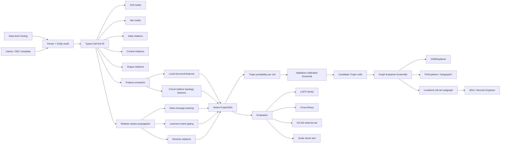

# Đánh giá hướng nghiên cứu: Semantic/Control-Aware Heterogeneous Graph Learning cho Hardware Trojan Detection

## Executive summary

Sau khi đối chiếu bản nghiên cứu đã chỉnh sửa của bạn với **Whitten, Wolff & Papachristou, _Explainability Methods for Hardware Trojan Detection: A Systematic Comparison_, arXiv:2601.18696v7**, phiên bản arXiv cập nhật ngày 4/8/2026 và bài journal chính thức đăng ngày 3/8/2026, đồng thời rà soát các hướng GNN/XAI cho Hardware Trojan đến tháng 9/2026, đánh giá của tôi là:

> **Hướng nghiên cứu của bạn là hợp lý và có giá trị khoa học thực sự, nhưng novelty không nên được đóng khung là “dùng GNN thay XGBoost” hay “dùng graph thay tabular”.** Hai ý tưởng đó đã có nhiều tiền lệ. Đóng góp có khả năng bảo vệ tốt nhất nằm ở **semantic heterogeneous cell–net representation + control-aware topology + cross-family/OOD evaluation**, kèm bằng chứng thực nghiệm cho thấy chính cách biểu diễn quan hệ giúp khắc phục failure mode của biểu diễn phẳng. fileciteturn0file1 Các công trình như NHTD-GL, GNN4Gate, TrojanSAINT, FAST-GO, SALTY và các mô hình GNN năm 2025 đã chiếm khá nhiều không gian “GNN for Hardware Trojan Detection”. citeturn25academia1turn26search4turn22academia15turn26search0turn18view0turn29search6

Tôi đánh giá **mức độ novelty hiện tại: khoảng Medium–High ở cấp luận văn thạc sĩ, Medium ở chuẩn paper quốc tế mạnh**. Nó có thể nâng lên rõ rệt nếu bạn biến câu chuyện từ:

> “Heterogeneous GNN tốt hơn baseline”

thành:

> **“Flat gate-centric representations fail under structural distribution shift; preserving cell–net relational semantics and separating globally shared control connectivity produces substantially more transferable Trojan representations across unseen circuit families.”**

Đây là câu chuyện nghiên cứu mạnh hơn nhiều, bởi baseline Whitten et al. tự thừa nhận rằng kết quả chính 0.568 F1 của họ đến từ **random 60/20/20 gate split trong cùng 30 circuits**, còn LOCO/LOFO chỉ được dùng để xác định giới hạn generalization của năm Hasegawa features. Bản journal cũng nói rõ random split chứa gates từ cùng các circuits trong cả train và test, nên không đại diện cho deployment lên kiến trúc hoàn toàn mới. citeturn31search0

Kết quả mạnh nhất trong bản sửa đổi của bạn là **LOFO Macro-F1 = 0.5239 ± 0.0454, PR-AUC = 0.5731 ± 0.0195, MCC = 0.5473 ± 0.0336** cho cấu hình heterogeneous, 13 features và bỏ control edges khỏi propagation graph. So với XGBoost 13-feature trong cùng protocol của bạn (~0.164 Macro-F1), mức F1 cao hơn khoảng **3.2 lần**; so với 5-feature XGBoost (~0.030), chênh lệch còn lớn hơn nhiều. fileciteturn0file1 Tuy nhiên, **không được viết rằng 0.5239 “đánh bại baseline 0.568” hoặc trực tiếp so 0.5239 với 0.568**, vì hai con số đến từ hai protocol khác nhau: 0.568 của Whitten et al. là random in-distribution gate split; 0.5239 của bạn là macro-average cross-family LOFO. citeturn31search0

Điểm tôi lo ngại nhất hiện nay không nằm ở model mà ở **experimental rigor**. Chỉ có năm family domain, trong khi 22/30 circuits thuộc RS232; ba random seeds không biến thành ba independent domains. Vì vậy, các kiểm định thống kê dựa trên seed/fold phải cực kỳ cẩn thận để tránh pseudo-replication. Ngoài ra, homogeneous baselines của bạn chưa đều được chạy multi-seed; còn các SOTA trực tiếp như SALTY, TrojanSAINT, NHTD-GL/GNN4Gate hoặc FAST-GO chưa được tái đánh giá trong cùng parser/split. Đây sẽ là điểm reviewer tấn công đầu tiên. fileciteturn0file1 SALTY đặc biệt quan trọng vì công trình này đã đặt generalization sang **unseen circuit families** làm bài toán trung tâm và dùng GAT+Jumping Knowledge cùng XAI-guided post-processing. citeturn18view0

Một phát triển rất mới cần bổ sung ngay vào Related Work là **LoRD, “Demystifying Gate-Level Localization of RTL Trojans,” đăng arXiv ngày 15/9/2026**, chỉ vài ngày trước thời điểm đánh giá này. Bài đó cho thấy trên benchmark của **ICCAD 2025 Hardware Trojan Detection on Gate-Level Netlist**, targeted structural/signal-flow heuristics có thể gần như hoàn hảo và đạt trung bình **2.957/3** trên Trojan-implanted hidden designs, vượt một BERT baseline và top contest solutions trong thiết lập của họ. citeturn23view0turn24search2 Điều này **không phủ định hướng của bạn**, vì threat model/dataset khác Trust-Hub, nhưng nó làm suy yếu bất kỳ phát biểu rộng nào kiểu “learning complex graph structure is necessary”. Ngược lại, nó gợi ý một thí nghiệm rất hay: thêm một **motif/structural-rule baseline** để chứng minh HeteroTrojanGNN học được pattern vượt ra ngoài các heuristic signature đơn giản.

Tóm lại, phán quyết của tôi là:

**Nên tiếp tục hướng nghiên cứu này. Không cần đổi đề tài. Nhưng cần đổi cách định vị đóng góp.** Contribution mạnh nhất của bạn không phải “một GNN mới”, mà là **semantic graph representation và inductive bias dành riêng cho gate-level netlists dưới domain shift**. Nếu hoàn thiện các baseline, kiểm định thống kê, external benchmark và XAI evaluation như đề xuất dưới đây, tôi cho rằng công trình có cơ sở tốt để phát triển thành một paper độc lập, thay vì chỉ là phần mở rộng của baseline.

## Đối chiếu trực tiếp hai nghiên cứu

Baseline mà bạn chọn thực ra **không phải SOTA GNN detector**, mà là một paper tập trung vào **systematic comparison of XAI methods trên một detector tabular**. Đó là baseline rất phù hợp để chứng minh failure mode của five-feature representation và hạn chế của feature-attribution XAI, nhưng **không đủ làm baseline duy nhất** cho claim SOTA Hardware Trojan localization. Bài Whitten et al. dùng năm structural features LGFi, FFi, FFo, PI, PO; XGBoost/RF cho detection; rồi so property-based explanations, case-based k-NN, LIME, SHAP và gradient attribution. citeturn13view0turn31search0

### Bảng so sánh cốt lõi

| Thành phần | Whitten, Wolff & Papachristou 2026 | Bản nghiên cứu của bạn | Đánh giá |
|---|---|---|---|
| **Bài toán chính** | Gate-level Trojan classification + so sánh các loại explainability | Gate-level **Trojan node localization** với cross-family/OOD generalization + graph XAI | Bạn đặt bài toán generalization mạnh hơn |
| **Đơn vị biểu diễn** | Mỗi gate/sample → vector feature tabular | **Cell nodes + net nodes**, heterogeneous bipartite graph | Đây là contribution có giá trị |
| **Topology** | Chủ yếu được nén thành 5 scalar structural features | Connectivity được giữ tường minh qua cell–net relations | Lợi thế rõ về inductive bias |
| **Quan hệ ngữ nghĩa** | Không mô hình hóa relation type | data-input, control-input, output và reverse relations | Tốt, nhưng cần ablation mạnh hơn |
| **Control network** | Không được xử lý riêng | Tách/loại control relations khỏi propagation/topological graph trong config mạnh nhất | Có thể là novelty tốt nhất của bạn |
| **Detector** | XGBoost/RF; SVM baseline | HeteroConv + relation-specific SAGEConv, residual, LayerNorm; XGB/GraphSAGE baselines | Kiến trúc GNN tự thân không quá mới |
| **Input features** | 5 Hasegawa features; property method tạo 31 combinations/properties | 5 Hasegawa + cell family + sequential flag + topology metrics; net features riêng | Richer representation nhưng phải kiểm soát feature leakage/domain identity |
| **Class imbalance** | `scale_pos_weight`, validation threshold | weighted BCE + validation-only threshold | Hợp lý |
| **Dataset** | 30 Trust-Hub circuits | Cùng nhóm 30 Trust-Hub circuits nhưng parser/IR khác | Thuận lợi cho controlled comparison nhưng hạn chế external validity |
| **Primary protocol** | Random 60/20/20 gate split | LOFO 5-family là protocol chính; node split phụ | Cách đặt của bạn khoa học hơn cho claim OOD |
| **Headline result** | XGB: P 48.08%, R 69.44%, F1 .568, MCC .575, AUPRC .637 trên random test split | Config F: Macro-F1 .5239 ± .0454, PR-AUC .5731 ± .0195, MCC .5473 ± .0336 trên LOFO | **Không so trực tiếp hai con số** |
| **Generalization** | Baseline five-feature suy giảm rất mạnh khi đổi family | Heterogeneous model giữ performance đáng kể hơn | Đây là evidence quan trọng nhất |
| **XAI** | Property, kNN, LIME, SHAP, gradient; feature-level | GNNExplainer → physical cell/net subgraph; SHAP/LIME cho tabular | Hướng của bạn gần localization hơn |
| **Error analysis** | Architecture/family distribution shift; feature overlap | Family-wise errors, control-edge effects, Dirichlet/oversmoothing, robustness | Bạn sâu hơn về model mechanism, nhưng một số luận giải hiện chưa đủ chặt |
| **Deployment story** | XAI for engineer validation | Two-tier XGB screening → HeteroGNN → subgraph explanation | Hay, nhưng “zero escapes” chưa được chứng minh |

Các con số baseline chính thức hiện đã được cập nhật trong phiên bản journal: XGBoost đạt precision 48.08%, recall 69.44%, F1 0.568, MCC 0.575 và AUPRC 0.637; Random Forest F1 0.555; Hasegawa SVM reimplementation F1 0.195. Bài báo cũng nhấn mạnh 4.74 false positives/1,000 gates cho XGBoost và 2.37/1,000 gates cho RF. citeturn31search0 Đây là metrics bạn cũng nên bổ sung để câu chuyện có ý nghĩa EDA operational hơn.

### Điều baseline thực sự chứng minh

Baseline cho thấy năm features có thể hoạt động tốt khi **distribution của circuits xuất hiện ở cả training và testing**, nhưng không được phép diễn giải random split đó thành generalization sang unseen architecture. Chính authors nói primary 60/20/20 protocol là controlled condition cho XAI comparison và LOCO/LOFO được thêm vào để “characterise the generalization boundary” của five-feature representation. citeturn31search0

Điều này tạo một **research gap rất tự nhiên** cho bạn:

\[
\text{Feature-vector HT detection}
\quad\longrightarrow\quad
\text{fails under circuit-family shift}
\]

và giả thuyết của bạn nên được viết thành:

\[
\boxed{
\text{Preserving typed cell–net relational semantics}
+
\text{controlling global control-network propagation}
\Rightarrow
\text{better cross-family generalization}
}
\]

thay vì giả thuyết quá chung:

\[
\text{GNN} > \text{XGBoost}.
\]

Giả thuyết thứ hai đã không còn novel từ lâu. NHTD-GL đã đề xuất node-wise graph learning; GNN4Gate đã dùng bi-directional graph propagation; Yasaei et al. đã công bố golden-reference-free GCN localization; TrojanSAINT dùng sampling-based inductive GNN; FAST-GO tập trung GCN scalable; và SALTY đã nhắm trực tiếp đến unseen-design generalization. citeturn25academia1turn26search4turn16academia15turn22academia15turn26search0turn18view0

### Kết quả của bạn có thực sự mạnh không?

Trong **cùng experimental framework của bạn**, câu trả lời là có. Bản sửa đổi báo cáo khoảng:

| Model/config | LOFO Macro-F1 |
|---|---:|
| XGBoost, 5 Hasegawa features | ~0.030 |
| XGBoost, 13 features | ~0.164 |
| XGB trên graph-derived IR, 5 features | ~0.135 |
| XGB trên graph-derived IR, 13 features | ~0.137 |
| Homogeneous GraphSAGE | ~0.121 trong bảng experiment chính |
| Heterogeneous GNN, full initial setting | ~0.421 |
| Hetero, control ON, 5 features | **0.326 ± 0.063** |
| Hetero, control OFF, 5 features | **0.403 ± 0.046** |
| Hetero, control ON, 13 features | **0.457 ± 0.025** |
| Hetero, control OFF, 13 features | **0.524 ± 0.045** |

fileciteturn0file1

Hai ablation quan trọng nhất là:

\[
0.3258 \rightarrow 0.4032
\]

khi loại control relations với five-feature input, tức tăng khoảng **0.0774 absolute Macro-F1**, và

\[
0.4570 \rightarrow 0.5239
\]

với 13-feature input, tăng khoảng **0.0669 absolute**. fileciteturn0file1

Đồng thời, feature enrichment từ five lên 13 dimensions tăng:

\[
0.3258 \rightarrow 0.4570
\]

khi control ON và:

\[
0.4032 \rightarrow 0.5239
\]

khi control OFF. fileciteturn0file1

Điều này tốt vì cho thấy hai yếu tố **không hoàn toàn trùng nhau**: topology features giúp, và semantic edge treatment cũng giúp.

Tuy nhiên, tôi muốn bạn để ý một kết quả rất giá trị khác: **chỉ đổi representation mà dùng XGBoost không tạo cải thiện tương xứng**, và explicit cell–net homogeneous GraphSAGE cũng không tự động tốt. fileciteturn0file1 Đây chính là evidence để tránh reviewer nói “performance tăng chỉ vì nhiều features hoặc nhiều nodes hơn”. Câu chuyện nên là:

> **Không phải graph hóa là đủ; performance chỉ tăng mạnh khi graph representation được ghép với relation-aware message passing và control-semantic treatment.**

Đây là finding khoa học mạnh hơn “proposed model obtains best F1”.

## Novelty và vị trí so với các công trình gần nhất

### Novelty thực sự nằm ở đâu?

Tôi sẽ phân hạng từng claim theo mức độ dễ bảo vệ trước reviewer.

| Claim tiềm năng | Mức novelty tôi đánh giá | Nhận xét |
|---|---|---|
| “Dùng GNN cho Hardware Trojan” | **Thấp** | Đã có nhiều bài trước |
| “Node-level Trojan localization” | **Thấp–Trung bình** | NHTD-GL, GNN4Gate, Yasaei, TrojanSAINT… đã làm |
| “Bipartite cell–net representation” | **Trung bình** | Có giá trị trong HT domain, nhưng heterogeneous/hypergraph netlist representation đã xuất hiện rộng trong EDA |
| “Six typed directed cell/net relations” | **Trung bình** | Cách instantiation cụ thể có thể là contribution |
| “Relation-aware heterogeneous message passing” | **Trung bình** | HeteroGNN là kỹ thuật chuẩn; novelty đến từ hardware semantics hơn architecture |
| “Data vs control relation treatment để tăng unseen-family generalization” | **Trung bình–Cao** | Đây là hướng tôi thấy bảo vệ tốt nhất nếu ablation/mechanistic evidence đủ mạnh |
| “LOFO evaluation” | **Không mới** | SALTY và baseline mới đều đã chú trọng cross-family/generalization |
| “Data-integrity audit preserving Trojan instances” | **Trung bình, rất hữu ích** | Có giá trị reproducibility nếu công bố manifest/parser |
| “GNNExplainer cho HT graph” | **Thấp–Trung bình** | Graph XAI và XAI-guided HT đã tồn tại |
| “Physical cell/net subgraph localization + quantitative enrichment/fidelity” | **Trung bình** | Có thể mạnh nếu thêm ground-truth subgraph evaluation |
| “Two-tier EDA workflow” | **Trung bình** | Hay về systems contribution, cần end-to-end numbers |

Việc heterogeneous/bipartite netlist representation không thể được tuyên bố là hoàn toàn mới nói chung trong EDA. Chẳng hạn LHNN đã mô hình hóa circuit bằng heterogeneous lattice-hypergraph cho congestion prediction; DE-HNN mô hình hóa netlist dưới dạng **directed hypergraph** nhằm bảo toàn hướng và cấu trúc netlist. citeturn29academia15turn29academia12 Vì thế phrasing nên là:

> “To the best of our knowledge, we introduce a **control-aware heterogeneous cell–net representation for cross-family gate-level Hardware Trojan localization**…”

chứ không phải:

> “We are the first to represent netlists as heterogeneous graphs.”

### SALTY là competitor quan trọng hơn baseline XGBoost

SALTY năm 2025 rất gần với story của bạn. Nó dùng GAT + Jumping Knowledge, local structural features, XAI-guided post-processing và đặc biệt nhấn mạnh rằng training/validation không nên chứa **same circuit family** với test design. Authors báo trung bình TPR/TNR **98.47%/98.14%** ở locality 7 trên bộ benchmark của họ. citeturn18view0

Nhưng các con số này **không thể đối chiếu trực tiếp với Macro-F1 = 0.5239 của bạn**. SALTY báo TPR/TNR và dùng protocol/features/post-processing khác; chính baseline Whitten et al. cũng cảnh báo rằng published graph-method numbers không trực tiếp comparable với same-protocol five-feature results. citeturn13view0

Đây dẫn đến một yêu cầu gần như bắt buộc cho paper của bạn:

> **Re-run ít nhất một hoặc hai strong graph baselines trong cùng parser, labels, LOFO folds và threshold protocol.**

Nếu code SALTY khó tái lập, tối thiểu nên có:

- GCN/GraphSAGE homogeneous;
- GAT;
- GIN;
- một bi-directional hoặc NHTD/GNN4Gate-style model;
- Jumping-Knowledge GAT tương tự SALTY.

Điều reviewer cần biết không phải “paper A báo 98%, paper B báo 52%”, mà là:

\[
\text{same input graph}
+\text{same labels}
+\text{same folds}
+\text{same thresholding}
\Rightarrow
\text{which inductive bias wins?}
\]

### Công trình mới nhất làm thay đổi cách bạn nên viết Introduction

Ngày **15/9/2026**, Tehrani, Davoodi và Topaloglu công bố LoRD. Công trình này xét Trojan inserted at RTL rồi synthesized xuống gate-level trong bối cảnh ICCAD 2025 contest; họ cho thấy nhiều Trojan vẫn giữ các **stable structural and signal-flow signatures**, và một tập heuristic hướng theo Trojan type đạt gần tuyệt đối trên hidden contest cases, với score trung bình 2.957/3 trên Trojan-infected designs. citeturn23view0

ICCAD 2025 Problem A chính thức là **“Hardware Trojan Detection on Gate Level Netlist”**, do Cadence Design Systems cung cấp. citeturn24search2

Kết quả này tạo ra một phản biện đáng chú ý đối với paper của bạn:

> “Tại sao cần một HeteroGNN tương đối phức tạp nếu distinctive structural motif đã đủ?”

Bạn nên **chủ động trả lời reviewer trước khi họ hỏi** bằng một heuristic baseline. Có thể xây dựng một detector đơn giản từ rare fan-in cone, low controllability/proximity, reconvergence, sequential-chain, trigger-to-payload connectivity hoặc motif statistics. Nếu HeteroTrojanGNN vẫn thắng dưới family shift, contribution của bạn mạnh hơn rất nhiều.

Mặt khác, LoRD là cơ hội tốt cho external validation. Nó xét threat model khác nên không nên gộp trực tiếp vào Trust-Hub table, nhưng ICCAD benchmark có thể trở thành một **second-domain experiment** để kiểm tra representation có transferable hay không. citeturn23view0turn24search4

### Góp ý cốt lõi (Major)

**Major — Làm rõ unit của novelty.**  
Hiện manuscript dễ làm người đọc nghĩ contribution chính là “HeteroTrojanGNN”. Tôi không khuyến nghị. HeteroConv/SAGEConv + residual + LayerNorm là một design hợp lý nhưng không đủ architectural novelty. Hãy đặt novelty ở **semantic IR + relation treatment + generalization mechanism**. Điều này cũng giúp tránh cạnh tranh trực diện với hàng loạt GNN architectures đã tồn tại. citeturn25academia1turn26search4turn22academia15turn18view0

**Major — Baseline hiện tại chưa đủ để claim SOTA.**  
Whitten et al. là baseline rất tốt cho five-feature/XAI story nhưng không phải graph SOTA. Bạn phải thêm strong GNN baselines cùng protocol. Ma et al. 2025, chẳng hạn, đã dùng GraphSAGE-LSTM/POOL với harmonic centrality và báo F1 90.95–98.59% trên các SAED/LEDA/sequential settings của họ, dù protocol/dataset không comparable trực tiếp. citeturn29search6 Chính vì published metrics chênh lệch protocol quá lớn, same-protocol reimplementation càng quan trọng.

**Major — RQ về homogeneous vs heterogeneous hiện chưa hoàn toàn công bằng.**  
Trong bản hiện tại, một số homogeneous Config A/B chỉ có seed 42 trong khi C–F được chạy ba seeds. fileciteturn0file1 Bạn cần chạy **A/B/B-4L/B-Wide và C–F cùng seeds/folds/early stopping/threshold policy**. B-Wide là bước tốt để kiểm soát parameter count, nhưng chưa đủ nếu số layers/receptive field hoặc relation parameterization khác.

**Major — Statistical significance đang có nguy cơ pseudo-replication.**  
Với LOFO chỉ có năm independent families, “3 seeds × 5 folds = 15 independent samples” là không đúng về mặt experimental unit. Seeds chia sẻ cùng held-out domains. Tốt hơn là báo family-level results đầy đủ, bootstrap/permutation ở circuit/family level, effect size, và CI. Seed variance chỉ thể hiện optimization uncertainty, không phải population uncertainty.

**Major — Phải xử lý family imbalance.**  
RS232 chiếm 22/30 circuits trong dataset của bạn. fileciteturn0file1 Macro-over-family là đúng hướng, nhưng chỉ năm domains vẫn quá ít để kết luận rộng về “unseen hardware”. Hãy coi LOFO là **cross-family evidence trên Trust-Hub**, không phải universal OOD generalization.

**Major — Kết quả family-wise cho thấy bài toán chưa giải quyết đồng đều.**  
Config F của bạn mạnh trên s35932 và s15850 nhưng vẫn thấp đáng kể trên một số families như RS232, s38417 và s38584 trong các bảng family-level. fileciteturn0file1 Đây nên trở thành error-analysis section: điều gì khác biệt ở những family này? Trojan type? circuit size? sequential structure? degree distribution? control-net density? process node? Nếu giải thích được, paper sẽ chuyển từ “benchmark result” sang “scientific understanding”.

**Major — Control edge removal đang là finding hay nhưng causal explanation chưa đủ.**  
Bạn đang có evidence performance tăng khi control OFF. Nhưng không nên kết luận ngay “control edges cause over-smoothing”. Một control net như clock/reset có fan-out rất lớn nên lý thuyết này hợp lý, nhưng cần đối chứng. Chạy ít nhất:
1. control ON;
2. control OFF;
3. control relations retained nhưng relation-specific learned gate;
4. random removal cùng số edges;
5. degree-matched removal;
6. only-clock removed;
7. only-reset removed.

Nếu control-specific removal thắng random degree-matched pruning, claim của bạn mạnh hơn rất nhiều.

**Major — Dirichlet-energy section hiện cần sửa trước khi submit.**  
Bản thảo đang có hai narrative khó hòa giải: một chỗ mô tả normalized Dirichlet energy tăng rất mạnh khi control OFF; một phân tích khác, khi cố định `G_data`, lại cho energy thấp hơn ở control-OFF embeddings. fileciteturn0file1 Hai kết quả có thể cùng đúng vì dùng operator khác, nhưng reader sẽ nghĩ inconsistency. Hãy định nghĩa chính xác:

\[
E_D(H;G)=
\frac{\operatorname{Tr}(H^\top L_G H)}
{\operatorname{Tr}(H^\top H)}
\]

hoặc công thức bạn thực sự dùng, rồi luôn đánh giá ON/OFF embeddings trên **cùng một reference Laplacian**. Nếu muốn thêm metric, dùng mean pairwise cosine distance/class separation hoặc MAD-like embedding smoothness. Đừng suy ra “less oversmoothing” chỉ từ một scalar energy nếu graph operator thay đổi.

**Major — Claim “control removal” cần stress test với sequential/control-trigger Trojans.**  
LoRD mô tả rõ các RTL Trojans có trigger tác động reset/enable và sequential structures. citeturn23view0 Nếu loại control relations hoàn toàn, model của bạn có nguy cơ mất chính signal quan trọng trên loại Trojan khác. Tôi sẽ đổi hướng từ **control removal** thành **control-aware relation gating**: control edges vẫn được giữ trong IR nhưng có learnable gate/attention, hoặc được tắt trong topology-feature computation nhưng giữ trong message passing riêng.

**Major — Dataset audit rất có giá trị nhưng cần artifact-level evidence.**  
Bạn báo metadata chứa 370 Trojan instances, parser tìm thấy 366, trong khi flattened baseline representation chỉ còn 358 samples labeled Trojan. fileciteturn0file1 Đây có thể là contribution reproducibility thú vị, nhưng reviewer sẽ yêu cầu bằng chứng. Hãy phát hành CSV:

`circuit, metadata_instance, parsed_cell, baseline_node, preserved?, exclusion_reason`

và unit test cho từng discrepancy. Không nên viết “CircuitGraph loses 8 Trojans” nếu chưa chứng minh exact mapping; hãy viết trung tính hơn như “eight metadata-mapped Trojan cells were not represented as positive samples after the baseline preprocessing pipeline.”

**Major — Số entity giữa hai parser phải được reconcile rõ.**  
Bản của bạn có khoảng 47,464 cells và 61,067 nets, còn baseline báo 56,959 total samples/gates. fileciteturn0file1 citeturn31search0 Nếu một parser “preserves more structural information” nhưng lại có số cell nodes thấp hơn baseline samples, reviewer chắc chắn hỏi “sample là gate, net, primitive hay canonical node?”. Cần một bảng normalization cho entity semantics.

**Major — ID node split cần gọi đúng là transductive.**  
Nếu train/val/test masks nằm trong cùng circuit graph, GNN message passing có thể sử dụng **features/topology của test nodes** dù không dùng test labels. Đó là transductive node classification, không phải fully inductive unseen-node evaluation. Nên nói rõ và giữ LOFO làm result chính.

**Major — XAI hiện chưa đủ để dùng từ “causal”.**  
GNNExplainer tối ưu explanatory mask/subgraph liên quan tới prediction; nó không chứng minh physical causality của Trojan. GNNExplainer nguyên gốc được thiết kế để tìm compact subgraph và features quan trọng cho prediction. citeturn19search1 Vì vậy nên đổi “Causal Hardware Subgraph Localization” thành **“Model-Relevant Hardware Subgraph Localization”** hoặc **“Structure-Aware Post-hoc Explanation”**.

**Major — Mean native Fidelity+ âm là một cảnh báo, không phải chi tiết phụ.**  
Bản của bạn có localization precision khoảng 30.7% so với ~0.78% prevalence, tức enrichment rất đáng chú ý, nhưng mean native Fidelity+ lại khoảng âm và chỉ một subset cases có strong response. fileciteturn0file1 Không nên lấy peak 98.78% làm headline. Hãy đánh giá:
- fidelity under deletion;
- fidelity under retention;
- Trojan-node recall/precision/IoU;
- trigger coverage;
- payload coverage;
- explanation stability giữa seeds;
- connectedness;
- random-subgraph baseline;
- degree-matched random baseline.

Và thêm PGExplainer hoặc SubgraphX. PGExplainer được thiết kế để học explainer dùng được inductively giữa instances; SubgraphX trực tiếp tìm explanatory subgraphs. citeturn20academia9turn19search0

**Major — Two-tier deployment claim hiện hơi vượt evidence.**  
“Zero Trojan Escapes” nên bỏ trừ khi tất cả outer-folds đạt 100% recall tại pre-registered operating point. Thay bằng **“high-recall screening mode”** và báo:
\[
\text{Recall@FP budget},
\quad
\text{FP}/1000\text{ gates},
\quad
\text{candidates/chip}.
\]
Baseline journal đã dùng FP per 1,000 gates, nên đây cũng là metric tốt để so operational burden. citeturn31search0

### Góp ý hoàn thiện (Minor)

Tên baseline trong manuscript nên dùng **Whitten, Wolff, and Papachristou (2026)**, không nên rút còn Whitten & Wolff vì bản final có ba tác giả. citeturn14view0turn31search0

Cụm “31 features” của baseline cần dùng cẩn thận. Bài journal mô tả property method xây **31 derived properties/combinations từ năm base features**, gồm 5 singleton, 10 pair, 10 triple, 5 four-feature và một five-feature combination. citeturn31search0 Nên tránh làm reader hiểu baseline detector có 31 independent raw features.

Không nên dùng “all existing XAI methods are spatially blind”. SALTY đã kết hợp graph model với XAI-guided post-processing, và GNN explainability là cả một literature riêng. citeturn18view0turn19search1 Viết hẹp hơn: **“feature-attribution methods evaluated in the baseline do not directly return circuit-topological subgraphs.”**

Cụm “100% precise control classification using Liberty/SDC” cũng nên bỏ. Liberty/SDC có thể cung cấp semantic information tốt hơn port-name heuristics, nhưng không nên hứa absolute precision trước khi validation.

Nếu topology features bao gồm betweenness/closeness, cần báo preprocessing complexity và memory. Việc quảng bá model là scalable tới million-gate SoCs trong khi dùng expensive global centrality có thể bị phản biện. DE-HNN cũng nhấn mạnh netlist size/long-range interaction là vấn đề scalability cơ bản của graph-based EDA. citeturn29academia12

## Thiết kế thực nghiệm nên bổ sung trước khi publish

Tôi sẽ ưu tiên thí nghiệm theo thứ tự sau, thay vì tiếp tục thêm nhiều model variants nhỏ.

### Bộ ablation tối thiểu để chứng minh contribution

Bảng thí nghiệm chính nên có một factorial design rõ:

| Graph representation | Model | Control semantics | Features | Mục đích |
|---|---|---|---|---|
| Flat gate vector | XGB | N/A | 5 | reproduce baseline |
| Flat gate vector | XGB | N/A | 13 | feature enrichment |
| Homogeneous gate graph | GraphSAGE | implicit | 5 | standard GNN |
| Explicit cell–net homogeneous | GraphSAGE | mixed | 5 | test graph expansion alone |
| Cell–net hetero | HeteroSAGE | ON | 5 | relation typing |
| Cell–net hetero | HeteroSAGE | OFF | 5 | control effect |
| Cell–net hetero | HeteroSAGE | ON | 13 | feature effect |
| Cell–net hetero | HeteroSAGE | OFF | 13 | full proposed |
| Cell–net hetero | gated HeteroSAGE | learned | 13 | **recommended improved model** |
| Cell–net hetero | same model | random edge removal | 13 | causal control for pruning hypothesis |

Mọi neural baseline phải chạy cùng seeds. Tôi khuyến nghị **ít nhất 5 seeds**, tốt hơn 10 nếu compute cho phép.

### Strong architecture baselines

GNN4Gate đã dùng bi-directional GCN cho Trojan-gate classification và báo trung bình TPR 87.14%, TNR 99.73% trong protocol riêng của họ. citeturn26search4 NHTD-GL là node-wise graph-learning method nhắm trực tiếp tới việc không phụ thuộc heuristic feature engineering. citeturn25academia1 TrojanSAINT là sampling-based inductive GNN và báo practical-validation averages khoảng 78% TPR/85% TNR. citeturn22academia15 FAST-GO dùng 16 structural features, GCN và dynamic threshold, báo 95.38% average TPR nhưng chỉ 82.14% TNR trong protocol của họ. citeturn26search0

Bạn không nhất thiết tái hiện tất cả. Nhưng **GAT+JK kiểu SALTY + một GNN4Gate/NHTD-style baseline** sẽ khiến review mạnh hơn rất nhiều.

### Dataset và external validity

Trust-Hub vẫn phù hợp cho direct comparison với baseline, nhưng không đủ để claim broad industrial generalization. Whitten et al. cũng tự nêu limitation rằng benchmark của họ là synthetic academic circuits và chưa bao phủ broader deployment conditions. citeturn31search0

Tôi đề nghị ba tầng evaluation:

**Core benchmark:** giữ nguyên Trust-Hub 30 circuits để controlled comparison.

**External benchmark:** dùng **ICCAD 2025 Problem A**, vì đây là dataset/threat model gate-level HT localization có industry involvement từ Cadence và hiện đã trở thành điểm tham chiếu mới. citeturn24search2turn24search4

**Scale stress test:** paper “Automated Hardware Trojan Insertion in Industrial-Scale Designs” năm 2025 nhấn mạnh khoảng cách giữa academic benchmark nhỏ và SoCs có hàng trăm nghìn tới hàng triệu nets, đồng thời xây pipeline tạo HT-like challenge instances trên industrial-scale netlists. citeturn21academia2 Ngay cả khi chưa dùng dataset đó trực tiếp, nó là citation rất tốt để justify scalability experiment.

Một thí nghiệm rất có giá trị sẽ là synthesize cùng RTL qua **nhiều technology libraries / synthesis seeds / optimization settings** và làm:

\[
\text{train on library A}
\rightarrow
\text{test on library B}.
\]

Điều này kiểm tra chính xác claim “semantic representation survives implementation shift”.

### Metrics nên mở rộng

F1, PR-AUC và MCC hiện là lựa chọn tốt cho imbalance. Nhưng thêm:

\[
\text{FP per 1,000 gates}
\]

\[
\text{Recall @ fixed FP budget}
\]

\[
\text{Precision@K / Recall@K}
\]

\[
\text{candidate reduction ratio}
=
1-\frac{K}{|V|}
\]

sẽ làm paper gần EDA deployment hơn. Baseline final paper đã nhấn mạnh false-positive density thay vì accuracy đơn thuần. citeturn31search0

Nếu output probability được dùng để threshold across designs, thêm calibration:

\[
\text{ECE},\quad \text{Brier score}
\]

và kiểm tra threshold transfer:

\[
\tau_{\text{val families}}
\rightarrow
\tau_{\text{unseen family}}.
\]

Đây là chỗ rất quan trọng: **tuyệt đối không tối ưu threshold trên test family**. Cách bạn đang chọn threshold trên validation only là đúng; cần viết thật rõ trong Algorithm/Evaluation Protocol. fileciteturn0file1

### Error analysis cần đi từ “family” xuống “Trojan mechanism”

Family table chưa đủ. Tôi khuyến nghị mỗi false negative được annotate theo:

- trigger vs payload;
- combinational vs sequential;
- proximity tới clock/reset/control;
- Trojan-subgraph size;
- Trojan-to-benign boundary size;
- local degree;
- number of hops tới primary I/O;
- rarity/controllability;
- family;
- synthesis technology.

Sau đó kiểm tra:

\[
P(\text{FN}\mid \text{Trojan type, graph context})
\]

Thí nghiệm này có thể giải thích **tại sao s35932 rất tốt nhưng s38584 kém**, thay vì chỉ reporting values.

### Cách làm control-edge hypothesis thành contribution khoa học

Tôi đặc biệt khuyến nghị đổi full model thành một **learnable control gate** thay vì hard OFF:

\[
m_{u\rightarrow v}^{(r)}
=
\alpha_r
W_r h_u,
\qquad
\alpha_r=\sigma(a_r),
\]

với \(r\in\{\text{data},\text{control},\text{output},...\}\).

Hoặc node-conditioned:

\[
\alpha_{uv}^{(r)}
=
\sigma
\left(
\operatorname{MLP}_r[
h_u\Vert h_v\Vert e_{uv}
]
\right).
\]

Khi đó model có thể học:

- suppress ubiquitous clocks;
- retain suspicious reset/enable relations;
- preserve sequential Trojan evidence.

Nếu learned \(\alpha_{\text{clock}}\) giảm mạnh trên benign regions nhưng vẫn tăng gần Trojan trigger, đây sẽ là **một result rất publishable**.

## Pipeline đề xuất và cách tăng sức thuyết phục của paper

Pipeline nên thể hiện rõ ba tầng mà bản hiện tại đang hơi trộn vào nhau: **representation**, **detection**, **explanation**.

Điểm khác so với manuscript hiện tại là tôi **không xóa control information khỏi IR**. Tôi chỉ làm nó có **semantic gate**. Đó là architecture tự nhiên hơn từ standpoint hardware security.

### Storyline mà paper nên theo

Paper hiện có khá nhiều đóng góp: IR, GNN, OOD, over-smoothing, dataset audit, robustness, XAI, two-tier EDA. Quá nhiều sẽ làm contribution bị loãng.

Tôi khuyên paper chính chỉ giữ ba research questions:

**RQ-A — Does preserving cell–net relation semantics improve cross-family localization?**

\[
\text{flat/homogeneous}
\quad\text{vs}\quad
\text{heterogeneous}
\]

**RQ-B — How do global control relations affect representation transfer?**

\[
\text{control ON}
\quad\text{vs}\quad
\text{OFF/random/gated}
\]

**RQ-C — Are learned predictions localized to meaningful Trojan substructures?**

\[
\text{fidelity}
+
\text{Trojan-subgraph overlap}
+
\text{stability}
\]

Dataset-audit evidence hỗ trợ RQ-A; Dirichlet analysis hỗ trợ RQ-B; GNNExplainer hỗ trợ RQ-C.

Đừng để paper trở thành “we tried 20 things”.

### Cách viết contribution section

Tôi sẽ thay contribution hiện tại bằng một phiên bản gần như sau:

> **Semantic netlist representation.** We formulate gate-level Trojan localization over a typed cell–net graph that preserves circuit entities and distinguishes data, control, and output relations rather than collapsing connectivity into gate-local scalar features.

> **Control-aware cross-family graph learning.** We show, under strict leave-one-family-out evaluation, that indiscriminate propagation through high-fanout control connectivity degrades cross-family transfer, and introduce relation-aware propagation to mitigate this effect.

> **Representation-focused empirical study.** Through matched tabular, homogeneous-graph, explicit cell–net, and heterogeneous-graph ablations, we separate the gains from richer handcrafted features, graph expansion, relation semantics, and model capacity.

> **Topology-aligned explanation.** We map node predictions back to compact cell–net subgraphs and quantify their enrichment, fidelity, and overlap with labeled Trojan structures.

Contribution cuối chỉ nên giữ nếu XAI evaluation được nâng cấp.

## Công trình liên quan quan trọng cần trích dẫn

Dưới đây là literature set tôi cho rằng **bắt buộc hoặc rất nên có**. Đây không chỉ là bibliography; mỗi paper nên có một vai trò cụ thể trong positioning.

| Công trình | Vai trò trong Related Work |
|---|---|
| **Hasegawa et al., “Hardware Trojans Classification for Gate-Level Netlists Based on Machine Learning”** | Nguồn gốc hướng five-feature ML baseline. citeturn25search0 |
| **Hasegawa et al., “Node-wise Hardware Trojan Detection Based on Graph Learning” (NHTD-GL)** | Một trong các prior works gần nhất về node-wise graph-learning HT detection; quan trọng để tránh claim node-level novelty quá rộng. citeturn25academia1 |
| **Cheng et al., “GNN4Gate: A Bi-Directional Graph Neural Network for Gate-Level Hardware Trojan Detection,” DATE 2022** | Prior bi-directional graph propagation trực tiếp trên gate-level Trojan detection. citeturn26search4 |
| **Yasaei et al., “Golden Reference-Free Hardware Trojan Localization using Graph Convolutional Network”** | Prior golden-free localization bằng GCN; báo 93.1% F1 trong protocol riêng. citeturn16academia15 |
| **Lashen et al., “TrojanSAINT: Gate-Level Netlist Sampling-Based Inductive Learning for Hardware Trojan Detection”** | Inductive/sampling GNN và scalability; rất sát problem formulation. citeturn22academia15 |
| **Imangholi et al., “FAST-GO: Fast, Accurate, and Scalable Hardware Trojan Detection using Graph Convolutional Networks,” ISQED 2024** | Graph localization, compact feature set, dynamic threshold, runtime/scalability comparison. citeturn26search0 |
| **Mahfuz et al., “SALTY: Explainable Artificial Intelligence Guided Structural Analysis for Hardware Trojan Detection”** | **Must cite.** GAT+JK, unseen-family generalization và XAI post-processing gần nhất với story của bạn. citeturn18view0 |
| **Ma et al., “Hardware Trojan Detection Methods for Gate-Level Netlists Based on Graph Neural Networks,” IEEE TC 2025** | Recent journal GNN HT detection; harmonic centrality, GraphSAGE variants, multiple datasets. citeturn29search6 |
| **Whitten, Wolff & Papachristou, “Explainability Methods for Hardware Trojan Detection: A Systematic Comparison,” JETTA 2026 / arXiv v7** | Baseline trực tiếp về XAI + five-feature/XGB; phải phân biệt random split và LOFO. citeturn14view0turn31search0 |
| **Tehrani et al., “Demystifying Gate-Level Localization of RTL Trojans,” 2026** | **Must add vì cực mới.** Structural heuristic localization trên ICCAD 2025 contest; tạo counterargument quan trọng cho generic ML/GNN. citeturn23view0 |
| **Chou et al., “2025 ICCAD CAD Contest Problem A: Hardware Trojan Detection on Gate-Level Netlist”** | External benchmark/industry-backed problem definition. citeturn24search4 |
| **Luo et al., “DE-HNN: An Effective Neural Model for Circuit Netlist Representation”** | Chứng minh directed hypergraph semantics đã quan trọng trong broader EDA; giúp bạn position cell–net IR đúng phạm vi. citeturn29academia12 |
| **Ying et al., “GNNExplainer,” NeurIPS 2019** | Nguồn gốc explainer mà bạn sử dụng; cần cite khi định nghĩa fidelity/subgraph explanation. citeturn19search1 |
| **Luo et al., “PGExplainer,” NeurIPS 2020** | Strong explainer baseline, inductive hơn per-instance GNNExplainer. citeturn20academia9 |
| **Yuan et al., “SubgraphX,” ICML 2021** | Direct subgraph explanations với Shapley/MCTS; đặc biệt phù hợp với “Trojan subcircuit” semantics. citeturn19search0 |
| **Popryho et al., “Automated Hardware Trojan Insertion in Industrial-Scale Designs,” 2025** | Dùng để motivate scale/generalization gap của academic Trust-Hub benchmarks. citeturn21academia2 |

Một điểm quan trọng khi viết Related Work: **không xếp tất cả các headline metrics vào cùng một bảng rồi dùng ranking**. Ví dụ SALTY TPR/TNR, FAST-GO TPR/TNR, Ma et al. F1 trên SAED/LEDA và baseline XGBoost F1 trên random Trust-Hub gate split dùng protocol khác nhau. Bản baseline 2026 cũng chủ động cảnh báo rằng các published graph rows không apples-to-apples. citeturn13view0

## Tiêu đề, abstract và roadmap xuất bản

### Tiêu đề tôi khuyến nghị

Tiêu đề hiện tại:

> **Semantic Graph Representation and Graph Learning for Hardware Trojan Detection in Gate-Level Netlists**

không sai, nhưng còn quá rộng. Nó không nói rõ novelty mạnh nhất.

Tôi khuyến nghị:

> **Control-Aware Heterogeneous Cell–Net Graph Learning for Cross-Family Hardware Trojan Localization**

Hoặc đầy đủ hơn:

> **Control-Aware Heterogeneous Cell–Net Graph Learning for Cross-Family Hardware Trojan Localization in Gate-Level Netlists**

Tên này có bốn lợi thế: nêu rõ **control-aware**, **heterogeneous cell–net**, **cross-family**, và **localization**. Đây chính xác là bốn điểm giúp bạn tránh rơi vào vùng “another GNN for Trojan detection”.

Một tiêu đề thiên về finding:

> **Beyond Flat Netlists: Control-Aware Heterogeneous Graph Learning for Generalizable Hardware Trojan Localization**

Tên này hấp dẫn hơn nhưng claim “generalizable” cần external benchmark mạnh.

### Abstract đề xuất

> **Abstract —** Gate-level hardware Trojan localization is challenging under severe class imbalance and structural distribution shifts across circuit families. Existing feature-based detectors summarize circuit topology into a small number of gate-local statistics, while prior graph-learning approaches often treat netlist connectivity as homogeneous. We introduce a control-aware heterogeneous cell–net representation that preserves cells, nets, signal direction, and data/control relation semantics for Trojan localization. A relation-specific graph neural network performs message passing over the resulting representation, while validation-only threshold selection prevents test-family calibration leakage. On 30 Trust-Hub netlists evaluated using strict leave-one-family-out cross-validation, the proposed configuration achieves a macro-F1 of 0.524, PR-AUC of 0.573, and MCC of 0.547, substantially outperforming matched tabular and homogeneous-graph baselines under the same protocol. Ablation studies show that both enriched topology features and control-aware propagation contribute independently to cross-family performance. We further map predictions to compact cell–net subgraphs and evaluate their correspondence with labeled Trojan structures. The results suggest that preserving circuit relation semantics, rather than merely increasing model capacity, is critical for transferable gate-level Trojan localization.

Khoảng 180 từ. Tôi cố ý **không dùng “causal”, “SOTA”, “zero escape”, “industrial-scale” hay “universal generalization”**, vì evidence hiện chưa đủ cho các từ đó.

### Roadmap paper hiện tại

Tôi sẽ chia tiến độ khoa học thành ba mốc.

**Bản submission đầu tiên nên tập trung vào representation + OOD.** Chạy toàn bộ homogeneous/heterogeneous baselines cùng seeds; thêm GAT+JK; thêm random/degree-matched control-edge ablation; sửa Dirichlet analysis; reconcile parser entity counts; report FP/1,000 gates và per-family confidence intervals. Đây là phần tối thiểu để story đứng vững.

**Bản mạnh hơn nên thêm external benchmark.** ICCAD 2025 Problem A hiện là lựa chọn đặc biệt đáng giá vì vừa mới trở thành benchmark gate-level localization có industry sponsorship và đã tạo ra các phương pháp mới như LoRD. citeturn24search2turn23view0 Ngay cả khi model không đạt best score, khả năng transfer mà không hand-craft ten Trojan-specific rules sẽ là một scientific result hữu ích.

**XAI nên trở thành secondary contribution hoặc paper tiếp theo**, trừ khi bạn có đủ thời gian tăng evaluation. Hiện localization enrichment ~30.7% từ background ~0.78% rất thú vị, nhưng native Fidelity+ chưa đủ ổn định để nó trở thành contribution ngang hàng với OOD graph learning. fileciteturn0file1

### Roadmap cho paper tiếp theo

Tôi thậm chí cho rằng có thể tách thành hai paper khoa học sạch hơn.

**Paper hiện tại:**  
**Control-Aware Heterogeneous Graph Representation for Cross-Family Hardware Trojan Localization**

Trọng tâm là:

\[
\text{representation}
\rightarrow
\text{relation semantics}
\rightarrow
\text{OOD generalization}.
\]

**Paper tiếp theo:**  
**Motif-Grounded Explainable Graph Learning for Hardware Trojan Localization Across Synthesis Domains**

Paper thứ hai có thể chuyển từ generic GNNExplainer sang **hardware-grounded explanations**:

\[
\text{prediction}
\rightarrow
\text{explanatory subgraph}
\rightarrow
\text{trigger/payload motif}
\rightarrow
\text{EDA validation}.
\]

Nó nên sử dụng nhiều synthesis libraries, ICCAD 2025, PGExplainer/SubgraphX hoặc một explainer học được, và các ground-truth metrics như trigger recall, payload recall, edge IoU, stability và human-actionability. GNNExplainer, PGExplainer và SubgraphX cung cấp ba điểm tham chiếu tự nhiên cho phần phương pháp. citeturn19search1turn20academia9turn19search0

### Phán quyết học thuật cuối cùng

Nếu đây là bản tôi review với vai trò cố vấn hoặc reviewer, tôi sẽ đánh giá:

| Tiêu chí | Hiện tại | Sau các chỉnh sửa ưu tiên |
|---|---:|---:|
| Bài toán nghiên cứu | **8.5/10** | **9/10** |
| Tính mới của architecture thuần túy | **5.5/10** | **6.5/10** nếu thêm relation gating |
| Tính mới của representation | **7.5/10** | **8.5/10** |
| OOD/generalization contribution | **8/10** | **9/10** với external benchmark |
| Experimental rigor | **6.5/10** | **8.5–9/10** |
| XAI contribution | **6/10** | **8/10** với graph-explainer baselines + GT subgraph metrics |
| Reproducibility/data audit | **8/10** | **9/10** nếu release entity mapping |
| Giá trị luận văn thạc sĩ | **Rất tốt** | **Rất tốt** |
| Khả năng thành paper | **Có, nhưng cần major strengthening** | **Khá tốt** |

Kết luận quan trọng nhất của tôi là: **đóng góp của bạn không bị baseline 2026 “ăn mất”**. Thực tế baseline mới còn giúp bạn, vì chính nó làm lộ rõ giới hạn của flat five-feature detector dưới architecture shift. citeturn31search0 Nhưng **đừng dùng baseline đó như đối thủ duy nhất**. Literature 2022–2026 đã có nhiều graph-based HT detectors và đặc biệt SALTY đã đặt unseen-family generalization vào trung tâm bài toán. citeturn18view0 Công trình rất mới LoRD còn cho thấy structural domain knowledge có thể cạnh tranh mạnh với ML trên một benchmark mới. citeturn23view0

Vì vậy, claim mạnh và khó bị phản bác nhất của bạn nên là:

> **The principal contribution is not the use of a GNN itself, but demonstrating that circuit-semantic representation choices—particularly explicit cell–net relations and control-aware propagation—materially determine whether a Trojan detector transfers across unseen circuit families.**

Nếu các thí nghiệm bổ sung xác nhận được câu này, tôi đánh giá đây là **một contribution có giá trị nghiên cứu rõ ràng**, không phải chỉ là “incremental application of GNN”.