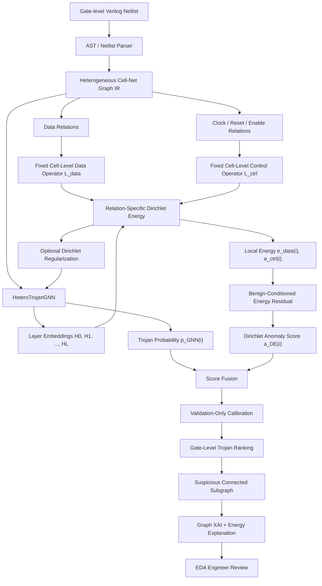

# Đánh giá chuyên sâu: Dirichlet Energy cho phát hiện Hardware Trojan và vị trí đóng góp của hướng Control-Aware Heterogeneous Cell–Net Graph

## Executive summary

Sau khi đối chiếu bản thảo nghiên cứu mới nhất của bạn với bài baseline của Whitten, Wolff và Papachristou, các công trình Graph Neural Network cho Hardware Trojan đến tháng 9/2026, và literature về Dirichlet energy/graph Laplacian trong GNN và graph anomaly detection, đánh giá của tôi là:

**Hướng nghiên cứu hiện tại có giá trị nghiên cứu rõ ràng và đủ cơ sở để phát triển thành một đóng góp tốt, nhưng novelty không nên được định vị là “dùng heterogeneous graph cho Hardware Trojan” hay “dùng GNN thay XGBoost”.** Heterogeneous graph đã xuất hiện trong HT detection, điển hình HGAT4TJ năm 2025; GCN/GNN cho detection/localization đã có từ 2022; SALTY đã dùng GNN + Jumping Knowledge + XAI; và LoRD, công bố ngày 15/9/2026, cho thấy các structural heuristics có thể cực kỳ mạnh trên benchmark ICCAD 2025. citeturn30academia1turn30academia2turn32academia24turn32search0turn30academia0

**Phần có khả năng tạo novelty mạnh nhất của bạn là tổ hợp rất cụ thể sau:**

> **gate-level Cell–Net bipartite representation + typed data/control relations + strict cross-family OOD evaluation + relation-specific Dirichlet analysis/anomaly scoring + explainable gate/subgraph localization.**

Đây là phạm vi hẹp hơn nhưng khoa học hơn nhiều so với tuyên bố “first heterogeneous GNN for HT detection”. Trong tìm kiếm primary literature mà tôi thực hiện đến ngày 23/9/2026, tôi **chưa tìm thấy một công trình gate-level Hardware Trojan detection/localization nào lấy Dirichlet energy/Dirichlet form làm thành phần trung tâm để định lượng bất thường cấu trúc, điều khiển message passing, hoặc hiệu chỉnh anomaly score**. Tôi xem đây là một khoảng trống có triển vọng, nhưng đây là kết quả của literature search chứ không phải bằng chứng tuyệt đối rằng không tồn tại bất kỳ paper nào.

Bản thảo hiện tại đã có một research story tương đối mạnh: Semantic/Heterogeneous Cell–Net IR, tách data/control, HeteroTrojanGNN, LOFO trên 30 Trust-Hub circuits, Config F đạt Macro-\(F_1=0.5239\pm0.0454\), PR-AUC \(=0.5731\pm0.0195\), MCC \(=0.5473\pm0.0336\), cùng các ablation và Graph XAI. fileciteturn0file0 Tuy nhiên, **phần Dirichlet hiện chưa đủ chặt về mặt toán học để dùng như bằng chứng trực tiếp rằng “control-edge removal prevents over-smoothing”**. Đây là điểm quan trọng nhất tôi đề nghị sửa.

Cụ thể, Dirichlet energy luôn phụ thuộc vào **toán tử đồ thị đang dùng để đo**. Nếu \(E_D\) được tính trên hai graph khác nhau — một graph có control edges và một graph không có — thì hai giá trị energy không phải là một phép so sánh apples-to-apples. Khi bạn chuyển sang một toán tử cố định \(G_{\text{data}}\), việc Config OFF có **energy thấp hơn** lại có nghĩa embeddings **mượt/coherent hơn dọc theo data-flow graph**, chứ không phải trực tiếp “ít over-smoothing hơn”. Cai & Wang dùng Dirichlet energy để mô tả smoothness của biểu diễn và cho thấy message passing có xu hướng làm giảm năng lượng; chính họ cũng nhấn mạnh Rayleigh quotient là đại lượng thích hợp hơn khi muốn loại ảnh hưởng scale của embedding. citeturn31academia14

Vì vậy, tôi khuyến nghị **không bỏ Dirichlet khỏi luận văn**. Ngược lại, hãy nâng nó từ một đồ thị hậu kiểm thành một phần phương pháp thực sự. Đóng góp mạnh hơn có thể được phát biểu như:

> **Relation-Specific Dirichlet Energy for Control-Aware Hardware Trojan Localization:** xây dựng các Dirichlet forms riêng cho data-flow và control-flow, đo local energy/residual ở từng gate, hiệu chỉnh chúng theo gate type/degree và kết hợp với HeteroGNN probability để phát hiện Trojan dưới cross-family distribution shift.

Nếu làm được các thí nghiệm tôi đề xuất bên dưới, tôi đánh giá novelty ở mức **khá mạnh cho một luận văn thạc sĩ và có cơ sở rõ ràng cho một paper**, thay vì chỉ là một biến thể kiến trúc GNN.

Một điểm phản biện nữa: baseline Whitten et al. là baseline tốt để tạo động lực nghiên cứu, nhưng **không nên là đối thủ SOTA duy nhất**. Bài chính thức dùng 30 Trust-Hub circuits với 56,959 gates, 358 Trojan gates, năm structural features \(LGFi,FFi,FFo,PI,PO\), XGBoost và các phương pháp XAI. citeturn33search0turn29search2 Nghiên cứu của bạn phải đối đầu thêm ít nhất với GCN localization, TrojanSAINT, GraphSAGE/GAT, SALTY, một bidirectional GNN, HGAT4TJ ở cấp độ kiến trúc, và đặc biệt là LoRD/ADVERSARIAL ở phần structural/generalization. citeturn30academia1turn30academia3turn32academia24turn32search0turn31academia13turn30academia0

## Cơ sở toán học và cách dùng Dirichlet energy đúng cho bài toán này

Với một graph vô hướng có trọng số

\[
G=(V,E,W),
\]

đặt

\[
D_{ii}=\sum_j w_{ij},
\qquad
L=D-W.
\]

Với scalar graph signal \(f\in\mathbb R^N\), Dirichlet energy bậc hai chuẩn là

\[
\mathcal E_2(f)
=
f^\top Lf
=
\frac12\sum_{i,j}w_{ij}(f_i-f_j)^2.
\]

Với embedding nhiều chiều \(H\in\mathbb R^{N\times d}\),

\[
\boxed{
\mathcal E_2(H)
=
\operatorname{Tr}(H^\top LH)
=
\frac12
\sum_{i,j}w_{ij}\|h_i-h_j\|_2^2.
}
\]

Ý nghĩa rất trực tiếp: energy nhỏ khi các node nối với nhau có representation gần nhau; energy lớn khi graph signal biến thiên mạnh trên các cạnh. Đây là lý do Dirichlet energy thường được dùng để phân tích smoothing/over-smoothing trong GNN. Các công trình về Laplacian-based oversmoothing và fractional/p-Laplacian đều dựa trên quan hệ này. citeturn31academia12turn31academia14

Một chi tiết cần sửa trong bản thảo: biểu thức kiểu

\[
\frac{
\sum_{(u,v)\in E}\|h_u-h_v\|^2
}{
2|E|\cdot \frac1N\sum_i\|h_i\|^2
}
\]

mà bạn đang sử dụng là **một scale-normalized combinatorial Dirichlet energy/Rayleigh-like statistic**, chứ không nên gọi đơn giản là “normalized Dirichlet energy” nếu bạn muốn bám chặt terminology của spectral graph theory. fileciteturn0file0

“Normalized Dirichlet energy” theo normalized Laplacian thường xuất phát từ

\[
L_{\mathrm{sym}}
=
I-D^{-1/2}WD^{-1/2},
\]

và

\[
\boxed{
\mathcal E_{\mathrm{sym}}(H)
=
\operatorname{Tr}
(H^\top L_{\mathrm{sym}}H)
=
\frac12\sum_{ij}w_{ij}
\left\|
\frac{h_i}{\sqrt{d_i}}
-
\frac{h_j}{\sqrt{d_j}}
\right\|^2.
}
\]

Đối với netlist, normalized form đặc biệt đáng quan tâm vì clock/reset nets có fanout rất lớn. Không chuẩn hóa degree có thể khiến một vài control hubs đóng góp áp đảo vào tổng energy đơn giản chỉ vì chúng có rất nhiều edges, chứ không nhất thiết vì embeddings thực sự bất thường.

Nếu mục tiêu là so sánh mức smoothing giữa các model có norm embedding khác nhau, một lựa chọn sạch hơn là Rayleigh-type quotient:

\[
\boxed{
R(H;L)
=
\frac{
\operatorname{Tr}(H^\top LH)
}{
\|H\|_F^2+\epsilon
}.
}
\]

Điểm cốt lõi là **phải giữ \(L\) cố định khi so Config ON và OFF**.

Ví dụ, nếu ta định nghĩa

\[
L_{\text{data}}
\]

từ cùng một \(G_{\text{data}}\), thì

\[
R_{\text{data}}^{ON}
=
R(H_{ON};L_{\text{data}}),
\]

\[
R_{\text{data}}^{OFF}
=
R(H_{OFF};L_{\text{data}})
\]

mới trả lời được câu hỏi:

> Hai mô hình tạo ra embeddings khác nhau thế nào **trên cùng một cấu trúc data-flow**?

Đây chính là điểm mà phần Dirichlet hiện tại của luận văn cần diễn giải lại. Bản thảo đã có ý tưởng operator-fixed \(G_{\text{data}}\), đây là hướng đúng. fileciteturn0file0 Nhưng nếu trên fixed \(G_{\text{data}}\),

\[
R_{\text{data}}^{OFF}
<
R_{\text{data}}^{ON},
\]

thì kết luận trực tiếp là:

> Control-OFF tạo representation **smooth/coherent hơn trên functional data paths**.

Không phải:

> Control-OFF có energy cao hơn nên tránh over-smoothing.

Hai phát biểu đó khác nhau.

Điều hoàn toàn có thể xảy ra — và thực ra khá thú vị với nghiên cứu của bạn — là:

\[
R_{\text{data}}^{OFF}\downarrow
\]

nhưng đồng thời

\[
\text{GlobalCollapse}(H_{OFF})\downarrow.
\]

Nghĩa là model OFF **smooth hơn dọc theo những cạnh đúng về chức năng**, nhưng **ít bị trộn vô nghĩa giữa những logic cones xa nhau** do clock/reset hubs. Đây là một câu chuyện khoa học tốt hơn rất nhiều so với “energy càng cao càng tốt”.

Do đó tôi đề xuất gọi cơ chế này là:

> **relation-selective smoothing** hoặc **functional-coherence versus global-collapse trade-off**,

không phải chỉ đơn giản là “over-smoothing mitigation”.

### p-Dirichlet cho Trojan boundaries

Một mở rộng đáng thử là \(p\)-Dirichlet energy:

\[
\boxed{
\mathcal E_p(H)
=
\frac1p
\sum_{(i,j)\in E}
w_{ij}
\|h_i-h_j\|_2^p.
}
\]

Khi \(p=2\), ta trở về quadratic Dirichlet energy.

Khi \(p\approx1\), objective gần với graph total variation hơn, ít phạt một số discontinuities lớn theo kiểu quadratic; đây là đặc tính hấp dẫn nếu Trojan thực sự tạo ra một structural/representation boundary sắc giữa phần mạch bình thường và malicious subgraph.

Khi \(p>2\), các chênh lệch lớn bị nhấn mạnh mạnh hơn. p-Laplacian GNN literature đã chỉ ra generalized energy có thể tạo nonlinear diffusion và thích nghi tốt hơn với cả homophilic và heterophilic graph regimes. citeturn31academia12

Một định nghĩa node-local rất phù hợp HT localization là:

\[
\boxed{
e_i^{(p)}
=
\frac1p
\sum_{j\in\mathcal N(i)}
w_{ij}
\|h_i-h_j\|_2^p.
}
\]

Thay vì một số energy duy nhất cho cả chip, bạn sẽ có **energy map theo từng gate**, và đó mới là cầu nối tự nhiên từ Dirichlet analysis sang Trojan localization.

Tuy nhiên, cần tránh giả thiết đơn giản:

\[
\text{Trojan}\Longleftrightarrow e_i \text{ cao}.
\]

Trong graph anomaly detection, anomalies thường có spectral content cao hơn và BWGNN cho thấy anomaly có thể gây dịch năng lượng phổ về phía high-frequency, nhưng đó không phải định luật phổ quát cho mọi graph. citeturn29search7 Trojan trigger gồm nhiều gates nối nội bộ chặt với nhau hoàn toàn có thể tạo **low-energy malicious community nhưng high-energy boundary**. Vì vậy, một detector tốt phải xét residual tương đối so với một benign-conditioned reference, không chỉ raw energy.

### Relation-specific Dirichlet form cho Cell–Net heterograph

Đây là phần tôi cho rằng có tiềm năng trở thành đóng góp phương pháp chính của bạn.

Graph hiện tại có các quan hệ typed giữa Cell và Net, gồm data/control và chiều xuôi/ngược. fileciteturn0file0 Thay vì ép toàn bộ heterograph vào một Laplacian duy nhất, hãy định nghĩa:

\[
\mathcal R
=
\{
\text{data},
\text{control},
\text{reverse-data},
\text{reverse-control},
\ldots
\}.
\]

Với mỗi relation \(r\),

\[
\boxed{
\mathcal E_r(H)
=
\frac{1}{Z_r}
\sum_{(u,v)\in E_r}
w_{uv}
\|
P_{s(r)}h_u-P_{t(r)}h_v
\|_2^2.
}
\]

\(P_{s(r)}\) và \(P_{t(r)}\) là projection đưa Cell và Net embeddings về cùng một latent space. Đây là điều quan trọng: nếu Cell và Net embeddings được học bằng các feature encoders khác nhau, việc lấy trực tiếp

\[
\|h_{\text{cell}}-h_{\text{net}}\|
\]

chỉ có nghĩa toán học rõ ràng khi hai embedding thực sự cùng không gian, cùng dimension và tương thích scale.

Một lựa chọn thậm chí sạch hơn cho luận văn là **project Cell–Net–Cell paths thành operator trên Cell nodes**:

\[
G_{\mathrm{data}}^{cell}:
\quad
Cell_i
\rightarrow
Net_k
\rightarrow
Cell_j,
\]

và tương tự

\[
G_{\mathrm{ctrl}}^{cell}.
\]

Khi đó,

\[
L_{\mathrm{data}}^{cell},
\qquad
L_{\mathrm{ctrl}}^{cell}
\]

đều tác động lên cùng một tập gate embeddings. So sánh rất dễ diễn giải:

\[
R_{\mathrm{data}}(H),
\qquad
R_{\mathrm{ctrl}}(H).
\]

Đây cũng giải quyết được một phần vấn đề graph có hướng. Standard combinatorial Laplacian vốn tự nhiên nhất với symmetric affinities; netlist lại là directed signal flow. Công trình fractional graph Laplacian đã mở rộng khái niệm Dirichlet energy sang directed graphs bằng directed symmetrically-normalized constructions, cho thấy việc phân biệt directed/undirected operator là một vấn đề lý thuyết thật sự chứ không chỉ implementation detail. citeturn31academia14

### Từ energy sang anomaly score

Tôi đề xuất một **Relation-Aware Dirichlet Residual** cho mỗi gate:

\[
q_i=
[
\log(e_i^{data}+\epsilon),
\log(e_i^{ctrl}+\epsilon),
\log\frac{e_i^{ctrl}+\epsilon}{e_i^{data}+\epsilon},
e_i^{p=1},
e_i^{p=2}
].
\]

Sau đó thay vì so với mean toàn chip, condition theo những yếu tố bình thường:

\[
c_i=
(\text{gate type},\text{sequential/combinational},\text{degree bin}).
\]

Một robust energy residual có thể là

\[
\boxed{
z_{i,r}
=
\frac{
\left|
\log(e_{i,r}+\epsilon)
-
\operatorname{median}_{j\in \mathcal B_{c_i}}
\log(e_{j,r}+\epsilon)
\right|
}{
1.4826\,MAD_{j\in\mathcal B_{c_i}}
+\epsilon
}.
}
\]

Điểm quan trọng là dấu giá trị tuyệt đối: cả **quá không mượt** lẫn **quá mượt một cách bất thường** đều có thể là tín hiệu.

Điều này gần với ý tưởng mới của ANoCo: graph Laplacian không chỉ là smoothing prior mà có thể được dùng như một **non-conformity operator**, tức đo mức điều chỉnh cần thiết để một query phù hợp với normal manifold. citeturn29academia25 Chuyển ý tưởng này sang gate-level HT là một hướng khá tự nhiên nhưng, theo các primary sources tôi tìm thấy, chưa được khai thác trực tiếp.

## Pipeline đề xuất để biến Dirichlet energy thành một thành phần phát hiện Trojan

Pipeline dưới đây theo tôi mạnh hơn đáng kể so với việc chỉ báo cáo \(E_D\) ở Chương 7:

Graph spectral anomaly detection cho thấy high-frequency information có thể rất hữu ích khi anomalies không tuân theo low-pass/homophilic assumptions của conventional GNNs. citeturn29search7 Điều này phù hợp với Trojan vì không có lý do lý thuyết nào bắt buộc malicious gate phải giống các lân cận benign của nó.

Score fusion đơn giản ban đầu có thể là:

\[
\boxed{
S_i
=
\alpha\,p_i^{GNN}
+
\beta\,\tilde z_{i,data}
+
\gamma\,\tilde z_{i,ctrl}
+
\delta\,s_i^{HF}.
}
\]

Tuy nhiên \(\alpha,\beta,\gamma,\delta\) phải được học/tối ưu **chỉ trên validation families**, tuyệt đối không dùng held-out LOFO family.

Thí nghiệm quan trọng là:

\[
\text{HeteroGNN}
\quad\text{vs.}\quad
\text{Dirichlet-only}
\quad\text{vs.}\quad
\text{HeteroGNN + Dirichlet}.
\]

Nếu

\[
F_1(GNN+DE)>F_1(GNN)
\]

và đặc biệt improvement tập trung ở unseen families, bạn đã chứng minh Dirichlet không phải chỉ là một visualization.

Tôi còn khuyến nghị một baseline rất quan trọng:

\[
\text{XGBoost/Logistic Regression}
\left[
\text{13 handcrafted features}
+
\text{Dirichlet features}
\right].
\]

Nếu DE features tự chúng nâng OOD performance nhưng HeteroGNN+DE vẫn tốt hơn, bạn có thể tách được hai đóng góp:

1. Dirichlet statistics thực sự mang signal;
2. relational representation learning khai thác signal đó tốt hơn tabular classifier.

Một lựa chọn thứ hai là đưa energy vào training objective. Nhưng **không nên đơn giản minimize toàn bộ \(E_D\)**, vì như thế rất dễ khuyến khích over-smoothing. Một loss hợp lý hơn là class-conditioned boundary objective:

\[
\mathcal L
=
\mathcal L_{cls}
+
\lambda_s\mathcal L_{smooth}
+
\lambda_b\mathcal L_{boundary},
\]

trong đó

\[
\mathcal L_{smooth}
=
\frac{1}{|E_{BB}^{data}|}
\sum_{(u,v)\in E_{BB}^{data}}
\|z_u-z_v\|^2
\]

khuyến khích benign datapath coherence, còn

\[
\mathcal L_{boundary}
=
\frac1{|E_{TB}|}
\sum_{(u,v)\in E_{TB}}
[
m-\|z_u-z_v\|
]_+^2
\]

giữ Trojan–benign boundaries cách nhau ít nhất margin \(m\).

Đây có thể gọi là **Dirichlet-margin regularization**, nhưng phải trình bày trung thực rằng phần margin là một objective do bạn thiết kế, không phải standard Dirichlet form.

Một hướng khác, phù hợp hơn với data scarcity, là không sửa training loss mà chỉ dùng energy như một **post-hoc anomaly channel**. Tôi cho rằng đây nên là thí nghiệm đầu tiên vì ít biến số hơn.

## Landscape các nghiên cứu graph-based Hardware Trojan và vị trí của đề tài

Các con số dưới đây là **kết quả do từng paper báo cáo trên protocol riêng của họ**, không được đọc như một bảng xếp hạng trực tiếp. Dataset, level of abstraction, split, objective và metric khác nhau đáng kể. Đây chính là lý do strict same-protocol reimplementation trong nghiên cứu của bạn rất quan trọng.

| Paper | Năm / tác giả | Phương pháp | Dataset / bài toán | Metric và kết quả chính | Hạn chế liên quan đến đề tài của bạn | Link |
|---|---|---|---|---|---|---|
| **Explainability Methods for Hardware Trojan Detection: A Systematic Comparison** | 2026, Paul Whitten, Francis Wolff, Chris Papachristou | 5 structural features + XGBoost; property analysis, kNN-CBR, LIME, SHAP, gradient | 30 Trust-Hub circuits; 56,959 gates, 358 Trojan gates | Baseline chính dùng held-out random split; paper cũng phân tích giới hạn generalization; threshold chọn trên validation. citeturn33search0turn29academia24 | Tabular/local scalar representation; không học relational embedding; không relation-specific energy | https://arxiv.org/abs/2601.18696 |
| **Hardware Trojan Detection using Graph Neural Networks** | 2022, Rozhin Yasaei, Luke Chen, Shih-Yuan Yu, Mohammad A. Al Faruque | DFG + GNN, golden-reference-free | Expanded Trust-Hub; RTL và gate-level | Recall 97% ở RTL, 84% gate-level; reported runtime 21.1 ms RTL và 13.42 s gate-level. citeturn30academia2 | Detection-oriented; chưa giải quyết Cell–Net/control semantics hoặc strict LOFO như nghiên cứu hiện tại | https://arxiv.org/abs/2204.11431 |
| **Golden Reference-Free Hardware Trojan Localization using GCN** | 2022, Rozhin Yasaei, Sina Faezi, Mohammad A. Al Faruque | GCN node classification | Hardware graph; Trojan-signal localization | Accuracy 99.6%, \(F_1=93.1\%\), reported FPR <0.009%. citeturn30academia1 | Rất quan trọng làm localization baseline, nhưng protocol không trực tiếp tương đương cross-family LOFO của bạn | https://arxiv.org/abs/2207.06664 |
| **TrojanSAINT** | 2023, Hazem Lashen, Lilas Alrahis, Johann Knechtel, Ozgur Sinanoglu | Sampling-based inductive GNN | Gate-level Trust-Hub; pre-/post-silicon detection + localization | Practical validation: avg TPR 78%, TNR 85%; best-case 98%/96%. citeturn30academia3 | Mạnh về scalability/sampling; không tập trung vào typed control relations và Dirichlet mechanism | https://arxiv.org/abs/2301.11804 |
| **Hardware Trojan Detection Methods for Gate-Level Netlists Based on GNNs** | 2025, Ma et al. | Harmonic-centrality features + GraphSAGE-LSTM/POOL + class-weight optimization | SAED, LEDA; combined và sequential HT | SAED: TPR 88.06%, avg \(F_1=90.95\%\); LEDA combined \(F_1=92.17\%\); sequential \(F_1=98.59\%\). citeturn31search8 | Cho thấy sequential HT có thể cần structural/temporal context; rất đáng dùng để phản biện hard control-edge removal | https://doi.org/10.1109/TC.2025.3533085 |
| **SALTY** | 2025, Tanzim Mahfuz, Pravin Gaikwad, Tasneem Suha, Swarup Bhunia, Prabuddha Chakraborty | GNN + Jumping Knowledge + XAI post-processing | Nhiều standard HT benchmarks | Paper báo cáo khoảng 98% TPR và TNR. citeturn32academia24 | “GAT-JK SALTY core” chỉ là architectural approximation nếu không tái lập XAI/post-processing của SALTY | https://arxiv.org/abs/2502.14116 |
| **HGAT4TJ** | 2025, Xing Hu, Yang Zhang, Jialong Song, Ting Su, Huan Guo, Zhenyu Zhao, Keqin Li | **Heterogeneous graph attention** kết hợp gate-level + transistor-level | Mixed-signal circuits | 100% circuit-level detection; >97% node-level accuracy trên benchmark paper. citeturn32search0turn32search2 | Quan trọng: bác bỏ claim “first heterogeneous graph for HT”; novelty của bạn phải là digital Cell–Net/control-aware/OOD, không phải heterogeneity nói chung | https://doi.org/10.1587/elex.22.20250237 |
| **ADVERSARIAL: And-Inverter Graph-Assisted Hardware Trojan Detection At Scale** | 2026, Yaroslav Popryho, Debjit Pal, Inna Partin-Vaisband | AIG + knowledge-graph embeddings; constant-size node representation | Large-scale SoC benchmarks | Paper báo cáo geometric separation giữa Trojan/benign và scalability gần tuyến tính theo số cạnh. citeturn31academia13 | Competitor mạnh ở scalability; cần đối chiếu với Cell–Net IR về semantic richness vs scalability | https://arxiv.org/abs/2607.23882 |
| **Demystifying Gate-Level Localization of RTL Trojans / LoRD** | 2026, Navid Nader Tehrani, Azadeh Davoodi, Rasit Onur Topaloglu | Targeted structural/signal-flow heuristics, không cần generic ML | ICCAD 2025 contest cases | Gần perfect detection/localization; average score 2.957/3 trên Trojan-implanted designs. citeturn30academia0 | Công bố rất mới, 15/9/2026; yêu cầu bạn chứng minh GNN/DE mang lợi ích vượt structural heuristics | https://arxiv.org/abs/2609.17922 |

Bảng trên dẫn đến ba kết luận khá rõ.

Thứ nhất, **“GNN cho Hardware Trojan” không còn mới** từ lâu. citeturn30academia1turn30academia2turn30academia3

Thứ hai, **“heterogeneous graph cho Hardware Trojan” cũng không thể tuyên bố là mới**, vì HGAT4TJ đã dùng heterogeneous graph để mô hình hóa gate- và transistor-level components trong mixed-signal circuits từ 2025. citeturn32search0

Nhưng thứ ba, tôi chưa thấy các paper trên kết hợp đầy đủ:

\[
\text{Cell–Net bipartite IR}
+
\text{explicit data/control semantics}
+
\text{strict cross-family OOD}
+
\text{relation-specific Dirichlet mechanism}
+
\text{gate/subgraph localization}.
\]

Đó mới là vùng novelty hợp lý để bạn chiếm.

Một literature liên quan khác rất đáng đưa vào phần theory là graph anomaly detection. BWGNN cho thấy anomaly có thể làm spectral energy “right-shift” từ low sang high frequencies, dẫn đến band-pass graph filters thay vì chỉ low-pass aggregation. citeturn29search7 ANoCo năm 2026 tiếp tục diễn giải Laplacian energy như mức **non-conformity với normal manifold**, không phải chỉ smoothing. citeturn29academia25 Hai hướng này tạo ra theoretical bridge rất tốt từ anomaly detection nói chung sang malicious-subgraph localization của bạn.

## So sánh trực tiếp baseline arXiv:2601.18696v7 với nghiên cứu hiện tại

Baseline đã được xuất bản chính thức trên *Journal of Electronic Testing* ngày 3/8/2026. Nó trích xuất năm đặc trưng structural \(LGFi,FFi,FFo,PI,PO\) bằng CircuitGraph/NetworkX từ 30 Trust-Hub circuits; tổng cộng 56,959 gate samples gồm 56,601 benign và 358 Trojan, tức khoảng 0.6% Trojan ở node universe của bài gốc. citeturn33search0turn29search2

Bản thảo của bạn chuyển bài toán từ một bảng các scalar gate features sang một explicit heterogeneous Cell–Net graph, phân biệt data/control relations và dùng relation-specific message passing. Bản thảo cũng lấy LOFO làm trọng tâm thay vì chỉ xem generalization như một phép kiểm tra bổ sung. fileciteturn0file0

| Khía cạnh | Whitten et al. 2026 | Nghiên cứu của bạn | Đánh giá |
|---|---|---|---|
| Đơn vị biểu diễn | Gate \(\rightarrow\) vector scalar structural features; năm Hasegawa base features. citeturn33search0 | Cell + Net explicit nodes, typed/directed relations. fileciteturn0file0 | **Đóng góp có ý nghĩa**, nhưng phải chứng minh lợi ích không chỉ do nhiều feature hơn |
| Model | XGBoost + các XAI variants. citeturn29academia24turn33search0 | HeteroTrojanGNN/HeteroConv. fileciteturn0file0 | Kiến trúc hợp lý, nhưng GNN tự nó không mới |
| Network semantics | Được nén thành graph-derived scalar quantities | Phân biệt Cell/Net, data/control, direction | Đây là một điểm mạnh thực sự |
| Clock/reset | Không phải relation học riêng trong classifier | Được phân loại riêng, có Config ON/OFF và ablation | Đây có thể là **novelty chính** nếu cơ chế được chứng minh chặt |
| Task | Gate classification + XAI comparison | Gate localization + cross-family transfer + graph XAI | Nghiên cứu của bạn đặt deployment setting khó hơn |
| OOD | Bài baseline kiểm tra LOCO/LOFO và cho thấy transfer limitation; bản thảo của bạn trích Table 10 với LOFO XGBoost rất thấp. fileciteturn0file0 | LOFO là evaluation chính; Config F báo cáo Macro-\(F_1=0.5239\pm0.0454\), PR-AUC \(=0.5731\pm0.0195\), MCC \(=0.5473\pm0.0336\). fileciteturn0file0 | **Rất có giá trị**, nhưng chưa được phép lấy \(0.5239/0.033\) làm ratio superiority |
| XAI | Property rules, case-based reasoning, LIME, SHAP, gradients. citeturn29academia24 | Graph subgraph explanation + dự kiến energy maps. fileciteturn0file0 | Khác biệt modality là thật; đừng gọi là tự động ECO |
| Dirichlet | Không có | Hiện dùng chủ yếu để phân tích representation/control edges. fileciteturn0file0 | **Potential novelty cao nhưng hiện mới ở mức diagnostic** |

Có một vấn đề fairness rất quan trọng: **official baseline LOFO và Config F của bạn không nên so sánh bằng tỷ lệ trực tiếp nếu aggregation, thresholding hoặc node universe khác nhau.**

Ví dụ, paper gốc có 56,959 classified gates và 358 Trojan gates. citeturn33search0 Bản thảo của bạn đồng thời trình bày một semantic IR và một reconciliation mới của Trojan instances, trong đó số lượng gate/entity có khác do parser và preservation policy. fileciteturn0file0 Vì vậy trước khi dùng câu:

> “HeteroTrojanGNN improves over Whitten by \(+0.49\) F1”

hãy đảm bảo rằng cả hai detector được đánh giá trên **chính xác cùng tập gate instances**.

Tôi đề xuất tạo một bảng mandatory:

| Circuit | Gate gốc W&W | Gate parser mới | Intersection | W&W-only | Ours-only | Trojan W&W | Trojan ours |
|---|---:|---:|---:|---:|---:|---:|---:|

Sau đó chạy:

\[
\boxed{
\text{XGBoost}_{5feat}
\quad\text{và}\quad
\text{HeteroTrojanGNN}
}
\]

trên **intersection node universe**.

Đó mới là comparison không thể bị reviewer phản bác.

Một chi tiết nữa: paper gốc có imbalance khoảng \(358/56959\approx0.63\%\). citeturn33search0 Trong bản thảo của bạn tỷ lệ khoảng \(0.78\%\) được dùng nhiều lần. fileciteturn0file0 Hai con số không nhất thiết sai — chúng có thể dùng hai node universes khác nhau — nhưng phải giải thích minh bạch. Nếu benign nodes bị parser mới loại nhiều hơn Trojan nodes, class prevalence thay đổi và task có thể vô tình dễ hơn.

### Novelty nên được phát biểu lại

Tôi **không** khuyến nghị claim:

> “We propose the first heterogeneous graph neural network for hardware Trojan detection.”

HGAT4TJ khiến claim này không còn đúng. citeturn32search0

Claim an toàn hơn:

> “We investigate a control-aware heterogeneous **cell–net bipartite representation** for gate-level digital Trojan localization under strict cross-family distribution shift.”

Mạnh hơn nữa nếu Dirichlet được hoàn thiện:

> “We introduce relation-specific Dirichlet diagnostics and anomaly scores that quantify representation variation separately over functional data-flow and global control relations.”

Và claim mạnh nhất, chỉ nên dùng sau thí nghiệm:

> “We show that relation-specific Dirichlet residuals provide complementary Trojan evidence beyond learned GNN probabilities and improve unseen-family localization under a validation-locked LOFO protocol.”

Claim cuối có giá trị paper hơn hẳn việc chỉ thêm một hình \(E_D\).

## Góp ý cốt lõi (Major)

**Major — Sửa diễn giải Dirichlet energy trước khi dùng nó làm bằng chứng cơ chế.**  
Đây là vấn đề quan trọng nhất. Dirichlet energy là quantity tương đối với một graph operator. Energy giảm trên \(G_{\text{data}}\) có nghĩa embeddings smooth hơn trên data-flow graph. Nó không tự động đồng nghĩa với global over-smoothing. Literature cũng cho thấy over-smoothing gắn với sự suy giảm năng lượng/biểu diễn qua propagation, nhưng directed graph và nonlinear/p-Laplacian diffusion đòi hỏi định nghĩa operator thận trọng. citeturn31academia12turn31academia14

Tôi đề nghị thay narrative hiện nay:

> “Removing control edges increases Dirichlet energy, proving that over-smoothing is removed.”

bằng:

> “Control relations alter representation smoothness in an operator-dependent manner. On a fixed functional data-flow operator, control-aware filtering yields stronger intra-datapath coherence while complementary global-collapse metrics indicate reduced cross-cone representation homogenization.”

Để chứng minh nửa sau của câu đó, hãy thêm:

\[
\text{effective rank}(H),
\]

mean pairwise cosine similarity,

\[
\operatorname{Var}(H),
\]

class-centroid separation,

và performance theo depth:

\[
L=2,4,6,8.
\]

Nếu control ON thực sự over-smooth, khi depth tăng bạn nên quan sát đồng thời:

\[
R_{\text{global}}\downarrow,
\qquad
\operatorname{erank}(H)\downarrow,
\qquad
\text{pairwise cosine}\uparrow,
\qquad
F_1\downarrow.
\]

Một energy number đơn độc không đủ.

**Major — Đưa Dirichlet vào detector, không chỉ dùng post-hoc.**  
Nếu Dirichlet chỉ nằm trong phần “mechanistic analysis” ở cuối luận văn, reviewer hoàn toàn có thể nói:

> “This is an auxiliary diagnostic; the actual method is simply a heterogeneous GNN.”

Để biến nó thành contribution, thực hiện ít nhất bốn configurations:

\[
M_0=\text{HeteroGNN},
\]

\[
M_1=\text{Dirichlet-only detector},
\]

\[
M_2=\text{HeteroGNN + local Dirichlet features},
\]

\[
M_3=\text{HeteroGNN + relation-specific DE + calibration}.
\]

Nếu có thời gian:

\[
M_4=M_3+\text{Dirichlet regularization}.
\]

Kết quả lý tưởng không cần quá lớn. Chỉ cần \(M_3\) cải thiện worst-family PR-AUC/F1 có ý nghĩa và giảm FP/1000 gates một cách ổn định là đủ chứng minh DE có operational value.

**Major — Không hard-delete control edges như kết luận cuối cùng.**  
Bản thảo của bạn có một observation rất quan trọng: control paths có thể gây graph shortcuts. fileciteturn0file0 Nhưng clock/reset không phải “noise”; chúng là semantic signals thật, đặc biệt đối với sequential Trojans. Ma et al. báo cáo rất mạnh trên sequential HTs, nhắc rằng sequential structure cần được bảo tồn thay vì xem control network chỉ như nuisance. citeturn31search8

Tôi đề xuất so năm variants:

\[
\text{Control-ON},
\]

\[
\text{Control-OFF},
\]

\[
\text{Control-Gated},
\]

\[
\text{Control-DegreeNormalized},
\]

\[
\text{Control-as-Feature}.
\]

Trong **Control-Gated**:

\[
m_i^{ctrl}
=
g_i^{ctrl}
\sum_{j\in N_{ctrl}(i)}
\alpha_{ij}W_{ctrl}h_j,
\]

với

\[
g_i^{ctrl}
=
\sigma(\mathrm{MLP}([h_i,e_i^{ctrl},d_{ctrl}(i)])).
\]

Khi đó model có thể **suppress global broadcast nhưng vẫn dùng control signal khi cần**.

Đây là hướng mạnh hơn Config F hard OFF.

**Major — Định nghĩa relation-specific energy trên cùng node type.**  
Cell–Net energy chỉ đáng tin khi latent spaces tương thích. Giải pháp sạch nhất là xây two-hop cell projection:

\[
Cell
\rightarrow
Net
\rightarrow
Cell.
\]

Sau đó tính:

\[
L_{data}^{cell},
L_{clock}^{cell},
L_{reset}^{cell}.
\]

Tôi thậm chí khuyến nghị **không gộp clock và reset**:

\[
\mathcal E_{clock},
\quad
\mathcal E_{reset},
\quad
\mathcal E_{data}.
\]

Bạn sẽ có một câu hỏi rất có giá trị:

> Trojan sequential trigger có energy profile khác combinational trigger ở control relations hay không?

Đây có thể trở thành một kết quả mới độc lập.

**Major — Kiểm tra “LoRD baseline” ngay.**  
LoRD mới được công bố ngày 15/9/2026 và dùng targeted structural/signal-flow heuristics để đạt gần perfect localization trên ICCAD 2025 contest testcases. citeturn30academia0 Nếu Config hiện tại trong bản thảo chỉ dùng một heuristic đơn giản kiểu \(LGFi/(1+ffi)\) nhưng gọi nó là “LoRD”, tôi khuyên sửa ngay thành:

> **LoRD-inspired structural heuristic**

cho tới khi bạn thực hiện thuật toán đúng của Tehrani et al.

Nếu không, reviewer có thể coi đó là misrepresentation baseline.

Tương tự, “GAT-JK SALTY core” phải giữ chữ **core** hoặc “SALTY-inspired architecture”. Full SALTY không chỉ là GNN+JK mà còn có XAI-guided post-processing. citeturn32academia24

**Major — Thêm ICCAD 2025/LoRD-style structural baseline nếu có thể.**  
Trust-Hub đã được dùng rất nhiều và có family redundancy. Baseline chính thức cũng dùng 30 Trust-Hub circuits với extreme imbalance. citeturn33search0 LoRD cho thấy structural signatures sau synthesis có thể mạnh trên bộ contest mới. citeturn30academia0

Do đó một paper 2026 chỉ chứng minh trên 30 Trust-Hub circuits sẽ bị hỏi:

> “Does this transfer beyond the same benchmark ecosystem?”

Ngay cả khi không thể train trên ICCAD data, một external zero-shot evaluation cũng có giá trị cao.

ADVERSARIAL cũng đã đặt bài toán ở large-scale SoC level bằng AIG/KGE. citeturn31academia13 Ít nhất phần limitations nên thừa nhận scalability này.

**Major — Reconcile node universe với baseline.**  
Đây có thể là vấn đề reviewer hỏi đầu tiên khi thấy 56,959 baseline gates nhưng số cell của Semantic IR khác. Bài gốc xác nhận 56,959 gates và 358 Trojans. citeturn33search0 Bản thảo mới của bạn đưa ra reconciliation riêng cho metadata/netlist/parser và cho rằng Semantic IR bảo toàn các malicious instances tốt hơn. fileciteturn0file0

Đây thực ra có thể biến từ weakness thành contribution nếu trình bày tốt:

\[
\text{Trust-Hub metadata}
\rightarrow
\text{raw Verilog}
\rightarrow
\text{baseline parser}
\rightarrow
\text{new AST parser}.
\]

Report per-circuit:

\[
N_{cells}, N_{nets}, N_{trojan},
\]

và lý do của mọi discrepancy.

Quan trọng nhất: chạy matched-universe benchmark.

**Major — FamilyProbe hiện chưa chứng minh “không học family identity”.**  
Theo kết quả trong bản thảo, family probe ở khoảng 25–28% trong bài toán năm families trong khi random chance khoảng 20%. fileciteturn0file0 Không thể từ đó kết luận “representation contains no family identity”.

Thay vào đó hãy dùng permutation test ở **circuit level**, không gate level:

\[
H_0:
\quad
FamilyProbeAcc
=
\text{chance}.
\]

Và bổ sung:

\[
I(H;\text{family})
\]

hoặc HSIC/domain-classification probe nếu tiện.

Nếu probe accuracy là 28% và statistically above chance, kết luận đúng là:

> family information is reduced/limited,

không phải

> absent.

**Major — Đơn vị thống kê phải là circuit/family, không phải từng gate hoặc từng seed độc lập.**  
Các gates trong cùng một netlist có phụ thuộc cấu trúc mạnh. 5 LOFO folds cũng chia sẻ phần lớn training data. Vì vậy \(5\) families \(\times\) \(3\) seeds không phải 15 independent experimental units theo nghĩa thông thường.

Tôi khuyến nghị:

\[
\Delta_f
=
Metric_{ours,f}-Metric_{baseline,f}
\]

cho từng held-out family \(f\), sau đó báo:

- median/mean \(\Delta_f\),
- 95% bootstrap CI ở family/circuit level,
- paired permutation hoặc Wilcoxon như secondary test,
- 5–10 seeds để mô tả optimization variance, nhưng không coi mỗi seed như một circuit độc lập.

Đừng đặt trọng tâm vào một con số \(p<0.01\) nếu effective \(n\) thực sự chỉ là năm OOD families.

**Major — Threshold phải nằm trong nested protocol.**  
Bài baseline chọn thresholds trên validation set. citeturn33search0 Research question của bạn là unseen-family generalization, nên protocol lý tưởng là:

\[
\text{Outer test}
=
F_k,
\]

\[
\text{Train}
=
\{F\setminus F_k\}
-
F_v,
\]

\[
\text{Validation}
=
F_v.
\]

Tức validation cũng nên group-disjoint theo family/circuit, không random gates lấy từ những training circuits.

Sau khi chọn

\[
\tau^\star
=
\arg\max_\tau
F_1(D_{val},\tau),
\]

khóa nó rồi mới mở test family.

Với anomaly energy, nên thử hai chế độ threshold:

\[
\tau_{F1}
\]

và

\[
\tau_{FP}
:
\quad
FP/1000\le B,
\]

trong đó \(B\) là budget, chẳng hạn 1 hoặc 2 false alerts / 1000 gates.

Đối với EDA workflow, threshold thứ hai thuyết phục hơn.

## Góp ý hoàn thiện (Minor)

**Minor — Metrics.** Accuracy nên chuyển xuống secondary metric vì baseline gốc đã có 56,601/56,959 benign gates, tức dữ liệu cực mất cân bằng. citeturn33search0 Report chính nên là:

\[
PR\text{-}AUC,\quad
F_1,\quad
MCC,\quad
Recall,
\]

cùng

\[
FP/1000\ gates.
\]

Tôi còn khuyên thêm:

\[
Recall@K
\]

với \(K=10,20,50\) suspicious gates/chip, vì đây là cách đo rất trực quan cho workload của engineer.

Một metric đặc biệt hữu ích cho OOD:

\[
WorstFamilyF1
=
\min_f F_{1,f}.
\]

Nếu average tăng nhưng một family vẫn bằng 0 thì deployment story chưa ổn.

**Minor — Ablation Dirichlet bắt buộc.** Nên có bảng:

| Variant | \(E_{data}\) | \(E_{ctrl}\) | Effective rank | PR-AUC | Macro-F1 | FP/1k |
|---|---:|---:|---:|---:|---:|---:|
| Control ON | | | | | | |
| Control OFF | | | | | | |
| Random edges removed | | | | | | |
| Degree-matched edges removed | | | | | | |
| Clock only removed | | | | | | |
| Reset only removed | | | | | | |
| Learned control gate | | | | | | |

Correlation

\[
corr(E_D,F_1)
\]

một mình chưa đủ; ablation intervention mới cho mechanism evidence tốt hơn.

**Minor — Random-edge control phải degree-matched.** Nếu control nets là hubs, random deletion cùng số edge nhưng từ low-degree nets không phải counterfactual công bằng. Bản thảo đã có hướng causal edge controls; hãy ưu tiên matching theo degree/fanout/type. fileciteturn0file0

**Minor — Robustness.** Ngoài random edge perturbation, nên test những biến đổi mang tính EDA:

\[
\text{buffer insertion},
\quad
\text{logic rewriting},
\quad
\text{De Morgan equivalents},
\]

và nếu có thể:

\[
\text{same RTL}
\rightarrow
\text{different synthesis/library}.
\]

Nếu prediction và Dirichlet residual vẫn ổn định khi netlist thay đổi tương đương chức năng, claim “structural invariant” của bạn sẽ mạnh hơn nhiều.

**Minor — Đừng gọi 90nm vs 180nm trong cùng RS232 là “cross-process generalization” quá rộng.** Nếu cùng logic host được synthesized sang hai libraries/process settings, nên gọi chính xác hơn:

> **within-family technology/library transfer**.

Điều đó vẫn có giá trị, nhưng khác với transfer sang unseen architecture.

**Minor — GNNExplainer không nên được gọi là “causal explanation” nếu chưa có counterfactual test.** GNNExplainer cho model-relevant explanatory subgraph; “causal” là claim mạnh hơn. Nên dùng:

> model-relevant subgraph explanation

và thêm perturbation:

\[
Fidelity^+
=
p(y|G)-p(y|G\setminus G_{exp}),
\]

\[
Fidelity^-
=
p(y|G)-p(y|G_{exp}),
\]

với convention được định nghĩa tường minh vì dấu \(+\)/\(-\) không hoàn toàn thống nhất giữa các implementations.

**Minor — Energy map có thể trở thành một XAI channel riêng.** Thay vì chỉ:

> “Gate U42 is suspicious with probability 0.87,”

có thể xuất:

> “U42 is suspicious because its data-relation energy residual is at percentile 99.6%, while its control-relation profile deviates by 4.1 MAD from benign gates of the same type.”

Điểm mạnh của cách này là explanation gắn trực tiếp với circuit relation chứ không chỉ feature attribution. ANoCo là precedent tốt cho cách diễn giải graph Laplacian energy như non-conformity. citeturn29academia25

**Minor — p-Dirichlet nên là ablation, không cần biến thành model chính ngay.** Thử:

\[
p\in\{1,1.5,2,3\}.
\]

Nếu \(p=1\) hoặc \(1.5\) tốt hơn \(p=2\) ở sequential/combinational boundary localization, đó là finding thú vị. Nếu không, \(p=2\) vẫn là lựa chọn đơn giản, dễ bảo vệ về lý thuyết. Generalized p-Laplacian literature cung cấp đủ nền tảng để biện minh thí nghiệm này. citeturn31academia12

**Minor — Graph direction.** Nếu energy diagnostic dùng symmetrized graph nhưng GNN dùng directed relations, hãy nói thẳng:

\[
L^{sym}
\]

chỉ là **diagnostic operator**, không phải propagation operator. Nếu muốn giữ hướng trong theoretical contribution, directed normalized Laplacian/fractional-Laplacian literature có precedent. citeturn31academia14

**Minor — Control gating result hiện tại chưa đủ để nói model “tự học suppress control”.** Nếu các learned gates chỉ dao động nhẹ quanh \(0.5\), hãy report confidence interval/distribution từng fold. fileciteturn0file0 Chỉ một mean gate \(0.49\) thay vì \(0.52\) không chứng minh suppression có ý nghĩa.

**Minor — Parameter-count matching.** Giữ B-Wide/parameter-matched experiment vì nó rất quan trọng để loại giả thuyết:

\[
\text{gain}
=
\text{more parameters}.
\]

Nhưng hãy audit lại toàn bộ parameter counts giữa bảng cấu hình và phần text trong draft để tránh cùng Config có hai con số khác nhau. fileciteturn0file0

**Minor — Terminology.** Tôi đề nghị chuẩn hóa thành:

> **Control-Aware Heterogeneous Cell–Net Graph**

cho representation,

> **Relation-Specific Dirichlet Energy**

cho mechanism analysis,

và

> **Cross-Family Gate-Level Trojan Localization**

cho task.

Tránh lẫn “detection” và “localization”: một classifier cấp chip trả lời “chip có Trojan không”; node classifier của bạn trả lời “gate nào là Trojan”. Literature hiện có cả hai loại và việc gọi chung “detection” dễ làm comparison không công bằng. Yasaei 2022 có riêng detection paper và localization paper chính là ví dụ rõ. citeturn30academia1turn30academia2

## Tài liệu tham khảo chính và kết luận về novelty

Về nền tảng Dirichlet/graph anomaly, các nguồn quan trọng nhất nên đưa vào related work/theory là:

1. **Cai & Wang — A Note on Over-Smoothing for Graph Neural Networks**: nền tảng dùng Dirichlet energy để phân tích smoothing trong GNN; nên dùng để sửa phần lý giải over-smoothing hiện tại.  
   `https://arxiv.org/abs/2006.13318`

2. **Shi et al. — Revisiting Generalized p-Laplacian Regularized Framelet GCNs**: generalized \(p\)-Dirichlet energy, nonlinear diffusion, homophily/heterophily, energy dynamics. citeturn31academia12  
   `https://arxiv.org/abs/2305.15639`

3. **Maskey et al. — A Fractional Graph Laplacian Approach to Oversmoothing**: directed normalized graph Laplacian, fractional diffusion và over-smoothing. citeturn31academia14  
   `https://arxiv.org/abs/2305.13084`

4. **Tang et al. — Rethinking Graph Neural Networks for Anomaly Detection, ICML 2022**: spectral-energy right-shift và BWGNN; rất phù hợp để biện minh high-frequency anomaly hypothesis. citeturn29search7  
   `https://proceedings.mlr.press/v162/tang22b.html`

5. **Seo et al. — Anomaly as Non-Conformity via Training-Free Graph Laplacian Energy Minimization, 2026**: dùng Laplacian energy như non-conformity score thay vì đơn giản smoothing prior. citeturn29academia25  
   `https://arxiv.org/abs/2605.28428`

Về Hardware Trojan graph learning, các nguồn tối thiểu nên có trong related work gồm:

6. **Whitten, Wolff & Papachristou — Explainability Methods for Hardware Trojan Detection: A Systematic Comparison**, JETTA 2026 / arXiv v7. citeturn29search2turn33search0  
   `https://arxiv.org/abs/2601.18696`  
   `https://doi.org/10.1007/s10836-026-06245-2`

7. **Yasaei et al. — Hardware Trojan Detection using Graph Neural Networks**, 2022. citeturn30academia2  
   `https://arxiv.org/abs/2204.11431`

8. **Yasaei, Faezi & Al Faruque — Golden Reference-Free Hardware Trojan Localization using GCN**, 2022. citeturn30academia1  
   `https://arxiv.org/abs/2207.06664`

9. **Lashen et al. — TrojanSAINT**, 2023. citeturn30academia3  
   `https://arxiv.org/abs/2301.11804`

10. **Ma et al. — Hardware Trojan Detection Methods for Gate-Level Netlists Based on Graph Neural Networks**, IEEE Transactions on Computers, 2025. citeturn31search8  
    `https://doi.org/10.1109/TC.2025.3533085`

11. **Mahfuz et al. — SALTY**, 2025. citeturn32academia24  
    `https://arxiv.org/abs/2502.14116`

12. **Hu et al. — HGAT4TJ**, 2025: paper đặc biệt quan trọng để giới hạn claim về heterogeneous graph. citeturn32search0turn32search2  
    `https://doi.org/10.1587/elex.22.20250237`

13. **Popryho, Pal & Partin-Vaisband — ADVERSARIAL**, tháng 7/2026: AIG + KGE cho large-scale HT detection. citeturn31academia13  
    `https://arxiv.org/abs/2607.23882`

14. **Tehrani, Davoodi & Topaloglu — Demystifying Gate-Level Localization of RTL Trojans / LoRD**, 15/9/2026: structural heuristic rất mới và rất quan trọng đối với positioning paper của bạn. citeturn30academia0  
    `https://arxiv.org/abs/2609.17922`

Đánh giá cuối cùng của tôi về giá trị đóng góp có thể tóm tắt như sau:

| Mức đóng góp | Nội dung | Đánh giá |
|---|---|---|
| Heterogeneous GNN cho HT | Chỉ thay homogeneous GNN bằng HeteroConv | **Không đủ mới**; HGAT4TJ đã tồn tại. citeturn32search0 |
| Cell–Net bipartite IR | Bảo toàn net, cell, direction, pin/control semantics | **Có giá trị**, đặc biệt nếu parser/integrity audit được chứng minh |
| Control-aware propagation | Chứng minh clock/reset hubs gây shortcut và relation treatment cải thiện LOFO | **Khá mạnh**, nhưng hard OFF nên nâng thành adaptive control handling |
| Strict LOFO cross-family localization | Đánh giá unseen architecture là mục tiêu chính | **Rất có giá trị**, nhất là khi benchmark cũ thường báo kết quả dễ so sánh sai |
| Dirichlet post-hoc plot | Chỉ đo \(E_D\) sau training | **Đóng góp yếu–trung bình** |
| Relation-specific fixed-operator Dirichlet analysis | \(E_{data}\), \(E_{clock}\), \(E_{reset}\), Rayleigh quotient + rank/collapse diagnostics | **Đóng góp cơ chế tốt** |
| Dirichlet anomaly detector | Local energy residual + calibration + GNN fusion | **Novelty mạnh hơn rõ rệt** |
| DE + OOD + control semantics + localization + XAI | Hệ thống hoàn chỉnh | **Đây là research story tôi khuyến nghị cho paper** |

Nói thẳng: **tôi cho rằng nghiên cứu của bạn hiện tại đã vượt khỏi mức “áp dụng GNN vào Hardware Trojan” và có một contribution đáng bảo vệ, nhưng phần Dirichlet đang là chỗ vừa tiềm năng nhất vừa dễ bị reviewer bắt lỗi nhất.** Bản thảo hiện đã có những kết quả LOFO đáng chú ý và một representation story khá rõ. fileciteturn0file0 Tuy nhiên, câu chuyện khoa học sẽ mạnh lên đáng kể nếu bạn chuyển trọng tâm từ:

\[
\boxed{
\text{“remove control edges}
\rightarrow
E_D\text{ changes}
\rightarrow
\text{therefore less oversmoothing”}
}
\]

sang:

\[
\boxed{
\begin{aligned}
&\text{typed control relations create non-local shortcuts}\\
&\Downarrow\\
&\text{they alter relation-specific representation smoothness}\\
&\Downarrow\\
&\text{fixed-operator Dirichlet forms quantify this mechanism}\\
&\Downarrow\\
&\text{local Dirichlet residual identifies structural non-conformity}\\
&\Downarrow\\
&\text{fusion with HeteroGNN improves cross-family localization}.
\end{aligned}
}
\]

Đây là một chuỗi lập luận có **problem → mechanism → mathematical measure → detector → OOD evidence**, mạnh hơn nhiều so với chỉ “kiến trúc của tôi có F1 cao hơn baseline”.

Nếu chỉ ưu tiên một nhóm thí nghiệm trước khi khóa luận/paper, thứ tự tôi đánh giá có giá trị cao nhất là:

\[
\boxed{
\text{matched node-universe audit}
>
\text{fixed-operator relation-wise DE}
>
\text{DE-only vs GNN vs GNN+DE}
>
\text{control ON/OFF/gated}
>
\text{LoRD/SALTY-faithful baselines}
>
\text{external/OOD robustness}.
}
\]

Hoàn thành được chuỗi này sẽ làm novelty của đề tài rõ hơn rất nhiều: **không phải một HeteroGNN khác, mà là một framework kiểm soát lan truyền theo ngữ nghĩa mạch, được phân tích bằng Dirichlet forms và kiểm chứng dưới cross-family distribution shift.**