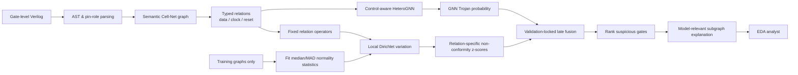
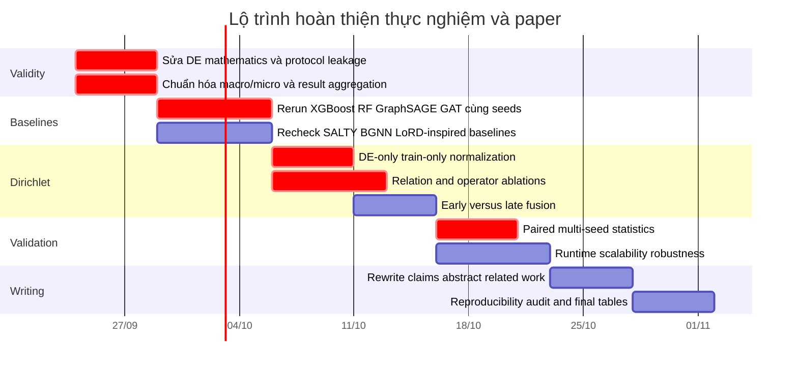

# Đánh giá chuyên sâu bản thảo: Control-Aware Heterogeneous Graphs, Dirichlet Energy và giá trị mới cho Hardware Trojan Localization

## Tóm tắt điều hành

Sau khi đọc lại **bản thảo mới nhất** của bạn và đối chiếu với baseline Whitten–Wolff–Papachristou cùng các công trình GNN/graph HT gần đây, kết luận của tôi là:

> **Hướng nghiên cứu hiện tại là tốt và có giá trị nghiên cứu thực sự, nhưng novelty mạnh nhất hiện nay không nằm ở “Heterogeneous GNN” hay “Dirichlet Energy” riêng lẻ. Novelty mạnh nhất nằm ở sự kết hợp giữa:**
>
> **semantic Cell–Net representation → explicit data/control semantics → strict cross-family generalization → relation-specific structural non-conformity.**

Bản thảo hiện đã có một research story tốt hơn đáng kể so với các phiên bản trước: bạn mô hình hóa netlist thành đồ thị hai phía `Cell–Net`, phân biệt data/control/clock/reset, dùng HeteroGNN cho node-level localization, đánh giá bằng LOFO trên 30 Trust-Hub circuits/5 families, và đưa Dirichlet Energy từ vai trò chẩn đoán oversmoothing sang một tín hiệu local structural anomaly. Bản thảo báo cáo HeteroTrojanGNN đạt Macro-\(F_1=0.5239\pm0.0454\), PR-AUC \(=0.5731\pm0.0195\), MCC \(=0.5473\pm0.0336\), và phiên bản Dirichlet late-fusion được mô tả là còn cải thiện thêm. fileciteturn0file0

Tuy nhiên, tôi **chưa khuyến nghị đặt Dirichlet Energy làm contribution số một hoặc đưa nó lên đầu title của paper ngay lúc này**. Nguyên nhân không phải vì ý tưởng yếu, mà vì bằng chứng thực nghiệm trong bản thảo hiện chưa sạch và nhất quán đủ để chịu phản biện mạnh. Có bốn vấn đề cần xử lý trước:

1. **Nguy cơ label leakage trong Dirichlet normalization**: định nghĩa \(B_c\) dùng “benign gates”; nếu median/MAD của DE được tính từ benign nodes của validation/test family thì test labels đã đi vào detector. Bản thảo hiện chưa chứng minh rõ các statistics này được fit **chỉ trên training folds rồi freeze**. fileciteturn0file0  
2. **Hai con số M3 chưa nhất quán**: có nơi late fusion được báo cáo khoảng \(0.5385\pm0.0410\), trong khi một bảng M0–M3 khác cho M3 khoảng \(0.3718\pm0.2727\). Hai SD này dường như đang aggregate trên hai trục khác nhau — seeds và families — nhưng văn bản đang trình bày như cùng một metric. fileciteturn0file0
3. **Định nghĩa Dirichlet/Rayleigh chưa hoàn toàn nhất quán về toán học**: normalized Laplacian, denominator và local energy đang dùng ba normalization không hoàn toàn tương đương.
4. **Baseline Whitten công bố LOFO Micro-\(F_1\approx0.033\), không phải chính thức Macro-\(F_1=0.0300\)**. Vì vậy câu “\(0.5239\) so với \(0.0300\)” hiện đang so Macro với một giá trị tái lập/aggregate khác; paper phải đưa baseline qua **chính xác cùng evaluation pipeline** trước khi claim improvement. Công trình Whitten dùng năm đặc trưng LGFi/FFi/FFo/PI/PO, XGBoost và Trust-Hub 30 circuits; trọng tâm chính của bài là so sánh XAI, còn LOCO/LOFO được dùng để chỉ ra giới hạn generalization của representation dạng bảng. citeturn27search1

Về novelty so với literature, tôi đánh giá như sau:

| Thành phần | Mức novelty hiện tại | Nhận xét |
|---|---:|---|
| GNN cho HT localization | Thấp | Đã có nhiều công trình từ 2021–2026. |
| Heterogeneous graph cho HT | Thấp–trung bình | HGAT4TJ 2025 đã dùng heterogeneous graph cho HT trong mixed-signal circuits. citeturn29search3 |
| Cell–Net / netlist graph | Trung bình | Directed/hypergraph netlist representations đã có trong broader EDA, ví dụ DE-HNN. citeturn30search1 |
| Explicit data/control/clock/reset semantics | **Khá cao trong HT context** | Đây là điểm nên giữ mạnh. |
| Phát hiện harmful control-hub shortcuts | **Khá cao** | Đặc biệt nếu degree-matched/random-control ablation chứng minh đó là semantics chứ không chỉ degree. |
| Strict cross-family LOFO | **Cao về experimental contribution** | Literature có unseen-design claims, nhưng protocol rất không đồng nhất. |
| Dirichlet energy để phân tích oversmoothing | Trung bình/thấp | Đây là khái niệm đã có lâu trong GNN theory. citeturn30academia4 |
| Relation-specific local DE như HT anomaly score | **Có tiềm năng cao** | Tôi chưa tìm thấy primary HT work trực tiếp làm đúng việc này trong khảo sát tập trung. |
| GNN + relation-specific DE late fusion | **Có tiềm năng cao nhưng chưa chứng minh đủ** | Phải thắng M0 ổn định, leakage-free và statistically significant. |
| Graph XAI | Trung bình/thấp | SALTY và baseline XAI đã đặt explainability vào HT detection. citeturn28academia48turn27search1 |

**Phán quyết tổng thể:** đề tài đủ mạnh cho luận văn và có khả năng thành paper tốt. Nhưng paper nên được định vị là **cross-family semantic graph learning with control-aware structural modeling**, còn Dirichlet Energy trở thành contribution chính **chỉ sau khi hoàn thành thí nghiệm xác nhận mà tôi đề xuất dưới đây**.

## Bản thảo hiện tại và baseline thực sự khác nhau ở đâu

Baseline chính thức hiện đã được xuất bản trên *Journal of Electronic Testing* tháng 8/2026 dưới tên *Explainability Methods for Hardware Trojan Detection: A Systematic Comparison*. Baseline sử dụng năm đặc trưng structural scalar của Hasegawa, XGBoost/RF/SVM, Trust-Hub 30 circuits, random 60/20/20 split làm protocol chính và thêm LOCO/LOFO để khảo sát generalization boundary. Với primary split, XGBoost đạt precision 48.08%, recall 69.44%, \(F_1=0.568\), MCC \(=0.575\), AUPRC \(=0.637\); bài cũng xây dựng property-based explanations, k-NN case-based explanations, LIME/SHAP/gradient attribution. citeturn27search1

Điều quan trọng là baseline **không phải một graph-learning SOTA**. Vì vậy baseline này rất phù hợp để làm **motivating baseline** cho luận văn — đặc biệt vì nó dùng đúng Trust-Hub circuits và bản thân bài đã phát hiện cross-family breakdown — nhưng **không đủ để làm sole SOTA baseline cho paper**. Paper của bạn phải đối đầu với các graph/GNN methods gần đây.

Bản thảo mới của bạn đi xa hơn baseline trên bốn tầng. Thứ nhất, nó giữ cả `Cell` và `Net` thay vì chỉ còn các scalar per gate. Thứ hai, nó giữ chiều tín hiệu và phân biệt data/control semantics. Thứ ba, classifier trở thành relational message-passing model. Thứ tư, evaluation question thay đổi từ “can we classify gates in a familiar distribution?” sang “can we localize malicious cells when the complete host family is unseen?”. fileciteturn0file0

### So sánh trực tiếp research design

| Khía cạnh | Whitten et al. 2026 | Bản thảo của bạn | Nhận định |
|---|---|---|---|
| Đơn vị dự đoán | Gate/sample | Cell/gate | Cùng cấp độ localization. |
| Representation | 5 scalar topology features | Heterogeneous bipartite Cell–Net | Đây là cải tiến lớn về information preservation. |
| Signal direction | Gián tiếp qua distance features | Explicit directed relations | Có giá trị. |
| Control semantics | Không tách clock/reset/data | Explicit data/control/clock/reset | **Một novelty quan trọng.** |
| Model | XGBoost/RF/SVM | HeteroGNN | Không mới nếu đứng riêng. |
| Dirichlet | Không | Relation-specific global/local DE | Potential novelty. |
| XAI | Property/CBR/LIME/SHAP/gradient | Graph subgraph explanations | Tốt nhưng không nên là primary novelty. |
| OOD | LOCO + LOFO để chỉ ra failure | LOFO là core evaluation | **Positioning mạnh hơn.** |
| Dataset | 30 Trust-Hub circuits | 30 Trust-Hub circuits | Thuận lợi cho replication. |
| Headline LOFO | Baseline collapse | Manuscript: Macro-\(F_1=.5239\) | Phải chuẩn hóa aggregation trước khi claim. |

citeturn27search1 fileciteturn0file0

Tôi đặc biệt đồng ý với việc bạn chuyển trọng tâm từ **“Hardware Trojan Detection”** sang **“Hardware Trojan Localization”**. Các công trình mới như HTOD-BGNN và LoRD cũng đang đẩy field về localization thay vì circuit-level yes/no detection. HTOD-BGNN mô hình hóa bài toán như object detection và báo cáo \(F_1=54.01\%\) trên TrustHub, \(90.04\%\) trên TRIT, đồng thời đánh giá unseen-circuit generalization; LoRD tháng 9/2026 lại cho thấy targeted structural/signal-flow heuristics có thể rất mạnh trên ICCAD 2025 contest cases. citeturn28search0turn29academia48

Điều đó cũng dẫn tới một cảnh báo quan trọng:

> **Không nên claim “state-of-the-art” chỉ vì \(F_1=0.5239\) cao hơn Whitten.**

HTOD-BGNN đã báo cáo TrustHub \(F_1=0.5401\), gần chính xác cùng mức numerical range, mặc dù dataset composition, task definition, split và aggregation khác nhau nên hai con số **không thể so trực tiếp**. citeturn28search0

Paper tốt hơn nên claim:

> “substantial improvement over matched tabular and homogeneous baselines under a strict family-disjoint protocol”

thay cho:

> “outperforms state-of-the-art Hardware Trojan detectors.”

## Bản đồ y văn và khoảng trống nghiên cứu

### Các công trình graph/GNN cho Hardware Trojan đáng đối chiếu

| Công trình | Năm / venue | Ý tưởng chính | Dữ liệu / task | Điểm cần lưu ý khi so với bạn |
|---|---|---|---|---|
| Yasaei et al., GNN-based HT detection/localization | 2021–2022, DATE/TCAD/TVLSI | Circuit/DFG graph + GNN cho golden-free HT detection/localization | RTL và gate-level HT | Cho thấy “GNN for HT” đã là established prior art; không được claim GNN là novelty. Danh mục công bố của nhóm xác nhận cả detection và golden-reference-free localization. citeturn28search9 |
| GATE-Net | 2022 | Supervised contrastive GCN phát hiện trigger-based HT từ netlist | Synthesizable IP cores | GNN + structural representation đã được khai thác trước. citeturn28academia49 |
| TrojanSAINT | 2023, ISCAS | Sampling-based inductive GNN, node-level detection/localization | TrustHub | Practical setting báo cáo khoảng 78% TPR/85% TNR; inductive learning rất gần với motivation generalization của bạn. citeturn28search4turn28search14 |
| Unioned GNN | 2023, IEICE ELEX | Ghép information từ input-, output- và neighbor-side của directed graph | Gate-level designs | Báo cáo recall 93.4%, F-measure 91.4%, precision 90.7% theo protocol của họ; không nên so raw numbers với LOFO của bạn. citeturn28search2 |
| FP-GNN | 2024, IEICE Trans. Inf. Syst. | Gate-level graph segmentation/GNN | Gate-level netlist | Tiếp tục củng cố rằng generic GNN-node localization không phải novelty. citeturn28search10 |
| SALTY | 2025 | GAT + Jumping Knowledge + XAI-guided post-processing | Standard HT benchmarks | Rất quan trọng vì vừa nói unseen design/scalability vừa xử lý oversmoothing/receptive field; abstract báo cáo khoảng 98% TPR/TNR theo protocol riêng. citeturn28academia48 |
| Ma et al. | 2025, IEEE TC | Harmonic-centrality features + GraphSAGE-LSTM/POOL + imbalance weighting | SAED, LEDA | F1 rất cao trên dữ liệu của họ nhưng không cùng Trust-Hub LOFO; cho thấy enriched graph topology features cũng không phải riêng bạn. citeturn29search0 |
| HGAT4TJ | 2025, IEICE ELEX | Heterogeneous graph attention kết hợp gate- và transistor-level | Mixed-signal benchmarks | **Trực tiếp loại bỏ claim “first heterogeneous graph for HT”.** Nhưng không xử lý đúng Cell–Net data/control semantics như bạn. citeturn29search3 |
| HTOD-BGNN | 2026, IEEE TC | Bidirectional Jumping-Knowledge GNN + region refinement/object detection | TrustHub + TRIT | Đối thủ hiện tại rất quan trọng; TrustHub F1 54.01%, unseen-circuit generalization. citeturn28search0 |
| Directed adaptive Louvain | 2026, *Electronics* | Directed modularity + gate semantic weighting + anomaly features + GNN | Expanded Trust-Hub | Cho thấy directed/semantic circuit graph modeling đang là hướng active. citeturn29search2 |
| LoRD | 2026, arXiv, 15/09/2026 | Lightweight structural/signal-flow heuristics thay generic ML | ICCAD 2025 contest | Rất mới; score 2.957/3, nhưng **khác benchmark và metric**. Baseline của bạn chỉ nên gọi “LoRD-inspired”, trừ khi tái lập đúng algorithm/protocol. citeturn29academia48 |

Điều nổi bật từ bảng trên là **field không thiếu GNN**. Vì vậy việc paper kể câu chuyện “existing methods use tabular ML, chúng tôi chuyển sang GNN” là không còn đủ mạnh vào năm 2026.

Story nên là:

> **Prior graph detectors learn connectivity, but circuit connectivity is not semantically homogeneous. High-fanout global control nets induce a fundamentally different connectivity regime from functional dataflow. We therefore separate these relations and test whether this semantic decomposition improves transfer to unseen circuit families.**

Câu chuyện này mạnh hơn và khó bị reviewer bác bằng một citation đơn lẻ.

### Dirichlet/Laplacian energy và anomaly detection

Đây là phần literature quan trọng nhất đối với contribution mới của bạn.

| Công trình | Dirichlet/Laplacian được dùng thế nào? | Liên hệ đến đề tài |
|---|---|---|
| Cai & Wang, *A Note on Over-Smoothing for GNNs* | Dùng Dirichlet energy của node embeddings để phân tích convergence/oversmoothing; dưới điều kiện phổ thích hợp, energy tiến về zero và representation mất discriminative power. citeturn30academia4 | Cơ sở tốt cho **diagnostic interpretation**, không phải novelty của detector. |
| BWGNN, ICML 2022 | Phát hiện anomaly làm spectral energy “right-shift” từ low sang high graph frequencies và thiết kế Beta-wavelet band-pass filters. citeturn27search2 | Chứng minh anomaly có thể có spectral signature; nhưng **không phải local Dirichlet anomaly score**. |
| DE-HNN, AISTATS 2024 | Mô hình circuit netlist như **directed hypergraph**, nhấn mạnh directionality và net-level interactions. citeturn30search1 | Quan trọng để bạn không claim Cell/Net hoặc directionality tự thân là chưa từng có trong EDA. |
| ANoCo, CVPR 2026 | Xây bipartite query-to-normal graph, anchor normal nodes, tối ưu convex Laplacian energy; anomaly score là **magnitude of feature update required to conform to normal manifold**, không phải đơn giản giá trị local energy ban đầu. citeturn27search0 | Đây là literature bridge tốt nhất cho “structural non-conformity”, nhưng formulation của bạn **không phải ANoCo**. |
| Bản thảo của bạn | \(e_{i,r}\) đo local representation variation theo relation \(r\), sau đó robust-normalize bằng median/MAD và fuse \(z_{\text{data}},z_{\text{ctrl}}\) với GNN score. fileciteturn0file0 | Tôi chưa thấy prior HT work trong khảo sát tập trung này sử dụng **relation-specific local Dirichlet residuals trực tiếp để rank/localize Trojan gates**. Đây là khoảng novelty đáng theo đuổi. |

Một điểm rất quan trọng: **ANoCo không chứng minh rằng “high local Dirichlet energy = anomaly” theo đúng formulation của bạn**. ANoCo tối ưu một Laplacian-energy problem với normal anchors rồi lấy **độ dịch chuyển cần thiết để ép query về normal manifold** làm anomaly score. citeturn27search0

Vì vậy đoạn literature của bạn nên viết:

> “Inspired by the non-conformity interpretation of graph Laplacian optimization in ANoCo, we investigate whether relation-specific local embedding variation can serve as a structural non-conformity cue for gate-level HT localization.”

Không nên viết:

> “Following ANoCo, Dirichlet energy directly provides an anomaly score.”

Đó là hai phương pháp khác nhau.

### Control-aware và relation-specific circuit graphs

Broad circuit-GNN literature cũng khiến một số claims hiện tại cần thu hẹp. DeepSeq tại DATE 2024 đã chỉ ra sequential netlists cần customized propagation để biểu diễn temporal correlation, trong khi DE-HNN mô hình hóa netlist như directed hypergraph thay vì ordinary graph. citeturn30search0turn30search1 HGAT4TJ 2025 dùng heterogeneous graph để hợp nhất gate-level và transistor-level structures cho HT detection. citeturn29search3

Do đó, novelty hợp lý của bạn không phải:

> “We are the first to preserve circuit semantics in a heterogeneous graph.”

Mà nên là:

> **“We explicitly isolate functional dataflow from high-fanout global control connectivity and quantify their distinct effects on cross-family HT localization.”**

Đây là một claim nhỏ hơn nhưng **khoa học hơn và khó phản biện hơn**.

## Đối sánh novelty và đánh giá Dirichlet Energy

### Ma trận phương pháp

| Method | Representation | Control relations | Dirichlet energy | Dataset | Cross-family/unseen-design evidence |
|---|---|---|---|---|---|
| Whitten et al. 2026 | Tabular, 5 structural features | Không | Không | 30 Trust-Hub circuits | LOCO/LOFO cho thấy severe generalization failure; primary task vẫn là XAI comparison. citeturn27search1 |
| TrojanSAINT | Gate-level graph | Không tách clock/reset theo semantics như đề tài | Không | TrustHub | Inductive sampling, nhưng protocol không tương đương strict five-family LOFO. citeturn28search14 |
| Unioned GNN | Directed gate graph | Directional input/output context | Không | Gate-level designs | Cross-design averaging, không đủ dữ liệu để coi là cùng protocol LOFO. citeturn28search2 |
| SALTY | Graph/GAT + JK | Không phải explicit data/clock/reset relation model | Không; JK xử lý depth/receptive field | Standard HT benchmarks | Có emphasis trên unseen designs; headline TPR/TNR ~98%, metric/protocol khác. citeturn28academia48 |
| HGAT4TJ | Heterogeneous gate/transistor graph | Cross-domain relation | Không | Mixed-signal benchmarks | Node accuracy >97%; không phải five-family gate-level Trust-Hub LOFO. citeturn29search3 |
| HTOD-BGNN | Bidirectional graph + JK | Direction-aware, không cùng control taxonomy | Không | TrustHub + TRIT | TrustHub F1 54.01%, TRIT 90.04%; unseen-circuit analysis. citeturn28search0 |
| LoRD | Structural/signal-flow heuristic | Signal-flow aware | Không | ICCAD 2025 contest | Near-perfect contest localization; khác benchmark/task. citeturn29academia48 |
| **HeteroTrojanGNN / Config F** | **Heterogeneous Cell–Net** | **Data/control explicitly separated; best model suppresses control propagation** | Diagnostic | 30 Trust-Hub, 5 families | Manuscript: Macro-F1 .5239±.0454, PR-AUC .5731±.0195. fileciteturn0file0 |
| **M1 DE-only** | Relation-specific projected operators | data/control scores | **Local DE residual** | Same manuscript dataset | Standalone performance còn yếu; chưa đủ làm main detector. fileciteturn0file0 |
| **M3 GNN+DE** | Hetero graph + local spectral residual | Có | **Late fusion** | Same manuscript dataset | Có dấu hiệu gain, nhưng aggregation hiện chưa nhất quán và cần statistical validation. fileciteturn0file0 |

Một insight hơi ngược trực giác nhưng rất quan trọng cho title của bạn là:

> **Model tốt nhất của bạn hiện tại là “Control-OFF”.**

Do đó “control-aware” phải được định nghĩa là:

> **identify → model → selectively suppress/gate harmful global-control connectivity**

chứ không phải:

> **use more control edges to improve classification.**

Bản thảo thực tế cho thấy Config F, tức relation-aware model với harmful control propagation bị loại bỏ, mạnh hơn Config E giữ control connectivity; đây là một kết quả thú vị hơn nhiều so với đơn giản “heterogeneous relations help”. fileciteturn0file0

### Dirichlet Energy hiện đã đủ là “method contribution” chưa?

**Hiện tại: chưa hoàn toàn.**

Tôi sẽ phân biệt ba cấp độ:

\[
\text{Diagnostic}
\;<\;
\text{Useful auxiliary signal}
\;<\;
\text{Independent methodological contribution}.
\]

Bạn đã vượt qua cấp **diagnostic** vì bản thảo không chỉ plot global energy; bạn đã xây local \(e_{i,r}\), robust residual \(z_{i,r}\), DE-only detector và fusion detector. fileciteturn0file0

Nhưng để đạt cấp **independent methodological contribution**, cần chứng minh:

\[
M_3 \;>\; M_0
\]

một cách nhất quán trên **cùng fold, cùng seed, cùng aggregation, không leakage**, đồng thời:

\[
M_1 > \text{random/rank baseline}
\]

và phải chỉ ra \(z_{\text{data}}\), \(z_{\text{ctrl}}\) mang thông tin bổ sung mà GNN probability chưa chứa.

Hiện M1 của bạn khá yếu. Điều đó **không làm ý tưởng DE thất bại**. Ngược lại, nó gợi ý một research story khoa học hợp lý hơn:

> **Dirichlet non-conformity is not a standalone HT detector; it is a complementary structural cue that improves ranking/calibration when combined with learned relational representations.**

Câu này nếu được M3 chứng minh bằng confidence interval thì rất mạnh.

### Một vấn đề phương pháp luận rất quan trọng: khả năng leakage

Bản thảo định nghĩa statistics kiểu:

\[
\mu_{c,r}
=
\operatorname{median}_{j\in B_c}
\log(e_{j,r}+\epsilon),
\]

với \(B_c\) là benign gates của category \(c\), rồi dùng MAD để tạo \(z_{i,r}\). fileciteturn0file0

Nếu \(B_c\) chứa **benign labels từ held-out test family**, detector đã được biết đâu là clean gate trong test circuit. Khi đó strict OOD claim không còn hợp lệ.

Protocol đúng phải là:

\[
\{\mu_{c,r},MAD_{c,r}\}
=
\operatorname{Fit}
\left(
D_{\text{train}}^{\text{benign}}
\right)
\]

sau đó:

\[
\boxed{
\mu,MAD\ \text{frozen for validation and held-out family}
}
\]

Tốt hơn nữa, nên có cả hai biến thể:

**Supervised-normal calibration:** statistics lấy từ known-benign training gates.

**Contamination-robust unsupervised calibration:** median/MAD lấy từ **toàn bộ training gates không dùng labels**, tận dụng việc contamination chỉ khoảng dưới 1%. Cách thứ hai làm câu chuyện deployment mạnh hơn rất nhiều.

Nếu min-max normalization của \(z\) cũng đang tính riêng trên test circuit, nó dùng test-distribution information. Điều này không nhất thiết sai nếu bạn tuyên bố **transductive circuit-level ranking**, nhưng không còn là strict inductive LOFO. Với strict setup, scaler, median, MAD, min/max và fusion coefficients đều phải train/validation-only.

### Một vấn đề toán học cần sửa trước khi gửi paper

Nếu bạn định nghĩa normalized Laplacian:

\[
L_{\mathrm{sym}}
=
I-D^{-1/2}AD^{-1/2},
\]

thì một Rayleigh-type energy hợp lý là:

\[
R(H)
=
\frac{\operatorname{Tr}(H^\top L_{\mathrm{sym}}H)}
{\|H\|_F^2},
\]

và phổ của \(L_{\mathrm{sym}}\) nói chung nằm trong:

\[
[0,2],
\]

không mặc định \([0,1]\).

Trong khi đó nếu dùng unnormalized Laplacian:

\[
L=D-A,
\]

generalized quotient là:

\[
R(H)
=
\frac{\operatorname{Tr}(H^\top LH)}
{\operatorname{Tr}(H^\top DH)}.
\]

Hai formulation có quan hệ, nhưng paper phải chọn một convention nhất quán. Lý thuyết Dirichlet-energy/oversmoothing trong GNN cũng đòi hỏi phải nói rõ Laplacian và normalization đang được dùng. citeturn30academia4

Ngoài ra local score hiện tại của bạn có dạng:

\[
e_{i,r}
=
\frac{
\sum_j A_r(i,j)\|h_i-h_j\|_2^2
}{
\sum_j A_r(i,j)+\epsilon
}.
\]

Đây là **mean local edge variation** trên raw embeddings. Nó không đúng bằng local decomposition của normalized Dirichlet energy nếu global equation lại dùng:

\[
\left\|
\frac{h_i}{\sqrt{d_i}}
-
\frac{h_j}{\sqrt{d_j}}
\right\|^2.
\]

Tôi khuyến nghị gọi chính xác:

> **relation-specific local Dirichlet variation**

hoặc

> **local relation-specific embedding energy**

và sau đó định nghĩa robust residual thành:

> **Dirichlet non-conformity score**.

Đừng gộp ba khái niệm thành một.

### Operator control cũng cần đổi cách diễn giải

Bạn đang tạo một operator kiểu:

\[
A_{\mathrm{ctrl}}^{cell}
=
M_{\mathrm{in,ctrl}}^\top
M_{\mathrm{in,ctrl}}.
\]

Operator này nối hai sink cells nếu chúng **chia sẻ một control net**. Nghĩa là nó là một **co-control / shared-control affinity graph**, không phải trực tiếp là directed control signal-flow graph.

Ví dụ một clock net nối \(k\) flip-flops sẽ tạo clique-like connectivity giữa các sink cells. Đây chính là thứ có thể gây high-degree shortcut, nhưng semantic của nó khác:

\[
A_{\text{data}}
\sim
\text{driver}\rightarrow\text{receiver flow}
\]

trong khi:

\[
A_{\text{ctrl}}
\sim
\text{shared control membership}.
\]

Vì vậy tôi đề xuất so sánh thêm:

\[
A_{\text{ctrl-flow}}
=
M_{\text{out}}M_{\text{in,ctrl}}
\]

với:

\[
A_{\text{co-ctrl}}
=
M_{\text{in,ctrl}}^\top M_{\text{in,ctrl}}.
\]

Nếu chỉ co-control có harmful effect, contribution của bạn trở nên thú vị hơn:

> **the problem is not merely “clock is bad”; clique-expanded shared-control connectivity creates non-functional shortcuts in message passing.**

Điểm này cũng có ý nghĩa scalability. Với high-fanout net có \(k\) sinks, clique projection tiềm tàng \(O(k^2)\) edges. Một representation dưới dạng incidence/hypergraph có thể tránh materializing clique; DE-HNN là một prior rất phù hợp để thảo luận cách netlist naturally behaves as a directed hypergraph. citeturn30search1

## Protocol thực nghiệm cần làm để khóa contribution

Tôi xem bộ thí nghiệm dưới đây là điều kiện quyết định việc **Dirichlet Energy có được vào title paper hay không**.

### Detector matrix bắt buộc

| Config | Score | Normative information | Mục đích |
|---|---|---|---|
| \(M_0\) | \(p_{\mathrm{GNN}}\) | GNN train only | Reference detector |
| \(M_1^S\) | \(s_{\mathrm{DE}}\) | benign **training** gates only | Supervised-normal DE |
| \(M_1^U\) | \(s_{\mathrm{DE}}\) | all training nodes, robust median/MAD | Truly label-free robust calibration |
| \(M_2\) | GNN với DE features | Training-only DE statistics | Early fusion |
| \(M_3\) | calibrated late fusion | Validation only | Main proposed fusion |
| \(M_4\) | ANoCo-inspired adaptation | Training normal memory | Strong Laplacian non-conformity comparator |

\(M_4\) rất đáng làm. Không nhất thiết phải thắng ANoCo adaptation; mục tiêu là chứng minh local DE residual của bạn không phải một phiên bản yếu vô tình của một generic Laplacian non-conformity algorithm. ANoCo chính thức dùng anchored normal manifold và optimization-induced feature drift làm anomaly score. citeturn27search0

Late fusion nên giữ cực đơn giản:

\[
S_i
=
\sigma
\left(
\alpha\,\operatorname{logit}p_i
+
\beta z_{i,\text{data}}
+
\gamma z_{i,\text{ctrl}}
\right).
\]

Tất cả \(\alpha,\beta,\gamma,\tau\) phải được xác định mà **không chạm held-out family**.

### Ablation Dirichlet

Đừng chỉ so `DE ON/OFF`. Cần bóc tách:

| Ablation | Câu hỏi trả lời |
|---|---|
| \(E_{\mathrm{data}}\) only | Trojan non-conformity nằm trên functional dataflow không? |
| \(E_{\mathrm{ctrl}}\) only | Control topology có anomaly signal độc lập không? |
| \(E_{\mathrm{clock}}\) only | Clock gây signal gì? |
| \(E_{\mathrm{reset}}\) only | Reset có khác clock không? |
| max(data, ctrl) | Có phải “bất thường ở bất kỳ relation” đủ không? |
| weighted data+ctrl | Hai relations có bổ sung nhau không? |
| raw \(e_i\) | Local variation đơn thuần |
| robust \(z_i\) | Contribution của normality model |
| signed residual | HT có luôn high-energy hay đôi khi unusually smooth? |
| input-feature DE | Không phụ thuộc GNN |
| layer-1 DE | GNN bắt đầu biến representation thế nào? |
| layer-2/final DE | Non-conformity có xuất hiện sau learned propagation không? |

Đặc biệt, **signed residual** đáng thử. Hiện bạn dùng:

\[
| \log e_i-\mu |.
\]

Điều đó giả định cả unusually high và unusually low energy đều anomalous. Đây là hypothesis hợp lý nhưng chưa được chứng minh. Hãy phân tích distribution của HT/benign trước khi lấy absolute value.

### Control-edge causal tests

Đây có thể trở thành thí nghiệm đẹp nhất paper:

\[
\text{Control OFF}
\quad vs\quad
\text{Random-edge removal}
\quad vs\quad
\text{Degree-matched removal}
\quad vs\quad
\text{Clock-only removal}
\quad vs\quad
\text{Reset-only removal}.
\]

Nếu `Control OFF` thắng `Degree-Matched OFF`, bạn mới có bằng chứng rằng hiệu ứng đến từ **control semantics**, không chỉ vì giảm degree.

Thêm một test rất quan trọng:

> Giữ **cùng embeddings \(H\)**, chỉ thay Laplacian/operator khi đo energy.

Sau đó tách nó khỏi test:

> retrain model với control ON/OFF rồi đo trên **cùng fixed \(L_\text{data}\)**.

Nếu không tách hai thứ này, thay đổi Dirichlet energy có thể xuất phát từ graph operator, learned representation hoặc cả hai; không thể nói nó “chứng minh causally rằng control edges gây oversmoothing.”

### Evaluation protocol

Tôi khuyến nghị primary endpoint là:

\[
\boxed{\text{PR-AUC}}
\]

vì prevalence chỉ khoảng \(0.78\%\) trong dataset của bản thảo. Macro-\(F_1\) vẫn quan trọng, nhưng phụ thuộc threshold nhiều hơn. fileciteturn0file0

Bộ metric tối thiểu:

\[
\text{PR-AUC},\quad
F_1,\quad
MCC,\quad
Precision,\quad
Recall,\quad
FP/1000,
\]

cộng thêm:

\[
FPR@TPR=80\%, \qquad
FPR@TPR=90\%,
\]

và cho localization workflow:

\[
P@10,\;P@50,\;R@50,\;\text{worst-family }F_1.
\]

AUROC có thể báo cáo, nhưng không nên là headline metric.

Cross-family phải báo cáo **cả five-family table**, không chỉ global mean:

\[
RS232,\ s15850,\ s35932,\ s38417,\ s38584.
\]

Điều này đặc biệt cần thiết vì 22/30 circuits thuộc RS232 và class/family balance rất không đều trong Trust-Hub theo chính audit của bản thảo. fileciteturn0file0

### Statistical protocol

Hiện ba seeds `42, 123, 456` tốt hơn single-run, nhưng với contribution DE nhỏ, tôi khuyến nghị tối thiểu **5 seeds**, tốt hơn là 10 nếu chi phí cho phép.

Đơn vị thống kê không nên là từng gate độc lập. Gates nằm trong cùng graph có correlation, nên coi hàng chục nghìn gates là independent samples sẽ tạo p-value quá lạc quan.

Protocol phù hợp:

\[
(\text{family fold},\text{seed})
\]

là paired experimental unit.

Cho mỗi pair:

\[
\Delta_{\mathrm{PR-AUC}}
=
PR\!-\!AUC(M_3)-PR\!-\!AUC(M_0)
\]

và tương tự với F1/MCC.

Báo cáo:

\[
\text{mean }\Delta,\quad
95\%\ CI,\quad
p_{\text{paired}},
\]

dùng paired permutation test hoặc Wilcoxon signed-rank như sensitivity analysis. Nếu chạy nhiều ablations, dùng Holm correction.

Tốt hơn nữa, dùng **hierarchical bootstrap**:

\[
\text{family}
\rightarrow
\text{circuit}
\rightarrow
\text{seed}.
\]

Với calibration/fusion, thêm Brier score hoặc ECE để xác định DE đang thực sự làm classification tốt hơn hay chỉ thay đổi ranking.

### Hyperparameters phải công khai

Bản paper cần một table duy nhất chứa tối thiểu:

| Nhóm | Cần báo cáo |
|---|---|
| GNN | layers, hidden dimension, relation aggregator, activation, dropout |
| Optimization | Adam/AdamW, learning rate, weight decay, epochs |
| Imbalance | positive-class weight / sampler |
| Training | early stopping, patience, primary validation metric |
| Graph | directed/reverse relations, self loops |
| DE | \(\epsilon\), Laplacian normalization, zero-degree handling |
| Robust norm | median/MAD scope, category definition |
| Fusion | search range của \(\alpha,\beta,\gamma,\tau\) |
| Threshold | validation-only procedure |
| Randomness | full seed list |
| Baselines | identical search budget hoặc fixed published configs |
| Runtime | CPU/GPU, peak memory, graph construction/training/inference time |
| Capacity | total trainable parameters từng model |

Đặc biệt A/B/C/D/E/F phải cùng multi-seed regime. Hiện một số bảng của bản thảo có A/B chỉ dùng một seed trong khi C–F báo cáo mean±SD; như vậy evidence strength chưa cân bằng. fileciteturn0file0

## Góp ý cốt lõi và góp ý hoàn thiện

**Góp ý cốt lõi (Major)**

**Major A — Sửa claim novelty.**  
Không claim “first heterogeneous GNN for Hardware Trojan”. HGAT4TJ đã tồn tại năm 2025. citeturn29search3 Không claim “first graph model preserving netlist directionality”; DE-HNN và DeepSeq là prior art rõ ràng trong circuit representation. citeturn30search1turn30search0

Claim nên chuyển thành:

> **“To our knowledge, this work is among the first to explicitly study the effect of functional-data versus global-control relations on family-disjoint gate-level HT localization, and to investigate relation-specific Dirichlet non-conformity as a complementary localization signal.”**

Tôi cố ý dùng **“among the first”**, không dùng “the first”. Một focused search chưa đủ để chứng minh universal priority claim.

**Major B — Zero-label-leakage claim hiện chưa đủ chặt.**  
Phải nói rõ \(B_c\), median, MAD, scaler, min-max, fusion weights và threshold được fit ở đâu. Nếu bất kỳ statistics nào dùng test-family labels, strict LOFO invalid. fileciteturn0file0

**Major C — Chuẩn hóa toàn bộ metric aggregation.**  
Bản thảo phải định nghĩa một lần:

\[
F_{s,f}
=
F_1(\text{seed }s,\text{held-out family }f)
\]

sau đó ví dụ:

\[
\text{Macro-LOFO}(s)
=
\frac1{5}\sum_fF_{s,f}
\]

và cuối cùng:

\[
\mu_s\pm\sigma_s.
\]

Không được trộn `SD across families` với `SD across seeds`. Đây có vẻ là nguyên nhân của discrepancy M3 \(0.3718\pm0.2727\) và \(0.5385\pm0.0410\). fileciteturn0file0

**Major D — Baseline comparison phải apples-to-apples.**  
Whitten published LOFO result và kết quả tái lập của bạn phải được phân biệt. Bài Springer chính thức sử dụng năm Hasegawa features và xác định LOCO/LOFO là generalization-boundary analyses; primary random-split XGBoost F1 là 0.568. citeturn27search1

Trong paper nên viết kiểu:

> “Under our reimplemented family-disjoint protocol, the five-feature XGBoost baseline obtains Macro-F1 = X, whereas the proposed model obtains Y.”

không viết:

> “Whitten reports Macro-F1 0.0300”

trừ khi đúng metric đó xuất hiện trực tiếp trong source.

**Major E — Sửa mathematical definition của DE.**  
Global normalized Dirichlet energy, Rayleigh quotient và local raw edge variation phải được định nghĩa thống nhất. Không khẳng định range \([0,1]\) nếu operator hiện tại không bảo đảm điều đó.

**Major F — Không dùng “oversmoothing is proven”.**  
Cai–Wang cung cấp theoretical connection giữa Dirichlet-energy collapse và oversmoothing trong GNNs. citeturn30academia4 Nhưng việc bạn quan sát effective rank/DE thay đổi ở vài circuits chưa đủ để nói “control edges definitively cause representation collapse”.

Nên đổi:

> “control edges cause representation collapse”

thành:

> “global-control connectivity is associated with lower effective rank and stronger embedding homogenization under the tested propagation schemes.”

Sau degree-matched causal controls, claim có thể mạnh hơn.

**Major G — DE contribution hiện phải được mô tả thận trọng.**  
Nếu M3 chỉ cải thiện một vài family và effect nhỏ, không nên nói “Dirichlet Energy substantially improves detection”. Hãy nói đúng kết quả:

> “DE-only detection is insufficient, but relation-specific residuals provide complementary ranking information under selected families.”

Nếu multi-seed paired CI sau cùng chứng minh M3 > M0, lúc đó mới nâng claim.

**Major H — External generalization sẽ quyết định paper tier.**  
30 Trust-Hub circuits là nền tảng tốt nhưng vẫn hẹp. HTOD-BGNN đã đánh giá cả TrustHub và TRIT. citeturn28search0 Nếu có thể map labels, thêm TRIT hoặc một independent benchmark sẽ làm paper mạnh lên rõ rệt. Nếu không, phải ghi limitation thẳng.

**Góp ý hoàn thiện (Minor)**

Thay cụm “super-shortcut” bằng thuật ngữ trung tính hơn trong paper: **high-fanout control-induced shortcut connectivity**. “Super-shortcut” dùng trong discussion được, nhưng không nên xuất hiện nhiều trong formal method.

“Host coordinate memorization” là một metaphor tốt nhưng hiện được dùng như causal fact. Nên viết **“consistent with host-coordinate memorization”** trừ khi bạn trực tiếp đo khả năng predict circuit/family identity từ features. Linear family probe gần chance cũng chỉ chứng minh family information khó linear-decode, không chứng minh representation “không chứa domain information”.

“Causal Hardware Subgraph Localization” cũng hơi mạnh nếu GNNExplainer chỉ là post-hoc explanation. Nên đổi thành **“model-relevant computational subgraph localization”**. GNNExplainer không thiết lập causal effect theo nghĩa causal inference.

Không nên gọi LoRD table của mình là “LoRD” nếu implementation chỉ lấy một số structural heuristics từ paper; LoRD là một procedure gắn với ICCAD 2025 challenge. citeturn29academia48 Dùng:

> **LoRD-inspired structural heuristic**

sẽ chính xác hơn.

### Title tôi khuyến nghị

Ở **trạng thái evidence hiện tại**, title tốt nhất là:

> **Control-Aware Semantic Cell–Net Graph Learning for Cross-Family Gate-Level Hardware Trojan Localization**

Tiếng Việt:

> **Học đồ thị Cell–Net ngữ nghĩa nhận biết tín hiệu điều khiển cho định vị Hardware Trojan mức cổng xuyên họ vi mạch**

Tên này rất an toàn vì đúng với contribution đã được support tốt nhất.

Nếu các experiment mới chứng minh:

\[
M_3>M_0
\]

ổn định, significant và leakage-free, tôi khuyên paper chuyển thành:

> **Relation-Specific Dirichlet Non-Conformity on Control-Aware Cell–Net Graphs for Cross-Family Hardware Trojan Localization**

Tên này theo tôi **sắc hơn**:

> ~~Relation-Specific Dirichlet Energy~~

thành

> **Relation-Specific Dirichlet Non-Conformity**

vì novelty không nằm ở việc “tính energy”; novelty nằm ở việc biến energy residual thành **normality deviation signal**.

### Abstract nên viết lại theo hướng này

**Ví dụ tiếng Việt**

> Các phương pháp GNN phát hiện Hardware Trojan gần đây khai thác cấu trúc kết nối của netlist, nhưng phần lớn chưa khảo sát tường minh sự khác biệt giữa luồng dữ liệu chức năng và các mạng điều khiển toàn cục có fanout lớn. Nghiên cứu này đề xuất biểu diễn Cell–Net dị thể giữ nguyên chiều tín hiệu và phân tách quan hệ data, clock và reset cho bài toán định vị Trojan mức cổng trên các họ mạch chưa xuất hiện trong huấn luyện. Thực nghiệm Leave-One-Family-Out trên 30 mạch Trust-Hub cho thấy việc kiểm soát propagation qua mạng điều khiển cải thiện đáng kể khả năng khái quát hóa so với các baseline tabular và homogeneous graph được đánh giá theo cùng giao thức. Chúng tôi đồng thời khảo sát relation-specific Dirichlet non-conformity như một tín hiệu bổ sung cho localization; kết quả cho thấy tín hiệu này [điền kết quả leakage-free cuối cùng] khi kết hợp với xác suất GNN, trong khi DE đơn độc không đủ để thay thế learned detector.

Điểm tôi cố tình thêm là:

> **“DE đơn độc không đủ”**

Đó không phải điểm yếu. Đây là một kết quả khoa học trung thực và làm late fusion có lý do tồn tại.

**English example**

> Existing graph-based Hardware Trojan detectors exploit netlist connectivity, yet the distinct roles of functional dataflow and high-fanout global-control networks remain largely underexplored under cross-design distribution shift. We introduce a semantic heterogeneous Cell–Net representation that preserves signal direction and explicitly separates data, clock, and reset relations for gate-level Trojan localization on unseen circuit families. Under a strict Leave-One-Family-Out protocol on 30 Trust-Hub circuits, control-aware relational propagation substantially improves generalization over matched tabular and homogeneous-graph baselines. We further investigate relation-specific Dirichlet non-conformity as a complementary localization cue; our leakage-free evaluation shows that [insert final result], while Dirichlet scoring alone remains insufficient as a standalone detector.

### Methods nên thêm một câu định nghĩa “control-aware”

> **“In this work, control-aware does not imply indiscriminate inclusion of control edges. Rather, it denotes explicit identification of global control connectivity followed by relation-dependent propagation, suppression, or diagnostic analysis.”**

Câu này giải quyết ngay nghịch lý “control-aware nhưng best model là control OFF”.

### Discussion nên thêm đoạn tự phản biện

> **“Our findings do not imply that Hardware Trojans are universally high-Dirichlet-energy structures. Trojan circuitry may be designed to mimic the local topology of benign logic, and some malicious nodes may exhibit unusually smooth rather than highly varying representations. We therefore interpret relation-specific Dirichlet residuals as complementary non-conformity evidence rather than a necessary or sufficient signature of malicious logic.”**

Đây là đoạn reviewer sẽ đánh giá cao vì bạn chủ động giới hạn phạm vi claim.

## Rủi ro, pipeline và lộ trình đưa thành paper

Các rủi ro lớn nhất hiện nay không còn là “model performance thấp”, mà là **validity of the scientific claim**.

Thứ nhất, Trust-Hub nhỏ, cũ và family distribution mất cân bằng; RS232 chiếm phần lớn số circuits trong tập bạn sử dụng. fileciteturn0file0 Thứ hai, Trojan có thể được synthesis/resynthesis làm biến đổi structural signature; LoRD mới nhất cũng nhấn mạnh chính vấn đề post-synthesis manifestation của RTL Trojan. citeturn29academia48 Thứ ba, pin-role parsing phụ thuộc standard-cell naming/library conventions; đổi library có thể làm `CLK`, `CK`, `CP`, `RN`, `SN`, `RESET_B` trở thành domain shift mới. Thứ tư, materialized co-control projection có thể phát nổ theo fanout. Thứ năm, exact betweenness/PageRank-type features và Graph XAI có thể không scale tuyến tính sang industrial netlists.

Một robustness section tốt nên có ít nhất:

\[
\text{original netlist}
\rightarrow
\text{resynthesis}
\rightarrow
\text{buffer insertion}
\rightarrow
\text{equivalent gate substitution}
\]

rồi đo:

\[
R(p)=
\frac{Metric(\text{perturbed})}
{Metric(\text{original})}.
\]

Đồng thời stratify performance theo:

\[
\log |V|,\quad |E|,\quad
\text{clock fanout},\quad
\text{Trojan size}.
\]

Pipeline sau khi sửa leakage nên là:

Điểm quan trọng nhất trong sơ đồ là đường:

\[
\boxed{\text{Training graphs only}\rightarrow\text{normality statistics}}
\]

Nó phải xuất hiện cả trong method diagram lẫn pseudocode để reviewer không còn nghi ngờ leakage.

### Lộ trình ưu tiên

### Checklist để trở thành paper có thể gửi

| Ưu tiên | Việc cần khóa | Trạng thái theo bản thảo hiện tại |
|---|---|---|
| **P0** | DE median/MAD hoàn toàn train-only | **Cần làm rõ/sửa** |
| **P0** | Min-max/scaler không fit test family | **Cần xác minh** |
| **P0** | Một definition duy nhất cho normalized DE/Rayleigh | **Cần sửa** |
| **P0** | Giải quyết \(0.5385\) vs \(0.3718\) của M3 | **Bắt buộc sửa** |
| **P0** | Sửa Config C/E hoặc các label/table inconsistency | **Bắt buộc audit** |
| **P0** | Baseline micro vs macro apples-to-apples | **Bắt buộc sửa** |
| **P1** | A–F cùng số seeds | Chưa đồng đều |
| **P1** | M0/M1/M2/M3 paired multi-seed LOFO | Cần chạy lại sạch |
| **P1** | DE data/clock/reset relation ablations | Nên bổ sung |
| **P1** | Degree-matched control-edge null model | Rất quan trọng |
| **P1** | Confidence interval cho \(\Delta M_3-M_0\) | Thiếu |
| **P1** | FP/1000 @ fixed TPR | Nên trở thành operational metric |
| **P2** | HTOD-BGNN/SALTY discussion công bằng | Cần cập nhật literature |
| **P2** | External dataset hoặc explicit limitation | Rất nên có |
| **P2** | Runtime/peak memory vs graph size | Thiếu hoặc chưa đủ |
| **P2** | Resynthesis/library robustness | Thiếu |
| **P3** | Graph XAI quantitative analysis | Có thể giữ secondary |
| **P3** | Two-tier EDA deployment story | Giữ, nhưng không overclaim industrial readiness |

### Kết luận học thuật cuối cùng

Nếu tôi đóng vai reviewer, tôi sẽ đánh giá bản hiện tại là **“promising but major revision required”**, chứ không phải reject vì thiếu novelty.

Contribution mà tôi tin nhất hiện nay là:

\[
\boxed{
\text{family-disjoint HT localization}
+
\text{semantic Cell–Net graph}
+
\text{explicit control-connectivity treatment}
}
\]

Contribution tiềm năng thứ hai là:

\[
\boxed{
\text{relation-specific Dirichlet non-conformity}
}
\]

nhưng contribution thứ hai **chưa được experimental evidence khóa chặt**.

Điểm quan trọng là bạn **không cần Dirichlet Energy để cứu đề tài**. Ngay cả khi sau thực nghiệm cuối cùng:

\[
M_3 \not> M_0
\]

một cách statistically significant, research vẫn có giá trị. Khi đó kết quả khoa học trung thực sẽ là:

> “Dirichlet energy is useful for representation diagnosis but does not provide reliable complementary detection gains.”

Paper khi ấy nên bỏ DE khỏi title và tập trung vào:

> **Control-Aware Semantic Cell–Net Graph Learning for Cross-Family Gate-Level Hardware Trojan Localization.**

Ngược lại, nếu sau khi loại bỏ leakage và chuẩn hóa protocol bạn thu được:

\[
\Delta PR\!-\!AUC>0,\qquad
\Delta F_1>0,
\]

ổn định trên phần lớn five-family folds, 95% CI không cắt zero, DE-only có anomaly-ranking ability có ý nghĩa, và relation ablation cho thấy data/control energies mang thông tin khác nhau, thì **Dirichlet mới thực sự trở thành một contribution phương pháp có thể đưa lên title**. Khi đó tôi khuyến nghị:

> **Relation-Specific Dirichlet Non-Conformity on Control-Aware Cell–Net Graphs for Cross-Family Hardware Trojan Localization**

Đây theo tôi là phiên bản có research identity rõ nhất: không phải “thêm một HeteroGNN”, mà là **một phương pháp khai thác spectral non-conformity theo ngữ nghĩa quan hệ của circuit graph để hỗ trợ localization dưới distribution shift**.

### Nguồn ưu tiên để cập nhật Related Work

| Ưu tiên | Nguồn | Vì sao phải đọc/cite |
|---|---|---|
| ★★★★★ | [Whitten et al., JETTA 2026](https://link.springer.com/article/10.1007/s10836-026-06245-2) | Baseline chính thức; methods, dataset, XAI và generalization boundary. citeturn27search1 |
| ★★★★★ | [Seo et al., ANoCo, CVPR 2026](https://openaccess.thecvf.com/content/CVPR2026/html/Seo_Anomaly_as_Non-Conformity_via_Training-Free_Graph_Laplacian_Energy_Minimization_CVPR_2026_paper.html) | Literature bridge tốt nhất cho Laplacian non-conformity; cần phân biệt formulation với local DE của bạn. citeturn27search0 |
| ★★★★★ | [HTOD-BGNN, IEEE Transactions on Computers](https://doi.org/10.1109/TC.2025.3642575) | Competitor HT localization/unseen-circuit gần nhất hiện nay. citeturn28search0 |
| ★★★★★ | [SALTY, arXiv:2502.14116](https://arxiv.org/abs/2502.14116) | GNN + JK + XAI và generalization/scalability story gần với paper của bạn. citeturn28academia48 |
| ★★★★☆ | [Cai & Wang, Dirichlet Energy and Oversmoothing](https://arxiv.org/abs/2006.13318) | Cơ sở lý thuyết cho DE-as-diagnostic; không phải anomaly detector. citeturn30academia4 |
| ★★★★☆ | [BWGNN, ICML 2022](https://proceedings.mlr.press/v162/tang22b.html) | Cơ sở spectral anomaly: anomalies gây high-frequency/right-shift behavior. citeturn27search2 |
| ★★★★☆ | [DE-HNN, AISTATS 2024](https://proceedings.mlr.press/v238/luo24a.html) | Prior quan trọng về directed hypergraph representation của circuit netlists. citeturn30search1 |
| ★★★★☆ | [DeepSeq, DATE 2024](https://ieeexplore.ieee.org/document/10546639/) | Bằng chứng rằng circuit-specific propagation semantics có giá trị. citeturn30search0 |
| ★★★★☆ | [HGAT4TJ, IEICE ELEX 2025](https://www.jstage.jst.go.jp/article/elex/22/12/22_22.20250237/_article/-char/en) | Bắt buộc cite để tránh claim heterogeneous-HT novelty quá mức. citeturn29search6 |
| ★★★★☆ | [TrojanSAINT, ISCAS 2023](https://arxiv.org/abs/2301.11804) | Inductive gate-level GNN HT detection/localization. citeturn28search14 |
| ★★★★☆ | [Unioned GNN, IEICE ELEX 2023](https://doi.org/10.1587/elex.20.20230204) | Directed input/output/neighborhood graph propagation. citeturn28search2 |
| ★★★★☆ | [Ma et al., IEEE TC 2025](https://doi.org/10.1109/TC.2025.3533085) | Recent GraphSAGE + topology feature benchmark. citeturn29search0 |
| ★★★★★ | [LoRD, arXiv:2609.17922](https://arxiv.org/abs/2609.17922) | Công trình rất mới, ngày 15/09/2026; quan trọng vì thách thức giả định “ML phức tạp luôn cần thiết” cho localization. citeturn29academia48 |

Tóm lại, **tôi sẽ tiếp tục hướng nghiên cứu này**, nhưng sẽ chủ động *thu hẹp claim để làm novelty mạnh hơn*: không bán paper như “Heterogeneous GNN + Dirichlet Energy”, mà bán nó như **một nghiên cứu về semantic relation shift trong circuit graphs và cách structural non-conformity theo từng relation hỗ trợ localization trên unseen hardware families**. Đây là research question rõ hơn, phù hợp literature 2026 hơn, và quan trọng nhất là reviewer có thể kiểm chứng được bằng các ablation cụ thể thay vì phải tin vào một architectural claim chung chung.