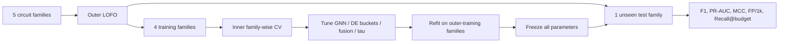
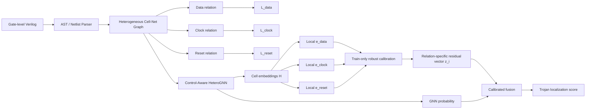
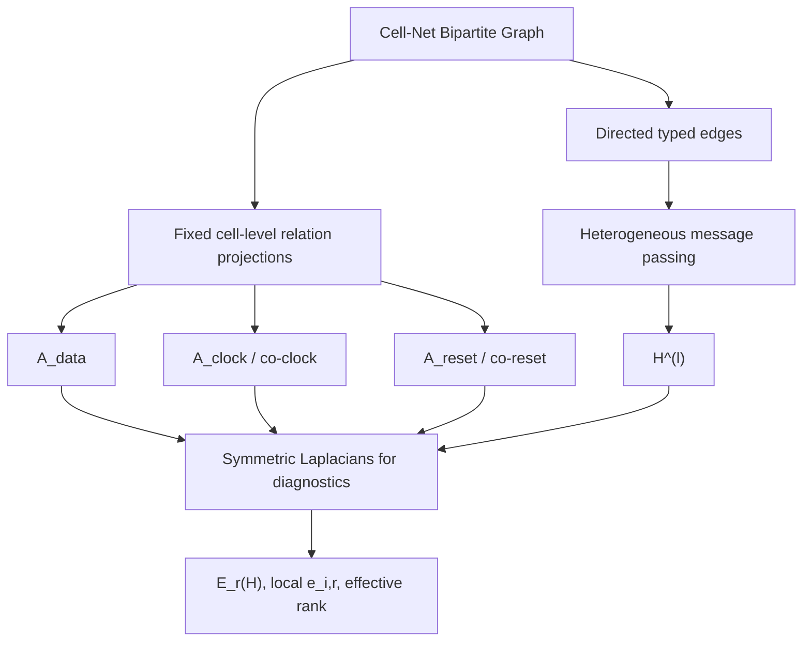
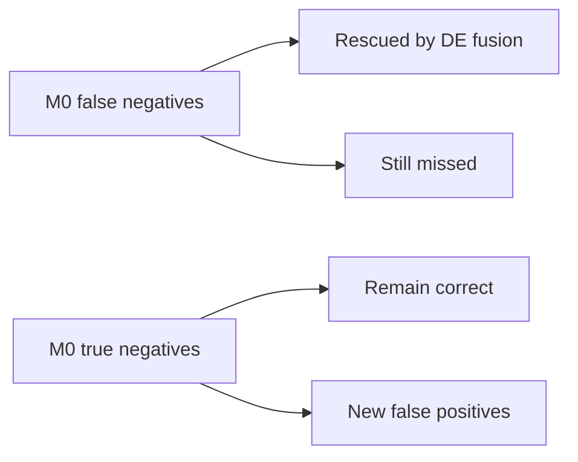

# Đánh giá chuyên sâu bản thảo: Relation-Specific Dirichlet Energy cho định vị Hardware Trojan mức cổng

## Tóm tắt điều hành

Tôi đã đọc lại bản `(1)(8).md` theo trọng tâm mới là **Relation-Specific Dirichlet Energy (DE)**, đồng thời đối chiếu với baseline Whitten–Wolff–Papachristou, các hướng GNN cho Hardware Trojan, graph spectral anomaly detection, Dirichlet-energy/oversmoothing, multilayer/relational Laplacian và các công trình rất gần đây đến tháng 9/2026. Bản thảo hiện đã có một research story rõ hơn đáng kể so với các phiên bản trước:  
**Semantic Cell–Net Graph → Control-aware relation modeling → relation-wise Dirichlet analysis → cross-family HT localization**. Bản thảo cũng đã nhận ra sự khác biệt giữa Dirichlet như một diagnostic của representation và Dirichlet như một anomaly score, đồng thời đã bổ sung `M0/M1/M2/M3`, zero-label leakage, per-family analysis và variance decomposition. fileciteturn0file0

**Kết luận thẳng:** hướng nghiên cứu **có giá trị nghiên cứu và có thể tạo thành luận văn mạnh**, nhưng ở trạng thái số liệu hiện tại tôi **chưa đồng ý với claim rằng Relation-Specific Dirichlet Energy đã được chứng minh là một detector/fusion mechanism hiệu quả cho cross-family Hardware Trojan localization**. Dữ liệu nghiêm ngặt nhất trong chính bản thảo của bạn đang nói điều ngược lại: dưới `Zero-Label Leakage Multi-Seed LOFO`, `M0` đạt Macro-\(F_1=0.2738\), DE-only `M1` có \(F_1=0\), Early Fusion `M2` giảm xuống \(0.2297\), và Late Fusion `M3=0.2732\), tức không vượt `M0=0.2738`; PR-AUC cũng tương tự \(0.4236\) so với \(0.4237\). DE có tín hiệu hữu ích đáng chú ý trên `s38417` và `s38584`, nhưng chưa chứng minh được lợi ích tổng quát. fileciteturn0file0

Đây **không phải lý do bỏ DE**. Ngược lại, đây có thể là điểm làm bài nghiên cứu tốt hơn: thay vì ép kết quả phải chứng minh “DE improves everything”, hãy chuyển câu hỏi thành:

> **Khi nào, trên quan hệ nào, và dưới dạng chuẩn hóa nào Dirichlet non-conformity cung cấp thông tin bổ sung cho một detector học sâu khi topology dịch chuyển giữa các họ mạch?**

Câu hỏi này khoa học hơn, khó hơn và phù hợp với dữ liệu hiện tại.

Novelty khả dĩ nhất của bạn không nằm ở “dùng Dirichlet Energy”, vì DE/Laplacian energy đã có một nền tảng khá sâu trong GNN và anomaly detection; cũng không nằm ở “dùng heterogeneous graph”, vì heterogeneous/multi-relational hardware representations đã xuất hiện. Điểm mới có khả năng bảo vệ được là **sự kết hợp có mục đích giữa semantic Cell–Net relations, tách data/clock/reset, relation-specific energy operators, local robust non-conformity và strict cross-family HT localization**. Trong các nguồn chính tôi rà soát, tôi chưa thấy công trình Hardware Trojan nào sử dụng đúng formulation này để xây dựng **per-relation local Dirichlet residuals trên gate-level circuit graph**; tuy nhiên nên viết là *“to the best of our survey”*, không tuyên bố tuyệt đối “first”. Các prior gần nhất chỉ cung cấp từng mảnh: GNN4TJ/TrojanSAINT/NHTD-GL/HGAT4TJ/HTOD-BGNN về graph HT, BWGNN về spectral anomalies, ANoCo về Laplacian non-conformity, và multilayer/directed Laplacian về relation-aware spectral operators. citeturn10search1turn24search3turn24search0turn22search2

**Đánh giá tổng thể hiện tại của tôi:**

| Khía cạnh | Đánh giá |
|---|---|
| Vấn đề nghiên cứu | **Mạnh** |
| Cell–Net semantic representation | **Mạnh và dễ bảo vệ** |
| Control-aware graph modeling | **Mạnh, nhưng causal claim cần thống nhất protocol** |
| Relation-specific DE về mặt toán học | **Có tiềm năng cao nhưng cần chỉnh formulation** |
| DE như diagnostic representation | **Đã có cơ sở tốt** |
| DE-only anomaly detector | **Hiện chưa được dữ liệu ủng hộ** |
| DE + GNN fusion | **Hiện chưa chứng minh aggregate improvement** |
| Cross-family evaluation | **Ý tưởng rất tốt, nhưng kết quả đang bị trộn protocol** |
| Novelty so với graph HT literature | **Khá–mạnh nếu positioning đúng** |
| Khả năng thành paper | **Có, sau khi sửa Major issues dưới đây** |
| Bản thảo hiện tại có nên submit ngay? | **Chưa. Điểm blocker không nhiều, nhưng có vài blocker rất nghiêm trọng.** |

Điểm quan trọng nhất: **đừng sửa bằng cách “làm đẹp cách kể” các con số hiện tại. Hãy sửa cách đặt claim để chính xác với số liệu, rồi chạy một nhóm thí nghiệm DE có mục tiêu.** Khi đó paper sẽ đáng tin hơn đáng kể.

## Góp ý cốt lõi (Major)

### Kết quả chính đang bị trộn giữa hai giao thức đánh giá

Đây là vấn đề nghiêm trọng nhất và có khả năng khiến reviewer từ chối dù phương pháp tốt.

Abstract hiện vẫn đưa ra:

\[
\text{Macro-}F_1=0.5239\pm0.0454,\quad
\text{PR-AUC}=0.5731\pm0.0195
\]

và diễn giải chúng như hiệu năng **LOFO/cross-family** của phương pháp. Nhưng chính Bảng 5.2c.4 trong bản thảo đã xác định \(0.5239\) là **Within-Distribution Threshold Tuning / Upper-Bound Separability**, còn giao thức nghiêm ngặt thật sự — threshold, calibration và fusion parameters đều được khóa từ training/validation families — cho:

\[
\boxed{
F_{1,\mathrm{LOFO}}=0.2738,\qquad
\mathrm{PR\!-\!AUC}=0.4237.
}
\]

fileciteturn0file0

Đây không phải khác biệt nhỏ. Nó thay đổi trực tiếp strength của contribution.

Baseline Whitten et al. cũng đặc biệt cho thấy random/in-distribution splitting có thể cho kết quả đẹp hơn nhiều so với leave-one-family-out; Table 10 của bài gốc báo **micro-\(F_1\approx0.033\)** cho XGBoost khi LOFO và chính tác giả kết luận năm scalar topological features không transfer tốt giữa các family. citeturn18view2turn18view3

**Cách sửa bắt buộc:** dùng strict zero-label-leakage LOFO làm **Primary Evaluation Protocol** duy nhất trong abstract, contribution và conclusion:

\[
\boxed{\text{Primary: }0.2738}
\]

Còn \(0.5239\) phải đổi nhãn thành:

> **Domain-adaptive / within-domain calibrated upper-bound performance**

và chỉ xuất hiện ở secondary analysis.

Tôi thậm chí khuyên tạo một hộp protocol:

| Protocol | Target-family information used during calibration? | Dùng để claim generalization? |
|---|---:|---:|
| In-distribution / oracle-like calibration | Có thông tin cùng distribution | Không |
| Strict LOFO | Không | **Có** |
| Target-unlabeled adaptation nếu có | Chỉ unlabeled target | Claim riêng: transductive/domain adaptation |

Sau đó **mọi bảng** phải gắn `Protocol ID`.

### Bằng chứng hiện tại chưa cho phép nói DE “improves localization”

Đây là điểm phải nói rất thẳng.

Kết quả nghiêm ngặt nhất của bạn hiện là: fileciteturn0file0

| Detector | Macro-\(F_1\) | Macro PR-AUC | Kết luận hiện tại |
|---|---:|---:|---|
| \(M_0\): HeteroGNN | **0.2738** | **0.4237** | baseline mạnh nhất |
| \(M_1^S\): DE-only supervised-normal | 0.0000 | 0.0131 | thất bại |
| \(M_1^U\): robust DE-only | 0.0000 | 0.0131 | thất bại |
| \(M_2\): Early Fusion | 0.2297 | 0.4147 | giảm aggregate performance |
| \(M_3\): Late Fusion | 0.2732 | 0.4236 | gần như giống nhưng hơi kém \(M_0\) |

Vì vậy câu trong manuscript kiểu:

> “Dirichlet residual provides an orthogonal structural signal…”

hoặc:

> “Calibrated late fusion yields consistent gains…”

hiện **mạnh hơn dữ liệu cho phép**.

Seed 42 có một số \(\Delta F_1>0\), nhưng Seed 123 có `s15850` giảm \(0.0172\), và Seed 456 cũng có fold giảm; macro \(M_3<M_0\). fileciteturn0file0

Cách viết đúng hơn ở trạng thái hiện tại:

> *Relation-specific Dirichlet residuals exhibit family-dependent complementarity: they substantially improve ranking on selected sequential families, but do not yet yield a statistically reliable aggregate improvement under strict cross-family calibration.*

Đây không làm bài yếu đi. Nó làm paper **thật** hơn.

Điều thú vị thực sự là `M2` làm PR-AUC:

\[
0.2885\rightarrow0.4300 \quad \text{trên s38417}
\]

và:

\[
0.2606\rightarrow0.3353 \quad \text{trên s38584},
\]

nhưng đồng thời giảm trên RS232, s15850 và s35932. fileciteturn0file0

Đây gợi ý một hypothesis tốt hơn:

\[
\boxed{\text{DE utility is conditional on circuit morphology / sequential structure}}
\]

chứ chưa phải universal anomaly score.

### Local Dirichlet Energy hiện không hoàn toàn nhất quán với global Dirichlet Energy

Global section sử dụng normalized Laplacian:

\[
L_r^{\mathrm{sym}}
=
I-D_r^{-1/2}A_rD_r^{-1/2}
\]

và Rayleigh quotient:

\[
R_r(H)=
\frac{\operatorname{Tr}(H^\top L_r^{\mathrm{sym}}H)}
{\|H\|_F^2}.
\]

Trong khi local anomaly score lại gần dạng:

\[
e_{i,r}
=
\frac{
\sum_{j\in\mathcal N_r(i)}
A_{ij}^{(r)}
\|h_i-h_j\|_2^2
}{
\sum_jA_{ij}^{(r)}+\epsilon
}.
\]

fileciteturn0file0

Hai đại lượng này đều hợp lý, nhưng **local expression thứ hai không phải decomposition chính xác của normalized Dirichlet energy thứ nhất**. Reviewer spectral graph theory sẽ bắt điểm này.

Bạn có hai lựa chọn.

**Lựa chọn tôi khuyên dùng:** định nghĩa local normalized contribution thực sự:

\[
\boxed{
\varepsilon_{i,r}^{\mathrm{sym}}
=
\frac12
\sum_j
A^{(r)}_{ij}
\left\|
\frac{h_i}{\sqrt{d_{i,r}}}
-
\frac{h_j}{\sqrt{d_{j,r}}}
\right\|_2^2
}
\]

với convention cho \(d_{i,r}=0\).

Khi đó:

\[
\boxed{
\sum_i\varepsilon_{i,r}^{\mathrm{sym}}
=
\operatorname{Tr}
\left(
H^\top L_r^{\mathrm{sym}}H
\right)
}
\]

theo convention double-counting tương ứng.

Hoặc nếu muốn giữ score degree-averaged hiện nay:

\[
v_{i,r}=
\frac{
\sum_jA_{ij}^{(r)}\|h_i-h_j\|^2
}{
d_{i,r}+\epsilon
},
\]

hãy gọi nó là:

> **relation-local variation score**

chứ không gọi nó là exact local Dirichlet-energy decomposition.

Dirichlet energy có nền tảng rõ trong phân tích smoothing GNN; tuy nhiên literature gần đây cũng cảnh báo rằng energy đơn độc không mô tả toàn bộ representation collapse, và các rank-based quantities có thể bắt được collapse mà DE bỏ sót. Điều này thực ra ủng hộ lựa chọn của bạn giữ **Effective Rank song song với DE**, nhưng bạn nên trình bày chúng như hai diagnostics bổ sung nhau, không nói DE “chứng minh” collapse một mình. citeturn19academia24turn20academia12

### Directed control-flow và symmetric Laplacian đang bị lẫn khái niệm

Bạn định nghĩa:

\[
A_{\mathrm{data}}^{\rightarrow}
=
M_{\mathrm{out}}M_{\mathrm{in,data}},
\]

và:

\[
A_{\mathrm{ctrl-flow}}^{\rightarrow}
=
M_{\mathrm{out}}M_{\mathrm{in,ctrl}},
\]

nhưng sau đó sử dụng \(L_{\mathrm{sym}}\), vốn yêu cầu một symmetric weighted adjacency trong formulation chuẩn. fileciteturn0file0

Bạn phải nói chính xác một trong hai:

**Diagnostic graph:**

\[
A_{r}^{\mathrm{diag}}
=
\frac{
A_r^\rightarrow+(A_r^\rightarrow)^\top
}{2}
\]

rồi:

\[
L_{r,\mathrm{sym}}
=
I-D_r^{-1/2}A_r^{\mathrm{diag}}D_r^{-1/2}.
\]

Còn GNN vẫn message-pass trên directed relation.

Đây là lựa chọn đơn giản nhất.

Hoặc xây **directed Laplacian** thật sự. Literature đã có các spectral constructions cho directed graphs, bao gồm fractional/directed Laplacian frameworks; nhưng việc này làm phần phương pháp nặng hơn đáng kể và chưa chắc có lợi cho luận văn. citeturn20academia13

Tôi nghiêng về phương án đầu: **directed graph cho propagation; symmetric projection chỉ cho energy diagnostics**, và nói rõ ranh giới.

### Clock/reset clique \(O(k^2)\) là điểm vừa hay vừa nguy hiểm

Hiện bạn xây:

\[
A_{\mathrm{co\mbox{-}ctrl}}
=
M_{\mathrm{in,ctrl}}^\top
M_{\mathrm{in,ctrl}},
\]

rồi lập luận một clock net nối \(k\) FF tạo clique \(O(k^2)\). fileciteturn0file0

Lập luận về shortcut là hợp lý, nhưng chính projection này cũng **tự làm phóng đại ảnh hưởng clock net**. Một reviewer có thể hỏi:

> “Representation collapse là thuộc tính thật của circuit, hay artifact của clique expansion mà tác giả tự tạo?”

Bạn cần thêm ít nhất một normalized projection:

\[
A_r
=
M_r^\top W_rM_r-\operatorname{diag}(\cdot),
\]

với chẳng hạn:

\[
(W_r)_{ee}
=
\frac{1}{\max(\deg(e)-1,1)}.
\]

Như vậy một net global không tự động đóng góp \(O(k^2)\) mass không chuẩn hóa.

Tốt hơn nữa về mặt lý thuyết là coi clock/reset net như **hyperedge**, dùng normalized hypergraph Laplacian thay vì materialize clique. Đây cũng là một hướng rất phù hợp với bản chất Cell–Net bipartite của bạn.

Nếu kết quả Control-OFF vẫn tốt hơn sau degree-normalized projection/hypergraph operator, lập luận “global control relation is intrinsically harmful for generic propagation” sẽ mạnh hơn nhiều.

### “Structural Non-Conformity” cần phân biệt rõ với ANoCo

ANoCo CVPR 2026 là một prior rất quan trọng cho cách positioning của bạn: công trình này dùng graph Laplacian optimization với normal nodes được anchor và đo anomaly bằng **magnitude của feature update cần thiết để query conform với normal manifold**. Nó không đơn giản dùng local edge energy làm anomaly score. citeturn24search0

Do đó đừng viết theo hướng:

> “ANoCo establishes that local Laplacian energy itself is an anomaly score.”

Không chính xác.

Nên viết:

> *ANoCo provides conceptual evidence that Laplacian operators can be repurposed from smoothing regularizers into non-conformity mechanisms. Our formulation differs fundamentally: rather than solving an anchored feature optimization problem, we estimate relation-specific local graph-signal variation and calibrate its residual relative to benign circuit morphology.*

Câu này vừa ghi nhận prior đúng mức, vừa làm rõ novelty.

Tương tự, BWGNN chứng minh graph anomalies có thể biểu hiện bằng sự dịch spectral energy sang high-frequency components và từ đó thiết kế band-pass graph filters; nó **không chứng minh rằng Hardware Trojan sẽ có local Dirichlet residual lớn**. citeturn24search3

Bạn đang có một hypothesis, không phải theorem. Hãy để thí nghiệm chứng minh nó.

### “Orthogonality” chưa được kiểm chứng

Hai features có vẻ khác bản chất không đồng nghĩa với “orthogonal”.

Để dùng từ này, cần ít nhất:

\[
\rho_s
\left(
\operatorname{logit}p_i^{GNN},
z_{i,r}
\right)
\]

theo từng family và benign/Trojan subgroup.

Tốt hơn nữa, làm error complementarity:

\[
\mathrm{RescueRate}
=
\frac{
|\{i:y_i=1,\;M_0(i)=0,\;M_3(i)=1\}|
}{
|\{i:y_i=1,\;M_0(i)=0\}|
},
\]

và:

\[
\mathrm{DamageRate}
=
\frac{
|\{i:y_i=0,\;M_0(i)=0,\;M_3(i)=1\}|
}{
|\{i:y_i=0,\;M_0(i)=0\}|
}.
\]

Nếu \(z\) có correlation thấp với GNN nhưng RescueRate lớn và DamageRate nhỏ, khi đó “complementary signal” được chứng minh.

Hiện tại các aggregate metrics không chứng minh điều đó. fileciteturn0file0

### “Training-free DE” phải định nghĩa lại dựa trên nguồn của \(H\)

Đây là một lỗ hổng khái niệm quan trọng.

DE của bạn tính trên:

\[
e_{i,r}(H).
\]

Nhưng \(H\) là gì?

Nếu:

\[
H=H^{(L)}
\]

là embedding sinh ra bởi `HeteroTrojanGNN`, thì detector DE đó **không training-free**. Laplacian operation không có learnable parameters, nhưng graph signal đã được học có giám sát.

Bạn nên tách ba variant:

\[
\text{DE-X}:\ H=X_{\mathrm{fixed}},
\]

\[
\text{DE-Enc}:\ H=f_\theta(X),
\]

\[
\text{DE-GNN}^{(\ell)}:\ H=H^{(\ell)}.
\]

Chỉ `DE-X` mới thật sự training-free nếu \(X\) cũng hoàn toàn fixed.

Đây là ablation cực kỳ giá trị vì nó trả lời:

> anomaly signal nằm sẵn trong topology/features hay chỉ xuất hiện sau representation learning?

### Control-OFF hiện không thể gọi là phương án “tốt nhất” ở mọi protocol

Trong một phần của manuscript bạn có:

\[
F_1(\text{Control-OFF})=0.5239
\]

cao hơn Control-ON/Gated.

Nhưng ở control-mechanism benchmark dưới một protocol khác, Control-ON có \(F_1\approx0.3518\), trong khi Control-OFF khoảng \(0.2279\). Sau đó phần 5.6 lại báo Gated \(0.4949\), Control-ON \(0.4556\), OFF \(0.5239\). fileciteturn0file0

Vấn đề không nhất thiết là số sai; có vẻ chúng đến từ **khác protocol/calibration**. Nhưng hiện cách viết khiến chúng giống như cùng thí nghiệm.

Sửa bằng cách đưa mọi result về cùng strict outer LOFO protocol. Nếu chưa chạy lại được, claim an toàn là:

> **Control suppression changes the accuracy–robustness trade-off and can improve worst-family behavior; its aggregate advantage depends on the calibration protocol.**

Không nên nói “hard severance is universally superior”.

### Số lượng outer domains quá nhỏ để kiểm định thống kê theo kiểu thông thường

Bạn có 5 family:

- RS232,
- s15850,
- s35932,
- s38417,
- s38584.

Vì mục tiêu là *cross-family generalization*, đơn vị độc lập quan trọng nhất là **family**, không phải gate và cũng không phải 15 `family × seed` runs. fileciteturn0file0

Ba seeds không biến 5 domains thành 15 independent domains.

Do đó:

\[
n_{\mathrm{domain}}=5.
\]

Paired \(t\)-test hay Wilcoxon trên hàng nghìn gate sẽ cho \(p\)-value quá lạc quan do pseudo-replication.

Tôi khuyên:

1. báo từng outer-family delta;
2. hierarchical bootstrap theo `family → circuit → seed`;
3. exact sign/permutation result như sensitivity analysis;
4. báo effect size và confidence interval, không chỉ \(p\);
5. nếu làm nhiều ablations, dùng Holm correction.

### Trust-Hub vẫn là giới hạn lớn về external validity

Graph HT literature đã tiến xa hơn việc chỉ chứng minh một architecture trên một split Trust-Hub. GNN4TJ đã đặt nền tảng graph-learning cho Trojan detection; TrojanSAINT sử dụng sampling/inductive graph learning cho gate-level detection/localization; NHTD-GL đưa node-wise graph learning vào HT; năm 2025 có gate-level GraphSAGE variants trên SAED/LEDA; HGAT4TJ dùng heterogeneous graph cho mixed-signal; HTOD-BGNN 2026 nhấn mạnh unseen-circuit generalization. citeturn10search1turn13search2turn23search0turn24search5turn11search0turn11search3

Ngoài ra, TrojanGYM 2026 cho thấy learned HT detectors có thể có blind spots lớn khi Trojan distribution thay đổi, và các benchmark/synthetic insertion mới đang đặt áp lực ngày càng cao lên claim “generalization”. citeturn10academia46

Vì vậy 30 Trust-Hub netlists vẫn đủ cho **luận văn**, nhưng để claim mạnh trong paper:

> “generalizable Hardware Trojan localization”

tôi muốn có ít nhất một external validation domain hoặc một stress test có cấu trúc.

Nếu external benchmark chưa thể map gate labels chính xác, hãy đổi wording:

> **cross-family generalization on Trust-Hub**

thay vì generalization rộng.

### Dataset/entity accounting cần được khóa cứng

Baseline Whitten báo population khác với Cell–Net parser của bạn; manuscript cũng thảo luận rằng parser mới bảo toàn thêm Trojan instances và tổng số Cell khác với flattened baseline graph. fileciteturn0file0

Đây có thể là contribution, nhưng đồng thời là confound.

Bạn cần một table kiểu:

| Circuit | Raw cell instances | Baseline graph nodes | Your Cell nodes | Labeled HT in raw netlist | HT retained baseline | HT retained proposed |
|---|---:|---:|---:|---:|---:|---:|

và file:

`trojan_instance_reconciliation.csv`

mà draft đã nhắc tới nên chuyển từ future/appendix idea thành **artifact bắt buộc**.

Nếu không, reviewer có thể hỏi liệu \(M_0\) và XGBoost baseline đang phân loại cùng một population hay không.

## Đối chiếu y văn và vị trí novelty

Bảng dưới đây tách rõ ba lớp prior: spectral/Dirichlet foundations, anomaly detection, và Hardware Trojan graph learning.

| Công trình | Năm | Bài toán | Loại graph / operator | Energy / spectral formulation | Dataset | Metrics chính | Phát hiện chính | Liên hệ với bạn |
|---|---:|---|---|---|---|---|---|---|
| Mercado et al., Power Mean Laplacian citeturn22search2 | 2018 | Semi-supervised multilayer graph learning | Multilayer graph | Kết hợp nhiều graph Laplacians bằng power mean | benchmark multilayer graphs | classification accuracy | Cho thấy nhiều relation/layer nên có operator riêng trước khi tổ hợp | Prior lý thuyết gần với \(L_r\) theo relation |
| Cai & Wang, *A Note on Over-Smoothing for GNNs* citeturn19academia24 | 2020 | Phân tích oversmoothing | Homogeneous graph | Dirichlet energy của node representation | graph-learning benchmarks/theory | DE theo depth | DE suy giảm về trạng thái trơn trong các điều kiện nhất định | Nền tảng cho RQ2, không phải anomaly detector |
| GNN4TJ citeturn10search1 | 2021 | HT detection ở RTL | Data-flow graph | Không dùng DE | Trust-Hub-derived RTL benchmarks | recall/detection metrics | Báo cáo recall cao với Trojan chưa thấy trong setting nghiên cứu | Prior quan trọng: “graph + HT” không còn mới |
| GraphCON citeturn12search0 | 2022 | Chống oversmoothing | Graph neural dynamics | Liên hệ steady state và DE collapse | node classification | accuracy, DE dynamics | Dùng dynamical-system view để tránh representation collapse | Hỗ trợ interpretation của global DE |
| BWGNN citeturn24search3 | 2022 | Graph anomaly detection | Homogeneous attributed graphs | Spectral-energy right shift; beta-wavelet band-pass | 4 large graph anomaly datasets | AUROC/AUPRC | Anomalies có spectral distribution thiên về high frequency | Motivates spectral anomaly hypothesis, **không phải local-DE precedent trực tiếp** |
| TrojanSAINT citeturn13search2 | 2023 | Gate-level HT detection/localization | Gate-level graph + GraphSAINT-style sampling | Không DE | Trust-Hub-based gate netlists | TPR/TNR | Inductive sampling GNN cho HT localization | Baseline graph-learning rất cần reproduce hoặc thảo luận |
| Fractional Graph Laplacian for directed graphs citeturn20academia13 | 2023 | Directed graph learning | Directed/fractional Laplacian | Directed spectral operator | graph benchmarks | classification | Xử lý direction bằng Laplacian phù hợp | Prior nếu bạn muốn \(A_{\rm ctrl-flow}^\rightarrow\) giữ direction |
| NHTD-GL / Node-wise HT graph learning citeturn23search0 | 2025 | Gate/node-wise HT detection | Gate-level graph | Không DE | HT gate-level benchmarks | Accuracy, \(F_1\) | Báo cáo node-wise performance mạnh | Làm giảm novelty của claim “gate-level GNN” |
| Ma et al., IEEE TC citeturn24search5 | 2025 | Gate-level HT detection | GraphSAGE variants + harmonic centrality | Không DE | SAED, LEDA, sequential HT | TPR, \(F_1\) | Báo cáo \(F_1\) cao trên các dataset của họ | Cần đưa vào literature/baselines; protocol khác nên không so số trực tiếp |
| HGAT4TJ citeturn11search0turn11search1 | 2025 | Mixed-signal HT detection | Heterogeneous graph + attention | Không DE | mixed-signal circuit benchmarks | circuit/node metrics | Heterogeneous graph đã được dùng cho HT | Vì vậy “heterogeneous graph” riêng lẻ không đủ novelty |
| Rank-based oversmoothing analysis citeturn20academia12 | 2025 | Đánh giá representation collapse | GNN embeddings | So DE với rank-based collapse | graph benchmarks | rank/energy/accuracy | DE có thể không phản ánh đầy đủ collapse | Ủng hộ việc dùng **DE + effective rank**, đồng thời hạn chế claim của bạn |
| HTOD-BGNN citeturn11search3 | 2026 | HT object/node localization | Bidirectional / jumping-knowledge GNN | Không DE | Trust-Hub và TRIT | \(F_1\), detection rate | Tập trung localization và unseen-circuit robustness | Một đối thủ gần trực tiếp cho claim generalization |
| ANoCo citeturn24search0 | 2026 | Unsupervised anomaly localization | Query–normal bipartite graph | Convex anchored graph-Laplacian energy; score = optimization-induced feature displacement | standard visual anomaly benchmarks | image/pixel AUROC | Reinterprets Laplacian as non-conformity mechanism | Prior conceptual mạnh nhất cho “non-conformity”, nhưng formulation khác rõ rệt |
| Whitten et al. baseline citeturn18view2turn18view3turn15search3 | 2026 | Gate-level HT + XAI | Flattened/tabular topological features | Không DE | 30 Trust-Hub circuits / 5 families | precision, recall, F1, MCC, AUPRC | Random-split performance cao nhưng LOFO XGBoost micro-\(F_1\approx0.033\) | Baseline trực tiếp; tạo động lực rất tốt cho cross-family graph representation |
| LoRD citeturn11academia47 | 2026 | HT localization | Structural/signal-flow heuristic | Không GNN/DE | recent HT benchmark setting | contest/localization metrics | Heuristic structural reasoning có thể rất cạnh tranh | Buộc paper của bạn chứng minh giá trị DE/GNN ngoài việc “deep model hơn” |

### Novelty thực sự nên claim thế nào

Tôi sẽ **không** claim:

> “We introduce Dirichlet energy for anomaly detection.”

Quá rộng và sai trước prior như BWGNN/ANoCo/spectral anomaly literature. citeturn24search3turn24search0

Tôi cũng **không** claim:

> “We introduce heterogeneous graph learning for Hardware Trojans.”

HGAT4TJ và các relational circuit representations làm claim này khó bảo vệ. citeturn11search0turn11search1

Claim an toàn và có giá trị hơn:

> **We formulate circuit-semantic, relation-specific Dirichlet operators over data, clock, and reset relations of a Cell–Net graph, and investigate whether their local robust residuals provide transferable structural non-conformity signals for cross-family gate-level Hardware Trojan localization.**

Nếu thí nghiệm mới chứng minh được fusion:

> **We further show that relation-wise Dirichlet residuals complement learned GNN scores under strict unseen-family calibration.**

Chỉ thêm câu thứ hai khi \(M_3>M_0\) một cách ổn định.

Tôi đánh giá novelty như sau:

\[
\boxed{
\text{Novelty}
\approx
\text{relation semantics}
+
\text{circuit-specific Laplacians}
+
\text{local non-conformity}
+
\text{strict cross-family protocol}
}
\]

chứ không phải:

\[
\text{novelty}=\text{Dirichlet Energy}.
\]

Trong phạm vi nguồn tôi truy xuất được, chưa thấy paper tiếng Việt/Việt Nam nào cung cấp prior trực tiếp cho **relation-specific Dirichlet anomaly scoring trên gate-level HT graph**; vì vậy literature lõi của phần này nên dựa vào nguồn quốc tế primary, còn tài liệu Việt Nam có thể dùng cho bối cảnh chứ không nên ép vào novelty argument.

## Khung toán học Dirichlet theo quan hệ nên dùng

Tôi đề xuất sửa Chương 3 thành một formulation nhất quán từ graph → relation operator → global energy → local contribution → residual → detector.

### Đồ thị dị thể

Đặt:

\[
\mathcal G=
(\mathcal V_{\mathrm{cell}}\cup\mathcal V_{\mathrm{net}},
\mathcal E,\mathcal R),
\]

với:

\[
\mathcal R=
\{
\mathrm{data},
\mathrm{clock},
\mathrm{reset},
\ldots
\}.
\]

Incidence matrices:

\[
M_{\mathrm{out}}
\in
\{0,1\}^{N_c\times N_n},
\]

\[
M_{\mathrm{in},r}
\in
\{0,1\}^{N_n\times N_c}.
\]

Directed functional projection:

\[
A_{\mathrm{data}}^\rightarrow
=
M_{\mathrm{out}}M_{\mathrm{in,data}}.
\]

Directed control-flow projection:

\[
A_{\mathrm{clock}}^\rightarrow
=
M_{\mathrm{out}}M_{\mathrm{in,clock}},
\qquad
A_{\mathrm{reset}}^\rightarrow
=
M_{\mathrm{out}}M_{\mathrm{in,reset}}.
\]

Để dùng symmetric Laplacian cho diagnostic:

\[
\boxed{
A_r
=
\frac{
A_r^\rightarrow+
(A_r^\rightarrow)^\top
}{2}
}
\]

cho data/control-flow relation.

### Co-control relation

Nếu mục tiêu là đo hai cells cùng nhận một global control net, dùng:

\[
A_r^{\mathrm{co}}
=
M_{\mathrm{in},r}^\top
W_r
M_{\mathrm{in},r}
-
\operatorname{diag}(\cdot),
\]

với:

\[
(W_r)_{ee}
=
\frac{1}{\max(d_e-1,1)}.
\]

Tôi đặc biệt khuyên dùng \(W_r\); nếu không, một clock net fanout cực lớn sẽ dominate energy chỉ do combinatorics.

Bạn nên tách rõ:

\[
A_{\mathrm{clock}}^{\mathrm{flow}}
\neq
A_{\mathrm{clock}}^{\mathrm{co}}.
\]

Hai graph trả lời hai câu hỏi khác nhau:

- `flow`: ai drive control vào cell;
- `co`: cells nào share cùng control source.

### Relation-specific normalized Laplacian

Cho mỗi \(r\):

\[
D_r(i,i)=\sum_jA_r(i,j),
\]

\[
\boxed{
L_r
=
I-D_r^{-1/2}A_rD_r^{-1/2}.
}
\]

Với isolated nodes \(d_{i,r}=0\), quy định \(D^{-1/2}_{ii}=0\).

### Global relation-specific Dirichlet energy

Với embedding:

\[
H=[h_1,\ldots,h_N]^\top,
\]

định nghĩa numerator:

\[
\mathcal E_r(H)
=
\operatorname{Tr}(H^\top L_rH).
\]

Để so giữa layers/circuits:

\[
\boxed{
E_r(H)
=
\frac{
\operatorname{Tr}(H^\top L_rH)
}{
\operatorname{Tr}(H^\top H)+\epsilon
}.
}
\]

Khi đó bạn có vector:

\[
\boxed{
\mathbf E(H)=
[
E_{\mathrm{data}},
E_{\mathrm{clock}},
E_{\mathrm{reset}},
E_{\mathrm{co-clock}},
E_{\mathrm{co-reset}}
].
}
\]

Đừng collapse nó thành một số quá sớm. Chính vector này là relation-specific contribution.

Theo layer:

\[
E_r^{(\ell)}
=
E_r(H^{(\ell)}),
\]

và energy retention:

\[
\rho_r^{(\ell)}
=
\frac{
E_r^{(\ell)}
}{
E_r^{(0)}+\epsilon
}.
\]

Cặp với:

\[
\operatorname{erank}(H^{(\ell)})
=
\exp\left(
-\sum_kp_k\log p_k
\right),
\qquad
p_k=
\frac{\sigma_k}
{\sum_j\sigma_j}.
\]

Điều này sẽ khiến RQ2 mạnh hơn nhiều: **local smoothness + global rank collapse** là hai trục riêng.

### Local Dirichlet contribution

Dùng formulation nhất quán với normalized Laplacian:

\[
\boxed{
e_{i,r}
=
\frac12
\sum_jA_{ij}^{(r)}
\left\|
\frac{h_i}{\sqrt{d_{i,r}}}
-
\frac{h_j}{\sqrt{d_{j,r}}}
\right\|_2^2.
}
\]

Khi đó:

\[
\mathcal E_r(H)=\sum_ie_{i,r}.
\]

Đây là điểm tôi rất muốn bạn sửa, vì nó làm whole paper toán học “khóa” lại.

### Robust non-conformity residual

Đặt:

\[
u_{i,r}
=
\log(e_{i,r}+\epsilon).
\]

Trong calibration subset của training families và bucket \(b(i)\):

\[
m_{b,r}
=
\operatorname{median}_{j\in C_b}u_{j,r},
\]

\[
s_{b,r}
=
1.4826\cdot
\operatorname{median}_{j\in C_b}
|u_{j,r}-m_{b,r}|+\epsilon.
\]

Signed residual:

\[
\boxed{
z_{i,r}
=
\frac{
u_{i,r}-m_{b(i),r}
}{
s_{b(i),r}
}.
}
\]

Sau đó **đừng mặc định dùng \(|z|\)**.

Phải ablate:

\[
a_{i,r}^{\mathrm{high}}
=
\max(z_{i,r},0),
\]

\[
a_{i,r}^{\mathrm{low}}
=
\max(-z_{i,r},0),
\]

\[
a_{i,r}^{\mathrm{two}}
=
|z_{i,r}|.
\]

Đây là thí nghiệm quan trọng vì Trojan không có lý do tiên nghiệm bắt buộc luôn là high-energy outlier. Sequential trigger có thể tạo một vùng representation **quá đồng nhất**, tức low-energy anomaly.

### Bucket phải được định nghĩa chính thức

Hiện \(B_c\) còn quá mơ hồ. fileciteturn0file0

Tôi đề xuất:

\[
b(i)
=
(
\text{cell-role},
\text{relation-degree-bin}
)
\]

ví dụ:

- combinational / sequential,
- degree quantile \(Q_1\ldots Q_4\).

Không nên dùng family identity.

Đặt:

\[
n_{\min}\in\{30,50,100\}.
\]

Nếu bucket thiếu mẫu:

\[
(\text{role},\text{degree})
\rightarrow
(\text{role})
\rightarrow
(\text{global train})
\]

theo hierarchical fallback.

### Percentile residual đáng thử hơn MAD

Kết quả \(M_1\) hiện cho thấy threshold transfer là vấn đề lớn. fileciteturn0file0

Một alternative ít phụ thuộc scale:

\[
\widehat F_{b,r}(u)
=
\frac{
1+\sum_{j\in C_b}\mathbf1[u_{j,r}\le u]
}{
|C_b|+1
}.
\]

High-tail anomaly:

\[
a^{+}_{i,r}
=
-\log
\left(
1-\widehat F_{b,r}(u_{i,r})+\epsilon
\right).
\]

Two-sided:

\[
a^{\pm}_{i,r}
=
-\log
\left[
2\min(
\widehat F,
1-\widehat F
)+\epsilon
\right].
\]

Tôi sẽ gọi nó là **empirical tail non-conformity** hơn là “conformal” trừ khi bạn thỏa exchangeability assumptions; node trong cùng circuit phụ thuộc lẫn nhau nên không nên claim finite-sample conformal guarantee quá dễ dàng.

### Fusion strategies

DE-only:

\[
S_i^{DE}
=
\max_r a_{i,r}.
\]

Weighted relation fusion:

\[
S_i^{DE}
=
\sum_r\omega_ra_{i,r},
\qquad
\omega_r\ge0,\quad
\sum_r\omega_r=1.
\]

Late fusion hợp lý nhất:

\[
\boxed{
\operatorname{logit}
p_i^{\mathrm{fuse}}
=
\alpha
\operatorname{logit}
p_i^{GNN}
+
\sum_r\beta_ra_{i,r}
+
b.
}
\]

Tất cả \(\alpha,\beta_r,b,\tau\) chỉ fit trong inner validation.

Một formulation đặc biệt đáng thử là **interaction với cell role**:

\[
\operatorname{logit}p_i
=
\alpha g_i
+
\sum_r\beta_ra_{i,r}
+
\sum_r\gamma_r
a_{i,r}\mathbf1[\mathrm{sequential}_i]
+b.
\]

Vì dữ liệu hiện tại của bạn đang gợi ý chính xác rằng DE có ích hơn trên một số family tuần tự. fileciteturn0file0

## Giao thức thực nghiệm tôi khuyên chốt

Tôi giả định hiện **không có giới hạn cụ thể về compute, thời gian huấn luyện hoặc dung lượng lưu trữ**, theo yêu cầu của bạn. Tôi cũng giả định ground-truth Trojan gate mapping có thể được reconciled ở cấp cell instance; nếu không, đây phải là limitation chính.

### Split chuẩn

Outer loop:

\[
\text{5-family LOFO}.
\]

Ví dụ outer test = `s38417`.

Bốn family còn lại tuyệt đối không được trộn gate ngẫu nhiên để chọn fusion/hyperparameter theo cách làm mất group structure.

Dùng inner:

\[
\text{Leave-One-Training-Family-Out}
\]

trên bốn training families.

Tức:

Đây là protocol reviewer khó bắt leakage nhất.

### Detector matrix bắt buộc

| ID | Model | Mục đích |
|---|---|---|
| T0 | Whitten XGBoost five-feature | baseline trực tiếp |
| G0 | homogeneous GCN/GraphSAGE | graph capacity baseline |
| G1 | homogeneous GAT | attention baseline |
| G2 | relational HeteroGNN Control-ON | relation baseline |
| **M0** | relational HeteroGNN proposed control strategy | neural reference |
| D0 | DE-X raw fixed features | pure training-free energy |
| D1 | DE on \(H^{(1)}\) | learned representation energy |
| D2 | DE on \(H^{(L)}\) | deep representation energy |
| **M1** | best DE-only | independent anomaly test |
| **M2** | early fusion | DE as feature |
| **M3** | calibrated late fusion | DE as complementary detector |

Nếu có thời gian/compute, thêm BWGNN-style spectral baseline sẽ đặc biệt hữu ích vì đây là prior anomaly detection gần về spectral motivation. citeturn24search3

Đối với TrojanSAINT/NHTD-GL/HTOD-BGNN, reproduce nếu code/data mapping cho phép; nếu không, không nên lấy published scores khác protocol rồi viết “ours outperforms”. Các paper này khác representation, dataset composition và evaluation split. citeturn13search2turn23search0turn11search3

### Ablation matrix cho Dirichlet

Đây là nhóm ablation tôi cho là cần thiết nhất:

| Ablation | Các lựa chọn |
|---|---|
| Relation | data / clock / reset / co-clock / co-reset |
| Operator | combinatorial / normalized |
| Control projection | raw clique / degree-normalized clique / hypergraph |
| Direction | symmetric diagnostic / directed operator |
| Signal \(H\) | raw \(X\) / \(H^1\) / \(H^2\) / final \(H\) |
| Residual | high-tail / low-tail / two-sided |
| Calibration | global / cell-role / role+degree |
| Normalizer | median-MAD / empirical percentile |
| Fusion | max / weighted sum / logistic late fusion |
| Control propagation | ON / OFF / learned gate |

Đừng chạy toàn Cartesian product. Dùng staged ablation:

1. chọn Laplacian formulation;
2. chọn signal layer;
3. chọn residual;
4. chọn fusion.

### Primary metric

Với prevalence khoảng dưới \(1\%\) theo dataset của bạn, PR-AUC nên là metric chính thay vì ROC-AUC. fileciteturn0file0

Tôi đề xuất:

\[
\boxed{
\text{Primary metric}
=
\text{family-macro PR-AUC}.
}
\]

Sau đó:

- \(F_1\) với validation-locked threshold;
- MCC;
- Precision, Recall;
- FP/1000 gates;
- Precision@10, Precision@50;
- Recall@inspection-budget;
- Brier score/ECE nếu gọi output là calibrated probability.

Luôn báo **no-skill PR-AUC** theo family:

\[
\mathrm{AUPRC}_{\mathrm{random}}
=
\frac{N_+}{N}.
\]

Điểm này đặc biệt quan trọng cho \(M_1\): PR-AUC \(0.0131\) nhìn nhỏ nhưng phải so với prevalence tương ứng. Tuy nhiên dựa trên prevalence tổng khoảng \(0.0078\), đó chỉ khoảng \(1.7\times\) random baseline, chưa đủ mạnh để gọi là independent detector. fileciteturn0file0

### Statistical protocol

Mỗi model dùng cùng seeds:

\[
S=\{42,123,456,\ldots\}.
\]

Vì không giới hạn compute, tôi khuyên tăng lên **5–10 seeds**, nhưng report variation theo family riêng.

Primary paired effect:

\[
\Delta_f
=
\mathrm{AUPRC}_{M3,f}
-
\mathrm{AUPRC}_{M0,f}.
\]

Báo:

\[
\{\Delta_{RS232},
\Delta_{s15850},
\ldots\}
\]

chứ không chỉ một mean.

Dùng hierarchical bootstrap:

\[
\text{family}
\rightarrow
\text{circuit}
\rightarrow
\text{seed}
\]

và 95% CI.

Dùng Wilcoxon/permutation chỉ là supplementary do \(n_{\mathrm{family}}=5\) quá nhỏ để kỳ vọng statistical power cao.

### Tiêu chí tôi sẽ đặt trước khi cho phép claim DE contribution

Đây là **tiêu chí đề xuất để pre-register**, không phải community standard.

Để viết:

> “Relation-specific DE improves cross-family HT localization”

tôi muốn ít nhất:

\[
\Delta\mathrm{Macro\!-\!AUPRC}
\ge0.02
\]

absolute **hoặc** \(>5\%\) relative,

và:

\[
\Delta_f>0
\]

trên ít nhất 4/5 held-out families, hoặc hierarchical-bootstrap 95% CI của average delta không cắt 0.

Đồng thời không được đổi lấy false alarms quá lớn:

\[
\mathrm{FP/1000}_{M3}
\le
\mathrm{FP/1000}_{M0}+10\%.
\]

Để gọi `DE-only` là một detector độc lập có ý nghĩa, tôi muốn nó đạt ít nhất:

\[
\mathrm{AUPRC}_{DE}
\ge
2\times
\mathrm{prevalence}
\]

ở phần lớn families và positive lift@K ổn định.

**Kết quả hiện tại chưa đạt những tiêu chí này.** fileciteturn0file0

Nếu sau thí nghiệm mới vẫn không đạt, không cần bỏ DE. Hãy đổi contribution thành:

> **relation-specific Dirichlet diagnostics reveal family-dependent structural non-conformity and explain when spectral cues complement or fail to complement learned HT representations.**

Một negative result có phân tích cơ chế vẫn có giá trị hơn positive claim không được dữ liệu hỗ trợ.

## Hình, biểu đồ và cách kể research story

Tôi khuyên giảm số hình mang tính “trang trí mạch điện” và tăng hình trực tiếp trả lời RQ2/RQ3.

### Hình pipeline tổng thể

### Hình tách propagation và diagnostic operator

Hình này rất quan trọng để tránh confusion directed/symmetric:

Thông điệp phải rõ:

> **GNN propagation graph và DE diagnostic graph có liên hệ nhưng không phải cùng operator.**

### Hình quan trọng nhất của RQ2

Một line plot theo layer:

x-axis:

\[
\ell=0,1,2,\ldots,L
\]

y-axis riêng từng hình:

\[
E_{\mathrm{data}}^{(\ell)},
E_{\mathrm{clock}}^{(\ell)},
E_{\mathrm{reset}}^{(\ell)}
\]

so sánh Control-ON/OFF/Gated.

Một figure khác:

\[
\operatorname{erank}(H^{(\ell)}).
\]

Nếu Control-OFF giảm \(E_{\rm data}\) nhưng duy trì erank cao hơn, câu chuyện sẽ rất thú vị:

> **locally coherent along functional dataflow without globally collapsing representation rank.**

Đây hay hơn nhiều so với câu đơn giản “higher DE = better”.

### Hình quan trọng nhất của RQ3

Per-family forest plot:

\[
\Delta \mathrm{PR\!-\!AUC}
=
\mathrm{PR\!-\!AUC}_{M3}
-
\mathrm{PR\!-\!AUC}_{M0}.
\]

Với current results, plot này sẽ ngay lập tức cho thấy family-dependent utility.

Thay vì che điều đó, hãy biến nó thành finding.

### Distribution plot cho local residual

Cho từng family:

- benign \(z_{\mathrm{data}}\),
- Trojan trigger \(z_{\mathrm{data}}\),
- Trojan payload \(z_{\mathrm{data}}\),

tương tự clock/reset.

Dùng ECDF hoặc violin/boxen style.

Câu hỏi cần trả lời:

\[
P(z_r\mid y=1)
\stackrel{?}{\neq}
P(z_r\mid y=0).
\]

Sau đó tách:

\[
P(z_r\mid \mathrm{trigger})
\quad\text{vs}\quad
P(z_r\mid \mathrm{payload}).
\]

Có khả năng DE chỉ hữu ích cho trigger sequential; nếu đúng, đây là finding rất đáng viết.

### Error-complementarity chart

Một Sankey hoặc confusion transition:

Report:

\[
\text{rescued Trojan gates}
\quad\text{vs}\quad
\text{new benign alarms}.
\]

Đây sẽ thuyết phục hơn câu “tie-breaker”.

## Góp ý hoàn thiện (Minor), tiêu đề và checklist submission-ready

### Thuật ngữ cần chuẩn hóa

Dùng nhất quán:

> **Hardware Trojan localization**

nếu output là Trojan cell/gate indices.

“Detection” thường có thể hiểu circuit-level yes/no; “localization” chính xác hơn cho task của bạn. Các công trình graph HT gần đây cũng phân biệt detection với node/object localization. citeturn13search2turn11search3

Dùng:

> **relation-specific Dirichlet non-conformity**

cho local residual.

Dùng:

> **relation-specific Dirichlet energy**

cho \(E_r(H)\).

Không dùng hai cụm này như đồng nghĩa.

“Structural non-conformity” là interpretation của residual chứ không phải definition của Dirichlet energy.

### Sửa cách nói về baseline

Bài Whitten et al. xuất bản năm 2026 báo **Micro-\(F_1\approx0.033\)** trong LOFO. Nếu \(0.0300\) là Macro-\(F_1\) do bạn tái tính từ per-family Table 10, phải viết:

> “Our recomputation of the family-macro \(F_1\) from Table 10 yields approximately 0.030, whereas the original paper reports micro-\(F_1\approx0.033\).”

Không được viết như thể baseline paper trực tiếp báo Macro-\(F_1=0.0300\). citeturn18view3

Đây là sửa nhỏ về chữ nhưng lớn về academic accuracy.

### Bibliography cần kiểm toán lại

Một số entry về graph HT trong draft hiện có dấu hiệu trộn năm arXiv với năm journal publication. Ví dụ node-wise graph learning paper có journal publication mới hơn preprint; paper gate-level GraphSAGE của Ma et al. được IEEE Transactions on Computers công bố năm 2025. citeturn23search0turn24search5

HGAT4TJ cũng nên lấy metadata trực tiếp từ publisher thay vì bibliography thứ cấp. citeturn11search0turn11search1

SALTY nếu chưa xác minh được peer-reviewed venue thì ghi đúng trạng thái preprint, không tự nâng thành TCAD.

### Hai detector \(M_1^S\) và \(M_1^U\) giống nhau tuyệt đối cần giải thích

Cả hai đều cho:

\[
F_1=0,\qquad
PR\text{-}AUC=0.0131.
\]

fileciteturn0file0

Có thể vì contamination của Trojan quá thấp nên robust statistics gần như trùng nhau. Nhưng reviewer cũng có thể nghi implementation paths thực chất giống nhau.

Bổ sung:

\[
|m^S-m^U|,
\quad
|MAD^S-MAD^U|,
\quad
\rho(z^S,z^U).
\]

Nếu gần \(0/1\), giải thích thành finding:

> robust median calibration is insensitive to sub-1% contamination.

### Không nên dùng \(\mu\pm\sigma_{\rm seed}\pm\sigma_{\rm family}\) như uncertainty chính

Nó dễ gây hiểu nhầm là hai error terms có thể cộng/trừ.

Tốt hơn:

> Macro PR-AUC = 0.4237; SD across seeds = 0.0683; SD across held-out families = 0.2789.

Và kèm 95% hierarchical-bootstrap CI.

### Đừng gọi Graph XAI là “causal” trừ khi có intervention

`GNNExplainer` tìm model-relevant subgraph, không tự động chứng minh causal mechanism của Trojan.

Nên dùng:

> **model-relevant computational subgraph**

như bản mới đã bắt đầu làm.

Đây là wording tốt hơn.

### Tiêu đề luận văn

Nếu DE vẫn là một trụ cột **phân tích + detector research question**, dù fusion chưa thắng, tên hiện tại vẫn có thể giữ:

**English**

> **Gate-Level Hardware Trojan Localization Using Control-Aware Heterogeneous Graphs and Relation-Specific Dirichlet Energy**

**Tiếng Việt**

> **Định vị Hardware Trojan mức cổng bằng đồ thị dị thể nhận biết tín hiệu điều khiển và năng lượng Dirichlet theo quan hệ**

Tôi thích “nhận biết **tín hiệu điều khiển**” hơn “nhận biết điều khiển”, rõ nghĩa hardware hơn.

### Tiêu đề paper nếu kết quả DE sau cùng thực sự dương

Đây là tên tôi đánh giá mạnh nhất:

> **Relation-Specific Dirichlet Non-Conformity on Control-Aware Cell–Net Graphs for Cross-Family Hardware Trojan Localization**

Tiếng Việt:

> **Bất tương hợp Dirichlet theo quan hệ trên đồ thị Cell–Net nhận biết tín hiệu điều khiển cho định vị Hardware Trojan xuyên họ mạch**

Tên này làm novelty rõ ngay từ đầu.

### Tiêu đề paper nếu DE vẫn không cải thiện aggregate performance

Trong trường hợp chạy protocol mới mà \(M_3\) vẫn không thắng \(M_0\), **không nên để Dirichlet đứng đầu title**.

Dùng:

> **Control-Aware Cell–Net Graph Learning for Cross-Family Gate-Level Hardware Trojan Localization**

hoặc:

> **Semantic Cell–Net Graph Learning for Robust Cross-Family Hardware Trojan Localization**

Sau đó DE trở thành một substantial analysis section:

> *A relation-specific Dirichlet analysis of cross-family structural non-conformity.*

Đây không phải “hạ cấp” nghiên cứu. Thực ra nó tránh overclaim và làm core contribution sạch hơn.

### Checklist ưu tiên trước khi khóa manuscript

| Ưu tiên | Việc cần làm | Trạng thái cần đạt trước submission |
|---|---|---|
| **P0** | Sửa Abstract/Conclusion: \(0.5239\) không phải strict cross-family headline | **Bắt buộc** |
| **P0** | Chọn strict LOFO \(0.2738/0.4237\) làm primary result | **Bắt buộc** |
| **P0** | Xóa claim “M3 consistently improves” với số hiện tại | **Bắt buộc** |
| **P0** | Đồng nhất công thức global/local DE | **Bắt buộc** |
| **P0** | Xác định chính xác \(H\) dùng để tính DE; sửa “training-free” | **Bắt buộc** |
| **P0** | Tách directed propagation khỏi symmetric diagnostic Laplacian | **Bắt buộc** |
| **P0** | Chạy lại M0/M1/M2/M3 trong cùng nested family-wise protocol | **Bắt buộc nếu DE ở title paper** |
| **P1** | Data/clock/reset energies riêng biệt | Rất nên có |
| **P1** | High-tail vs low-tail vs two-sided residual | Rất nên có |
| **P1** | Clique vs degree-normalized/hypergraph control operator | Rất nên có |
| **P1** | Raw \(X\) vs intermediate/final \(H^\ell\) DE | Rất nên có |
| **P1** | Per-family \(\Delta\) PR-AUC + bootstrap CI | Rất nên có |
| **P1** | Correlation/error complementarity GNN↔DE | Rất nên có |
| **P1** | Dataset/Trojan instance reconciliation table | Rất nên có |
| **P2** | External benchmark hoặc structural stress test | Paper mạnh hơn đáng kể |
| **P2** | Trigger vs payload DE analysis | Có giá trị khoa học cao |
| **P2** | Runtime/memory của constructing relation Laplacians | Hoàn thiện thực nghiệm |
| **P2** | Graph XAI section | Giữ nhưng không để lấn át DE contribution |

**Đánh giá cuối cùng:** tôi sẽ **giữ hướng nghiên cứu này**. Tôi không khuyên quay về một đề tài GNN chung chung. Phần đáng giá nhất hiện nay là việc bạn đã phát hiện một vấn đề thực sự của bài toán: *relation semantics và calibration shift giữa circuit families*. Relation-specific Dirichlet Energy có cơ sở để trở thành contribution riêng, nhưng số liệu strict hiện tại mới chứng minh **diagnostic value và family-dependent complementarity**, chưa chứng minh **general-purpose detector improvement**. fileciteturn0file0

Vì vậy, phiên bản khoa học mạnh nhất không phải câu chuyện:

\[
\text{“DE detects Trojans.”}
\]

mà là:

\[
\boxed{
\begin{aligned}
&\text{Different circuit relations induce fundamentally different graph geometries;}\\
&\text{their Dirichlet energies therefore must be analyzed separately;}\\
&\text{local relation-wise deviations reveal structural non-conformity;}\\
&\text{but their transferability depends on circuit morphology and calibration;}\\
&\text{a control-aware GNN provides the invariant representation, while DE}\\
&\text{quantifies and, where validated, complements deviations from it.}
\end{aligned}}
\]

Đây là một research story **trưởng thành và đáng bảo vệ hơn** việc cố chứng minh rằng một scalar energy score luôn làm \(F_1\) tăng. Literature hiện tại cho thấy graph HT learning đã khá đông, spectral anomaly detection cũng đã tiến xa; chính **relation-specific circuit semantics + strict unseen-family validation + honest analysis of when Dirichlet non-conformity works or fails** mới là phần khiến nghiên cứu của bạn có bản sắc riêng. citeturn24search3turn24search0turn11search3turn18view3