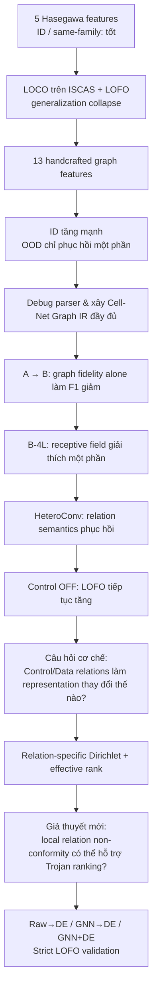
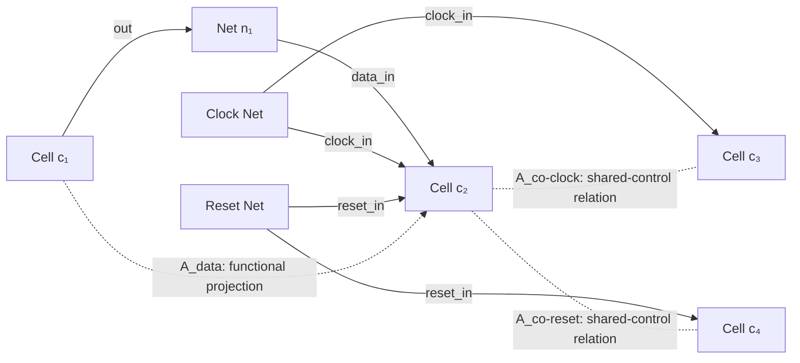

# Tái dựng và chốt câu chuyện nghiên cứu: từ giới hạn của đặc trưng Hasegawa đến đồ thị quan hệ và Dirichlet Energy

## Tóm tắt điều hành

Sau khi đọc lại bản `(1)(8).md`, đối chiếu trực tiếp với baseline **Whitten, Wolff & Papachristou, arXiv:2601.18696v7/JETTA 2026**, và rà soát hướng GNN–Hardware Trojan cùng literature về Dirichlet/Laplacian energy, đánh giá của tôi là:

**Hướng nghiên cứu của bạn có giá trị, nhưng câu chuyện khoa học mạnh nhất không phải là “đề xuất một GNN mới”, và ở trạng thái hiện tại cũng chưa đủ bằng chứng để nói “Dirichlet Energy là bộ phát hiện Trojan mới”.**

Câu chuyện mạnh nhất thực ra đã hình thành từ chính chuỗi thí nghiệm trước đây của bạn:

> **Năm đặc trưng Hasegawa có hiệu quả khi train/test cùng “hệ tọa độ” kiến trúc, nhưng mất khả năng chuyển giao khi kiến trúc thay đổi → làm giàu thành 13 đặc trưng giúp đáng kể nhưng chưa giải quyết cross-family generalization → sửa graph cho đúng vật lý cũng không tự động cải thiện → GNN thuần nhất trên graph chính xác hơn thậm chí có thể tệ hơn → chỉ khi mô hình phân biệt được semantics của các quan hệ và kiểm soát các đường tắt clock/reset thì generalization mới tăng rõ rệt → từ đó xuất hiện câu hỏi cơ chế: các loại quan hệ khác nhau làm biến dạng representation như thế nào? → relation-specific Dirichlet energy là công cụ tự nhiên để đo hiện tượng đó → bước cuối mới là kiểm tra liệu tín hiệu năng lượng này có thể trở thành anomaly signal bổ sung cho localization hay không.**

Đây là chuỗi **Problem → Why → Solution → Problem → Why → Solution** tự nhiên nhất.

Baseline chính nó đã cung cấp motivation rất mạnh: 5 đặc trưng LGFi, FFi, FFo, PI, PO đạt LOCO Micro-\(F_1=0.80\) trên 22 RS232 folds nhưng chỉ \(0.06\) trên 8 ISCAS folds; LOFO nghiêm ngặt hơn làm XGBoost rơi xuống Micro-\(F_1=0.033\). Chính tác giả baseline giải thích các đại lượng vô hướng này phụ thuộc mạnh vào kích thước và connectivity của netlist và đề xuất richer local graph representations như một hướng khắc phục. citeturn15view0turn15view1turn15view3

Điểm rất đáng giá là **bạn đã không dừng ở “GNN tốt hơn XGBoost”**. Ablation A–F của bạn cho thấy một kết quả phản trực giác có giá trị khoa học: graph Cell–Net chính xác hơn về mặt topology nhưng homogeneous message passing **tự nó không tốt hơn**; semantic relation handling và loại bỏ control shortcuts mới là yếu tố quan trọng. Config B giảm từ \(F_1=0.3518\) của graph nén A xuống \(0.2151\); 4 layers phục hồi một phần lên \(0.2589\); HeteroConv và đặc biệt Control-OFF nâng dần lên Config F \(0.5239\pm0.0454\), PR-AUC \(0.5731\pm0.0195\). fileciteturn11file18 fileciteturn11file8

**Nhưng phần Dirichlet hiện tại đang bị viết mạnh hơn bằng chứng thực nghiệm.** Dưới bảng strict multi-seed LOFO mới nhất, DE standalone \(M_1\) đạt \(F_1=0\), Early Fusion \(M_2\) có Macro-\(F_1=0.2297\), thấp hơn \(M_0=0.2738\), và Late Fusion \(M_3=0.2732\) cũng không vượt \(M_0\); PR-AUC \(0.4236\) của \(M_3\) gần như bằng \(0.4237\) của \(M_0\). Điểm tích cực thực sự là \(M_2\) cải thiện ranking PR-AUC trên `s38417` từ \(0.2885\to0.4300\) và `s38584` từ \(0.2606\to0.3353\). fileciteturn12file1 fileciteturn12file2 fileciteturn12file3

Do đó, kết luận gần-final của tôi là:

> **Hiện tại Dirichlet Energy đã đủ mạnh để trở thành một đóng góp phân tích cơ chế representation và một auxiliary non-conformity signal; chưa đủ mạnh để đứng độc lập như core Trojan detector.**

Để nâng DE thành **core methodological contribution**, bạn chỉ cần một nhóm thí nghiệm rất tập trung, không cần xây thêm nhiều model: `Raw→DE`, `GNN→DE`, `GNN+DE vs GNN` trên **cùng một canonical LOFO protocol**, thêm degree/gate-type controls và kiểm tra family-invariance. Nếu DE không thắng sau các kiểm định này, không nên ép; thesis vẫn có một câu chuyện khoa học tốt nhờ control-aware relational graph modeling.

Một vấn đề cần sửa **trước bất cứ diễn giải khoa học nào khác** là bản thảo hiện có một bất nhất lớn: Config F được báo cáo \(Macro\text{-}F_1=0.5239\pm0.0454\), nhưng bảng strict DE gọi \(M_0\) là “Config F” lại cho \(Macro\text{-}F_1=0.2738\pm0.0292\). Cả hai đều được mô tả là multi-seed LOFO trên 5 families. fileciteturn11file7 fileciteturn12file3 **Nếu hai bảng sử dụng protocol khác nhau, protocol khác ở đâu phải được viết ra tường minh; nếu không, đây là lỗi kết quả nghiêm trọng.** Đây là việc cần giải quyết trước submission.

## Câu chuyện nghiên cứu thực sự mà các thí nghiệm đã tạo ra

### Baseline không “thất bại hoàn toàn”; nó có một boundary rất rõ

Một điểm tôi khuyên sửa trong cách kể chuyện là không nên nói đơn giản:

> “5 Hasegawa features không tốt.”

Điều đó không chính xác.

Baseline cho thấy chúng **rất tốt trong một architectural context quen thuộc**. Trong LOCO, 22 RS232 variants cùng chia sẻ kiến trúc UART đạt Micro-\(F_1=0.80\), nhưng 8 ISCAS circuits chỉ đạt \(0.06\). LOFO với 5 families đưa XGBoost xuống \(0.033\). Tác giả baseline nói rõ 5 scalar features là các khoảng cách/cấu trúc tổng hợp bị chi phối bởi size và connectivity của netlist. citeturn15view0turn15view3

Vì vậy **Research Problem đầu tiên** của bạn phải là:

> **Các đặc trưng cấu trúc tuyệt đối có sức phân biệt Trojan trong cùng kiến trúc nhưng thiếu architectural invariance để chuyển giao sang một family chưa thấy.**

Đây tốt hơn nhiều so với từ “overfitting” đơn thuần. ID tốt + OOD tệ không tự động chứng minh model “học vẹt”; nó chứng minh **feature representation không invariant đối với domain shift**.

Bản baseline cũng nói random 60/20/20 split là controlled setting phục vụ XAI, không phải realistic deployment claim; LOCO/LOFO được thêm để xác định generalization boundary. citeturn15view1 Đây chính là điểm nối trực tiếp sang luận văn của bạn.

### Từ năm lên mười ba đặc trưng: thí nghiệm này vẫn rất có giá trị

Bạn từng lo rằng khi đã chuyển sang GNN, các thí nghiệm 5-vs-13 features trước đây còn ý nghĩa không. **Có, và thực ra chúng rất quan trọng.**

Trong exploratory benchmark của bản thảo, XGBoost 13 features đạt ID \(F_1\) tới khoảng \(0.9243\pm0.0241\), nhưng LOFO Macro-\(F_1\) chỉ \(0.1637\); `s38584` có thể về \(0\). Các Graph-IR tabular variants đạt LOFO Macro-\(F_1\) khoảng \(0.1346\) và \(0.1369\), trong khi HeteroTrojanGNN exploratory đạt \(0.4205\). fileciteturn11file2

Ý nghĩa khoa học của thí nghiệm này **không phải “13 tốt hơn 5”** mà là:

\[
\text{richer handcrafted topology}
\quad\Longrightarrow\quad
\text{better discrimination}
\]

nhưng

\[
\text{richer handcrafted topology}
\quad\not\Longrightarrow\quad
\text{family-invariant representation}.
\]

LOCO còn cho bằng chứng rõ hơn. Với cùng protocol validation-tuned của bạn:

| Mô hình | RS232 Micro \(F_1\) | ISCAS Micro \(F_1\) | Overall Micro \(F_1\) |
|---|---:|---:|---:|
| XGB Base-5, threshold gốc | 0.7718 | 0.0551 | 0.5245 |
| XGB Base-5, fair tuned | 0.7669 | 0.0428 | 0.5358 |
| XGB Base-13 | **0.9748** | 0.4796 | 0.8304 |
| XGB Graph-IR-5 | 0.9204 | 0.1789 | 0.6590 |
| XGB Graph-IR-13 | **0.9792** | 0.3152 | 0.7952 |
| GNN Config D, 5 feats | 0.9622 | 0.6284 | 0.8342 |
| GNN Config F, 13 feats | 0.9524 | **0.7266** | **0.8720** |

Các số này đến trực tiếp từ bảng 30-fold LOCO của bản mới nhất. fileciteturn10file0

Bảng này chứa một insight cực kỳ quan trọng mà tôi nghĩ bản thảo chưa nhấn đủ:

> **GNN không tạo bước nhảy chính trên RS232 — tabular 13 features đã gần bão hòa ở đó. Giá trị của GNN xuất hiện chủ yếu trên ISCAS, tức tại đúng nơi architecture shift mạnh hơn.**

Đây là evidence tốt hơn nhiều cho câu chuyện generalization so với chỉ báo “overall F1 tăng”.

### Graph repair không thất bại; nó đã bác bỏ một giả thuyết

Quá trình debug parser, khôi phục Net nodes, reconciliation Trojan gates, sửa missing connectivity ban đầu là **engineering**. Không nên bán bản thân việc “sửa bug” như novelty.

Nhưng thí nghiệm sau khi sửa graph lại là **scientific evidence**.

Bạn có:

\[
A:\ \text{compressed homogeneous graph},\quad F_1=0.3518
\]

chuyển sang:

\[
B:\ \text{explicit Cell-Net homogeneous graph},\quad F_1=0.2151.
\]

Tăng depth từ B-2L lên B-4L giúp \(0.2151\to0.2589\), PR-AUC \(0.1292\to0.3321\), nhưng vẫn không vượt A. fileciteturn11file18

Đây là một **negative result tốt**:

> **Graph fidelity alone is insufficient.**

Và nó loại bỏ giả thuyết ngây thơ:

\[
\text{“graph đầy đủ hơn”}\Rightarrow \text{“detector tốt hơn”}.
\]

Lý do hợp lý là Cell–Net bipartite graph làm một quan hệ gate-to-gate cần hai hops; đồng thời nếu data/control/output đều dùng chung một homogeneous operator, semantics bị trộn. Bản thân việc B-4L phục hồi một phần và HeteroConv tiếp tục phục hồi là evidence phù hợp với cơ chế này. fileciteturn11file18

Dòng phát triển nghiên cứu vì vậy nên được vẽ như sau:

**Đây là câu chuyện research tự nhiên. DE không xuất hiện vì cần thêm novelty; nó xuất hiện vì GNN đã tạo ra một câu hỏi cơ chế chưa được trả lời.**

## GNN đã chứng minh được gì, và novelty thực sự nằm ở đâu

### Vì sao GNN tốt hơn trong dữ liệu của bạn

Bằng chứng hiện có ủng hộ bốn cơ chế, nhưng mức độ mạnh khác nhau.

**Thứ nhất, contextualization.** XGBoost quyết định cho node từ vector đặc trưng \(x_i\). GNN quyết định từ một embedding có điều kiện theo neighborhood:

\[
h_i^{(\ell+1)}
=
f\left(
h_i^{(\ell)},
\{h_j^{(\ell)}:j\in\mathcal N_r(i)\}
\right).
\]

Do đó cùng một giá trị LGFi/PI/PO có thể được diễn giải khác tùy surrounding logic. LOCO cho thấy lợi ích lớn nhất của Config F nằm ở ISCAS (\(0.7266\) so với Base-13 \(0.4796\)), trong khi RS232 tabular đã rất mạnh. fileciteturn10file0 Đó là evidence phù hợp với việc local relational context giúp dưới architecture shift.

**Thứ hai, relation typing.** B→C cho thấy khi giữ explicit Cell–Net graph nhưng chuyển từ homogeneous mixing sang relation-specific HeteroConv, hiệu năng phục hồi. Config C sau đó tiếp tục tăng khi control relation được loại bỏ ở D. fileciteturn11file18turn11file8 Điều này mạnh hơn một so sánh GNN-vs-XGBoost vì nó gần với controlled intervention.

**Thứ ba, control shortcuts.** Trong factorial study của bạn, C→D tăng Macro-\(F_1\) \(+0.0774\); E→F tăng \(+0.0669\). Đồng thời feature enrichment C→E và D→F cũng có hiệu ứng dương. fileciteturn11file8 Vì effect Control-OFF xuất hiện ở cả feature spaces, đây là bằng chứng đáng tin hơn cho luận điểm rằng connectivity semantics, không chỉ node features, ảnh hưởng tới OOD behavior.

**Thứ tư, representation dynamics.** Bản thảo đã xây các fixed 2-hop projection operators và đo relation-wise Rayleigh quotient cùng effective rank thay vì chỉ nhìn classifier metrics. Đây là hướng đúng, đặc biệt vì research gần đây chỉ ra Dirichlet energy một mình không phải thước đo oversmoothing hoàn hảo và rank-based metrics có thể theo sát representation collapse tốt hơn. fileciteturn11file13 citeturn14view4

### Nhưng “dùng GNN cho Hardware Trojan” không còn novel

Yasaei et al. đã dùng GNN trên DFG cho RTL/gate-level HT và báo cáo recall 84% ở gate-level cho unknown HTs trong protocol của họ. citeturn14view0turn14view1 TrojanSAINT đã nghiên cứu inductive/sampling GNN cho gate-level netlist. citeturn13view2 SALTY năm 2025 sử dụng Jumping Knowledge GNN cùng XAI post-processing. citeturn13view3 HGAT4TJ năm 2025 thậm chí đã dùng heterogeneous graph attention để hợp nhất gate- và transistor-level structures. citeturn12search0 TrojanHound năm 2025 cũng dùng GNN kết hợp subgraph/topological reasoning. citeturn12search6

Do đó các claim kiểu:

> “Chúng tôi đề xuất GNN/Heterogeneous GNN cho Hardware Trojan.”

sẽ yếu.

Thêm nữa, LoRD vừa xuất hiện tháng 9/2026 cho thấy trên ICCAD-2025 RTL-Trojan localization, targeted structural/signal-flow heuristics có thể đạt gần hoàn hảo trên benchmark của họ mà không cần generic ML. citeturn14view3 Vì benchmark/protocol khác nhau, điều này **không bác bỏ GNN của bạn**, nhưng nó bác bỏ câu trong draft rằng “GNN quan hệ là bắt buộc đối với vi mạch phức tạp”. fileciteturn11file11

Tôi sẽ thay bằng:

> **“Under our Trust-Hub cross-family protocol, relational message passing provides substantial gains over matched tabular, homogeneous, and heuristic baselines.”**

Đây là claim mạnh và bảo vệ được.

### Engineering so với scientific evidence

| Thành phần | Bản chất | Có phải contribution? | Cách viết |
|---|---|---|---|
| Phát hiện parser bỏ/mất kết nối | Engineering/debugging | Không trực tiếp | Data-integrity prerequisite |
| Reconcile Trojan metadata với Verilog | Engineering/reproducibility | Có giá trị thực hành | Dataset audit |
| Xây Cell–Net IR | Methodological | Có, nếu gắn với controlled ablation | Representation contribution |
| A→B giảm \(F_1\) | **Scientific negative evidence** | Có | Graph fidelity alone insufficient |
| B-2L→B-4L | Scientific diagnostic | Có | Receptive-field/hop effect |
| B→C HeteroConv | Scientific ablation | Có | Relation semantics matter |
| C→D và E→F | **Scientific evidence chính** | Có | Control relations can be harmful |
| 5→13 features | Scientific evidence | Có | Rich static topology helps but is insufficient |
| LOCO RS232 vs ISCAS | **Scientific evidence chính** | Có | Architecture-shift diagnosis |
| LOFO | **Primary OOD stress test** | Có | Cross-family generalization |
| Effective rank + relation DE | Mechanistic evidence | Có | Representation analysis |
| DE \(M_1/M_2/M_3\) hiện tại | Chưa đủ làm core detector | Có giới hạn | Auxiliary/analytic signal |

Đó chính là lý do **các thí nghiệm cũ không bị “vứt đi” khi GNN không còn novel**. Chúng tạo ra một *falsification chain*: bạn đã lần lượt bác bỏ “chỉ cần thêm feature”, “chỉ cần graph đầy đủ hơn”, “chỉ cần GNN homogeneous”, và cuối cùng định vị vấn đề tại **relational semantics và control-induced propagation**. Đây mới là phần có chất nghiên cứu.

## Cầu nối đúng từ LOFO/GNN sang relation-specific Dirichlet Energy

### LOFO không phải bằng chứng cho DE

Cảm giác của bạn rằng “LOFO chưa liên quan trực tiếp tới Dirichlet” là **đúng**.

Không nên viết logic:

\[
\text{LOFO tệ}
\Rightarrow
\text{cần Dirichlet Energy}.
\]

Không có suy luận khoa học nào đảm bảo điều đó.

Logic đúng là:

\[
\text{LOFO tệ}
\Rightarrow
\text{representation hiện tại không invariant}
\]

sau đó:

\[
\text{GNN cải thiện LOFO}
\Rightarrow
\text{relational context có ích}
\]

sau đó ablation cho thấy:

\[
\text{Control ON}<\text{Control OFF}
\Rightarrow
\text{không phải mọi relation đều có ích}
\]

và **đây** mới là nơi DE đi vào:

\[
\text{“Các relation khác nhau đang làm gì với geometry của embedding?”}
\]

\[
\Downarrow
\]

\[
\text{relation-specific Dirichlet / Rayleigh / rank analysis}.
\]

Relation-aware energy đã có cơ sở lý thuyết trong heterogeneous GNN literature: NeurIPS 2022 trực tiếp xây heterogeneous GNN từ một relation-aware energy function để xử lý trade-off giữa heterophily, long-range dependency và oversmoothing. citeturn13view6 Đồng thời DE đã được dùng rộng rãi để nghiên cứu smoothing của GNN, nhưng literature mới cảnh báo rằng DE không nên là bằng chứng duy nhất cho oversmoothing; effective rank là đối chứng quan trọng. citeturn11view9turn14view4

Do đó **erank + relation-specific Rayleigh/DE** trong draft của bạn là kết hợp tốt hơn nhiều so với chỉ nói “DE tăng nên oversmoothing giảm”.

### Từ diagnostic đến Trojan non-conformity là một giả thuyết mới riêng biệt

Sau khi đã dùng DE để hiểu propagation, bạn có thể đặt một câu hỏi thứ hai:

> Nếu benign logic có một mức relational consistency tương đối ổn định trong functional neighborhood, liệu Trojan gate/subgraph có tạo ra local energy residual bất thường so với các node cùng chức năng hay không?

Đây mới là cầu nối sang anomaly detection.

CVPR 2026 ANoCo cung cấp một precedent rất phù hợp về **ý tưởng**, khi diễn giải graph Laplacian energy như chi phí để một query bất thường “conform” với normal manifold; tuy nhiên ANoCo xây bipartite query-to-normal graph và dùng optimization-induced feature drift, **không phải** đơn giản lấy local Dirichlet energy rồi threshold. Vì vậy có thể trích dẫn ANoCo để hỗ trợ *framing non-conformity*, nhưng không được viết rằng ANoCo “xác nhận DE-only detector của chúng ta”. citeturn12search2

Bản hiện tại đang hơi vượt giới hạn này. Strict experiment của chính bạn cho thấy DE-only:

\[
M_1^S=M_1^U:
\qquad Macro-F_1=0,\qquad PR\text{-}AUC=0.0131.
\]

fileciteturn12file3

Vì vậy câu:

> “Dirichlet Energy được nâng thành actionable structural non-conformity anomaly detector”

hiện **chưa được bằng chứng hỗ trợ**.

Cách viết chính xác hơn là:

> **“We investigate relation-specific local Dirichlet residuals as a structural non-conformity signal and evaluate whether they provide complementary information to relational GNN predictions.”**

Nếu các thí nghiệm bổ sung thắng, lúc đó mới nâng lên “detector”.

### Định nghĩa toán học nên chốt như sau

Gọi tập Cell là \(\mathcal C\), tập Net là \(\mathcal N\). Định nghĩa:

\[
O\in\{0,1\}^{|\mathcal C|\times |\mathcal N|},
\qquad
O_{cn}=1
\]

nếu cell \(c\) lái net \(n\), và với mỗi loại input relation \(r\in\{\text{data},\text{clock},\text{reset}\}\):

\[
I_r\in\{0,1\}^{|\mathcal N|\times|\mathcal C|},
\qquad
(I_r)_{nc}=1
\]

nếu net \(n\) đi vào cell \(c\) qua pin loại \(r\).

Khi đó directed cell-to-cell projection là:

\[
A_r^{\rightarrow}=OI_r.
\]

Đây là functional projection phù hợp cho message flow. Với control sharing, bạn còn nên phân biệt rõ **control-flow** với **co-control**:

\[
A_{\text{co-clock}}
=
I_{\text{clock}}^\top I_{\text{clock}}
-\operatorname{diag}(\cdot),
\]

\[
A_{\text{co-reset}}
=
I_{\text{reset}}^\top I_{\text{reset}}
-\operatorname{diag}(\cdot).
\]

Nếu một clock net nối tới \(k\) cells, phép chiếu co-control có thể tạo tới \(O(k^2)\) pairwise co-memberships; đây chính là toán tử tốt để định lượng “shortcut pressure”.

Vì classical combinatorial Laplacian cần một toán tử đối xứng dương bán xác định, phần **diagnostic DE** nên ghi tường minh phép symmetrization:

\[
W_r
=
\frac{A_r^\rightarrow+(A_r^\rightarrow)^\top}{2},
\]

\[
D_r=\operatorname{diag}(W_r\mathbf 1),
\qquad
L_r=D_r-W_r.
\]

Nếu muốn giữ directed semantics trong energy operator thì phải dùng một directed-Laplacian formulation được định nghĩa riêng; không nên âm thầm gọi Laplacian của directed adjacency là classical Dirichlet energy. Literature cũng có các mở rộng Laplacian cho directed graphs, nên điểm này cần ghi chính xác. citeturn11view13

Với embedding \(H^{(\ell)}\):

\[
E_r^{(\ell)}
=
\frac{
\operatorname{Tr}
\left[
(H^{(\ell)})^\top
L_r
H^{(\ell)}
\right]
}{
\operatorname{Tr}
\left[
(H^{(\ell)})^\top
D_r
H^{(\ell)}
\right]+\epsilon
}.
\]

Đây rất gần Rayleigh quotient mà bản mới đã dùng trên fixed relation-specific projection operators. fileciteturn11file13

**Điểm cực kỳ quan trọng:** cùng một \(L_r\) phải được giữ cố định khi so Control-ON và Control-OFF. Bản hiện tại đã làm đúng nguyên tắc này. fileciteturn11file13 Nếu mỗi model được đo trên graph riêng của nó thì thay đổi energy có thể chỉ là hậu quả của đổi operator, không phải đổi representation.

Local energy cho cell \(i\):

\[
e_{i,r}
=
\frac{1}{d_{i,r}+\epsilon}
\sum_j
W_{ij}^{(r)}
\left\|
h_i-h_j
\right\|_2^2.
\]

Nhưng **không nên dùng trực tiếp \(e_{i,r}\)** làm anomaly score vì nó dễ phụ thuộc degree, cell type và logic depth. Tôi khuyên fit train-only robust reference:

\[
m_{r,g,b}
=
\operatorname{median}
\left\{
e_{i,r}:
\text{gate-type}(i)=g,\,
\text{degree-bin}(i)=b
\right\},
\]

\[
s_{r,g,b}
=
1.4826\operatorname{MAD}
\left(
e_{i,r}
\right)+\epsilon,
\]

\[
z_{i,r}
=
\frac{e_{i,r}-m_{r,g,b}}
{s_{r,g,b}}.
\]

Tốt hơn nữa, thêm logic-depth bin hoặc fit robust train-only regression:

\[
\log(e_{i,r}+\epsilon)
=
\beta_0+
\beta_1\log(d_{i,r}+1)
+
\beta_2\,\text{gate-type}_i
+
\beta_3\,\text{logic-depth}_i
+
\varepsilon_i,
\]

và lấy residual \(\hat{\varepsilon}_{i,r}\) làm non-conformity.

Khi đó:

\[
S_{\text{DE}}(i)
=
\sum_r\lambda_r\phi(z_{i,r}),
\]

với \(\phi(z)=\max(0,z)\) nếu giả thuyết là Trojan tạo **high-energy discontinuity**, hoặc \(|z|\) nếu giả thuyết là Trojan có thể lệch cả hai hướng. Lựa chọn này phải được quyết định trên train/validation, không nhìn test family.

Sơ đồ entity–relation nên thể hiện rõ hai khái niệm khác nhau:

**Đây chính là phần conceptual novelty có tiềm năng nhất:** không hỏi “graph energy tổng thể là bao nhiêu?”, mà hỏi **energy bị phân rã theo functional relation nào, và relation nào tạo non-conformity hữu ích/harmful cho OOD Trojan localization?**

## Những thí nghiệm còn thiếu để DE trở thành đóng góp lõi

### Trước hết phải thống nhất một canonical evaluation contract

Bản thảo hiện có **hai bộ kết quả cùng gọi Config F nhưng không tương thích**:

| Nơi báo cáo | Model được mô tả | Macro \(F_1\) | PR-AUC |
|---|---|---:|---:|
| Config A–F | Config F, HeteroConv, Control OFF, 13 feats | **0.5239 ± 0.0454** | **0.5731 ± 0.0195** |
| Strict DE table \(M_0\) | “Config F (HeteroConv, Control OFF)” | **0.2738 ± 0.0292** | **0.4237 ± 0.0683** |

fileciteturn11file7 fileciteturn12file3

Đây không phải khác biệt nhỏ. \(0.5239\to0.2738\) là giảm gần một nửa.

Ngoài ra, executive summary nói \(M_3\) đạt `s15850=0.8000`, `s38417=0.2838`, `s38584=0.0571`, trong khi strict per-family table mới nhất báo trung bình \(M_3\) lần lượt \(0.5907\), \(0.1306\), \(0.1291\); \(0.2838\) thực chất xuất hiện ở Seed 42 trên `s38417`. fileciteturn13file0 fileciteturn12file2

**Góp ý thẳng:** trước khi thêm bất cứ experiment mới nào, hãy tạo **một CSV/table duy nhất là source of truth** với các cột:

`method × outer_fold × seed × train_families × val_policy × threshold × checkpoint_policy × F1 × PR-AUC × MCC × FP/1000`.

Từ table này sinh **tất cả** bảng trong thesis. Không nhập kết quả thủ công vào markdown nữa.

### Bộ ablation quyết định vị thế của DE

Tôi khuyên chạy chính xác matrix sau trên **cùng graph, cùng outer fold, cùng seed, cùng threshold policy**:

| Variant | Signal | Câu hỏi | Kết quả cần thấy nếu DE là core contribution |
|---|---|---|---|
| \(R_0\) | Raw \(X\) → classifier | Tabular/ML baseline | Reference |
| \(D_X\) | **Raw \(X\) → DE** | DE có intrinsic signal trước GNN không? | PR-AUC > random và ổn định ≥4/5 families |
| \(G_0\) | GNN → classifier | Config F | Main backbone |
| \(D_H\) | **Frozen GNN \(H\) → DE-only** | GNN có làm non-conformity rõ hơn không? | \(D_H>D_X\) |
| \(G+D\) early | \(H\) hoặc \(X\)+local residual | DE có incremental representation value? | vượt \(G_0\) trên OOD |
| \(G+D\) late | \(\operatorname{logit}p_G+\sum_r\beta_rz_r\) | DE có complementary score? | vượt \(G_0\) ổn định |
| Degree-conditioned DE | residualized \(z_{i,r}\) | Có chỉ đang đo degree? | signal vẫn còn |
| Relation-shuffled DE | shuffle \(r\) labels | Semantics thực sự quan trọng? | performance/signal giảm |
| Degree-preserving rewiring | topology control | Có chỉ đo connectivity density? | real relation graph thắng |

Current \(M_1\) không thay thế `Raw→DE` theo nghĩa tôi muốn nếu DE đang được tính trên một representation đã có model-dependent processing. `Raw→DE` phải được định nghĩa tuyệt đối rõ: **standardized raw cell signal, no learned GNN embeddings, no Trojan-label-informed transform**.

Kết quả hiện có cho \(M_0\)–\(M_3\) thực ra đang nói:

\[
M_1:
0.0000
\]

\[
M_2:
F_1=0.2297,\quad AP=0.4147
\]

\[
M_0:
F_1=0.2738,\quad AP=0.4237
\]

\[
M_3:
F_1=0.2732,\quad AP=0.4236.
\]

fileciteturn12file3

Do đó **không được kết luận \(M_3\) cải thiện GNN ở aggregate level**. Nó không cải thiện theo các số đang báo cáo.

Điểm có thể giữ là:

\[
AP_{\text{s38417}}:
0.2885\rightarrow0.4300
\]

và

\[
AP_{\text{s38584}}:
0.2606\rightarrow0.3353
\]

ở Early Fusion \(M_2\). fileciteturn12file1turn12file4

Đây là một hiện tượng thú vị: **DE có thể làm ranking tốt hơn cho hard sequential families nhưng làm thresholded classification toàn cục tệ hơn**. Research question nên xoay vào đó thay vì gọi DE detector đã thành công.

Một giả thuyết hợp lý cần kiểm:

> Relation-specific energy residual có information gain cục bộ trên các OOD families khó, nhưng distribution của magnitude/threshold không family-invariant.

Nếu giả thuyết này đúng, nó giải thích rất đẹp vì sao \(M_1=0\), \(M_2\) tăng AP ở một số families, nhưng \(M_3\) gần như không thay đổi global F1.

### Thí nghiệm nối DE trực tiếp với LOFO

Đây là mắt xích còn thiếu nhất.

Đừng chỉ hỏi:

> “DE có phân biệt Trojan không?”

Hãy hỏi:

> **“DE residual có ổn định xuyên family hơn raw Hasegawa/graph features không?”**

Có thể đo với:

\[
W_1\left(P_{\text{train}}(z_r),P_{\text{held-out}}(z_r)\right)
\]

hoặc MMD giữa train families và held-out family.

Sau đó huấn luyện một **family probe**:

\[
\hat f_{\text{family}}(X),\quad
\hat f_{\text{family}}(H),\quad
\hat f_{\text{family}}(Z_{\text{DE}}).
\]

Một representation tốt cho mục tiêu cross-family nên lý tưởng có:

\[
I(Z;\text{family})\downarrow
\]

nhưng vẫn giữ:

\[
I(Z;\text{Trojan})\uparrow.
\]

Trong thực nghiệm, không cần ước lượng mutual information phức tạp; family-classification accuracy/AUROC là proxy dễ hiểu.

Nếu DE residual có **family probe thấp hơn raw features nhưng Trojan ranking vẫn tốt**, khi đó bạn mới có cầu nối rất mạnh:

> Hasegawa coordinates encode host identity → relation-conditioned residualization removes part of host geometry → local non-conformity transfers better.

Đó mới là mối liên hệ trực tiếp giữa **LOFO và DE** mà bạn đang cảm thấy thiếu.

### Protocol tôi khuyên chốt

Dữ liệu hiện tại của bạn có 30 circuits thuộc 5 family folds; baseline cũng dùng đúng các families RS232, s15850, s35932, s38417, s38584. citeturn15view1 Bản draft mô tả Cell–Net corpus gồm 47,464 cells, 61,067 nets và khoảng 366–370 labeled Trojan cells tùy nominal-vs-netlist reconciliation. fileciteturn12file5

**Primary:** LOFO 5 outer folds.

Trong mỗi outer fold, validation phải được tạo **theo circuit/family groups**, không random gates từ cùng circuit nếu hyperparameter/threshold tuning có thể nhìn thấy host distribution của test-like circuits.

**Secondary:** 30-fold LOCO. Đây là nơi rất tốt để nghiên cứu architecture dependence, đặc biệt so RS232 vs ISCAS; nhưng không gọi LOCO là strict cross-family OOD vì RS232 folds có các biến thể cùng architecture. Baseline chính nó giải thích điều này. citeturn15view0

**ID:** giữ lại như sanity check và để tái lập baseline; không dùng làm headline contribution.

Với imbalance mạnh, PR-AUC nên là ranking metric chính; sau đó Macro-\(F_1\) ở validation-locked threshold, MCC, Recall@fixed-FP/1000, Precision@10/Recall@50. Baseline cũng nhấn mạnh false-positive density do gate-level class imbalance. citeturn11view0

### Statistical testing cần viết thận trọng hơn

Bản mới đã tiến bộ khi tách seed variance và family variance và có family-averaged \(N=5\) analysis. fileciteturn15file6 Nhưng tôi vẫn khuyên **không dùng 15 = 5 folds × 3 seeds làm 15 đơn vị độc lập chính**. Seed là repeated stochastic realization của cùng family fold.

Với 5 independent family units, exact paired sign/permutation test có độ phân giải rất thấp. Nếu cả 5 differences cùng một chiều, một-sided exact probability là \(1/32=0.03125\); two-sided sẽ khoảng \(0.0625\). Vì vậy con số Wilcoxon \(p=0.0312\) trong draft chỉ có thể được diễn giải mạnh nếu bạn ghi rõ **one-sided hypothesis đã được định trước**. fileciteturn15file1

Tôi không khuyên viết:

> “loại trừ hoàn toàn nghi vấn về giả sao chép hay biến thiên ngẫu nhiên.”

Thay bằng:

> “The effect is directionally consistent across all five held-out families; family-level inference is nevertheless limited by the small number of independent families.”

Đây học thuật hơn và reviewer khó bắt lỗi hơn.

## Góp ý cốt lõi và thiết kế tối thiểu trước submission

### Góp ý cốt lõi (Major)

**Major — cần sửa ngay: thống nhất kết quả Config F/M0.** Đây là vấn đề nghiêm trọng nhất toàn bản. \(0.5239\) và \(0.2738\) cùng được gắn với Config F multi-seed LOFO mà chưa có lời giải thích đủ rõ. fileciteturn11file7 fileciteturn12file3 Nếu khác train/val split, checkpoint policy, metric aggregation hoặc thresholding, đặt tên protocol khác nhau. Nếu không khác, một trong hai pipeline/table sai.

**Major — phần Abstract đang overclaim Dirichlet.** Câu “DE được chuyển thành actionable structural non-conformity anomaly detector” không phù hợp với strict \(M_1 F_1=0\), và “M3 yields consistent gains” không phù hợp với aggregate \(M_3=0.2732<0.2738=M_0\), PR-AUC cũng \(0.4236<0.4237\). fileciteturn12file3 Hiện nên gọi nó là **relation-specific representation diagnostic and auxiliary non-conformity signal**.

**Major — không nói “GNN là bắt buộc”.** GNN-based HT literature đã dày, và LoRD 2026 cho thấy heuristic structural signatures có thể rất mạnh trên một benchmark khác. citeturn14view0turn13view2turn13view3turn14view3 Contribution nên là **semantic relational modeling under cross-family shift**, không phải GNN itself.

**Major — claim oversmoothing phải dựa trên triangulation, không chỉ DE.** Research gần đây chỉ ra Dirichlet-style measures có thể không bắt đúng representation collapse, trong khi effective rank nhiều khi phản ánh tốt hơn. citeturn14view4 Vì bạn đã có erank, hãy viết:

\[
\text{performance}
+
\text{effective rank}
+
R_{\text{data/control}}
+
\text{edge interventions}
\]

cùng hỗ trợ một *control-induced representation degradation hypothesis*. Không nói DE một mình “chứng minh oversmoothing”.

**Major — cần degree-conditioned local DE.** Local Dirichlet energy có thể tăng đơn giản vì node có nhiều neighbors. Dù bạn đã có degree-matched edge deletion để kiểm control-edge mechanism, anomaly score cấp node vẫn cần residual hóa degree/gate type. Nếu không, reviewer có thể nói DE detector chỉ là một centrality surrogate.

**Major — cần thí nghiệm `Raw→DE` thật sạch.** Đây là experiment quyết định DE có **intrinsic structural signal** hay chỉ đọc lại geometry do GNN đã tạo. Nếu chỉ có \(H\to DE\), reviewer hoàn toàn có thể hỏi: “GNN đã tách classes trước rồi, DE chỉ đo hậu quả.”

**Major — cần làm DE–LOFO link trực tiếp bằng family stability.** Đây chính xác là chỗ câu chuyện hiện tại còn hụt. So sánh distribution shift hoặc family-probe accuracy của raw features, GNN embeddings và DE residuals. Nếu DE không stable hơn qua families, đừng claim nó giải quyết cross-family generalization.

**Major — sửa arithmetic về class imbalance.** Bản thảo ghi 47,464 cells, 370 nominal Trojan và 47,094 clean nhưng lại nói khoảng \(1:247\). fileciteturn12file5 Các số đó cho:

\[
\frac{47094}{370}\approx127.3,
\]

tức khoảng **1 Trojan : 127 benign**, hoặc khoảng 1:129 nếu dùng 366 actual Trojan, không phải 1:247. Đây là lỗi nhỏ về phép tính nhưng rất dễ làm reviewer mất niềm tin vào data audit.

### Góp ý hoàn thiện (Minor)

Thuật ngữ “Zero-Label Leakage” cần dùng cẩn thận. Bản thảo nói extraction không dùng label và median/MAD được fit train-only; nếu \(M_1^S\) dùng labels của training set để xây benign-normal reference thì tên đúng hơn là **zero test-label leakage / train-only supervised calibration**, không phải hoàn toàn “zero-label”. Bản draft đã phân biệt \(M_1^S\) supervised-normal và \(M_1^U\) unsupervised robust, nên hãy làm rõ ngay trong definition. fileciteturn12file0turn12file3

Cụm “causal” cho edge-removal experiments nên giảm xuống **controlled intervention evidence** trừ khi bạn xây causal estimand/SCM thực sự. Random removal, degree-matched removal, clock/reset separation là ablation rất tốt, nhưng chưa đủ để tuyên bố causal identification theo nghĩa thống kê.

Các kết quả exploratory Exp 1–6 và controlled Config A–F nên được tách vai trò. Exp 1–6 là **discovery phase**; A–F là **confirmatory ablation phase**. Không nên trộn các con số \(0.4205\) và \(0.5239\) như thể cùng một experimental contract. fileciteturn11file2turn11file18

Soft gating \(F_1=0.4949\), giữa Control-ON và hard Control-OFF, là một supporting experiment thú vị, nhưng learned gates \(0.5412\) vs \(0.4945\) chưa chênh đủ lớn để diễn giải là mạng “tự động phát hiện control edges nguy hiểm” một cách mạnh. fileciteturn12file15 Hãy xem nó là corroborative evidence.

## Câu chuyện final tôi khuyên dùng

Cốt lõi của paper/thesis nên được viết thành **ba discoveries nối tiếp nhau**, không phải ba kỹ thuật rời rạc.

### Discovery về generalization

> **Absolute structural coordinates are predictive but architecture-dependent.**

Năm Hasegawa features là strong within-context detector nhưng LOCO-ISCAS và LOFO chỉ ra failure dưới cross-architecture shift. Thêm graph-derived tabular features cải thiện đáng kể nhưng không loại bỏ failure. citeturn15view0turn15view1 fileciteturn11file2

### Discovery về relational semantics

> **Structural fidelity alone is not sufficient; the semantics of message-passing relations determine whether richer connectivity helps or hurts OOD localization.**

Cell–Net repair không tự động cải thiện. Homogeneous explicit graph tệ hơn compressed graph; relation-aware propagation phục hồi; control-edge removal đem lại gain nhất quán; 13 features bổ sung thêm gain. fileciteturn11file18turn11file8

Đây theo tôi là **đóng góp chính chắc chắn nhất hiện nay**.

### Discovery/hypothesis về energy

> **Relation-specific energy reveals how control and functional relations shape embedding geometry; local energy residuals may provide a complementary non-conformity signal, but their cross-family calibration remains unresolved.**

Điều này vừa phù hợp literature về relation-aware energy/oversmoothing, vừa trung thực với \(M_1/M_2/M_3\) hiện tại. citeturn13view6turn14view4turn12search2 fileciteturn12file3

Câu chuyện hoàn chỉnh:

```mermaid
flowchart LR
    P1["Problem<br/>Hasegawa works ID / same architecture<br/>but collapses cross-family"]
    W1["Why<br/>Absolute circuit coordinates<br/>encode host geometry"]
    S1["Solution attempt<br/>Richer graph features"]

    P2["Problem<br/>13 features improve but<br/>remain weak under LOFO"]
    W2["Why<br/>Static vectors do not model<br/>relational context"]
    S2["Solution<br/>Explicit Cell-Net graph"]

    P3["Unexpected problem<br/>Faithful graph alone gets worse"]
    W3["Why<br/>Hop mismatch + semantic mixing<br/>+ control shortcuts"]
    S3["Solution<br/>Relation-aware GNN<br/>Control-aware propagation"]

    P4["New scientific question<br/>Why does Control-OFF help?"]
    W4["Mechanism<br/>Relation-dependent changes<br/>in representation geometry"]
    S4["Analysis<br/>Effective rank +<br/>relation-specific DE"]

    P5["New hypothesis<br/>Can non-conformity localize Trojans<br/>across unseen families?"]
    S5["Validation<br/>Raw→DE / GNN→DE / GNN+DE<br/>degree controls + family stability"]

    P1 --> W1 --> S1 --> P2 --> W2 --> S2 --> P3 --> W3 --> S3 --> P4 --> W4 --> S4 --> P5 --> S5
```

Đây là lần đầu tiên trong toàn bộ quá trình tôi nghĩ **LOFO và Dirichlet Energy thực sự được nối bằng một logic không gượng ép**: LOFO không “sinh ra DE”; LOFO phát hiện vấn đề invariance, GNN ablations định vị vấn đề ở relations, và DE được đưa vào để **định lượng relation-dependent representation geometry và kiểm tra non-conformity**.

### Tên luận văn tôi khuyên chốt

Với **bằng chứng hiện tại**, tôi sẽ giảm claim trong title một chút:

**English**

> **Cross-Family Gate-Level Hardware Trojan Localization with Control-Aware Relational Circuit Graphs: A Relation-Specific Dirichlet Energy Analysis**

**Tiếng Việt**

> **Định vị Hardware Trojan mức cổng xuyên họ bằng đồ thị mạch quan hệ nhận biết điều khiển: Phân tích năng lượng Dirichlet theo quan hệ**

Tên này tốt hơn title hiện tại vì nó nói chính xác: **cross-family localization là bài toán; control-aware relational graph là phương pháp chính; DE là analysis**.

Nếu nhóm thí nghiệm cuối chứng minh:

\[
GNN+DE > GNN
\]

một cách ổn định trên held-out families, degree-conditioned residual vẫn có signal, relation shuffle làm signal mất đi, và DE residual ít family-specific hơn raw features, thì paper có thể dùng title mạnh:

> **Relation-Specific Dirichlet Non-Conformity on Control-Aware Circuit Graphs for Cross-Family Hardware Trojan Localization**

Tiếng Việt:

> **Độ bất tương đồng Dirichlet theo quan hệ trên đồ thị mạch nhận biết điều khiển cho định vị Hardware Trojan xuyên họ**

### Bộ thí nghiệm tối thiểu tôi cho là đủ để dừng

Bạn **không cần mở thêm nhiều nhánh nghiên cứu**. Tôi sẽ chỉ làm bốn block cuối:

| Ưu tiên | Việc cần hoàn thành | Vì sao bắt buộc |
|---|---|---|
| **P0** | Reconcile Config F \(0.5239\) vs \(M_0\) \(0.2738\); sinh mọi bảng từ một results table | Hiện là blocker lớn nhất |
| **P1** | Same-protocol `Raw→DE`, `GNN→DE`, `GNN`, `GNN+DE` | Xác định DE có independent/incremental value |
| **P1** | Degree + gate-type + depth conditioned DE; relation-label shuffle | Loại bỏ explanation “DE chỉ là degree/connectivity proxy” |
| **P1** | Family stability: raw vs \(H\) vs DE residual, cộng family probe | Tạo cầu nối thực sự với LOFO |
| **P2** | Báo cáo seed-averaged family effects + effect size/CI; không dùng pooled \(N=15\) làm primary inference | Statistical integrity |

Nếu kết quả sau cùng là:

\[
D_X \text{ có signal},\qquad
D_H>D_X,\qquad
GNN+DE>GNN,
\]

và advantage còn tồn tại sau degree/relation controls, **DE xứng đáng là core contribution**.

Nếu kết quả là:

\[
D_X\approx0,\qquad
D_H\text{ có pattern},\qquad
GNN+DE\approx GNN,
\]

thì kết luận đúng phải là:

> **Dirichlet Energy is a mechanistic representation diagnostic, not a detector.**

Nếu đúng như strict table hiện tại:

\[
M_1=0,\qquad
M_2\text{ improves AP only on selected hard families},\qquad
M_3\approx M_0,
\]

thì tôi sẽ **không cố cứu DE bằng thêm narrative**. Tôi sẽ giữ DE như một analytical contribution rất hợp lý, còn contribution chính của thesis là:

> **Cross-family Hardware Trojan localization through control-aware relational circuit modeling, supported by controlled evidence that graph fidelity alone is insufficient and that relation semantics—especially control-network handling—govern OOD generalization.**

Đánh giá thẳng thắn cuối cùng của tôi: **đây vẫn là một câu chuyện nghiên cứu tốt, thậm chí tốt hơn câu chuyện “tôi đề xuất một HeteroGNN mới”.** Những thất bại trước đây không phải phần thừa; chúng chính là bằng chứng tạo nên research story. Điều duy nhất tôi không khuyên làm là **ép Dirichlet Energy thành detector chính khi dữ liệu hiện tại chưa nói điều đó**. Chốt consistency của kết quả và làm bốn block kiểm định trên là đủ để biết DE nên nằm ở tiêu đề chính hay ở phần mechanistic analysis.